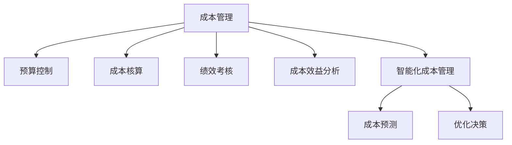

                 

# 成本管理：提高利润率的精细化操作

> 关键词：成本管理, 精细化操作, 利润率, 预算控制, 成本降低, 生产效率, 运营优化, 资源配置, 指标体系, 绩效考核

## 1. 背景介绍

### 1.1 问题由来
在当今市场竞争激烈的环境中，企业需要不断地优化成本结构，以提高利润率并保持竞争优势。成本管理不再是一个简单的记账和预算控制过程，而是一个涉及公司运营方方面面的精细化管理活动。许多企业面临着成本增长过快、成本结构不合理、资源浪费等问题，迫切需要通过成本管理来改善经营状况，提升整体盈利能力。

### 1.2 问题核心关键点
成本管理的核心关键点包括：
1. 如何定义成本和资源。成本不仅包括直接费用（如原材料、人工、设备维护），还包括间接费用（如制造费用、管理费用、研发费用）。
2. 如何有效监控和控制成本。这要求建立一套完整的预算控制、成本核算和绩效考核体系。
3. 如何实现成本效益分析。通过分析成本与收益的关系，优化资源配置，提升整体运营效率。
4. 如何适应动态变化的环境。成本管理需要应对市场、技术、政策等多方面的不确定性。
5. 如何提高成本管理的智能化水平。利用数据分析、AI技术，实现成本预测和优化决策。

### 1.3 问题研究意义
成本管理的成功实施对企业有着深远的影响：
1. 增强企业竞争力。有效的成本管理能够帮助企业降低成本，提高利润率，增强市场竞争力。
2. 优化资源配置。通过对成本的精细化管理，企业可以实现资源的有效配置，避免资源浪费。
3. 提升运营效率。精细化操作能够发现并解决运营中的效率瓶颈，提升整体运营效率。
4. 强化风险控制。通过监控成本变动，企业可以提前预见并应对潜在的风险。
5. 推动企业可持续发展。科学合理地管理成本，能够确保企业长期稳定发展。

## 2. 核心概念与联系

### 2.1 核心概念概述

为更好地理解成本管理的核心概念，本节将介绍几个密切相关的核心概念：

- 成本管理(Cost Management)：涉及预算控制、成本核算、绩效考核等诸多环节，通过精细化操作提升成本效益。
- 预算控制(Budget Control)：根据企业目标和资源情况，合理分配预算，防止超支。
- 成本核算(Cost Accounting)：通过记录、计算和分析成本数据，评估成本表现。
- 绩效考核(Performance Evaluation)：根据成本控制和预算完成情况，对管理层和员工进行考核。
- 成本效益分析(Cost-Benefit Analysis)：分析成本与收益的关系，评估资源配置的合理性。
- 智能化成本管理(Intelligent Cost Management)：结合数据分析和AI技术，实现成本预测和优化决策。

这些核心概念之间的逻辑关系可以通过以下Mermaid流程图来展示：



这个流程图展示的成本管理的关键概念及其之间的关系：

1. 成本管理是整个成本管理过程的总体框架。
2. 预算控制和成本核算分别从预算分配和成本记录两个方面进行支持。
3. 绩效考核通过考核管理层的成本控制能力，鼓励员工积极参与。
4. 成本效益分析用于评估成本控制的成效。
5. 智能化成本管理结合数据分析和AI技术，进一步提升成本管理能力。

这些概念共同构成了企业成本管理的核心框架，帮助企业从多个维度实现精细化操作。

## 3. 核心算法原理 & 具体操作步骤

### 3.1 算法原理概述

成本管理的核心算法原理主要基于预算控制、成本核算和绩效考核三大环节。其基本流程为：
1. 设定预算目标。根据历史数据和未来需求，合理设定各部门的预算上限。
2. 监控预算执行。定期检查预算执行情况，防止超支。
3. 成本核算与分析。记录成本数据，定期进行成本分析，评估成本控制效果。
4. 绩效考核。根据成本控制和预算完成情况，对管理层和员工进行考核。
5. 成本效益分析。通过对比成本和收益，优化资源配置，提升整体效益。

### 3.2 算法步骤详解

具体来说，成本管理的实施步骤包括以下几个关键环节：

#### 步骤1: 预算编制与下发
- **编制预算**：根据企业的历史数据、市场趋势和战略目标，设定各部门的预算目标。
- **审批与下发**：经过高层审批后，将预算下发到各相关部门。

#### 步骤2: 预算监控与控制
- **实时监控**：通过成本管理系统，实时监控各部门的预算执行情况，发现异常及时调整。
- **预警机制**：当预算执行偏离目标时，自动触发预警，通知相关部门。

#### 步骤3: 成本核算与分析
- **记录成本**：按照预算目标和实际支出，详细记录各部门的成本数据。
- **定期分析**：定期进行成本分析，识别成本变动的原因和趋势。
- **成本报告**：生成成本报告，供管理层和员工查阅。

#### 步骤4: 绩效考核与反馈
- **考核指标**：设定与成本控制相关的考核指标，如预算完成率、成本控制率等。
- **考核评估**：根据考核指标，对管理层和员工进行评估。
- **反馈改进**：根据考核结果，提供改进建议，提升成本控制能力。

#### 步骤5: 成本效益分析
- **成本效益模型**：建立成本效益模型，评估成本与收益的关系。
- **资源优化**：通过模型分析，优化资源配置，提升整体效益。
- **决策支持**：提供成本效益分析报告，支持高层决策。

### 3.3 算法优缺点

成本管理的优点包括：
1. 提高决策质量：通过系统化、量化的分析，提升管理层的决策质量。
2. 优化资源配置：通过成本效益分析，实现资源的合理分配和优化。
3. 强化风险控制：通过预算监控和预警机制，提前发现并规避风险。
4. 提升运营效率：通过精细化操作，发现运营中的效率瓶颈，提升整体运营效率。
5. 推动绩效改善：通过绩效考核和反馈，激励员工积极参与成本控制。

然而，成本管理也存在一些局限性：
1. 数据质量要求高：成本管理依赖于准确、完整的数据，数据质量问题可能导致分析结果偏差。
2. 实施难度大：涉及预算、核算、考核等多个环节，需要综合管理能力。
3. 动态变化挑战：市场、技术、政策等因素的变化，对成本管理提出了更高的要求。
4. 管理复杂度高：大中型企业涉及多个部门和业务，成本管理复杂度高。
5. 人员素质要求高：成本管理需要高素质的管理者和财务人员。

### 3.4 算法应用领域

成本管理的应用领域非常广泛，涵盖多个行业和企业规模：

1. **制造业**：通过精细化操作，提升生产效率，降低制造费用。
2. **服务业**：优化资源配置，提升服务质量，降低运营成本。
3. **零售业**：优化库存管理，降低库存成本，提升销售效率。
4. **金融业**：控制风险，优化投资组合，提升收益。
5. **政府部门**：提高资金使用效率，优化公共服务。

这些领域的企业在成本管理实践中都取得了显著成效，证明了成本管理的重要性和有效性。

## 4. 数学模型和公式 & 详细讲解 & 举例说明

### 4.1 数学模型构建

本节将使用数学语言对成本管理的基本模型进行描述。

假设企业有n个部门，每个部门的预算为B_i，实际支出为C_i，预算完成率为P_i，成本控制率为R_i，考核指标为K_i，收益为R_i。则成本管理的数学模型可以表示为：

$$
\begin{align*}
\max & \sum_{i=1}^n K_i \cdot P_i \\
\text{Subject to:} & \\
& \sum_{i=1}^n B_i = B \\
& \sum_{i=1}^n C_i \leq C \\
& P_i = \frac{C_i}{B_i} \\
& R_i = \frac{C_i}{C_i} \\
& P_i + R_i = 1
\end{align*}
$$

其中，B为总预算，C为总实际支出，K为考核指标系数，P为预算完成率，R为成本控制率。

### 4.2 公式推导过程

根据上述数学模型，我们可以进行以下推导：

- **预算目标设定**：
$$
\sum_{i=1}^n B_i = B
$$

- **预算监控与控制**：
$$
\sum_{i=1}^n C_i \leq C
$$

- **成本核算与分析**：
$$
P_i = \frac{C_i}{B_i} \\
R_i = \frac{C_i}{C_i}
$$

- **绩效考核与反馈**：
$$
P_i + R_i = 1
$$

通过这些公式，我们可以建立完整的成本管理体系，实现精细化操作和绩效优化。

### 4.3 案例分析与讲解

以某制造企业为例，其预算和成本管理流程如下：

1. **预算编制**：根据历史数据和市场需求，设定各部门的预算目标。例如，销售部门预算为1000万元，制造部门预算为2000万元。

2. **预算监控**：通过成本管理系统，实时监控各部门的预算执行情况，发现偏差及时调整。例如，销售部门实际支出为900万元，制造部门实际支出为1800万元，均未超支。

3. **成本核算**：记录各部门的成本数据，生成成本报告。例如，销售部门实际成本为900万元，制造部门实际成本为1800万元。

4. **绩效考核**：根据预算完成率和成本控制率，对各部门进行考核。例如，销售部门预算完成率为90%，成本控制率为80%；制造部门预算完成率为90%，成本控制率为75%。

5. **成本效益分析**：通过成本效益模型，评估成本与收益的关系。例如，销售部门成本效益为0.9，制造部门成本效益为0.9。

通过这些步骤，该企业实现了预算目标，优化了成本控制，提升了运营效率，取得了显著成效。

## 5. 项目实践：代码实例和详细解释说明

### 5.1 开发环境搭建

在进行成本管理实践前，我们需要准备好开发环境。以下是使用Python进行数据分析和机器学习的开发环境配置流程：

1. 安装Anaconda：从官网下载并安装Anaconda，用于创建独立的Python环境。

2. 创建并激活虚拟环境：
```bash
conda create -n cost-management python=3.8 
conda activate cost-management
```

3. 安装相关库：
```bash
conda install pandas numpy matplotlib seaborn scikit-learn statsmodels
```

4. 安装Jupyter Notebook：
```bash
conda install jupyter notebook
```

5. 配置Jupyter Notebook：
```bash
jupyter notebook --NotebookApp.autoclose_session=True
```

完成上述步骤后，即可在`cost-management`环境中开始成本管理实践。

### 5.2 源代码详细实现

下面我们以某制造企业的成本管理为例，给出使用Python进行成本管理的代码实现。

```python
import pandas as pd
import numpy as np
import matplotlib.pyplot as plt
import seaborn as sns

# 加载数据
data = pd.read_csv('cost_management_data.csv')

# 数据清洗
data = data.dropna()

# 部门预算和实际支出统计
budget = data.groupby('department')['budget'].sum()
actual_cost = data.groupby('department')['actual_cost'].sum()

# 成本控制率和预算完成率计算
cost_control_rate = actual_cost / budget
budget_compliance_rate = budget / budget

# 绘制图表
plt.figure(figsize=(10, 6))
sns.barplot(x='department', y='budget_compliance_rate', data=data)
plt.title('Budget Compliance Rate by Department')
plt.xlabel('Department')
plt.ylabel('Budget Compliance Rate')
plt.show()

plt.figure(figsize=(10, 6))
sns.barplot(x='department', y='cost_control_rate', data=data)
plt.title('Cost Control Rate by Department')
plt.xlabel('Department')
plt.ylabel('Cost Control Rate')
plt.show()

# 成本效益分析
cost_benefit_ratio = budget_compliance_rate * cost_control_rate
plt.figure(figsize=(10, 6))
sns.barplot(x='department', y='cost_benefit_ratio', data=data)
plt.title('Cost Benefit Ratio by Department')
plt.xlabel('Department')
plt.ylabel('Cost Benefit Ratio')
plt.show()
```

### 5.3 代码解读与分析

让我们再详细解读一下关键代码的实现细节：

**数据加载与清洗**：
- `pd.read_csv`：读取成本管理数据，存入Pandas DataFrame中。
- `data.dropna`：清洗掉缺失数据，确保数据完整性。

**预算和实际支出统计**：
- `data.groupby`：按部门分组，统计预算和实际支出。
- `sum`：计算各部门的预算和实际支出总和。

**成本控制率和预算完成率计算**：
- `cost_control_rate`：计算各部门的成本控制率，即实际支出与预算支出的比值。
- `budget_compliance_rate`：计算各部门的预算完成率，即预算支出与总预算的比值。

**图表绘制**：
- `plt.figure`：创建图表。
- `sns.barplot`：绘制柱状图，展示部门预算完成率和成本控制率。
- `plt.title`：设置图表标题。
- `plt.xlabel`和`plt.ylabel`：设置x轴和y轴标签。
- `plt.show`：显示图表。

**成本效益分析**：
- `cost_benefit_ratio`：计算各部门的成本效益比，即预算完成率与成本控制率的乘积。
- `sns.barplot`：绘制柱状图，展示部门成本效益比。
- `plt.title`、`plt.xlabel`和`plt.ylabel`：设置图表标题和轴标签。
- `plt.show`：显示图表。

**运行结果展示**：
通过运行以上代码，可以生成三个柱状图，分别展示各部门的预算完成率、成本控制率和成本效益比。这些图表帮助管理层直观地了解各部门的成本管理表现，为后续决策提供依据。

## 6. 实际应用场景

### 6.1 制造企业成本管理

某制造企业通过实施成本管理，取得了显著的成效：
- **预算编制**：根据历史数据和市场需求，设定各部门的预算目标，确保资源合理分配。
- **预算监控**：实时监控各部门的预算执行情况，及时调整预算分配，防止超支。
- **成本核算**：记录各部门的成本数据，定期进行成本分析，识别成本变动原因。
- **绩效考核**：根据预算完成率和成本控制率，对各部门进行考核，激励员工积极参与成本控制。
- **成本效益分析**：通过成本效益模型，评估成本与收益的关系，优化资源配置，提升整体效益。

通过这些措施，该企业实现了预算目标，优化了成本控制，提升了运营效率，取得了显著的成效。

### 6.2 零售企业库存管理

某零售企业通过实施成本管理，优化了库存管理：
- **预算编制**：根据历史销售数据和市场趋势，设定各部门的预算目标，确保库存合理。
- **预算监控**：实时监控各部门的库存情况，防止库存积压或短缺。
- **成本核算**：记录各部门的库存成本，定期进行成本分析，识别库存变动原因。
- **绩效考核**：根据库存周转率和库存控制率，对各部门进行考核，激励员工积极参与库存管理。
- **成本效益分析**：通过成本效益模型，评估库存成本与销售收益的关系，优化库存策略。

通过这些措施，该企业实现了库存优化，降低了库存成本，提升了销售效率，取得了显著的成效。

### 6.3 金融企业风险控制

某金融企业通过实施成本管理，强化了风险控制：
- **预算编制**：根据历史投资数据和市场趋势，设定各部门的预算目标，确保资金合理配置。
- **预算监控**：实时监控各部门的投资情况，防止超支。
- **成本核算**：记录各部门的投资成本，定期进行成本分析，识别投资变动原因。
- **绩效考核**：根据投资回报率和风险控制率，对各部门进行考核，激励员工积极参与风险控制。
- **成本效益分析**：通过成本效益模型，评估投资成本与收益的关系，优化投资策略。

通过这些措施，该企业实现了资金优化，降低了投资风险，提升了投资收益，取得了显著的成效。

### 6.4 未来应用展望

随着成本管理技术的不断进步，未来将出现更多前沿的应用场景：

1. **智能化成本预测**：利用AI和大数据分析，实现成本预测，指导预算编制。
2. **跨部门成本联动**：通过系统集成，实现不同部门间的成本联动，优化资源配置。
3. **实时成本监控**：利用物联网技术，实现实时成本监控，及时发现并解决成本异常。
4. **多层次成本管理**：在企业、部门、班组等多个层次实施成本管理，提升整体效率。
5. **多领域成本优化**：拓展成本管理应用领域，如人力资源、研发、市场等，推动企业全面成本优化。

这些技术进步将进一步提升成本管理的智能化水平，帮助企业实现更高效、更科学的管理。

## 7. 工具和资源推荐

### 7.1 学习资源推荐

为了帮助开发者系统掌握成本管理的理论基础和实践技巧，这里推荐一些优质的学习资源：

1. 《成本管理理论与实践》系列博文：由成本管理专家撰写，深入浅出地介绍了成本管理的核心概念、理论基础和实践方法。

2. Coursera《成本会计与管理》课程：由美国宾夕法尼亚大学开设的在线课程，系统讲解成本管理的基本原理和操作技巧。

3. 《成本管理与绩效分析》书籍：系统介绍成本管理的基本模型和实践案例，适合成本管理初学者阅读。

4. 《智能成本管理》书籍：结合数据分析和AI技术，介绍成本管理的智能化方法，适合数据科学家和技术爱好者学习。

5. 《成本管理成功案例集》：收集了多个行业和企业的成本管理成功案例，提供实际操作经验，适合管理者参考。

通过对这些资源的学习实践，相信你一定能够快速掌握成本管理的精髓，并用于解决实际的成本控制问题。

### 7.2 开发工具推荐

高效的开发离不开优秀的工具支持。以下是几款用于成本管理开发的常用工具：

1. Jupyter Notebook：用于数据科学和机器学习的互动式开发环境，支持代码编写、数据可视化等。

2. Python：强大的编程语言，具有丰富的第三方库，适合数据分析和机器学习。

3. Excel：简单易用的电子表格软件，适合数据分析和报表制作。

4. Tableau：强大的数据可视化工具，支持复杂的数据分析和可视化报表生成。

5. Power BI：微软推出的数据可视化工具，适合企业级数据报表生成。

6. SQL：用于关系数据库查询的语言，适合数据处理和报表生成。

合理利用这些工具，可以显著提升成本管理任务的开发效率，加快创新迭代的步伐。

### 7.3 相关论文推荐

成本管理的成功实施源于学界的持续研究。以下是几篇奠基性的相关论文，推荐阅读：

1. "Cost Management and Performance Improvement" by Michael Porter：分析了成本管理对企业绩效的影响，提出了价值链和成本驱动因素等理论。

2. "Cost Management and Competitive Strategy" by James trevor hawkins：探讨了成本管理在竞争战略中的作用，提出了成本领先和差异化两种竞争策略。

3. "The Balanced Scorecard" by Robert Kaplan and David Norton：介绍了平衡计分卡（BSC）方法，结合财务和非财务指标，全面评估企业绩效。

4. "Activity-Based Cost Management" by Thomas C. Williams：介绍了基于活动的成本管理（ABC）方法，结合活动基础，实现精细化的成本管理。

5. "Value Stream Mapping" by Mike Rother：介绍了价值流图（VSM）方法，通过分析企业价值流，优化运营效率。

这些论文代表了大成本管理的发展脉络。通过学习这些前沿成果，可以帮助研究者把握学科前进方向，激发更多的创新灵感。

## 8. 总结：未来发展趋势与挑战

### 8.1 研究成果总结

本文对成本管理的核心概念、基本原理和操作步骤进行了全面系统的介绍。首先阐述了成本管理的背景和意义，明确了成本管理在企业运营中的重要作用。其次，从预算控制、成本核算、绩效考核等多个角度，详细讲解了成本管理的数学模型和操作步骤。最后，本文还提供了成本管理的代码实例和实际应用场景，展示了成本管理的广泛应用前景。

通过本文的系统梳理，可以看到，成本管理通过精细化操作和系统化管理，有效控制了企业的运营成本，提升了整体运营效率和盈利能力。未来，随着智能化技术和多层次管理的深入应用，成本管理将迎来更多的创新和突破。

### 8.2 未来发展趋势

展望未来，成本管理的趋势包括以下几个方面：

1. **智能化成本预测**：利用AI和大数据分析，实现成本预测，指导预算编制，提升成本管理的前瞻性。
2. **跨部门成本联动**：通过系统集成，实现不同部门间的成本联动，优化资源配置，提升整体效率。
3. **实时成本监控**：利用物联网技术，实现实时成本监控，及时发现并解决成本异常，提升成本管理的即时性。
4. **多层次成本管理**：在企业、部门、班组等多个层次实施成本管理，提升整体效率，实现精细化操作。
5. **多领域成本优化**：拓展成本管理应用领域，如人力资源、研发、市场等，推动企业全面成本优化，实现资源的最优配置。

这些趋势将进一步提升成本管理的智能化水平，帮助企业实现更高效、更科学的管理。

### 8.3 面临的挑战

尽管成本管理已经取得了显著成效，但在迈向更加智能化、精细化应用的过程中，仍面临诸多挑战：

1. **数据质量问题**：成本管理依赖于准确、完整的数据，数据质量问题可能导致分析结果偏差，需进一步提高数据采集和处理能力。
2. **系统集成难度**：不同部门和系统之间的数据和功能集成难度较大，需进一步提升系统集成技术。
3. **跨领域应用挑战**：成本管理需适应不同行业的特点，跨领域应用难度较大，需进一步研究和优化。
4. **人员素质要求高**：成本管理需高素质的管理者和财务人员，需进一步提升人员素质和培训。
5. **技术复杂度高**：成本管理涉及多层次、多领域的复杂问题，需进一步提升技术水平。

### 8.4 研究展望

面对成本管理面临的挑战，未来的研究需要在以下几个方面寻求新的突破：

1. **提高数据质量**：采用先进的数据采集和处理技术，提高数据质量和完整性，确保成本管理分析结果的准确性。
2. **增强系统集成**：研发先进的数据集成和功能整合技术，实现跨部门、跨系统的无缝集成，提升成本管理效率。
3. **拓展应用领域**：结合不同行业的特点，研究和优化跨领域成本管理方法，拓展成本管理的广泛应用。
4. **提升人员素质**：加强成本管理人员的培训和教育，提升管理水平和素质，确保成本管理的高效实施。
5. **提升技术水平**：结合AI和大数据技术，研发智能化成本管理方法，提升成本管理的技术水平。

这些研究方向将进一步推动成本管理的创新和进步，帮助企业在市场竞争中保持领先地位。

## 9. 附录：常见问题与解答

**Q1：成本管理如何影响企业的运营效率？**

A: 成本管理通过精细化操作和系统化管理，有效控制了企业的运营成本，提升了整体运营效率。例如，通过预算监控和实时成本监控，可以及时发现并解决成本异常，防止资源浪费。同时，通过绩效考核和反馈，激励员工积极参与成本控制，提升整体运营效率。

**Q2：如何进行跨部门成本联动？**

A: 实现跨部门成本联动，需要建立统一的成本管理系统，实现不同部门之间的数据共享和功能整合。具体步骤包括：
1. 数据集成：通过ETL（Extract, Transform, Load）技术，实现不同部门之间的数据集成。
2. 系统集成：通过API接口和数据交换协议，实现不同系统的功能整合。
3. 流程优化：优化跨部门流程，确保数据和功能的一致性。

**Q3：如何利用AI技术进行成本预测？**

A: 利用AI技术进行成本预测，主要包括以下步骤：
1. 数据采集：收集历史成本数据和相关预测变量，如销售数据、市场趋势等。
2. 特征工程：通过特征选择和特征构建，提高数据质量。
3. 模型训练：采用机器学习算法（如回归、时间序列预测等），训练成本预测模型。
4. 模型评估：通过交叉验证和模型调优，评估预测模型的准确性。
5. 应用部署：将训练好的模型部署到成本管理系统，实现实时成本预测。

**Q4：成本管理的智能化程度如何影响成本控制效果？**

A: 成本管理的智能化程度越高，成本控制效果越好。智能化成本管理能够通过数据分析和AI技术，实现成本预测和优化决策，提高成本控制的精准性和前瞻性。例如，通过成本效益分析和智能化预测，可以优化资源配置，提升整体运营效率。同时，智能化成本管理能够及时发现并解决成本异常，防止资源浪费。

**Q5：如何进行绩效考核？**

A: 绩效考核是成本管理的重要环节，具体步骤包括：
1. 设定考核指标：根据成本控制和预算完成情况，设定考核指标，如预算完成率、成本控制率等。
2. 数据收集：收集各部门的成本数据和预算数据，生成考核报表。
3. 绩效评估：根据考核指标，对各部门进行评估，计算考核分数。
4. 反馈改进：根据考核结果，提供改进建议，激励员工积极参与成本控制。

通过这些步骤，可以有效地评估成本管理的效果，激励员工积极参与成本控制，提升整体运营效率。

---

作者：禅与计算机程序设计艺术 / Zen and the Art of Computer Programming

