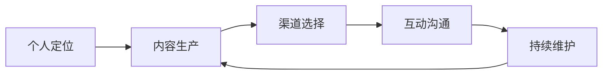

                 

# 打造个人管理品牌的方法论

> 关键词：个人管理品牌,品牌建设,个人效能,技术工具,个人发展,时间管理,情绪管理,学习习惯,专业成长

## 1. 背景介绍

### 1.1 问题由来
在当今信息爆炸、竞争激烈的商业环境中，个人品牌建设已成为职场竞争的关键因素。一个鲜明、突出的个人品牌不仅能让个体在职场中脱颖而出，还能提升个人影响力、拓展职业机会，甚至带来丰厚的经济回报。然而，构建一个成功的个人品牌并非易事，它需要系统化的规划、精心的执行以及持续的维护。本文将系统梳理个人品牌建设的方法论，帮助读者理解并掌握打造个人品牌的精髓。

### 1.2 问题核心关键点
构建个人品牌主要包含以下几个核心要点：
- 定位：明确个人在行业中的定位和价值主张，确定品牌个性和核心竞争力。
- 内容：生产高质量、有价值的内容，包括技术文章、项目经验、社交媒体分享等。
- 渠道：选择适合的传播渠道，包括技术社区、社交媒体、专业博客等。
- 互动：积极与目标受众互动，建立专业社交网络，参与行业讨论。
- 维护：持续优化个人形象和品牌信息，与时俱进，不断更新内容。

本文将围绕以上关键点展开，结合具体的案例和策略，为读者提供全面的个人品牌建设指南。

### 1.3 问题研究意义
通过深入研究个人品牌建设的方法论，能够帮助职场人士提升个人价值，实现职业转型和跨越。具体意义如下：

1. **提升职场竞争力**：鲜明独特的个人品牌能够在众多同僚中脱颖而出，吸引更多机会和资源。
2. **拓宽职业道路**：个人品牌有助于建立行业内的人脉网络，开启更多合作和交流机会。
3. **获得经济回报**：在技术咨询、培训、演讲等高附加值服务上，成功个人品牌能够带来显著的经济效益。
4. **实现自我成长**：持续的品牌建设和维护，推动个人不断学习、更新知识，加速自我提升。
5. **增强职业信心**：通过个人品牌建设的成功经验，增强自我肯定，提升自信心。

## 2. 核心概念与联系

### 2.1 核心概念概述

在构建个人品牌的过程中，涉及多个核心概念，它们之间存在着紧密的联系。

- **个人定位**：明确自身在行业中的位置和独特价值，是构建品牌的基础。
- **内容生产**：高质量的内容是吸引受众、建立权威的关键。
- **渠道选择**：选择适合的传播渠道，确保内容被目标受众看到。
- **互动沟通**：与受众互动，建立信任和关系，增强品牌黏性。
- **持续维护**：品牌建设是一个长期过程，需要不断优化和更新。

以下是一个Mermaid流程图，展示了这些概念之间的联系：



这个流程图直观展示了从定位到维护的个人品牌建设循环。

## 3. 核心算法原理 & 具体操作步骤
### 3.1 算法原理概述

个人品牌建设可以视为一个多阶段的优化问题，通过不断迭代改进品牌定位和内容策略，最终实现个人品牌的最大化影响力。其核心算法原理主要包括以下几个步骤：

1. **目标设定**：明确品牌目标和期望的影响力范围。
2. **市场分析**：分析目标受众的需求和偏好，定位自身的独特卖点。
3. **内容规划**：规划并生产符合受众需求的高质量内容。
4. **渠道选择**：根据受众特性选择合适的传播渠道。
5. **互动优化**：通过与受众的互动，不断调整品牌策略。
6. **效果评估**：定期评估品牌影响力和效果，进行优化调整。

### 3.2 算法步骤详解

**Step 1: 个人定位**
1. **自我评估**：列出自己的核心技能、专业领域、成就和不足。
2. **行业调研**：分析目标行业的竞争态势、主要人物和成功案例。
3. **市场分析**：确定目标受众的需求、痛点和期望，找出自身与竞争对手的差异化优势。
4. **品牌定位**：综合评估结果，定义个人品牌的核心价值和独特性。

**Step 2: 内容生产**
1. **内容类型**：根据品牌定位，确定主要的内容类型（技术文章、项目案例、技术演讲等）。
2. **内容规划**：制定详细的内容发布计划，确保内容质量和时间一致性。
3. **内容创新**：持续创新内容形式和主题，保持受众的兴趣和关注。
4. **内容优化**：根据受众反馈和数据分析，不断优化内容策略。

**Step 3: 渠道选择**
1. **渠道调研**：评估各类传播渠道的特点、覆盖人群和内容适配度。
2. **渠道选择**：结合品牌定位和受众特性，选择合适的渠道组合（如技术社区、社交媒体、博客等）。
3. **渠道优化**：根据渠道表现，动态调整渠道策略，优化资源分配。

**Step 4: 互动沟通**
1. **建立网络**：在目标渠道上积极发布内容，建立专业社交网络。
2. **互动反馈**：通过评论、私信等方式，与受众互动，收集反馈意见。
3. **关系维护**：维护与关键受众的关系，建立长期互动机制。

**Step 5: 持续维护**
1. **定期评估**：定期评估品牌影响力和效果，分析受众反馈和数据表现。
2. **策略调整**：根据评估结果，进行品牌策略的优化调整。
3. **内容更新**：根据市场变化和个人成长，持续更新和完善品牌内容。

### 3.3 算法优缺点

**优点**：
1. **系统化建设**：通过明确的策略和步骤，确保品牌建设的系统性和一致性。
2. **数据驱动**：借助数据分析和受众反馈，不断优化品牌策略。
3. **灵活调整**：根据市场变化和个人成长，及时调整品牌定位和内容策略。

**缺点**：
1. **时间和资源投入**：个人品牌建设需要持续的时间投入和资源分配。
2. **需要专业知识**：品牌建设需要一定的技术和管理背景，对技术工具的使用和数据分析能力有要求。
3. **持续维护**：品牌建设是一个长期过程，需要持续关注和优化。

### 3.4 算法应用领域

个人品牌建设的方法论不仅适用于技术领域，在商业、文化、教育等多个领域同样有效。例如：

- **技术专家**：通过分享技术见解、开源项目和案例分析，建立技术权威。
- **创业者**：通过讲述创业经历、商业洞察和市场分析，提升个人影响力。
- **作家**：通过出版书籍、博客和社交媒体，建立文学品牌。
- **教育工作者**：通过教学经验、学术研究和社会活动，提升教育影响力。

## 4. 数学模型和公式 & 详细讲解  
### 4.1 数学模型构建

个人品牌建设的方法论可以通过数学模型来进一步量化和优化。本文采用一个简化的品牌影响力评估模型，用于说明品牌建设的关键要素。

设个人品牌的影响力 $I$ 由内容质量 $C$、渠道覆盖 $C$、受众互动 $I$ 和持续维护 $M$ 共同决定。模型可以表示为：

$$
I = f(C, C, I, M)
$$

其中，$f$ 为一个非线性函数，代表各要素之间的复杂交互关系。

### 4.2 公式推导过程

以一个简化的线性模型为例，来推导品牌影响力的计算公式。假设每个要素对品牌影响力的贡献为线性关系，则有：

$$
I = aC_1 + bC_2 + cI + dM
$$

其中：
- $a, b, c, d$ 为各要素的系数，代表其在品牌建设中的权重。
- $C_1, C_2$ 为内容质量和渠道覆盖的评分。
- $I$ 为受众互动的评分。
- $M$ 为持续维护的评分。

### 4.3 案例分析与讲解

以某技术专家在GitHub上的开源项目为例，分析其个人品牌影响力提升的过程：

1. **内容质量**：该专家持续在GitHub上发布高质量的开源项目，获得了大量Star和Fork。
2. **渠道覆盖**：通过在技术社区（如Stack Overflow、Medium等）和社交媒体（如Twitter、LinkedIn）上积极分享和互动，提升了品牌曝光率。
3. **受众互动**：在发布开源项目时，积极回复社区的评论和问题，建立了良好的社区关系。
4. **持续维护**：定期更新和优化开源项目，保持其活跃度，吸引新用户和贡献者。

## 5. 项目实践：代码实例和详细解释说明
### 5.1 开发环境搭建

在个人品牌建设实践中，我们需要利用多种技术工具来辅助内容生产和品牌管理。以下是搭建开发环境的流程：

1. **平台选择**：选择合适的技术平台，如GitHub、Medium、LinkedIn等。
2. **工具配置**：安装必要的开发工具，如Git、Markdown编辑器、项目管理工具等。
3. **环境设置**：配置开发环境，确保技术栈的一致性和稳定性。

### 5.2 源代码详细实现

以下是一个简化的内容发布管理系统的代码实现，用于帮助技术专家管理其品牌建设过程：

```python
import git
import markdown
import time

class ContentManager:
    def __init__(self, repo_url, username, password):
        self.repo_url = repo_url
        self.username = username
        self.password = password
        self.repo = git.Repo.clone_from(self.repo_url, 'my_repo')
        self.markdown编辑器 = markdown.Editor()

    def publish_content(self, title, content):
        self.markdown编辑器.write(content)
        self.repo.git.add('.')
        self.repo.git.commit('-a', '-m', f'{title} - {time.strftime("%Y-%m-%d %H:%M:%S")}')
        self.repo.git.push()

    def analyze_feedback(self):
        # 分析社区反馈，生成互动评分
        pass

    def maintain_brand(self):
        # 定期更新和优化开源项目
        pass
```

该代码实现了内容发布和维护的基本功能，可以进一步扩展和优化，实现更精细化的品牌管理。

### 5.3 代码解读与分析

**ContentManager类**：
- `__init__`方法：初始化Git仓库和Markdown编辑器。
- `publish_content`方法：将Markdown内容发布到GitHub仓库。
- `analyze_feedback`方法：分析社区反馈，生成互动评分。
- `maintain_brand`方法：定期更新和优化开源项目。

**代码实现细节**：
- 利用Git工具进行仓库管理和内容发布。
- 使用Markdown编辑器实现内容的格式化和排版。
- 通过分析社区反馈，计算受众互动评分。
- 定期更新和优化开源项目，保持品牌活跃度。

## 6. 实际应用场景
### 6.1 个人品牌在职场中的应用

在职场中，个人品牌可以显著提升个人影响力和职业发展。以下是几个实际应用场景：

**技术专家**：通过在技术社区分享技术见解、开源项目和案例分析，建立技术权威，吸引更多的技术合作和商业机会。

**管理者**：通过在社交媒体上分享管理经验和成功案例，提升管理影响力，推动企业内部文化的建设。

**营销人员**：通过在行业论坛和博客上发布营销策略和市场分析，提升品牌知名度，吸引更多的营销项目和客户。

### 6.2 个人品牌在创业中的应用

创业初期，良好的个人品牌能够帮助创始人快速获取资本和人才。以下是具体应用场景：

**创始团队**：通过在社交媒体和行业会议上积极宣传和互动，建立品牌认知，吸引潜在投资者和合作伙伴。

**产品发布**：通过在技术社区和社交媒体上发布产品原型和用户体验，提前吸引用户和媒体关注，增加产品曝光率。

**品牌传播**：通过在创业竞赛和行业会议上展示创业故事和团队特色，提升品牌形象，吸引更多的关注和支持。

### 6.3 个人品牌在教育中的应用

在教育领域，个人品牌同样具有重要作用。以下是具体应用场景：

**教师**：通过在教育博客和社交媒体上分享教学经验和教育成果，提升教学影响力，吸引更多的学生和同行关注。

**教育机构**：通过在教育论坛和学术会议上发布研究成果和教育实践，提升教育机构的学术地位和品牌影响力。

**培训师**：通过在培训平台上发布培训课程和教学视频，吸引更多的学员和培训机构合作，扩大培训市场。

### 6.4 未来应用展望

随着技术的不断进步，个人品牌建设的方法论也在不断发展。未来，个人品牌建设将更加注重以下几个方面：

1. **数据驱动**：通过大数据分析和AI技术，精准定位受众需求，优化品牌策略。
2. **多渠道融合**：利用多渠道传播平台，综合提升品牌曝光率和互动率。
3. **内容多样化**：结合图文、视频、直播等多种内容形式，提升受众的兴趣和参与度。
4. **跨界合作**：跨界合作，融合多种专业领域，提升品牌的广度和深度。
5. **持续创新**：持续创新品牌内容和形式，保持品牌的活力和竞争力。

## 7. 工具和资源推荐
### 7.1 学习资源推荐

为了帮助读者全面掌握个人品牌建设的方法论，以下是一些优质的学习资源：

1. **《个人品牌建设指南》**：一本全面介绍个人品牌建设的书，涵盖定位、内容、渠道、互动等多个方面。
2. **LinkedIn Learning**：提供丰富的个人品牌建设课程，涵盖技术、商业、创意等多个领域。
3. **Coursera**：提供多门个人品牌建设的在线课程，由知名大学和专家教授讲授。
4. **Medium**：一个优秀的写作和分享平台，帮助读者实践个人品牌建设。
5. **TED Talks**：通过观看成功人士的演讲，学习个人品牌建设的实际案例和经验。

### 7.2 开发工具推荐

以下是一些推荐的技术工具，用于辅助个人品牌建设：

1. **GitHub**：版本控制和代码托管平台，适合发布开源项目和代码片段。
2. **Medium**：内容发布和社交平台，适合分享技术见解和行业分析。
3. **LinkedIn**：职业社交平台，适合建立行业联系和展示个人成就。
4. **Hootsuite**：社交媒体管理工具，适合管理和优化社交媒体互动。
5. **Trello**：项目管理工具，适合规划和执行内容发布计划。

### 7.3 相关论文推荐

以下是几篇关于个人品牌建设的经典论文，推荐阅读：

1. **《社交媒体对个人品牌的影响》**：研究社交媒体如何影响个人品牌的建立和传播。
2. **《个人品牌建设的策略和实践》**：总结个人品牌建设的成功策略和实际案例。
3. **《数据驱动的个性化品牌建设》**：探讨如何利用大数据和AI技术优化个人品牌建设。
4. **《品牌建设的多渠道融合策略》**：研究多渠道融合策略对品牌曝光率和互动率的影响。
5. **《跨界合作的创新品牌策略》**：分析跨界合作如何提升品牌的影响力和竞争力。

## 8. 总结：未来发展趋势与挑战
### 8.1 总结

本文系统梳理了个人品牌建设的方法论，从核心概念、算法原理到具体操作步骤，为读者提供了全面的个人品牌建设指南。通过深入理解个人定位、内容生产、渠道选择、互动沟通和持续维护等关键要素，读者可以系统化地构建和提升个人品牌。

### 8.2 未来发展趋势

展望未来，个人品牌建设将呈现以下几个发展趋势：

1. **数据驱动**：借助大数据和AI技术，实现精准的品牌策略优化。
2. **多渠道融合**：通过多渠道融合提升品牌曝光率和互动率。
3. **内容多样化**：结合多种内容形式提升受众兴趣和参与度。
4. **跨界合作**：跨界合作提升品牌影响力和竞争力。
5. **持续创新**：持续创新品牌内容和形式，保持品牌活力和竞争力。

### 8.3 面临的挑战

尽管个人品牌建设带来了许多机遇，但也面临诸多挑战：

1. **时间和资源投入**：个人品牌建设需要持续的时间和资源投入，对时间管理能力要求高。
2. **技术工具依赖**：个人品牌建设依赖多种技术工具，需要一定的技术背景和管理能力。
3. **受众需求变化**：受众需求和市场环境变化快，品牌策略需要不断调整和优化。
4. **数据隐私问题**：在收集和分析受众数据时，需要注意隐私保护和数据安全。
5. **维护难度**：个人品牌建设是一个长期过程，需要持续维护和管理。

### 8.4 研究展望

未来，个人品牌建设的研究将在以下几个方向进行：

1. **技术工具创新**：开发更加智能、易用的品牌建设工具，降低技术门槛。
2. **数据驱动优化**：利用AI技术和大数据分析，实现品牌策略的精准优化。
3. **跨界合作研究**：研究跨界合作对品牌建设的影响和优化策略。
4. **多渠道融合策略**：探讨多渠道融合的最佳策略，提升品牌效果。
5. **持续创新机制**：建立品牌创新机制，保持品牌的活力和竞争力。

## 9. 附录：常见问题与解答

**Q1: 个人品牌建设需要投入大量时间和资源，值得吗？**

A: 个人品牌建设虽然需要持续的时间和资源投入，但成功的品牌建设带来的回报远远超过成本。一个鲜明、突出的个人品牌可以提升职场竞争力、拓展职业机会、获得经济回报，甚至实现职业转型。因此，投入时间和资源是值得的。

**Q2: 个人品牌建设需要哪些技术工具？**

A: 个人品牌建设需要多种技术工具，如GitHub、Medium、LinkedIn、Hootsuite等。这些工具可以协助内容生产和品牌管理，帮助提升个人品牌的影响力和曝光率。

**Q3: 如何确定品牌定位？**

A: 确定品牌定位需要进行自我评估和市场分析，明确自身的核心技能、专业领域和独特价值。通过分析目标行业的竞争态势和受众需求，找出自身与竞争对手的差异化优势，最终定义品牌核心价值和独特性。

**Q4: 如何提升受众互动率？**

A: 提升受众互动率需要积极与受众互动，建立社区关系。通过回复评论、私信等方式，与受众建立良好的沟通和互动机制，增加受众的参与度和忠诚度。

**Q5: 如何持续优化个人品牌？**

A: 持续优化个人品牌需要定期评估品牌影响力和效果，分析受众反馈和数据表现，进行品牌策略的优化调整。同时，持续更新和完善品牌内容，保持品牌的时效性和相关性。

总之，个人品牌建设是一个系统化和长期化的过程，需要明确的策略和持续的努力。通过以上方法论，相信读者可以系统化地构建和提升个人品牌，在职场中脱颖而出，实现职业发展和个人成长。

