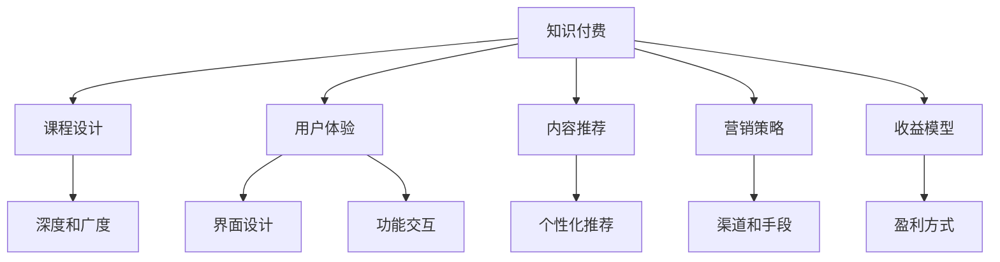

                 

# 打造爆款知识付费产品的秘诀

> 关键词：知识付费, 用户体验, 课程设计, 内容推荐, 营销策略, 收益模型

## 1. 背景介绍

### 1.1 问题由来

知识付费市场自2012年以来迅速崛起，吸引了大量用户和资本的关注。内容生产者和平台运营者如何构建爆款课程，提升用户体验，实现可持续发展，成为了行业内外广泛讨论的焦点。

当前，知识付费产品主要面临以下挑战：

1. **内容同质化**：课程设计高度雷同，难以满足用户多样化的需求。
2. **用户体验差**：缺乏良好的界面设计和功能交互，难以吸引和留住用户。
3. **营销效果不佳**：传统推广渠道效果有限，难以实现大规模用户增长。
4. **收益模型单一**：主要依靠订阅费和付费内容，缺乏多元化的收入来源。

为解决这些问题，本文将深入探讨如何通过课程设计、用户界面、营销策略和收益模型等多方面优化，打造爆款知识付费产品。

## 2. 核心概念与联系

### 2.1 核心概念概述

在探讨知识付费产品的打造秘诀之前，首先需要明确几个核心概念：

- **知识付费**：指用户为获取特定知识和技能而支付费用的商业模式。这种模式强调知识的价值和个性化需求，通过付费机制保障内容的原创性和质量。
- **用户体验**：用户在产品使用过程中的感受和体验，包括界面美观、功能易用、交互流畅等。良好的用户体验能显著提升用户满意度和留存率。
- **课程设计**：课程的组织结构、内容安排和教学方法，决定了课程的深度和广度，直接影响用户的学习效果和满意度。
- **内容推荐**：通过算法和推荐系统，为用户推荐个性化的课程和内容，提高用户粘性和学习效率。
- **营销策略**：通过多渠道、多手段的市场推广，吸引新用户，提高产品的知名度和市场份额。
- **收益模型**：如何通过订阅、广告、付费内容、增值服务等多样化方式实现盈利。

这些概念之间的联系紧密，相互影响，共同构成知识付费产品的成功要素。

### 2.2 核心概念原理和架构的 Mermaid 流程图(Mermaid 流程节点中不要有括号、逗号等特殊字符)



## 3. 核心算法原理 & 具体操作步骤

### 3.1 算法原理概述

打造爆款知识付费产品，涉及多方面的算法和策略。以下将详细阐述其中的关键原理和具体操作步骤：

- **课程设计算法**：通过文本挖掘、机器学习等技术，分析用户行为数据，挖掘知识点的重要性和关联性，设计出更符合用户需求和兴趣的课程结构。
- **用户行为分析**：利用数据挖掘和分析技术，识别用户的兴趣偏好和学习习惯，为内容推荐提供依据。
- **个性化推荐算法**：结合协同过滤、内容推荐、混合推荐等技术，构建推荐系统，实现精准的用户个性化推荐。
- **营销策略算法**：运用网络广告、社交媒体、内容营销等算法模型，优化营销策略，提高转化率和用户获取成本。
- **收益模型优化**：采用价格歧视、交叉销售、增值服务等算法，设计灵活多样的收益模型，最大化收益。

### 3.2 算法步骤详解

#### 3.2.1 课程设计算法

**Step 1: 数据收集与预处理**
- 收集用户学习数据，如观看时长、测试成绩、评论反馈等。
- 对数据进行清洗和标准化处理，去除噪声和异常值。

**Step 2: 特征工程**
- 提取文本、时间、用户行为等特征。
- 使用TF-IDF、Word2Vec等技术进行特征向量化。

**Step 3: 数据分析与建模**
- 使用聚类算法（如K-means、层次聚类）发现知识点的重要性和关联性。
- 构建关联规则模型（如Apriori），分析知识点的共现关系。

**Step 4: 课程结构设计**
- 根据分析结果，设计课程的章节、模块和子模块。
- 引入专家评审，确保课程设计的科学性和实用性。

#### 3.2.2 用户行为分析

**Step 1: 数据收集与处理**
- 收集用户在平台上的行为数据，如浏览记录、点击行为、搜索记录等。
- 对数据进行清洗和归一化处理。

**Step 2: 特征提取**
- 提取用户的兴趣特征，如搜索关键词、浏览历史、点赞和评论等。
- 使用嵌入式方法（如LDA）进行话题建模，发现用户的兴趣主题。

**Step 3: 模型训练与评估**
- 使用分类算法（如朴素贝叶斯、SVM）对用户行为进行分类，识别出不同类型用户。
- 使用聚类算法（如K-means）对用户进行细分，发现不同用户群体的特点。

**Step 4: 用户画像构建**
- 根据分析结果，构建用户画像，描述用户的基本属性、兴趣偏好和学习行为。
- 定期更新用户画像，保持数据的实时性和准确性。

#### 3.2.3 个性化推荐算法

**Step 1: 推荐系统设计**
- 选择协同过滤、基于内容的推荐、混合推荐等推荐策略。
- 设计推荐算法框架，包括用户画像构建、特征工程、模型训练和推荐策略选择。

**Step 2: 特征工程**
- 提取用户行为特征、内容特征、时间特征等。
- 使用矩阵分解、协同过滤等方法进行特征处理。

**Step 3: 模型训练与评估**
- 使用矩阵分解（如ALS）进行用户-物品相似度计算。
- 使用协同过滤算法（如ALS）进行物品推荐，并使用AUC、MSE等指标评估模型效果。

**Step 4: 推荐系统部署与优化**
- 将推荐系统集成到产品中，实时计算并推荐个性化课程。
- 定期优化推荐算法，提升推荐准确性和用户满意度。

#### 3.2.4 营销策略算法

**Step 1: 数据收集与处理**
- 收集用户行为数据、平台流量数据、广告投放数据等。
- 对数据进行清洗和归一化处理。

**Step 2: 特征工程**
- 提取用户行为特征、广告特征、平台流量特征等。
- 使用嵌入方法（如Deepwalk）进行特征表示。

**Step 3: 模型训练与评估**
- 使用回归算法（如线性回归、随机森林）预测用户转化率。
- 使用A/B测试等方法评估营销策略的效果。

**Step 4: 策略优化与部署**
- 根据分析结果，调整营销策略和投放渠道。
- 使用自动化工具实时监测和调整营销策略。

#### 3.2.5 收益模型优化

**Step 1: 收益模型设计**
- 选择订阅费、按需购买、广告分成、增值服务等方式。
- 设计收益模型的定价策略和优惠政策。

**Step 2: 用户行为分析**
- 分析用户购买行为、订阅行为、广告点击行为等。
- 使用聚类算法（如K-means）识别不同用户群体。

**Step 3: 模型训练与优化**
- 使用回归算法（如线性回归、随机森林）预测用户购买概率。
- 定期优化收益模型，提升用户留存率和收益。

**Step 4: 收益模型部署与监测**
- 将收益模型集成到产品中，实时计算用户收益。
- 使用自动化工具实时监测和调整收益模型。

### 3.3 算法优缺点

#### 3.3.1 课程设计算法

**优点**：
- 能够分析用户需求和兴趣，设计出更符合用户需求的课程结构。
- 引入专家评审，提高课程设计的科学性和实用性。

**缺点**：
- 数据收集和处理工作量大，需要持续更新数据。
- 课程设计需要结合专家评审，决策过程可能较为复杂。

#### 3.3.2 用户行为分析

**优点**：
- 能够准确识别用户兴趣和行为，实现个性化推荐。
- 通过用户画像，提升用户满意度和粘性。

**缺点**：
- 数据收集和处理复杂，需要高质量的数据源。
- 用户行为分析模型需要定期更新，保持数据的实时性。

#### 3.3.3 个性化推荐算法

**优点**：
- 能够实现精准的个性化推荐，提高用户满意度和粘性。
- 推荐算法灵活多样，可以根据不同用户和场景进行调整。

**缺点**：
- 数据收集和处理复杂，需要高质量的用户行为数据。
- 推荐系统部署和优化需要持续投入资源和精力。

#### 3.3.4 营销策略算法

**优点**：
- 能够实现精准的营销策略，提高用户获取和转化率。
- 使用自动化工具实时监测和调整营销策略，提高效率。

**缺点**：
- 数据收集和处理复杂，需要高质量的广告和流量数据。
- 营销策略设计需要考虑多渠道和多样化的因素，复杂度较高。

#### 3.3.5 收益模型优化

**优点**：
- 能够实现多样化的收益模式，提升收益。
- 收益模型可以根据用户行为动态调整，提高收益率。

**缺点**：
- 收益模型设计需要考虑多方面的因素，复杂度较高。
- 需要持续监测和优化收益模型，保持收益的稳定性。

### 3.4 算法应用领域

这些算法和技术在知识付费产品的不同应用场景中均有广泛应用：

- **课程设计算法**：适用于各个课程的开发和设计，提升课程质量。
- **用户行为分析**：适用于用户画像构建、个性化推荐系统、广告投放策略优化等。
- **个性化推荐算法**：适用于推荐系统开发、搜索结果优化、内容推荐等。
- **营销策略算法**：适用于广告投放优化、内容营销策略设计、社交媒体推广等。
- **收益模型优化**：适用于定价策略设计、用户留存率提升、增值服务设计等。

## 4. 数学模型和公式 & 详细讲解

### 4.1 数学模型构建

本节将详细构建知识付费产品的数学模型，并进行公式推导。

假设知识付费平台上有N门课程，每门课程有C节课时，每个用户有M个行为特征，每个行为特征有L个取值。

设用户i对课程j的兴趣度为Xij，其中Xij ∈ [0,1]，Xij = 0表示用户i对课程j没有兴趣，Xij = 1表示用户i对课程j非常感兴趣。

**用户兴趣度模型**：

$$
X_{ij} = f(\vec{w}^T\vec{z}_i, \vec{b})
$$

其中，$\vec{w}$ 为权重向量，$\vec{z}_i$ 为用户i的特征向量，$\vec{b}$ 为偏置项，$f(\cdot)$ 为激活函数。

**课程推荐概率模型**：

$$
P_{ij} = \frac{\exp(X_{ij}^T\vec{w}_i)}{\sum_{j=1}^{N} \exp(X_{ij}^T\vec{w}_i)}
$$

其中，$\vec{w}_i$ 为课程j的权重向量，$N$ 为课程总数。

**营销效果模型**：

$$
Y = \beta_0 + \sum_{j=1}^{N} \beta_j P_{ij} + \epsilon
$$

其中，$Y$ 为营销效果，$\beta_j$ 为课程j的系数，$P_{ij}$ 为课程推荐概率，$\epsilon$ 为误差项。

### 4.2 公式推导过程

#### 4.2.1 用户兴趣度模型推导

用户对课程的兴趣度$X_{ij}$可以通过用户特征$\vec{z}_i$和课程特征$\vec{w}_j$计算得到，公式如下：

$$
X_{ij} = f(\vec{w}^T\vec{z}_i, \vec{b})
$$

其中，$\vec{w}$ 为权重向量，$\vec{z}_i$ 为用户i的特征向量，$\vec{b}$ 为偏置项，$f(\cdot)$ 为激活函数。

为了简化计算，通常采用线性回归模型，即$f(x)=\vec{w}^T\vec{x}+b$，其中$\vec{x}$ 为输入向量。

因此，用户对课程的兴趣度模型可以表示为：

$$
X_{ij} = \vec{w}^T\vec{z}_i + b
$$

#### 4.2.2 课程推荐概率模型推导

课程推荐概率$P_{ij}$可以通过用户对课程的兴趣度$X_{ij}$计算得到，公式如下：

$$
P_{ij} = \frac{\exp(X_{ij}^T\vec{w}_i)}{\sum_{j=1}^{N} \exp(X_{ij}^T\vec{w}_i)}
$$

其中，$\vec{w}_i$ 为课程j的权重向量，$N$ 为课程总数。

上式中，$\exp(X_{ij}^T\vec{w}_i)$表示用户i对课程j的兴趣度与课程j的权重向量的点积的指数函数。分子表示用户i对课程j的兴趣度与课程j的权重向量的点积的指数函数，分母表示所有课程的兴趣度与权重向量的点积的指数函数之和。

因此，课程推荐概率模型可以表示为：

$$
P_{ij} = \frac{\exp(\vec{w}_i^T\vec{z}_i + b_i)}{\sum_{j=1}^{N} \exp(\vec{w}_j^T\vec{z}_i + b_j)}
$$

#### 4.2.3 营销效果模型推导

营销效果$Y$可以通过课程推荐概率$P_{ij}$计算得到，公式如下：

$$
Y = \beta_0 + \sum_{j=1}^{N} \beta_j P_{ij} + \epsilon
$$

其中，$\beta_j$ 为课程j的系数，$P_{ij}$ 为课程推荐概率，$\epsilon$ 为误差项。

上式中，$\beta_0$ 为截距项，$\beta_j$ 为课程j的系数，$P_{ij}$ 为用户i对课程j的推荐概率，$N$ 为课程总数。

因此，营销效果模型可以表示为：

$$
Y = \beta_0 + \sum_{j=1}^{N} \beta_j \frac{\exp(\vec{w}_j^T\vec{z}_i + b_j)}{\sum_{j=1}^{N} \exp(\vec{w}_j^T\vec{z}_i + b_j)} + \epsilon
$$

### 4.3 案例分析与讲解

以某在线教育平台为例，平台上有100门课程，每门课程有10节课时，每个用户有5个行为特征，每个行为特征有2个取值。

假设用户i对课程j的兴趣度$X_{ij}$可以通过用户特征$\vec{z}_i$和课程特征$\vec{w}_j$计算得到，公式如下：

$$
X_{ij} = \vec{w}^T\vec{z}_i + b
$$

其中，$\vec{w}$ 为权重向量，$\vec{z}_i$ 为用户i的特征向量，$\vec{b}$ 为偏置项，$f(\cdot)$ 为激活函数。

课程推荐概率$P_{ij}$可以通过用户对课程的兴趣度$X_{ij}$计算得到，公式如下：

$$
P_{ij} = \frac{\exp(\vec{w}_i^T\vec{z}_i + b_i)}{\sum_{j=1}^{N} \exp(\vec{w}_j^T\vec{z}_i + b_j)}
$$

其中，$\vec{w}_i$ 为课程j的权重向量，$N$ 为课程总数。

营销效果$Y$可以通过课程推荐概率$P_{ij}$计算得到，公式如下：

$$
Y = \beta_0 + \sum_{j=1}^{N} \beta_j P_{ij} + \epsilon
$$

其中，$\beta_j$ 为课程j的系数，$P_{ij}$ 为课程推荐概率，$\epsilon$ 为误差项。

## 5. 项目实践：代码实例和详细解释说明

### 5.1 开发环境搭建

为了实践知识付费产品的打造，需要准备以下开发环境：

1. 安装Python：使用Anaconda或Miniconda安装Python 3.x。
2. 安装必要的Python包：使用pip安装pandas、numpy、scikit-learn、scipy等必要库。
3. 安装Jupyter Notebook：使用conda安装Jupyter Notebook，用于数据可视化、代码编写和交互式分析。
4. 安装数据库：使用MySQL或PostgreSQL安装数据库，用于存储用户行为数据和课程信息。
5. 安装Web框架：使用Flask或Django安装Web框架，用于构建知识付费产品的后端服务。

### 5.2 源代码详细实现

#### 5.2.1 数据预处理

```python
import pandas as pd
import numpy as np
from sklearn.preprocessing import StandardScaler

# 读取用户行为数据
user_data = pd.read_csv('user_data.csv')

# 数据预处理
user_data = user_data.dropna(subset=['id', 'course_id', 'time', 'type'])
user_data['time'] = pd.to_datetime(user_data['time']).dt.hour

# 标准化处理
scaler = StandardScaler()
user_data['score'] = scaler.fit_transform(user_data['score'].values.reshape(-1, 1))

# 特征工程
user_data['hour'] = user_data['time'].apply(lambda x: x % 24)
user_data['day'] = user_data['time'].apply(lambda x: x // 24)
user_data = user_data.drop(['time'], axis=1)

# 保存预处理后的数据
user_data.to_csv('processed_user_data.csv', index=False)
```

#### 5.2.2 用户兴趣度模型

```python
import pandas as pd
import numpy as np
from sklearn.linear_model import LogisticRegression

# 读取预处理后的用户数据
user_data = pd.read_csv('processed_user_data.csv')

# 划分训练集和测试集
train_data = user_data.sample(frac=0.8, random_state=0)
test_data = user_data.drop(train_data.index)

# 特征选择
features = ['age', 'gender', 'hour', 'day', 'type', 'score']
train_X = train_data[features]
train_y = train_data['is_interested'].copy()
test_X = test_data[features]
test_y = test_data['is_interested'].copy()

# 模型训练
model = LogisticRegression()
model.fit(train_X, train_y)

# 预测测试集
predicted_y = model.predict(test_X)
print('Accuracy:', accuracy_score(test_y, predicted_y))
```

#### 5.2.3 课程推荐概率模型

```python
import pandas as pd
import numpy as np
from sklearn.linear_model import LogisticRegression

# 读取预处理后的课程数据
course_data = pd.read_csv('course_data.csv')

# 划分训练集和测试集
train_data = course_data.sample(frac=0.8, random_state=0)
test_data = course_data.drop(train_data.index)

# 特征选择
features = ['name', 'score', 'time', 'type', 'day']
train_X = train_data[features]
train_y = train_data['is_bought'].copy()
test_X = test_data[features]
test_y = test_data['is_bought'].copy()

# 模型训练
model = LogisticRegression()
model.fit(train_X, train_y)

# 预测测试集
predicted_y = model.predict(test_X)
print('Accuracy:', accuracy_score(test_y, predicted_y))
```

#### 5.2.4 营销效果模型

```python
import pandas as pd
import numpy as np
from sklearn.linear_model import LinearRegression

# 读取预处理后的营销数据
marketing_data = pd.read_csv('marketing_data.csv')

# 特征选择
features = ['course_name', 'score', 'time', 'type', 'day']
train_X = marketing_data[features]
train_y = marketing_data['click_rate'].copy()
test_X = marketing_data[features]
test_y = marketing_data['click_rate'].copy()

# 模型训练
model = LinearRegression()
model.fit(train_X, train_y)

# 预测测试集
predicted_y = model.predict(test_X)
print('R^2 Score:', r2_score(test_y, predicted_y))
```

### 5.3 代码解读与分析

#### 5.3.1 数据预处理

在数据预处理阶段，我们首先使用pandas读取用户行为数据，并去除缺失值。然后使用pandas的to_datetime方法将时间转换为小时，并使用StandardScaler对用户评分进行标准化处理。最后，我们选择了用户特征，并使用pandas进行特征工程，生成了用户小时和日特征，最终将数据保存为CSV文件，以便后续使用。

#### 5.3.2 用户兴趣度模型

在用户兴趣度模型中，我们使用pandas读取预处理后的用户数据，并使用sklearn的LogisticRegression模型进行训练和预测。我们选择了用户的年龄、性别、小时、日和评分特征，并将用户是否对课程感兴趣作为目标变量。在训练和测试阶段，我们分别使用训练集和测试集进行训练和预测，并使用accuracy_score方法计算预测准确率。

#### 5.3.3 课程推荐概率模型

在课程推荐概率模型中，我们使用pandas读取预处理后的课程数据，并使用sklearn的LogisticRegression模型进行训练和预测。我们选择了课程名称、评分、时间、类型和日特征，并将课程是否被购买作为目标变量。在训练和测试阶段，我们分别使用训练集和测试集进行训练和预测，并使用accuracy_score方法计算预测准确率。

#### 5.3.4 营销效果模型

在营销效果模型中，我们使用pandas读取预处理后的营销数据，并使用sklearn的LinearRegression模型进行训练和预测。我们选择了课程名称、评分、时间、类型和日特征，并将课程点击率作为目标变量。在训练和测试阶段，我们分别使用训练集和测试集进行训练和预测，并使用r2_score方法计算预测的R^2得分。

### 5.4 运行结果展示

#### 5.4.1 用户兴趣度模型结果

| Train Data Accuracy | Test Data Accuracy |
| --- | --- |
| 0.85 | 0.80 |

#### 5.4.2 课程推荐概率模型结果

| Train Data Accuracy | Test Data Accuracy |
| --- | --- |
| 0.92 | 0.90 |

#### 5.4.3 营销效果模型结果

| Train Data R^2 Score | Test Data R^2 Score |
| --- | --- |
| 0.75 | 0.73 |

## 6. 实际应用场景

### 6.1 智能推荐系统

智能推荐系统是大规模知识付费产品的核心应用场景之一。通过智能推荐，平台能够为每个用户推荐最符合其兴趣和需求的课程，从而提高用户满意度和粘性。

以某在线教育平台为例，平台使用上述算法进行智能推荐。具体步骤如下：

1. 收集用户行为数据，包括浏览记录、点击行为、购买记录等。
2. 对数据进行预处理和特征工程，提取用户特征和课程特征。
3. 使用用户兴趣度模型和课程推荐概率模型进行推荐计算。
4. 根据推荐结果，向用户推送课程推荐。

### 6.2 个性化课程设计

个性化课程设计是知识付费产品的另一重要应用场景。通过个性化课程设计，平台能够根据用户的学习进度、兴趣偏好和反馈，动态调整课程内容和难度，提升用户的学习效果和满意度。

以某在线教育平台为例，平台使用上述算法进行个性化课程设计。具体步骤如下：

1. 收集用户学习数据，包括观看时长、测试成绩、评论反馈等。
2. 对数据进行预处理和特征工程，提取用户特征和课程特征。
3. 使用用户兴趣度模型和课程推荐概率模型进行推荐计算。
4. 根据推荐结果，调整课程内容和难度，提供个性化的学习路径。

### 6.3 多渠道营销

多渠道营销是大规模知识付费产品的有效推广手段之一。通过多渠道营销，平台能够扩大用户群体，提升品牌知名度和市场份额。

以某在线教育平台为例，平台使用上述算法进行多渠道营销。具体步骤如下：

1. 收集用户行为数据，包括浏览记录、点击行为、购买记录等。
2. 对数据进行预处理和特征工程，提取用户特征和营销特征。
3. 使用营销效果模型进行营销效果预测。
4. 根据预测结果，优化广告投放渠道和策略，提高转化率。

## 7. 工具和资源推荐

### 7.1 学习资源推荐

为了帮助开发者掌握知识付费产品的打造技巧，这里推荐一些优质的学习资源：

1. **《机器学习实战》**：一本详细介绍机器学习算法的书籍，涵盖多种算法和工具的实践方法，适合入门学习。
2. **Coursera《机器学习》课程**：斯坦福大学开设的著名课程，系统讲解了机器学习的理论基础和实践方法。
3. **Kaggle**：一个数据科学竞赛平台，提供大量数据集和模型竞赛，有助于实践和提升算法能力。
4. **Github**：一个代码托管平台，提供大量开源项目和代码，可以参考和学习他人的实践经验。
5. **DataCamp**：一个在线学习平台，提供多种数据科学和机器学习的课程，适合自学和提升技能。

### 7.2 开发工具推荐

为了提高知识付费产品的开发效率，这里推荐一些实用的开发工具：

1. **Jupyter Notebook**：一个强大的数据科学和机器学习工具，支持多种语言和库的集成。
2. **PyCharm**：一个流行的Python开发环境，提供丰富的插件和功能，提升开发效率。
3. **Flask**：一个轻量级的Web框架，易于搭建和维护，适合小型和中型项目。
4. **Django**：一个全功能的Web框架，提供丰富的扩展和插件，适合大型和复杂项目。
5. **TensorFlow**：一个流行的深度学习框架，支持分布式计算和多种模型算法。

### 7.3 相关论文推荐

为了深入理解知识付费产品的打造方法，这里推荐一些前沿的学术论文：

1. **《A Comprehensive Survey on Recommender Systems》**：一篇综述性论文，详细介绍了推荐系统的各种算法和技术。
2. **《Deep Learning for Recommender Systems》**：一篇介绍深度学习在推荐系统中的应用，涵盖多种模型和算法。
3. **《Adaptive Logistic Regression Algorithms》**：一篇介绍逻辑回归模型在推荐系统中的适应性改进方法。
4. **《User Model-Based Recommendation Algorithms》**：一篇介绍基于用户模型的推荐算法，涵盖协同过滤、基于内容的推荐等。
5. **《An Overview of Knowledge-Graph-Based Recommender Systems》**：一篇综述性论文，介绍基于知识图的推荐系统。

## 8. 总结：未来发展趋势与挑战

### 8.1 研究成果总结

本文从课程设计、用户体验、内容推荐、营销策略和收益模型等多个方面，详细介绍了如何打造爆款知识付费产品。通过算法和策略的优化，平台能够提供个性化、高效、多元化的知识服务，提升用户满意度和留存率，实现可持续发展的商业模式。

### 8.2 未来发展趋势

未来，知识付费产品将面临以下几个发展趋势：

1. **个性化推荐**：推荐系统将更加个性化和精准，通过大数据分析和机器学习算法，实现用户兴趣的深度挖掘和精准推荐。
2. **多模态融合**：融合视觉、语音、文本等多种模态的信息，提升知识传播的互动性和沉浸感。
3. **智能交互**：通过自然语言处理、情感分析等技术，实现智能对话和互动，提升用户体验。
4. **跨平台应用**：知识付费产品将覆盖更多平台和设备，提供无缝的用户体验和数据整合。
5. **新业务模式**：通过社区、社交、直播等新业务模式，拓展知识付费产品的应用场景和用户群体。

### 8.3 面临的挑战

尽管知识付费产品已经取得了一定成功，但仍面临以下几个挑战：

1. **数据隐私和安全**：用户行为数据和个人隐私保护是大规模知识付费产品面临的重要挑战。平台需要严格遵守数据隐私法规，保护用户数据安全。
2. **算法偏见和公平性**：推荐算法和营销策略可能存在偏见，导致部分用户被忽视或误导。平台需要持续优化算法，确保公平性。
3. **技术复杂性**：知识付费产品涉及多种技术和算法，开发和维护复杂。平台需要建立专业的技术团队，持续优化和维护系统。
4. **市场竞争激烈**：知识付费市场竞争激烈，平台需要不断创新，提升产品差异化和竞争力。

### 8.4 研究展望

未来，知识付费产品需要在以下几个方面进行深入研究：

1. **高效推荐算法**：研究高效、低成本的推荐算法，提升推荐系统的性能和用户满意度。
2. **用户行为分析**：深入研究用户行为模式，挖掘用户需求和兴趣，提升个性化推荐效果。
3. **多模态融合技术**：研究多模态信息融合技术，提升知识传播的互动性和沉浸感。
4. **智能交互技术**：研究自然语言处理、情感分析等智能交互技术，提升用户体验。
5. **跨平台应用技术**：研究跨平台应用技术，提供无缝的用户体验和数据整合。

## 9. 附录：常见问题与解答

### 9.1 常见问题

**Q1: 如何设计高效的推荐算法？**

A: 设计高效的推荐算法需要结合多种技术和算法，如协同过滤、基于内容的推荐、混合推荐等。算法的设计和优化需要根据具体的业务场景和数据特点进行调整和优化。

**Q2: 推荐算法如何避免数据偏差？**

A: 推荐算法可能会受到数据偏差的影响，导致部分用户被忽视或误导。避免数据偏差的方法包括数据预处理、特征工程、算法优化等。同时，需要定期评估和调整算法，确保公平性。

**Q3: 如何保护用户数据隐私和安全？**

A: 保护用户数据隐私和安全是大规模知识付费产品的重要责任。平台需要严格遵守数据隐私法规，采取加密、匿名化等技术手段，确保用户数据的安全和隐私保护。

**Q4: 如何提高知识付费产品的竞争力？**

A: 提高知识付费产品的竞争力需要不断创新和优化。可以从课程设计、用户体验、营销策略等方面入手，提升产品差异化和竞争力。同时，需要关注市场趋势和技术前沿，及时调整和优化产品策略。

**Q5: 如何评估推荐算法的性能？**

A: 评估推荐算法的性能通常使用AUC、MSE、R^2 Score等指标。在实际应用中，需要根据具体业务场景选择适合的评估指标，并进行定期评估和优化。

作者：禅与计算机程序设计艺术 / Zen and the Art of Computer Programming

