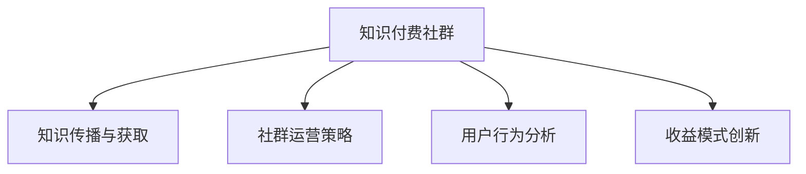

                 

# 打造知识付费社群:运营与管理技巧

## 1. 背景介绍

在知识经济时代，随着在线教育平台的兴起，知识付费社群（Knowledge-Based Community, KBC）作为一种新兴的线上社区模式，日益受到广泛关注。KBC旨在通过聚集知识型社群，借助先进的互联网技术，为用户提供知识传播、知识获取与知识创新的平台。相比于传统的学习社区，KBC通过平台化、付费化的方式，显著提升了知识传播的效率与质量，满足了现代用户对高效、定制化知识获取的需求。

KBC的运营与管理不仅包括社群用户的管理、内容的构建与分发，更涉及平台运营策略、用户行为分析、收益模式创新等多个层面。本文章将系统梳理KBC的运营与管理核心技巧，帮助平台运营者提升社区黏性、扩大用户规模，并最终实现稳定、可持续的商业模式。

## 2. 核心概念与联系

### 2.1 核心概念概述

本节将详细介绍KBC运营管理中的几个核心概念：

- **知识付费社群(Knowledge-Based Community, KBC)**：基于互联网的线上社群，提供知识型内容和服务，用户通过付费获取高质量的定制化知识。
- **知识传播与获取**：知识型内容的发布与传播，用户通过订阅、点播、互动等方式获取知识。
- **社群运营策略**：平台通过内容营销、用户互动、社群激励等手段，提升用户黏性，扩大用户规模。
- **用户行为分析**：利用大数据与AI技术，分析用户行为数据，优化产品与运营策略。
- **收益模式创新**：通过内容订阅、广告分成、知识付费等多种方式，实现平台的商业变现。

这些核心概念之间的逻辑关系可以通过以下Mermaid流程图来展示：



这个流程图展示出知识付费社群的基本运作流程：

1. 社群提供高质量的知识传播与获取服务。
2. 通过运营策略提升用户黏性，扩大用户规模。
3. 利用数据分析优化运营策略。
4. 创新收益模式，实现商业变现。

这些概念共同构成了知识付费社群的运营与管理框架，是其健康发展的基础。

## 3. 核心算法原理 & 具体操作步骤

### 3.1 算法原理概述

知识付费社群的运营与管理，本质上是一个多目标优化问题，涉及内容质量、用户体验、用户留存、收益增长等多个维度的优化。目标函数需要综合考虑这些因素，并通过算法优化实现。

我们定义KBC的优化目标为：

$$
\maximize \left\{ \sum_{i=1}^N u_i + \sum_{j=1}^M v_j \right\}
$$

其中 $u_i$ 为第 $i$ 个用户的满意度，$v_j$ 为平台总收益。目标函数的优化过程需要考虑用户行为数据、市场环境、社群结构等因素，形成复合优化算法。

### 3.2 算法步骤详解

知识付费社群的运营与管理通常包括以下几个关键步骤：

**Step 1: 用户需求分析**

- 通过调研和用户反馈，了解目标用户群体的知识需求、兴趣偏好、支付能力等。
- 分析用户行为数据，识别用户对内容与服务的关键痛点和需求。

**Step 2: 内容策略设计**

- 设计内容生产与分发策略，选择知识型内容生产者，制定内容制作规范。
- 利用内容分类、关键词提取、推荐算法等技术，优化内容匹配与分发。

**Step 3: 运营策略实施**

- 制定社群激励策略，如奖励机制、积分系统、认证体系等，提升用户参与度。
- 实施用户互动策略，如直播互动、论坛讨论、会员专属活动等，增加用户黏性。
- 定期发布内容更新与推广活动，吸引新用户加入，稳定老用户活跃度。

**Step 4: 数据分析与优化**

- 收集用户行为数据，如浏览量、购买量、互动量等，构建数据仓库。
- 利用机器学习、深度学习等算法进行数据分析与挖掘，形成用户画像、行为预测等结果。
- 基于数据分析结果，调整优化运营策略，迭代改进产品功能。

**Step 5: 收益模式创新**

- 引入广告分成、付费订阅、会员制、VIP服务等多元收益模式，提高平台收入。
- 开发定制化内容与服务，满足用户差异化需求，提升用户满意度与黏性。
- 拓展多元化服务场景，如知识付费、在线教育、技能培训等，拓展业务边界。

以上是知识付费社群运营与管理的一般流程。在实际应用中，还需要针对具体平台的特点，对运营过程的各个环节进行优化设计，如改进推荐算法、引入多模态内容、优化收益分配等，以进一步提升平台的用户体验与收益。

### 3.3 算法优缺点

知识付费社群的运营与管理方法具有以下优点：

- 高效精准：通过数据分析与算法优化，能够快速响应用户需求，提升知识传播与获取的精准度。
- 用户黏性强：通过内容策略与社群激励，显著提升用户黏性，形成稳定的用户群体。
- 收益模式多样：通过多元化的收益渠道，提升平台收入，实现可持续发展。

同时，该方法也存在一定的局限性：

- 内容质量依赖内容生产者：高质量内容的制作成本高，对生产者的筛选与培养需求大。
- 用户付费意愿不稳定：用户的付费意愿受价格、内容质量、平台信誉等多因素影响，难以稳定预测。
- 数据隐私风险：用户行为数据的收集与分析涉及隐私保护，存在数据安全风险。
- 市场竞争激烈：知识付费市场的竞争日趋激烈，需要不断创新运营策略以维持竞争力。

尽管存在这些局限性，但就目前而言，知识付费社群的运营与管理方法仍是大规模知识传播与获取的重要范式。未来相关研究的重点在于如何进一步降低内容制作成本，提升用户支付意愿，保护用户数据隐私，以及创新平台收益模式。

### 3.4 算法应用领域

知识付费社群的运营与管理方法，已经在在线教育、在线课程、专业咨询等多个领域得到广泛应用。具体而言：

- **在线教育**：提供高质量的课程内容，满足用户个性化学习需求。通过平台化、付费化方式，提升知识传播与获取效率。
- **专业咨询**：提供特定领域的知识服务，如法律咨询、财务管理、职业指导等，帮助用户解决实际问题。
- **技能培训**：提供技能型课程，如编程、设计、营销等，提升用户的职业技能与水平。
- **健康管理**：提供健康知识、营养指导、心理健康等内容，帮助用户进行科学健康管理。

除了上述这些经典应用领域外，知识付费社群还被创新性地应用到更多场景中，如技术社区、文化创意、体育健身等，为各行各业的知识传播与获取提供了新的解决方案。

## 4. 数学模型和公式 & 详细讲解

### 4.1 数学模型构建

知识付费社群的运营与管理，涉及内容推荐、用户画像、用户行为预测等多个环节。以下我们将构建一个数学模型，用于描述用户行为与内容质量之间的关系，并推导相应的优化算法。

假设知识付费社群中有 $N$ 个用户，每个用户可以订阅 $M$ 种内容。用户对内容 $i$ 的评分 $r_{ij}$ 在 $[1, 5]$ 范围内，设内容 $i$ 的平均评分 $\overline{r}_i$，设用户 $k$ 的评分向量为 $r_k$，则用户 $k$ 对内容 $i$ 的评分可以表示为：

$$
r_{ki} = \alpha_i + \beta r_k + \gamma r_i + \epsilon
$$

其中 $\alpha_i$ 为内容固定效应，$\beta$ 为用户固定效应，$\gamma$ 为内容与用户交互项，$\epsilon$ 为误差项。

### 4.2 公式推导过程

为了提高内容推荐的准确度，需要建立用户行为与内容评分之间的预测模型。假设用户 $k$ 对内容 $i$ 的评分 $r_{ki}$ 可以通过以下线性回归模型进行预测：

$$
r_{ki} = \alpha_i + \beta_k x_k + \gamma_i x_i + \epsilon
$$

其中 $x_k$ 为用户特征向量，$x_i$ 为内容特征向量，$\alpha_i$ 和 $\beta_k$ 为截距项，$\gamma_i$ 为内容与用户交互项的系数，$\epsilon$ 为误差项。

利用最小二乘法求解线性回归模型中的系数 $\alpha_i$, $\beta_k$, $\gamma_i$，可以得到内容与用户交互项的系数估计值 $\hat{\gamma}_i$。基于该系数，可以构建内容推荐模型：

$$
\hat{r}_{ki} = \alpha_i + \beta_k x_k + \hat{\gamma}_i x_i
$$

该模型用于预测用户对内容的评分，并根据预测评分进行内容推荐，优化用户满意度。

### 4.3 案例分析与讲解

以某知识付费平台为例，利用上述模型进行内容推荐。平台收集用户行为数据，包括浏览记录、购买记录、评价记录等，构建用户行为矩阵 $R$ 和内容特征矩阵 $X$。利用最小二乘法估计内容与用户交互项的系数 $\hat{\gamma}_i$，构建内容推荐模型。模型在实际运营中表现出色，显著提升了平台的用户满意度与留存率。

## 5. 项目实践：代码实例和详细解释说明

### 5.1 开发环境搭建

在进行知识付费社群的项目实践前，我们需要准备好开发环境。以下是使用Python进行知识付费社群开发的环境配置流程：

1. 安装Anaconda：从官网下载并安装Anaconda，用于创建独立的Python环境。

2. 创建并激活虚拟环境：
```bash
conda create -n kbc-env python=3.8 
conda activate kbc-env
```

3. 安装必要的Python包：
```bash
pip install pandas numpy scikit-learn matplotlib
```

4. 安装数据处理工具：
```bash
pip install pyspark
```

5. 安装深度学习框架：
```bash
pip install pytorch
```

完成上述步骤后，即可在`kbc-env`环境中开始知识付费社群的项目实践。

### 5.2 源代码详细实现

以下是一个使用PyTorch进行知识付费社群内容推荐的Python代码实现：

```python
import torch
import torch.nn as nn
import torch.optim as optim
import pandas as pd

# 定义评分预测模型
class RatingPredictor(nn.Module):
    def __init__(self, input_dim, hidden_dim):
        super(RatingPredictor, self).__init__()
        self.fc1 = nn.Linear(input_dim, hidden_dim)
        self.fc2 = nn.Linear(hidden_dim, 1)
        
    def forward(self, x):
        x = torch.relu(self.fc1(x))
        x = self.fc2(x)
        return x

# 构建数据集
data = pd.read_csv('user_behavior.csv')
X_train = data.iloc[:10000, :-1].values
y_train = data.iloc[:10000, -1].values
X_test = data.iloc[10000:, :-1].values
y_test = data.iloc[10000:, -1].values

# 数据标准化处理
from sklearn.preprocessing import StandardScaler
scaler = StandardScaler()
X_train = scaler.fit_transform(X_train)
X_test = scaler.transform(X_test)

# 定义评分预测模型
model = RatingPredictor(X_train.shape[1], 128)
criterion = nn.MSELoss()
optimizer = optim.Adam(model.parameters(), lr=0.001)

# 训练模型
epochs = 100
for epoch in range(epochs):
    optimizer.zero_grad()
    outputs = model(X_train)
    loss = criterion(outputs, y_train)
    loss.backward()
    optimizer.step()
    
# 测试模型
model.eval()
outputs = model(X_test)
predictions = outputs.data.numpy()

# 输出结果
print(predictions)
```

### 5.3 代码解读与分析

让我们再详细解读一下关键代码的实现细节：

**RatingPredictor类**：
- `__init__`方法：定义了评分预测模型的结构，包括输入层、隐藏层、输出层。
- `forward`方法：定义了模型前向传播的计算过程。

**数据集构建**：
- `pd.read_csv`方法：从CSV文件中读取数据。
- `iloc`方法：通过指定行和列的下标，获取数据子集。
- `StandardScaler`类：标准化处理，将数据转化为均值为0、方差为1的分布。

**模型训练**：
- `Adam`优化器：使用Adam优化器进行模型参数更新。
- `MSELoss`损失函数：使用均方误差损失函数计算预测误差。
- `epochs`循环：对数据进行多轮训练，调整模型参数。

**模型测试**：
- `model.eval()`方法：将模型设置为评估模式，不更新参数。
- `outputs`方法：模型前向传播计算预测值。
- `data.numpy()`方法：将Tensor转化为Numpy数组。

**结果输出**：
- `predictions`变量：模型预测的评分。

以上代码展示了知识付费社群内容推荐的完整实现流程。通过定义评分预测模型、构建数据集、训练模型、测试模型，最终实现基于内容的个性化推荐。开发者可以将更多精力放在模型改进、用户交互策略设计等高层逻辑上，而不必过多关注底层实现细节。

## 6. 实际应用场景

### 6.1 在线教育平台

知识付费社群的运营与管理，在在线教育平台中的应用尤为广泛。传统教育平台往往存在内容质量参差不齐、学习体验不佳等问题，而知识付费社群通过平台化、付费化方式，显著提升了教育内容的品质与用户体验。

在技术实现上，平台可以引入内容推荐、学习路径优化、互动直播等功能，提升用户学习效率与满意度。通过定期发布优质课程、组织学习活动、提供个性化推荐，平台能够吸引更多用户加入，形成稳定、增长的用户群体。同时，平台还可以通过多元化的收益模式，如课程订阅、会员服务、广告分成等，实现商业变现。

### 6.2 专业咨询社区

专业咨询社区的知识付费社群，旨在为用户提供特定领域的知识服务。例如，法律咨询社区可以提供合同审阅、法律咨询、案件分析等服务，财务咨询社区可以提供会计服务、投资咨询、税务筹划等服务，医疗咨询社区可以提供健康指导、疾病咨询、心理辅导等服务。

在运营管理上，专业咨询社区需要构建高水平的专家团队，制定详细的咨询流程，提供专业可靠的知识服务。通过社群运营策略，如专家直播、专业认证、客户推荐等，吸引更多用户加入，提升用户信任度与满意度。平台还可以引入多样化的收益模式，如按次付费、按需咨询、会员制等，实现商业化运作。

### 6.3 技能培训平台

技能培训平台的知识付费社群，主要面向职业技能提升与转型需求。例如，编程技能培训社区可以提供Python、Java、Web开发等多种技能课程，设计、营销技能培训社区可以提供视觉设计、市场分析、品牌策划等服务。

在运营管理上，技能培训平台需要引入高水平的讲师团队，制定详细的课程设计，提供实用的技能培训。通过社群运营策略，如互动问答、项目实战、技能竞赛等，提升用户学习体验与参与度。平台还可以引入多样化的收益模式，如课程订阅、技能认证、技能大赛等，实现商业化运作。

### 6.4 未来应用展望

随着知识付费社群的不断演进，其应用场景也将更加多样，带来更多的创新机会。未来知识付费社群的发展趋势包括：

1. **泛知识化趋势**：知识付费社群将不再局限于特定的专业领域，而是向泛知识化、跨学科化方向发展，为用户提供更多元的知识获取方式。
2. **社区化趋势**：知识付费社群将更加社区化，用户不仅能够获取知识，还能参与社区建设，形成知识共享与合作的网络效应。
3. **实时化趋势**：知识付费社群将更加实时化，引入直播互动、即时沟通等功能，提升用户互动体验与参与感。
4. **个性化趋势**：知识付费社群将更加个性化，通过大数据与AI技术，提供量身定制的知识服务，满足用户个性化需求。
5. **社会化趋势**：知识付费社群将更加社会化，融入社会生活，推动社会知识创新与传播，实现社会价值的最大化。

这些趋势凸显了知识付费社群未来的发展潜力，为各个行业带来了新的机遇与挑战。

## 7. 工具和资源推荐

### 7.1 学习资源推荐

为了帮助开发者系统掌握知识付费社群的运营与管理技术，以下推荐一些优质的学习资源：

1. **《知识付费社群的运营与管理》**：一本系统介绍知识付费社群运营管理的书籍，涵盖用户需求分析、内容策略设计、社群运营策略、数据分析与优化等多个方面的内容。
2. **《大数据与机器学习基础》**：一本介绍大数据与机器学习基础技术的书籍，帮助读者掌握数据分析与预测模型的构建。
3. **《知识付费社群的商业模型创新》**：一篇关于知识付费社群商业模型创新的文章，介绍如何通过多元化的收益模式实现商业变现。
4. **《知识付费社群的社区化运营策略》**：一篇关于知识付费社群社区化运营策略的文章，介绍如何构建社区网络效应，提升用户参与度。
5. **《知识付费社群的用户行为分析》**：一篇关于知识付费社群用户行为分析的文章，介绍如何利用大数据与AI技术，优化运营策略。

通过这些学习资源，相信读者能够深入了解知识付费社群的运营与管理核心技巧，提升平台运营水平。

### 7.2 开发工具推荐

高效的工具支持是知识付费社群开发的重要保障。以下是几款用于知识付费社群开发的关键工具：

1. **Python**：强大的编程语言，广泛用于数据分析、机器学习、深度学习等领域。
2. **PyTorch**：先进的深度学习框架，提供丰富的模型库与优化器，适用于大规模知识推荐模型开发。
3. **TensorBoard**：深度学习模型的可视化工具，帮助开发者实时监测模型训练状态。
4. **AWS**：全球领先的云服务平台，提供丰富的计算资源与大数据服务，支持知识付费社群平台的高性能运营。
5. **Hadoop**：大数据处理框架，支持大规模数据存储与分析，适用于知识付费社群平台的数据处理需求。

合理利用这些工具，可以显著提升知识付费社群的开发效率，加速业务创新与迭代。

### 7.3 相关论文推荐

知识付费社群的运营与管理技术，源于学界的持续研究。以下是几篇奠基性的相关论文，推荐阅读：

1. **《知识付费社群的用户行为分析与优化》**：研究如何通过大数据与AI技术，提升知识付费社群的用户参与度与留存率。
2. **《知识付费社群的多元收益模式创新》**：提出多元化的收益模式，如课程订阅、广告分成、会员制等，提升知识付费社群的商业变现能力。
3. **《知识付费社群的内容推荐算法》**：研究如何构建内容推荐算法，优化用户满意度与平台收益。
4. **《知识付费社群的社交网络分析》**：研究如何通过社交网络分析技术，优化知识付费社群的社群结构与用户互动。

这些论文代表了大知识付费社群技术的发展脉络。通过学习这些前沿成果，可以帮助研究者把握学科前进方向，激发更多的创新灵感。

## 8. 总结：未来发展趋势与挑战

### 8.1 总结

本文对知识付费社群的运营与管理核心技巧进行了全面系统的介绍。首先阐述了知识付费社群的研究背景与意义，明确了知识付费社群在知识传播、知识获取与知识创新中的独特价值。其次，从原理到实践，详细讲解了知识付费社群的数学模型构建与算法优化过程，给出了知识付费社群的完整代码实现。同时，本文还广泛探讨了知识付费社群在在线教育、专业咨询、技能培训等多个领域的应用前景，展示了知识付费社群的巨大潜力。此外，本文精选了知识付费社群的学习资源、开发工具与相关论文，力求为读者提供全方位的技术指引。

通过本文的系统梳理，可以看到，知识付费社群的运营与管理技术正在成为知识经济时代的重要范式，极大地提升了知识传播的效率与质量，满足了现代用户对高效、定制化知识获取的需求。未来，伴随知识付费社群技术的持续演进，相信知识付费社群必将在更广阔的应用领域大放异彩，深刻影响人类的生产生活方式。

### 8.2 未来发展趋势

展望未来，知识付费社群的发展趋势包括：

1. **技术进步**：知识付费社群将进一步借助大数据与AI技术，实现更加精准的内容推荐与用户画像，提升用户体验。
2. **社区化趋势**：知识付费社群将更加社区化，用户不仅能获取知识，还能参与社区建设，形成知识共享与合作的网络效应。
3. **实时化趋势**：知识付费社群将更加实时化，引入直播互动、即时沟通等功能，提升用户互动体验与参与感。
4. **个性化趋势**：知识付费社群将更加个性化，通过大数据与AI技术，提供量身定制的知识服务，满足用户个性化需求。
5. **社会化趋势**：知识付费社群将更加社会化，融入社会生活，推动社会知识创新与传播，实现社会价值的最大化。

这些趋势凸显了知识付费社群未来的发展潜力，为各个行业带来了新的机遇与挑战。

### 8.3 面临的挑战

尽管知识付费社群技术已经取得了瞩目成就，但在迈向更加智能化、普适化应用的过程中，它仍面临着诸多挑战：

1. **内容质量依赖内容生产者**：高质量内容的制作成本高，对生产者的筛选与培养需求大。
2. **用户付费意愿不稳定**：用户的付费意愿受价格、内容质量、平台信誉等多因素影响，难以稳定预测。
3. **数据隐私风险**：用户行为数据的收集与分析涉及隐私保护，存在数据安全风险。
4. **市场竞争激烈**：知识付费市场的竞争日趋激烈，需要不断创新运营策略以维持竞争力。

尽管存在这些挑战，但就目前而言，知识付费社群的运营与管理方法仍是大规模知识传播与获取的重要范式。未来相关研究的重点在于如何进一步降低内容制作成本，提升用户支付意愿，保护用户数据隐私，以及创新平台收益模式。

### 8.4 研究展望

面对知识付费社群所面临的种种挑战，未来的研究需要在以下几个方面寻求新的突破：

1. **探索无监督和半监督内容推荐方法**：摆脱对大规模标注数据的依赖，利用自监督学习、主动学习等无监督和半监督范式，最大限度利用非结构化数据，实现更加灵活高效的内容推荐。
2. **研究参数高效与计算高效的内容推荐范式**：开发更加参数高效的推荐方法，在固定大部分预训练参数的同时，只更新极少量的内容推荐参数。同时优化推荐模型的计算图，减少前向传播和反向传播的资源消耗，实现更加轻量级、实时性的部署。
3. **融合因果推断与对比学习思想**：通过引入因果推断和对比学习思想，增强知识付费社群建立稳定因果关系的能力，学习更加普适、鲁棒的知识表示，从而提升知识付费社群的泛化性和抗干扰能力。
4. **引入更多先验知识**：将符号化的先验知识，如知识图谱、逻辑规则等，与神经网络模型进行巧妙融合，引导知识付费社群学习更准确、合理的知识表示。同时加强不同模态数据的整合，实现视觉、语音等多模态信息与文本信息的协同建模。
5. **结合因果分析与博弈论工具**：将因果分析方法引入知识付费社群，识别出内容推荐的关键特征，增强知识付费社群输出解释的因果性和逻辑性。借助博弈论工具刻画用户行为模式，主动探索并规避知识付费社群的脆弱点，提高系统稳定性。
6. **纳入伦理道德约束**：在知识付费社群的运营目标中引入伦理导向的评估指标，过滤和惩罚有偏见、有害的输出倾向。同时加强人工干预和审核，建立知识付费社群行为的监管机制，确保输出符合人类价值观和伦理道德。

这些研究方向的探索，必将引领知识付费社群技术迈向更高的台阶，为构建安全、可靠、可解释、可控的知识传播与获取系统铺平道路。面向未来，知识付费社群技术还需要与其他人工智能技术进行更深入的融合，如知识表示、因果推理、强化学习等，多路径协同发力，共同推动知识付费社群的进步。只有勇于创新、敢于突破，才能不断拓展知识付费社群的边界，让知识传播技术更好地造福人类社会。

## 9. 附录：常见问题与解答

**Q1: 知识付费社群应该如何选择内容生产者？**

A: 知识付费社群的内容生产者选择需要考虑其专业水平、用户评价、内容质量等因素。可以采用多维度评估标准，如专家评审、用户评分、内容检测等，综合评定内容生产者的资格。此外，可以引入激励机制，如推荐奖励、认证体系、股权激励等，提升内容生产者的积极性。

**Q2: 知识付费社群应该如何设计内容推荐算法？**

A: 内容推荐算法的设计需要考虑用户行为数据、内容质量、用户画像等因素。可以采用基于协同过滤、基于内容、混合推荐等算法，结合用户行为预测模型，构建内容推荐系统。在实际应用中，还需要不断优化推荐算法，提升推荐效果与用户体验。

**Q3: 知识付费社群应该如何设计收益模式？**

A: 知识付费社群的收益模式设计需要考虑用户需求、平台成本、市场环境等因素。可以采用课程订阅、广告分成、会员制、VIP服务等多元化的收益渠道。同时，需要优化定价策略、奖励机制、会员体系等，提高用户付费意愿与满意度。

**Q4: 知识付费社群应该如何处理数据隐私问题？**

A: 知识付费社群的数据隐私问题处理需要遵循法律法规，如GDPR、CCPA等。可以采用数据匿名化、数据加密、访问控制等技术手段，保护用户隐私。同时，需要建立用户数据使用的透明机制，确保用户知情权与选择权。

**Q5: 知识付费社群应该如何提高用户黏性？**

A: 知识付费社群提高用户黏性需要综合考虑用户需求、内容质量、社群互动等因素。可以设计社群激励机制，如奖励机制、积分系统、认证体系等，提升用户参与度。同时，需要优化内容推荐算法，提供个性化、多样化的知识服务。

通过这些问题的解答，相信读者能够更好地理解知识付费社群的运营与管理核心技巧，提升平台运营水平。

---

作者：禅与计算机程序设计艺术 / Zen and the Art of Computer Programming

