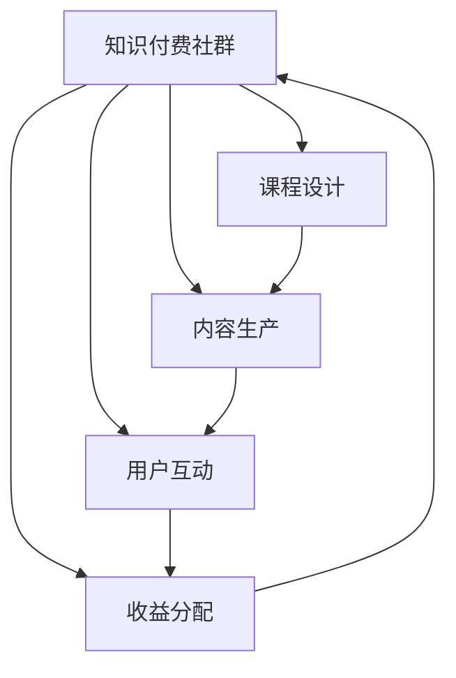

                 

# 打造知识付费社群:运营与管理技巧

## 1. 背景介绍

### 1.1 问题由来
随着互联网的普及和信息技术的发展，知识付费成为一种新的盈利模式。尤其是在教育、金融、医疗等领域，知识付费系统可以实现对专业知识的市场化运营。越来越多的企业开始尝试通过知识付费服务获取收益，同时提升自身的品牌价值。然而，知识付费社群的运营与管理也面临着诸多挑战，如何建立一个既高效又易于管理的知识付费社群，成为一个亟需解决的问题。

### 1.2 问题核心关键点
建立一个成功的知识付费社群，关键在于有效运营与管理。从社群的建立、课程设计、内容生产、用户互动、收益分配等各个环节，都需要精心策划与执行。运营与管理的核心目标在于提高用户的粘性、增加收益和品牌价值。

## 2. 核心概念与联系

### 2.1 核心概念概述

为更好地理解知识付费社群的运营与管理技巧，本节将介绍几个密切相关的核心概念：

- 知识付费社群(Knowledge-based Paywall Community)：通过提供高价值的专业知识服务，向用户收费的社区平台。
- 课程设计(Course Design)：根据用户需求，设计符合市场需求的课程内容。
- 内容生产(Content Production)：高质量课程内容的创造与发布。
- 用户互动(User Interaction)：通过社交功能、论坛、答疑等方式提升用户参与度。
- 收益分配(Revenue Distribution)：合理分配社群运营收益，确保公平性。

这些核心概念之间的逻辑关系可以通过以下Mermaid流程图来展示：



这个流程图展示的知识付费社群的各个核心环节及其相互作用：

1. 知识付费社群的建立始于课程设计，课程设计是根据用户需求而定的。
2. 内容生产是课程设计的延续，是知识付费社群价值的核心。
3. 用户互动旨在提高用户粘性，促进内容消费。
4. 收益分配是知识付费社群运营的核心，涉及合理分配课程销售收入、广告收入、用户捐赠等多方面。

这些概念共同构成了知识付费社群的运营框架，使其能够有效地吸引用户、提供优质内容、提升用户满意度，并最终实现商业目标。

## 3. 核心算法原理 & 具体操作步骤
### 3.1 算法原理概述

知识付费社群的运营与管理，本质上是一个多目标优化问题。其目标在于平衡用户满意度、课程销售收入和运营成本。算法原理主要包括以下几个方面：

- **用户满意度最大化**：通过个性化推荐、互动交流等方式，提升用户对课程的认可度。
- **课程销售收入最大化**：通过合理定价、精准营销、课程推广等手段，最大化课程销售收入。
- **运营成本最小化**：通过优化内容生产流程、降低营销成本、提高用户转化率等措施，降低社群运营成本。

### 3.2 算法步骤详解

知识付费社群的运营与管理一般包括以下几个关键步骤：

**Step 1: 用户调研与需求分析**
- 通过问卷调查、用户访谈、数据分析等手段，获取用户需求和市场趋势。
- 梳理用户画像，识别目标用户群体，为其量身定制课程内容。

**Step 2: 课程设计与内容生产**
- 根据用户需求设计课程大纲，明确课程目标和关键知识点。
- 邀请专家或资深从业者编写课程内容，包括视频、音频、文章等形式。
- 使用先进的内容生产工具和技术，提高内容质量与制作效率。

**Step 3: 用户互动与社群管理**
- 在平台上设立论坛、问答、互动直播等功能，鼓励用户参与。
- 定期组织线上线下活动，如专题讲座、课程更新发布、用户反馈征集等。
- 对用户反馈及时回应，维护社群氛围，提升用户满意度。

**Step 4: 收益分配与商业化策略**
- 根据内容价值和市场反馈，合理定价课程。
- 采用会员制、订阅制、一次性购买等多种收费模式，增加收益渠道。
- 引入广告、赞助、众筹等多元化的收入来源，降低对课程销售的依赖。
- 定期评估运营绩效，调整优化商业化策略，提升整体收益。

### 3.3 算法优缺点

知识付费社群的运营与管理方法具有以下优点：

- 有效提升用户粘性：通过优质课程内容和互动功能，增加用户停留时间。
- 最大化课程销售收入：通过精准的课程设计和营销策略，提高课程销售率。
- 合理控制运营成本：通过优化内容生产流程和采用多元收入方式，降低运营成本。

同时，该方法也存在一定的局限性：

- 对资源要求高：高质量课程内容的制作和社群管理的维护需要大量人力和技术支持。
- 对课程设计要求高：课程内容必须符合市场需求，否则将难以吸引用户。
- 营销难度大：如何精准推广社群和课程，吸引新用户，提升老用户续费率，是一个挑战。
- 数据安全问题：知识付费社群涉及大量用户隐私数据，必须采取严格的保护措施。

尽管存在这些局限性，但知识付费社群的运营与管理方法在大数据、人工智能等技术支持下，仍具有广阔的应用前景和潜力。

### 3.4 算法应用领域

知识付费社群的运营与管理方法在教育、金融、医疗、科技等多个领域都有广泛应用。

- 教育领域：提供在线课程、教育咨询、职业培训等服务，提升用户知识和技能。
- 金融领域：提供理财咨询、投资策略、股票分析等课程，帮助用户管理资产。
- 医疗领域：提供健康科普、疾病预防、医疗咨询等服务，提升用户健康意识。
- 科技领域：提供软件开发、人工智能、大数据等课程，帮助用户掌握前沿技术。

## 4. 数学模型和公式 & 详细讲解  
### 4.1 数学模型构建

构建知识付费社群的运营与管理模型，需要考虑以下几个关键指标：

- 用户活跃度(UA)：衡量用户在社群中的活跃程度。
- 课程销售收入(IR)：衡量课程的收益情况。
- 运营成本(OC)：衡量社群运营的各项支出。

可以构建如下模型：

$$
\max_{UA, IR, OC} \left( UA \times (1-\beta) + IR \times (1-\alpha) \right)
$$

其中 $\alpha$ 和 $\beta$ 分别表示收入和运营成本对用户满意度的影响权重。

### 4.2 公式推导过程

以下我们对用户活跃度、课程销售收入和运营成本的关系进行推导：

假设知识付费社群内有 $N$ 名用户，每名用户每天在社群中花费的时间为 $T$。课程平均价格为 $P$，每名用户平均购买 $X$ 门课程。社群平均运营成本为 $C$。

用户活跃度的计算公式为：

$$
UA = \frac{1}{N} \sum_{i=1}^N \frac{t_i}{T}
$$

其中 $t_i$ 表示第 $i$ 名用户每天在社群中花费的实际时间。

课程销售收入的计算公式为：

$$
IR = P \times X \times N
$$

运营成本的计算公式为：

$$
OC = C \times N
$$

根据以上公式，构建整体运营优化模型：

$$
\max_{UA, IR, OC} \left( UA \times (1-\beta) + IR \times (1-\alpha) \right)
$$

其中 $UA \times (1-\beta)$ 表示通过提升用户活跃度带来的收益，$IR \times (1-\alpha)$ 表示通过增加课程销售收入带来的收益。

### 4.3 案例分析与讲解

以某知识付费平台为例，该平台通过提供编程、金融、教育等多个领域的课程服务，取得了不错的用户和收益增长。平台通过优化课程设计、提升用户体验、引入广告收入等方式，逐步降低对课程销售的依赖。

假设平台每天有 $1000$ 名用户在线，每名用户每天平均花费 $2$ 小时在社群中。平台课程平均价格为 $100$ 元，每名用户平均购买 $2$ 门课程。平台平均运营成本为 $10$ 元/用户/天。通过优化模型，设定 $\alpha=0.5$，$\beta=0.3$，计算最优策略。

根据上述模型，可以计算出最优策略下的用户活跃度和课程销售收入。

## 5. 项目实践：代码实例和详细解释说明
### 5.1 开发环境搭建

在进行知识付费社群的开发实践前，我们需要准备好开发环境。以下是使用Python进行Flask开发的环境配置流程：

1. 安装Anaconda：从官网下载并安装Anaconda，用于创建独立的Python环境。

2. 创建并激活虚拟环境：
```bash
conda create -n flask-env python=3.8 
conda activate flask-env
```

3. 安装Flask：
```bash
pip install flask
```

4. 安装必要的工具包：
```bash
pip install flask-wtf flask-login flask-sqlalchemy flask-migrate sqlalchemy
```

5. 安装Flask-RESTful和Flask-SocketIO：
```bash
pip install flask-restful flask-socketio
```

完成上述步骤后，即可在`flask-env`环境中开始知识付费社群的开发实践。

### 5.2 源代码详细实现

下面以一个简单的知识付费社群平台为例，给出使用Flask进行开发的Python代码实现。

```python
from flask import Flask, request, jsonify
from flask_sqlalchemy import SQLAlchemy
from flask_login import LoginManager, UserMixin, login_user, logout_user, login_required, current_user
from flask_wtf import FlaskForm
from wtforms import StringField, PasswordField, SubmitField, IntegerField
from wtforms.validators import DataRequired, Length
from flask_migrate import Migrate
import socketio
from flask_restful import Resource, Api
import time

app = Flask(__name__)
app.config['SQLALCHEMY_DATABASE_URI'] = 'sqlite:///app.db'
app.config['SECRET_KEY'] = 'your-secret-key'
db = SQLAlchemy(app)
migrate = Migrate(app, db)
login_manager = LoginManager(app)
login_manager.login_view = 'login'
socketio.init_app(app)

class User(db.Model, UserMixin):
    id = db.Column(db.Integer, primary_key=True)
    username = db.Column(db.String(50), unique=True)
    password = db.Column(db.String(80))
    courses = db.relationship('Course', backref='user', lazy='dynamic')

class Course(db.Model):
    id = db.Column(db.Integer, primary_key=True)
    name = db.Column(db.String(100))
    price = db.Column(db.Float)
    description = db.Column(db.Text)
    user_id = db.Column(db.Integer, db.ForeignKey('user.id'))
    total_sales = db.Column(db.Integer, default=0)

class LoginForm(FlaskForm):
    username = StringField('Username', validators=[DataRequired()])
    password = PasswordField('Password', validators=[DataRequired(), Length(min=4, max=20)])
    submit = SubmitField('Log In')

class RegistrationForm(FlaskForm):
    username = StringField('Username', validators=[DataRest('Username must be unique.']))
    password = PasswordField('Password', validators=[DataRequired(), Length(min=4, max=20)])
    submit = SubmitField('Register')

@login_manager.user_loader
def load_user(user_id):
    return User.query.get(int(user_id))

@app.route('/')
def home():
    return render_template('home.html')

@app.route('/login', methods=['GET', 'POST'])
def login():
    form = LoginForm()
    if form.validate_on_submit():
        user = User.query.filter_by(username=form.username.data).first()
        if user and check_password_hash(user.password, form.password.data):
            login_user(user)
            return redirect(url_for('dashboard'))
        else:
            flash('Invalid username or password', 'error')
    return render_template('login.html', form=form)

@app.route('/logout')
@login_required
def logout():
    logout_user()
    return redirect(url_for('home'))

@app.route('/register', methods=['GET', 'POST'])
def register():
    form = RegistrationForm()
    if form.validate_on_submit():
        user = User(username=form.username.data)
        user.password = generate_password_hash(form.password.data)
        db.session.add(user)
        db.session.commit()
        flash('Register success', 'success')
        return redirect(url_for('login'))
    return render_template('register.html', form=form)

@app.route('/dashboard')
@login_required
def dashboard():
    courses = Course.query.all()
    return render_template('dashboard.html', courses=courses)

@app.route('/course/<int:course_id>')
@login_required
def course(course_id):
    course = Course.query.get_or_404(course_id)
    return render_template('course.html', course=course)

@app.route('/api/course')
def course_api():
    courses = Course.query.all()
    courses_list = []
    for course in courses:
        course_data = {
            'id': course.id,
            'name': course.name,
            'price': course.price,
            'description': course.description,
            'total_sales': course.total_sales
        }
        courses_list.append(course_data)
    return jsonify(courses_list)

if __name__ == '__main__':
    socketio.run(app, debug=True, use_reloader=True)
```

### 5.3 代码解读与分析

让我们再详细解读一下关键代码的实现细节：

**User和Course类**：
- `User`类表示平台用户，包含用户名、密码和购买的课程信息。
- `Course`类表示课程信息，包含课程名称、价格、描述和用户信息。

**LoginForm和RegistrationForm类**：
- `LoginForm`和`RegistrationForm`类分别用于处理用户登录和注册逻辑，通过表单数据验证用户的用户名和密码。

**@login_manager.user_loader装饰器**：
- 用于在登录成功后，将用户信息保存在当前会话中，方便后续操作。

**home、login、logout、register和dashboard函数**：
- `home`函数展示平台首页。
- `login`函数处理用户登录逻辑。
- `logout`函数处理用户退出登录逻辑。
- `register`函数处理用户注册逻辑。
- `dashboard`函数展示用户仪表盘，包含已购买的课程信息。

**course函数**：
- `course`函数展示指定课程的详细信息。

**course_api函数**：
- `course_api`函数通过API返回所有课程信息，供前端展示使用。

以上代码实现了一个简单的知识付费社群平台，包括用户登录、注册、课程展示、API接口等功能。开发者可以根据需求进一步扩展，如添加支付功能、课程订阅、用户权限管理等。

## 6. 实际应用场景
### 6.1 智能教育平台

知识付费社群在智能教育领域具有广泛的应用前景。通过知识付费社群，平台可以提供名师讲座、在线辅导、个性化课程等服务，提升用户学习效率。

在技术实现上，可以构建智能推荐系统，根据用户的学习行为和兴趣推荐合适的课程内容，增加用户的粘性和满意度。同时，利用NLP技术，对用户的提问进行智能答疑，提升用户的互动体验。

### 6.2 在线金融教育

金融领域的知识付费社群可以提供证券分析、投资策略、风险管理等课程，帮助用户提升理财水平。通过智能化的投资策略推荐和风险预警，知识付费社群能够提升用户投资收益，降低投资风险。

在技术实现上，可以利用机器学习和大数据分析，分析市场行情和用户投资行为，提供个性化投资建议。同时，利用金融知识图谱和专家系统，提供深度财务分析服务。

### 6.3 健康知识分享

知识付费社群在健康领域具有重要的应用价值。通过知识付费社群，平台可以提供健康科普、疾病预防、心理咨询等服务，提升用户的健康意识和生活质量。

在技术实现上，可以利用智能问诊和健康数据分析，提供个性化的健康管理方案。同时，利用社交网络和用户反馈，建立用户健康知识社区，增强用户的粘性和互动性。

### 6.4 未来应用展望

随着知识付费社群的发展，未来的应用场景将更加丰富和多样化。

在智慧城市治理中，知识付费社群可以提供公共服务、城市管理、应急响应等课程，提升城市管理水平。在农业生产中，知识付费社群可以提供农业技术、农资销售、农村电商等服务，推动农业现代化。

此外，在企业培训、法律咨询、心理咨询等众多领域，知识付费社群也将不断涌现，为各行各业带来新的发展机遇。

## 7. 工具和资源推荐
### 7.1 学习资源推荐

为了帮助开发者系统掌握知识付费社群的运营与管理技巧，这里推荐一些优质的学习资源：

1. 《知识付费：平台构建与运营》系列书籍：系统介绍知识付费平台的建设与管理，包括用户需求分析、课程设计、用户互动等环节。
2. 《在线教育技术应用》课程：介绍在线教育技术的发展与应用，涵盖直播课、录播课、智能推荐等技术。
3. 《知识付费社群运营手册》白皮书：提供知识付费社群运营的实战案例和经验总结，涵盖用户管理、课程推广、商业化策略等。
4. 《自然语言处理与知识付费》论文：探索利用NLP技术提升知识付费社群的用户体验与互动效果，提高平台的核心竞争力。
5. 《知识付费社群的社群文化建设》讲座：分享知识付费社群的运营经验，探讨如何营造良好的社群氛围，增强用户粘性。

通过对这些资源的学习实践，相信你一定能够快速掌握知识付费社群的运营与管理技巧，并用于解决实际的运营问题。
###  7.2 开发工具推荐

高效的开发离不开优秀的工具支持。以下是几款用于知识付费社群开发的常用工具：

1. Flask：Python的轻量级Web框架，灵活便捷，适合快速迭代研究。
2. SQLAlchemy：Python的ORM框架，提供高效的数据库操作功能。
3. Flask-Login：用于用户认证和授权的扩展，支持多种登录方式和用户管理。
4. Flask-SocketIO：用于实时消息通信的扩展，支持WebSocket协议。
5. Flask-WTF：用于Web表单验证的扩展，支持CSRF防护和数据校验。

合理利用这些工具，可以显著提升知识付费社群的开发效率，加快创新迭代的步伐。

### 7.3 相关论文推荐

知识付费社群的运营与管理技术的发展源于学界的持续研究。以下是几篇奠基性的相关论文，推荐阅读：

1. 《基于知识图谱的智能教育平台》：探索利用知识图谱技术，提升在线教育平台的智能推荐和个性化服务。
2. 《在线金融教育的智能推荐系统》：研究利用机器学习和大数据分析，为用户提供个性化的投资建议和风险预警。
3. 《健康知识分享平台的社区文化建设》：探讨如何通过社交网络和用户反馈，建立健康知识社区，增强用户粘性和互动性。
4. 《知识付费社群的课程设计与内容生产》：研究如何通过高质量课程内容和互动功能，提升用户对知识付费社群的认可度。
5. 《知识付费社群的运营与用户满意度优化》：研究如何通过个性化推荐和用户互动，提升知识付费社群的用户满意度。

这些论文代表了大语言模型微调技术的发展脉络。通过学习这些前沿成果，可以帮助研究者把握学科前进方向，激发更多的创新灵感。

## 8. 总结：未来发展趋势与挑战
### 8.1 总结

本文对知识付费社群的运营与管理技巧进行了全面系统的介绍。首先阐述了知识付费社群的研究背景和意义，明确了运营与管理在提升用户粘性、增加收益和品牌价值方面的独特价值。其次，从原理到实践，详细讲解了知识付费社群的数学模型和关键步骤，给出了知识付费社群开发的完整代码实例。同时，本文还广泛探讨了知识付费社群在教育、金融、健康等多个领域的应用前景，展示了知识付费社群的巨大潜力。最后，本文精选了知识付费社群的技术资源，力求为读者提供全方位的技术指引。

通过本文的系统梳理，可以看到，知识付费社群的运营与管理技术正在成为NLP领域的重要范式，极大地拓展了知识付费平台的应用边界，催生了更多的落地场景。受益于大数据、人工智能等技术的发展，知识付费社群必将在教育、金融、健康等众多领域大放异彩，为各行各业带来新的发展机遇。

### 8.2 未来发展趋势

展望未来，知识付费社群的运营与管理技术将呈现以下几个发展趋势：

1. 用户互动方式多样化。通过社交网络、论坛、直播等多样化的互动方式，提升用户参与度，增加用户粘性。
2. 课程内容智能化。利用NLP、推荐系统等技术，提供智能化的课程推荐和个性化学习服务，提升用户学习效率。
3. 商业化策略多元化。除了课程销售外，通过广告、赞助、会员制等多种形式增加收益，降低对课程销售的依赖。
4. 数据驱动运营。利用大数据分析，优化课程设计和用户互动策略，提升整体运营效果。
5. 跨平台整合。通过API接口和社交网络，实现知识付费社群与外部平台的数据共享和资源整合，提升用户覆盖面。

以上趋势凸显了知识付费社群技术的广阔前景。这些方向的探索发展，必将进一步提升知识付费社群的用户体验和运营效率，为传统行业带来新的变革力量。

### 8.3 面临的挑战

尽管知识付费社群的运营与管理技术已经取得了不小的进步，但在迈向更加智能化、普适化应用的过程中，它仍面临着诸多挑战：

1. 用户数据隐私保护。知识付费社群涉及大量用户隐私数据，如何保障用户数据安全，防止信息泄露，是一个重要的挑战。
2. 课程内容质量控制。高质量课程内容的生产和维护需要大量资源和技术支持，如何确保课程内容的质量和更新频率，是一个重要的课题。
3. 商业模式创新。如何在知识付费社群中引入更多元化的收益渠道，降低对课程销售的依赖，是一个亟需解决的问题。
4. 用户互动机制设计。如何设计合理的互动机制，提升用户参与度，增加用户粘性，是一个需要深入研究的课题。
5. 技术平台建设。如何搭建高效、稳定、安全的技术平台，支撑知识付费社群的快速迭代和扩展，是一个重要的技术挑战。

尽管存在这些挑战，但知识付费社群的运营与管理技术在技术进步和创新应用的推动下，仍有广阔的发展空间。相信随着学界和产业界的共同努力，这些挑战终将一一被克服，知识付费社群必将在知识传播和服务创新中发挥更大的作用。

### 8.4 研究展望

面对知识付费社群所面临的诸多挑战，未来的研究需要在以下几个方面寻求新的突破：

1. 探索更高效的课程内容生成技术。通过利用NLP和生成对抗网络(GAN)等技术，提升课程内容的生成效率和质量。
2. 研究更智能的用户互动机制。通过引入自然语言理解和情感分析技术，提升知识付费社群的用户互动效果。
3. 设计更灵活的商业化策略。通过引入区块链技术、智能合约等手段，探索更灵活、公平的收益分配机制。
4. 融合更多元化的信息源。通过利用互联网数据、社交媒体信息等，提升知识付费社群的内容丰富性和多样性。
5. 构建更智能的用户管理机制。通过引入机器学习和大数据分析技术，提升用户管理和用户画像的精度。

这些研究方向的探索，必将引领知识付费社群技术迈向更高的台阶，为知识付费社群带来新的发展机遇。面向未来，知识付费社群技术还需要与其他人工智能技术进行更深入的融合，如知识表示、因果推理、强化学习等，多路径协同发力，共同推动知识付费社群的进步。

## 9. 附录：常见问题与解答

**Q1：知识付费社群如何设计课程内容？**

A: 知识付费社群的课程内容设计需要考虑以下几个关键因素：

1. 目标用户群体：根据用户群体的特点，设计符合其需求和兴趣的课程内容。
2. 市场需求：通过市场调研，了解用户的痛点和需求，设计具有市场竞争力的课程内容。
3. 师资力量：邀请行业专家或资深从业者编写课程内容，提升课程的权威性和专业性。
4. 内容形式：采用多样化形式，如视频、音频、文章、互动直播等，增加课程的吸引力和互动性。
5. 持续更新：定期更新课程内容，引入最新技术和行业动态，保持课程的持续性和时效性。

**Q2：如何提升知识付费社群的用户粘性？**

A: 提升知识付费社群的用户粘性需要从多个方面入手：

1. 提供优质内容：通过高质量课程内容，提升用户的学习体验和满意度。
2. 增加互动功能：通过社交网络、论坛、直播等互动功能，增加用户的参与度和互动性。
3. 引入社区文化：建立良好的社区氛围，增强用户的归属感和认同感。
4. 定期举办活动：通过线上线下活动，如专题讲座、课程更新发布等，增加用户参与度。
5. 提供个性化服务：通过智能推荐系统，提供个性化的学习方案和内容推荐。

**Q3：如何合理分配知识付费社群的收益？**

A: 合理分配知识付费社群的收益，需要考虑以下几个关键因素：

1. 课程销售收入：课程销售是知识付费社群的主要收益来源，需要合理定价，确保收入的可持续性。
2. 广告收入：引入广告和赞助，增加多元化的收入渠道，降低对课程销售的依赖。
3. 用户捐赠：通过用户捐赠和会员制等方式，增加社群的收益来源。
4. 公平性：确保收益分配的公平性，避免部分用户对收益的过度依赖，保障平台的健康发展。
5. 激励机制：设计合理的激励机制，鼓励用户参与内容创作和互动，提升社群的活跃度。

**Q4：如何保护知识付费社群的用户数据隐私？**

A: 保护知识付费社群的用户数据隐私，需要采取以下措施：

1. 数据加密：对用户数据进行加密存储，防止数据泄露。
2. 权限控制：严格控制数据访问权限，只允许必要的角色访问用户数据。
3. 数据匿名化：对用户数据进行匿名化处理，防止用户隐私被侵犯。
4. 数据安全监控：实时监控用户数据访问和操作，及时发现和处理异常情况。
5. 法律法规遵守：遵守相关法律法规，确保用户数据的合法合规使用。

**Q5：知识付费社群如何实现商业化？**

A: 知识付费社群的商业化需要考虑以下几个方面：

1. 课程销售：通过高质量课程内容，吸引用户付费购买，提升课程销售收入。
2. 广告收入：引入广告和赞助，增加多元化的收入渠道。
3. 会员制：通过会员制和订阅制，增加用户的黏性和支付频次。
4. 内容增值：提供增值服务，如个性化推荐、智能答疑等，提升用户的消费体验和满意度。
5. 用户反馈：通过用户反馈和需求调研，优化课程内容和商业化策略，提升用户的满意度和忠诚度。

以上是知识付费社群运营与管理的关键问题和解决方案，希望能为你提供有益的参考和指导。

---

作者：禅与计算机程序设计艺术 / Zen and the Art of Computer Programming

