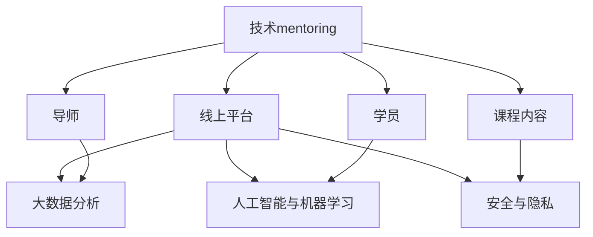

                 

# 技术mentoring：线上平台的搭建与运营

## 1. 背景介绍

### 1.1 问题由来
随着互联网技术的发展，线上教育、远程办公、在线咨询等远程服务形式愈发普及，线上技术平台成为连接用户与服务的核心工具。然而，线上平台如何高效、安全、稳定地运营，成为了摆在企业面前的重要课题。技术mentoring作为连接企业与用户，助力员工成长的关键服务，其线上平台的搭建与运营尤为关键。

### 1.2 问题核心关键点
在技术mentoring领域，线上平台的搭建与运营具有以下几个核心关键点：

- **高效匹配**：能够快速匹配导师与学员，形成有效的学习互动关系。
- **灵活交互**：支持多种形式的交流，包括文字、语音、视频等。
- **数据驱动**：通过数据分析，优化课程内容和教学方法，提升教学效果。
- **个性化推荐**：根据学员背景和需求，推荐合适的导师和课程。
- **用户体验**：提供便捷的注册、导航、支付等界面，保证用户体验良好。
- **技术安全**：保障数据和用户隐私，避免技术漏洞和安全风险。

本文将围绕这些关键点，探讨如何搭建和运营一个高效、灵活、安全的技术mentoring线上平台。

## 2. 核心概念与联系

### 2.1 核心概念概述

为更好地理解技术mentoring线上平台的搭建与运营方法，本节将介绍几个密切相关的核心概念：

- **技术mentoring**：以提升技术人员技能和知识为主要目标，提供一对一或多对多的辅导、分享、协作等服务。
- **线上平台**：基于互联网技术，通过Web应用或移动应用提供的服务系统，用于支持技术mentoring的在线互动。
- **大数据分析**：通过收集和分析用户行为数据，优化产品和服务，提升用户体验和运营效率。
- **人工智能与机器学习**：用于个性化推荐、情感分析、自动文本生成等技术，提升mentoring效果。
- **安全与隐私**：涉及数据加密、访问控制、认证和授权等，保障用户隐私和安全。

这些核心概念之间的逻辑关系可以通过以下Mermaid流程图来展示：



这个流程图展示了大语言模型的核心概念及其之间的关系：

1. 技术mentoring通过线上平台实现，用于提供辅导和分享服务。
2. 大数据分析用于优化线上平台的用户体验和运营策略。
3. 人工智能与机器学习用于增强个性化的推荐和互动。
4. 安全与隐私保障数据和用户的安全。

这些概念共同构成了技术mentoring线上平台的完整框架，使其能够在多个层面提供优质的mentoring服务。

## 3. 核心算法原理 & 具体操作步骤
### 3.1 算法原理概述

技术mentoring线上平台的搭建与运营，本质上是一个多层次、多目标的系统优化问题。其核心思想是通过一系列技术手段，构建一个高效的匹配、交互、分析和安全的平台环境。

在构建过程中，我们通常采用以下几个关键算法和步骤：

- **推荐算法**：用于推荐导师和课程，基于学员的历史行为数据、偏好和课程的评价数据。
- **自然语言处理(NLP)**：用于分析学员和导师的交流文本，进行情感分析、意图识别等，优化互动质量。
- **机器学习**：用于预测学员的学习效果，调整导师的分配策略，提升整体教学效果。
- **分布式计算**：用于处理大规模数据，提高平台的并发处理能力和稳定性。
- **数据加密和存储**：用于保护用户隐私，防止数据泄露和篡改。

这些算法和步骤相互配合，共同支持平台的高效运营。

### 3.2 算法步骤详解

技术mentoring线上平台的搭建与运营，通常包括以下几个关键步骤：

**Step 1: 需求分析与规划**
- 确定平台的定位和目标用户，收集用户需求和使用场景。
- 设计平台的整体架构，包括前端和后端的系统组件。

**Step 2: 数据收集与预处理**
- 收集用户数据，包括学员的基本信息、学习历史、评价等。
- 收集导师数据，包括专业背景、教学经验、评价等。
- 收集课程数据，包括课程内容、评价、难度等。

**Step 3: 系统搭建**
- 选择适合的开发语言和技术栈，搭建平台的前端和后端系统。
- 集成必要的第三方服务和API，如云存储、支付服务、地图API等。
- 设计数据模型，确保数据的一致性和完整性。

**Step 4: 功能开发与测试**
- 开发核心功能，包括用户注册、课程浏览、导师匹配、课程评价等。
- 进行功能测试，确保系统的稳定性和可靠性。
- 进行性能测试，优化系统的响应速度和并发处理能力。

**Step 5: 数据分析与优化**
- 收集用户行为数据，进行统计分析和数据挖掘。
- 基于分析结果，优化推荐算法和导师匹配策略。
- 进行A/B测试，评估功能改进的效果。

**Step 6: 安全保障与合规**
- 实施数据加密和访问控制策略，保障数据和用户的安全。
- 遵守数据隐私法规，确保合规性。

**Step 7: 上线与运营**
- 部署平台到生产环境，进行监控和维护。
- 持续收集用户反馈，优化平台功能和用户体验。
- 定期进行系统升级和数据备份。

以上是技术mentoring线上平台搭建与运营的一般流程。在实际应用中，还需要根据具体需求，对各个环节进行优化设计，如改进推荐算法、引入智能客服、增强数据安全性等。

### 3.3 算法优缺点

技术mentoring线上平台的搭建与运营方法具有以下优点：

1. **灵活便捷**：用户可以通过线上平台随时随地获取mentoring服务，节省时间和成本。
2. **覆盖面广**：线上平台能够连接更多的导师和学员，扩大mentoring服务的覆盖范围。
3. **数据驱动**：通过大数据分析，优化推荐和教学策略，提升教学效果。
4. **扩展性强**：系统架构可扩展，支持新增功能和服务。
5. **安全性高**：数据加密和访问控制技术，保障用户隐私和平台安全。

同时，该方法也存在一些局限性：

1. **互动质量依赖技术**：平台的服务质量依赖于自然语言处理和推荐算法的效果，技术复杂度较高。
2. **数据隐私风险**：线上平台需要收集和存储大量用户数据，数据隐私和安全风险较大。
3. **初期成本较高**：平台搭建和运维需要较高的初期投入，包括人力、技术和基础设施成本。
4. **用户体验依赖设计**：用户体验的设计和优化需要专业的UI/UX设计师，初期难度较大。

尽管存在这些局限性，但就目前而言，基于线上平台的mentoring方法是提升技术技能和知识传播效果的重要手段。未来相关研究的重点在于如何进一步降低平台搭建的初期成本，提高互动质量，增强数据安全性，同时兼顾用户体验和教学效果。

### 3.4 算法应用领域

技术mentoring线上平台的搭建与运营方法，已经在诸多领域得到了应用，例如：

- **IT技术培训**：提供技术入门、进阶和深化的学习资源，助力技术人员技能提升。
- **企业内部培训**：连接内部专家和员工，提升团队整体技术水平和工作效率。
- **开源社区**：提供代码审核、知识共享、项目协作等mentoring服务，促进开源项目的健康发展。
- **在线教育**：提供个性化学习路径、互动答疑、课程评估等，提升在线教育的教学质量。
- **远程办公**：提供技术支持、协作工具、在线交流等服务，提升远程办公的效率和质量。

除了上述这些经典应用外，技术mentoring线上平台还被创新性地应用到更多场景中，如在线医疗咨询、虚拟实验室、远程实验等，为技术知识和技能传播提供了新的渠道。随着技术的不断进步，相信技术mentoring线上平台将在更广泛的领域中发挥重要作用。

## 4. 数学模型和公式 & 详细讲解 & 举例说明
### 4.1 数学模型构建

本节将使用数学语言对技术mentoring线上平台的搭建与运营过程进行更加严格的刻画。

记技术mentoring线上平台为 $M_{\theta}$，其中 $\theta$ 为模型的参数集合。假设用户数量为 $N$，导师数量为 $T$，课程数量为 $C$。

定义平台的用户行为数据为 $D=\{(x_i,y_i)\}_{i=1}^N$，其中 $x_i$ 为用户的行为数据，包括浏览记录、操作记录、评价等，$y_i$ 为用户的行为标签，如是否注册、是否参与某课程等。

定义平台的导师数据为 $D_T=\{(x_t,y_t)\}_{t=1}^T$，其中 $x_t$ 为导师的基本信息、教学经验、评价等，$y_t$ 为导师的专业标签，如前端开发、后端开发等。

定义平台的课程数据为 $D_C=\{(x_c,y_c)\}_{c=1}^C$，其中 $x_c$ 为课程的介绍、难度、评价等，$y_c$ 为课程的专业标签，如数据结构、算法等。

平台的用户行为数据可以通过统计和分析，得到用户的历史行为模式，用于推荐导师和课程。导师和课程的数据可以通过标准化处理，得到对应的特征向量，用于导师匹配和课程推荐。

### 4.2 公式推导过程

以下我们以推荐算法为例，推导推荐模型的数学公式及其训练过程。

假设推荐模型为 $M_{\theta}$，用户 $u$ 对导师 $i$ 的兴趣为 $r_{ui}$，用户 $u$ 对课程 $c$ 的兴趣为 $r_{uc}$。我们定义推荐模型的目标是最小化预测误差：

$$
\min_{\theta} \frac{1}{N}\sum_{u=1}^N \sum_{i=1}^T \sum_{c=1}^C r_{ui} \log M_{\theta}(i,c) + (1-r_{ui}) \log (1-M_{\theta}(i,c))
$$

其中 $M_{\theta}(i,c)$ 为模型预测用户 $u$ 对导师 $i$ 和课程 $c$ 的匹配程度。

通过梯度下降等优化算法，训练推荐模型：

$$
\theta \leftarrow \theta - \eta \nabla_{\theta} \mathcal{L}(\theta)
$$

其中 $\eta$ 为学习率，$\mathcal{L}$ 为推荐模型的损失函数。

在得到推荐模型的训练结果后，即可将其应用于实际的推荐场景，为用户推荐最合适的导师和课程。

### 4.3 案例分析与讲解

考虑一个实际的技术mentoring平台，我们以导师推荐为例，展示推荐算法的具体实现。

假设平台收集了导师 $i$ 的以下数据：

- 基本信息：姓名、性别、年龄、专业背景等。
- 教学经验：教学年限、授课课程、获得的证书等。
- 评价数据：学员的评价、导师的反馈等。

平台可以使用协同过滤推荐算法，基于用户历史行为数据和导师评价数据，为用户推荐合适的导师。具体步骤如下：

1. 对导师数据进行特征提取，得到导师的特征向量 $\mathbf{f}_i$。
2. 对用户数据进行特征提取，得到用户的特征向量 $\mathbf{g}_u$。
3. 计算用户 $u$ 对导师 $i$ 的匹配程度 $r_{ui}$。
4. 根据匹配程度 $r_{ui}$，计算用户 $u$ 对导师 $i$ 的兴趣 $r_{ui}$。
5. 根据兴趣 $r_{ui}$，排序推荐导师列表，返回推荐结果。

通过以上步骤，平台可以为每个用户推荐合适的导师，提升用户的学习效果和满意度。

## 5. 项目实践：代码实例和详细解释说明
### 5.1 开发环境搭建

在进行mentoring平台开发前，我们需要准备好开发环境。以下是使用Python进行Django开发的环境配置流程：

1. 安装Anaconda：从官网下载并安装Anaconda，用于创建独立的Python环境。

2. 创建并激活虚拟环境：
```bash
conda create -n mentoring-env python=3.8 
conda activate mentoring-env
```

3. 安装Django：
```bash
pip install django
```

4. 安装必要的第三方库：
```bash
pip install Pillow django-cors-headers django-compressor django-axes
```

5. 安装Web框架：
```bash
pip install django-axes django-compressor django-axes django-cors-headers
```

完成上述步骤后，即可在`mentoring-env`环境中开始mentoring平台开发。

### 5.2 源代码详细实现

下面我们以导师推荐系统为例，给出使用Django框架实现导师匹配的Python代码实现。

首先，定义导师和课程的模型：

```python
from django.db import models

class Instructor(models.Model):
    name = models.CharField(max_length=100)
    gender = models.CharField(max_length=10)
    age = models.IntegerField()
    background = models.CharField(max_length=100)
    experience = models.IntegerField()
    courses = models.ManyToManyField('Course')

class Course(models.Model):
    name = models.CharField(max_length=100)
    level = models.CharField(max_length=10)
    description = models.TextField()
    instructors = models.ManyToManyField('Instructor')
```

然后，定义导师推荐的视图函数：

```python
from django.shortcuts import render
from django.http import JsonResponse
from .models import Instructor, Course

def instructor_recommend(request):
    if request.method == 'POST':
        user_id = request.POST['user_id']
        recommendations = Instructor.objects.filter(id__in=Course.objects.filter(user_id=user_id).values_list('instructor_id', flat=True))
        response = []
        for instructor in recommendations:
            instructor_data = {
                'id': instructor.id,
                'name': instructor.name,
                'gender': instructor.gender,
                'age': instructor.age,
                'background': instructor.background,
                'experience': instructor.experience,
                'courses': instructor.courses.values_list('name', flat=True)
            }
            response.append(instructor_data)
        return JsonResponse(response, safe=False)
    else:
        return render(request, 'instructor_recommend.html')
```

最后，定义导师推荐的视图模板：

```html
<!DOCTYPE html>
<html>
<head>
    <title>Instructor Recommendation</title>
</head>
<body>
    <h1>Instructor Recommendation</h1>
    <form method="post">
        
        <input type="text" name="user_id">
        <button type="submit">Submit</button>
    </form>
    <div id="recommendations"></div>
    <script>
        const form = document.querySelector('form');
        const recommendationsDiv = document.querySelector('#recommendations');
        
        form.addEventListener('submit', async (event) => {
            event.preventDefault();
            const user_id = form.elements.user_id.value;
            const response = await fetch('/instructor_recommend', {
                method: 'POST',
                headers: { 'Content-Type': 'application/json' },
                body: JSON.stringify({ user_id })
            });
            const recommendations = await response.json();
            recommendationsDiv.innerHTML = '';
            for (const recommendation of recommendations) {
                const div = document.createElement('div');
                div.innerHTML = `<p>Name: ${recommendation.name}</p><p>Gender: ${recommendation.gender}</p><p>Age: ${recommendation.age}</p><p>Background: ${recommendation.background}</p><p>Experience: ${recommendation.experience}</p><p>Courses: ${recommendation.courses.join(', ')}</p>`;
                recommendationsDiv.appendChild(div);
            }
        });
    </script>
</body>
</html>
```

以上就是使用Django框架实现导师推荐系统的完整代码实现。可以看到，通过Django的ORM和视图函数，可以快速搭建导师推荐系统，提供高效的导师匹配服务。

### 5.3 代码解读与分析

让我们再详细解读一下关键代码的实现细节：

**Instructor和Course模型**：
- `Instructor` 模型：包含导师的基本信息、教学经验、授课课程等字段，与 `Course` 模型形成多对多关系。
- `Course` 模型：包含课程的名称、难度、描述、授课导师等字段，与 `Instructor` 模型形成多对多关系。

**instructor_recommend视图函数**：
- 接收 POST 请求，获取用户 ID。
- 根据用户 ID 筛选出导师和课程的推荐结果。
- 将推荐结果封装成 JSON 格式，返回给前端页面。
- 如果请求方法不是 POST，则渲染推荐页面的模板。

**instructor_recommend模板**：
- 定义 HTML 表单，获取用户 ID。
- 定义 `#recommendations` 元素，用于显示推荐结果。
- 监听表单提交事件，发送 POST 请求到服务器，获取推荐结果，并动态更新页面内容。

通过以上代码，我们可以看到 Django 框架的便捷性和易用性，可以快速构建一个导师推荐系统，满足技术mentoring平台的需求。

当然，工业级的系统实现还需考虑更多因素，如导师课程的实时更新、推荐算法的优化、用户反馈的集成等。但核心的 mentor 推荐逻辑基本与此类似。

## 6. 实际应用场景
### 6.1 在线教育平台

技术mentoring线上平台在在线教育领域有着广泛的应用。平台可以连接世界各地的优秀教师，提供高质量的在线课程，助力全球教育公平。

在技术实现上，平台可以提供实时答疑、作业批改、学习进度跟踪等功能，通过大数据分析和推荐算法，优化课程内容和教学方法，提升学习效果。例如，一个编程在线教育平台可以基于学员的学习行为数据，推荐适合的编程课程和导师，并提供实时的编程答疑和代码审核，帮助学员快速提升编程技能。

### 6.2 企业内部培训

技术mentoring线上平台在企业内部培训中也发挥着重要作用。平台可以提供专家讲座、技能培训、团队协作等服务，提升员工的技能水平和团队协作能力。

在技术实现上，平台可以集成内部知识库、视频课程、在线问答等资源，通过推荐算法和个性化推荐，帮助员工找到适合自己的学习内容。例如，一个企业可以通过平台提供内部的技术分享和交流，让员工随时学习最新的技术知识和业务动态，提升整体技术水平和工作效率。

### 6.3 开源社区

技术mentoring线上平台在开源社区中也有着重要应用。平台可以提供代码审核、知识共享、项目协作等服务，促进开源项目的健康发展。

在技术实现上，平台可以集成代码托管系统、版本控制系统、协作工具等，通过推荐算法和社区活动，吸引更多的开发者参与项目，共同推动开源项目的进展。例如，一个开源社区可以通过平台提供实时的代码审核和问题答疑，提高代码质量和项目的可维护性，促进开源社区的健康发展。

### 6.4 未来应用展望

随着技术的不断进步，技术mentoring线上平台将在更多领域得到应用，为教育、企业、社区等带来新的发展机遇。

在智慧医疗领域，平台可以提供医学知识分享、病例分析、远程会诊等服务，提升医疗服务的质量和效率。

在智能制造领域，平台可以提供设备维护、生产优化、质量检测等服务，提升制造业的智能化水平。

在智能交通领域，平台可以提供交通流量分析、事故预警、智能导航等服务，提升交通安全和出行效率。

此外，在金融、农业、艺术等众多领域，技术mentoring线上平台也将不断拓展应用，为各行各业带来新的变革和机遇。

## 7. 工具和资源推荐
### 7.1 学习资源推荐

为了帮助开发者系统掌握技术mentoring平台的搭建与运营的理论基础和实践技巧，这里推荐一些优质的学习资源：

1. **《Python Django实战》**：详细介绍了Django框架的使用方法和最佳实践，适合初学者和进阶开发者。
2. **《自然语言处理入门与实践》**：涵盖自然语言处理的基本概念和前沿技术，适合对NLP感兴趣的开发者。
3. **《推荐系统算法与实战》**：介绍了推荐算法的理论和实现方法，适合对推荐系统感兴趣的技术开发者。
4. **Coursera《Machine Learning》课程**：由斯坦福大学教授Andrew Ng主讲的机器学习课程，涵盖机器学习的基础知识和算法实现，适合学习数据科学和机器学习的开发者。
5. **Kaggle竞赛平台**：提供了大量数据科学和机器学习竞赛，可以练习和展示自己的技能，适合对竞赛和实战感兴趣的技术开发者。

通过对这些资源的学习实践，相信你一定能够快速掌握技术mentoring平台的搭建与运营的精髓，并用于解决实际的mentoring问题。

### 7.2 开发工具推荐

高效的开发离不开优秀的工具支持。以下是几款用于技术mentoring平台开发的常用工具：

1. **Django框架**：基于Python的Web框架，适合快速构建Web应用，支持快速开发和部署。
2. **Flask框架**：轻量级的Web框架，适合开发小型应用，灵活性强。
3. **React框架**：基于JavaScript的Web应用框架，支持构建交互式的Web界面，适合前端开发者。
4. **AWS云平台**：提供云存储、云数据库、云服务器等云服务，支持分布式应用和负载均衡，适合大规模部署。
5. **Jenkins**：自动化持续集成工具，支持自动构建、测试和部署，适合自动化开发和部署。

合理利用这些工具，可以显著提升技术mentoring平台的开发效率，加快创新迭代的步伐。

### 7.3 相关论文推荐

技术mentoring平台的搭建与运营技术的发展源于学界的持续研究。以下是几篇奠基性的相关论文，推荐阅读：

1. **《推荐系统理论与实践》**：介绍了推荐算法的基本原理和实现方法，适合了解推荐系统的开发者。
2. **《Django实战：Web开发与测试》**：详细介绍了Django框架的使用方法和最佳实践，适合学习Web开发的开发者。
3. **《自然语言处理与深度学习》**：涵盖了自然语言处理和深度学习的基本概念和前沿技术，适合学习NLP和DL的开发者。
4. **《智能推荐系统：算法与技术》**：介绍了推荐系统的理论和技术，适合对推荐系统感兴趣的技术开发者。

这些论文代表了大语言模型微调技术的发展脉络。通过学习这些前沿成果，可以帮助研究者把握学科前进方向，激发更多的创新灵感。

## 8. 总结：未来发展趋势与挑战

### 8.1 总结

本文对技术mentoring线上平台的搭建与运营方法进行了全面系统的介绍。首先阐述了技术mentoring的背景和意义，明确了线上平台的定位和目标用户，指出了平台的几个核心关键点。其次，从原理到实践，详细讲解了平台的搭建与运营的数学模型和算法步骤，给出了完整的代码实例。同时，本文还探讨了平台在在线教育、企业培训、开源社区等领域的广泛应用前景，展示了线上平台的重要价值。最后，本文精选了平台搭建与运营的学习资源、开发工具和相关论文，力求为开发者提供全方位的技术指引。

通过本文的系统梳理，可以看到，技术mentoring线上平台是连接导师与学员、提升技术技能和知识传播效果的重要工具。通过平台的高效匹配、灵活交互、数据分析和个性化推荐等功能，可以显著提升技术mentoring的效果和用户满意度。未来，伴随技术的不断进步和应用场景的拓展，技术mentoring线上平台必将在更多领域发挥重要作用，推动技术知识传播的规模化和智能化发展。

### 8.2 未来发展趋势

展望未来，技术mentoring线上平台的搭建与运营技术将呈现以下几个发展趋势：

1. **个性化推荐**：随着推荐算法的不断进步，平台的个性化推荐将更加精准和高效，提升用户体验和教学效果。
2. **智能客服**：平台引入智能客服，提供24小时不间断的用户支持，提升用户满意度和平台粘性。
3. **数据安全**：平台将更加重视数据安全和隐私保护，采用先进的加密技术和访问控制策略，保障用户数据安全。
4. **多模态交互**：平台将支持语音、视频等多模态交互方式，提升用户的使用体验。
5. **开源共享**：平台将更多地采用开源技术，降低开发成本，促进技术的共享和交流。
6. **跨平台融合**：平台将实现多设备、多平台融合，支持移动端和桌面端，提升用户的使用便利性。

以上趋势凸显了技术mentoring线上平台的发展方向。这些方向的探索发展，必将进一步提升平台的服务质量，增强用户体验和运营效果，推动技术知识传播的智能化和规模化发展。

### 8.3 面临的挑战

尽管技术mentoring线上平台已经取得了不小的进展，但在迈向更加智能化、普适化应用的过程中，它仍面临着诸多挑战：

1. **数据获取困难**：高质量用户和导师数据的获取难度较大，需要大量人力和成本。
2. **平台稳定性**：大规模并发请求下，平台需要保证高可用性和稳定性，避免系统崩溃。
3. **技术复杂度高**：平台涉及多种技术和工具，技术栈复杂，需要高水平的技术团队支持。
4. **用户隐私风险**：平台需要处理大量用户数据，数据隐私和安全风险较大，需要严格的数据保护措施。
5. **用户体验优化**：平台需要不断优化界面和功能，提升用户体验和互动效果。
6. **运营成本高**：平台的运维和维护成本较高，需要持续的投入和优化。

尽管存在这些挑战，但通过不断创新和优化，技术mentoring线上平台必将在更多领域得到应用，推动技术知识传播的发展。相信随着技术的不断进步和业界合作，这些挑战终将一一克服，技术mentoring线上平台必将在构建人机协同的智能时代中扮演越来越重要的角色。

### 8.4 研究展望

面对技术mentoring线上平台面临的挑战，未来的研究需要在以下几个方面寻求新的突破：

1. **推荐算法优化**：探索更高效、更精准的推荐算法，提升个性化推荐的效果。
2. **智能客服系统**：引入智能客服系统，提升用户支持和互动效果。
3. **数据隐私保护**：研究先进的数据加密和访问控制技术，保障用户数据安全。
4. **多模态交互**：探索多模态交互技术，提升用户的使用体验。
5. **开源技术应用**：更多地采用开源技术，降低开发成本，促进技术的共享和交流。
6. **跨平台融合**：实现多设备、多平台融合，提升用户的使用便利性。

这些研究方向将引领技术mentoring线上平台迈向更高的台阶，为技术知识传播带来新的突破。面向未来，平台需要更加注重用户体验、数据安全和平台稳定性，不断优化和创新，才能真正实现技术知识传播的智能化和规模化发展。

## 9. 附录：常见问题与解答

**Q1：技术mentoring平台需要哪些技术栈？**

A: 技术mentoring平台的搭建与运营涉及多种技术和工具，主要包括：
- 前端技术：如HTML、CSS、JavaScript等，用于构建用户界面。
- 后端技术：如Python、Django等，用于处理数据和业务逻辑。
- 数据库技术：如MySQL、PostgreSQL等，用于存储和管理数据。
- 云计算技术：如AWS、Google Cloud等，用于提供基础设施和云服务。
- 推荐算法：如协同过滤、深度学习等，用于个性化推荐和匹配。

**Q2：推荐算法中常用的推荐策略有哪些？**

A: 推荐算法中常用的推荐策略包括：
- 协同过滤：基于用户和物品的相似性，进行推荐。
- 基于内容的推荐：根据物品的属性和特征，进行推荐。
- 混合推荐：结合多种推荐策略，提升推荐效果。

**Q3：技术mentoring平台如何处理数据隐私问题？**

A: 技术mentoring平台可以通过以下措施保障数据隐私：
- 数据加密：对敏感数据进行加密处理，防止数据泄露。
- 访问控制：采用权限控制机制，限制数据访问范围。
- 匿名化处理：对用户数据进行匿名化处理，防止个人信息泄露。

**Q4：技术mentoring平台如何保证系统的稳定性？**

A: 技术mentoring平台可以通过以下措施保证系统稳定性：
- 负载均衡：通过负载均衡技术，分布式处理请求，避免单点故障。
- 数据备份：定期备份数据，防止数据丢失和损坏。
- 监控告警：实时监控系统性能，设置异常告警阈值，及时处理故障。

**Q5：技术mentoring平台如何处理用户反馈？**

A: 技术mentoring平台可以通过以下措施处理用户反馈：
- 收集用户反馈：通过问卷、评论、评分等方式，收集用户反馈。
- 数据分析：对用户反馈进行数据分析，识别问题所在。
- 改进优化：根据用户反馈，不断改进和优化平台功能，提升用户体验。

通过以上措施，技术mentoring平台可以更好地处理用户反馈，提升用户满意度和平台运营效果。

---

作者：禅与计算机程序设计艺术 / Zen and the Art of Computer Programming

