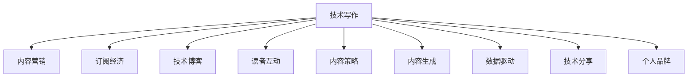

                 

# 技术写作：打造百万订阅的技术博客

> 关键词：技术写作, 内容营销, 订阅经济, 技术博客, 读者互动, 内容策略, 内容生成, 数据驱动, 技术分享, 个人品牌

## 1. 背景介绍

### 1.1 问题由来
在数字时代的浪潮中，技术写作已成为连接技术专家与广泛读者群体的重要桥梁。无论是通过书籍、博客、论文还是视频，高质量的技术内容能够帮助读者理解复杂的技术概念，推动技术知识的传播和应用。然而，技术写作并非易事。随着技术发展的日新月异，如何保持内容的持续更新和高质量，如何吸引和留住大量忠实读者，是许多技术博客和内容创作者面临的共同挑战。

### 1.2 问题核心关键点
技术写作的核心在于如何将复杂的技术知识转化为易懂的表达，并以此吸引和维持读者的兴趣。优秀的技术博客不仅能提供实用的技术知识，还能建立品牌信任，创造社区效应，进而形成可持续的订阅经济。本文将详细探讨如何打造百万订阅的技术博客，涵盖从内容策略、内容生成、数据驱动、互动策略到个人品牌塑造的各个方面。

### 1.3 问题研究意义
在当前信息爆炸的时代，优质的技术内容对于技术专家和读者的重要性不言而喻。而通过打造百万订阅的技术博客，不仅能显著提升内容影响力，还能为作者带来可观的收益，促进技术知识的应用和传播。本文旨在为技术创作者提供系统、全面的技术写作和内容营销指导，助力其在技术领域中脱颖而出，打造自己的品牌和影响力。

## 2. 核心概念与联系

### 2.1 核心概念概述

为更好地理解如何打造百万订阅的技术博客，本节将介绍几个关键概念：

- 技术写作（Technical Writing）：指将复杂的技术知识以清晰、易懂的方式进行呈现，旨在帮助读者理解和应用这些知识。
- 内容营销（Content Marketing）：通过创作和分享高质量的内容，吸引和维持目标受众，从而实现品牌推广和销售目标。
- 订阅经济（Subscription Economy）：基于持续订阅的内容服务模式，旨在建立长期的读者关系和收入来源。
- 技术博客（Tech Blog）：以技术内容为主线的个人或机构博客，通过持续发布高质量文章，建立权威性和品牌影响力。
- 读者互动（Reader Engagement）：通过评论、社交媒体互动、直播等方式，增强与读者的互动，提升用户粘性。
- 内容策略（Content Strategy）：围绕目标受众和内容目标制定的系统性策略，包括内容主题、发布频率、内容形式等。
- 内容生成（Content Generation）：通过数据、趋势和读者反馈驱动的内容创作过程，确保内容的持续性和相关性。
- 数据驱动（Data-Driven）：利用数据分析和用户反馈来优化内容策略和内容生成过程，提高内容的相关性和吸引力。
- 技术分享（Technology Sharing）：通过技术博客分享最新的技术趋势、实践经验和个人见解，促进技术社区的发展和交流。
- 个人品牌（Personal Brand）：通过持续发布高质量的技术内容，建立和巩固个人在技术领域的专业形象和权威性。

这些概念之间的逻辑关系可以通过以下Mermaid流程图来展示：



这个流程图展示出技术写作在内容营销和技术博客中的核心地位，及其与订阅经济、读者互动、内容策略、内容生成、数据驱动、技术分享和品牌塑造之间的关系。这些概念共同构成了技术博客和内容创作者的目标体系，旨在通过高质量的技术内容吸引和维持读者，从而实现商业价值和影响力的提升。

## 3. 核心算法原理 & 具体操作步骤
### 3.1 算法原理概述

打造百万订阅的技术博客，涉及从内容创作到用户互动的多个环节。本文将重点介绍核心算法原理和具体操作步骤：

- 内容创作：通过数据驱动和内容策略，确定主题、形式和发布节奏，确保内容的相关性和吸引力。
- 内容优化：利用数据分析和用户反馈，不断优化内容，提升内容质量。
- 互动策略：通过评论、社交媒体互动、直播等方式，增强与读者的互动，提升用户粘性。
- 品牌塑造：通过持续发布高质量的技术内容，建立和巩固个人在技术领域的专业形象和权威性。

### 3.2 算法步骤详解

#### 3.2.1 内容创作步骤

1. **目标受众分析**：
   - 使用用户画像工具，如Google Analytics、SurveyMonkey等，分析目标受众的兴趣、需求和行为模式。
   - 根据分析结果，确定目标受众的核心需求和关注点。

2. **内容主题确定**：
   - 结合目标受众的需求和兴趣，确定博客的主要内容主题。
   - 利用Google Trends、BuzzSumo等工具，研究当前热门和趋势性话题。
   - 综合分析后，确定博客的核心主题和子主题。

3. **内容形式选择**：
   - 根据主题和受众特点，选择合适的文章形式，如教程、案例研究、深度分析等。
   - 考虑文章长度、结构和语言风格，确保内容易于理解和消化。

4. **内容发布节奏**：
   - 制定发布计划，确定每周或每月的发布频率。
   - 使用Hootsuite、Buffer等工具，自动发布和管理内容。

#### 3.2.2 内容优化步骤

1. **数据分析**：
   - 使用Google Analytics、Hotjar等工具，分析访问量、用户停留时间、跳出率等关键指标。
   - 通过A/B测试，优化文章标题、摘要和关键词，提升点击率和阅读量。

2. **用户反馈**：
   - 在文章末尾添加评论框，收集读者的反馈和建议。
   - 定期阅读和分析评论，了解读者的需求和兴趣。

3. **内容迭代**：
   - 根据分析结果和反馈，优化现有内容，增加互动元素如代码段、图表等。
   - 针对热门话题和趋势，及时更新和发布相关内容。

#### 3.2.3 互动策略步骤

1. **评论互动**：
   - 积极回应读者的评论，增强与读者的互动。
   - 在评论区分享专业知识，引导讨论，提升用户粘性。

2. **社交媒体互动**：
   - 在Twitter、LinkedIn、GitHub等社交媒体平台分享博客内容，扩大影响范围。
   - 利用社交媒体工具，与读者建立联系，分享最新动态。

3. **直播和视频内容**：
   - 定期举办直播或录制视频，深入讲解技术细节，解答读者问题。
   - 利用YouTube、Twitch等平台，吸引和维持更多观众。

#### 3.2.4 品牌塑造步骤

1. **个人品牌建设**：
   - 通过持续发布高质量内容，树立个人在技术领域的专业形象。
   - 参与行业会议、技术社区活动，提升个人知名度。

2. **内容推广**：
   - 在博客、社交媒体、邮件列表等渠道推广内容。
   - 合作与知名技术博客和社区，扩大读者基础。

3. **品牌合作**：
   - 寻找与博客内容相关的产品或服务，进行品牌合作推广。
   - 通过推荐代码、产品评测等方式，提升品牌影响力。

### 3.3 算法优缺点

打造百万订阅的技术博客，涉及内容创作、优化、互动和品牌塑造等多方面内容，具有以下优点和挑战：

**优点**：
1. **品牌信任和权威性**：通过持续发布高质量内容，建立品牌信任和权威性，吸引和维持忠实读者。
2. **订阅经济**：建立订阅模式，实现可持续的收入来源。
3. **技术传播和社区建设**：促进技术知识的传播和应用，推动技术社区的发展。

**挑战**：
1. **内容质量保证**：持续保持高质量内容创作，需要不断学习和更新技术知识。
2. **互动维持**：在内容发布间期保持读者的活跃度，需要定期互动和发布新内容。
3. **数据驱动优化**：依赖数据分析和用户反馈，进行内容优化，需要较强的数据分析能力。
4. **品牌一致性**：在内容风格和品牌定位上保持一致性，需要系统性的品牌管理策略。

尽管面临这些挑战，通过合理的策略和工具，依然可以实现百万订阅的技术博客目标。

### 3.4 算法应用领域

技术写作和内容营销的理念，可以应用于多个领域，包括但不限于：

- **软件开发**：通过技术博客分享代码、实践经验和技术见解，推动软件开发实践的改进。
- **数据科学**：分享数据处理、机器学习、数据可视化等技术内容，提升数据科学领域的知识传播。
- **人工智能**：分享人工智能的最新进展、应用案例和实践经验，推动人工智能技术的普及和应用。
- **网络安全**：通过技术博客分享网络安全知识、漏洞分析和防护策略，提升网络安全意识。
- **云计算**：分享云计算技术、云服务架构和最佳实践，推动云计算技术的普及和应用。

## 4. 数学模型和公式 & 详细讲解  
### 4.1 数学模型构建

本节将使用数学语言对打造百万订阅的技术博客的过程进行更加严格的刻画。

设技术博客的目标受众为 $S$，博客内容库为 $C$，互动平台为 $P$，读者反馈为 $F$。我们希望通过内容创作和优化过程，最大化受众的满意度 $U$，即：

$$
U = \max_{C, F} \int_S \max_{x \in C} \{ satisfaction(x, s) \} ds
$$

其中 $satisfaction(x, s)$ 表示受众 $s$ 对内容 $x$ 的满意度。我们通过内容创作策略 $x = f(C)$ 将内容库映射到发布内容，利用读者反馈 $F$ 进行内容优化。

### 4.2 公式推导过程

以读者满意度最大化为目标，我们可以通过以下步骤进行公式推导：

1. **内容创作优化**：
   - 假设内容库 $C$ 有 $n$ 篇文章，每篇文章 $x_i$ 的发布日期为 $t_i$，受众 $s$ 的阅读时间为 $r_s$，阅读时长为 $l_s$。
   - 根据用户画像和行为数据，我们设定每篇文章对受众的满意度为：
     $$
     satisfaction(x_i, s) = \alpha_i \cdot \beta_s(t_i - t_{prev}) \cdot l_s
     $$
     where $\alpha_i$ 为文章质量系数，$\beta_s$ 为受众活跃度系数，$t_{prev}$ 为上次阅读时间。

2. **读者反馈优化**：
   - 假设受众对文章的评论为 $c_s = \{c_{s1}, c_{s2}, \ldots, c_{sm}\}$，每条评论的满意度为 $w_s^j$。
   - 读者反馈对内容的优化效果为：
     $$
     feedback_optimization(C, F) = \sum_{s \in S} \sum_{j=1}^m \gamma_j \cdot satisfaction(c_s^j, s)
     $$
     where $\gamma_j$ 为评论权重，$satisfaction(c_s^j, s)$ 为评论对受众的满意度。

3. **总体满意度最大化**：
   - 将内容创作和读者反馈结合起来，总体满意度优化公式为：
     $$
     U = \max_{C, F} \sum_{s \in S} \max_{x \in C} \{ satisfaction(x, s) + feedback_optimization(C, F) \}
     $$

### 4.3 案例分析与讲解

假设一个流行的开源框架X正在被广泛使用。我们可以使用上述公式来分析和优化针对X的技术博客。首先，分析历史文章的受众行为数据，找到受欢迎的文章和主题。然后，根据这些数据，调整内容创作策略，增加类似文章和主题的产出。同时，在文章末尾添加评论框，收集读者的反馈，进一步优化文章质量和受众满意度。通过不断的优化和迭代，博客可以逐步提升用户粘性，形成订阅经济的良性循环。

## 5. 项目实践：代码实例和详细解释说明
### 5.1 开发环境搭建

在进行技术博客开发前，我们需要准备好开发环境。以下是使用Python进行Django开发的环境配置流程：

1. 安装Anaconda：从官网下载并安装Anaconda，用于创建独立的Python环境。

2. 创建并激活虚拟环境：
```bash
conda create -n django-env python=3.8 
conda activate django-env
```

3. 安装Django：
```bash
pip install django
```

4. 安装Tensorflow和Pandas：
```bash
pip install tensorflow pandas
```

5. 安装Gunicorn：
```bash
pip install gunicorn
```

完成上述步骤后，即可在`django-env`环境中开始博客开发。

### 5.2 源代码详细实现

下面我们以一个假想的技术博客为例，给出使用Django框架进行技术博客开发的PyTorch代码实现。

首先，定义博客模型和用户模型：

```python
from django.db import models

class User(models.Model):
    username = models.CharField(max_length=255)
    email = models.EmailField(unique=True)
    password = models.CharField(max_length=255)
    # 其他用户信息字段

class BlogPost(models.Model):
    title = models.CharField(max_length=255)
    content = models.TextField()
    published_at = models.DateTimeField(auto_now_add=True)
    # 其他博客信息字段
```

然后，定义博客视图和模板：

```python
from django.shortcuts import render
from .models import BlogPost

def blog_list(request):
    blog_posts = BlogPost.objects.all().order_by('-published_at')
    return render(request, 'blog.html', {'blog_posts': blog_posts})

def blog_detail(request, blog_id):
    blog_post = BlogPost.objects.get(id=blog_id)
    return render(request, 'blog_detail.html', {'blog_post': blog_post})
```

最后，启动博客服务并在浏览器上访问：

```bash
python manage.py runserver
```

打开浏览器，访问 `http://127.0.0.1:8000/`，即可以看到我们创建的技术博客列表页面。

### 5.3 代码解读与分析

让我们再详细解读一下关键代码的实现细节：

**User和BlogPost模型**：
- 分别定义用户和博客文章的数据模型，包括用户名、密码、发布时间等关键字段。
- 使用Django的模型管理工具，轻松实现数据的管理和查询。

**博客视图函数**：
- 定义`blog_list`函数，从数据库中获取最新的博客文章，并按发布时间排序。
- 定义`blog_detail`函数，根据博客ID获取具体文章，并渲染到模板页面。
- 通过视图函数，实现博客文章的列表展示和详细展示。

**启动服务**：
- 使用`manage.py runserver`命令，启动Django开发服务器。
- 浏览器访问`http://127.0.0.1:8000/`，即可访问博客列表页面。

可以看到，使用Django进行技术博客开发，可以显著提高开发效率，避免重复工作。开发者可以更多地关注内容创作和优化策略，而不必过多关注底层的实现细节。

当然，工业级的系统实现还需考虑更多因素，如静态文件管理、数据备份、安全认证等。但核心的内容创作和优化逻辑基本与此类似。

## 6. 实际应用场景
### 6.1 软件开发

技术博客在软件开发领域的应用尤为广泛。开发者可以通过技术博客分享编程经验、新技术、代码示例等内容，提升自身的影响力和行业知名度。同时，通过博客建立读者社区，促进技术交流和合作，推动行业进步。

### 6.2 数据科学

数据科学家可以通过技术博客分享数据处理、机器学习、数据可视化等技术内容，提升自身在数据科学领域的权威性和影响力。通过博客吸引更多读者关注，进而扩大数据科学应用的广度和深度。

### 6.3 人工智能

人工智能领域的技术更新迅速，通过技术博客分享最新进展、应用案例和实践经验，有助于推动人工智能技术的普及和应用。同时，通过博客建立专家社区，促进人工智能技术的交流和合作，推动技术发展。

### 6.4 网络安全

网络安全领域的技术博客可以分享最新的安全威胁、防护策略和案例分析等内容，提升网络安全意识和防护能力。通过博客建立读者社区，促进网络安全知识的传播和应用，推动安全技术的发展。

### 6.5 云计算

云计算技术在现代企业中应用广泛，通过技术博客分享云计算技术、云服务架构和最佳实践，有助于推动云计算技术的普及和应用。通过博客建立读者社区，促进云计算技术的交流和合作，推动技术发展。

## 7. 工具和资源推荐
### 7.1 学习资源推荐

为了帮助开发者系统掌握技术写作和内容营销的理论基础和实践技巧，这里推荐一些优质的学习资源：

1. **《内容策略：打造百万订阅的技术博客》**：由知名内容营销专家撰写，系统介绍了如何从零到一打造百万订阅的技术博客。

2. **《技术写作的艺术》**：深入浅出地讲解了技术写作的各项技巧，包括内容创作、排版设计、品牌建设等。

3. **《流量王国的秘密》**：分析了订阅经济的商业模型，探讨了如何通过技术博客实现可持续的收入来源。

4. **《内容创意：打造高互动的技术博客》**：介绍了如何通过创意和互动内容吸引和维持读者，提升用户粘性。

5. **《数据驱动的内容营销》**：利用数据分析和用户反馈，优化内容策略和内容生成过程，提升内容的相关性和吸引力。

6. **《技术博客的运营之道》**：介绍了技术博客的日常运营管理，包括内容发布、用户互动、品牌建设等。

通过对这些资源的学习实践，相信你一定能够快速掌握技术写作和内容营销的精髓，并用于解决实际的博客和内容营销问题。

### 7.2 开发工具推荐

高效的开发离不开优秀的工具支持。以下是几款用于技术博客开发的常用工具：

1. **Django**：基于Python的Web框架，支持快速开发、数据管理和用户认证，是技术博客开发的理想选择。
2. **Gunicorn**：Django的服务器管理工具，支持多进程处理，适合高并发环境。
3. **Jupyter Notebook**：支持实时代码执行和数据可视化的交互式开发工具，适合数据分析和内容创作。
4. **GitHub**：代码托管平台，支持版本控制和协作开发，是技术博客和内容项目的理想仓库。
5. **Google Analytics**：网站流量分析工具，帮助了解受众行为和优化内容策略。
6. **Hotjar**：用户行为分析工具，提供热图、录屏、反馈等功能，帮助优化用户体验。

合理利用这些工具，可以显著提升技术博客的开发效率和内容质量，加快创新迭代的步伐。

### 7.3 相关论文推荐

技术写作和内容营销的研究源于学界的持续研究。以下是几篇奠基性的相关论文，推荐阅读：

1. **《内容营销：构建品牌忠诚度的有效策略》**：介绍了内容营销的基本原理和实施步骤，探讨了如何通过内容建立品牌忠诚度。

2. **《技术博客与社交媒体的融合》**：分析了技术博客和社交媒体的互动效应，探讨了如何通过社交媒体扩大博客的影响力。

3. **《数据驱动的内容优化》**：利用数据分析和用户反馈，优化内容策略和内容生成过程，提升内容的相关性和吸引力。

4. **《个人品牌建设与技术博客的融合》**：探讨了个人品牌建设在技术博客中的作用，介绍了如何通过博客建立个人专业形象和权威性。

这些论文代表了大语言模型微调技术的发展脉络。通过学习这些前沿成果，可以帮助研究者把握学科前进方向，激发更多的创新灵感。

## 8. 总结：未来发展趋势与挑战

### 8.1 总结

本文对打造百万订阅的技术博客进行了全面系统的介绍。首先阐述了技术写作在内容营销和技术博客中的核心地位，明确了内容创作、内容优化、互动策略和品牌塑造的关键步骤。其次，从原理到实践，详细讲解了内容创作、优化、互动和品牌塑造的算法原理和操作步骤，给出了技术博客开发的完整代码实例。同时，本文还广泛探讨了技术博客在软件开发、数据科学、人工智能、网络安全、云计算等多个领域的应用前景，展示了技术写作和内容营销的广阔潜力。最后，本文精选了技术写作和内容营销的学习资源，力求为读者提供全方位的技术指引。

通过本文的系统梳理，可以看到，打造百万订阅的技术博客不仅是技术专家展示自身能力的重要途径，更是推动技术知识传播和应用的重要手段。未来，伴随技术写作和内容营销的不断发展，技术博客必将为更多领域带来变革性影响，深刻影响人类的生产生活方式。

### 8.2 未来发展趋势

展望未来，技术写作和内容营销将呈现以下几个发展趋势：

1. **技术博客的多样化**：随着技术的发展和应用的扩展，技术博客的内容形式和主题将更加多样化，涵盖更多应用场景和实践经验。
2. **数据驱动的内容生成**：利用机器学习和自然语言处理技术，自动化生成高质量技术文章，提升内容创作效率和质量。
3. **用户互动的智能化**：通过智能推荐系统，个性化推荐用户感兴趣的内容，增强用户粘性和互动性。
4. **多渠道的内容传播**：通过多平台分发和推广，扩大技术博客的影响范围，吸引更多读者关注。
5. **内容品牌化的深度发展**：通过系统的品牌管理和内容策略，形成具有广泛影响力的技术品牌，提升品牌价值和市场竞争力。

这些趋势凸显了技术写作和内容营销的广阔前景。这些方向的探索发展，必将进一步提升技术博客的影响力和应用范围，为技术知识的应用和传播提供新的动力。

### 8.3 面临的挑战

尽管技术写作和内容营销已经取得了瞩目成就，但在迈向更加智能化、普适化应用的过程中，它仍面临着诸多挑战：

1. **内容质量保证**：持续保持高质量内容创作，需要不断学习和更新技术知识，并保持内容的新鲜度和相关性。
2. **用户互动维持**：在内容发布间期保持读者的活跃度，需要定期互动和发布新内容，并积极回应读者的反馈。
3. **数据驱动优化**：依赖数据分析和用户反馈，进行内容优化，需要较强的数据分析能力和技术手段。
4. **品牌一致性**：在内容风格和品牌定位上保持一致性，需要系统性的品牌管理策略和执行力度。
5. **市场竞争**：技术博客领域竞争激烈，需要不断创新和优化内容策略，才能在市场中脱颖而出。

尽管面临这些挑战，通过合理的策略和工具，依然可以实现百万订阅的技术博客目标。

### 8.4 研究展望

面对技术写作和内容营销所面临的挑战，未来的研究需要在以下几个方面寻求新的突破：

1. **智能化内容生成**：利用自然语言生成技术和机器学习算法，自动化生成高质量技术文章，提升内容创作效率和质量。
2. **数据驱动的互动策略**：通过数据分析和用户行为分析，优化互动策略，增强用户粘性和互动性。
3. **多渠道的内容传播**：通过多平台分发和推广，扩大技术博客的影响范围，吸引更多读者关注。
4. **内容品牌化的深度发展**：通过系统的品牌管理和内容策略，形成具有广泛影响力的技术品牌，提升品牌价值和市场竞争力。
5. **市场竞争的应对策略**：通过创新的内容策略和技术手段，应对市场竞争，保持技术博客的独特性和竞争力。

这些研究方向的探索，必将引领技术写作和内容营销技术迈向更高的台阶，为技术博客和内容创作者提供更多的创新思路和实践指导。

## 9. 附录：常见问题与解答

**Q1：如何选择合适的技术博客主题？**

A: 选择合适的技术博客主题，需要结合目标受众的需求和兴趣，同时考虑市场的热门和趋势性话题。可以利用Google Trends、BuzzSumo等工具，研究当前热门和趋势性话题，找到具有长期价值的内容主题。

**Q2：技术博客的内容创作流程是什么？**

A: 技术博客的内容创作流程通常包括以下步骤：
1. 目标受众分析，确定受众需求和兴趣。
2. 内容主题确定，结合受众需求和市场趋势，确定博客的主要内容主题。
3. 内容形式选择，根据主题和受众特点，选择合适的文章形式。
4. 内容发布节奏，制定发布计划，确保内容的相关性和吸引力。
5. 内容优化，利用数据分析和用户反馈，不断优化内容，提升内容质量。

**Q3：技术博客如何实现数据驱动的内容优化？**

A: 实现数据驱动的内容优化，可以通过以下步骤：
1. 收集和分析用户行为数据，了解受众的阅读习惯和兴趣点。
2. 使用Google Analytics、Hotjar等工具，分析访问量、用户停留时间、跳出率等关键指标。
3. 通过A/B测试，优化文章标题、摘要和关键词，提升点击率和阅读量。
4. 定期阅读和分析评论，了解读者的需求和兴趣，及时更新和发布相关内容。

**Q4：技术博客如何提升用户粘性？**

A: 提升用户粘性，可以通过以下方式：
1. 定期互动，积极回应读者的评论，增强与读者的互动。
2. 利用社交媒体平台，分享博客内容，吸引更多观众。
3. 举办直播或录制视频，深入讲解技术细节，解答读者问题。
4. 定期发布高质量内容，保持内容的持续性和相关性，提升受众满意度。

**Q5：如何通过技术博客建立个人品牌？**

A: 通过技术博客建立个人品牌，可以采取以下步骤：
1. 持续发布高质量技术内容，树立个人在技术领域的专业形象。
2. 参与行业会议、技术社区活动，提升个人知名度。
3. 与其他博客和社区建立合作关系，扩大读者基础。
4. 通过品牌合作推广，提升品牌影响力。

通过本文的系统梳理，可以看到，打造百万订阅的技术博客不仅是技术专家展示自身能力的重要途径，更是推动技术知识传播和应用的重要手段。未来，伴随技术写作和内容营销的不断发展，技术博客必将为更多领域带来变革性影响，深刻影响人类的生产生活方式。

---

作者：禅与计算机程序设计艺术 / Zen and the Art of Computer Programming

