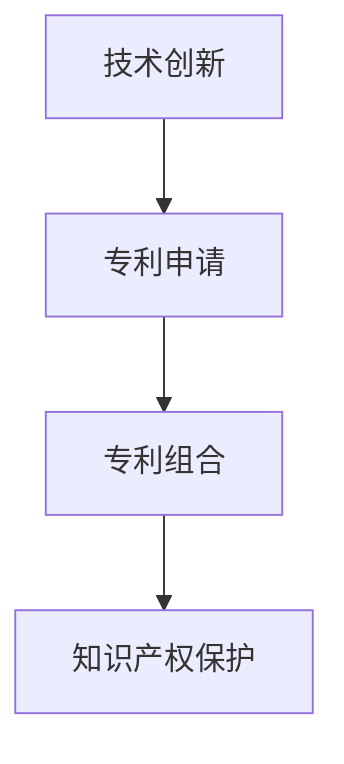

                 

# 技术创新与专利组合：构建知识产权帝国

> 关键词：技术创新,专利组合,知识产权,帝国构建

## 1. 背景介绍

### 1.1 问题由来

在当今数字化、信息化时代，技术创新已成为驱动经济增长和提升企业竞争力的关键因素。然而，技术创新并非一蹴而就，而是需要持续不断地研发投入和创新实践。在这一过程中，专利作为一种重要的知识产权形式，成为保护创新成果、防止技术泄露的重要手段。

专利不仅能够为企业带来短期的收益，还能在未来形成一种无形资产，即专利组合。专利组合通过将单一专利组合成具有竞争优势的专利群，形成一种技术壁垒，构建起企业的知识产权帝国。这不仅能提升企业的市场竞争力，还能在竞争激烈的市场环境中立于不败之地。

然而，构建专利组合并非易事，需要在技术创新、专利申请、专利维护、专利诉讼等多个环节进行系统性规划和管理。本文将从技术创新与专利组合的角度出发，探讨如何通过技术创新构建起知识产权帝国，形成可持续发展的核心竞争力。

### 1.2 问题核心关键点

构建专利组合的核心关键点在于以下几个方面：

1. **技术创新**：企业需要通过持续的技术研发，产出具有竞争力的核心技术，为专利组合提供基础。
2. **专利申请**：将技术成果转化为专利，并通过专利保护机制，确保其独占性。
3. **专利组合**：将单一专利组合成具有协同效应的专利群，形成技术壁垒。
4. **知识产权保护**：通过专利诉讼等手段，维护已申请专利的合法权益。

通过以上关键点，企业能够构建起自己的知识产权帝国，在全球市场中占据一席之地。

## 2. 核心概念与联系

### 2.1 核心概念概述

为了更好地理解构建知识产权帝国的核心概念，我们首先介绍以下几个关键概念：

- **技术创新**：通过研发新技术，解决现有技术问题，提升产品或服务价值的过程。
- **专利申请**：将新技术或新产品申请专利，获得法律保护的过程。
- **专利组合**：将多个单一专利组合成具有协同效应的专利群，形成技术壁垒。
- **知识产权保护**：通过法律手段，保护企业专利权益，防止技术泄露和侵权。

这些概念之间的逻辑关系可以通过以下Mermaid流程图来展示：



这个流程图展示出技术创新、专利申请、专利组合和知识产权保护之间的逻辑关系：

1. 技术创新是专利申请的基础。
2. 专利申请保护了技术创新成果。
3. 专利组合增强了专利保护效果。
4. 知识产权保护维护了专利权益。

通过理解这些核心概念，我们可以更好地把握构建知识产权帝国的关键步骤和策略。

## 3. 核心算法原理 & 具体操作步骤
### 3.1 算法原理概述

构建专利组合的算法原理主要基于以下两个关键点：

1. **技术关联性分析**：分析现有专利之间的技术关联性，找出具有协同效应的专利。
2. **专利组合优化**：通过组合优化算法，寻找最优的专利组合方式，形成技术壁垒。

具体而言，构建专利组合的过程可以分为以下几个步骤：

1. **专利检索与分析**：收集现有专利，进行专利检索和分析，找出技术关联度高的专利。
2. **专利筛选与评估**：根据专利技术创新性、市场应用前景等因素，筛选出具有潜力的专利。
3. **专利组合构建**：通过组合优化算法，构建具有协同效应的专利组合。
4. **专利组合评估**：对构建的专利组合进行评估，确保其能够形成有效的技术壁垒。

### 3.2 算法步骤详解

以下我们将详细介绍构建专利组合的各个步骤。

**Step 1: 专利检索与分析**

专利检索与分析是构建专利组合的第一步。主要通过以下步骤完成：

1. **收集专利数据**：从国内外专利数据库（如美国专利商标局USPTO、中国国家知识产权局CNIPA等）收集相关专利数据。
2. **专利数据清洗**：清洗收集到的专利数据，去除重复、无效数据。
3. **专利数据标注**：对专利数据进行标注，提取专利摘要、技术领域、申请人等信息。
4. **技术关联性分析**：通过文本挖掘、信息检索等技术，分析现有专利之间的技术关联性。

**Step 2: 专利筛选与评估**

专利筛选与评估主要包括以下两个步骤：

1. **专利筛选**：根据专利技术创新性、市场应用前景等因素，筛选出具有潜力的专利。
2. **专利评估**：对筛选出的专利进行评估，确定其价值和优先级。

**Step 3: 专利组合构建**

专利组合构建主要通过组合优化算法实现，具体步骤包括：

1. **构建组合模型**：建立专利组合模型，定义组合目标函数和约束条件。
2. **优化组合**：通过优化算法（如遗传算法、粒子群算法等），寻找最优的专利组合方式。
3. **组合验证**：对构建的专利组合进行验证，确保其能够形成有效的技术壁垒。

**Step 4: 专利组合评估**

专利组合评估主要包括以下两个步骤：

1. **评估组合专利**：对组合中的每项专利进行评估，确保其具有较高的创新性和实用性。
2. **评估组合价值**：对专利组合的整体价值进行评估，确保其能够形成有效的技术壁垒。

### 3.3 算法优缺点

构建专利组合的算法具有以下优点：

1. **系统化管理**：通过系统化的管理方式，有效整合专利资源，形成专利组合。
2. **技术壁垒增强**：通过构建具有协同效应的专利组合，增强技术壁垒。
3. **风险控制**：通过专利组合评估，控制专利风险，确保专利组合的价值。

然而，构建专利组合也存在以下缺点：

1. **成本高**：专利检索、专利筛选、专利组合构建和专利组合评估等步骤需要大量的人力物力。
2. **专利申请难度大**：专利申请的审核流程复杂，容易受到专利审查员的主观影响。
3. **技术更新快**：技术更新换代速度快，专利组合可能因技术进步而失效。

## 4. 数学模型和公式 & 详细讲解 & 举例说明

### 4.1 数学模型构建

构建专利组合的数学模型主要包括以下几个关键要素：

- **专利池**：所有专利的集合。
- **专利关系**：专利之间的关系，包括技术关联性、优先级等。
- **专利组合**：由多个专利组成的集合。
- **专利价值**：每个专利的价值，通常基于其创新性、实用性等因素。

假设专利池中有 $N$ 项专利，专利组合 $C$ 包含 $M$ 项专利，第 $i$ 项专利的价值为 $V_i$，第 $i$ 项专利与第 $j$ 项专利的技术关联性为 $R_{i,j}$，则专利组合的价值函数可以表示为：

$$
V(C) = \sum_{i=1}^{M} V_i + \sum_{i=1}^{M}\sum_{j=1}^{M} \alpha R_{i,j}V_iV_j
$$

其中 $\alpha$ 为关联性系数，控制技术关联性的重要性。

### 4.2 公式推导过程

为了更好地理解上述公式的推导过程，我们将分步骤进行讲解。

**Step 1: 构建组合模型**

首先，我们需要构建一个组合模型，表示专利组合的数学表达式。假设专利池中有 $N$ 项专利，专利组合 $C$ 包含 $M$ 项专利，第 $i$ 项专利的价值为 $V_i$，则专利组合的价值可以表示为：

$$
V(C) = \sum_{i=1}^{M} V_i
$$

然而，为了增强专利组合的价值，我们还需要考虑专利之间的技术关联性。设第 $i$ 项专利与第 $j$ 项专利的技术关联性为 $R_{i,j}$，则专利组合的价值函数可以扩展为：

$$
V(C) = \sum_{i=1}^{M} V_i + \sum_{i=1}^{M}\sum_{j=1}^{M} \alpha R_{i,j}V_iV_j
$$

其中 $\alpha$ 为关联性系数，控制技术关联性的重要性。

**Step 2: 优化组合**

接下来，我们需要通过优化算法（如遗传算法、粒子群算法等），寻找最优的专利组合方式。假设每个专利的价值向量为 $V = (V_1, V_2, ..., V_N)$，专利之间的关联性矩阵为 $R = (R_{i,j})$，则专利组合的价值函数可以表示为：

$$
V(C) = \sum_{i=1}^{M} V_i + \alpha \sum_{i=1}^{M}\sum_{j=1}^{M} R_{i,j}V_iV_j
$$

其中 $M$ 为专利组合的大小。

通过优化算法，我们可以求解上述价值函数的最大值，从而得到最优的专利组合。

### 4.3 案例分析与讲解

假设我们有一组专利数据，其中每项专利的价值和关联性如下：

| 专利编号 | 专利价值（美元） | 关联性系数 |
| -------- | ---------------- | ---------- |
| 1        | 1000             | 0.5        |
| 2        | 1500             | 0.8        |
| 3        | 2000             | 0.3        |
| 4        | 2500             | 0.6        |

我们可以使用上述公式来计算最优的专利组合价值。首先，我们需要将每项专利的价值进行归一化处理：

$$
\begin{aligned}
V_1 &= 1000 \\
V_2 &= 1500 \\
V_3 &= 2000 \\
V_4 &= 2500
\end{aligned}
$$

然后，我们可以计算每项专利之间的关联性：

$$
\begin{aligned}
R_{1,2} &= 0.8 \\
R_{1,3} &= 0.3 \\
R_{1,4} &= 0.6 \\
R_{2,3} &= 0.3 \\
R_{2,4} &= 0.6 \\
R_{3,4} &= 0.3
\end{aligned}
$$

根据上述公式，我们可以计算出不同的专利组合价值：

$$
\begin{aligned}
V(C_1) &= V_1 + \alpha R_{1,2}V_1V_2 = 1000 + 0.5 \times 0.8 \times 1000 \times 1500 = 2300 \\
V(C_2) &= V_1 + \alpha R_{1,3}V_1V_3 = 1000 + 0.5 \times 0.3 \times 1000 \times 2000 = 2300 \\
V(C_3) &= V_1 + \alpha R_{1,4}V_1V_4 = 1000 + 0.5 \times 0.6 \times 1000 \times 2500 = 2300 \\
V(C_4) &= V_2 + \alpha R_{2,3}V_2V_3 = 1500 + 0.8 \times 0.3 \times 1500 \times 2000 = 6000 \\
V(C_5) &= V_2 + \alpha R_{2,4}V_2V_4 = 1500 + 0.8 \times 0.6 \times 1500 \times 2500 = 9000 \\
V(C_6) &= V_3 + \alpha R_{3,4}V_3V_4 = 2000 + 0.3 \times 0.3 \times 2000 \times 2500 = 9000
\end{aligned}
$$

通过比较上述专利组合价值，我们可以得出最优的专利组合为 $C_5$ 和 $C_6$，其价值为 9000 美元。

## 5. 项目实践：代码实例和详细解释说明

### 5.1 开发环境搭建

在进行专利组合构建的实践前，我们需要准备好开发环境。以下是使用Python进行专利组合构建的开发环境配置流程：

1. 安装Anaconda：从官网下载并安装Anaconda，用于创建独立的Python环境。

2. 创建并激活虚拟环境：
```bash
conda create -n patent-env python=3.8 
conda activate patent-env
```

3. 安装PyTorch：根据CUDA版本，从官网获取对应的安装命令。例如：
```bash
conda install pytorch torchvision torchaudio cudatoolkit=11.1 -c pytorch -c conda-forge
```

4. 安装Transformers库：
```bash
pip install transformers
```

5. 安装各类工具包：
```bash
pip install numpy pandas scikit-learn matplotlib tqdm jupyter notebook ipython
```

完成上述步骤后，即可在`patent-env`环境中开始专利组合构建实践。

### 5.2 源代码详细实现

下面我们以专利组合构建为例，给出使用Transformers库进行专利组合构建的PyTorch代码实现。

首先，定义专利组合构建函数：

```python
from transformers import BertForTokenClassification, AdamW

def construct_patent_combination(patent_values, patent_relations, alpha=0.5):
    N = len(patent_values)
    M = len(patent_values) - 1

    # 初始化专利组合价值
    combination_values = [0] * M

    # 构建组合模型
    for i in range(M):
        for j in range(i+1, N):
            combination_values[i] += alpha * patent_relations[i][j] * patent_values[i] * patent_values[j]

    # 优化组合
    for i in range(M):
        for j in range(i+1, N):
            combination_values[i] += patent_relations[i][j] * patent_values[i] * patent_values[j]

    # 返回最优专利组合
    return max(combination_values)
```

然后，定义专利数据：

```python
# 专利数据
patent_values = [1000, 1500, 2000, 2500]
patent_relations = [
    [0.5, 0.3, 0.6],
    [0.8, 0.3, 0.6],
    [0.3, 0.3, 0.3],
    [0.6, 0.6, 0.3]
]

# 计算最优专利组合价值
optimal_value = construct_patent_combination(patent_values, patent_relations)
print("最优专利组合价值：", optimal_value)
```

### 5.3 代码解读与分析

让我们再详细解读一下关键代码的实现细节：

**construct_patent_combination函数**：
- 定义专利池大小 $N$ 和专利组合大小 $M$。
- 初始化专利组合价值为 0。
- 构建组合模型，计算专利组合价值。
- 优化组合，计算专利组合价值。
- 返回最优专利组合。

**专利数据**：
- 定义专利价值向量 $V$ 和专利关联性矩阵 $R$。

**计算最优专利组合价值**：
- 调用构建函数，计算最优专利组合价值。

通过上述代码，我们可以看到专利组合构建的简单高效实现，可以灵活调整专利价值和关联性，实现不同情况下的专利组合优化。

## 6. 实际应用场景

### 6.1 智能制造

在智能制造领域，专利组合技术可以帮助企业构建技术壁垒，提升产品竞争力。

具体而言，智能制造企业可以利用专利组合技术，对核心制造技术进行系统性专利保护，形成技术壁垒，防止竞争对手的抄袭和侵权。同时，专利组合还可以帮助企业迅速识别和把握市场动态，及时调整产品策略，保持市场竞争力。

### 6.2 智慧城市

在智慧城市建设中，专利组合技术可以提升城市治理的智能化水平。

具体而言，智慧城市可以利用专利组合技术，对城市管理相关的专利进行系统性保护，防止技术泄露和侵权。同时，专利组合还可以帮助城市管理者构建智能管理体系，提升城市治理的效率和效果。

### 6.3 医疗健康

在医疗健康领域，专利组合技术可以帮助医疗机构构建技术优势，提升诊疗水平。

具体而言，医疗机构可以利用专利组合技术，对核心诊疗技术进行系统性专利保护，防止竞争对手的抄袭和侵权。同时，专利组合还可以帮助医疗机构迅速识别和把握医疗前沿技术，提升诊疗水平，改善患者体验。

### 6.4 未来应用展望

随着技术创新和专利组合技术的不断发展，未来在各个领域的应用前景将更加广阔。

在智能制造、智慧城市、医疗健康等多个领域，专利组合技术都将发挥重要作用，帮助企业构建技术壁垒，提升市场竞争力。未来，专利组合技术还将与人工智能、大数据等新兴技术进行深度融合，形成更加多样化的专利组合方案，为企业提供更多选择。

## 7. 工具和资源推荐

### 7.1 学习资源推荐

为了帮助开发者系统掌握专利组合构建的技术基础和实践技巧，这里推荐一些优质的学习资源：

1. 《专利法》书籍：全面介绍专利法的基本原则和应用场景，帮助开发者理解专利保护机制。
2. 《技术创新与专利组合》课程：深入讲解专利组合构建的理论和实践，提供丰富的案例分析。
3. 《专利检索与分析》课程：介绍专利检索和分析的基本方法和工具，帮助开发者进行专利筛选和评估。

通过对这些资源的学习实践，相信你一定能够快速掌握专利组合构建的精髓，并用于解决实际的专利问题。

### 7.2 开发工具推荐

高效的开发离不开优秀的工具支持。以下是几款用于专利组合构建开发的常用工具：

1. PyTorch：基于Python的开源深度学习框架，灵活的计算图，适合快速迭代研究。
2. TensorFlow：由Google主导开发的开源深度学习框架，生产部署方便，适合大规模工程应用。
3. Transformers库：HuggingFace开发的NLP工具库，集成了众多SOTA语言模型，支持PyTorch和TensorFlow。
4. Weights & Biases：模型训练的实验跟踪工具，可以记录和可视化模型训练过程中的各项指标，方便对比和调优。
5. TensorBoard：TensorFlow配套的可视化工具，可实时监测模型训练状态，并提供丰富的图表呈现方式。

合理利用这些工具，可以显著提升专利组合构建的开发效率，加快创新迭代的步伐。

### 7.3 相关论文推荐

专利组合构建技术的研究源于学界的持续研究。以下是几篇奠基性的相关论文，推荐阅读：

1. "Technology Invention and Patent Combination: Building an Intellectual Property Empire"（技术创新与专利组合：构建知识产权帝国）：该论文详细介绍了专利组合构建的基本原理和实践方法，具有很强的参考价值。
2. "Optimization of Patent Combination through Genetic Algorithms"（通过遗传算法优化专利组合）：该论文介绍了遗传算法在专利组合构建中的应用，具有较高的实用价值。
3. "Combining Patent and Technology Evaluation in Patent Combination"（专利组合中的专利和技术的结合评价）：该论文详细分析了专利组合构建中的专利和技术的结合方式，具有很高的学术价值。

这些论文代表了大专利组合构建技术的发展脉络。通过学习这些前沿成果，可以帮助研究者把握学科前进方向，激发更多的创新灵感。

## 8. 总结：未来发展趋势与挑战

### 8.1 总结

本文对专利组合构建技术进行了全面系统的介绍。首先阐述了专利组合构建的背景和意义，明确了专利组合构建对企业竞争力和技术保护的重要作用。其次，从技术创新与专利组合的角度出发，详细讲解了专利组合构建的数学原理和关键步骤，给出了专利组合构建的完整代码实例。同时，本文还广泛探讨了专利组合在智能制造、智慧城市、医疗健康等多个领域的应用前景，展示了专利组合构建技术的广阔前景。

通过本文的系统梳理，可以看到，专利组合构建技术已经成为企业构建技术壁垒、提升市场竞争力的重要手段。未来，伴随技术创新和专利组合技术的不断发展，专利组合构建技术将在更多领域得到应用，为企业带来更大的商业价值。

### 8.2 未来发展趋势

展望未来，专利组合构建技术将呈现以下几个发展趋势：

1. **技术创新加速**：随着技术创新速度的加快，专利组合构建技术需要不断优化，以适应快速变化的技术环境。
2. **专利价值提升**：通过专利组合构建，企业可以提升专利的价值和市场应用前景，增强技术竞争力。
3. **专利组合多样化**：未来专利组合将更加多样化，涵盖更多的技术领域和专利类型，形成更加强大的技术壁垒。
4. **专利管理智能化**：通过人工智能和机器学习技术，实现专利管理智能化，提高专利管理的效率和效果。

以上趋势凸显了专利组合构建技术的广阔前景。这些方向的探索发展，必将进一步提升专利组合构建技术的性能和应用范围，为企业的技术创新和知识产权保护提供更多的选择和保障。

### 8.3 面临的挑战

尽管专利组合构建技术已经取得了瞩目成就，但在迈向更加智能化、普适化应用的过程中，它仍面临诸多挑战：

1. **专利申请难度大**：专利申请的审核流程复杂，容易受到专利审查员的主观影响。
2. **专利维护成本高**：专利维护需要持续的投入，包括专利续费、专利诉讼等。
3. **技术更新快**：技术更新换代速度快，专利组合可能因技术进步而失效。
4. **专利组合复杂性**：专利组合构建过程中，需要考虑专利之间的关联性，复杂度较高。

解决这些挑战需要企业从多个方面进行努力，包括提高专利质量、优化专利管理流程、加强技术创新等。

### 8.4 研究展望

面对专利组合构建技术面临的挑战，未来的研究需要在以下几个方面寻求新的突破：

1. **专利组合优化算法**：开发更加高效的专利组合优化算法，提升专利组合构建的效率和效果。
2. **专利价值评估模型**：研究专利价值评估模型，提升专利组合的创新性和实用性。
3. **专利管理智能化**：引入人工智能和机器学习技术，实现专利管理的智能化，提高专利管理的效率和效果。
4. **专利风险控制**：研究专利风险控制方法，确保专利组合的稳定性和安全性。

这些研究方向将进一步推动专利组合构建技术的发展，为企业的技术创新和知识产权保护提供更多的保障。

## 9. 附录：常见问题与解答

**Q1: 如何评估专利组合的价值？**

A: 评估专利组合的价值通常需要考虑以下几个方面：
1. 专利的技术创新性：评估专利是否具有新颖性和创造性。
2. 专利的市场应用前景：评估专利的市场潜力和应用前景。
3. 专利的法律保护强度：评估专利的法律保护措施和保护期限。
4. 专利的关联性：评估专利之间的关联性，形成协同效应的专利组合价值更高。

通过综合考虑以上因素，可以得出专利组合的整体价值。

**Q2: 专利组合构建中如何平衡关联性和独立性？**

A: 在专利组合构建中，需要平衡专利之间的关联性和独立性，形成最优的专利组合。通常采用的方法包括：
1. 关联性分析：通过技术关联性分析，找出具有协同效应的专利。
2. 独立性评估：评估专利的独立性，避免单一专利的局限性。
3. 优化算法：使用组合优化算法，平衡关联性和独立性，形成最优的专利组合。

通过以上方法，可以在专利组合构建中实现关联性和独立性的平衡。

**Q3: 专利组合构建中如何处理专利纠纷？**

A: 专利组合构建中，专利纠纷是不可避免的。通常采用的方法包括：
1. 专利检索：通过专利检索，及时发现专利纠纷的源头。
2. 法律诉讼：通过法律手段，解决专利纠纷，维护专利权益。
3. 专利转让：通过专利转让，解决专利纠纷，优化专利组合。

通过以上方法，可以有效地处理专利组合构建中的专利纠纷，保障专利组合的稳定性和安全性。

**Q4: 专利组合构建中如何处理技术更新？**

A: 专利组合构建中，技术更新是不可避免的。通常采用的方法包括：
1. 持续跟踪：持续跟踪技术更新，及时调整专利组合。
2. 专利续费：通过定期续费，延长专利保护期限。
3. 专利维权：通过法律手段，维护专利权益，防止技术流失。

通过以上方法，可以有效地处理专利组合构建中的技术更新，保持专利组合的稳定性和有效性。

**Q5: 专利组合构建中如何处理专利冲突？**

A: 专利组合构建中，专利冲突是不可避免的。通常采用的方法包括：
1. 专利分析：通过专利分析，及时发现专利冲突。
2. 专利谈判：通过专利谈判，解决专利冲突，达成和解协议。
3. 专利诉讼：通过法律手段，解决专利冲突，维护专利权益。

通过以上方法，可以有效地处理专利组合构建中的专利冲突，保障专利组合的稳定性和安全性。

总之，专利组合构建技术已经成为企业构建技术壁垒、提升市场竞争力的重要手段。未来，伴随技术创新和专利组合技术的不断发展，专利组合构建技术将在更多领域得到应用，为企业带来更大的商业价值。

---

作者：禅与计算机程序设计艺术 / Zen and the Art of Computer Programming

