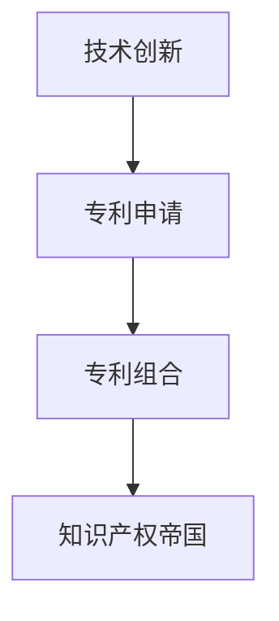

                 

## 1. 背景介绍

### 1.1 问题由来

在人工智能（AI）快速发展的背景下，技术创新与专利组合已成为构建知识产权帝国的核心策略。无论是学术界还是产业界，都在通过不断的技术创新和专利布局，争夺在AI领域的领导地位。技术的创新不仅能带来显著的商业价值，还能增强企业在全球市场上的竞争力。同时，通过有效的专利组合，企业能够在知识产权保护方面占据有利位置，防止竞争对手的无偿仿冒和技术盗窃，确保自身技术的市场垄断地位。

### 1.2 问题核心关键点

AI技术的核心关键点在于数据、算法和模型的迭代更新。数据是AI技术的基石，提供了学习材料；算法和模型则是进行学习和推断的工具。在专利组合的过程中，关键在于保护这些核心技术元素，确保其不被侵犯或复制。同时，通过申请专利保护，还能促使技术进一步创新，推动AI技术的进步。

### 1.3 问题研究意义

研究技术创新与专利组合的策略，对于推动AI技术的产业化进程，保护企业知识产权，增强市场竞争力，具有重要意义。其研究结果不仅能为企业提供科学的专利申请和布局策略，还能促进技术的持续创新，助力AI技术的商业化和落地应用。

## 2. 核心概念与联系

### 2.1 核心概念概述

为更好地理解技术创新与专利组合的策略，本节将介绍几个密切相关的核心概念：

- **技术创新（Technological Innovation）**：指通过技术研究与开发，创造新的技术成果或改进现有技术，以提升产品质量、提高效率、降低成本等。
- **专利（Patent）**：是知识产权的一种形式，指由国家授予发明人对其发明的专有权利，包括发明、实用新型和外观设计等。
- **专利组合（Patent Portfolio）**：是指企业在某一技术领域内拥有的多件相关专利的集合，通过布局专利组合，形成技术壁垒，保护企业的核心技术。
- **知识产权帝国（Intellectual Property Empire）**：指企业通过有效的专利组合和技术创新，在特定技术领域建立起来的知识产权垄断地位，形成难以逾越的技术屏障。

这些核心概念之间的逻辑关系可以通过以下Mermaid流程图来展示：



这个流程图展示了技术创新、专利申请、专利组合与知识产权帝国之间的关系：技术创新是专利申请的基础，专利组合是通过有效的专利申请形成的，最终形成企业知识产权帝国的垄断地位。

## 3. 核心算法原理 & 具体操作步骤
### 3.1 算法原理概述

技术创新与专利组合的策略主要基于以下几个关键原理：

1. **技术领先策略**：通过持续的技术创新，保持企业在某一技术领域内的领先地位。
2. **专利申请策略**：在技术创新完成后，及时申请专利，确保技术被法律保护。
3. **专利组合策略**：在多个技术领域进行专利布局，形成强大的专利网络。
4. **动态更新策略**：根据技术发展趋势，动态调整专利组合，确保其持续有效。
5. **防御与进攻策略**：在保护自身技术的同时，主动攻击竞争对手的专利，形成战略优势。

### 3.2 算法步骤详解

1. **确定技术创新方向**：基于市场需求和现有技术不足，确定技术创新的方向，如自动驾驶、自然语言处理等。
2. **技术研发与测试**：在确定方向后，进行技术研发，并进行严格的测试，确保技术可行性和创新性。
3. **专利申请准备**：对技术成果进行文档化，编写技术说明书，准备好专利申请材料。
4. **专利申请与审批**：通过专利代理机构提交专利申请，并跟进审批流程，确保申请成功。
5. **专利组合构建**：将相关专利进行整合，构建一个完整的专利组合，涵盖核心技术及相关应用。
6. **动态更新与维护**：定期审查专利组合，根据技术发展进行调整和维护。
7. **防御与进攻策略**：密切关注竞争对手的专利布局，制定相应的防御和进攻策略。

### 3.3 算法优缺点

技术创新与专利组合策略的主要优点在于：

- **保护核心技术**：通过专利保护，防止竞争对手的无偿仿冒和侵权。
- **促进技术发展**：专利申请促使技术进一步创新，推动技术进步。
- **增强市场竞争力**：有效的专利组合能够形成技术壁垒，提升市场竞争力。

但同时也存在一些局限性：

- **成本高**：专利申请和维护需要大量时间和资金投入。
- **技术复杂**：需要专业的专利代理和法律知识。
- **策略风险**：专利组合布局不当可能反被竞争对手攻击。

### 3.4 算法应用领域

技术创新与专利组合的策略在多个领域都有广泛应用，包括但不限于：

- **自动驾驶**：在传感器融合、路径规划、行为预测等方面进行技术创新和专利布局。
- **自然语言处理**：在语言模型、机器翻译、文本生成等方面进行技术创新和专利布局。
- **医疗健康**：在医疗影像分析、个性化医疗、智能诊断等方面进行技术创新和专利布局。
- **智能制造**：在工业互联网、工业机器人、智能控制系统等方面进行技术创新和专利布局。
- **金融科技**：在区块链技术、智能投顾、风险控制等方面进行技术创新和专利布局。

## 4. 数学模型和公式 & 详细讲解 & 举例说明
### 4.1 数学模型构建

在进行技术创新与专利组合时，可以采用以下数学模型进行描述：

设某企业在某技术领域拥有 $N$ 项专利，其中第 $i$ 项专利的保护范围为 $R_i$，使用寿命为 $T_i$，市场份额为 $S_i$。企业在该技术领域的总专利价值为 $V$，则有：

$$ V = \sum_{i=1}^{N} V_i = \sum_{i=1}^{N} S_i \times R_i \times T_i $$

其中 $S_i$ 表示第 $i$ 项专利的市场份额，$R_i$ 表示专利的保护范围，$T_i$ 表示专利的使用寿命。

### 4.2 公式推导过程

通过对上述模型的推导，我们可以得出以下结论：

- **市场份额**：专利的市场份额越大，其对企业总专利价值的贡献越大。
- **专利保护范围**：专利保护范围越广，其对企业总专利价值的贡献越大。
- **专利寿命**：专利的寿命越长，其对企业总专利价值的贡献越大。

### 4.3 案例分析与讲解

以特斯拉在自动驾驶领域的专利组合为例，特斯拉在该领域申请了大量的专利，涵盖了传感器融合、路径规划、行为预测等多个关键技术。这些专利形成了特斯拉在自动驾驶领域的核心竞争力，保护了其核心技术不被竞争对手无偿使用。

此外，特斯拉还积极申请与自动驾驶相关的标准化专利，形成了更强大的技术壁垒，增强了其市场竞争力。

## 5. 项目实践：代码实例和详细解释说明
### 5.1 开发环境搭建

在进行技术创新与专利组合的策略实践时，需要搭建相应的开发环境。以下是使用Python进行专利管理系统的环境配置流程：

1. 安装Anaconda：从官网下载并安装Anaconda，用于创建独立的Python环境。

2. 创建并激活虚拟环境：
```bash
conda create -n patent-env python=3.8 
conda activate patent-env
```

3. 安装所需库：
```bash
pip install requests json
```

完成上述步骤后，即可在`patent-env`环境中开始专利管理系统开发。

### 5.2 源代码详细实现

下面以构建一个简化的专利管理系统为例，展示如何通过Python进行专利信息的管理和查询：

```python
import requests
import json

class PatentManagementSystem:
    def __init__(self, api_key):
        self.api_key = api_key
        self.base_url = "https://api.epo.org/"

    def search_patents(self, query):
        url = f"{self.base_url}search/patent/search"
        params = {
            "query": query,
            "api-key": self.api_key
        }
        response = requests.get(url, params=params)
        return response.json()

    def get_patent_details(self, patent_id):
        url = f"{self.base_url}patent/{patent_id}"
        response = requests.get(url)
        return response.json()

# 使用示例
patent_system = PatentManagementSystem("your_api_key")
results = patent_system.search_patents("autonomous driving")
for result in results:
    print(result["title"])
    details = patent_system.get_patent_details(result["id"])
    print(details["abstract"])
```

### 5.3 代码解读与分析

该代码实现了一个基本的专利管理系统，主要包括搜索专利和获取专利详情两个功能。在实际应用中，可以将搜索结果进一步处理，如筛选、排序、可视化等，从而形成完整的专利组合管理系统。

该代码的关键在于使用了API接口来访问专利数据库，获取专利信息。API接口的使用可以大大简化专利信息的获取和管理过程，提升效率。

## 6. 实际应用场景
### 6.1 汽车行业

在汽车行业中，技术创新与专利组合策略的应用尤为重要。特斯拉在自动驾驶领域的专利组合，不仅保护了其核心技术，还为其他企业设立了高昂的进入门槛。通过持续的技术创新和专利申请，特斯拉在自动驾驶领域建立了强大的技术壁垒，形成了难以逾越的技术屏障。

### 6.2 金融科技

在金融科技领域，区块链技术的创新和专利布局尤为重要。如比特币的发明者中本聪，虽然未申请专利，但其技术的创新性无法替代。然而，在后续的专利申请过程中，多家公司通过改进和扩展比特币的区块链技术，申请了大量相关专利，形成了技术垄断。

### 6.3 医疗健康

在医疗健康领域，技术创新和专利组合策略同样重要。如在基因编辑技术中，CRISPR-Cas9的发明者获得了诺贝尔奖，但其技术细节并未完全公开。其他公司通过申请相关专利，进一步改进和扩展CRISPR-Cas9技术，形成了强大的技术壁垒。

### 6.4 未来应用展望

随着技术的不断发展，未来技术创新与专利组合策略将面临更多的机遇和挑战。例如，人工智能技术的应用将带来新的技术创新点和专利机会，同时也需要应对复杂的专利布局和竞争态势。通过持续的技术研发和专利申请，企业能够在AI领域保持领先地位，构建知识产权帝国。

## 7. 工具和资源推荐
### 7.1 学习资源推荐

为了帮助开发者系统掌握技术创新与专利组合的策略，以下是一些优质的学习资源：

1. **《专利法》**：了解专利申请、授权、保护等方面的法律知识，为专利组合提供法律支持。
2. **USPTO（美国专利商标局）网站**：提供了丰富的专利信息、申请指南和专利数据库，是学习和研究专利组合的重要资源。
3. **WIPO（世界知识产权组织）网站**：提供了全球专利、商标和版权信息，是了解国际知识产权保护的宝贵资源。
4. **Khan Academy（可汗学院）专利课程**：提供了关于专利基础、申请和维护的在线课程，适合初学者。
5. **Coursera上的知识产权课程**：提供了多门与知识产权相关的课程，涵盖专利申请、评估和纠纷解决等内容。

通过这些资源的学习实践，相信你一定能够快速掌握技术创新与专利组合的精髓，并用于解决实际的知识产权保护问题。

### 7.2 开发工具推荐

高效的工具支持是实现技术创新与专利组合策略的重要保障。以下是几款常用的开发工具：

1. **Anaconda**：用于创建和管理Python环境，支持多种版本的Python和库的兼容。
2. **requests**：Python中常用的HTTP请求库，便于访问API接口。
3. **json**：Python内置的JSON处理库，便于处理API接口返回的数据。
4. **Jupyter Notebook**：支持Python代码的在线编写和执行，便于快速开发和测试。
5. **GitHub**：代码托管和协作平台，支持版本控制和代码共享。

合理利用这些工具，可以显著提升技术创新与专利组合策略的开发效率，加快创新迭代的步伐。

### 7.3 相关论文推荐

技术创新与专利组合策略的研究源于学界的持续探索。以下是几篇代表性的相关论文，推荐阅读：

1. **"Technological Change and Economic Progress" by Robert M. Solow**：探讨了技术创新对经济发展的驱动作用。
2. **"Patent Law and Economic Progress" by Edward K. Prescott and Gary S. Becker**：讨论了专利保护对技术创新和市场竞争的影响。
3. **"The Patent Box: How the Taxation of IP Costs Influences Technology Creation and Diffusion" by Jan A. Timmer, Martin J. Okyere-Darko, and Theodore L. Schrank**：研究了专利税收政策对技术创新和市场竞争的影响。
4. **"The Patent-Intellectual Property-Technology-Network Complex: Interdependencies and Policy Implications" by David Cantor**：探讨了专利、知识产权和技术网络之间的关系。
5. **"R&D Investment and Technology Development: An Assessment of the Patent and Venture Capital System" by Paul David**：研究了研发投资和技术发展的关系，强调了专利制度的重要性。

这些论文代表了大规模技术创新与专利组合策略的发展脉络，通过学习这些前沿成果，可以帮助研究者把握学科前进方向，激发更多的创新灵感。

## 8. 总结：未来发展趋势与挑战

### 8.1 总结

本文对技术创新与专利组合策略进行了全面系统的介绍。首先阐述了技术创新与专利组合的研究背景和意义，明确了专利组合在推动AI技术产业化进程中的核心作用。其次，从原理到实践，详细讲解了技术创新与专利组合的数学模型和操作步骤，给出了专利管理系统开发的完整代码实例。同时，本文还广泛探讨了专利组合在多个行业领域的应用前景，展示了专利组合范式的巨大潜力。最后，本文精选了专利组合相关的学习资源和工具，力求为读者提供全方位的技术指引。

通过本文的系统梳理，可以看到，技术创新与专利组合策略已经成为推动AI技术落地应用的重要手段，极大地拓展了AI技术的市场范围和应用深度。未来，伴随技术的不断演进和专利组合的深入研究，相信AI技术将更好地服务于人类社会，推动社会进步。

### 8.2 未来发展趋势

展望未来，技术创新与专利组合策略将呈现以下几个发展趋势：

1. **技术创新加速**：随着算力成本的下降和数据规模的扩大，技术创新速度将进一步加快，专利组合策略的重要性将更加凸显。
2. **全球专利布局**：企业将更加注重全球专利布局，提升国际竞争力和市场影响力。
3. **专利组合多样化**：专利组合将更加多元化，涵盖核心技术及相关应用，形成强大的专利网络。
4. **动态更新与维护**：专利组合需要根据技术发展动态调整，确保其持续有效。
5. **跨领域专利合作**：不同领域的专利合作将更加紧密，提升整体竞争力。

这些趋势凸显了技术创新与专利组合策略的广阔前景。这些方向的探索发展，将进一步推动AI技术的产业化进程，为人类社会带来深远的变革。

### 8.3 面临的挑战

尽管技术创新与专利组合策略已经取得了瞩目成就，但在迈向更加智能化、普适化应用的过程中，仍然面临诸多挑战：

1. **专利申请与审批成本高**：专利申请和审批流程繁琐，成本高昂，可能需要大量时间和资金投入。
2. **专利布局复杂**：专利组合布局需要考虑多方面因素，如技术发展方向、市场竞争态势等。
3. **专利侵权风险**：专利组合布局不当可能反被竞争对手攻击，导致专利无效。
4. **技术更新快**：技术发展快速，需要持续关注技术动态，及时调整专利组合。
5. **全球专利法律差异**：不同国家专利法律差异较大，需要了解不同地区的专利法律和政策。

这些挑战需要企业持续投入资源，提高专利申请和布局的专业水平，才能在激烈的市场竞争中占据有利位置。

### 8.4 研究展望

面向未来，技术创新与专利组合策略的研究需要在以下几个方面寻求新的突破：

1. **优化专利申请策略**：通过数据分析和机器学习，优化专利申请流程，提高专利申请成功率。
2. **全球专利协同**：通过国际专利合作，形成全球专利布局，提升国际竞争力。
3. **跨领域专利分析**：采用数据挖掘和知识图谱技术，分析专利网络关系，发现创新机会。
4. **专利风险管理**：通过风险评估和管理，规避专利侵权风险，确保专利组合的持续有效性。
5. **技术市场化路径**：通过专利组合与市场化策略结合，加速技术落地应用，提升市场竞争力。

这些研究方向的探索，将引领技术创新与专利组合策略迈向更高的台阶，为构建技术领先和市场竞争优势的企业提供有力的理论支持和技术保障。总之，技术创新与专利组合策略需要持续优化和创新，才能在AI技术落地应用中占据领先地位。

## 9. 附录：常见问题与解答

**Q1：技术创新与专利组合是否适用于所有企业？**

A: 技术创新与专利组合策略适用于大多数企业，尤其是那些拥有核心技术且希望通过专利保护的企业。但不同企业需根据自身情况，灵活选择适合的技术和专利组合策略。

**Q2：专利组合策略如何应对技术快速变化？**

A: 专利组合策略需要动态更新，根据技术发展趋势进行调整。企业需持续关注技术动态，及时调整专利组合，确保其持续有效。

**Q3：专利申请和布局过程中应注意哪些问题？**

A: 在专利申请和布局过程中，应注意专利保护范围的合理性、专利寿命的准确性、市场份额的评估等。同时，需遵循相关法律法规，确保申请过程合法合规。

**Q4：如何评估专利组合的价值？**

A: 专利组合的价值评估可以通过数学模型进行，如上述的专利价值模型。同时，需结合市场份额、保护范围、使用寿命等多方面因素进行综合评估。

**Q5：专利组合策略的实施过程中应如何应对风险？**

A: 在专利组合实施过程中，应制定风险评估和管理策略，定期审查专利组合的有效性，规避专利侵权风险，确保专利组合的持续有效性。

---

作者：禅与计算机程序设计艺术 / Zen and the Art of Computer Programming

