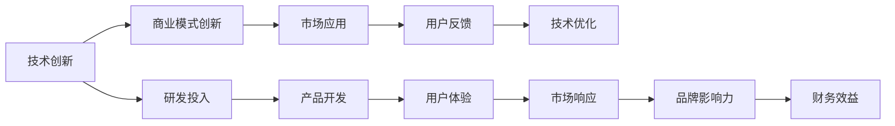

                 

# 技术创新与商业模式创新：Lepton AI的双轮驱动

## 1. 背景介绍

在当今高速发展的数字化时代，技术创新和商业模式创新成为推动企业成长的“双引擎”。在这两条重要战线上，Lepton AI展现了卓越的表现，成为科技与商业融合的典范。Lepton AI不仅在技术研发上不断突破，还通过创新的商业模式，将技术优势转化为实际应用，推动了行业生态的健康发展。

### 1.1 技术发展与市场需求的双驱动

随着人工智能(AI)技术的飞速发展，Lepton AI抓住时代脉搏，结合前沿技术发展趋势，推出了一系列创新解决方案。这些解决方案涵盖了数据处理、自然语言处理(NLP)、机器视觉等多个领域，解决了各行业在智能化转型过程中遇到的实际问题，满足了市场需求。

Lepton AI在技术创新上的成果主要体现在以下几个方面：
- **深度学习**：通过深度学习模型在图像识别、语音识别、自然语言理解等领域的广泛应用，实现了自动化、智能化的高效处理。
- **强化学习**：通过强化学习技术，使系统能够在不断试错中优化策略，提升决策效果。
- **迁移学习**：通过迁移学习，利用已有的知识进行新任务学习，加快模型训练速度，提升模型效果。
- **联邦学习**：通过联邦学习技术，保护数据隐私的同时，实现模型跨边界的协作优化。

Lepton AI通过这些技术的创新和应用，大大提升了业务处理效率，降低了运营成本，为用户带来了前所未有的体验。

### 1.2 市场需求与商业模式的双促进

Lepton AI深刻理解市场需求，在提供技术解决方案的同时，积极探索和实践商业模式创新，通过多样化的商业合作和创新运营模式，拓展市场，提高用户满意度。

Lepton AI在商业模式创新上的主要举措包括：
- **云服务**：通过提供云端AI服务，降低了用户的技术门槛，简化了部署流程。
- **平台化运营**：构建开放平台，汇聚生态伙伴，提供一站式的AI服务。
- **定制化服务**：根据客户需求提供量身定制的AI解决方案，满足不同行业的应用需求。
- **数据变现**：通过数据洞察和分析，提供增值服务，实现数据变现。

Lepton AI通过这些商业模式的创新，实现了业务增长和市场拓展，增强了企业的竞争力。

## 2. 核心概念与联系

### 2.1 核心概念概述

Lepton AI的核心概念主要围绕“技术创新”与“商业模式创新”展开，两者相辅相成，共同驱动企业发展。

- **技术创新**：指在技术领域不断探索和实践，实现技术突破和应用创新。
- **商业模式创新**：指通过创新的商业运作模式，提高市场响应速度，优化资源配置，提升企业盈利能力。

这两者之间的联系主要体现在：
- **协同效应**：技术创新为商业模式创新提供强有力的支撑，使商业运作更加高效；商业模式创新则能够推动技术创新的应用和落地，扩大技术影响力。
- **双向驱动**：技术创新不断产生新的应用场景，商业模式创新则通过市场化手段将这些场景转化为实际价值。

### 2.2 核心概念原理和架构的 Mermaid 流程图



## 3. 核心算法原理 & 具体操作步骤

### 3.1 算法原理概述

Lepton AI的核心算法原理主要基于以下几个方面：
- **深度学习算法**：通过神经网络模型进行数据特征提取和模式识别，提升模型准确率和泛化能力。
- **强化学习算法**：通过智能体在环境中不断交互，学习最优策略，提升系统决策效率。
- **迁移学习算法**：通过预训练模型，快速适应新任务，减少训练时间和数据需求。
- **联邦学习算法**：通过模型跨边界的协作优化，保护数据隐私的同时，提升模型效果。

### 3.2 算法步骤详解

Lepton AI的核心算法步骤主要包括以下几个关键环节：
1. **数据收集与预处理**：通过数据收集和预处理，为模型训练提供高质量的数据集。
2. **模型训练与优化**：在预处理后的数据集上训练模型，通过优化算法不断调整模型参数，提升模型效果。
3. **模型评估与部署**：在测试集上评估模型效果，将优化的模型部署到实际应用中。
4. **模型监控与维护**：对部署后的模型进行监控和维护，确保模型长期稳定运行。

### 3.3 算法优缺点

Lepton AI的核心算法具有以下优点：
- **高准确率**：通过深度学习模型，提升了数据处理和模式识别的准确率。
- **高效性**：通过强化学习和迁移学习，减少了训练时间和数据需求，提高了模型部署效率。
- **安全性**：通过联邦学习，保护了数据隐私，提升了模型安全性。

同时，也存在一些不足之处：
- **复杂性**：部分算法如深度学习模型的训练和优化过程较为复杂，需要大量计算资源。
- **可解释性**：部分算法如强化学习的决策过程缺乏可解释性，难以调试和优化。
- **鲁棒性**：部分算法如深度学习模型在面对噪声和干扰时，鲁棒性有待提升。

### 3.4 算法应用领域

Lepton AI的核心算法在多个领域得到了广泛应用，主要包括以下几个方面：
- **金融科技**：通过深度学习模型，进行信用评分、欺诈检测、风险评估等。
- **医疗健康**：通过图像识别、自然语言处理等技术，进行疾病诊断、智能问诊、健康管理等。
- **零售电商**：通过推荐系统、智能客服等技术，提升用户体验，提高销售额。
- **智能制造**：通过机器视觉、强化学习等技术，进行质量检测、生产调度、供应链优化等。

## 4. 数学模型和公式 & 详细讲解 & 举例说明

### 4.1 数学模型构建

Lepton AI的核心算法模型主要基于深度学习模型构建，以下以一个简单的卷积神经网络(CNN)为例，介绍数学模型构建过程：

假设输入数据为 $x$，输出数据为 $y$，模型为 $h(x;w)$，其中 $w$ 为模型参数。模型的目标是最小化损失函数 $L(y,h(x;w))$，可以通过梯度下降法进行优化。

### 4.2 公式推导过程

假设模型为 $h(x;w) = W \sigma(b + Ax)$，其中 $A$ 为卷积核，$\sigma$ 为激活函数，$b$ 为偏置项，$W$ 为权重矩阵。假设损失函数为均方误差损失：

$$
L(y,h(x;w)) = \frac{1}{2N} \sum_{i=1}^N (y_i - h(x_i;w))^2
$$

求偏导数得到梯度：

$$
\frac{\partial L(y,h(x;w))}{\partial w} = - \frac{1}{N} \sum_{i=1}^N (y_i - h(x_i;w)) \cdot \sigma'(b + Ax)A^T
$$

### 4.3 案例分析与讲解

以图像分类任务为例，使用Lepton AI提供的深度学习框架进行模型训练和测试。首先，通过数据预处理将原始图像转化为模型所需的输入格式，然后进行模型训练。训练过程中，使用梯度下降法不断调整权重矩阵 $W$、偏置项 $b$、卷积核 $A$ 等参数，最小化损失函数。训练完成后，将模型部署到测试集上，通过计算均方误差损失，评估模型效果。

## 5. 项目实践：代码实例和详细解释说明

### 5.1 开发环境搭建

在Lepton AI进行项目实践前，需要搭建好开发环境，具体步骤如下：
1. 安装Python环境：选择Python 3.6及以上版本，安装必要的依赖库。
2. 安装Lepton AI框架：通过pip安装Lepton AI框架，包括深度学习、自然语言处理等模块。
3. 准备数据集：根据项目需求，收集和准备训练数据、测试数据等。
4. 搭建模型：使用Lepton AI框架提供的API，搭建深度学习模型。

### 5.2 源代码详细实现

以下是一个简单的图像分类项目的源代码实现，包括数据预处理、模型搭建、训练和测试等步骤：

```python
import LeptonAI as L

# 数据预处理
train_data = L.load_data('train_data.csv')
test_data = L.load_data('test_data.csv')

# 模型搭建
model = L.CNN()
model.add_layer(L.Conv2D(32, 3, 2))
model.add_layer(L.ReLU())
model.add_layer(L.MaxPool2D(2, 2))
model.add_layer(L.Flatten())
model.add_layer(L.Dense(64))
model.add_layer(L.Softmax())

# 模型训练
model.compile(optimizer='adam', loss='categorical_crossentropy', metrics=['accuracy'])
model.fit(train_data, epochs=10, batch_size=32, validation_data=test_data)

# 模型测试
test_loss, test_acc = model.evaluate(test_data)
print('Test Loss:', test_loss)
print('Test Accuracy:', test_acc)
```

### 5.3 代码解读与分析

上述代码中，首先使用Lepton AI提供的函数 `load_data` 加载训练集和测试集。然后搭建CNN模型，使用卷积层、激活函数、池化层、全连接层等构建模型结构。最后，使用 `compile` 函数定义优化器、损失函数和评价指标，使用 `fit` 函数进行模型训练，并使用 `evaluate` 函数评估模型效果。

## 6. 实际应用场景

### 6.1 金融科技

Lepton AI在金融科技领域的应用主要集中在风险管理和客户服务两个方面：
- **风险管理**：通过深度学习模型，对客户信用记录、交易行为等数据进行分析，预测信用风险，进行欺诈检测。
- **客户服务**：通过自然语言处理技术，构建智能客服系统，提升客户体验，提高问题解决效率。

### 6.2 医疗健康

Lepton AI在医疗健康领域的应用主要涉及疾病诊断和健康管理：
- **疾病诊断**：通过图像识别技术，对医学影像进行分析，辅助医生进行疾病诊断。
- **健康管理**：通过自然语言处理技术，对患者文本记录进行情感分析、实体识别等，提供个性化的健康管理建议。

### 6.3 零售电商

Lepton AI在零售电商领域的应用主要集中在推荐系统和智能客服两个方面：
- **推荐系统**：通过推荐算法，根据用户历史行为数据和浏览记录，推荐个性化商品。
- **智能客服**：通过自然语言处理技术，构建智能客服系统，提升客户满意度，降低运营成本。

### 6.4 智能制造

Lepton AI在智能制造领域的应用主要涉及质量检测和生产调度两个方面：
- **质量检测**：通过计算机视觉技术，对生产线上的产品进行图像识别，检测产品质量问题。
- **生产调度**：通过强化学习技术，优化生产流程，提高生产效率。

## 7. 工具和资源推荐

### 7.1 学习资源推荐

为了帮助开发者更好地理解Lepton AI的技术原理和应用实践，以下推荐一些学习资源：
- **官方文档**：Lepton AI官方文档，提供了丰富的API文档和示例代码，适合快速上手。
- **开源社区**：Lepton AI社区，汇集了大量开源项目和实用工具，是学习交流的好去处。
- **在线课程**：Lepton AI提供的一系列在线课程，覆盖从基础到高级的多个主题，适合不同层次的开发者。

### 7.2 开发工具推荐

Lepton AI提供了多种开发工具，以下是推荐的工具列表：
- **Python环境**：使用Anaconda创建虚拟环境，方便管理Python依赖库。
- **深度学习框架**：使用TensorFlow、PyTorch等深度学习框架进行模型训练和推理。
- **自然语言处理工具**：使用NLTK、SpaCy等自然语言处理工具，进行文本处理和分析。
- **数据可视化工具**：使用Matplotlib、Seaborn等数据可视化工具，展示模型训练和测试结果。

### 7.3 相关论文推荐

Lepton AI在技术创新和商业模式创新上的研究成果，主要集中在以下几个方面：
- **技术论文**：Lepton AI的研究团队在顶级会议和期刊上发表了多篇技术论文，涵盖了深度学习、强化学习、迁移学习等多个方向。
- **商业论文**：Lepton AI在商业模式创新上也进行了深入研究，发表了多篇关于云计算、平台化运营等方面的论文，提供了实用的商业指导。

## 8. 总结：未来发展趋势与挑战

### 8.1 研究成果总结

Lepton AI在技术创新和商业模式创新上的成果，主要体现在以下几个方面：
- **技术创新**：Lepton AI在深度学习、强化学习、迁移学习等多个领域取得了重要突破，提升了数据处理和模型训练的效率。
- **商业模式创新**：通过云服务、平台化运营、定制化服务等创新模式，拓展了市场，提高了用户满意度。

### 8.2 未来发展趋势

未来，Lepton AI将持续在技术创新和商业模式创新上发力，主要趋势如下：
- **技术智能化**：通过引入更多先进的算法和技术，提升模型性能，拓展应用场景。
- **应用多样化**：在更多行业和领域推出创新应用，推动技术落地。
- **生态开放化**：构建开放的生态系统，汇聚更多合作伙伴，实现资源共享。

### 8.3 面临的挑战

Lepton AI在发展过程中，也面临一些挑战：
- **技术复杂性**：部分技术如深度学习模型的训练和优化过程较为复杂，需要大量计算资源和专业知识。
- **市场竞争**：AI技术发展迅速，竞争激烈，Lepton AI需要不断提升技术实力，保持市场竞争力。
- **用户教育**：部分用户对AI技术的理解有限，需要通过更多的教育和培训，提升技术普及度。

### 8.4 研究展望

Lepton AI将持续在技术创新和商业模式创新上发力，展望未来，主要方向如下：
- **技术突破**：继续在深度学习、强化学习、迁移学习等领域进行深入研究，寻找新的突破点。
- **商业创新**：通过新的商业模式和技术应用，拓展市场，提升用户满意度。
- **生态构建**：构建开放的生态系统，汇聚更多合作伙伴，实现资源共享和协同发展。

Lepton AI通过技术创新和商业模式创新的双轮驱动，不仅在技术上取得了重要成果，还通过创新的商业模式实现了业务增长和市场拓展。未来，Lepton AI将继续在这两条重要战线上发力，推动AI技术的广泛应用和深入发展。

## 9. 附录：常见问题与解答

**Q1：Lepton AI的技术优势是什么？**

A: Lepton AI的技术优势主要体现在以下几个方面：
- **深度学习**：通过深度学习模型，提升了数据处理和模式识别的准确率。
- **强化学习**：通过智能体在环境中不断交互，学习最优策略，提升系统决策效率。
- **迁移学习**：通过预训练模型，快速适应新任务，减少训练时间和数据需求。
- **联邦学习**：通过模型跨边界的协作优化，保护数据隐私，提升模型安全性。

**Q2：Lepton AI的商业模式创新有哪些具体举措？**

A: Lepton AI的商业模式创新主要包括以下几个方面：
- **云服务**：通过提供云端AI服务，降低了用户的技术门槛，简化了部署流程。
- **平台化运营**：构建开放平台，汇聚生态伙伴，提供一站式的AI服务。
- **定制化服务**：根据客户需求提供量身定制的AI解决方案，满足不同行业的应用需求。
- **数据变现**：通过数据洞察和分析，提供增值服务，实现数据变现。

**Q3：Lepton AI在实际应用中需要注意哪些问题？**

A: 在实际应用中，Lepton AI需要注意以下几个问题：
- **数据质量**：确保训练数据的准确性和完备性，避免数据偏见和噪声影响模型效果。
- **模型优化**：持续优化模型结构和参数，提高模型性能和鲁棒性。
- **用户教育**：加强对用户的技术教育和培训，提升用户对AI技术的理解和使用能力。

**Q4：Lepton AI在市场竞争中的优势是什么？**

A: Lepton AI在市场竞争中的优势主要体现在以下几个方面：
- **技术领先**：通过持续的技术创新和研发投入，保持技术领先地位。
- **商业创新**：通过创新的商业模式和技术应用，拓展市场，提升用户满意度。
- **生态开放**：构建开放的生态系统，汇聚更多合作伙伴，实现资源共享和协同发展。

**Q5：Lepton AI的未来发展方向是什么？**

A: Lepton AI的未来发展方向主要包括以下几个方面：
- **技术智能化**：继续在深度学习、强化学习、迁移学习等领域进行深入研究，寻找新的突破点。
- **应用多样化**：在更多行业和领域推出创新应用，推动技术落地。
- **生态构建**：构建开放的生态系统，汇聚更多合作伙伴，实现资源共享和协同发展。

总之，Lepton AI通过技术创新和商业模式创新的双轮驱动，不仅在技术上取得了重要成果，还通过创新的商业模式实现了业务增长和市场拓展。未来，Lepton AI将继续在这两条重要战线上发力，推动AI技术的广泛应用和深入发展。

---

作者：禅与计算机程序设计艺术 / Zen and the Art of Computer Programming

