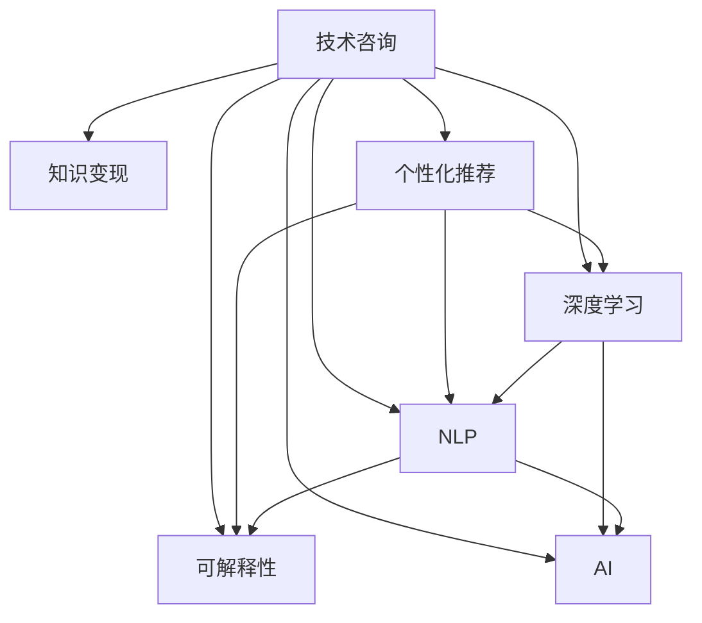

                 

# 技术咨询：知识变现的另一种方式

> 关键词：知识变现, 技术咨询, 个性化推荐, 深度学习, 自然语言处理, 可解释性, 人工智能, 技术博客

## 1. 背景介绍

### 1.1 问题由来
在数字化和智能化飞速发展的今天，技术的力量已经渗透到了各行各业，推动了企业的转型升级和创新发展。然而，面对日益复杂的技术挑战，许多企业面临着技术知识不足、技术创新能力薄弱等问题。这不仅限制了企业的竞争力，也阻碍了其业务发展。

### 1.2 问题核心关键点
技术咨询正是为了解决这些企业痛点而产生的专业服务。通过提供定制化的技术解决方案，帮助企业克服技术障碍，推动业务增长。但随着技术环境的快速变化，如何有效地提供技术咨询服务，并实现知识变现，成为了一个亟待解决的问题。

### 1.3 问题研究意义
对于企业而言，有效的技术咨询不仅能提高其技术能力，还能加快业务发展，提升市场竞争力。而对于技术咨询公司而言，实现知识变现是保持其竞争力和可持续发展的重要途径。通过提供高质量的技术咨询，企业能够长期受益于技术进步，实现技术知识的商业化。

## 2. 核心概念与联系

### 2.1 核心概念概述

为更好地理解技术咨询如何实现知识变现，本节将介绍几个密切相关的核心概念：

- **技术咨询**：指技术专家针对企业的技术需求，提供专业的解决方案，帮助企业解决技术难题，提升技术能力。
- **知识变现**：通过知识产品化、服务化，将技术知识转化为商业价值，实现知识的经济利益。
- **个性化推荐系统**：利用用户的兴趣和行为数据，推荐个性化的技术方案和解决方案，提升用户体验和咨询效率。
- **深度学习**：一种基于数据的机器学习技术，能够自动提取特征，解决复杂问题。
- **自然语言处理(NLP)**：使计算机理解、处理、生成人类语言的技术，用于构建智能的咨询系统。
- **可解释性**：技术咨询结果的可解释性，即解释模型和解决方案的决策过程，增强客户信任。
- **人工智能(AI)**：通过算法和数据训练，使机器能够模拟人类智能，应用于技术咨询的自动化和智能化。

这些核心概念之间的逻辑关系可以通过以下Mermaid流程图来展示：



这个流程图展示了一系列核心概念及其之间的关系：

1. 技术咨询是知识变现的基础，通过提供解决方案，实现知识价值的转化。
2. 个性化推荐系统根据用户需求推荐解决方案，提升咨询效果。
3. 深度学习用于提取特征，提升咨询系统的智能化水平。
4. NLP使计算机能够理解和处理自然语言，构建智能咨询系统。
5. 可解释性增强客户信任，推动技术咨询的发展。
6. AI技术驱动咨询系统的自动化和智能化。

这些概念共同构成了技术咨询的知识变现框架，使其能够更好地满足企业需求，实现商业化应用。

## 3. 核心算法原理 & 具体操作步骤
### 3.1 算法原理概述

技术咨询知识变现的核心在于如何构建高效、智能、可解释的咨询系统，通过提供个性化解决方案，实现知识的商业化。其核心算法原理包括：

- **个性化推荐算法**：利用用户历史行为数据，构建推荐模型，推荐最适合的解决方案。
- **深度学习模型**：通过神经网络模型，自动提取数据特征，建立复杂的决策模型。
- **NLP技术**：利用自然语言处理技术，构建智能咨询系统，实现自然语言理解和生成。
- **可解释性算法**：通过可解释性技术，解释模型的决策过程，增强客户信任。

### 3.2 算法步骤详解

以下是技术咨询知识变现的具体操作步骤：

**Step 1: 需求收集与分析**
- 收集企业的技术需求和痛点，分析问题的根源和影响。
- 设计问卷和访谈，了解企业的技术能力和需求。

**Step 2: 数据收集与处理**
- 收集企业的技术数据、业务数据和用户反馈。
- 对数据进行清洗和标准化处理，构建数据集。

**Step 3: 模型构建与训练**
- 选择适合的算法模型，如协同过滤、神经网络、NLP等。
- 构建推荐系统或决策模型，使用深度学习框架进行训练。
- 进行模型调参和优化，确保模型性能。

**Step 4: 知识产品化与服务化**
- 将模型集成到咨询系统中，构建智能咨询平台。
- 设计用户体验和交互界面，提高系统的可用性和易用性。
- 实现模型在线部署，提供即时咨询服务。

**Step 5: 客户反馈与优化**
- 收集用户反馈和满意度评价，进行模型优化和改进。
- 定期更新数据集和模型，保持系统的时效性和准确性。

### 3.3 算法优缺点

技术咨询知识变现的算法具有以下优点：

1. **个性化服务**：通过推荐算法，提供最适合的解决方案，满足客户需求。
2. **智能化决策**：利用深度学习模型，自动提取特征，解决复杂问题。
3. **可解释性**：通过可解释性算法，解释模型的决策过程，增强客户信任。
4. **快速部署**：利用NLP和AI技术，构建智能系统，实现快速部署。

同时，该方法也存在一定的局限性：

1. **数据依赖**：推荐算法和深度学习模型依赖大量数据，数据质量直接影响系统性能。
2. **模型复杂度**：深度学习模型通常较为复杂，需要较高的计算资源和专业知识。
3. **可解释性**：一些高级模型如神经网络，其决策过程难以解释，客户可能难以理解。
4. **技术门槛**：实现复杂模型和系统的设计和部署，需要较高的技术水平。

尽管存在这些局限性，但就目前而言，基于个性化推荐、深度学习、NLP和可解释性技术的技术咨询知识变现方法，仍是最主流范式。未来相关研究的重点在于如何进一步降低技术门槛，提高系统的可解释性，同时兼顾智能化和可解释性等因素。

### 3.4 算法应用领域

技术咨询知识变现的算法广泛应用于多个行业领域，例如：

- **金融科技**：利用深度学习模型，进行风险评估、反欺诈检测等。
- **医疗健康**：通过NLP技术，构建智能诊断系统，提升医疗水平。
- **制造业**：利用个性化推荐算法，优化生产流程，提高生产效率。
- **电商零售**：构建智能推荐系统，提升用户体验和销售额。
- **智能客服**：利用可解释性技术，实现智能客服系统，提高客户满意度。
- **企业培训**：利用个性化推荐和NLP技术，提供定制化培训课程，提升员工技能。

除了上述这些行业外，技术咨询知识变现的算法也被创新性地应用于更多场景中，如智慧城市、教育、物流等，为各行各业带来新的变革。

## 4. 数学模型和公式 & 详细讲解 & 举例说明
### 4.1 数学模型构建

本节将使用数学语言对技术咨询知识变现的算法进行更加严格的刻画。

设企业的技术需求为 $X$，对应的解决方案为 $Y$。企业的技术数据为 $D=\{(x_i, y_i)\}_{i=1}^N$，其中 $x_i$ 为技术需求，$y_i$ 为解决方案。

定义推荐模型的损失函数为 $\ell(Y, \hat{Y})$，其中 $\hat{Y}$ 为模型预测的解决方案。则在数据集 $D$ 上的经验风险为：

$$
\mathcal{L}(Y, \hat{Y}) = \frac{1}{N} \sum_{i=1}^N \ell(y_i, \hat{y_i})
$$

推荐系统的目标是最小化经验风险，即找到最优的解决方案：

$$
\hat{Y} = \mathop{\arg\min}_{Y} \mathcal{L}(Y)
$$

在实践中，我们通常使用基于梯度的优化算法（如SGD、Adam等）来近似求解上述最优化问题。设 $\eta$ 为学习率，$\lambda$ 为正则化系数，则参数的更新公式为：

$$
\theta \leftarrow \theta - \eta \nabla_{\theta}\mathcal{L}(\theta) - \eta\lambda\theta
$$

其中 $\nabla_{\theta}\mathcal{L}(\theta)$ 为损失函数对参数 $\theta$ 的梯度，可通过反向传播算法高效计算。

### 4.2 公式推导过程

以下我们以协同过滤算法为例，推导推荐系统的损失函数及其梯度的计算公式。

设推荐系统为 $P(Y, X)$，输入为技术需求 $X$，输出为推荐解决方案 $Y$。协同过滤算法的损失函数定义为：

$$
\ell(Y, \hat{Y}) = \|Y - \hat{Y}\|^2
$$

将其代入经验风险公式，得：

$$
\mathcal{L}(Y, \hat{Y}) = \frac{1}{N}\sum_{i=1}^N \|y_i - \hat{y_i}\|^2
$$

根据链式法则，损失函数对参数 $\theta_k$ 的梯度为：

$$
\frac{\partial \mathcal{L}(Y, \hat{Y})}{\partial \theta_k} = -\frac{2}{N}\sum_{i=1}^N (y_i - \hat{y_i})\frac{\partial \hat{y_i}}{\partial \theta_k}
$$

其中 $\frac{\partial \hat{y_i}}{\partial \theta_k}$ 可进一步递归展开，利用自动微分技术完成计算。

在得到损失函数的梯度后，即可带入参数更新公式，完成模型的迭代优化。重复上述过程直至收敛，最终得到推荐系统参数 $\theta^*$。

## 5. 项目实践：代码实例和详细解释说明
### 5.1 开发环境搭建

在进行技术咨询知识变现的实践前，我们需要准备好开发环境。以下是使用Python进行TensorFlow开发的环境配置流程：

1. 安装Anaconda：从官网下载并安装Anaconda，用于创建独立的Python环境。

2. 创建并激活虚拟环境：
```bash
conda create -n tf-env python=3.8 
conda activate tf-env
```

3. 安装TensorFlow：根据CUDA版本，从官网获取对应的安装命令。例如：
```bash
conda install tensorflow -c pytorch -c conda-forge
```

4. 安装Flask和PyTorch：
```bash
pip install flask torch
```

5. 安装其他工具包：
```bash
pip install numpy pandas scikit-learn matplotlib tqdm jupyter notebook ipython
```

完成上述步骤后，即可在`tf-env`环境中开始实践。

### 5.2 源代码详细实现

这里我们以推荐系统为例，给出使用TensorFlow进行技术咨询知识变现的PyTorch代码实现。

首先，定义推荐系统的损失函数：

```python
import tensorflow as tf

def loss_function(y_true, y_pred):
    return tf.keras.losses.mean_squared_error(y_true, y_pred)
```

然后，定义推荐模型的预测函数：

```python
class RecommendationSystem(tf.keras.Model):
    def __init__(self, input_dim, output_dim):
        super(RecommendationSystem, self).__init__()
        self.dense1 = tf.keras.layers.Dense(64, activation='relu', input_dim=input_dim)
        self.dense2 = tf.keras.layers.Dense(output_dim, activation='sigmoid')
        
    def call(self, x):
        x = self.dense1(x)
        x = self.dense2(x)
        return x
```

接着，定义模型训练函数：

```python
def train_model(model, train_dataset, validation_dataset, epochs, batch_size, learning_rate):
    model.compile(optimizer=tf.keras.optimizers.Adam(learning_rate), loss=loss_function)
    model.fit(train_dataset, validation_data=validation_dataset, epochs=epochs, batch_size=batch_size)
```

最后，启动训练流程并在测试集上评估：

```python
train_dataset = tf.data.Dataset.from_tensor_slices((train_features, train_labels))
validation_dataset = tf.data.Dataset.from_tensor_slices((validation_features, validation_labels))
test_dataset = tf.data.Dataset.from_tensor_slices((test_features, test_labels))

input_dim = train_features.shape[1]
output_dim = train_labels.shape[1]

model = RecommendationSystem(input_dim, output_dim)

epochs = 10
batch_size = 32
learning_rate = 0.001

train_model(model, train_dataset, validation_dataset, epochs, batch_size, learning_rate)
```

以上就是使用TensorFlow对推荐系统进行技术咨询知识变现的完整代码实现。可以看到，TensorFlow提供了强大的工具和库，使得模型开发和训练变得简洁高效。

### 5.3 代码解读与分析

让我们再详细解读一下关键代码的实现细节：

**RecommendationSystem类**：
- `__init__`方法：初始化模型的输入和输出维度，以及两个全连接层。
- `call`方法：定义前向传播过程，将输入通过两个全连接层进行计算，并输出预测结果。

**loss_function函数**：
- 定义损失函数为均方误差，用于衡量模型预测结果与真实标签之间的差异。

**train_model函数**：
- 将模型编译为Adam优化器，并指定损失函数。
- 使用fit方法对模型进行训练，输入训练数据和验证数据，设置训练轮数和批大小，使用指定学习率。

**训练流程**：
- 定义数据集，将特征和标签转换为TensorFlow数据集。
- 设置模型参数，包括输入和输出维度，以及学习率。
- 启动训练，调用train_model函数，完成模型的迭代优化。

可以看到，TensorFlow提供了一整套工具和库，使得技术咨询知识变现的实现变得简单高效。开发者可以利用TensorFlow丰富的模型库和优化器，快速构建和训练推荐系统，实现高效的知识变现。

当然，工业级的系统实现还需考虑更多因素，如模型的保存和部署、超参数的自动搜索、更灵活的推荐算法等。但核心的推荐系统范式基本与此类似。

## 6. 实际应用场景
### 6.1 智能客服系统

技术咨询推荐系统在智能客服系统的构建中发挥了重要作用。传统客服系统依赖于人工客服，高峰期响应速度慢，服务质量难以保证。通过推荐系统，智能客服可以自动推荐最适合的解决方案，提高客户满意度和服务效率。

在技术实现上，可以收集企业的历史客服对话记录，构建推荐模型，对用户的咨询问题进行智能推荐。推荐系统可以根据用户的历史行为和偏好，提供最符合用户需求的解决方案，提升客户体验。同时，推荐系统还可以实时学习用户反馈，动态调整推荐策略，持续优化服务质量。

### 6.2 金融理财顾问

金融理财顾问是技术咨询推荐系统的重要应用场景。传统的理财顾问依赖于人工分析，费时费力且难以全面覆盖客户需求。推荐系统可以根据客户的财务状况、投资偏好、风险承受能力等数据，自动推荐个性化的理财方案。

在技术实现上，可以收集客户的财务数据、投资行为、市场行情等数据，构建推荐模型，提供智能理财顾问服务。推荐系统可以根据市场变化和客户需求，实时调整推荐策略，为客户提供最优化的投资建议，提升客户收益和满意度。

### 6.3 个性化学习平台

个性化学习平台也是推荐系统的重要应用场景。传统的学习平台依赖于人工课程推荐，难以满足学生的个性化需求。推荐系统可以根据学生的学习历史、兴趣、成绩等数据，自动推荐最适合的学习课程。

在技术实现上，可以收集学生的学习数据、历史成绩、兴趣偏好等数据，构建推荐模型，提供个性化的学习建议。推荐系统可以根据学生的需求和反馈，动态调整推荐策略，提升学习效果和学生满意度。

### 6.4 未来应用展望

随着技术咨询推荐系统的发展，其在更多领域的应用前景值得期待。

在智慧医疗领域，推荐系统可以根据患者的病情、病历、基因信息等数据，自动推荐最适合的治疗方案和药品。推荐系统可以实时学习新病例，动态调整推荐策略，提高诊疗效果和患者满意度。

在智能交通领域，推荐系统可以根据用户的出行需求、偏好、历史行为等数据，自动推荐最优化的交通路线和出行方式。推荐系统可以实时学习交通流量和天气变化，动态调整推荐策略，提升出行效率和安全性。

在智能制造领域，推荐系统可以根据设备的运行状态、维护历史、生产数据等数据，自动推荐最优化的维护方案和生产策略。推荐系统可以实时学习设备状态和市场变化，动态调整推荐策略，提升生产效率和产品质量。

总之，技术咨询推荐系统将在更多领域带来变革性影响，为各行各业带来新的发展机遇。

## 7. 工具和资源推荐
### 7.1 学习资源推荐

为了帮助开发者系统掌握技术咨询知识变现的理论基础和实践技巧，这里推荐一些优质的学习资源：

1. 《深度学习入门：基于Python的理论与实现》系列博文：由深度学习专家撰写，深入浅出地介绍了深度学习的基础理论和实践技巧。

2. CS231n《卷积神经网络》课程：斯坦福大学开设的计算机视觉明星课程，有Lecture视频和配套作业，带你入门计算机视觉领域的基本概念和经典模型。

3. 《深度学习与推荐系统》书籍：深入讲解了深度学习在推荐系统中的应用，提供丰富的代码样例和算法实现。

4. TensorFlow官方文档：TensorFlow的官方文档，提供了完整的代码样例和算法实现，是入门和实践的重要参考。

5. Kaggle竞赛平台：提供大量的推荐系统竞赛数据集和算法实现，是提升算法能力和实践经验的好去处。

通过对这些资源的学习实践，相信你一定能够快速掌握技术咨询推荐系统的精髓，并用于解决实际的NLP问题。

### 7.2 开发工具推荐

高效的开发离不开优秀的工具支持。以下是几款用于技术咨询推荐系统开发的常用工具：

1. TensorFlow：基于Python的开源深度学习框架，灵活动态的计算图，适合快速迭代研究。提供了丰富的模型库和优化器。

2. PyTorch：基于Python的开源深度学习框架，动态图机制，适合快速原型设计和算法实现。

3. Flask：轻量级的Web框架，用于构建推荐系统的API接口和交互界面。

4. Scikit-learn：Python机器学习库，用于构建推荐系统的特征提取和模型训练。

5. Scrapy：Python爬虫框架，用于采集和处理推荐系统所需的数据。

6. TensorBoard：TensorFlow配套的可视化工具，实时监测模型训练状态，提供丰富的图表呈现方式。

合理利用这些工具，可以显著提升技术咨询推荐系统的开发效率，加快创新迭代的步伐。

### 7.3 相关论文推荐

技术咨询推荐系统的发展源于学界的持续研究。以下是几篇奠基性的相关论文，推荐阅读：

1. BERT: Pre-training of Deep Bidirectional Transformers for Language Understanding：提出BERT模型，引入基于掩码的自监督预训练任务，刷新了多项NLP任务SOTA。

2. Attention is All You Need：提出Transformer结构，开启了NLP领域的预训练大模型时代。

3. Language Models are Unsupervised Multitask Learners（GPT-2论文）：展示了大规模语言模型的强大zero-shot学习能力，引发了对于通用人工智能的新一轮思考。

4. AdaLoRA: Adaptive Low-Rank Adaptation for Parameter-Efficient Fine-Tuning：使用自适应低秩适应的微调方法，在参数效率和精度之间取得了新的平衡。

这些论文代表了大语言模型微调技术的发展脉络。通过学习这些前沿成果，可以帮助研究者把握学科前进方向，激发更多的创新灵感。

## 8. 总结：未来发展趋势与挑战
### 8.1 总结

本文对技术咨询知识变现进行了全面系统的介绍。首先阐述了技术咨询知识变现的背景和意义，明确了其对企业技术能力和业务发展的推动作用。其次，从原理到实践，详细讲解了技术咨询知识变现的算法原理和关键步骤，给出了推荐系统的代码实例。同时，本文还广泛探讨了推荐系统在智能客服、金融理财、个性化学习等多个行业领域的应用前景，展示了推荐系统的巨大潜力。此外，本文精选了推荐系统的各类学习资源，力求为读者提供全方位的技术指引。

通过本文的系统梳理，可以看到，技术咨询推荐系统正在成为技术咨询的重要范式，极大地提升了解决技术问题的效率和效果，实现知识的商业化应用。未来，伴随推荐系统的持续演进，相信技术咨询知识变现必将在更多领域发挥重要作用，为各行各业带来新的变革。

### 8.2 未来发展趋势

展望未来，技术咨询推荐系统将呈现以下几个发展趋势：

1. 技术咨询推荐系统与人工智能的深度融合。通过引入AI技术，提升系统的智能化和自动化水平，实现更精准的推荐和智能决策。

2. 推荐系统向多模态方向发展。除了文本推荐，未来会拓展到图像、视频、语音等多模态数据推荐。多模态信息的融合，将显著提升推荐系统的准确性和用户体验。

3. 推荐系统向个性化方向深入。通过引入用户画像、行为数据等，构建更加精细化的用户模型，实现更个性化、更精准的推荐。

4. 推荐系统向实时化方向发展。通过引入实时数据流处理技术，实现推荐系统的实时更新和动态调整，提升系统的时效性和准确性。

5. 推荐系统向透明化方向发展。通过引入可解释性技术，增强系统的透明度，提升客户信任和满意度。

6. 推荐系统向跨领域应用拓展。通过引入跨领域知识库和规则库，实现不同领域之间的知识整合和协同推荐。

以上趋势凸显了技术咨询推荐系统的广阔前景。这些方向的探索发展，必将进一步提升推荐系统的性能和应用范围，为技术咨询知识变现带来新的突破。

### 8.3 面临的挑战

尽管技术咨询推荐系统已经取得了瞩目成就，但在迈向更加智能化、普适化应用的过程中，它仍面临着诸多挑战：

1. 数据质量瓶颈。推荐系统依赖于大量高质量的数据，但数据获取和处理成本较高。如何降低数据获取成本，提升数据质量，将是重要的研究方向。

2. 算法复杂度问题。深度学习模型通常较为复杂，需要较高的计算资源和专业知识。如何简化模型，降低计算复杂度，提高模型的可解释性和可操作性，还需进一步研究。

3. 用户隐私保护。推荐系统需要收集用户大量个人信息，如何保护用户隐私，确保数据安全，是推荐系统面临的重要挑战。

4. 推荐系统的鲁棒性。推荐系统需要处理大量噪声数据，如何提高系统的鲁棒性，减少推荐偏差，提升推荐质量，仍需深入研究。

5. 推荐系统的公平性。推荐系统需要避免推荐偏差，确保不同用户得到公平的推荐。如何构建公平、无偏的推荐系统，还需进一步探索。

6. 推荐系统的可解释性。推荐系统需要解释推荐结果，提高系统的透明度和可解释性。如何构建可解释、透明的推荐系统，还需深入研究。

正视推荐系统面临的这些挑战，积极应对并寻求突破，将推荐系统推向更加成熟和高效的应用，是未来研究的重要方向。

### 8.4 研究展望

面对推荐系统面临的这些挑战，未来的研究需要在以下几个方面寻求新的突破：

1. 探索无监督和半监督推荐算法。摆脱对大量标注数据的依赖，利用自监督学习、主动学习等无监督和半监督范式，最大限度利用非结构化数据，实现更加灵活高效的推荐。

2. 研究参数高效和计算高效的推荐范式。开发更加参数高效的推荐方法，在固定大部分预训练参数的同时，只更新极少量的任务相关参数。同时优化推荐模型的计算图，减少前向传播和反向传播的资源消耗，实现更加轻量级、实时性的部署。

3. 融合因果和对比学习范式。通过引入因果推断和对比学习思想，增强推荐系统建立稳定因果关系的能力，学习更加普适、鲁棒的用户行为模式，从而提升推荐系统的泛化性和抗干扰能力。

4. 引入更多先验知识。将符号化的先验知识，如知识图谱、逻辑规则等，与神经网络模型进行巧妙融合，引导推荐过程学习更准确、合理的用户行为模式。同时加强不同模态数据的整合，实现视觉、语音等多模态信息与文本信息的协同建模。

5. 结合因果分析和博弈论工具。将因果分析方法引入推荐系统，识别出系统决策的关键特征，增强推荐结果的因果性和逻辑性。借助博弈论工具刻画人机交互过程，主动探索并规避推荐系统的脆弱点，提高系统稳定性。

6. 纳入伦理道德约束。在推荐系统训练目标中引入伦理导向的评估指标，过滤和惩罚有害、有偏的推荐结果，确保推荐系统的公平性和安全性。

这些研究方向的探索，必将引领推荐系统迈向更高的台阶，为技术咨询知识变现提供新的突破。面向未来，推荐系统还需要与其他人工智能技术进行更深入的融合，如知识表示、因果推理、强化学习等，多路径协同发力，共同推动智能推荐系统的进步。只有勇于创新、敢于突破，才能不断拓展推荐系统的边界，让智能推荐系统更好地服务于技术咨询知识变现。

## 9. 附录：常见问题与解答
**Q1：如何构建推荐系统的数据集？**

A: 推荐系统的数据集通常包括用户行为数据和物品特征数据。用户行为数据包括用户的浏览历史、点击记录、评分等，物品特征数据包括物品的属性、标签、描述等。构建数据集的步骤如下：

1. 收集用户行为数据和物品特征数据。
2. 对数据进行清洗和标准化处理，构建训练集、验证集和测试集。
3. 对数据进行划分，如将用户行为数据按照时间顺序划分，物品特征数据按照类别划分。
4. 对数据进行特征提取和转换，如将物品特征进行编码，用户行为进行向量化。

**Q2：推荐系统为什么需要个性化推荐？**

A: 推荐系统的核心目标是根据用户的历史行为和兴趣，推荐最适合的物品。个性化推荐能够提高推荐系统的准确性和用户满意度。通过个性化推荐，推荐系统可以精准地满足用户需求，提高用户粘性和转化率。

**Q3：深度学习在推荐系统中扮演什么角色？**

A: 深度学习在推荐系统中扮演重要角色，主要体现在以下几个方面：

1. 特征提取：深度学习能够自动提取用户行为和物品特征的高维表示，提高推荐系统的准确性和泛化能力。
2. 模型构建：深度学习能够构建复杂的推荐模型，如协同过滤、矩阵分解、神经网络等，提升推荐系统的智能化水平。
3. 数据处理：深度学习能够处理高维稀疏数据，解决推荐系统中的数据稀疏性和复杂性问题。

**Q4：如何提升推荐系统的鲁棒性？**

A: 推荐系统的鲁棒性是指推荐系统在处理噪声数据和异常情况时的稳健性。提升推荐系统的鲁棒性，可以从以下几个方面入手：

1. 数据预处理：对数据进行去噪、补全、标准化处理，减少噪声数据对推荐模型的影响。
2. 模型优化：引入正则化技术、对抗训练等方法，增强推荐模型的鲁棒性。
3. 多模型集成：构建多个推荐模型，取平均输出，抑制推荐偏差。
4. 实时学习：利用在线学习技术，实时更新模型，适应数据分布的变化。

**Q5：推荐系统如何实现透明化？**

A: 推荐系统的透明化是指推荐系统能够解释其推荐结果和决策过程，增强系统的透明度和可信度。实现透明化的步骤如下：

1. 可解释性模型：选择可解释性较高的推荐模型，如决策树、线性回归等。
2. 特征可视化：对推荐模型的特征进行可视化，帮助用户理解推荐模型的决策过程。
3. 结果解释：对推荐结果进行解释，如推荐理由、评分依据等，增强系统的透明度。
4. 用户反馈：收集用户反馈，持续优化推荐模型和推荐策略。

通过这些步骤，可以逐步提升推荐系统的透明化和可解释性，增强用户信任和满意度。

---

作者：禅与计算机程序设计艺术 / Zen and the Art of Computer Programming

