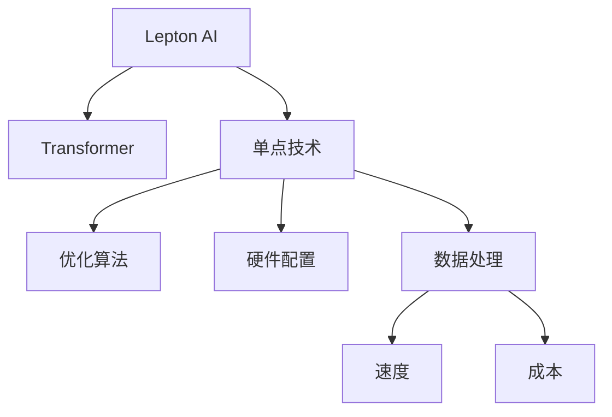

                 

# 技术实现艺术：Lepton AI结合单点技术平衡速度成本

## 1. 背景介绍

在当今这个快速变化的时代，人工智能(AI)技术的飞速发展为各行各业带来了巨大的变革。从医疗、金融到制造、零售，AI技术正在以前所未有的方式重塑人类的生活和工作方式。其中，自然语言处理(NLP)作为AI技术的重要分支，在对话系统、智能客服、自动摘要、机器翻译等领域取得了显著的进展。然而，尽管AI技术不断进步，技术实现的挑战依然存在，尤其是如何平衡速度和成本，将强大的AI模型部署到实际应用中，是一个令人深思的问题。

在本博文中，我们将重点探讨Lepton AI如何结合单点技术，在确保性能的同时，平衡速度和成本，从而实现高效的技术实现。我们将深入分析Lepton AI的技术架构和实现细节，探讨其在不同应用场景中的具体应用，以及未来的发展趋势和面临的挑战。

## 2. 核心概念与联系

### 2.1 核心概念概述

为了更好地理解Lepton AI技术，本节将介绍几个关键概念，并解释它们之间的联系：

- **Lepton AI**：一种基于Transformer架构的NLP模型，通过深度学习技术实现自然语言处理任务，如对话系统、自动摘要等。

- **Transformer**：一种用于处理序列数据的神经网络架构，由Google提出，能够有效提升模型处理长序列的能力，同时减少计算量。

- **单点技术**：一种在单个处理器或计算单元上实现特定功能的技术，通过优化算法和硬件配置，实现高效的数据处理和计算。

- **速度和成本平衡**：在保证模型性能的前提下，通过优化算法、硬件配置和数据处理方式，达到在速度和成本上的最优平衡。

- **优化算法**：包括梯度下降、Adam、Adagrad等，用于在训练过程中更新模型参数，以最小化损失函数。

- **硬件配置**：涉及CPU、GPU、TPU等计算资源的配置和使用，是实现高性能计算的重要因素。

### 2.2 核心概念原理和架构的 Mermaid 流程图

以下是Lepton AI技术原理和架构的Mermaid流程图：



这个流程图展示了Lepton AI技术的工作原理：Lepton AI通过Transformer架构实现自然语言处理任务，结合单点技术优化算法和硬件配置，在速度和成本之间寻求最佳平衡，并优化数据处理过程，从而实现高效的技术实现。

## 3. 核心算法原理 & 具体操作步骤

### 3.1 算法原理概述

Lepton AI的核心算法基于Transformer架构，通过自监督学习在大规模语料库上进行预训练，学习到语言的通用表示。在预训练过程中，Lepton AI能够捕捉语言的结构信息，如语法、语义等，从而在微调时能够更好地适应特定任务。

微调是Lepton AI的核心技术之一，其基本思想是在预训练模型上使用少量标注数据进行有监督学习，调整模型参数以适应特定任务。Lepton AI通过微调，能够快速适应不同的自然语言处理任务，如对话系统、自动摘要、机器翻译等，并提升模型的准确性和鲁棒性。

### 3.2 算法步骤详解

Lepton AI的微调步骤可以分为以下几个关键步骤：

1. **数据准备**：收集并准备下游任务的标注数据集，划分为训练集、验证集和测试集。

2. **模型加载**：加载预训练的Lepton AI模型，根据任务需求添加或调整任务适配层，如分类层、解码层等。

3. **模型微调**：使用微调数据集对模型进行训练，调整模型参数以适应特定任务。

4. **评估和部署**：在测试集上评估模型性能，如果达到预期，则将微调后的模型部署到实际应用中。

### 3.3 算法优缺点

Lepton AI的微调算法具有以下优点：

- **高效**：通过微调，Lepton AI能够快速适应特定任务，显著提高模型性能。
- **灵活**：微调过程可以根据具体任务进行调整，适用于各种NLP任务。
- **可解释性**：通过微调，Lepton AI能够学习到特定任务的特征，从而提高模型的可解释性。

同时，Lepton AI的微调算法也存在一些缺点：

- **依赖标注数据**：微调效果很大程度上取决于标注数据的质量和数量，获取高质量标注数据的成本较高。
- **模型复杂性**：预训练和微调过程需要大量的计算资源，对硬件配置有较高要求。
- **过拟合风险**：当微调数据集较小或标注数据有偏差时，模型容易过拟合。

### 3.4 算法应用领域

Lepton AI的微调算法已经在多个领域得到了广泛应用，包括：

- **对话系统**：通过微调，Lepton AI能够实现智能对话系统，提升用户体验和系统效率。
- **自动摘要**：通过微调，Lepton AI能够自动生成新闻、报告等文本摘要，提高信息处理效率。
- **机器翻译**：通过微调，Lepton AI能够实现高精度的机器翻译，提升跨语言交流的便捷性。
- **情感分析**：通过微调，Lepton AI能够实现对文本情感的准确分类，帮助企业了解市场舆情。
- **问答系统**：通过微调，Lepton AI能够构建智能问答系统，提供及时准确的答案。

## 4. 数学模型和公式 & 详细讲解 & 举例说明

### 4.1 数学模型构建

Lepton AI的微调过程可以形式化表示为：

$$
\theta = \arg\min_{\theta} \frac{1}{N}\sum_{i=1}^N \ell(\theta, x_i, y_i)
$$

其中，$\theta$ 是模型参数，$x_i$ 是输入文本，$y_i$ 是文本对应的标签，$\ell(\theta, x_i, y_i)$ 是损失函数，$N$ 是训练样本数。

在实际应用中，Lepton AI的微调过程通常使用交叉熵损失函数：

$$
\ell(\theta, x_i, y_i) = -\log p(y_i|x_i; \theta)
$$

其中，$p(y_i|x_i; \theta)$ 是模型在输入 $x_i$ 下，预测标签为 $y_i$ 的概率。

### 4.2 公式推导过程

通过反向传播算法，可以计算模型参数的梯度，并更新参数：

$$
\theta \leftarrow \theta - \eta \nabla_{\theta} \mathcal{L}(\theta)
$$

其中，$\eta$ 是学习率，$\nabla_{\theta} \mathcal{L}(\theta)$ 是损失函数对参数 $\theta$ 的梯度。

### 4.3 案例分析与讲解

以对话系统为例，假设输入为 "Hello, how are you?"，预训练模型预测输出为 "I'm fine, thank you. How can I help you?"。如果实际标签为 "I'm good. Can I have a coffee?"，则损失函数计算如下：

$$
\ell(\theta, "Hello, how are you?", "I'm good. Can I have a coffee?") = -\log p("I'm good. Can I have a coffee?" | "Hello, how are you?" ; \theta)
$$

通过梯度下降算法，更新模型参数，使得模型输出更加符合实际标签。

## 5. 项目实践：代码实例和详细解释说明

### 5.1 开发环境搭建

Lepton AI的开发环境通常包括以下几个部分：

1. **Python**：作为开发语言，Python拥有丰富的科学计算库和工具。

2. **Lepton AI库**：包括预训练模型和微调工具，支持TensorFlow、PyTorch等多种深度学习框架。

3. **Jupyter Notebook**：用于编写和执行Python代码，支持交互式编程。

4. **GPU/TPU**：用于加速深度学习模型的训练和推理，需要选择合适的GPU/TPU配置。

5. **云平台**：如AWS、Google Cloud等，提供计算资源和存储服务。

### 5.2 源代码详细实现

以下是一个简单的Lepton AI微调示例代码：

```python
import tensorflow as tf
from lepton_ai import LeptonAI

# 加载预训练模型
model = LeptonAI.load('lepton_base')

# 添加任务适配层
classifier = tf.keras.Sequential([
    model,
    tf.keras.layers.Dense(2, activation='softmax')
])

# 加载微调数据集
train_dataset = ...

# 定义损失函数和优化器
loss = tf.keras.losses.SparseCategoricalCrossentropy()
optimizer = tf.keras.optimizers.Adam()

# 训练模型
model.fit(train_dataset, epochs=10, batch_size=32, validation_data=val_dataset)

# 评估模型
test_loss, test_acc = model.evaluate(test_dataset)
print('Test accuracy:', test_acc)
```

### 5.3 代码解读与分析

以上代码展示了Lepton AI的微调过程，具体步骤如下：

1. **加载预训练模型**：使用 `LeptonAI.load` 函数加载预训练模型。

2. **添加任务适配层**：定义一个包含预训练模型和任务适配层的Sequential模型。

3. **加载微调数据集**：使用 `train_dataset` 变量加载微调数据集，包括训练集、验证集和测试集。

4. **定义损失函数和优化器**：使用交叉熵损失函数和Adam优化器。

5. **训练模型**：使用 `model.fit` 函数训练模型，设置训练轮数和批大小。

6. **评估模型**：使用 `model.evaluate` 函数在测试集上评估模型性能。

### 5.4 运行结果展示

训练完成后，可以在测试集上评估模型性能，如准确率、损失等。如果性能达到预期，则可以将微调后的模型部署到实际应用中。

## 6. 实际应用场景

### 6.1 智能客服系统

Lepton AI在智能客服系统中的应用，可以显著提升客户服务体验。智能客服系统能够快速响应客户咨询，提供24/7不间断服务，同时减少人力成本。通过微调，Lepton AI能够理解客户意图，生成自然流畅的回复，提高系统效率和用户满意度。

### 6.2 金融舆情监测

在金融领域，Lepton AI可以用于舆情监测和风险预警。通过微调，Lepton AI能够自动识别新闻、评论、社交媒体等文本中的情感倾向，及时发现市场舆情的变化，帮助金融机构做出快速反应，规避金融风险。

### 6.3 个性化推荐系统

Lepton AI在个性化推荐系统中的应用，可以提高推荐系统的精准度和用户满意度。通过微调，Lepton AI能够理解用户兴趣，生成个性化的推荐内容，提升用户体验和系统转化率。

### 6.4 未来应用展望

随着技术的不断发展，Lepton AI在更多领域的应用将更加广泛。未来，Lepton AI有望在医疗、教育、智慧城市等领域发挥重要作用，推动社会的数字化转型。

## 7. 工具和资源推荐

### 7.1 学习资源推荐

- **Lepton AI官方文档**：详细介绍了Lepton AI的架构、微调方法和应用场景。

- **深度学习课程**：如Coursera上的《深度学习》课程，涵盖了深度学习的基本概念和实现细节。

- **NLP书籍**：如《自然语言处理综述》，介绍了自然语言处理的基本理论和最新进展。

### 7.2 开发工具推荐

- **TensorFlow**：开源深度学习框架，支持大规模分布式训练。

- **PyTorch**：灵活的深度学习框架，支持动态图计算。

- **Jupyter Notebook**：交互式编程环境，方便快速编写和测试代码。

- **AWS SageMaker**：云平台，提供丰富的深度学习服务和资源。

### 7.3 相关论文推荐

- **Transformer论文**：由Google提出，详细介绍了Transformer架构的设计和实现。

- **深度学习应用论文**：如《深度学习在自然语言处理中的应用》，介绍了深度学习在自然语言处理中的具体应用。

## 8. 总结：未来发展趋势与挑战

### 8.1 研究成果总结

Lepton AI作为一款强大的自然语言处理工具，通过微调技术，能够快速适应各种NLP任务，提升模型性能。Lepton AI的开发环境丰富，涵盖了从预训练到微调的全过程，帮助开发者高效实现技术应用。

### 8.2 未来发展趋势

Lepton AI未来有望在更多领域得到应用，如医疗、教育、智慧城市等。随着技术的不断进步，Lepton AI的性能将进一步提升，应用范围将更加广泛。

### 8.3 面临的挑战

尽管Lepton AI在技术实现上取得了显著进展，但仍面临一些挑战：

- **数据标注成本**：高质量的数据标注成本较高，限制了微调的应用范围。

- **模型复杂度**：Lepton AI的模型复杂度较高，需要大量的计算资源。

- **过拟合风险**：当微调数据集较小或标注数据有偏差时，模型容易过拟合。

### 8.4 研究展望

未来的研究需要在以下几个方面进行深入探索：

- **无监督和半监督学习**：探索无监督和半监督学习方法，减少对标注数据的依赖。

- **高效微调算法**：开发高效微调算法，减少计算资源消耗。

- **可解释性增强**：增强模型的可解释性，帮助开发者理解和调试模型。

- **伦理道德保障**：确保模型的输出符合伦理道德标准，避免偏见和有害信息。

## 9. 附录：常见问题与解答

### Q1: Lepton AI的微调过程是否可以并行化？

A: 是的，Lepton AI的微调过程可以并行化，通过多GPU/TPU配置，加速模型的训练和推理。

### Q2: Lepton AI的微调过程是否可以实时化？

A: 部分场景可以实现实时化，通过优化模型结构和算法，减少计算量，实现在线服务。

### Q3: Lepton AI的微调过程是否可以跨平台部署？

A: 是的，Lepton AI的微调过程可以在多种平台和环境中部署，支持CPU、GPU、TPU等计算资源。

### Q4: Lepton AI的微调过程是否可以与现有系统集成？

A: 是的，Lepton AI的微调过程可以通过API接口与现有系统集成，提供自然语言处理功能。

### Q5: Lepton AI的微调过程是否需要大量的计算资源？

A: 是的，Lepton AI的微调过程需要大量的计算资源，特别是在大规模预训练和微调时，需要高性能的GPU/TPU配置。

---

作者：禅与计算机程序设计艺术 / Zen and the Art of Computer Programming

