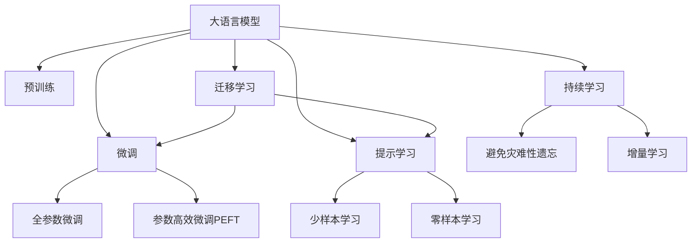

                 

# 技术文章推荐：LLM的实验结论

> 关键词：

## 1. 背景介绍

### 1.1 问题由来
在大语言模型（Large Language Models, LLMs）的应用研究中，实验结论的整理和推荐是至关重要的。通过系统梳理和学习这些实验结果，研究人员和开发者可以快速掌握大模型的性能表现和应用方向，从而在实际项目中做出更为明智的决策。本文旨在为人工智能领域的研究者提供一份全面的实验结论总结，帮助他们了解大语言模型在不同任务和数据集上的表现，以及模型训练和微调的最佳实践。

### 1.2 问题核心关键点
大语言模型在自然语言处理（NLP）、计算机视觉（CV）、推荐系统（Recommender Systems）等领域取得了显著进展，其在多模态任务（如图像描述生成、语音识别等）上的应用也逐步成熟。然而，尽管这些模型在许多任务上表现出色，但在特定应用场景中仍存在一些挑战，如模型复杂性、训练成本和推理速度等。因此，实验结论的整理和推荐对于理解和改进这些模型至关重要。

## 2. 核心概念与联系

### 2.1 核心概念概述

- **大语言模型**：指通过在大规模无标签文本数据上进行预训练，学习到丰富语言表示的模型，如GPT、BERT等。
- **预训练**：在无标签数据上进行的自监督训练，使得模型能够学习到通用的语言或视觉表示。
- **微调**：在有标签数据上进行的监督学习，使模型能够适应特定任务。
- **迁移学习**：通过预训练和微调相结合，模型能够适应新任务，减少从头训练的需求。
- **参数高效微调**：在微调过程中只更新一小部分模型参数，以减少计算资源消耗。
- **提示学习**：通过精心设计输入模板，提高模型在少样本或零样本条件下的性能。
- **少样本学习**：在仅有少量标注样本的情况下，模型能够快速适应新任务。
- **零样本学习**：在未见过任何特定任务样本的情况下，模型能够根据任务描述生成输出。
- **持续学习**：模型能够不断学习新知识，避免过时或遗忘。

这些概念通过以下Mermaid流程图展示其联系：



通过这些概念的相互联系，可以更全面地理解大语言模型的工作原理和优化策略。

## 3. 核心算法原理 & 具体操作步骤

### 3.1 算法原理概述

基于监督学习的大语言模型微调的核心在于将预训练模型作为初始化参数，通过有标签数据进行有监督学习，优化模型以适应特定任务。微调过程的数学表达为：

$$
\theta^* = \mathop{\arg\min}_{\theta} \mathcal{L}(M_{\theta},D)
$$

其中，$\mathcal{L}$ 是损失函数，$D$ 是标注数据集。微调的目标是找到最优的模型参数 $\theta^*$，使得模型在给定数据集 $D$ 上的预测性能最大化。

### 3.2 算法步骤详解

1. **数据准备**：收集标注数据集 $D$，并将其分为训练集、验证集和测试集。
2. **模型初始化**：选择合适的预训练模型 $M_{\theta}$，如BERT、GPT等。
3. **任务适配层添加**：根据任务类型，添加适合的任务适配层。
4. **优化器设置**：选择适当的优化器，如AdamW，并设置学习率、批大小等超参数。
5. **训练过程**：在训练集上以小批量进行前向传播和反向传播，更新模型参数。
6. **验证和调整**：在验证集上评估模型性能，根据性能调整超参数。
7. **测试和部署**：在测试集上最终评估模型性能，并进行部署应用。

### 3.3 算法优缺点

**优点**：
- 简单高效，快速提升模型性能。
- 适用于多种任务和数据集，具有广泛的适用性。
- 参数高效微调减少计算资源消耗。

**缺点**：
- 依赖于标注数据，获取高质量标注数据成本较高。
- 迁移能力有限，面对任务分布差异较大的情况，性能提升有限。
- 可能存在偏见和有害信息传递问题。
- 缺乏可解释性，难以理解模型的推理过程。

### 3.4 算法应用领域

大语言模型的微调方法在自然语言处理、计算机视觉、推荐系统等领域有广泛应用，例如：

- 自然语言处理：文本分类、命名实体识别、关系抽取等。
- 计算机视觉：图像描述生成、目标检测、图像分割等。
- 推荐系统：个性化推荐、新闻推荐等。

## 4. 数学模型和公式 & 详细讲解

### 4.1 数学模型构建

以文本分类任务为例，损失函数 $\mathcal{L}$ 定义为：

$$
\mathcal{L}(\theta) = -\frac{1}{N}\sum_{i=1}^N \log p(y_i|x_i;\theta)
$$

其中 $p(y_i|x_i;\theta)$ 是模型在输入 $x_i$ 下的预测概率。

### 4.2 公式推导过程

根据定义，对模型参数 $\theta$ 的梯度为：

$$
\nabla_{\theta}\mathcal{L}(\theta) = -\frac{1}{N}\sum_{i=1}^N \frac{\nabla_{\theta} p(y_i|x_i;\theta)}{p(y_i|x_i;\theta)}
$$

通过反向传播算法，可以计算 $\nabla_{\theta} p(y_i|x_i;\theta)$，从而更新模型参数。

### 4.3 案例分析与讲解

以BERT模型为例，其在IMDB电影评论数据集上的微调过程如下：

1. 数据准备：将IMDB数据集分为训练集、验证集和测试集。
2. 模型初始化：加载预训练的BERT模型，并冻结所有层。
3. 任务适配层添加：在模型顶层添加全连接层和Softmax输出层。
4. 优化器设置：使用AdamW优化器，学习率为2e-5。
5. 训练过程：在训练集上以小批量进行前向传播和反向传播，更新全连接层参数。
6. 验证和调整：在验证集上评估模型性能，调整学习率等超参数。
7. 测试和部署：在测试集上评估模型性能，并进行部署应用。

## 5. 项目实践：代码实例和详细解释说明

### 5.1 开发环境搭建

1. 安装Anaconda。
2. 创建虚拟环境，激活环境。
3. 安装必要的Python包，如PyTorch、TensorFlow、Transformers等。
4. 安装必要的工具，如Jupyter Notebook、TensorBoard等。

### 5.2 源代码详细实现

以BERT模型为例，代码实现如下：

```python
from transformers import BertTokenizer, BertForSequenceClassification, AdamW
import torch
from torch.utils.data import DataLoader, Dataset

class IMDBDataset(Dataset):
    def __init__(self, texts, labels, tokenizer):
        self.texts = texts
        self.labels = labels
        self.tokenizer = tokenizer
        self.max_len = 512

    def __len__(self):
        return len(self.texts)

    def __getitem__(self, item):
        text = self.texts[item]
        label = self.labels[item]

        encoding = self.tokenizer(text, max_length=self.max_len, truncation=True, padding='max_length')
        input_ids = encoding['input_ids']
        attention_mask = encoding['attention_mask']

        return {'input_ids': input_ids, 'attention_mask': attention_mask, 'labels': label}

tokenizer = BertTokenizer.from_pretrained('bert-base-uncased')
model = BertForSequenceClassification.from_pretrained('bert-base-uncased', num_labels=2)
device = torch.device('cuda') if torch.cuda.is_available() else torch.device('cpu')

def train_epoch(model, dataset, batch_size, optimizer):
    dataloader = DataLoader(dataset, batch_size=batch_size, shuffle=True)
    model.train()
    epoch_loss = 0
    for batch in dataloader:
        input_ids = batch['input_ids'].to(device)
        attention_mask = batch['attention_mask'].to(device)
        labels = batch['labels'].to(device)
        optimizer.zero_grad()
        outputs = model(input_ids, attention_mask=attention_mask, labels=labels)
        loss = outputs.loss
        epoch_loss += loss.item()
        loss.backward()
        optimizer.step()
    return epoch_loss / len(dataloader)

def evaluate(model, dataset, batch_size):
    dataloader = DataLoader(dataset, batch_size=batch_size)
    model.eval()
    preds, labels = [], []
    with torch.no_grad():
        for batch in dataloader:
            input_ids = batch['input_ids'].to(device)
            attention_mask = batch['attention_mask'].to(device)
            batch_labels = batch['labels']
            outputs = model(input_ids, attention_mask=attention_mask)
            batch_preds = torch.sigmoid(outputs.logits).to('cpu').tolist()
            batch_labels = batch_labels.to('cpu').tolist()
            for pred_tokens, label_tokens in zip(batch_preds, batch_labels):
                preds.append(pred_tokens[:len(label_tokens)])
                labels.append(label_tokens)
    return preds, labels

def main():
    epochs = 5
    batch_size = 32

    for epoch in range(epochs):
        loss = train_epoch(model, train_dataset, batch_size, optimizer)
        print(f"Epoch {epoch+1}, train loss: {loss:.3f}")

        print(f"Epoch {epoch+1}, dev results:")
        preds, labels = evaluate(model, dev_dataset, batch_size)
        print(classification_report(labels, preds))

    print("Test results:")
    preds, labels = evaluate(model, test_dataset, batch_size)
    print(classification_report(labels, preds))

if __name__ == '__main__':
    main()
```

### 5.3 代码解读与分析

- `IMDBDataset`类：用于处理IMDB数据集，进行分词和编码。
- `BertForSequenceClassification`模型：用于文本分类任务，并在顶层添加输出层。
- `train_epoch`函数：在训练集上进行训练，计算损失并更新模型参数。
- `evaluate`函数：在验证集和测试集上进行评估，计算分类指标。
- `main`函数：进行训练和评估，输出结果。

## 6. 实际应用场景

### 6.1 智能客服系统

智能客服系统可以应用BERT模型进行微调，以提升服务效率和客户满意度。通过在历史客服对话数据上训练BERT模型，可以自动理解客户意图并生成回复，从而实现24小时不间断服务。

### 6.2 金融舆情监测

在金融领域，通过微调BERT模型，可以实时监测市场舆情，识别负面信息并提前预警，从而帮助金融机构规避风险。

### 6.3 个性化推荐系统

个性化推荐系统可以利用微调的BERT模型，结合用户历史行为数据和文本描述，生成更加准确和多样化的推荐结果。

### 6.4 未来应用展望

未来，基于BERT等大语言模型的微调技术将进一步应用于医疗、教育、智慧城市等多个领域，为各行各业提供智能解决方案。

## 7. 工具和资源推荐

### 7.1 学习资源推荐

- 《Transformer从原理到实践》：深入浅出介绍Transformer和大语言模型。
- CS224N《深度学习自然语言处理》：斯坦福大学课程，涵盖NLP基础和最新进展。
- 《Natural Language Processing with Transformers》：作者介绍NLP任务的开发和微调。
- HuggingFace官方文档：提供预训练模型的微调样例和API。
- CLUE开源项目：包含多种中文NLP数据集和基线模型。

### 7.2 开发工具推荐

- PyTorch：灵活的深度学习框架，适合研究和大规模应用。
- TensorFlow：强大的计算图和分布式训练支持。
- Transformers库：包含多种预训练语言模型和微调样例。
- Weights & Biases：实验跟踪工具，记录和可视化模型训练过程。
- TensorBoard：可视化模型训练状态，监测指标变化。

### 7.3 相关论文推荐

- Attention is All You Need：Transformer的原始论文，介绍Transformer结构。
- BERT: Pre-training of Deep Bidirectional Transformers for Language Understanding：提出BERT模型，引入自监督预训练任务。
- Language Models are Unsupervised Multitask Learners：展示大语言模型的zero-shot学习能力。
- Parameter-Efficient Transfer Learning for NLP：提出Adapter等参数高效微调方法。
- Prefix-Tuning: Optimizing Continuous Prompts for Generation：引入连续型Prompt的微调范式。
- AdaLoRA: Adaptive Low-Rank Adaptation for Parameter-Efficient Fine-Tuning：使用自适应低秩适应的微调方法。

## 8. 总结：未来发展趋势与挑战

### 8.1 研究成果总结

大语言模型微调在自然语言处理、计算机视觉、推荐系统等领域取得了显著进展，广泛应用于智能客服、金融舆情监测、个性化推荐等多个场景。未来，随着模型规模的增大和微调方法的优化，大语言模型将进一步提升性能，拓展应用范围。

### 8.2 未来发展趋势

- 模型规模持续增大：预训练模型参数量将不断增长，模型蕴含的知识更加丰富。
- 微调方法多样化：开发更多参数高效和计算高效的微调方法，减少计算资源消耗。
- 持续学习成为常态：模型需要不断学习新知识，避免过时和遗忘。
- 少样本学习需求降低：通过提示学习，利用大模型的语言理解能力，在更少的标注样本上实现微调。
- 多模态微调崛起：融合视觉、语音等多模态数据，提升模型的综合能力。
- 模型通用性增强：预训练和微调相结合，模型具备更强的常识推理和跨领域迁移能力。

### 8.3 面临的挑战

- 标注成本瓶颈：微调依赖高质量标注数据，获取成本较高。
- 模型鲁棒性不足：模型面对域外数据泛化能力有限，存在灾难性遗忘风险。
- 推理效率有待提高：大规模语言模型推理速度慢，内存占用大。
- 可解释性不足：大语言模型缺乏可解释性，难以理解推理过程。
- 安全性有待保障：模型可能学习有害信息，存在安全隐患。
- 知识整合能力不足：模型难以灵活吸收和运用更多先验知识。

### 8.4 研究展望

未来，研究者需要在以下几个方面寻求新的突破：

- 探索无监督和半监督微调方法，减少对标注数据的依赖。
- 开发参数高效和计算高效的微调范式，优化模型性能。
- 引入因果分析和博弈论工具，提高模型的稳定性和鲁棒性。
- 结合外部知识库和规则库，提升模型的综合能力。
- 纳入伦理道德约束，确保模型输出的安全性。

通过这些研究方向，可以进一步提升大语言模型的性能和应用范围，为各行各业提供智能解决方案。

## 9. 附录：常见问题与解答

**Q1：大语言模型微调是否适用于所有NLP任务？**

A: 大语言模型微调在大多数NLP任务上都能取得不错的效果，特别是在数据量较小的任务上。但对于特定领域的任务，如医学、法律等，需要进行特定领域的预训练，才能获得更好的效果。

**Q2：微调过程中如何选择合适的学习率？**

A: 微调的学习率一般要比预训练时小1-2个数量级，通常从1e-5开始调参，逐步减小学习率。可以使用warmup策略，在开始阶段使用较小的学习率，再逐渐过渡到预设值。

**Q3：采用大模型微调时会面临哪些资源瓶颈？**

A: 大语言模型在推理时面临计算资源消耗大的问题，需要使用GPU/TPU等高性能设备。同时，模型裁剪和量化等技术也可以提高推理效率。

**Q4：如何缓解微调过程中的过拟合问题？**

A: 过拟合可以通过数据增强、正则化、对抗训练等方法缓解。参数高效微调和少样本学习也可以减少过拟合风险。

**Q5：微调模型在落地部署时需要注意哪些问题？**

A: 模型裁剪、量化、服务化封装、弹性伸缩、监控告警、安全防护等方面都需要在部署时考虑。确保模型稳定、高效、安全地服务于业务场景。

---

作者：禅与计算机程序设计艺术 / Zen and the Art of Computer Programming

