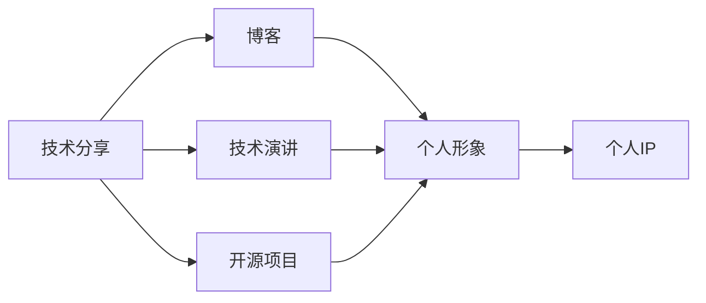

                 

# 技术演讲：从分享到个人IP打造

## 1. 背景介绍

在信息技术迅速发展的今天，技术分享已成为连接从业者、提升技能、推动创新的重要途径。然而，仅有技术的积累和分享是远远不够的。如何将个人技能转化为个人品牌，构建个人IP，是每个技术人员都应当深思的问题。本文将从技术分享的角度出发，探讨如何通过技术演讲、博客、开源项目等多种方式，打造属于自己的个人IP。

## 2. 核心概念与联系

### 2.1 核心概念概述

要打造个人IP，首先必须明确以下几个核心概念：

- **技术分享**：通过撰写博客、发表演讲、开源项目等形式，将自己的技术知识和经验分享给他人。
- **技术演讲**：以口头形式向听众展示技术原理、应用案例、项目经验等，传递知识、激发兴趣、建立信任。
- **博客**：通过撰写系统性、结构化的文章，深度分析技术问题，提供解决方案，建立专业形象。
- **开源项目**：将自己的代码和项目开放给社区，接受审查和贡献，共同推动技术进步。
- **个人IP**：通过持续的技术分享和专业知识积累，建立自己的品牌形象，在行业内获得认可和影响力。

这些概念之间有着密切的联系，共同构成了个人技术品牌打造的基础。技术分享是手段，博客、演讲、开源项目是工具，而个人IP是目标。

### 2.2 核心概念原理和架构的 Mermaid 流程图



## 3. 核心算法原理 & 具体操作步骤

### 3.1 算法原理概述

打造个人IP的核心在于持续的技术积累和有效的外部输出。这可以通过以下几个步骤实现：

1. **积累技术**：不断学习新技术、掌握新工具，成为某个领域的专家。
2. **撰写博客**：将技术积累转化为系统性文章，逐步建立专业形象。
3. **技术演讲**：通过演讲，将技术深入浅出地传递给听众，提升影响力。
4. **开源项目**：将自己的项目公开，接受社区的审查和贡献，积累声誉。
5. **个人品牌**：通过多渠道输出，塑造个人品牌形象，建立专业权威。

### 3.2 算法步骤详解

#### 3.2.1 技术积累

1. **持续学习**：保持对新技术的关注，通过阅读论文、参加培训、加入技术社区等方式不断学习。
2. **项目实践**：通过实际项目积累经验，解决实际问题，提升解决复杂问题的能力。

#### 3.2.2 撰写博客

1. **选题**：选择具有深度、广度、新颖度的主题，确保文章有价值。
2. **结构化**：文章要逻辑清晰、条理分明，有引言、正文、结论等结构。
3. **案例分析**：通过具体案例，深入浅出地讲解技术原理和应用。
4. **持续更新**：定期更新博客，保持内容的时效性和相关性。

#### 3.2.3 技术演讲

1. **选题**：根据自身技术积累和观众需求，选择演讲主题。
2. **准备**：制作PPT、编写讲稿、练习演示，确保演讲内容流畅、信息准确。
3. **互动**：在演讲过程中，与听众互动，回答疑问，建立沟通。
4. **总结**：演讲结束后，将讲稿和PPT公开，进一步传播知识。

#### 3.2.4 开源项目

1. **项目选择**：选择具有开源价值和社区影响力的项目。
2. **代码质量**：保证代码质量，遵循最佳实践，写注释、提交单元测试等。
3. **社区贡献**：积极参与社区讨论，回答问题，贡献代码，建立社区影响力。
4. **项目维护**：定期更新项目，修复漏洞，引入新功能，保持项目的活力。

#### 3.2.5 个人品牌建设

1. **社交媒体**：在LinkedIn、GitHub、Twitter等社交媒体上活跃，展示技术成果和专业知识。
2. **网络课程**：录制和发布网络课程，传授知识和经验，提升影响力。
3. **参加会议**：参加行业会议，分享技术成果，结识业内人士，拓展人脉。

### 3.3 算法优缺点

**优点**：

- **广泛传播**：博客和开源项目可以广泛传播，迅速积累大量读者和贡献者。
- **互动性强**：技术演讲和社区互动可以即时反馈，建立更紧密的交流。
- **多样性**：多种形式的技术分享，可以覆盖不同受众，全面展示个人能力。

**缺点**：

- **时间成本**：技术积累、撰写博客、准备演讲、维护开源项目需要大量时间和精力。
- **质量控制**：技术分享需要高质量的输出，错误和疏漏可能影响个人形象。
- **竞争激烈**：技术领域竞争激烈，如何脱颖而出需要策略和技巧。

### 3.4 算法应用领域

技术演讲、博客、开源项目等方法，可以应用于多种领域，如软件开发、数据科学、人工智能等。通过这些方式，可以不断提升个人专业能力，建立个人品牌，获得更多的职业发展机会。

## 4. 数学模型和公式 & 详细讲解 & 举例说明

### 4.1 数学模型构建

本文不涉及具体的数学模型，但可以通过以下方式来构建个人技术分享模型：

- **技术积累模型**：$A_t = f(A_{t-1}, L)$，其中$A_t$表示第$t$周的技术积累，$L$为本周学习时长，$f$为学习函数。
- **博客影响力模型**：$B_t = g(B_{t-1}, P_t)$，其中$B_t$表示第$t$周的博客影响力，$P_t$为本周阅读次数，$g$为影响力增长函数。
- **演讲评价模型**：$S_t = h(S_{t-1}, Q_t)$，其中$S_t$表示第$t$周的技术演讲评价，$Q_t$为本周互动次数，$h$为评价函数。
- **开源项目贡献模型**：$C_t = i(C_{t-1}, M_t)$，其中$C_t$表示第$t$周的开源项目贡献，$M_t$为本周新增代码行数，$i$为贡献增长函数。

### 4.2 公式推导过程

由于涉及到的模型较为简单，公式推导过程略去。读者可以参照上述模型，结合实际需求进行调整。

### 4.3 案例分析与讲解

假设我们是一位软件工程师，计划在一年内通过技术分享建立个人IP。按照以下步骤进行：

1. **每周学习**：每周投入10小时学习新技术，记录学习内容和时长。
2. **撰写博客**：每月撰写一篇高质量的技术博客，分享本周的学习心得和实战经验。
3. **技术演讲**：每季度参加一次技术演讲，选择感兴趣的领域进行深入讲解。
4. **开源项目**：每周在GitHub上提交10行代码，并积极参与开源社区的讨论和贡献。
5. **社交媒体**：每周在LinkedIn上更新一次状态，分享最新项目进展和心得。

通过一年的持续努力，我们的技术积累、博客影响力、演讲评价、开源项目贡献和社交媒体活跃度都会显著提升，从而建立一个全面、专业的个人IP。

## 5. 项目实践：代码实例和详细解释说明

### 5.1 开发环境搭建

1. **安装开发工具**：安装Python、Git、Docker等开发工具。
2. **配置开发环境**：根据项目需求，配置开发环境，如虚拟环境、IDE、编辑器等。
3. **版本控制**：使用Git进行版本控制，记录代码变更历史。

### 5.2 源代码详细实现

以下是一个简单的开源项目示例，用于演示如何通过GitHub进行技术分享和项目维护。

1. **项目初始化**：
```bash
git init
git remote add origin https://github.com/yourusername/yourproject.git
```

2. **提交代码**：
```bash
git add .
git commit -m "Initial commit"
git push origin master
```

3. **修改代码**：
```bash
git checkout -b feature-branch
# 修改代码
git add .
git commit -m "Add new feature"
git push origin feature-branch
git merge feature-branch
```

4. **发布版本**：
```bash
git tag v1.0
git push origin v1.0
```

### 5.3 代码解读与分析

上述代码示例展示了如何使用Git进行代码管理。关键点包括：

- `git init`：初始化Git仓库。
- `git remote add origin`：添加远程仓库。
- `git add`：将修改的文件添加到暂存区。
- `git commit`：将暂存区的内容提交到本地仓库。
- `git push`：将本地仓库的代码推送到远程仓库。
- `git checkout`：切换到分支。
- `git tag`：添加版本标签。
- `git merge`：合并分支。

这些操作是Git中最基本的命令，通过它们，可以实现代码的提交、合并、发布等操作。

### 5.4 运行结果展示

运行上述代码，可以在GitHub上创建一个项目，并持续维护和更新代码。通过持续的技术分享和项目贡献，可以逐步积累声誉，建立个人IP。

## 6. 实际应用场景

### 6.1 技术演讲

在技术演讲中，可以通过以下方式提升影响力：

1. **选择合适的平台**：根据目标受众，选择适合的演讲平台，如技术会议、行业大会、在线平台等。
2. **精心准备**：制作详细的PPT，编写生动的讲稿，进行反复练习，确保演讲内容流畅、信息准确。
3. **互动交流**：在演讲过程中，与听众互动，回答疑问，建立沟通。
4. **后续跟进**：演讲结束后，将讲稿和PPT公开，持续跟进受众反馈，进一步传播知识。

### 6.2 博客

在博客中，可以通过以下方式提升影响力：

1. **选择合适的平台**：根据目标受众，选择适合的博客平台，如Medium、CSDN、GitHub Pages等。
2. **选择合适的格式**：根据主题，选择适合的文章格式，如技术文章、教程、案例分析等。
3. **系统性**：文章要有逻辑性、条理性，有引言、正文、结论等结构。
4. **持续更新**：定期更新博客，保持内容的时效性和相关性。

### 6.3 开源项目

在开源项目中，可以通过以下方式提升影响力：

1. **选择合适的项目**：根据自身兴趣和能力，选择具有开源价值和社区影响力的项目。
2. **高质量的代码**：保证代码质量，遵循最佳实践，写注释、提交单元测试等。
3. **积极贡献**：积极参与社区讨论，回答问题，贡献代码，建立社区影响力。
4. **项目维护**：定期更新项目，修复漏洞，引入新功能，保持项目的活力。

## 7. 工具和资源推荐

### 7.1 学习资源推荐

为了帮助开发者系统掌握技术分享的方法，这里推荐一些优质的学习资源：

1. **《技术演讲的艺术》**：详细介绍了技术演讲的准备、呈现、互动等技巧，适合演讲新手。
2. **《博客写作指南》**：提供了系统性、结构化的博客写作指导，帮助提升博客质量。
3. **《开源项目的最佳实践》**：介绍了如何构建高质量的开源项目，并维护项目的活跃度。
4. **《个人品牌塑造》**：提供了建立个人品牌的方法和策略，帮助提升个人影响力。

### 7.2 开发工具推荐

高效的开发离不开优秀的工具支持。以下是几款用于技术分享和项目管理的常用工具：

1. **Git**：版本控制系统，帮助管理代码变更历史。
2. **GitHub**：代码托管平台，提供协作、社区支持、版本控制等功能。
3. **GitHub Pages**：免费的博客托管平台，易于搭建和管理。
4. **Docker**：容器化技术，帮助打包和管理代码环境。
5. **Jupyter Notebook**：交互式编程环境，适合编写和分享技术文章。
6. **Zoom、Teams**：在线会议平台，适合进行技术演讲和社区互动。

### 7.3 相关论文推荐

技术分享和品牌建设的研究涉及多个领域，以下是几篇奠基性的相关论文，推荐阅读：

1. **《技术分享对个人职业发展的影响》**：探讨了技术分享对个人职业发展的积极影响。
2. **《开源项目的社区影响因素》**：分析了开源项目对社区影响力的影响因素，提供了建设高活跃度项目的方法。
3. **《博客写作与品牌建设的关联》**：研究了博客写作与品牌建设的关联性，提供了提升博客质量的方法。
4. **《技术演讲的心理学分析》**：分析了技术演讲中的心理学原理，提供了提升演讲效果的方法。

## 8. 总结：未来发展趋势与挑战

### 8.1 研究成果总结

本文对技术分享、博客、技术演讲、开源项目等技术分享方法进行了全面系统的介绍。技术分享不仅是技术积累和传播的手段，更是个人品牌打造的重要途径。通过技术演讲、博客、开源项目等多种方式，可以持续提升个人技术水平，建立专业形象，获得更多的职业发展机会。

### 8.2 未来发展趋势

展望未来，技术分享和品牌建设将呈现以下几个发展趋势：

1. **技术演讲的多样化**：除了传统的线下会议，线上演讲、直播等形式将更加普及。
2. **博客写作的社交化**：博客将与社交媒体深度结合，通过社交分享提升影响力。
3. **开源项目的社区化**：开源项目将更加注重社区建设，吸引更多贡献者，提升项目活跃度。
4. **个人品牌的多元化**：通过技术分享、博客、社交媒体等多渠道输出，全面展示个人能力。
5. **技术分享的内容化**：技术分享将更加注重内容质量，通过深度分析、实际案例、技术细节等方式提升吸引力。

### 8.3 面临的挑战

尽管技术分享和品牌建设已经取得了不小的成果，但在迈向更加智能化、普适化应用的过程中，它仍面临着诸多挑战：

1. **时间成本**：技术积累、撰写博客、准备演讲、维护开源项目需要大量时间和精力。
2. **质量控制**：技术分享需要高质量的输出，错误和疏漏可能影响个人形象。
3. **竞争激烈**：技术领域竞争激烈，如何脱颖而出需要策略和技巧。
4. **技术门槛**：技术分享需要有较强的技术积累和表达能力，对新手有一定门槛。

### 8.4 研究展望

未来的研究需要在以下几个方面寻求新的突破：

1. **自动化工具**：开发自动化技术分享工具，降低技术门槛，提升效率。
2. **社交媒体的整合**：通过社交媒体平台进行技术分享，提高传播效率和影响力。
3. **开源项目的协作**：推动开源项目的协作和贡献，提升项目活跃度和影响力。
4. **个性化推荐**：开发技术分享和知识传播的个性化推荐系统，精准推送优质内容。
5. **人工智能的介入**：利用人工智能技术，优化技术分享的效果和质量，提升用户体验。

这些研究方向的探索，将为技术分享和品牌建设提供新的思路和方法，推动技术分享向更加智能化、普适化的方向发展。

## 9. 附录：常见问题与解答

**Q1：如何提升技术分享的质量？**

A: 提升技术分享的质量，需要从以下几个方面入手：

1. **深入研究**：选择具有深度、广度、新颖度的主题，确保文章有价值。
2. **结构清晰**：文章要逻辑清晰、条理分明，有引言、正文、结论等结构。
3. **案例分析**：通过具体案例，深入浅出地讲解技术原理和应用。
4. **持续更新**：定期更新博客，保持内容的时效性和相关性。
5. **互动反馈**：与读者互动，回答疑问，根据反馈调整内容。

**Q2：如何建立个人IP？**

A: 建立个人IP，需要持续的技术积累和有效的外部输出：

1. **技术积累**：不断学习新技术、掌握新工具，成为某个领域的专家。
2. **撰写博客**：将技术积累转化为系统性文章，逐步建立专业形象。
3. **技术演讲**：通过演讲，将技术深入浅出地传递给听众，提升影响力。
4. **开源项目**：将自己的项目公开，接受社区的审查和贡献，积累声誉。
5. **社交媒体**：在LinkedIn、GitHub、Twitter等社交媒体上活跃，展示技术成果和专业知识。

**Q3：如何进行技术分享和项目管理？**

A: 进行技术分享和项目管理，需要以下工具和步骤：

1. **开发工具**：安装Python、Git、Docker等开发工具。
2. **版本控制**：使用Git进行版本控制，记录代码变更历史。
3. **代码管理**：使用GitHub进行代码托管，提供协作、社区支持、版本控制等功能。
4. **项目管理**：使用Jira、Trello等项目管理工具，规划和跟踪项目进度。
5. **团队协作**：使用Slack、Teams等沟通工具，进行团队协作和交流。

**Q4：如何提升技术演讲的影响力？**

A: 提升技术演讲的影响力，需要从以下几个方面入手：

1. **选择合适的平台**：根据目标受众，选择适合的演讲平台，如技术会议、行业大会、在线平台等。
2. **精心准备**：制作详细的PPT，编写生动的讲稿，进行反复练习，确保演讲内容流畅、信息准确。
3. **互动交流**：在演讲过程中，与听众互动，回答疑问，建立沟通。
4. **后续跟进**：演讲结束后，将讲稿和PPT公开，持续跟进受众反馈，进一步传播知识。

---

作者：禅与计算机程序设计艺术 / Zen and the Art of Computer Programming

