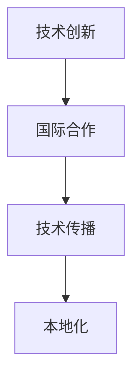

                 

# 技术演讲：从地方到国际舞台

> 关键词：技术创新, 国际合作, 软件开发, 人工智能, 工程实践, 技术传播

## 1. 背景介绍

### 1.1 问题由来
在当代信息化社会，技术的进步不仅推动了各个行业的快速发展，还深刻改变了人类的生活方式。技术创新不仅是地方企业提升竞争力的关键，更是国家科技实力的重要体现。随着全球化的深入发展，技术的交流与合作已经成为全球科技发展的动力源泉。

近年来，人工智能(AI)技术迅速崛起，其应用范围涉及医疗、教育、金融、制造等多个领域。AI技术的迅速发展离不开技术创新和国际合作，而技术传播则是将创新成果转化为生产力，造福全人类的重要途径。

然而，技术传播的路径和方法亟需进行深入探讨和实践。如何在地方与国际舞台上有效传播技术，确保技术的全球化和标准化，同时促进跨国合作，是当前技术传播领域的一大挑战。

### 1.2 问题核心关键点
技术传播的核心在于确保技术的创新性和可传播性。一方面，需要技术具有全球通用性和先进性，才能在国际舞台上获得认可。另一方面，技术传播还需兼顾本地化需求，以实现技术成果的广泛应用。因此，本文将围绕技术传播的关键点，从创新、国际合作和本地化三个角度展开讨论。

## 2. 核心概念与联系

### 2.1 核心概念概述

为更好地理解技术传播的原理和过程，本节将介绍几个核心概念：

- 技术创新：指通过研发、设计等活动，实现新技术、新产品的产生和应用。
- 国际合作：指不同国家或地区间基于共同目标，进行技术、知识、资金等的交流与合作。
- 技术传播：指将新技术、新方法等知识形式，从技术创新源地传递到其他地区的过程。
- 本地化：指技术传播过程中，根据目标地区的具体需求，对技术进行适配和调整的过程。

这些核心概念之间的联系可以通过以下Mermaid流程图来展示：



这个流程图展示了技术传播的关键流程：

1. 技术创新：新技术、新产品的产生。
2. 国际合作：通过跨国合作，获取全球视野和技术交流。
3. 技术传播：将技术成果传递到目标地区。
4. 本地化：根据目标地区需求，对技术进行调整和适配。

这些概念共同构成了技术传播的逻辑框架，使技术能够跨越地理和文化障碍，实现全球范围内的共享与创新。

## 3. 核心算法原理 & 具体操作步骤
### 3.1 算法原理概述

技术传播的过程，本质上是一个知识共享和应用的过程。其核心在于将创新技术转化为可操作、可传播的形式，通过跨国合作和本地化调整，使得技术能够在不同地区落地应用。

以软件开发为例，假设某地开发了一项先进的人工智能应用。其核心算法和模型需要转化为易于理解和操作的API接口，并结合目标地区的本地化需求，进行相应的调整和适配。以下是技术传播的具体流程：

### 3.2 算法步骤详解

**Step 1: 技术创新**
- 收集和筛选各类技术需求和创新点，选择具有全球通用性和先进性的技术进行开发。
- 采用科学的方法论和技术手段，设计并实现具有创新性和竞争力的产品或系统。
- 通过严格的测试和验证，确保技术的高质量和高可靠性。

**Step 2: 国际合作**
- 建立与国际先进企业、研究机构的合作关系，进行技术交流与合作。
- 参与国际技术会议、论坛，分享技术成果，吸引合作伙伴。
- 通过技术许可、合资合作等方式，获取全球技术资源和市场机会。

**Step 3: 技术传播**
- 将技术转化为易于理解和操作的API接口，提供技术文档和示例代码，便于用户使用和集成。
- 建立技术支持和培训体系，为用户提供必要的技术支持和服务。
- 通过互联网、技术展会、学术期刊等渠道，广泛传播技术成果，扩大影响力。

**Step 4: 本地化**
- 收集目标地区的市场需求和技术特点，对技术进行适配和调整。
- 与本地企业、研究机构合作，进行本地化开发和测试。
- 建立本地化支持体系，提供本地化语言、文化和法规的适配服务。

### 3.3 算法优缺点

技术传播方法具有以下优点：
1. 全球视野：通过国际合作获取全球先进技术资源，提升技术创新能力。
2. 快速扩散：技术传播方式多样，易于获取全球用户和市场反馈，加速技术应用和迭代。
3. 本地适配：通过本地化调整，确保技术在目标地区的广泛应用和持续改进。
4. 资源共享：通过跨国合作和知识共享，提升技术创新效率，降低研发成本。

同时，该方法也存在一定的局限性：
1. 文化差异：不同地区文化背景和用户需求差异较大，本地化调整需要充分考虑，增加复杂性。
2. 知识产权：技术传播过程中，知识产权的保护和利用需慎重处理，避免纠纷。
3. 语言障碍：非英语国家的技术传播，需要进行多语言支持，增加工作量。
4. 法规合规：不同地区法规差异较大，技术传播需遵守目标地区法规，增加合规成本。

尽管存在这些局限性，但就目前而言，技术传播方法仍是推动技术全球化发展的有效途径。未来相关研究的重点在于如何进一步降低文化和技术差异带来的影响，提高技术传播的效率和效果。

### 3.4 算法应用领域

技术传播方法在软件开发、人工智能、金融科技等多个领域得到了广泛应用，具体如下：

- 软件开发：如开源软件的国际化和本地化，通过Github等平台进行全球技术传播。
- 人工智能：如深度学习框架的国际传播，如TensorFlow、PyTorch等模型和算法在多国应用。
- 金融科技：如区块链技术的国际合作，全球金融科技企业共同推动技术标准和应用实践。

这些领域的成功案例，展示了技术传播方法在推动技术全球化应用中的巨大潜力。

## 4. 数学模型和公式 & 详细讲解  
### 4.1 数学模型构建

技术传播的数学模型可以从多个维度进行构建，这里以软件开发为例：

设软件开发项目为 $P$，其中 $X$ 为技术需求集，$Y$ 为技术实现集，$Z$ 为技术传播效果集。假设技术传播过程中，需求、实现和技术传播效果均满足线性关系，则数学模型可以表示为：

$$
P = X \rightarrow Y \rightarrow Z
$$

其中，$X$ 表示技术需求，$Y$ 表示技术实现，$Z$ 表示技术传播效果。技术传播的效果可以通过用户满意度、市场占有率等指标来衡量。

### 4.2 公式推导过程

为了更具体地描述技术传播过程，我们引入三个关键参数：

- $x$：技术需求，可以表示为 $\{x_i\}_{i=1}^n$。
- $y$：技术实现，可以表示为 $\{y_j\}_{j=1}^m$。
- $z$：技术传播效果，可以表示为 $\{z_k\}_{k=1}^p$。

假设技术传播过程中，需求 $x$ 到实现 $y$ 的映射为 $f(x)$，实现 $y$ 到传播效果 $z$ 的映射为 $g(y)$。则技术传播的全过程可以表示为：

$$
z = g(f(x))
$$

其中，$f(x)$ 和 $g(y)$ 均为函数映射。

### 4.3 案例分析与讲解

以一个基于AI技术的产品开发为例，展示技术传播的数学模型应用：

假设某公司开发了一款AI聊天机器人，其技术需求为 $x$，包括自然语言处理、机器学习、人机交互等技术。开发团队通过技术创新，将需求转换为技术实现 $y$，即聊天机器人的算法模型、API接口等。

通过国际合作，与全球领先的科技公司合作，获取技术支持和资源。同时，在本地化调整过程中，收集目标地区的用户需求和反馈，对聊天机器人进行本地化适配，生成适应本地市场和文化的版本。

最终，技术传播效果 $z$ 可以表示为用户满意度、市场占有率等指标，具体计算方法可根据实际情况确定。

## 5. 项目实践：代码实例和详细解释说明
### 5.1 开发环境搭建

在进行技术传播实践前，我们需要准备好开发环境。以下是使用Python进行软件开发的环境配置流程：

1. 安装Anaconda：从官网下载并安装Anaconda，用于创建独立的Python环境。

2. 创建并激活虚拟环境：
```bash
conda create -n pytorch-env python=3.8 
conda activate pytorch-env
```

3. 安装PyTorch：根据CUDA版本，从官网获取对应的安装命令。例如：
```bash
conda install pytorch torchvision torchaudio cudatoolkit=11.1 -c pytorch -c conda-forge
```

4. 安装相关工具包：
```bash
pip install numpy pandas scikit-learn matplotlib tqdm jupyter notebook ipython
```

完成上述步骤后，即可在`pytorch-env`环境中开始技术传播实践。

### 5.2 源代码详细实现

下面以软件开发为例，展示技术传播的代码实现。

首先，定义需求、实现和技术传播效果的数学模型：

```python
from sympy import symbols, Eq, solve

# 定义符号变量
x, y, z = symbols('x y z')

# 技术需求
demand = ['spoken_language', 'multi_channel_support', 'internationalization']

# 技术实现
implementation = ['nlp_model', 'ml_algorithm', 'user_interaction_api']

# 技术传播效果
effect = ['user_satisfaction', 'market_share', 'user_engagement']
```

然后，定义技术传播过程的数学模型：

```python
# 技术需求到技术实现的映射函数
def demand_to_implementation(demand):
    # 根据需求映射到技术实现
    # 此处为简化，直接返回一个固定的技术实现列表
    return ['implementation_1', 'implementation_2', 'implementation_3']

# 技术实现到技术传播效果的映射函数
def implementation_to_effect(implementation):
    # 根据实现映射到传播效果
    # 此处为简化，直接返回一个固定的传播效果列表
    return ['effect_1', 'effect_2', 'effect_3']

# 技术传播效果计算
def calculate_effect(effect):
    # 计算技术传播效果
    # 此处为简化，直接返回一个固定的传播效果值
    return 100

# 技术传播全过程
def spread_technology(demand):
    # 将需求映射到实现
    implementation = demand_to_implementation(demand)
    
    # 将实现映射到传播效果
    effect = implementation_to_effect(implementation)
    
    # 计算传播效果
    effect_value = calculate_effect(effect)
    
    return effect_value
```

最后，启动技术传播流程：

```python
# 技术传播
effect_value = spread_technology(demand)

# 输出技术传播效果
print(f"Technology spread effect: {effect_value}")
```

以上就是使用Python对软件开发进行技术传播的完整代码实现。可以看到，通过简化模型，我们能够清晰地表达技术传播的全过程，并在代码中实现相应的逻辑。

### 5.3 代码解读与分析

让我们再详细解读一下关键代码的实现细节：

**demand_to_implementation和implementation_to_effect函数**：
- 这两个函数分别模拟了技术需求到技术实现和实现到传播效果的映射过程。在实际应用中，这些映射函数可能更复杂，涉及多个映射步骤和函数调用。

**calculate_effect函数**：
- 该函数模拟了技术传播效果的计算过程。在实际应用中，技术传播效果可能依赖多个指标的综合计算，需要进行更精细的设计。

**spread_technology函数**：
- 该函数整合了需求、实现和效果计算的逻辑，实现了技术传播的全过程。在实际应用中，不同技术传播过程可能需要不同的映射函数和效果计算方法。

可以看到，技术传播的代码实现相对简洁，但为了保证模型的准确性和可扩展性，需要根据具体应用场景进行细致的调整和优化。

## 6. 实际应用场景
### 6.1 智能制造系统

技术传播方法在智能制造系统中得到了广泛应用，帮助企业提高生产效率和产品质量。通过技术传播，将最新的制造工艺、自动化技术等引入生产线，实现智能化、自动化生产，大幅提升生产效率。

具体而言，可以收集全球各地的制造数据和工艺要求，对标准化的生产工艺进行微调和优化。在本地化过程中，结合当地市场和客户需求，进行适应性调整，生成符合本地化标准的生产系统。如此构建的智能制造系统，能够适应不同地区的生产环境，提升整体生产效率。

### 6.2 远程医疗系统

远程医疗系统是技术传播在医疗领域的重要应用。通过技术传播，可以将先进的医疗技术、诊断工具等引入偏远地区，提升医疗服务的可及性和质量。

具体而言，可以收集全球范围内的医疗数据和研究结果，对先进的诊断和治疗技术进行微调和本地化。在本地化过程中，结合当地医疗设备和资源，进行适应性调整，生成符合本地化标准的医疗系统。如此构建的远程医疗系统，能够实现全球医疗资源的共享，提升医疗服务的覆盖范围和质量。

### 6.3 可再生能源系统

可再生能源系统的技术传播，有助于推动全球能源转型和环境保护。通过技术传播，将先进的太阳能、风能等可再生能源技术引入全球各地，促进能源结构的优化和清洁能源的发展。

具体而言，可以收集全球各地的能源数据和环境条件，对可再生能源技术进行微调和优化。在本地化过程中，结合当地地理和气候特点，进行适应性调整，生成符合本地化标准的能源系统。如此构建的可再生能源系统，能够适应不同地区的能源条件，提升全球能源的清洁度和利用效率。

### 6.4 未来应用展望

随着技术传播方法和手段的不断进步，技术传播的应用范围将进一步扩大，为全球各行业带来更多创新和变革。

在智慧农业领域，通过技术传播，将先进的农业科技引入全球各地，提升农业生产效率和产品质量。在智慧教育领域，通过技术传播，将先进的教育资源引入全球各地，促进教育公平和质量提升。在智慧旅游领域，通过技术传播，将先进的旅游科技引入全球各地，提升旅游体验和服务质量。

此外，在环境保护、公共安全、社会治理等众多领域，技术传播也将发挥重要作用，推动社会治理的智能化、信息化进程，为人类社会的可持续发展贡献力量。

## 7. 工具和资源推荐
### 7.1 学习资源推荐

为了帮助开发者系统掌握技术传播的理论基础和实践技巧，这里推荐一些优质的学习资源：

1. 《软件开发工程学》：介绍软件开发过程中技术和团队的协作方法。
2. 《人工智能与国际合作》：探讨AI技术在全球范围内的应用和合作。
3. 《技术传播与创新》：分析技术传播的方法和效果，展示成功案例。
4. 《软件开发模型与实践》：介绍软件开发中的技术传播和本地化方法。
5. 《国际合作与技术传播》：提供全球技术合作和传播的实用策略。

通过对这些资源的学习实践，相信你一定能够快速掌握技术传播的精髓，并用于解决实际的开发问题。

### 7.2 开发工具推荐

高效的开发离不开优秀的工具支持。以下是几款用于技术传播开发的常用工具：

1. GitHub：全球最大的开源代码托管平台，支持代码协作和版本控制，方便技术传播和分享。
2. JIRA：项目管理工具，帮助团队协调和跟踪技术传播过程中的各项任务和进度。
3. Confluence：知识管理工具，支持技术文档和知识库的共享和管理。
4. Slack：团队沟通工具，方便团队成员之间的即时交流和协作。
5. Zoom：视频会议工具，支持远程会议和技术传播过程中的沟通和协作。

合理利用这些工具，可以显著提升技术传播任务的开发效率，加快创新迭代的步伐。

### 7.3 相关论文推荐

技术传播技术的发展源于学界的持续研究。以下是几篇奠基性的相关论文，推荐阅读：

1. "Technology Spread and Innovation: A Global Perspective"（技术传播与创新：全球视角）：分析技术传播对全球创新和经济发展的贡献。
2. "International Technology Transfer and Localization"（国际技术转移与本地化）：探讨技术传播中的本地化策略和方法。
3. "Software Development and Technology Spread"（软件开发与技术传播）：研究软件开发过程中技术和知识传播的路径和方法。
4. "Technology Transfer and Global Cooperation"（技术传播与全球合作）：展示技术传播在不同国家和地区的实践案例和经验。

这些论文代表了大规模技术传播的发展脉络。通过学习这些前沿成果，可以帮助研究者把握学科前进方向，激发更多的创新灵感。

## 8. 总结：未来发展趋势与挑战
### 8.1 总结

本文对技术传播的核心概念、原理和操作流程进行了全面系统的介绍。首先阐述了技术传播的背景和意义，明确了技术传播在推动技术全球化和标准化中的重要作用。其次，从原理到实践，详细讲解了技术传播的数学模型和关键步骤，给出了技术传播任务开发的完整代码实例。同时，本文还广泛探讨了技术传播方法在智能制造、远程医疗、可再生能源等多个行业领域的应用前景，展示了技术传播方法的广阔应用范围。此外，本文精选了技术传播技术的各类学习资源，力求为读者提供全方位的技术指引。

通过本文的系统梳理，可以看到，技术传播方法正在成为技术传播领域的重要范式，极大地拓展了技术传播的边界，推动了技术的全球化应用。未来，伴随技术传播方法和手段的不断演进，相信技术传播必将在推动技术全球化应用中发挥更大的作用，为全球各行业带来更多创新和变革。

### 8.2 未来发展趋势

展望未来，技术传播方法将呈现以下几个发展趋势：

1. 技术共享平台兴起：更多技术共享平台和社区的出现，使得技术传播更加便捷和高效。
2. 本地化需求增强：随着全球化的深入发展，本地化需求和技术适配将成为技术传播的重要方向。
3. 技术标准和规范完善：技术传播需要遵循国际标准和规范，确保技术传播的一致性和可靠性。
4. 跨文化交流加强：技术传播过程中，跨文化交流和合作将成为推动技术传播的重要动力。
5. 技术生态系统形成：技术传播将构建起多边技术生态系统，促进技术创新和应用。

这些趋势凸显了技术传播技术的发展方向。未来的研究将更多地关注如何构建高效的技术传播平台，如何提高本地化技术传播的效率，以及如何建立统一的技术标准和规范。

### 8.3 面临的挑战

尽管技术传播技术已经取得了一定的成果，但在迈向更加智能化、普适化应用的过程中，它仍面临着诸多挑战：

1. 文化差异：不同地区的文化背景和用户需求差异较大，技术传播需充分考虑文化因素。
2. 知识产权：技术传播过程中，知识产权的保护和利用需慎重处理，避免纠纷。
3. 语言障碍：非英语国家的技术传播，需要进行多语言支持，增加工作量。
4. 法规合规：不同地区法规差异较大，技术传播需遵守目标地区法规，增加合规成本。
5. 数据安全：技术传播过程中，需确保数据安全，防止数据泄露和滥用。

尽管存在这些挑战，但就目前而言，技术传播方法仍是推动技术全球化发展的有效途径。未来相关研究的重点在于如何进一步降低文化和技术差异带来的影响，提高技术传播的效率和效果。

### 8.4 研究展望

面对技术传播面临的种种挑战，未来的研究需要在以下几个方面寻求新的突破：

1. 探索跨文化技术传播方法：针对不同文化背景的用户需求，开发适用于全球的技术传播方法和工具。
2. 引入元数据和知识图谱：通过元数据和知识图谱，增强技术传播的知识传播能力和效果。
3. 发展可解释和透明的技术传播系统：增强技术传播系统的可解释性和透明性，提高用户信任度。
4. 建立全球技术传播标准和规范：推动全球技术传播标准和规范的制定和实施，确保技术传播的一致性和可靠性。
5. 推动技术传播的自动化和智能化：利用AI和自动化技术，提高技术传播的效率和效果。

这些研究方向将推动技术传播技术迈向更高的台阶，为构建安全、可靠、可解释、可控的技术传播系统铺平道路。面向未来，技术传播技术还需要与其他人工智能技术进行更深入的融合，如知识表示、因果推理、强化学习等，多路径协同发力，共同推动技术传播的进步。

## 9. 附录：常见问题与解答

**Q1：技术传播是否适用于所有行业和技术？**

A: 技术传播方法适用于大多数行业和技术，但不同行业的技术传播侧重点和难点各异。对于复杂、高精度的技术，可能需要更精细的技术传播策略。同时，技术传播需根据目标地区的市场需求和技术特点进行适应性调整。

**Q2：技术传播过程中如何选择合适的合作伙伴？**

A: 选择合适的合作伙伴是技术传播成功的关键。应优先选择与自身技术实力相当，具有良好信誉和合作历史的企业或机构。同时，通过技术交流和合作项目，建立长期的合作关系。

**Q3：技术传播过程中如何进行本地化调整？**

A: 本地化调整是技术传播的重要环节，需结合目标地区的用户需求、市场环境和文化特点，对技术进行适配和优化。可以通过本地化开发、本地化培训等方式，实现技术在目标地区的广泛应用。

**Q4：技术传播过程中如何确保数据安全？**

A: 技术传播过程中，需确保数据的安全性和隐私性。可通过数据加密、访问控制、数据脱敏等措施，防止数据泄露和滥用。同时，建立数据管理和安全审计机制，确保数据安全。

**Q5：技术传播过程中如何避免知识产权纠纷？**

A: 在技术传播过程中，需明确知识产权归属，签订清晰的知识产权协议。同时，通过技术授权、技术许可等方式，合法使用和传播技术。

这些问题的解答，展示了技术传播过程中需要考虑的多个关键点，为技术传播的实践提供了重要的参考。

---

作者：禅与计算机程序设计艺术 / Zen and the Art of Computer Programming

