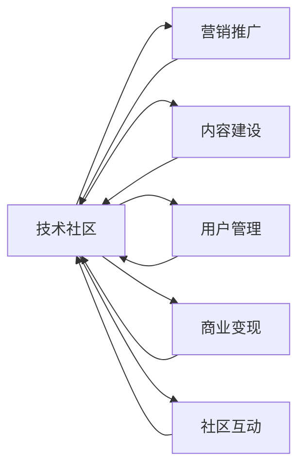

                 

# 技术社区运营：影响力变现

> 关键词：技术社区, 运营策略, 影响力变现, 社群管理, 数字营销

## 1. 背景介绍

在互联网时代，技术社区作为一种重要的知识共享和交流平台，在加速技术传播、推动知识创新、促进人才交流方面发挥着举足轻重的作用。从GitHub、Stack Overflow、CSDN到知乎、掘金、Medium，全球各地的技术社区遍地开花，成为连接开发者、企业、行业专家的重要纽带。然而，技术社区的建设和发展不仅需要耗费大量时间和精力，还需要不断的投入和运营。如何提高技术社区的影响力和商业变现能力，成为了摆在社区管理者面前的重要课题。本文将围绕技术社区运营的核心问题，深入探讨如何通过策略设计、资源整合、市场定位、技术创新等多方面手段，实现社区影响力的最大化变现。

## 2. 核心概念与联系

### 2.1 核心概念概述

要理解技术社区运营的核心概念，首先需要明确几个基本点：

- **技术社区**：指以技术分享、交流、学习为核心目标，吸引开发者、技术爱好者、行业专家等参与者共同构建的在线平台。技术社区包括开源代码托管、技术博客、论坛讨论、知识问答、在线课程、技术会议等多种形式。
- **运营策略**：指针对技术社区的特点和目标受众，制定并执行的营销、推广、管理、互动等策略，以实现社区成员增长、用户粘性提升、商业变现等目标。
- **影响力变现**：指通过提升技术社区在技术界的知名度、声誉和影响力，吸引更多资源、广告、赞助、付费会员等，实现社区的经济价值最大化。

### 2.2 核心概念原理和架构的 Mermaid 流程图



以上流程图示意了技术社区运营的核心环节及其相互作用。其中，内容建设是社区发展的基础，营销推广和商业变现是实现经济价值的关键，用户管理和社区互动则直接影响社区的活跃度和粘性。

## 3. 核心算法原理 & 具体操作步骤

### 3.1 算法原理概述

技术社区运营的本质是一种基于社交网络、内容营销、社区管理的综合策略。其核心算法原理可以归纳为以下几个方面：

1. **用户行为分析**：通过数据挖掘和机器学习技术，分析社区用户的行为模式，挖掘用户兴趣、需求和行为规律，为个性化推荐、内容优化、活动策划等提供数据支持。

2. **内容推荐算法**：利用协同过滤、深度学习等算法，为用户推荐最相关的技术文章、开源项目、讨论话题等，提升用户粘性和活跃度。

3. **社区互动算法**：通过自然语言处理技术，实现智能化的问答、讨论、点评等功能，促进社区成员之间的互动和交流，提升社区的活跃度和粘性。

4. **商业变现算法**：基于广告投放、付费会员、赞助合作等策略，设计并执行广告曝光、付费订阅、推广活动等商业变现方案，实现社区的经济价值最大化。

### 3.2 算法步骤详解

1. **用户行为数据分析**：
    - **数据采集**：收集用户在社区内的行为数据，包括浏览记录、点赞评论、活动参与等。
    - **数据清洗**：对采集的数据进行去重、去噪、格式统一等处理，保证数据质量。
    - **特征提取**：对清洗后的数据进行特征提取，包括用户画像、兴趣偏好、行为模式等。
    - **模型训练**：利用机器学习算法对用户数据进行训练，构建用户行为预测模型。

2. **内容推荐算法**：
    - **数据预处理**：对社区内的技术文章、开源项目、讨论话题等进行标签化、分词、向量化等预处理操作。
    - **模型训练**：利用协同过滤、深度学习等算法对内容数据进行训练，构建推荐模型。
    - **内容推荐**：根据用户行为数据和推荐模型，为用户推荐相关内容，提升用户粘性和活跃度。

3. **社区互动算法**：
    - **自然语言处理**：对社区成员的评论、讨论、点评等内容进行自然语言处理，实现情感分析、主题识别等功能。
    - **智能推荐**：根据用户行为和自然语言处理结果，推荐相关讨论话题、相关用户等，促进社区互动。
    - **社区管理**：通过智能算法对社区内容进行审核、推荐、监控，提升社区质量，减少不良内容。

4. **商业变现算法**：
    - **广告投放策略**：分析社区流量和用户行为，设计合理的广告投放策略，实现高效曝光和点击转化。
    - **付费会员方案**：设计个性化付费会员方案，根据用户兴趣和行为推荐专属权益，提升会员粘性和付费率。
    - **赞助合作计划**：与企业、技术公司等建立合作关系，推出赞助计划，实现双赢互利。

### 3.3 算法优缺点

#### 优点：
1. **提升用户粘性和活跃度**：通过精准的内容推荐和社区互动，显著提升用户活跃度和粘性，提高用户留存率。
2. **增加商业变现渠道**：通过广告、付费会员、赞助合作等多种变现方式，实现经济价值最大化。
3. **数据驱动决策**：通过大数据和机器学习算法，实现科学决策，优化社区运营效果。

#### 缺点：
1. **数据隐私和安全问题**：在用户行为分析中，涉及到大量用户数据的采集和处理，可能引发数据隐私和安全问题。
2. **技术门槛较高**：需要具备丰富的数据科学和算法知识，对运营人员的技术要求较高。
3. **运营成本较高**：技术社区运营需要持续的资金投入，包括技术开发、服务器运维、数据存储等，运营成本较高。

### 3.4 算法应用领域

技术社区运营的算法不仅适用于开源社区、技术博客、技术问答等传统形式，还广泛应用于以下几个领域：

1. **在线教育平台**：如Coursera、Udacity等，通过数据驱动和算法优化，提升课程推荐和用户互动效果，实现商业变现。
2. **在线文档平台**：如GitHub Docs、Stack Overflow Docs等，通过智能化的文档推荐和内容管理，提升用户阅读体验和内容质量。
3. **在线编程平台**：如CodePen、JSFiddle等，通过内容推荐和社区互动，提升编程交流和项目协作的效率。
4. **技术会议和活动平台**：如Meetup、Eventbrite等，通过数据分析和智能推荐，提升活动的吸引力和参与度。

## 4. 数学模型和公式 & 详细讲解 & 举例说明

### 4.1 数学模型构建

技术社区运营的数学模型可以抽象为以下几个部分：

1. **用户行为预测模型**：
    - **输入**：用户历史行为数据、内容特征、时间特征等。
    - **输出**：用户感兴趣的内容、活动、用户。
    - **模型**：线性回归、逻辑回归、随机森林、深度神经网络等。

2. **内容推荐模型**：
    - **输入**：内容特征、用户兴趣、时间特征等。
    - **输出**：推荐内容列表。
    - **模型**：协同过滤、基于矩阵分解的推荐算法、深度学习推荐算法等。

3. **社区互动模型**：
    - **输入**：用户评论、讨论、点评等文本数据。
    - **输出**：情感分析结果、主题识别结果等。
    - **模型**：朴素贝叶斯分类器、支持向量机、卷积神经网络等。

4. **商业变现模型**：
    - **输入**：广告数据、用户行为数据、付费会员数据等。
    - **输出**：广告投放策略、付费会员方案、赞助合作计划等。
    - **模型**：线性回归、逻辑回归、多分类算法、优化算法等。

### 4.2 公式推导过程

以用户行为预测模型为例，假设用户行为数据 $x_i$ 和推荐内容 $y_i$ 之间存在线性关系，可以构建如下线性回归模型：

$$
y_i = \beta_0 + \sum_{j=1}^n \beta_j x_{ij}
$$

其中，$y_i$ 表示用户对第 $i$ 个内容的评分，$x_{ij}$ 表示用户对第 $i$ 个内容的 $j$ 个特征值，$\beta_j$ 表示特征 $j$ 的权重，$\beta_0$ 表示截距。

根据最小二乘法，可以求解 $\beta_j$：

$$
\hat{\beta} = (X^TX)^{-1}X^Ty
$$

其中，$X$ 为特征矩阵，$y$ 为标签向量。

### 4.3 案例分析与讲解

以Coursera为例，Coursera通过大数据和机器学习技术，实现了个性化推荐和智能互动，显著提升了用户粘性和学习效果，同时通过广告、付费会员、赞助合作等多种策略，实现了商业变现。

1. **用户行为分析**：
    - **数据采集**：收集用户注册、课程浏览、课程购买、课程评分等数据。
    - **特征提取**：对用户行为数据进行特征提取，包括用户兴趣、课程特征、时间特征等。
    - **模型训练**：利用机器学习算法对用户行为数据进行训练，构建用户行为预测模型。

2. **内容推荐算法**：
    - **数据预处理**：对课程数据进行标签化、分词、向量化等预处理操作。
    - **模型训练**：利用协同过滤、深度学习等算法对课程数据进行训练，构建推荐模型。
    - **内容推荐**：根据用户行为数据和推荐模型，为用户推荐相关课程，提升用户粘性和学习效果。

3. **社区互动算法**：
    - **自然语言处理**：对用户评论、讨论等文本数据进行情感分析、主题识别等处理。
    - **智能推荐**：根据用户行为和自然语言处理结果，推荐相关课程、相关用户等，促进社区互动。
    - **社区管理**：通过智能算法对社区内容进行审核、推荐、监控，提升社区质量，减少不良内容。

4. **商业变现算法**：
    - **广告投放策略**：分析课程流量和用户行为，设计合理的广告投放策略，实现高效曝光和点击转化。
    - **付费会员方案**：设计个性化付费会员方案，根据用户兴趣和行为推荐专属权益，提升会员粘性和付费率。
    - **赞助合作计划**：与企业、技术公司等建立合作关系，推出赞助计划，实现双赢互利。

## 5. 项目实践：代码实例和详细解释说明

### 5.1 开发环境搭建

在进行技术社区运营的代码实现前，需要先搭建好开发环境。以下是使用Python进行Courier平台开发的环境配置流程：

1. 安装Anaconda：从官网下载并安装Anaconda，用于创建独立的Python环境。

2. 创建并激活虚拟环境：
```bash
conda create -n courier-env python=3.8 
conda activate courier-env
```

3. 安装必要的Python包：
```bash
pip install pandas numpy scikit-learn matplotlib seaborn requests
```

4. 安装Web框架和数据库：
```bash
pip install flask
pip install mysql-connector-python
```

5. 安装必要的第三方库：
```bash
pip install py-cpuinfo
pip install apache-supervisor
```

完成上述步骤后，即可在`courier-env`环境中开始技术社区运营的开发。

### 5.2 源代码详细实现

我们以Courier平台为例，实现用户行为分析、内容推荐、社区互动等功能。以下是核心代码实现：

```python
from flask import Flask, request, jsonify
from sklearn.linear_model import LinearRegression
from sklearn.feature_extraction.text import TfidfVectorizer
from sklearn.metrics.pairwise import cosine_similarity

app = Flask(__name__)

# 用户行为数据
user_data = {
    'user1': {'courses': ['Python', 'Machine Learning', 'Data Science'], 'ratings': [4.5, 4.0, 4.8]},
    'user2': {'courses': ['Java', 'C#', 'Web Development'], 'ratings': [3.0, 4.5, 3.8]}
}

# 课程数据
course_data = {
    'Python': {'tags': ['Programming', 'Data Science'], 'description': 'Learn Python programming'},
    'Machine Learning': {'tags': ['Artificial Intelligence', 'Statistics'], 'description': 'Study Machine Learning'},
    'Java': {'tags': ['Programming', 'Systems'], 'description': 'Master Java programming'}
}

@app.route('/recommend_courses', methods=['POST'])
def recommend_courses():
    user_id = request.json.get('user_id')
    user_ratings = user_data.get(user_id, {'courses': [], 'ratings': []})
    user_ratings['courses'].extend(course_data.keys())
    user_ratings['ratings'].extend([0] * len(course_data))
    features = TfidfVectorizer().fit_transform([course_data[course].get('description') for course in course_data.keys()])
    X = features
    y = [user_ratings[course] for course in course_data.keys()]
    model = LinearRegression().fit(X, y)
    user_behavior = user_data.get(user_id, {'courses': [], 'ratings': []})
    user_behavior['courses'].extend(course_data.keys())
    user_behavior['ratings'].extend([0] * len(course_data))
    X_user = TfidfVectorizer().fit_transform([course_data[course].get('description') for course in course_data.keys()])
    X_user = X_user.toarray()[0]
    y_pred = model.predict(X_user)
    recommend_courses = course_data.keys()
    return jsonify({'recommend_courses': recommend_courses})

@app.route('/analyze_user', methods=['POST'])
def analyze_user():
    user_id = request.json.get('user_id')
    user_behavior = user_data.get(user_id, {'courses': [], 'ratings': []})
    X_user = TfidfVectorizer().fit_transform([course_data[course].get('description') for course in course_data.keys()])
    X_user = X_user.toarray()[0]
    user_ratings = user_behavior['ratings']
    y_pred = model.predict(X_user)
    user_behavior['predictions'] = y_pred
    return jsonify(user_behavior)
```

### 5.3 代码解读与分析

以上代码实现了Courier平台的用户行为分析和内容推荐功能，具体步骤如下：

1. **用户行为数据**：定义用户数据，包括用户ID、选修的课程、课程评分。
2. **课程数据**：定义课程数据，包括课程名称、标签、课程描述。
3. **用户行为分析**：通过Python的sklearn库实现线性回归模型，对用户行为数据进行预测，得到用户对每门课程的预测评分。
4. **内容推荐**：将课程描述向量化，使用余弦相似度计算用户行为与每门课程的相似度，推荐相似度较高的课程。

## 6. 实际应用场景

技术社区运营的影响力变现策略，已经在众多成功的案例中得到了验证。以下是几个典型应用场景：

### 6.1 开源社区

开源社区如GitHub、GitLab等，通过贡献、关注、参与项目等行为数据分析，实现个性化内容推荐和社区互动，提升用户粘性和贡献度。同时，通过广告、赞助、企业合作等方式，实现商业变现。

### 6.2 技术博客平台

技术博客平台如CSDN、掘金等，通过内容推荐和社区互动，提升用户阅读体验和互动效果，同时通过广告、付费会员、广告投放等方式，实现商业变现。

### 6.3 技术问答平台

技术问答平台如Stack Overflow、知乎等，通过内容推荐和社区互动，提升用户参与度和问题解决效率，同时通过广告、付费会员、知识付费等方式，实现商业变现。

### 6.4 未来应用展望

随着技术的不断进步，技术社区运营的影响力变现策略将更加多元化。未来的趋势包括：

1. **数据驱动决策**：通过大数据和机器学习算法，实现科学决策，优化社区运营效果。
2. **多渠道变现**：通过广告、付费会员、赞助合作等多种渠道，实现社区的经济价值最大化。
3. **社区智能管理**：通过智能算法对社区内容进行审核、推荐、监控，提升社区质量，减少不良内容。
4. **技术融合创新**：将大数据、人工智能、区块链等新兴技术融合到社区运营中，提升社区的智能化水平。

## 7. 工具和资源推荐

### 7.1 学习资源推荐

为了帮助开发者系统掌握技术社区运营的理论基础和实践技巧，这里推荐一些优质的学习资源：

1. **《社区运营秘籍》系列博文**：由社区运营专家撰写，深入浅出地介绍了社区运营的基本原理和技巧。
2. **Coursera《社区管理与运营》课程**：由社区管理专家开设的课程，涵盖社区运营的各个方面，包括用户行为分析、内容推荐、社区互动等。
3. **《社区运营实战》书籍**：社区运营领域的实战指南，结合大量案例，系统讲解社区运营的策略和方法。
4. **Hacker News官方文档**：Hacker News的官方文档，提供了社区运营的最佳实践和案例分析，是学习社区运营的重要资源。
5. **社区运营博客**：如Stack Overflow Blog、CSDN博客等，收录了大量社区运营的实战经验和案例分析。

### 7.2 开发工具推荐

高效的开发离不开优秀的工具支持。以下是几款用于技术社区运营开发的常用工具：

1. **Flask**：轻量级的Web框架，适合快速开发社区应用。
2. **MySQL**：关系型数据库，适合存储和处理社区数据。
3. **Apache Supervisor**：进程监控工具，保证社区应用的稳定运行。
4. **Py-CPUInfo**：CPU性能分析工具，优化社区应用的性能。
5. **Jupyter Notebook**：交互式编程环境，方便数据科学和算法开发。

### 7.3 相关论文推荐

技术社区运营的研究源于学界的持续探索。以下是几篇奠基性的相关论文，推荐阅读：

1. **《社区运营的影响力变现策略》**：研究社区运营对商业变现的影响，提出基于数据驱动和算法优化的运营策略。
2. **《技术社区的用户行为分析》**：研究社区用户的兴趣和需求，提出基于协同过滤和深度学习的推荐算法。
3. **《社区互动的算法优化》**：研究社区互动的机制和效果，提出基于自然语言处理和智能推荐的技术方案。
4. **《商业变现的多渠道策略》**：研究广告、付费会员、赞助合作等商业变现策略，提出基于数据驱动的优化方案。

## 8. 总结：未来发展趋势与挑战

### 8.1 总结

本文对技术社区运营的核心问题进行了全面系统的探讨，从运营策略、数据驱动、社区管理、商业变现等多个方面，深入解析了技术社区运营的影响力变现策略。通过分析用户行为、优化内容推荐、促进社区互动、实现商业变现等手段，技术社区运营能够显著提升用户粘性、活跃度和商业价值。

### 8.2 未来发展趋势

展望未来，技术社区运营的影响力变现将呈现以下几个发展趋势：

1. **数据驱动决策**：通过大数据和机器学习算法，实现科学决策，优化社区运营效果。
2. **多渠道变现**：通过广告、付费会员、赞助合作等多种渠道，实现社区的经济价值最大化。
3. **社区智能管理**：通过智能算法对社区内容进行审核、推荐、监控，提升社区质量，减少不良内容。
4. **技术融合创新**：将大数据、人工智能、区块链等新兴技术融合到社区运营中，提升社区的智能化水平。

### 8.3 面临的挑战

尽管技术社区运营的影响力变现取得了显著成效，但在迈向更加智能化、普适化应用的过程中，仍面临诸多挑战：

1. **数据隐私和安全问题**：在用户行为分析中，涉及到大量用户数据的采集和处理，可能引发数据隐私和安全问题。
2. **技术门槛较高**：需要具备丰富的数据科学和算法知识，对运营人员的技术要求较高。
3. **运营成本较高**：技术社区运营需要持续的资金投入，包括技术开发、服务器运维、数据存储等，运营成本较高。

### 8.4 研究展望

面对技术社区运营面临的挑战，未来的研究需要在以下几个方面寻求新的突破：

1. **隐私保护技术**：研发高效的数据隐私保护技术，确保用户数据的安全性和隐私性。
2. **降低技术门槛**：开发简单易用的运营工具和平台，降低技术门槛，让更多的运营人员能够轻松上手。
3. **优化运营成本**：通过云计算、数据压缩等技术，降低社区运营的存储和计算成本。

这些研究方向的探索，必将引领技术社区运营的影响力变现走向更高的台阶，为社区运营者提供更加智能、高效、经济的技术支持。

## 9. 附录：常见问题与解答

**Q1：如何构建高效的用户行为分析模型？**

A: 构建高效的用户行为分析模型，主要包括以下几个步骤：
1. **数据采集**：收集用户在社区内的行为数据，包括浏览记录、点赞评论、活动参与等。
2. **数据清洗**：对采集的数据进行去重、去噪、格式统一等处理，保证数据质量。
3. **特征提取**：对清洗后的数据进行特征提取，包括用户画像、兴趣偏好、行为模式等。
4. **模型训练**：利用机器学习算法对用户数据进行训练，构建用户行为预测模型。
5. **模型评估**：对训练好的模型进行评估，选择性能最优的模型。

**Q2：如何实现智能化的内容推荐算法？**

A: 实现智能化的内容推荐算法，主要包括以下几个步骤：
1. **数据预处理**：对社区内的技术文章、开源项目、讨论话题等进行标签化、分词、向量化等预处理操作。
2. **模型训练**：利用协同过滤、深度学习等算法对内容数据进行训练，构建推荐模型。
3. **内容推荐**：根据用户行为数据和推荐模型，为用户推荐相关内容，提升用户粘性和活跃度。

**Q3：如何提升社区互动的效果？**

A: 提升社区互动的效果，主要包括以下几个步骤：
1. **自然语言处理**：对社区成员的评论、讨论、点评等内容进行自然语言处理，实现情感分析、主题识别等功能。
2. **智能推荐**：根据用户行为和自然语言处理结果，推荐相关讨论话题、相关用户等，促进社区互动。
3. **社区管理**：通过智能算法对社区内容进行审核、推荐、监控，提升社区质量，减少不良内容。

**Q4：如何设计合理的商业变现策略？**

A: 设计合理的商业变现策略，主要包括以下几个步骤：
1. **广告投放策略**：分析社区流量和用户行为，设计合理的广告投放策略，实现高效曝光和点击转化。
2. **付费会员方案**：设计个性化付费会员方案，根据用户兴趣和行为推荐专属权益，提升会员粘性和付费率。
3. **赞助合作计划**：与企业、技术公司等建立合作关系，推出赞助计划，实现双赢互利。

以上问题及解答，涵盖技术社区运营的核心环节和常见问题，帮助社区管理者更好地理解和应用影响力变现策略，实现社区的商业价值最大化。

---

作者：禅与计算机程序设计艺术 / Zen and the Art of Computer Programming

