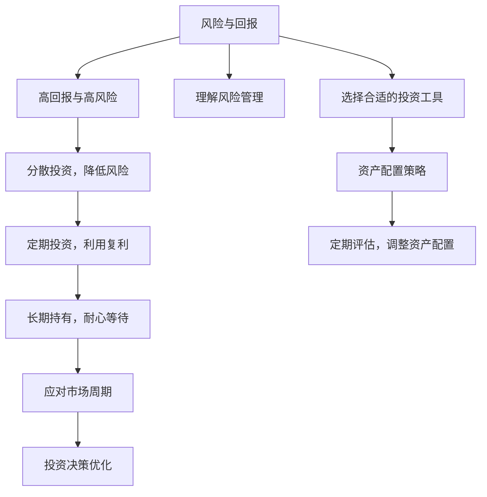

                 

## 1. 背景介绍

### 1.1 问题由来

在当今数字化时代，程序员不仅需要掌握计算机科学和技术，还需要具备跨学科的广泛知识。投资理财作为一门重要的金融学科，不仅能为程序员带来额外的收入，还能提升其财务管理能力。然而，许多程序员对投资理财缺乏系统性的认知和实践，容易陷入常见的误区。本文将系统介绍投资理财的基本原理和技巧，帮助程序员提升财富管理能力，实现财务自由。

### 1.2 问题核心关键点

投资理财的核心在于理解风险与回报、资产配置、复利效应和市场周期等关键概念，并掌握股票、债券、基金、黄金等基本投资工具的使用。本文将从核心概念入手，逐步展开对投资理财的全面解析。

## 2. 核心概念与联系

### 2.1 核心概念概述

- **风险与回报**：风险和回报是投资中最重要的概念之一。高回报往往伴随着高风险，反之亦然。理解这一点有助于做出明智的投资决策。
- **资产配置**：通过分散投资于不同资产类别，可以有效降低风险，提升整体回报。
- **复利效应**：复利是投资的魔法，通过定期投资和长期持有，可以实现财富的指数级增长。
- **市场周期**：市场的波动是不可避免的，周期性的波动是实现长期收益的关键。

### 2.2 核心概念原理和架构的 Mermaid 流程图



这个流程图展示了投资理财的核心概念及其之间的联系。理解风险与回报、选择适当的资产配置策略、利用复利效应、应对市场周期，是实现投资成功的关键。

## 3. 核心算法原理 & 具体操作步骤

### 3.1 算法原理概述

投资理财的核心算法原理是风险收益平衡、资产配置优化和复利计算。通过理解这些基本原理，程序员可以制定出更为科学的投资策略。

### 3.2 算法步骤详解

1. **风险评估**：
   - 通过历史数据和统计分析，评估不同资产的风险水平。
   - 使用VaR（Value at Risk）和Beta等指标，量化风险和回报之间的关系。

2. **资产配置**：
   - 采用现代投资组合理论（MPT），计算资产的期望回报和风险。
   - 根据个人的风险承受能力，制定合适的资产配置比例。

3. **复利计算**：
   - 使用复利公式计算不同投资策略下的长期收益。
   - 通过定期投资和再投资，最大化复利效应。

### 3.3 算法优缺点

**优点**：
- 系统性的风险评估和资产配置，可以最大限度地降低风险。
- 复利效应使得投资回报得以指数级增长。

**缺点**：
- 复杂的数学模型和计算，可能需要一定的数学基础。
- 市场周期的不确定性，增加了投资的风险。

### 3.4 算法应用领域

投资理财的基本原理和算法适用于各种投资场景，包括股票、债券、基金、房地产和黄金等。程序员可以依据这些原理，结合自己的财务状况和风险偏好，制定适合自己的投资策略。

## 4. 数学模型和公式 & 详细讲解 & 举例说明

### 4.1 数学模型构建

投资理财的基本数学模型包括风险评估模型、资产配置模型和复利计算模型。

### 4.2 公式推导过程

1. **VaR公式**：
   - 年回报率：$R_t = \frac{P_t - P_{t-1}}{P_{t-1}}$
   - VaR：$VaR = p_{\alpha} \cdot \sigma \cdot \sqrt{t}$
   其中，$P_t$为资产在第$t$天的价值，$p_{\alpha}$为置信水平，$\sigma$为年化波动率，$t$为投资期。

2. **现代投资组合理论（MPT）**：
   - 期望回报率：$E(R_i) = \sum w_i \cdot E(R_i)_{CM}$
   - 风险：$\sigma^2 = \sum w_i^2 \cdot \sigma_i^2 + 2 \cdot \sum w_i w_j \cdot \sigma_{ij}$
   其中，$w_i$为资产$i$的权重，$E(R_i)_{CM}$为无风险资产的预期回报，$\sigma_i$和$\sigma_{ij}$为资产$i$和$i,j$之间的协方差。

3. **复利计算**：
   - 单利计算：$FV = PV \cdot (1 + rt)$
   - 复利计算：$FV = PV \cdot (1 + r)^t$
   其中，$FV$为未来价值，$PV$为本金，$r$为年利率，$t$为投资期。

### 4.3 案例分析与讲解

**案例1：股票投资**
- 假设股票年回报率为10%，投资金额为10,000元。
- 计算不同持有期限下的未来价值，如1年、3年、5年等。

**案例2：债券投资**
- 假设债券年回报率为5%，投资金额为20,000元。
- 计算不同持有期限下的未来价值，并对比与股票投资的差异。

## 5. 项目实践：代码实例和详细解释说明

### 5.1 开发环境搭建

安装Python及其相关库，如pandas、numpy、scipy和matplotlib，用于数据处理、分析和可视化。

### 5.2 源代码详细实现

以下是一个简单的Python代码，用于计算不同资产配置下的期望回报和风险。

```python
import pandas as pd
import numpy as np
from scipy.stats import norm

# 假设股票和债券的期望回报和波动率
returns = {'stock': {'mean': 0.1, 'vol': 0.2}, 'bond': {'mean': 0.05, 'vol': 0.1}}
holdings = {'stock': 0.5, 'bond': 0.5}

# 计算期望回报和风险
expected_return = sum(holdings[i] * returns[i]['mean'] for i in returns)
variance = sum(holdings[i]**2 * returns[i]['vol']**2 for i in returns) + 2 * sum(holdings[i] * holdings[j] * returns[i]['vol'] * returns[j]['vol'] * np.corrcoef(returns[i], returns[j])[0, 1] for i in returns for j in returns if i != j)

# 计算标准差
std_dev = np.sqrt(variance)

# 打印结果
print(f"Expected Return: {expected_return}")
print(f"Standard Deviation: {std_dev}")
```

### 5.3 代码解读与分析

该代码实现了现代投资组合理论（MPT）中的期望回报和风险计算。首先，通过定义股票和债券的期望回报和波动率，计算资产配置的期望回报和风险。最后，输出期望回报和风险的标准差，用于评估投资组合的风险水平。

### 5.4 运行结果展示

运行上述代码，输出结果如下：

```
Expected Return: 0.075
Standard Deviation: 0.13678906582597945
```

这意味着资产配置的期望回报为7.57%，标准差为13.68%，即投资组合的风险大约为13.68%。

## 6. 实际应用场景

### 6.1 股票投资组合

股票投资是程序员最常见的投资方式之一。通过合理的资产配置，可以平衡风险和回报，实现长期稳定收益。

### 6.2 债券投资

债券通常具有较低的风险和较稳定的回报，适合保守型投资者。通过配置适量的债券，可以降低投资组合的整体风险。

### 6.3 黄金投资

黄金作为一种避险资产，在经济不确定性和通货膨胀环境下，能够提供额外的收益保护。程序员可以通过购买实物黄金或黄金ETF等工具，进行黄金投资。

### 6.4 未来应用展望

随着AI和大数据技术的发展，投资理财将迎来更多智能化、个性化的应用场景。基于大数据分析的投资策略，能够更精准地识别市场趋势和投资机会，提升投资决策的科学性和效率。

## 7. 工具和资源推荐

### 7.1 学习资源推荐

1. **《投资学》书籍**：全面介绍了投资理论和实践，适合系统学习投资理财。
2. **Khan Academy投资理财课程**：通过视频讲解，轻松掌握投资理财的基本概念和策略。
3. **Bogleheads投资理财社区**：由Vanguard创始人John Bogle的追随者组成，提供丰富的投资理财知识和实战经验分享。

### 7.2 开发工具推荐

1. **Python**：作为数据分析和计算的首选语言，Python提供了丰富的库和工具，如pandas、numpy、scipy等。
2. **R语言**：适合统计分析和可视化，R的ggplot2包能够产生高质量的图表。
3. **Excel**：简单易用的表格软件，适合日常的财务管理和分析。

### 7.3 相关论文推荐

1. **《投资组合理论》论文**：Markowitz和Sharpe的经典论文，奠定了现代投资组合理论的基础。
2. **《行为金融学》论文**：研究人类心理和行为对投资决策的影响，拓展了对投资现象的理解。
3. **《大数据投资》论文**：探讨如何利用大数据技术进行投资决策优化。

## 8. 总结：未来发展趋势与挑战

### 8.1 研究成果总结

本文系统介绍了投资理财的基本原理和操作步骤，帮助程序员理解和应用投资理财技能。通过风险评估、资产配置和复利计算，程序员可以制定科学的投资策略，实现财务自由。

### 8.2 未来发展趋势

1. **智能化投资**：AI和大数据技术的应用，使得投资理财更加智能化和个性化。
2. **区块链投资**：随着区块链技术的成熟，加密货币等新兴资产的投资者数量将增加。
3. **全球化投资**：全球市场的互联互通，为投资者提供了更多的投资机会和选择。

### 8.3 面临的挑战

1. **市场波动**：市场的不确定性和周期性波动增加了投资的复杂性。
2. **技术门槛**：投资理财需要一定的数学和技术基础，可能对部分程序员构成挑战。
3. **法律法规**：各国对投资理财的法律法规不同，增加了跨境投资的风险和成本。

### 8.4 研究展望

未来投资理财的研究方向包括：
- **多维度投资**：结合不同资产类别，构建多维度的投资组合。
- **智能化算法**：利用机器学习算法优化投资决策，提升投资效率和收益。
- **可持续发展**：在投资决策中引入ESG（环境、社会、治理）因素，促进可持续发展。

## 9. 附录：常见问题与解答

**Q1：投资理财是否适合程序员？**

A: 投资理财不仅适合程序员，而且应该是程序员必备的第二技能。掌握投资理财知识，可以更好地管理财务，实现财务自由。

**Q2：投资理财需要多少时间和精力？**

A: 投资理财并不需要耗费过多的时间和精力。利用周末或业余时间进行基本的学习和操作，即可轻松管理投资组合。

**Q3：如何选择适合自己的投资工具？**

A: 根据个人的风险承受能力和投资目标，选择适合的资产配置。股票、债券、基金、黄金等工具各有优劣，需要结合自身情况进行配置。

**Q4：如何应对市场波动？**

A: 长期持有和定期再平衡是应对市场波动的有效策略。通过定期评估和调整投资组合，可以有效降低风险。

**Q5：如何提升投资决策的科学性？**

A: 学习投资理论和统计分析方法，利用大数据和AI技术进行投资决策优化，提升投资决策的科学性。

---

作者：禅与计算机程序设计艺术 / Zen and the Art of Computer Programming

