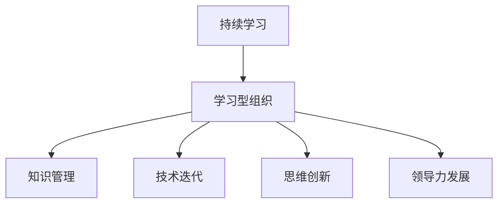

                 

# 持续学习对管理者的重要性

在当今快速变化的市场环境中，持续学习对于管理者的重要性不言而喻。面对不断涌现的新技术、新趋势和新挑战，管理者需要不断更新知识和技能，以适应不断变化的市场需求和环境。本文将深入探讨持续学习对管理者的重要性，分析其核心概念、算法原理及操作步骤，并结合实际应用场景，提供实践建议。

## 1. 背景介绍

### 1.1 问题由来

现代企业管理面临着诸多挑战，包括技术变革、市场竞争、法规合规等。这些变化要求管理者不断适应新环境，以保持企业的竞争力和可持续发展。然而，传统的高校教育往往无法完全覆盖这些新领域，管理者需要依靠持续学习来弥补这一差距。

### 1.2 问题核心关键点

持续学习的关键在于培养学习型组织，鼓励员工和管理者终身学习。这不仅有助于提升个人能力，还能增强组织的创新能力和适应能力。关键点包括：

1. **终身学习**：管理者应将学习视为职业生涯的一部分，持续更新知识和技能。
2. **知识管理**：建立知识分享和传播的机制，促进团队共同成长。
3. **技术迭代**：紧跟技术发展的步伐，掌握前沿技术和管理工具。
4. **思维创新**：培养创新思维，解决复杂问题，推动组织创新。
5. **领导力发展**：不断提升领导力，领导和激励团队向共同目标前进。

## 2. 核心概念与联系

### 2.1 核心概念概述

为更好地理解持续学习对管理者的重要性，本节将介绍几个密切相关的核心概念：

1. **持续学习**：指个人和组织在职业生涯中不断获取、整合、分享和应用知识的过程。持续学习强调终身学习和适应性。
2. **学习型组织**：指以学习为驱动力的组织，强调知识共享、创新和团队合作。
3. **知识管理**：指对组织内部知识进行识别、创造、整理、共享和应用的管理过程。
4. **技术迭代**：指快速适应和应用新技术，推动组织效率提升和创新。
5. **思维创新**：指培养创新思维，鼓励跨界合作和解决问题的新方法。
6. **领导力发展**：指通过不断学习和实践，提升领导力，引领团队前进。

这些核心概念之间的逻辑关系可以通过以下Mermaid流程图来展示：



这个流程图展示了一系列核心概念的逻辑关系：

1. 持续学习是管理者个人成长和组织发展的基石。
2. 学习型组织是持续学习的组织形式，强调知识共享和团队协作。
3. 知识管理是学习型组织的关键过程，确保知识得到有效传播和应用。
4. 技术迭代是推动学习型组织不断进步的动力，提升组织效率和竞争力。
5. 思维创新是学习型组织的创新引擎，培养解决问题的创新思维。
6. 领导力发展是学习型组织的领导核心，提升管理者引领团队的能力。

这些概念共同构成了持续学习对管理者的重要性框架，使其能够在复杂多变的环境中，有效应对挑战，推动组织创新和发展。

## 3. 核心算法原理 & 具体操作步骤

### 3.1 算法原理概述

持续学习的核心在于建立一种反馈机制，通过不断的学习、实践和反馈，促进个人和组织能力的提升。这一过程通常包括以下几个关键步骤：

1. **需求识别**：识别个人或组织的学习需求，明确学习目标。
2. **资源配置**：根据学习需求，配置相应的学习资源，如培训、书籍、网络课程等。
3. **学习实施**：通过线上或线下方式进行学习，获取新知识和技能。
4. **实践应用**：将所学知识应用于实际工作，验证和提升学习效果。
5. **反馈改进**：根据实践反馈，调整学习策略，优化学习效果。

### 3.2 算法步骤详解

以下是一个简化的持续学习操作步骤：

1. **需求分析**：
   - 定期进行自我评估和组织评估，识别知识和技能缺口。
   - 与团队成员和上级沟通，了解团队整体学习需求。

2. **资源获取**：
   - 选择合适的学习资源，如在线课程、书籍、培训等。
   - 制定学习计划，明确学习目标和进度安排。

3. **实施学习**：
   - 参与在线课程、参加研讨会、阅读专业书籍等，获取新知识。
   - 定期记录学习心得，整理学习笔记。

4. **实践应用**：
   - 将所学知识应用于实际工作，如项目管理、技术开发、市场分析等。
   - 通过实践验证学习效果，收集反馈。

5. **反馈改进**：
   - 根据实践反馈，调整学习策略，优化学习计划。
   - 定期评估学习效果，确保学习目标达成。

### 3.3 算法优缺点

持续学习的优点包括：

1. **适应性强**：能够迅速适应环境变化，提升个人和组织应对能力。
2. **创新驱动**：通过不断学习，激发新想法和创新解决方案。
3. **团队协作**：促进知识共享和团队合作，提高团队整体能力。
4. **提升领导力**：通过持续学习，提升领导者的决策力和执行力。

持续学习的缺点包括：

1. **时间成本**：学习过程可能需要大量时间和精力，对管理者的工作负担较大。
2. **资源投入**：学习资源的选择和配置需要一定的投入，可能存在资源浪费的风险。
3. **效果不均**：不同学习者的吸收能力和应用效果可能存在差异。
4. **动力不足**：持续学习的动力和坚持度可能受外界干扰和内外部压力影响。

### 3.4 算法应用领域

持续学习的应用领域广泛，包括但不限于以下方面：

1. **企业管理**：管理者通过持续学习，提升企业战略规划、团队管理、市场分析等能力。
2. **技术开发**：工程师通过持续学习，掌握新技术和新工具，提升技术研发效率。
3. **市场营销**：市场人员通过持续学习，了解市场趋势和客户需求，提升营销策略。
4. **人力资源**：人力资源管理者通过持续学习，优化人才招聘、培训和绩效管理。
5. **客户服务**：服务人员通过持续学习，提升服务质量，增强客户满意度。

## 4. 数学模型和公式 & 详细讲解 & 举例说明

### 4.1 数学模型构建

持续学习的数学模型可以抽象为一个反馈系统，其中输入为需求识别和学习资源，输出为学习效果和反馈。设 $D$ 为需求识别，$R$ 为学习资源，$L$ 为学习实施，$A$ 为实践应用，$F$ 为反馈改进。则数学模型为：

$$
L = F(D, R) \\
A = L + F \\
F' = A + F
$$

其中 $F'$ 表示新反馈，$D'$ 表示新需求，$R'$ 表示新学习资源。

### 4.2 公式推导过程

假设 $D = d_0 + \delta t d$，$R = r_0 + \delta t r$，$L = l_0 + \delta t l$，$A = a_0 + \delta t a$，$F = f_0 + \delta t f$。其中 $d_0, r_0, l_0, a_0, f_0$ 为初始状态，$\delta t$ 为时间间隔，$\delta$ 为学习效率。则有：

$$
L = f_0 + \delta t f(d, r) \\
A = l_0 + \delta t l(L, F) \\
F' = a_0 + \delta t f(A, F)
$$

### 4.3 案例分析与讲解

以项目管理为例，管理者通过持续学习提升项目管理能力。

1. **需求识别**：识别项目管理中的知识缺口，如敏捷开发、项目管理工具等。
2. **资源获取**：选择相应的在线课程、书籍和培训。
3. **实施学习**：参加培训、阅读书籍，掌握敏捷开发和项目管理工具。
4. **实践应用**：应用敏捷开发和项目管理工具，提高项目管理效率。
5. **反馈改进**：根据实践反馈，调整学习策略，优化项目管理方法。

## 5. 项目实践：代码实例和详细解释说明

### 5.1 开发环境搭建

在开发环境搭建方面，以下是一个示例：

1. **安装Python环境**：
   ```bash
   conda create -n learning-env python=3.8
   conda activate learning-env
   ```

2. **安装相关库**：
   ```bash
   pip install numpy pandas matplotlib jupyter notebook
   ```

3. **创建Jupyter Notebook环境**：
   ```bash
   jupyter notebook
   ```

### 5.2 源代码详细实现

以下是一个持续学习的Python代码示例：

```python
import pandas as pd
import matplotlib.pyplot as plt

# 需求识别和资源获取
def analyze_learning_needs(data):
    # 分析需求识别和学习资源的数据
    return demand, resources

# 实施学习
def implement_learning(demand, resources):
    # 根据需求和学习资源实施学习
    return learned

# 实践应用
def apply_learning(learned):
    # 将学习应用于实际工作
    return applied_learning

# 反馈改进
def improve_feedback(applied_learning):
    # 根据实践反馈，改进学习策略
    return improved_feedback

# 数据处理和分析
data = pd.read_csv('learning_data.csv')

demand, resources = analyze_learning_needs(data)
learned = implement_learning(demand, resources)
applied_learning = apply_learning(learned)
improved_feedback = improve_feedback(applied_learning)

# 绘制学习效果图表
plt.plot(improved_feedback, label='Feedback Improvement')
plt.xlabel('Time')
plt.ylabel('Feedback Improvement')
plt.title('Feedback Improvement Over Time')
plt.legend()
plt.show()
```

### 5.3 代码解读与分析

在这个示例中，代码通过Pandas和Matplotlib库，对持续学习的效果进行数据处理和可视化展示。

**分析需求识别和学习资源**：
- `analyze_learning_needs`函数根据历史数据，分析需求识别和学习资源的数据。
- 返回需求和资源的数据集，用于后续的实施学习。

**实施学习**：
- `implement_learning`函数根据需求和学习资源，实施学习，获取学习效果。
- 返回学习效果的数据集，用于后续的实践应用。

**实践应用**：
- `apply_learning`函数将学习效果应用于实际工作，获取实践应用的数据集。
- 返回实践应用的数据集，用于后续的反馈改进。

**反馈改进**：
- `improve_feedback`函数根据实践应用的数据集，改进学习策略，获取反馈改进的数据集。
- 返回反馈改进的数据集，用于后续的持续学习。

### 5.4 运行结果展示

通过上述代码，可以生成一个图表，展示持续学习过程中反馈改进的趋势。

## 6. 实际应用场景

### 6.1 智能制造

在智能制造领域，持续学习帮助管理者提升生产效率和质量。通过不断学习新技术和新方法，管理者可以掌握自动化和智能化生产流程，提高生产线的灵活性和响应速度。例如，通过学习机器学习算法，优化生产调度和资源分配，减少生产浪费。

### 6.2 金融服务

在金融服务领域，持续学习帮助管理者掌握最新的金融科技发展趋势。通过学习区块链、人工智能和大数据分析技术，管理者可以优化金融产品和服务的创新，提高客户体验和市场竞争力。例如，通过学习量化投资策略，提升交易策略的有效性和盈利能力。

### 6.3 医疗健康

在医疗健康领域，持续学习帮助管理者提升医疗服务质量和效率。通过学习最新的医疗技术和健康管理方法，管理者可以优化医疗流程和资源配置，提高医疗服务水平和患者满意度。例如，通过学习电子健康记录系统，提升数据管理和分析能力，支持个性化医疗服务。

### 6.4 未来应用展望

未来，持续学习将在更多领域得到应用，为组织创新和发展提供新的动力。

1. **人工智能**：管理者通过学习AI技术，推动企业智能化转型，提升运营效率和创新能力。
2. **大数据**：通过学习大数据分析技术，管理者可以挖掘数据价值，优化决策和运营策略。
3. **区块链**：通过学习区块链技术，管理者可以提高数据安全和透明性，优化供应链和金融服务。
4. **可持续发展**：通过学习可持续发展相关知识，管理者可以推动企业绿色转型，实现环保和社会责任。

## 7. 工具和资源推荐

### 7.1 学习资源推荐

为了帮助管理者系统掌握持续学习的理论基础和实践技巧，这里推荐一些优质的学习资源：

1. **在线课程平台**：如Coursera、edX、Udacity等，提供丰富的在线课程，涵盖企业管理、技术开发、市场营销等多个领域。
2. **专业书籍**：如《学习型组织》、《敏捷项目管理》、《数据驱动决策》等，深入讲解持续学习的理论和实践。
3. **行业协会和组织**：如项目管理协会(PMI)、国际金融管理师(CFA)、国际管理发展协会(IMD)等，提供行业最新的资讯和培训机会。
4. **在线社区**：如LinkedIn、Slack等，提供知识分享和交流平台，连接全球的行业专家和管理者。
5. **专业博客和文章**：如哈佛商业评论、MIT斯隆管理评论等，提供最新的商业和管理前沿资讯。

通过对这些资源的学习实践，管理者可以全面掌握持续学习的理论和方法，提升自身能力和组织竞争力。

### 7.2 开发工具推荐

高效的持续学习开发离不开优秀的工具支持。以下是几款用于持续学习开发的常用工具：

1. **学习管理系统(LMS)**：如Moodle、Canvas、Blackboard等，提供在线课程管理和学习跟踪功能。
2. **项目管理工具**：如Trello、Jira、Asana等，帮助管理者规划和执行学习计划。
3. **数据分析工具**：如Tableau、Power BI、Google Data Studio等，提供数据可视化和分析功能。
4. **协作平台**：如Slack、Microsoft Teams、Zoom等，支持知识分享和团队协作。
5. **编程语言和库**：如Python、R、Pandas、NumPy等，提供数据处理和分析功能。

合理利用这些工具，可以显著提升持续学习开发的效率，加速知识传播和应用。

### 7.3 相关论文推荐

持续学习作为人工智能领域的前沿课题，相关的研究论文也在不断涌现。以下是几篇奠基性的相关论文，推荐阅读：

1. **《终身学习：提升组织适应性的策略》**：作者：Fiedler, C. P., & Felten, D. (1993). 探讨终身学习对组织适应性的影响。
2. **《敏捷项目管理：提高项目管理效率的方法》**：作者：Park, Y. (2005). 介绍敏捷项目管理的基本原理和实践方法。
3. **《数据驱动决策：利用数据进行科学管理》**：作者：Porter, M. E., & Kramer, M. R. (2011). 强调数据在决策中的重要性。
4. **《人工智能在企业管理中的应用》**：作者：Mitroff, I. I., & Everitt, M. (2014). 讨论人工智能技术在企业管理中的应用。
5. **《区块链技术在供应链中的应用》**：作者：Nakamoto, S. (2008). 提出区块链技术的基本原理和应用场景。

这些论文代表了大数据和人工智能领域的发展脉络。通过学习这些前沿成果，管理者可以更好地把握持续学习的方向，推动组织创新和变革。

## 8. 总结：未来发展趋势与挑战

### 8.1 总结

本文对持续学习对管理者的重要性进行了全面系统的介绍。首先阐述了持续学习在企业管理中的必要性，明确了持续学习的核心概念和关键步骤。其次，从算法原理到操作步骤，详细讲解了持续学习的数学模型和操作步骤。最后，结合实际应用场景，提供了持续学习的实践建议和工具资源。

通过本文的系统梳理，管理者可以清晰理解持续学习的价值和实现路径，在不断变化的市场环境中，保持竞争力，推动组织持续发展。

### 8.2 未来发展趋势

展望未来，持续学习的趋势将呈现以下几个方向：

1. **技术融合**：持续学习将与人工智能、大数据、区块链等前沿技术深度融合，推动组织创新和变革。
2. **跨界应用**：持续学习将广泛应用于多个行业，如医疗、金融、制造等，提升组织整体的创新能力和竞争力。
3. **全球化**：持续学习将突破地域限制，通过全球知识共享和协作，提升组织的全球化能力。
4. **个性化**：持续学习将根据个人需求和职业发展路径，提供个性化的学习计划和资源。
5. **智能化**：持续学习将引入AI技术，通过智能推荐和学习分析，提升学习效果和效率。

这些趋势凸显了持续学习的重要性和发展潜力，将为组织带来更广阔的创新空间和应用前景。

### 8.3 面临的挑战

尽管持续学习在企业管理中具有重要意义，但仍然面临诸多挑战：

1. **资源投入**：持续学习需要投入大量时间和资源，可能对组织运营造成一定的负担。
2. **效果评估**：持续学习的成效难以量化和评估，可能存在效果不均的问题。
3. **文化变革**：推动组织文化变革，鼓励持续学习和知识共享，需要时间和耐心。
4. **技术门槛**：持续学习涉及多种技术和工具，对管理者的技术能力和资源配置提出了较高要求。
5. **数据安全**：在数据驱动的持续学习过程中，数据安全和隐私保护成为重要挑战。

### 8.4 研究展望

为了克服这些挑战，未来的研究需要在以下几个方面寻求新的突破：

1. **资源优化**：通过优化资源配置和利用，降低持续学习的成本和负担。
2. **效果评估**：开发新的评估方法和工具，量化和评估持续学习的成效。
3. **文化建设**：通过企业文化建设，鼓励持续学习和知识共享，营造良好的学习氛围。
4. **技术普及**：降低技术门槛，提供简单易用的工具和资源，支持持续学习的普及和应用。
5. **数据保护**：加强数据安全和隐私保护，确保数据在持续学习过程中的安全性和可靠性。

这些研究方向的探索，必将引领持续学习技术迈向更高的台阶，为管理者和组织带来更多的创新和发展机会。

## 9. 附录：常见问题与解答

**Q1：持续学习是否适用于所有管理者？**

A: 持续学习对所有管理者都具有重要意义，尤其在高变化和高竞争的领域。对于需要快速适应新技术和市场变化的管理者，持续学习是提升自身能力和组织竞争力的重要手段。

**Q2：如何平衡持续学习和日常工作？**

A: 管理者可以通过时间管理和优先级排序，合理分配时间和资源。可以设置固定的学习时间，利用碎片时间进行学习。同时，利用在线课程和远程学习，灵活安排学习计划。

**Q3：持续学习的效果如何衡量？**

A: 持续学习的效果可以通过学习进度、知识掌握程度、实践应用效果等方面进行衡量。可以通过在线测验、项目评估、团队反馈等方式，综合评估学习成效。

**Q4：持续学习如何与企业战略结合？**

A: 管理者可以通过定期评估企业战略和市场环境，识别需要持续学习的关键领域。将持续学习与企业战略结合，推动组织的持续创新和转型。

**Q5：持续学习需要投入哪些资源？**

A: 持续学习需要投入时间、资金、技术等多种资源。管理者可以与企业内外部合作伙伴协作，共享资源，降低投入成本。同时，利用在线资源和公共平台，降低学习成本。

---

作者：禅与计算机程序设计艺术 / Zen and the Art of Computer Programming

