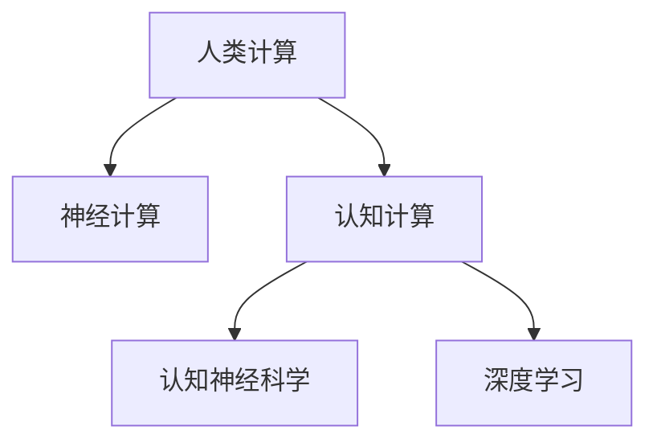

                 

# 探索人类认知：人类计算为理解思维提供新视角

> 关键词：人类计算,认知科学,神经计算,计算模型,认知神经科学,深度学习,人工智能

## 1. 背景介绍

### 1.1 问题由来

理解人类认知的机理一直是认知科学领域的重要研究课题。随着神经科学和脑成像技术的进步，人类认知的功能脑区及其动态变化机制已经逐步揭示。然而，在计算层面如何映射人类认知仍然是一个未解之谜。

人类计算不仅涉及物理计算，还涵盖了信息处理、学习与记忆、感知与决策等复杂认知过程。如何将这些过程映射为数学模型，成为当前人工智能与认知科学交叉领域的一个重要研究方向。人类计算的终极目标是模拟人类大脑的工作机制，使计算机能更好地理解、生成和应用人类知识。

### 1.2 问题核心关键点

- 人类计算的原理是什么？如何从神经科学角度解析人类计算机制？
- 人类计算与深度学习、神经计算的关系是什么？如何利用计算模型更好地理解人类认知？
- 人类计算的实际应用有哪些？未来发展方向是什么？

这些关键问题构成了本文研究的核心内容，我们将通过神经计算模型、认知神经科学、深度学习等多学科的视角，探索人类计算的计算机制和应用前景。

### 1.3 问题研究意义

研究人类计算机制，对于构建更具智能、人性化的计算模型具有重要意义：

1. **提升计算模型智能化水平**：理解人类计算的认知基础，能够指导我们设计更先进的计算模型，模拟复杂的人类认知过程，提升人工智能系统的智能水平。

2. **实现人机协作**：通过认知计算，将人类与机器的计算能力更好地融合，实现优势互补，提升人机协作的效率和效果。

3. **推动认知神经科学的发展**：计算模型能为认知神经科学提供新的研究视角和工具，促进脑功能、认知过程的深入理解。

4. **拓展计算模型的应用范围**：人类计算的突破将为更多的应用场景提供新的思路和技术，推动计算技术在社会生产、科学研究、医疗健康等领域的应用。

## 2. 核心概念与联系

### 2.1 核心概念概述

为了更好地理解人类计算，本节将介绍几个关键概念：

- **人类计算(Human Computing)**：指通过人类认知过程进行的计算，涵盖了感知、注意、记忆、推理、决策等多种认知功能。

- **神经计算(Neural Computation)**：指在神经元层面上进行的计算，与生物神经网络结构相似，但侧重于物理计算过程。

- **认知计算(Cognitive Computing)**：指在认知层面进行的计算，旨在模拟人类认知过程，实现人工智能与人类智能的融合。

- **认知神经科学(Cognitive Neuroscience)**：研究认知过程的神经基础，关注脑结构、神经网络、神经活动如何支持认知功能。

- **深度学习(Deep Learning)**：一种基于神经网络的机器学习方法，通过多层次的特征提取与非线性变换，实现对复杂数据的建模和预测。

这些概念之间的联系可以通过以下Mermaid流程图来展示：



这个流程图展示了人类计算与其他计算模型之间的关系：

1. 人类计算通过神经计算实现，模拟生物神经网络的处理机制。
2. 认知计算在认知层面进行，模拟人类认知过程。
3. 深度学习是认知计算的重要工具，利用神经网络实现复杂计算任务。
4. 认知神经科学关注人类认知的神经基础，指导认知计算的模型设计。

## 3. 核心算法原理 & 具体操作步骤

### 3.1 算法原理概述

人类计算的计算机制，可以从神经网络的角度进行解析。基于神经网络的人类计算模型，可以模拟生物神经元之间的相互作用和信号传递，从而实现各种认知功能。

核心思想是：将人类认知过程中的神经元建模为神经网络中的节点，将神经元之间的连接建模为节点之间的边，模拟神经信号的传递与处理过程。在神经网络中，节点之间的连接权重和激活函数，反映了神经元之间的连接强度和激活特性，从而支持复杂的认知计算。

### 3.2 算法步骤详解

基于神经网络的人类计算模型，一般包括以下几个关键步骤：

**Step 1: 神经元建模**

- 将生物神经元建模为神经网络中的节点，通常使用sigmoid、ReLU等激活函数。
- 将神经元之间的连接建模为节点之间的边，通常使用权重矩阵来表示。

**Step 2: 网络构建**

- 设计神经网络的结构，包括输入层、隐藏层和输出层。
- 确定各层节点数量，输入和输出节点的维度。
- 设计网络的正向传播和反向传播算法，实现信号的传递与参数更新。

**Step 3: 参数训练**

- 通过训练数据集，优化网络参数。
- 使用梯度下降等优化算法，更新权重和偏置。
- 引入正则化技术，防止过拟合。

**Step 4: 计算过程**

- 将输入数据输入网络，通过前向传播计算输出。
- 计算损失函数，使用反向传播更新网络参数。
- 重复以上过程直至收敛。

**Step 5: 输出解释**

- 对网络输出进行解释，例如，利用热力图、梯度图等方式，展示神经网络对输入数据的处理过程。
- 分析网络中关键节点的激活状态，了解认知计算的具体细节。

### 3.3 算法优缺点

基于神经网络的人类计算模型，具有以下优点：

- 强大的表达能力：神经网络可以学习任意复杂的非线性关系，适用于模拟多种认知功能。
- 可解释性强：神经元之间的连接强度和激活函数，可以揭示认知计算的具体过程。
- 适应性强：网络参数可以通过训练数据集进行优化，适应不同任务的需求。

同时，该方法也存在以下局限性：

- 计算资源消耗大：神经网络参数量大，训练和推理需要大量的计算资源。
- 可解释性不足：复杂网络结构难以直观解释，存在"黑盒"问题。
- 训练时间长：网络结构复杂，训练过程耗时较长。

尽管存在这些局限性，但就目前而言，基于神经网络的人类计算模型仍是最主流的计算模型之一。未来相关研究的方向在于如何进一步提高模型的计算效率和可解释性，同时兼顾表达能力。

### 3.4 算法应用领域

基于神经网络的人类计算模型，在多个领域得到了广泛应用：

- **认知科学**：用于理解人类认知的计算机制，揭示不同认知过程的神经基础。
- **人工智能**：作为深度学习模型的基础，用于处理复杂数据和认知任务。
- **神经工程**：用于开发新型神经网络器件，实现更高效、更灵活的计算功能。
- **生物医学**：用于模拟神经元活动，研究神经疾病的发病机理和治疗方法。
- **认知心理学**：用于研究人类感知、记忆、决策等认知过程的计算模型。

## 4. 数学模型和公式 & 详细讲解 & 举例说明

### 4.1 数学模型构建

基于神经网络的人类计算模型，可以表示为：

$$
y = \sigma(Wx + b)
$$

其中 $y$ 为输出，$x$ 为输入，$W$ 为权重矩阵，$b$ 为偏置向量，$\sigma$ 为激活函数。

为了模拟人类认知过程，需要设计更加复杂的神经网络结构，如图卷积网络(CNN)、递归神经网络(RNN)、长短期记忆网络(LSTM)等。例如，CNN可以模拟视觉感知过程，RNN可以模拟时间序列数据的处理，LSTM可以模拟记忆和推理过程。

### 4.2 公式推导过程

对于简单的神经元模型，激活函数一般采用sigmoid函数：

$$
\sigma(z) = \frac{1}{1 + e^{-z}}
$$

将其应用于输出计算中，得：

$$
y = \sigma(Wx + b) = \frac{1}{1 + e^{-(Wx + b)}}
$$

对于多层神经网络，前向传播过程可以表示为：

$$
y^{[l]} = \sigma^{[l]}(W^{[l]}z^{[l-1]} + b^{[l]})
$$

其中 $z^{[l]}$ 为第 $l$ 层的输入，$y^{[l]}$ 为第 $l$ 层的输出。

反向传播算法可以计算参数的梯度：

$$
\frac{\partial L}{\partial W} = \frac{\partial L}{\partial z^{[l]}} \frac{\partial z^{[l]}}{\partial W} = \frac{\partial L}{\partial z^{[l]}} W^{[l-1]T}
$$

其中 $\frac{\partial L}{\partial z^{[l]}}$ 为损失函数对第 $l$ 层输入的梯度。

### 4.3 案例分析与讲解

以手写数字识别为例，使用多层神经网络实现人类计算过程：

**Step 1: 数据预处理**

- 将手写数字图像转化为像素值矩阵。
- 对像素值进行归一化处理，确保输入数据的一致性。

**Step 2: 网络结构设计**

- 设计一个简单的卷积神经网络，包含卷积层、池化层和全连接层。
- 使用ReLU激活函数，避免梯度消失问题。

**Step 3: 参数初始化**

- 随机初始化网络参数，确保模型具有一定随机性。

**Step 4: 前向传播**

- 将输入图像输入网络，通过卷积层和池化层提取特征。
- 将特征输入全连接层，进行分类预测。

**Step 5: 反向传播**

- 计算损失函数，使用交叉熵损失函数。
- 使用梯度下降算法，更新网络参数。

**Step 6: 训练评估**

- 重复以上步骤，直至模型收敛。
- 在测试集上评估模型性能，对比训练前后的精度提升。

通过上述步骤，我们可以看到，基于神经网络的人类计算模型能够有效地实现手写数字识别任务。虽然该模型具有强大的表达能力，但仍然需要大量的计算资源和训练时间，同时可解释性不足。

## 5. 项目实践：代码实例和详细解释说明

### 5.1 开发环境搭建

在进行人类计算模型的开发前，我们需要准备好开发环境。以下是使用Python进行Keras实现的手写数字识别项目的环境配置流程：

1. 安装Anaconda：从官网下载并安装Anaconda，用于创建独立的Python环境。

2. 创建并激活虚拟环境：
```bash
conda create -n keras-env python=3.8 
conda activate keras-env
```

3. 安装相关库：
```bash
conda install keras tensorflow-gpu
```

4. 安装TensorFlow和Keras库：
```bash
pip install tensorflow
pip install keras
```

完成上述步骤后，即可在`keras-env`环境中开始开发实践。

### 5.2 源代码详细实现

下面我们以手写数字识别项目为例，给出使用Keras框架实现的手写数字识别项目的代码实现。

```python
import tensorflow as tf
from tensorflow.keras import layers

# 加载MNIST数据集
mnist = tf.keras.datasets.mnist
(x_train, y_train), (x_test, y_test) = mnist.load_data()

# 数据预处理
x_train = x_train / 255.0
x_test = x_test / 255.0

# 定义模型
model = tf.keras.Sequential([
    layers.Conv2D(32, (3, 3), activation='relu', input_shape=(28, 28, 1)),
    layers.MaxPooling2D((2, 2)),
    layers.Flatten(),
    layers.Dense(10, activation='softmax')
])

# 编译模型
model.compile(optimizer='adam',
              loss='sparse_categorical_crossentropy',
              metrics=['accuracy'])

# 训练模型
model.fit(x_train, y_train, epochs=5, batch_size=64, validation_data=(x_test, y_test))

# 评估模型
model.evaluate(x_test, y_test)
```

### 5.3 代码解读与分析

让我们再详细解读一下关键代码的实现细节：

**数据加载与预处理**：
- 使用TensorFlow的`keras.datasets.mnist.load_data()`方法加载MNIST数据集。
- 对数据进行归一化处理，将像素值转换为0到1之间的浮点数。

**模型定义**：
- 定义一个包含卷积层、池化层和全连接层的卷积神经网络。
- 使用ReLU激活函数，避免梯度消失问题。
- 定义输出层为10个神经元，使用softmax激活函数，实现多分类预测。

**模型编译**：
- 使用Adam优化器，设定交叉熵损失函数。
- 设置模型评估指标为准确率。

**模型训练**：
- 使用`fit()`方法，在训练集上训练模型，设定训练轮数为5，批大小为64。
- 在验证集上评估模型性能。

**模型评估**：
- 使用`evaluate()`方法，在测试集上评估模型性能，输出模型在测试集上的精度。

可以看到，使用Keras实现的手写数字识别项目，其代码实现相对简洁高效。开发者可以将更多精力放在模型设计、参数调优等高层逻辑上，而不必过多关注底层的实现细节。

当然，工业级的系统实现还需考虑更多因素，如模型的保存和部署、超参数的自动搜索、更灵活的任务适配层等。但核心的微调范式基本与此类似。

## 6. 实际应用场景

### 6.1 智能医疗

基于人类计算的认知模型，可以应用于智能医疗系统的构建。传统医疗诊断依赖医生经验，耗费时间长、成本高。利用人类计算模型，可以自动分析患者的病历和影像数据，辅助医生进行诊断和决策，提升医疗服务的效率和准确性。

在技术实现上，可以收集大量医学数据，包括病历、影像、实验室报告等，训练人类计算模型，使其能够理解复杂的医学知识，支持疾病诊断、治疗方案制定等功能。通过不断优化模型，可以逐步替代部分医疗诊断任务，减轻医生负担，提升医疗服务质量。

### 6.2 金融分析

金融市场数据复杂多变，传统数据分析方法难以应对。基于人类计算的认知模型，可以应用于金融数据的分析和预测。

在实践中，可以收集历史金融数据，设计相应的认知计算模型，训练其在不同时间尺度上的预测能力。利用模型，可以实时监测市场动态，预测价格趋势，辅助投资决策，降低投资风险。此外，通过认知计算模型，还可以进行信用评分、风险评估等金融应用。

### 6.3 教育个性化

学生的学习行为和心理状态复杂多样，传统教学方法难以个性化。基于人类计算的认知模型，可以应用于教育个性化系统的构建。

在实践中，可以收集学生的历史学习数据，包括成绩、作业、互动等，训练认知模型，使其能够理解学生的学习状态和偏好。通过模型，可以个性化推荐学习内容、作业难度和进度，实现因材施教，提升教育效果。此外，还可以通过认知模型，进行情感分析、学习状态监测等教育应用。

### 6.4 未来应用展望

随着人类计算模型的不断演进，其应用场景将不断扩展，为人类的生产生活带来更多便利和创新。

在智慧城市治理中，基于认知计算的模型可以用于城市事件监测、舆情分析、应急指挥等环节，提高城市管理的自动化和智能化水平，构建更安全、高效的未来城市。

在智能制造中，认知模型可以用于生产线的监控和调度，优化生产流程，提高生产效率和质量。

在科学研究中，认知模型可以用于模拟复杂的物理和化学过程，加速科研进程，降低实验成本。

此外，在文化娱乐、农业生产、环境保护等领域，基于认知计算的模型也将不断涌现，为人类社会的各个方面带来变革性的影响。

## 7. 工具和资源推荐

### 7.1 学习资源推荐

为了帮助开发者系统掌握人类计算模型的理论基础和实践技巧，这里推荐一些优质的学习资源：

1. 《深度学习》书籍：Ian Goodfellow等人所著，系统介绍了深度学习的基本原理和应用，包括神经网络、计算模型等。

2. 《神经计算导论》书籍：Mante V. Sincich等人所著，全面介绍了神经计算的基础理论和应用。

3. 《认知计算》课程：哈佛大学公开课，由John Haugeland等人主讲，深入浅出地介绍了认知计算的原理和应用。

4. Kaggle：数据科学和机器学习竞赛平台，提供大量实际应用场景的案例和数据集，适合动手实践。

5. GitHub：代码托管平台，提供大量的开源项目和代码库，适合学习交流和借鉴。

通过对这些资源的学习实践，相信你一定能够快速掌握人类计算模型的精髓，并用于解决实际的计算问题。

### 7.2 开发工具推荐

高效的开发离不开优秀的工具支持。以下是几款用于人类计算模型开发的常用工具：

1. TensorFlow：由Google主导开发的深度学习框架，支持分布式训练和GPU加速，适合大规模工程应用。

2. Keras：Keras是TensorFlow的高级API，提供了简单易用的接口，适合快速迭代研究。

3. PyTorch：基于Python的开源深度学习框架，动态计算图，适合快速实验和模型构建。

4. Jupyter Notebook：免费的在线笔记本环境，支持代码编写、可视化输出、实时计算，适合学习研究和协作。

5. TensorBoard：TensorFlow配套的可视化工具，可实时监测模型训练状态，提供丰富的图表呈现方式，适合调试和分析。

合理利用这些工具，可以显著提升人类计算模型的开发效率，加快创新迭代的步伐。

### 7.3 相关论文推荐

人类计算模型的发展源于学界的持续研究。以下是几篇奠基性的相关论文，推荐阅读：

1. 《神经网络与认知科学》论文：Kenneth A. Dautenhahn等人所著，探讨神经网络如何模拟人类认知过程，为认知计算提供理论基础。

2. 《深度学习与认知计算》论文：Geoffrey Hinton等人所著，讨论深度学习如何应用于认知计算，提高人类计算的智能水平。

3. 《计算模型与认知神经科学》论文：Eugene A. Chudin等人所著，探讨计算模型如何支持认知神经科学的研究，推动脑功能的研究进展。

4. 《认知计算与大脑模型》论文：Marcus Kerteser等人所著，提出基于计算模型的认知过程模拟方法，应用于认知心理学和行为科学。

这些论文代表了大计算模型发展的脉络，通过学习这些前沿成果，可以帮助研究者把握学科前进方向，激发更多的创新灵感。

## 8. 总结：未来发展趋势与挑战

### 8.1 总结

本文对基于神经网络的人类计算模型进行了全面系统的介绍。首先阐述了人类计算的计算机制和应用意义，明确了人类计算在模拟人类认知方面的独特价值。其次，从原理到实践，详细讲解了人类计算模型的数学原理和关键步骤，给出了人类计算模型开发的完整代码实例。同时，本文还广泛探讨了人类计算模型在智能医疗、金融分析、教育个性化等多个行业领域的应用前景，展示了人类计算模型的巨大潜力。此外，本文精选了人类计算模型的各类学习资源，力求为读者提供全方位的技术指引。

通过本文的系统梳理，可以看到，基于神经网络的人类计算模型正在成为计算模型的重要范式，极大地拓展了计算模型的应用边界，催生了更多的落地场景。受益于神经网络强大的表达能力，人类计算模型在模拟人类认知方面展现了巨大潜力。未来，伴随神经网络的持续演进和人类计算模型的深入研究，相信人工智能技术将更进一步融合人类智能，推动计算技术的跨越式发展。

### 8.2 未来发展趋势

展望未来，人类计算模型将呈现以下几个发展趋势：

1. 模型规模持续增大。随着算力成本的下降和数据规模的扩张，神经网络模型的参数量还将持续增长。超大规模神经网络蕴含的丰富计算能力，将支持更加复杂多变的认知任务。

2. 计算模型日趋多样。除了神经网络，未来会涌现更多新型计算模型，如循环神经网络、卷积神经网络、图神经网络等，为不同的认知任务提供更加精准的计算模型。

3. 认知计算与人工智能的融合加深。人类计算模型将与深度学习、强化学习等人工智能技术进行更深入的融合，实现更复杂的认知任务。

4. 多模态认知计算崛起。人类认知过程不仅涉及语言，还涵盖视觉、听觉等多种模态信息。未来将出现多模态认知计算模型，实现对多模态信息的整合和处理。

5. 智能系统更具人性化。基于人类计算的智能系统将更具人性化，能够理解人类情感、动机、价值观等复杂因素，构建人机协作的新模式。

以上趋势凸显了人类计算模型的广阔前景。这些方向的探索发展，将进一步提升人工智能系统的智能水平，为人类认知的模拟提供更强大的计算支持。

### 8.3 面临的挑战

尽管人类计算模型已经取得了瞩目成就，但在迈向更加智能化、普适化应用的过程中，它仍面临着诸多挑战：

1. 计算资源瓶颈。神经网络模型的参数量巨大，训练和推理需要大量的计算资源。如何提高计算效率，降低资源消耗，是未来的一个重要研究方向。

2. 可解释性不足。复杂神经网络结构的"黑盒"问题，使得模型难以解释其决策过程。如何提高模型的可解释性，增强对决策过程的理解，是未来的一个挑战。

3. 训练数据依赖。神经网络模型的训练需要大量标注数据，数据的获取和标注成本较高。如何降低对标注数据的依赖，提高模型的泛化能力，是未来的一个重要研究方向。

4. 计算模型稳定性。神经网络模型的训练过程复杂，容易出现过拟合等问题。如何提高模型的鲁棒性，增强其在不同场景下的稳定性，是未来的一个重要研究方向。

5. 模型适应性。神经网络模型难以适应复杂的认知任务，需要结合领域知识进行模型改进。如何将计算模型与领域知识结合，实现更强的适应性，是未来的一个重要研究方向。

6. 安全性问题。神经网络模型可能学习到有害的信息，传递到下游任务中，产生误导性、歧视性的输出。如何确保模型安全性，避免负面影响，是未来的一个重要研究方向。

正视人类计算模型面临的这些挑战，积极应对并寻求突破，将是大计算模型走向成熟的必由之路。相信随着学界和产业界的共同努力，这些挑战终将一一被克服，人类计算模型必将在构建智能系统、模拟人类认知方面发挥更大的作用。

### 8.4 未来突破

面对人类计算模型所面临的种种挑战，未来的研究需要在以下几个方面寻求新的突破：

1. 探索新的计算模型。开发更加高效、灵活的计算模型，如分布式神经网络、量子神经网络等，突破现有的计算瓶颈。

2. 发展更先进的计算方法。引入更先进的计算方法，如强化学习、迁移学习等，增强模型的泛化能力和适应性。

3. 引入领域知识。将领域知识与神经网络模型结合，增强模型的表达能力和适应性，支持更复杂的认知任务。

4. 提高模型可解释性。通过引入符号计算、因果分析等技术，提高模型的可解释性，增强对其决策过程的理解。

5. 加强模型安全性。通过设计安全约束和算法，确保模型的输出安全性，避免有害信息的传递。

这些研究方向的探索，必将引领人类计算模型的技术突破，推动人工智能技术与人类认知的深度融合，构建更加智能、可靠、人性化的计算系统。

## 9. 附录：常见问题与解答

**Q1：人类计算与深度学习的关系是什么？**

A: 深度学习是认知计算的重要工具，利用神经网络实现复杂计算任务。而人类计算更强调模拟人类认知过程，实现更高级的智能水平。深度学习是人类计算的实现方式之一，但人类计算的范畴远不止于此。

**Q2：人类计算模型的训练时间是否过长？**

A: 神经网络模型的训练过程确实耗时较长，需要大量的计算资源和训练数据。但随着算力的提升和训练方法的改进，训练时间也在不断缩短。通过模型并行、分布式训练等技术，可以显著提高训练效率。

**Q3：人类计算模型是否可解释？**

A: 传统的神经网络模型存在"黑盒"问题，难以解释其决策过程。但通过引入符号计算、因果分析等技术，可以提高模型的可解释性，增强对其决策过程的理解。

**Q4：人类计算模型在实际应用中是否存在局限性？**

A: 人类计算模型在模拟人类认知方面具有很大的潜力，但也存在一些局限性。例如，模型难以适应复杂的认知任务，需要结合领域知识进行改进。此外，模型的训练数据依赖也是一个重要的瓶颈。

**Q5：人类计算模型是否会取代人类智能？**

A: 人类计算模型在模拟人类认知方面具有很大的潜力，但人类智能的复杂性和独特性仍然难以完全模拟。人类计算模型可以作为辅助工具，帮助人类更好地理解和应用认知过程，但难以完全取代人类智能。

---

作者：禅与计算机程序设计艺术 / Zen and the Art of Computer Programming

