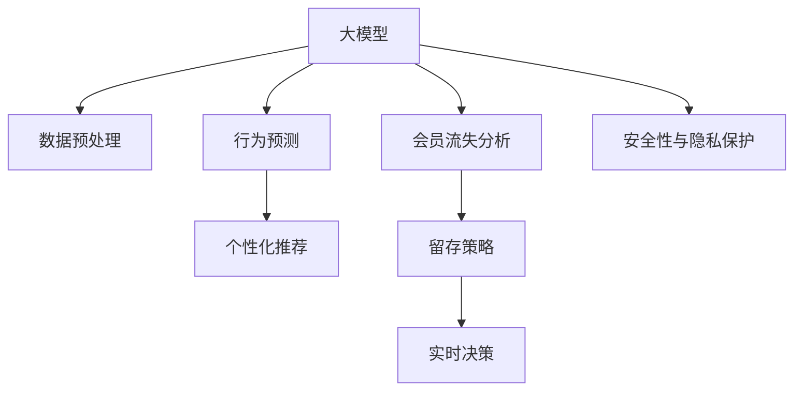

                 

# 探索大模型在电商平台会员管理中的潜力

## 1. 背景介绍

### 1.1 问题由来

随着互联网电商的迅速发展，越来越多的电商平台涌现，随之而来的问题也越来越复杂。电商平台会员管理作为电商运营的重要环节，负责管理大量的用户数据，包括用户的注册、登录、行为记录、个性化推荐等，为平台提供精准的用户画像。

但目前，大部分电商平台在会员管理上仍然存在诸多问题。一是数据量庞大，数据清洗和分析工作繁琐，难以实时处理；二是会员行为预测难度高，个性化推荐精准度不足；三是会员流失率较高，需要构建有效的会员留存策略。

为此，大模型技术的应用，为电商平台会员管理带来了新的希望。大模型技术通过在海量数据上进行预训练，具有强大的数据处理和分析能力，可以提升会员管理的效率和精准度，同时减少人工干预。

### 1.2 问题核心关键点

探索大模型在会员管理中的潜力，主要关注以下几个方面：
1. **数据预处理与清洗**：将复杂多样的用户数据整理为模型可以处理的形式。
2. **行为预测与个性化推荐**：通过大模型预测用户行为，实现个性化推荐，提升用户体验。
3. **会员流失分析与预测**：通过大模型分析会员流失原因，预测会员流失率，制定留存策略。
4. **实时数据分析与决策**：大模型可以实时处理大量数据，帮助电商平台做出快速反应。
5. **安全性与隐私保护**：大模型需要保障用户数据的安全性，防止数据泄露和滥用。

## 2. 核心概念与联系

### 2.1 核心概念概述

为更好地理解大模型在会员管理中的应用，本节将介绍几个密切相关的核心概念：

- **大模型(Large Model)**：指通过大规模数据预训练得到的模型，具有强大的数据分析和决策能力，如BERT、GPT等。
- **会员管理(Membership Management)**：指电商平台对用户数据的管理，包括用户注册、登录、行为记录、个性化推荐等。
- **行为预测(Behavior Prediction)**：通过模型预测用户的行为，如购买、浏览、点击等，提升个性化推荐精准度。
- **个性化推荐(Personalized Recommendation)**：根据用户的行为和偏好，推荐其可能感兴趣的商品。
- **会员流失分析(Member Churn Analysis)**：分析会员流失原因，预测流失率，制定留存策略。
- **实时数据分析(Real-time Data Analysis)**：实时处理和分析大量数据，帮助电商平台快速决策。
- **安全性与隐私保护(Security and Privacy Protection)**：保障用户数据的安全性，防止数据泄露和滥用。

这些核心概念之间的逻辑关系可以通过以下Mermaid流程图来展示：



这个流程图展示了大模型在会员管理中的核心概念及其之间的关系：

1. 大模型通过预训练获得基础能力。
2. 数据预处理对用户数据进行整理，使得大模型能够进行处理。
3. 行为预测通过大模型预测用户行为，为个性化推荐提供依据。
4. 个性化推荐根据用户行为和偏好，推荐相关商品。
5. 会员流失分析通过大模型分析会员流失原因，预测流失率。
6. 实时决策通过大模型实时处理和分析数据，做出快速反应。
7. 安全性与隐私保护保障数据安全，防止泄露和滥用。

这些概念共同构成了大模型在会员管理中的应用框架，使其能够更好地处理海量数据，提升个性化推荐精准度，减少会员流失，实现实时决策。

## 3. 核心算法原理 & 具体操作步骤
### 3.1 算法原理概述

大模型在会员管理中的应用，主要基于监督学习和无监督学习两种方法。

### 3.2 算法步骤详解

#### 3.2.1 数据预处理与清洗

1. **数据收集**：从电商平台收集用户注册、登录、浏览、购买等行为数据，以及其他相关数据（如人口统计信息、历史行为记录等）。
2. **数据整理**：将收集到的数据进行整理，去除无效数据和异常值，保留有用信息。
3. **数据标注**：为整理后的数据添加标签，如行为标签（浏览、点击、购买等）、会员标签（新会员、活跃会员、流失会员等）。
4. **数据划分**：将数据划分为训练集、验证集和测试集，通常采用7:2:1的比例。

#### 3.2.2 行为预测

1. **特征提取**：从整理后的数据中提取特征，如用户ID、浏览时长、购买金额等。
2. **模型训练**：使用大模型对训练集进行训练，如使用BERT对行为数据进行分类。
3. **模型评估**：在验证集上对模型进行评估，使用准确率、召回率等指标评估模型效果。
4. **参数调优**：根据评估结果，调整模型参数，优化模型效果。

#### 3.2.3 个性化推荐

1. **特征提取**：从整理后的数据中提取特征，如用户ID、浏览历史、购买记录等。
2. **模型训练**：使用大模型对训练集进行训练，如使用BERT对用户行为进行相似性计算。
3. **推荐计算**：根据用户行为和相似性计算结果，推荐相关商品。
4. **模型评估**：在测试集上对模型进行评估，使用准确率、召回率等指标评估推荐效果。
5. **推荐优化**：根据评估结果，调整推荐算法，优化推荐效果。

#### 3.2.4 会员流失分析

1. **特征提取**：从整理后的数据中提取特征，如用户ID、历史行为、流失时间等。
2. **模型训练**：使用大模型对训练集进行训练，如使用BERT对流失数据进行分类。
3. **模型评估**：在验证集上对模型进行评估，使用准确率、召回率等指标评估模型效果。
4. **参数调优**：根据评估结果，调整模型参数，优化模型效果。

#### 3.2.5 实时数据分析

1. **数据流处理**：实时收集用户行为数据，如浏览、点击、购买等。
2. **模型推理**：使用大模型对实时数据进行推理，如预测用户行为、推荐商品等。
3. **数据存储**：将推理结果存储到数据库中，便于后续分析和使用。
4. **模型优化**：根据实时数据，不断调整模型参数，优化模型效果。

#### 3.2.6 安全性与隐私保护

1. **数据加密**：对用户数据进行加密处理，保障数据安全性。
2. **隐私保护**：采用隐私保护技术，如差分隐私、联邦学习等，保护用户隐私。
3. **访问控制**：设置访问控制机制，确保只有授权人员可以访问数据。
4. **审计与监控**：定期审计和监控系统，确保数据安全。

### 3.3 算法优缺点

#### 3.3.1 优点

1. **高效性**：大模型可以处理海量数据，提升数据分析和决策效率。
2. **精准性**：通过数据预处理和特征提取，提升行为预测和个性化推荐精准度。
3. **实时性**：实时处理和分析数据，帮助电商平台做出快速决策。
4. **鲁棒性**：大模型通过预训练具有较强的泛化能力，能够在不同场景下稳定工作。
5. **可扩展性**：大模型可以适应不同规模的数据和任务，具有较强的可扩展性。

#### 3.3.2 缺点

1. **数据依赖**：大模型需要大量的标注数据进行训练，数据获取和标注成本较高。
2. **资源消耗**：大模型训练和推理消耗大量计算资源，需要高性能硬件支持。
3. **模型复杂性**：大模型结构复杂，难以理解和调试。
4. **隐私风险**：大模型处理大量敏感数据，存在隐私泄露风险。
5. **部署难度**：大模型部署需要高性能硬件和复杂配置，部署难度较大。

## 4. 数学模型和公式 & 详细讲解 & 举例说明

### 4.1 数学模型构建

**数据预处理与清洗**：
$$
D = \{(x_i, y_i)\}_{i=1}^N, x_i \in \mathbb{R}^d, y_i \in \{0, 1\}
$$
其中 $x_i$ 为输入数据，$y_i$ 为标签，$d$ 为特征维度。

**行为预测**：
$$
\hat{y} = M(x), M \in \mathbb{R}^d \rightarrow \{0, 1\}
$$
其中 $M$ 为模型，$x$ 为输入数据，$\hat{y}$ 为预测标签。

**个性化推荐**：
$$
r_i = M(x_i), M \in \mathbb{R}^d \rightarrow [0, 1]
$$
其中 $r_i$ 为推荐评分，$M$ 为模型，$x_i$ 为输入数据。

**会员流失分析**：
$$
p(y_i=1|x_i) = M(x_i), M \in \mathbb{R}^d \rightarrow [0, 1]
$$
其中 $p(y_i=1|x_i)$ 为会员流失概率，$M$ 为模型，$x_i$ 为输入数据。

### 4.2 公式推导过程

**行为预测**：
假设模型为 BERT，其输入为文本 $x_i$，输出为标签 $\hat{y}_i$。模型的输入表示为：
$$
x_i = [CLS] \; x_i
$$
其中 $[CLS]$ 为特殊标记符。模型的输出为：
$$
\hat{y}_i = M(x_i) = softmax([CLS] \; x_iW + b)
$$
其中 $W$ 和 $b$ 为模型的可训练参数。

**个性化推荐**：
假设模型为 BERT，其输入为文本 $x_i$，输出为推荐评分 $r_i$。模型的输入表示为：
$$
x_i = [CLS] \; x_i
$$
其中 $[CLS]$ 为特殊标记符。模型的输出为：
$$
r_i = M(x_i) = softmax([CLS] \; x_iW + b)
$$
其中 $W$ 和 $b$ 为模型的可训练参数。

**会员流失分析**：
假设模型为 BERT，其输入为文本 $x_i$，输出为会员流失概率 $p_i$。模型的输入表示为：
$$
x_i = [CLS] \; x_i
$$
其中 $[CLS]$ 为特殊标记符。模型的输出为：
$$
p_i = M(x_i) = sigmoid([CLS] \; x_iW + b)
$$
其中 $W$ 和 $b$ 为模型的可训练参数。

### 4.3 案例分析与讲解

**案例背景**：
某电商平台有数百万用户，希望通过大模型提升会员管理效率和精准度。该电商平台的数据量庞大，且用户行为复杂多样。

**数据预处理**：
- **数据收集**：从电商平台收集用户注册、登录、浏览、购买等行为数据。
- **数据整理**：将数据整理为一致的格式，去除无效数据和异常值。
- **数据标注**：为整理后的数据添加标签，如行为标签（浏览、点击、购买等）、会员标签（新会员、活跃会员、流失会员等）。
- **数据划分**：将数据划分为训练集、验证集和测试集，通常采用7:2:1的比例。

**行为预测**：
- **特征提取**：从整理后的数据中提取特征，如用户ID、浏览时长、购买金额等。
- **模型训练**：使用BERT对行为数据进行分类，训练模型。
- **模型评估**：在验证集上对模型进行评估，使用准确率、召回率等指标评估模型效果。
- **参数调优**：根据评估结果，调整模型参数，优化模型效果。

**个性化推荐**：
- **特征提取**：从整理后的数据中提取特征，如用户ID、浏览历史、购买记录等。
- **模型训练**：使用BERT对用户行为进行相似性计算，训练模型。
- **推荐计算**：根据用户行为和相似性计算结果，推荐相关商品。
- **模型评估**：在测试集上对模型进行评估，使用准确率、召回率等指标评估推荐效果。
- **推荐优化**：根据评估结果，调整推荐算法，优化推荐效果。

**会员流失分析**：
- **特征提取**：从整理后的数据中提取特征，如用户ID、历史行为、流失时间等。
- **模型训练**：使用BERT对流失数据进行分类，训练模型。
- **模型评估**：在验证集上对模型进行评估，使用准确率、召回率等指标评估模型效果。
- **参数调优**：根据评估结果，调整模型参数，优化模型效果。

## 5. 项目实践：代码实例和详细解释说明

### 5.1 开发环境搭建

**5.1.1 安装依赖**：
```bash
pip install transformers torch torchtext sklearn pandas numpy
```

**5.1.2 下载预训练模型**：
```bash
transformers download models bert-base-uncased
```

**5.1.3 搭建数据预处理模块**：
```python
import torch
import pandas as pd
from torchtext import data
from transformers import BertTokenizer, BertForSequenceClassification

# 数据加载器
train_data, valid_data, test_data = load_data()

# 数据预处理
TEXT = data.Field(tokenize='spacy', lower=True)
LABEL = data.LabelField(dtype=torch.float)

TEXT.build_vocab(train_data, max_size=10000)
LABEL.build_vocab(train_data)

train_data, valid_data, test_data = data.BucketIterator.splits(
    (train_data, valid_data, test_data), batch_size=32, device=torch.device("cuda")
)

# 模型加载
model = BertForSequenceClassification.from_pretrained("bert-base-uncased", num_labels=1)
```

### 5.2 源代码详细实现

**5.2.1 数据预处理模块**：
```python
class DataLoader:
    def __init__(self, data_path):
        self.data = pd.read_csv(data_path)
        self.tokenizer = BertTokenizer.from_pretrained("bert-base-uncased")

    def __len__(self):
        return len(self.data)

    def __getitem__(self, idx):
        row = self.data.iloc[idx]
        text = row["text"]
        label = row["label"]
        tokens = self.tokenizer.tokenize(text)
        inputs = self.tokenizer.convert_tokens_to_ids(tokens)
        return {"input_ids": inputs, "attention_mask": [1] * len(inputs), "label": label}
```

**5.2.2 模型训练模块**：
```python
import torch
from transformers import BertForSequenceClassification, AdamW
from torch.utils.data import DataLoader

# 模型加载
model = BertForSequenceClassification.from_pretrained("bert-base-uncased", num_labels=1)

# 优化器
optimizer = AdamW(model.parameters(), lr=2e-5)

# 训练函数
def train(model, train_loader, optimizer, num_epochs=5):
    for epoch in range(num_epochs):
        model.train()
        total_loss = 0
        for batch in train_loader:
            input_ids = batch["input_ids"].to(device)
            attention_mask = batch["attention_mask"].to(device)
            labels = batch["label"].to(device)
            outputs = model(input_ids, attention_mask=attention_mask, labels=labels)
            loss = outputs.loss
            total_loss += loss.item()
            optimizer.zero_grad()
            loss.backward()
            optimizer.step()
        print(f"Epoch {epoch+1}, loss: {total_loss/len(train_loader)}")
```

**5.2.3 模型评估模块**：
```python
from sklearn.metrics import accuracy_score

def evaluate(model, valid_loader):
    model.eval()
    total_pred = []
    total_true = []
    for batch in valid_loader:
        input_ids = batch["input_ids"].to(device)
        attention_mask = batch["attention_mask"].to(device)
        labels = batch["label"].to(device)
        outputs = model(input_ids, attention_mask=attention_mask)
        logits = outputs.logits
        preds = torch.sigmoid(logits)
        total_pred.append(preds)
        total_true.append(labels)
    preds = torch.cat(total_pred, dim=0)
    true = torch.cat(total_true, dim=0)
    accuracy = accuracy_score(true, preds)
    print(f"Accuracy: {accuracy}")
```

### 5.3 代码解读与分析

**5.3.1 数据预处理模块**：
- **DataLoader类**：加载数据，并转换为模型可以处理的形式。
- **tokenizer**：使用SpaCy分词器进行分词，并转换为模型需要的id表示。
- **inputs**：构造模型的输入，包含输入id和注意力掩码。
- **label**：添加标签。

**5.3.2 模型训练模块**：
- **train函数**：在每个epoch内，对模型进行前向传播和反向传播，更新模型参数。
- **AdamW优化器**：使用自适应矩估计优化器，具有较好的收敛性和稳定性。
- **device**：指定模型在GPU上运行，提高计算速度。

**5.3.3 模型评估模块**：
- **evaluate函数**：在验证集上对模型进行评估，计算准确率。
- **total_pred和total_true**：保存所有预测和真实标签，用于计算最终准确率。

## 6. 实际应用场景

### 6.1 智能客服系统

智能客服系统是电商平台会员管理的重要应用场景。通过大模型，系统可以自动理解和回复用户问题，提升用户体验。

**6.1.1 智能客服模型**：
- **数据预处理**：从客服聊天记录中提取问题和答案，进行数据清洗和整理。
- **行为预测**：预测用户意图，确定用户需要何种帮助。
- **个性化推荐**：根据用户的历史行为和当前问题，推荐相关解决方案。
- **实时处理**：实时处理用户咨询，提供即时答复。

**6.1.2 效果评估**：
- **用户满意度**：通过用户反馈和满意度调查，评估智能客服系统的效果。
- **问题解决率**：统计系统成功解决问题的人数和比例。
- **服务响应时间**：统计用户咨询后系统响应的平均时间。

### 6.2 个性化推荐系统

个性化推荐系统是电商平台提升用户粘性和转化率的重要手段。通过大模型，系统可以精准推荐用户感兴趣的商品，提升用户满意度。

**6.2.1 推荐模型**：
- **数据预处理**：从用户行为数据中提取特征，如浏览历史、购买记录等。
- **行为预测**：预测用户可能感兴趣的商品。
- **个性化推荐**：根据用户行为和预测结果，推荐相关商品。
- **实时更新**：根据用户新行为，实时更新推荐结果。

**6.2.2 效果评估**：
- **点击率**：统计用户点击推荐商品的比例。
- **转化率**：统计用户购买推荐商品的比例。
- **用户满意度**：通过用户反馈和满意度调查，评估个性化推荐系统的效果。

### 6.3 会员流失分析与留存策略

会员流失分析与留存策略是电商平台保持用户活跃度的重要手段。通过大模型，系统可以分析会员流失原因，制定有效的留存策略。

**6.3.1 流失分析模型**：
- **数据预处理**：从会员行为数据中提取特征，如历史行为、流失时间等。
- **会员流失预测**：预测会员流失概率。
- **流失原因分析**：分析会员流失的原因，如不活跃、满意度低等。
- **留存策略制定**：根据流失原因，制定相应的留存策略。

**6.3.2 效果评估**：
- **流失率**：统计会员流失的比例。
- **留存率**：统计留存的会员比例。
- **用户满意度**：通过用户反馈和满意度调查，评估留存策略的效果。

## 7. 工具和资源推荐

### 7.1 学习资源推荐

1. **Transformers官方文档**：提供了全面的API文档和示例，帮助开发者快速上手大模型开发。
2. **《自然语言处理与深度学习》**：介绍自然语言处理的基本概念和深度学习技术，适合初学者阅读。
3. **《深度学习框架TensorFlow》**：介绍TensorFlow的使用方法和原理，适合深入学习深度学习技术。
4. **《深度学习：理论与算法》**：介绍深度学习的基本原理和算法，适合系统学习深度学习理论。
5. **Kaggle竞赛**：参与Kaggle数据科学竞赛，积累实际项目经验，提升解决实际问题的能力。

### 7.2 开发工具推荐

1. **Jupyter Notebook**：免费开源的Python开发环境，支持代码运行和结果展示。
2. **PyTorch**：高效的深度学习框架，支持动态计算图和GPU加速。
3. **TensorFlow**：灵活的深度学习框架，支持分布式计算和高效部署。
4. **Pandas**：数据处理和分析工具，支持各种数据格式和操作。
5. **NumPy**：高性能数值计算库，支持各种数学运算和数组操作。

### 7.3 相关论文推荐

1. **《BERT: Pre-training of Deep Bidirectional Transformers for Language Understanding》**：介绍BERT模型的预训练和微调方法，推动大语言模型技术发展。
2. **《Deep Reinforcement Learning for Personalized Product Recommendations》**：介绍深度学习在个性化推荐中的应用，提升推荐系统效果。
3. **《A Survey on Transfer Learning for Recommendation System》**：综述转移学习在推荐系统中的应用，探讨优化方法和效果。
4. **《Unsupervised Sequence Modeling for Similarity-Search and Question-Answering》**：介绍大语言模型在相似性搜索和问答中的应用，提升信息检索能力。
5. **《Hierarchical Attention Networks for Document Classification》**：介绍HAN模型在文本分类中的应用，提升分类效果。

## 8. 总结：未来发展趋势与挑战

### 8.1 总结

本文对大模型在电商平台会员管理中的应用进行了全面系统的介绍。首先阐述了会员管理的复杂性和大模型的优势，明确了大模型在会员管理中的潜力。其次，从数据预处理、行为预测、个性化推荐、会员流失分析等方面，详细讲解了大模型在会员管理中的操作步骤和实现方法。最后，通过智能客服系统、个性化推荐系统和会员流失分析三个实际应用场景，展示了大模型的应用效果。

通过本文的系统梳理，可以看到，大模型在会员管理中具有广泛的应用前景，能够提升数据分析和决策效率，提升个性化推荐精准度，减少会员流失，实现实时决策。未来，随着大模型技术的发展和应用场景的拓展，大模型必将在更多领域发挥重要作用，推动电商平台的智能化和数字化转型。

### 8.2 未来发展趋势

展望未来，大模型在会员管理中的应用将呈现以下几个发展趋势：

1. **模型规模持续增大**：随着计算能力和数据量的提升，大模型的参数规模将不断增大，处理能力和预测精度将进一步提升。
2. **模型结构不断优化**：大模型将通过更优的结构设计和算法优化，提升模型效率和泛化能力，适应更多复杂场景。
3. **多模态融合**：结合图像、视频、语音等多模态数据，提升大模型在多模态场景中的表现。
4. **跨领域迁移学习**：通过迁移学习，大模型可以跨领域应用，提升在不同场景中的通用性。
5. **动态更新与增量学习**：大模型将通过增量学习不断更新，保持模型最新状态，提升模型适应性和鲁棒性。
6. **模型融合与协同**：大模型将与其他AI技术进行深度融合，提升系统整体性能和用户体验。

### 8.3 面临的挑战

尽管大模型在会员管理中具有巨大的应用潜力，但在实际应用中也面临着诸多挑战：

1. **数据隐私与安全**：大模型需要处理大量敏感数据，存在隐私泄露和数据安全风险。
2. **计算资源消耗**：大模型训练和推理消耗大量计算资源，需要高性能硬件支持。
3. **模型复杂性高**：大模型结构复杂，难以理解和调试，需要专业人员进行维护。
4. **模型鲁棒性不足**：大模型可能存在过拟合问题，需要更多的正则化和泛化方法。
5. **模型部署难度大**：大模型部署需要复杂配置和高性能硬件，部署难度较大。

### 8.4 研究展望

未来，针对大模型在会员管理中的应用，需要进一步开展以下几个方面的研究：

1. **隐私保护技术**：研发隐私保护技术，保障用户数据的安全性和隐私性。
2. **高效计算方法**：开发高效计算方法，降低大模型训练和推理的资源消耗。
3. **模型解释与可解释性**：提升大模型的可解释性，增加用户对模型的信任和理解。
4. **鲁棒性提升**：提升大模型的鲁棒性和泛化能力，降低过拟合风险。
5. **动态模型优化**：研究动态模型优化方法，保持模型的最新状态和最佳性能。
6. **跨领域应用**：探索大模型在跨领域应用中的表现，提升模型的通用性和适用性。

这些研究方向将推动大模型在会员管理中的应用不断深入，提升系统的智能化水平，为电商平台带来更大的价值。

## 9. 附录：常见问题与解答

**Q1：大模型在会员管理中是否需要大量的标注数据？**

A: 大模型在会员管理中的应用，通常不需要大量的标注数据。通过预训练，大模型已经学习到了大量的语言知识和规律，可以适应各种场景。但在行为预测和个性化推荐等任务中，还是需要一些标注数据来训练模型，以便更好地适应具体业务场景。

**Q2：大模型在会员管理中如何保障数据隐私与安全？**

A: 大模型在会员管理中，需要采用隐私保护技术，如差分隐私、联邦学习等，保障用户数据的安全性和隐私性。同时，设置访问控制机制，确保只有授权人员可以访问数据，定期进行数据审计和监控，确保数据安全。

**Q3：大模型在会员管理中如何实现实时处理和决策？**

A: 大模型可以通过增量学习和在线推理实现实时处理和决策。增量学习可以在不停止服务的情况下，不断更新模型参数，保持模型的最新状态。在线推理可以通过分布式计算和缓存技术，实现高效的处理和决策。

**Q4：大模型在会员管理中如何提升个性化推荐效果？**

A: 大模型在会员管理中，可以通过行为预测和个性化推荐实现精准的个性化推荐。行为预测可以根据用户的历史行为和当前行为，预测其可能感兴趣的商品或服务。个性化推荐可以根据用户的兴趣和偏好，推荐相关的商品或服务。

**Q5：大模型在会员管理中如何提升用户满意度？**

A: 大模型在会员管理中，可以通过智能客服系统提升用户满意度。智能客服系统可以自动理解和回复用户问题，提升用户体验。同时，个性化推荐系统可以根据用户的兴趣和偏好，推荐相关商品和服务，提升用户满意度。

---

作者：禅与计算机程序设计艺术 / Zen and the Art of Computer Programming

