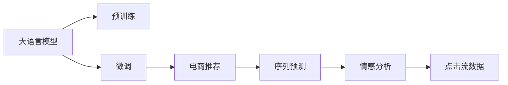

                 

# 探讨大模型在电商平台用户行为序列分析中的潜力

> 关键词：大语言模型,用户行为分析,电商推荐,序列预测,情感分析,点击流数据

## 1. 背景介绍

在当下数字化、智能化的零售环境中，电商平台希望通过精准的用户行为分析，预测用户购买意愿，优化产品推荐，提升用户体验和交易转化率。传统的用户行为分析方法往往依赖于规则、统计等技术，难以捕捉行为序列中复杂的关联和变化趋势。近年来，随着深度学习技术的突破，大语言模型在自然语言处理(NLP)领域取得了显著的进展，其在处理序列数据、捕捉上下文关联等方面的强大能力，使其在用户行为序列分析中展现出巨大的潜力。

本文将探讨如何利用大语言模型，特别是预训练语言模型，分析电商平台用户的行为序列数据，预测用户未来的行为，从而为电商推荐系统提供更加精准的决策依据。我们将首先介绍大语言模型和电商平台用户行为分析的基本概念，接着深入分析大语言模型在用户行为序列分析中的具体应用，最后讨论未来在电商领域的应用前景与面临的挑战。

## 2. 核心概念与联系

### 2.1 核心概念概述

- **大语言模型(Large Language Model, LLM)**：以自回归模型（如GPT系列）或自编码模型（如BERT）为代表的大规模预训练语言模型，通过在海量文本数据上进行预训练，学习到通用的语言表示，具备强大的语言理解和生成能力。

- **用户行为序列分析**：在电商平台，用户的行为序列数据通常包含浏览、点击、购买、评价等事件，通过对这些序列数据进行分析，可以挖掘用户偏好、需求变化规律，为推荐系统提供决策依据。

- **预训练(Pre-training)**：指在大规模无标签文本语料上进行预训练，学习通用的语言表示，增强模型的泛化能力。

- **微调(Fine-tuning)**：指在预训练模型的基础上，使用特定任务的数据集进行有监督学习，调整模型参数以适应具体任务，提升模型性能。

- **电商推荐系统**：利用用户行为数据进行用户画像构建，实现个性化推荐，提升用户满意度和交易转化率。

- **序列预测(Sequence Prediction)**：通过模型对用户行为序列进行预测，分析用户未来的行为。

- **情感分析(Sentiment Analysis)**：分析用户对商品或服务的情感倾向，优化推荐内容。

- **点击流数据(Clickstream Data)**：用户在电商平台上的浏览、点击、购买等操作记录，蕴含丰富的用户行为信息。

### 2.2 核心概念原理和架构的 Mermaid 流程图



以上流程图展示了大语言模型在电商平台用户行为序列分析中的应用框架，其核心逻辑如下：

1. **预训练**：大语言模型通过在无标签文本数据上进行自监督学习，学习通用的语言表示。
2. **微调**：在特定任务（如电商推荐、点击流预测等）的数据集上进行微调，适应具体任务。
3. **电商推荐**：构建用户画像，根据用户行为序列预测用户行为，实现个性化推荐。
4. **序列预测**：分析用户行为序列，预测用户未来的行为，如购买意愿、点击偏好等。
5. **情感分析**：对用户评论、反馈等文本数据进行情感分析，优化推荐内容。
6. **点击流数据**：收集用户的行为序列数据，为推荐系统提供输入。

## 3. 核心算法原理 & 具体操作步骤

### 3.1 算法原理概述

大语言模型在电商平台用户行为序列分析中的应用，主要依赖于其在序列预测和情感分析等方面的能力。具体来说，通过预训练语言模型对用户行为序列进行建模，捕捉序列中的上下文关联和趋势变化，结合情感分析对用户情感倾向进行预测，从而指导电商推荐系统的优化和调整。

### 3.2 算法步骤详解

1. **数据准备**：收集电商平台上的用户行为数据，包括浏览、点击、购买、评价等行为记录，构建点击流数据集。
2. **预训练模型加载**：选择合适的预训练语言模型，如BERT、GPT-3等，加载到开发环境中。
3. **数据预处理**：对用户行为序列数据进行清洗、归一化、编码等预处理操作，转换为模型可以处理的形式。
4. **微调模型训练**：在预训练模型上，使用点击流数据集进行有监督微调，调整模型参数以适应电商推荐任务。
5. **序列预测**：将用户行为序列输入微调后的模型，预测用户未来的行为，如点击、购买等。
6. **情感分析**：对用户评价、反馈等文本数据进行情感分析，判断用户对商品或服务的情感倾向。
7. **推荐调整**：根据序列预测和情感分析结果，优化电商推荐系统，提升推荐效果。

### 3.3 算法优缺点

大语言模型在电商平台用户行为序列分析中的应用，具有以下优点：

- **通用性强**：预训练模型经过大规模文本数据的训练，能够捕捉多种复杂的语言模式，适用于不同的电商平台和推荐场景。
- **精度高**：大语言模型具有强大的预测能力，能够准确地预测用户行为，提升推荐系统的效果。
- **适应性强**：可以通过微调参数，适应不同的电商推荐任务，提升模型的泛化能力。

同时，也存在一些局限性：

- **计算资源需求高**：预训练模型参数量巨大，训练和推理需要大量的计算资源。
- **数据依赖性强**：微调模型的性能依赖于点击流数据集的质量和数量，数据量不足时可能效果不佳。
- **解释性不足**：预训练模型通常缺乏可解释性，难以理解其内部的推理逻辑。

### 3.4 算法应用领域

大语言模型在电商平台用户行为序列分析中的应用，主要包括以下几个方面：

1. **个性化推荐**：基于用户的行为序列，预测用户未来的行为，实现个性化推荐。
2. **广告定向**：分析用户的历史行为数据，预测用户对不同广告的响应，实现精准的广告定向。
3. **用户画像构建**：对用户行为序列进行分析，构建详细的用户画像，为其他应用场景提供支持。
4. **情感分析与舆情监控**：对用户评价、反馈等文本数据进行情感分析，监控用户对商品或服务的情感变化，优化商品和服务的质量。
5. **用户流失预警**：通过分析用户行为序列的变化趋势，预测用户流失的风险，采取相应的挽留措施。

## 4. 数学模型和公式 & 详细讲解 & 举例说明

### 4.1 数学模型构建

在电商平台用户行为序列分析中，我们可以使用大语言模型对用户行为序列进行建模。设用户的行为序列为 $\{x_t\}_{t=1}^{T}$，其中 $x_t$ 表示第 $t$ 次行为，可以是一个浏览记录、一次点击行为或一项购买记录。对于每个行为 $x_t$，我们将其编码为向量 $v_t$，然后将这些向量输入到大语言模型中，进行序列建模。

### 4.2 公式推导过程

假设我们使用的是Transformer模型，其对序列数据的建模可以通过自注意力机制实现。设 $y_t$ 为模型对行为序列的预测结果，则有：

$$
y_t = M_{\theta}(v_t) = \text{softmax}(\frac{A_{\theta}v_t Q_{\theta}^T}{\sqrt{d_k}})
$$

其中，$A_{\theta}$ 和 $Q_{\theta}$ 为模型参数，$d_k$ 为键向量的维度。模型的预测结果 $y_t$ 可以是一个分类结果，如用户是否点击了该商品，也可以是一个数值结果，如用户对该商品的概率评分。

### 4.3 案例分析与讲解

以电商平台上的用户点击行为预测为例，我们可以使用大语言模型进行预测。假设用户的行为序列为 $(x_1, x_2, \cdots, x_T)$，我们将其编码为向量序列 $(V_1, V_2, \cdots, V_T)$，然后将其输入到大语言模型中进行预测。

设模型对每个行为 $x_t$ 的预测结果为 $y_t$，则整个序列的预测结果为 $\hat{y} = \{y_t\}_{t=1}^{T}$。通过对比预测结果和实际结果，我们可以计算模型的预测精度，并根据误差进行调整优化。

## 5. 项目实践：代码实例和详细解释说明

### 5.1 开发环境搭建

为了进行电商推荐系统的用户行为序列分析，我们需要准备以下开发环境：

1. **安装Python和相关库**：确保开发环境中已安装Python 3.x版本，并使用pip安装transformers、torch等深度学习库。
2. **下载预训练模型**：从HuggingFace官网下载预训练的BERT模型，并将其保存到本地。
3. **构建数据集**：收集用户行为数据，构建点击流数据集，包括用户ID、商品ID、行为类型、时间戳等信息。
4. **构建模型架构**：使用PyTorch或TensorFlow搭建Transformer模型，并进行微调。

### 5.2 源代码详细实现

以下是一个使用PyTorch进行用户点击行为预测的代码示例：

```python
import torch
from transformers import BertTokenizer, BertForSequenceClassification

# 加载预训练模型和分词器
model = BertForSequenceClassification.from_pretrained('bert-base-uncased')
tokenizer = BertTokenizer.from_pretrained('bert-base-uncased')

# 加载数据集
dataset = load_dataset()  # 自定义数据加载函数

# 设置微调参数
num_epochs = 10
batch_size = 16
learning_rate = 2e-5
optimizer = torch.optim.Adam(model.parameters(), lr=learning_rate)

# 模型微调
for epoch in range(num_epochs):
    for batch in dataset:
        input_ids = tokenizer(batch['text'], padding='max_length', truncation=True).input_ids
        attention_mask = tokenizer(batch['text'], padding='max_length', truncation=True).attention_mask
        labels = batch['label']
        outputs = model(input_ids, attention_mask=attention_mask, labels=labels)
        loss = outputs.loss
        optimizer.zero_grad()
        loss.backward()
        optimizer.step()

# 保存模型
torch.save(model.state_dict(), 'bert_model.pth')
```

### 5.3 代码解读与分析

以上代码实现了使用BERT模型进行用户点击行为预测的过程。其主要步骤如下：

1. **加载模型和分词器**：使用BertTokenizer加载分词器，BertForSequenceClassification加载BERT模型。
2. **数据加载**：定义自定义数据加载函数，加载点击流数据集，包含用户ID、商品ID、行为类型等特征。
3. **微调模型**：设置微调参数，包括epoch数、批大小、学习率等，并使用Adam优化器进行模型微调。
4. **保存模型**：将微调后的模型权重保存到本地，方便后续使用。

### 5.4 运行结果展示

在微调完成后，可以使用以下代码对新数据进行预测：

```python
# 加载模型
model = BertForSequenceClassification.from_pretrained('bert-base-uncased')
model.load_state_dict(torch.load('bert_model.pth'))
model.eval()

# 对新数据进行预测
with torch.no_grad():
    for batch in new_data:
        input_ids = tokenizer(batch['text'], padding='max_length', truncation=True).input_ids
        attention_mask = tokenizer(batch['text'], padding='max_length', truncation=True).attention_mask
        outputs = model(input_ids, attention_mask=attention_mask)
        predictions = torch.softmax(outputs.logits, dim=1).numpy()[0]
        label = np.argmax(predictions)
```

运行结果将给出预测的点击行为概率，根据阈值可以判断用户是否点击了该商品。

## 6. 实际应用场景

### 6.1 个性化推荐

通过分析用户行为序列，预测用户未来的行为，电商平台可以为用户推荐更加个性化的商品。例如，当用户浏览了某类商品时，推荐系统可以根据用户的行为序列预测用户对该类商品的购买意愿，提前将其放入推荐列表。

### 6.2 广告定向

通过分析用户的历史行为数据，电商平台可以预测用户对不同广告的响应，实现精准的广告定向。例如，针对浏览过某类商品的用户，推荐系统可以投放与其浏览历史相关的广告，提高广告的点击率和转化率。

### 6.3 用户画像构建

通过分析用户的行为序列，电商平台可以构建详细的用户画像，了解用户的兴趣和需求。例如，根据用户的历史浏览和购买记录，可以构建用户画像，并用于其他应用场景，如推荐、广告、客服等。

### 6.4 情感分析与舆情监控

通过分析用户评价、反馈等文本数据，电商平台可以进行情感分析，了解用户对商品或服务的情感倾向。例如，对用户评论进行情感分析，可以判断用户对商品的好评或差评，从而优化商品的质量和服务的体验。

### 6.5 用户流失预警

通过分析用户行为序列的变化趋势，电商平台可以预测用户流失的风险。例如，当用户的行为序列突然减少或变得异常时，推荐系统可以发出预警，采取相应的挽留措施。

## 7. 工具和资源推荐

### 7.1 学习资源推荐

1. **《Transformers从原理到实践》系列博文**：深入浅出地介绍了Transformer原理、BERT模型、微调技术等前沿话题，是了解大语言模型微调的好资源。
2. **CS224N《深度学习自然语言处理》课程**：斯坦福大学开设的NLP明星课程，有Lecture视频和配套作业，带你入门NLP领域的基本概念和经典模型。
3. **《Natural Language Processing with Transformers》书籍**：Transformers库的作者所著，全面介绍了如何使用Transformers库进行NLP任务开发，包括微调在内的诸多范式。
4. **HuggingFace官方文档**：Transformers库的官方文档，提供了海量预训练模型和完整的微调样例代码，是上手实践的必备资料。
5. **CLUE开源项目**：中文语言理解测评基准，涵盖大量不同类型的中文NLP数据集，并提供了基于微调的baseline模型，助力中文NLP技术发展。

### 7.2 开发工具推荐

1. **PyTorch**：基于Python的开源深度学习框架，灵活动态的计算图，适合快速迭代研究。
2. **TensorFlow**：由Google主导开发的开源深度学习框架，生产部署方便，适合大规模工程应用。
3. **Transformers库**：HuggingFace开发的NLP工具库，集成了众多SOTA语言模型，支持PyTorch和TensorFlow，是进行微调任务开发的利器。
4. **Weights & Biases**：模型训练的实验跟踪工具，可以记录和可视化模型训练过程中的各项指标，方便对比和调优。与主流深度学习框架无缝集成。
5. **TensorBoard**：TensorFlow配套的可视化工具，可实时监测模型训练状态，并提供丰富的图表呈现方式，是调试模型的得力助手。
6. **Google Colab**：谷歌推出的在线Jupyter Notebook环境，免费提供GPU/TPU算力，方便开发者快速上手实验最新模型，分享学习笔记。

### 7.3 相关论文推荐

1. **Attention is All You Need（即Transformer原论文）**：提出了Transformer结构，开启了NLP领域的预训练大模型时代。
2. **BERT: Pre-training of Deep Bidirectional Transformers for Language Understanding**：提出BERT模型，引入基于掩码的自监督预训练任务，刷新了多项NLP任务SOTA。
3. **Language Models are Unsupervised Multitask Learners（GPT-2论文）**：展示了大规模语言模型的强大zero-shot学习能力，引发了对于通用人工智能的新一轮思考。
4. **Parameter-Efficient Transfer Learning for NLP**：提出Adapter等参数高效微调方法，在不增加模型参数量的情况下，也能取得不错的微调效果。
5. **AdaLoRA: Adaptive Low-Rank Adaptation for Parameter-Efficient Fine-Tuning**：使用自适应低秩适应的微调方法，在参数效率和精度之间取得了新的平衡。
6. **Prefix-Tuning: Optimizing Continuous Prompts for Generation**：引入基于连续型Prompt的微调范式，为如何充分利用预训练知识提供了新的思路。

## 8. 总结：未来发展趋势与挑战

### 8.1 研究成果总结

本文探讨了大语言模型在电商平台用户行为序列分析中的潜力，主要结论如下：

1. **大语言模型的优势**：在用户行为序列分析中，大语言模型具有通用性强、精度高、适应性强的特点，能够捕捉复杂的语言模式，进行序列预测和情感分析。
2. **微调方法的应用**：通过微调模型，可以适应不同的电商推荐任务，提升推荐系统的效果。
3. **实际应用场景**：个性化推荐、广告定向、用户画像构建、情感分析与舆情监控、用户流失预警等多个场景中，大语言模型微调技术有广泛的应用前景。

### 8.2 未来发展趋势

1. **模型规模持续增大**：随着算力成本的下降和数据规模的扩张，预训练语言模型的参数量还将持续增长。超大模型蕴含的丰富语言知识，有望支撑更加复杂多变的电商推荐场景。
2. **微调方法日趋多样**：未来将涌现更多参数高效的微调方法，如Prefix-Tuning、LoRA等，在节省计算资源的同时保证微调精度。
3. **持续学习成为常态**：随着数据分布的不断变化，微调模型需要持续学习新知识以保持性能，增量学习等方法将得到广泛应用。
4. **标注样本需求降低**：受启发于提示学习(Prompt-based Learning)的思路，未来的微调方法将更好地利用大模型的语言理解能力，通过更加巧妙的任务描述，在更少的标注样本上实现理想的微调效果。
5. **多模态微调崛起**：未来的微调方法将更多地融合视觉、语音等多模态信息，实现多模态信息的协同建模，提升模型的综合能力。
6. **知识整合能力增强**：未来的微调模型将更好地与外部知识库、规则库等专家知识结合，形成更加全面、准确的信息整合能力。

### 8.3 面临的挑战

尽管大语言模型微调技术已经取得了瞩目成就，但在迈向更加智能化、普适化应用的过程中，仍面临以下挑战：

1. **标注成本瓶颈**：尽管微调降低了对标注数据的依赖，但对于长尾应用场景，仍需大量高质量标注数据。如何进一步降低微调对标注样本的依赖，将是一大难题。
2. **模型鲁棒性不足**：当前微调模型面对域外数据时，泛化性能往往不足。对于测试样本的微小扰动，微调模型的预测也容易发生波动。如何提高微调模型的鲁棒性，避免灾难性遗忘，还需要更多理论和实践的积累。
3. **推理效率有待提高**：大规模语言模型虽然精度高，但在实际部署时往往面临推理速度慢、内存占用大等效率问题。如何在保证性能的同时，简化模型结构，提升推理速度，优化资源占用，将是重要的优化方向。
4. **可解释性亟需加强**：当前微调模型通常缺乏可解释性，难以理解其内部工作机制和决策逻辑。对于医疗、金融等高风险应用，算法的可解释性和可审计性尤为重要。
5. **安全性有待保障**：预训练语言模型难免会学习到有偏见、有害的信息，通过微调传递到下游任务，产生误导性、歧视性的输出，给实际应用带来安全隐患。
6. **知识整合能力不足**：现有的微调模型往往局限于任务内数据，难以灵活吸收和运用更广泛的先验知识。如何让微调过程更好地与外部知识库、规则库等专家知识结合，形成更加全面、准确的信息整合能力，还有很大的想象空间。

### 8.4 研究展望

面对大语言模型微调所面临的种种挑战，未来的研究需要在以下几个方面寻求新的突破：

1. **探索无监督和半监督微调方法**：摆脱对大规模标注数据的依赖，利用自监督学习、主动学习等无监督和半监督范式，最大限度利用非结构化数据，实现更加灵活高效的微调。
2. **研究参数高效和计算高效的微调范式**：开发更加参数高效的微调方法，在固定大部分预训练参数的同时，只更新极少量的任务相关参数。同时优化微调模型的计算图，减少前向传播和反向传播的资源消耗，实现更加轻量级、实时性的部署。
3. **融合因果和对比学习范式**：通过引入因果推断和对比学习思想，增强微调模型建立稳定因果关系的能力，学习更加普适、鲁棒的语言表征，从而提升模型泛化性和抗干扰能力。
4. **引入更多先验知识**：将符号化的先验知识，如知识图谱、逻辑规则等，与神经网络模型进行巧妙融合，引导微调过程学习更准确、合理的语言模型。同时加强不同模态数据的整合，实现视觉、语音等多模态信息与文本信息的协同建模。
5. **结合因果分析和博弈论工具**：将因果分析方法引入微调模型，识别出模型决策的关键特征，增强输出解释的因果性和逻辑性。借助博弈论工具刻画人机交互过程，主动探索并规避模型的脆弱点，提高系统稳定性。
6. **纳入伦理道德约束**：在模型训练目标中引入伦理导向的评估指标，过滤和惩罚有偏见、有害的输出倾向。同时加强人工干预和审核，建立模型行为的监管机制，确保输出符合人类价值观和伦理道德。

这些研究方向的探索，必将引领大语言模型微调技术迈向更高的台阶，为构建安全、可靠、可解释、可控的智能系统铺平道路。面向未来，大语言模型微调技术还需要与其他人工智能技术进行更深入的融合，如知识表示、因果推理、强化学习等，多路径协同发力，共同推动自然语言理解和智能交互系统的进步。只有勇于创新、敢于突破，才能不断拓展语言模型的边界，让智能技术更好地造福人类社会。

## 9. 附录：常见问题与解答

**Q1：大语言模型微调是否适用于所有NLP任务？**

A: 大语言模型微调在大多数NLP任务上都能取得不错的效果，特别是对于数据量较小的任务。但对于一些特定领域的任务，如医学、法律等，仅仅依靠通用语料预训练的模型可能难以很好地适应。此时需要在特定领域语料上进一步预训练，再进行微调，才能获得理想效果。此外，对于一些需要时效性、个性化很强的任务，如对话、推荐等，微调方法也需要针对性的改进优化。

**Q2：微调过程中如何选择合适的学习率？**

A: 微调的学习率一般要比预训练时小1-2个数量级，如果使用过大的学习率，容易破坏预训练权重，导致过拟合。一般建议从1e-5开始调参，逐步减小学习率，直至收敛。也可以使用warmup策略，在开始阶段使用较小的学习率，再逐渐过渡到预设值。需要注意的是，不同的优化器(如AdamW、Adafactor等)以及不同的学习率调度策略，可能需要设置不同的学习率阈值。

**Q3：采用大模型微调时会面临哪些资源瓶颈？**

A: 目前主流的预训练大模型动辄以亿计的参数规模，对算力、内存、存储都提出了很高的要求。GPU/TPU等高性能设备是必不可少的，但即便如此，超大批次的训练和推理也可能遇到显存不足的问题。因此需要采用一些资源优化技术，如梯度积累、混合精度训练、模型并行等，来突破硬件瓶颈。同时，模型的存储和读取也可能占用大量时间和空间，需要采用模型压缩、稀疏化存储等方法进行优化。

**Q4：如何缓解微调过程中的过拟合问题？**

A: 过拟合是微调面临的主要挑战，尤其是在标注数据不足的情况下。常见的缓解策略包括：

1. 数据增强：通过回译、近义替换等方式扩充训练集
2. 正则化：使用L2正则、Dropout、Early Stopping等避免过拟合
3. 对抗训练：引入对抗样本，提高模型鲁棒性
4. 参数高效微调：只调整少量参数(如Adapter、Prefix等)，减小过拟合风险
5. 多模型集成：训练多个微调模型，取平均输出，抑制过拟合

这些策略往往需要根据具体任务和数据特点进行灵活组合。只有在数据、模型、训练、推理等各环节进行全面优化，才能最大限度地发挥大模型微调的威力。

**Q5：微调模型在落地部署时需要注意哪些问题？**

A: 将微调模型转化为实际应用，还需要考虑以下因素：

1. 模型裁剪：去除不必要的层和参数，减小模型尺寸，加快推理速度
2. 量化加速：将浮点模型转为定点模型，压缩存储空间，提高计算效率
3. 服务化封装：将模型封装为标准化服务接口，便于集成调用
4. 弹性伸缩：根据请求流量动态调整资源配置，平衡服务质量和成本
5. 监控告警：实时采集系统指标，设置异常告警阈值，确保服务稳定性
6. 安全防护：采用访问鉴权、数据脱敏等措施，保障数据和模型安全

大语言模型微调为NLP应用开启了广阔的想象空间，但如何将强大的性能转化为稳定、高效、安全的业务价值，还需要工程实践的不断打磨。唯有从数据、算法、工程、业务等多个维度协同发力，才能真正实现人工智能技术在垂直行业的规模化落地。总之，微调需要开发者根据具体任务，不断迭代和优化模型、数据和算法，方能得到理想的效果。

