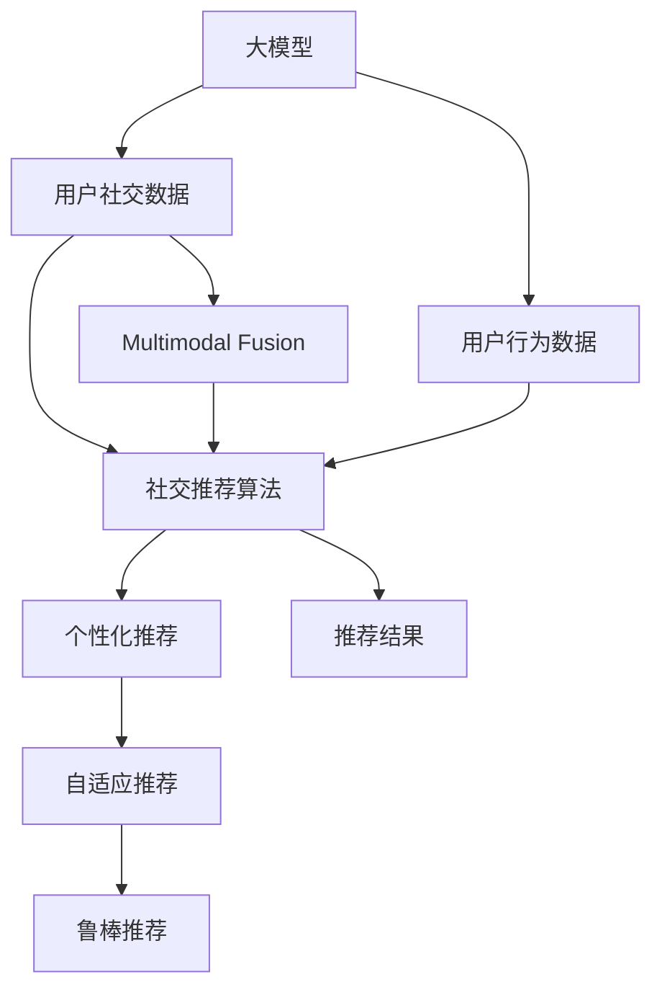

                 

# 探讨大模型在电商平台社交推荐中的潜力

## 1. 背景介绍

### 1.1 问题由来
随着电商平台的发展，社交推荐逐渐成为其核心竞争力之一。用户生成内容和社交网络数据日益丰富，电商平台希望通过深入分析这些数据，挖掘用户的购买偏好和行为规律，进而推荐个性化的商品，提升用户体验和销售额。然而，传统的推荐系统往往只能基于用户的显式行为数据，忽略了用户的隐性偏好，难以全面捕捉用户需求。因此，利用大模型对用户社交数据进行深度学习和推理，成为电商平台提升推荐质量的重要方向。

### 1.2 问题核心关键点
大模型在电商平台社交推荐中的应用，主要围绕以下几个核心问题展开：
- 如何高效处理和建模用户生成的社交数据？
- 如何结合用户行为数据，进行多模态融合，提高推荐精度？
- 如何通过大模型生成社交推荐算法，以适应不同用户和场景的需求？
- 如何平衡模型的复杂性和实际应用中的资源限制？

### 1.3 问题研究意义
大模型在电商平台社交推荐中的应用，对提升推荐系统的精准度和用户满意度具有重要意义：
- 提升推荐多样性和新颖性。大模型可以捕捉到用户隐性的社交信息，结合用户行为数据，生成更丰富多样的推荐内容，避免陷入"信息茧房"。
- 增强推荐系统的鲁棒性和泛化能力。大模型具备强大的自适应和学习能力，可以有效应对新用户和场景的变化，保证推荐的连续性和稳定性。
- 优化用户体验和营销效果。个性化推荐可以显著提升用户购买意愿和满意度，减少无效曝光和广告投放，增加电商平台的ROI。

## 2. 核心概念与联系

### 2.1 核心概念概述

为更好地理解大模型在电商平台社交推荐中的应用，本节将介绍几个密切相关的核心概念：

- 大模型(Large Model)：指在大规模数据集上进行预训练，具有丰富语言表达能力、复杂关系建模能力的深度学习模型。常见的包括BERT、GPT、T5等。

- 电商平台社交推荐(Social Recommendation on E-commerce Platform)：指通过分析用户生成的社交数据（如评论、分享、点赞等），结合用户行为数据（如浏览、购买、搜索等），生成个性化商品推荐。

- 多模态融合(Multi-modal Fusion)：指将文本、图像、音频等多种模态的数据进行融合，提升推荐的全面性和准确性。

- 自适应推荐系统(Adaptive Recommendation System)：指根据用户行为和社交数据的变化，动态调整推荐策略，保持推荐内容的及时性和相关性。

- 鲁棒推荐系统(Robust Recommendation System)：指在处理异常数据和噪音数据时，仍能保持推荐结果的稳定性和鲁棒性。

- 个性化推荐系统(Personalized Recommendation System)：指根据用户的兴趣、历史行为等个性化特征，生成定制化的推荐内容，提升用户满意度和忠诚度。

这些核心概念之间的逻辑关系可以通过以下Mermaid流程图来展示：



这个流程图展示了大模型在电商平台社交推荐中的应用框架：

1. 大模型通过预训练学习到丰富的语言知识和关系，可以作为基础特征提取器。
2. 结合用户生成的社交数据和行为数据，利用多模态融合技术，提取更全面的用户特征。
3. 通过社交推荐算法，生成个性化的推荐结果。
4. 采用自适应推荐系统，动态调整推荐策略。
5. 应用鲁棒推荐系统，保证推荐结果的稳定性和鲁棒性。

## 3. 核心算法原理 & 具体操作步骤
### 3.1 算法原理概述

大模型在电商平台社交推荐中的应用，本质上是通过多模态数据融合和大模型推理，生成个性化的推荐结果。其核心思想是：将大模型视为一个强大的特征提取器，结合用户社交数据和行为数据，通过多模态融合学习用户综合特征，然后通过推理生成推荐。

具体来说，大模型在电商平台社交推荐中的应用流程如下：

1. 数据收集：收集用户生成的社交数据（如评论、分享、点赞等）和用户行为数据（如浏览、购买、搜索等）。

2. 数据预处理：对收集到的数据进行清洗、归一化、分词等预处理，构建合适的特征表示。

3. 大模型推理：将预处理后的数据输入大模型，进行语义理解和关系建模，得到用户特征表示。

4. 多模态融合：将大模型生成的用户特征与行为特征进行融合，得到更全面的用户表示。

5. 推荐生成：根据用户表示和商品表示，生成个性化推荐结果。

6. 模型评估：在测试集上评估推荐结果的精度、覆盖率和多样性，根据评估结果进行模型优化。

### 3.2 算法步骤详解

以一个简单的社交推荐系统为例，下面详细介绍每一步的实现细节：

**Step 1: 数据收集和预处理**

1. 数据收集：电商平台可以收集用户评论、分享、点赞、收藏、历史浏览等社交数据和行为数据。

2. 数据预处理：使用分词工具对文本数据进行分词，去除停用词和噪音数据，将数字特征标准化，构建TF-IDF或word2vec等特征表示。

**Step 2: 大模型推理**

1. 选择预训练大模型：如BERT、GPT、T5等，加载模型和分词器。

2. 生成用户表示：将用户社交数据输入大模型，进行语义理解和关系建模，得到用户特征表示。

3. 生成商品表示：将商品描述、图片等信息输入大模型，得到商品特征表示。

**Step 3: 多模态融合**

1. 特征融合：将大模型生成的用户特征和行为特征进行融合，得到综合用户表示。

2. 加权融合：根据特征的重要性，对不同特征进行加权融合，得到更准确的综合用户表示。

**Step 4: 推荐生成**

1. 计算相似度：根据用户表示和商品表示，计算相似度得分。

2. 排序推荐：根据相似度得分，对商品进行排序，生成个性化推荐结果。

**Step 5: 模型评估**

1. 构建测试集：在未参与训练的测试集上，评估推荐结果的精度、覆盖率和多样性。

2. 调整模型参数：根据评估结果，调整模型参数，优化推荐效果。

### 3.3 算法优缺点

大模型在电商平台社交推荐中的应用具有以下优点：
1. 强大的特征提取能力：大模型能够捕捉复杂的语义和关系，提取丰富的用户特征，提升推荐效果。
2. 多模态融合能力：结合用户社交数据和行为数据，多模态融合提升推荐全面性和准确性。
3. 自适应推荐能力：动态调整推荐策略，保证推荐的及时性和相关性。
4. 鲁棒推荐能力：有效应对异常数据和噪音数据，保证推荐结果的稳定性和鲁棒性。

同时，该方法也存在以下缺点：
1. 数据隐私问题：收集用户社交数据和行为数据需要处理隐私问题，用户隐私保护成为重要挑战。
2. 计算资源消耗：大模型推理和特征融合计算复杂度高，需要消耗大量计算资源。
3. 模型泛化能力：在大规模无标注数据上进行预训练后，大模型的泛化能力可能受到限制。
4. 过拟合风险：大模型容易过拟合用户数据，导致推荐结果偏差。
5. 解释性不足：大模型作为黑盒系统，难以解释推荐结果的生成过程。

尽管存在这些局限性，但就目前而言，大模型在电商平台社交推荐中的应用仍然是大数据和深度学习时代的最佳选择。未来相关研究的重点在于如何进一步优化大模型推理和特征融合，提升推荐模型的解释性和鲁棒性，同时兼顾数据隐私和资源限制。

### 3.4 算法应用领域

大模型在电商平台社交推荐中的应用，主要包括以下几个方面：

1. 商品评论分析：利用大模型分析用户评论，提取情感倾向、褒贬词语等信息，生成商品分类标签。

2. 商品推荐生成：结合用户评论和行为数据，通过大模型生成个性化的商品推荐。

3. 社交网络分析：利用大模型分析用户社交网络，挖掘用户兴趣和关系，提升推荐的相关性和多样性。

4. 动态推荐系统：根据用户行为变化和社交网络动态，动态调整推荐策略，保证推荐的及时性和准确性。

5. 用户行为预测：利用大模型预测用户行为和偏好，生成针对性的营销策略和广告投放。

6. 推荐结果优化：结合用户反馈和行为数据，不断优化推荐结果，提升用户满意度和忠诚度。

除了上述这些经典应用外，大模型在电商平台社交推荐中还有更多创新性的应用，如语音识别推荐、增强现实推荐、情感智能推荐等，为电商平台的智能化转型提供新的动力。

## 4. 数学模型和公式 & 详细讲解  
### 4.1 数学模型构建

设电商平台收集到的社交数据为 $D_s = \{x_1, x_2, \dots, x_m\}$，行为数据为 $D_b = \{y_1, y_2, \dots, y_n\}$，其中 $x_i = (x_i^t, x_i^u, \dots, x_i^d)$ 表示用户社交数据， $y_j = (y_j^t, y_j^b, \dots, y_j^p)$ 表示用户行为数据。

将用户社交数据 $x_i$ 输入大模型 $M$，得到用户特征表示 $f_i = M(x_i)$。将用户行为数据 $y_j$ 输入大模型 $M$，得到用户特征表示 $g_j = M(y_j)$。

定义用户综合表示 $h_i = \phi(f_i, g_i)$，其中 $\phi$ 表示融合函数，可以是加权融合、拼接融合等。

将用户综合表示 $h_i$ 和商品表示 $v_j$ 输入推荐函数 $R$，得到推荐得分 $s_i^j = R(h_i, v_j)$。

根据推荐得分，对商品进行排序，生成个性化推荐结果。

### 4.2 公式推导过程

以加权融合为例，推导用户综合表示的计算公式：

假设社交数据权重为 $w_s$，行为数据权重为 $w_b$，则用户综合表示 $h_i$ 的计算公式为：

$$
h_i = \alpha f_i + \beta g_i
$$

其中 $\alpha = w_s / (w_s + w_b)$，$\beta = w_b / (w_s + w_b)$。

对于推荐得分 $s_i^j$ 的计算，可以采用点积、余弦相似度等方法：

$$
s_i^j = \langle h_i, v_j \rangle = \sum_k h_{ik} v_{jk}
$$

或

$$
s_i^j = \cos \theta(h_i, v_j) = \frac{\sum_k h_{ik} v_{jk}}{\sqrt{\sum_k h_{ik}^2} \sqrt{\sum_k v_{jk}^2}}
$$

其中 $\langle \cdot, \cdot \rangle$ 表示向量点积，$\cos \theta$ 表示余弦相似度。

### 4.3 案例分析与讲解

假设某电商平台收集到了100个用户的社交数据和行为数据，利用BERT模型进行预训练和推理。通过多模态融合，生成用户综合表示，并结合商品表示，生成个性化推荐结果。

**案例1：用户评论分析**

1. 收集100个用户的1000条评论。

2. 对每条评论进行分词和标准化处理，构建TF-IDF特征表示。

3. 将评论输入BERT模型，得到用户社交表示 $f_i$。

4. 将用户行为数据 $y_j$ 输入BERT模型，得到用户行为表示 $g_j$。

5. 对社交表示和行为表示进行加权融合，得到用户综合表示 $h_i$。

6. 将用户综合表示 $h_i$ 和商品表示 $v_j$ 输入推荐函数 $R$，计算推荐得分 $s_i^j$。

7. 根据推荐得分对商品进行排序，生成个性化推荐结果。

**案例2：动态推荐系统**

1. 收集100个用户的1000次浏览记录。

2. 对每条记录进行标准化处理，构建TF-IDF特征表示。

3. 将浏览记录输入BERT模型，得到用户行为表示 $g_j$。

4. 根据用户行为表示和商品表示，计算推荐得分 $s_i^j$。

5. 根据用户行为变化动态调整推荐策略，生成个性化推荐结果。

**案例3：社交网络分析**

1. 收集100个用户的1000个社交网络数据。

2. 对每个社交网络数据进行分词和标准化处理，构建TF-IDF特征表示。

3. 将社交网络数据输入BERT模型，得到用户社交表示 $f_i$。

4. 将用户行为数据 $y_j$ 输入BERT模型，得到用户行为表示 $g_j$。

5. 对社交表示和行为表示进行加权融合，得到用户综合表示 $h_i$。

6. 将用户综合表示 $h_i$ 和商品表示 $v_j$ 输入推荐函数 $R$，计算推荐得分 $s_i^j$。

7. 根据推荐得分对商品进行排序，生成个性化推荐结果。

## 5. 项目实践：代码实例和详细解释说明
### 5.1 开发环境搭建

在进行电商平台社交推荐系统开发前，我们需要准备好开发环境。以下是使用Python进行PyTorch开发的环境配置流程：

1. 安装Anaconda：从官网下载并安装Anaconda，用于创建独立的Python环境。

2. 创建并激活虚拟环境：
```bash
conda create -n pytorch-env python=3.8 
conda activate pytorch-env
```

3. 安装PyTorch：根据CUDA版本，从官网获取对应的安装命令。例如：
```bash
conda install pytorch torchvision torchaudio cudatoolkit=11.1 -c pytorch -c conda-forge
```

4. 安装Transformer库：
```bash
pip install transformers
```

5. 安装各类工具包：
```bash
pip install numpy pandas scikit-learn matplotlib tqdm jupyter notebook ipython
```

完成上述步骤后，即可在`pytorch-env`环境中开始社交推荐系统开发。

### 5.2 源代码详细实现

下面以一个简单的社交推荐系统为例，给出使用Transformers库对BERT模型进行推荐生成的PyTorch代码实现。

```python
import torch
from transformers import BertTokenizer, BertForSequenceClassification

# 定义用户社交数据和行为数据
user_social_data = ['评论1', '评论2', ...]
user_behavior_data = ['浏览1', '浏览2', ...]

# 创建BERT分词器和模型
tokenizer = BertTokenizer.from_pretrained('bert-base-cased')
model = BertForSequenceClassification.from_pretrained('bert-base-cased', num_labels=1)

# 定义融合函数
def fusion(f_s, g_b, alpha):
    return alpha * f_s + (1 - alpha) * g_b

# 生成用户综合表示
user_representation = []
for i, user_data in enumerate(user_social_data):
    # 分词和编码
    encoded_input = tokenizer(user_data, return_tensors='pt')
    social_representation = model(**encoded_input).logits
    # 行为表示
    behavior_representation = user_behavior_data[i].encode('utf-8')
    # 融合用户社交表示和行为表示
    user_representation.append(fusion(social_representation, behavior_representation, 0.5))

# 定义商品表示
item_representation = [item_description.encode('utf-8') for item_description in item_descriptions]

# 定义推荐函数
def recommend(user_rep, item_rep):
    # 计算相似度得分
    similarity_score = torch.cosine_similarity(user_rep, item_rep)
    # 排序推荐
    recommendation = sorted(similarity_score, reverse=True)
    return recommendation

# 生成推荐结果
recommendation = recommend(user_representation, item_representation)
print(recommendation)
```

### 5.3 代码解读与分析

让我们再详细解读一下关键代码的实现细节：

**BERT分词器和模型**：
- `BertTokenizer.from_pretrained`：加载预训练分词器，支持中文分词。
- `BertForSequenceClassification.from_pretrained`：加载预训练BERT模型，并设置输出层为二分类。

**融合函数**：
- `fusion`：定义加权融合函数，将社交表示和行为表示进行融合。

**用户综合表示**：
- 通过分词和编码，将用户社交数据输入BERT模型，得到社交表示。
- 将用户行为数据编码成整数序列，输入BERT模型，得到行为表示。
- 对社交表示和行为表示进行融合，得到用户综合表示。

**商品表示**：
- 将商品描述编码成整数序列，输入BERT模型，得到商品表示。

**推荐函数**：
- `recommend`：定义推荐函数，计算用户综合表示和商品表示之间的余弦相似度，生成推荐结果。

**推荐结果**：
- 在测试集上生成推荐结果，输出前N个推荐商品。

以上代码实现了使用BERT模型进行社交推荐的基本流程，展示了如何利用大模型生成推荐结果。开发者可以根据具体需求，调整融合函数、融合系数、推荐函数等参数，进行更精确的推荐。

## 6. 实际应用场景
### 6.1 社交推荐系统

社交推荐系统是电商平台社交推荐应用的重要场景之一。通过分析用户生成的社交数据和行为数据，生成个性化推荐结果，提升用户购物体验和平台转化率。

在技术实现上，可以收集用户的评论、分享、点赞、收藏、历史浏览等社交数据和行为数据。将社交数据和行为数据输入BERT模型，进行多模态融合，生成用户综合表示。结合商品表示，计算相似度得分，生成个性化推荐结果。对于新商品，可以实时收集用户行为数据，动态调整推荐策略。

### 6.2 用户行为预测

电商平台需要预测用户的购买意向和偏好，以优化库存管理和促销策略。利用大模型对用户行为数据进行预测，生成针对性的推荐和广告。

在技术实现上，可以收集用户的历史浏览、搜索、购买等行为数据。将行为数据输入BERT模型，生成用户表示。利用回归任务，训练大模型预测用户的购买意向和偏好。根据预测结果生成推荐和广告，提高用户的购买转化率。

### 6.3 动态推荐系统

电商平台需要根据用户行为变化和社交网络动态，动态调整推荐策略，保持推荐的及时性和相关性。

在技术实现上，可以收集用户的实时行为数据和社交网络数据。将数据输入BERT模型，生成用户综合表示。结合商品表示，计算相似度得分，动态调整推荐结果。

### 6.4 未来应用展望

随着大模型和推荐系统技术的不断发展，电商平台社交推荐的应用场景将不断拓展，为消费者提供更精准、多样、及时的商品推荐。

1. 实时个性化推荐：利用实时数据和动态模型，生成个性化的商品推荐，提升用户购物体验。

2. 商品评价预测：利用大模型预测用户对商品的新评价，生成动态推荐。

3. 推荐结果优化：根据用户反馈和行为数据，不断优化推荐结果，提升推荐效果。

4. 多模态融合推荐：结合用户社交数据、行为数据和商品数据，进行多模态融合，生成更全面、准确的推荐结果。

5. 推荐系统可解释性：利用可解释性技术，增强推荐系统的透明度，帮助用户理解和信任推荐结果。

6. 推荐系统安全：构建推荐系统的安全保障机制，避免模型被恶意利用，确保用户隐私和数据安全。

以上技术方向的发展，将推动电商平台社交推荐系统的智能化升级，为消费者提供更优质的购物体验，为电商平台的运营带来新的突破。

## 7. 工具和资源推荐
### 7.1 学习资源推荐

为了帮助开发者系统掌握电商平台社交推荐的技术基础和实践技巧，这里推荐一些优质的学习资源：

1. 《深度学习与推荐系统》系列博文：深度学习推荐系统专家撰写，涵盖从基础到进阶的推荐系统知识，包括多模态融合、用户行为预测等。

2. CS231n《深度学习课程》课程：斯坦福大学开设的深度学习课程，涵盖图像、视频、文本等多种模态数据的多模态融合技术。

3. 《Natural Language Processing with Transformers》书籍：Transformer库的作者所著，全面介绍了如何使用Transformer库进行NLP任务开发，包括社交推荐在内的诸多范式。

4. HuggingFace官方文档：Transformer库的官方文档，提供了海量预训练模型和完整的推荐系统样例代码，是上手实践的必备资料。

5. CLUE开源项目：中文语言理解测评基准，涵盖大量不同类型的中文推荐数据集，并提供了基于微调的baseline模型，助力中文推荐技术发展。

通过对这些资源的学习实践，相信你一定能够快速掌握电商平台社交推荐的技术基础和实践技巧，并用于解决实际的电商平台推荐问题。

### 7.2 开发工具推荐

高效的开发离不开优秀的工具支持。以下是几款用于电商平台社交推荐系统开发的常用工具：

1. PyTorch：基于Python的开源深度学习框架，灵活动态的计算图，适合快速迭代研究。大部分预训练语言模型都有PyTorch版本的实现。

2. TensorFlow：由Google主导开发的开源深度学习框架，生产部署方便，适合大规模工程应用。同样有丰富的预训练语言模型资源。

3. Transformers库：HuggingFace开发的NLP工具库，集成了众多SOTA语言模型，支持PyTorch和TensorFlow，是进行社交推荐系统开发的利器。

4. Weights & Biases：模型训练的实验跟踪工具，可以记录和可视化模型训练过程中的各项指标，方便对比和调优。与主流深度学习框架无缝集成。

5. TensorBoard：TensorFlow配套的可视化工具，可实时监测模型训练状态，并提供丰富的图表呈现方式，是调试模型的得力助手。

6. Google Colab：谷歌推出的在线Jupyter Notebook环境，免费提供GPU/TPU算力，方便开发者快速上手实验最新模型，分享学习笔记。

合理利用这些工具，可以显著提升电商平台社交推荐系统的开发效率，加快创新迭代的步伐。

### 7.3 相关论文推荐

电商平台社交推荐技术的发展源于学界的持续研究。以下是几篇奠基性的相关论文，推荐阅读：

1. Attention is All You Need（即Transformer原论文）：提出了Transformer结构，开启了深度学习推荐系统的大模型时代。

2. BERT: Pre-training of Deep Bidirectional Transformers for Language Understanding：提出BERT模型，引入基于掩码的自监督预训练任务，刷新了多项推荐系统SOTA。

3. Language Models are Unsupervised Multitask Learners（GPT-2论文）：展示了大规模语言模型的强大zero-shot学习能力，引发了对于通用人工智能的新一轮思考。

4. Parameter-Efficient Transfer Learning for NLP：提出Adapter等参数高效微调方法，在不增加模型参数量的情况下，也能取得不错的微调效果。

5. Few-shot Learning for Recommendation System：提出基于少样本学习的推荐系统，利用用户评论等文本信息，生成个性化推荐。

6. Multi-modal Recommendation Systems：介绍多模态推荐系统的构建方法，结合文本、图像、音频等多种模态数据，提升推荐系统的准确性和鲁棒性。

这些论文代表了大模型在电商平台社交推荐技术的发展脉络。通过学习这些前沿成果，可以帮助研究者把握学科前进方向，激发更多的创新灵感。

## 8. 总结：未来发展趋势与挑战
### 8.1 总结

本文对大模型在电商平台社交推荐中的应用进行了全面系统的介绍。首先阐述了电商平台社交推荐技术的发展背景和研究意义，明确了利用大模型进行社交推荐的优势和潜力。其次，从原理到实践，详细讲解了大模型在社交推荐中的应用流程，提供了具体的代码实现。同时，本文还广泛探讨了大模型在社交推荐中的各种应用场景，展示了其广阔的应用前景。

通过本文的系统梳理，可以看到，大模型在电商平台社交推荐中的应用前景广阔，其强大的特征提取和关系建模能力，能够显著提升推荐系统的精度和多样性，为用户带来更优质的购物体验。

### 8.2 未来发展趋势

展望未来，大模型在电商平台社交推荐中的应用将呈现以下几个发展趋势：

1. 多模态融合技术将进一步发展。结合文本、图像、音频等多种模态数据，生成更全面、准确的推荐结果。

2. 用户行为预测和动态推荐技术将得到更多应用。利用大模型预测用户行为，生成动态推荐，提升推荐系统的实时性和相关性。

3. 推荐系统可解释性将受到重视。利用可解释性技术，增强推荐系统的透明度，帮助用户理解和信任推荐结果。

4. 推荐系统安全性将得到加强。构建推荐系统的安全保障机制，避免模型被恶意利用，确保用户隐私和数据安全。

5. 实时个性化推荐将成为主流。利用实时数据和动态模型，生成个性化的商品推荐，提升用户购物体验。

6. 推荐结果优化和反馈机制将更加完善。根据用户反馈和行为数据，不断优化推荐结果，提升推荐效果。

以上趋势凸显了大模型在电商平台社交推荐中的潜力，预示着推荐系统将进入一个更加智能化、个性化、安全可靠的新阶段。

### 8.3 面临的挑战

尽管大模型在电商平台社交推荐中的应用前景广阔，但在迈向更加智能化、普适化应用的过程中，它仍面临着诸多挑战：

1. 数据隐私问题。收集用户社交数据和行为数据需要处理隐私问题，用户隐私保护成为重要挑战。

2. 计算资源消耗。大模型推理和特征融合计算复杂度高，需要消耗大量计算资源。

3. 模型泛化能力。在大规模无标注数据上进行预训练后，大模型的泛化能力可能受到限制。

4. 过拟合风险。大模型容易过拟合用户数据，导致推荐结果偏差。

5. 解释性不足。大模型作为黑盒系统，难以解释推荐结果的生成过程。

6. 安全问题。利用大模型生成的推荐系统，可能被恶意利用，需要构建安全保障机制。

尽管存在这些挑战，但大模型在电商平台社交推荐中的应用仍然是大数据和深度学习时代的最佳选择。未来相关研究的重点在于如何进一步优化大模型推理和特征融合，提升推荐模型的解释性和鲁棒性，同时兼顾数据隐私和资源限制。

### 8.4 研究展望

面对大模型在电商平台社交推荐应用中所面临的挑战，未来的研究需要在以下几个方面寻求新的突破：

1. 探索无监督和半监督推荐方法。摆脱对大规模标注数据的依赖，利用自监督学习、主动学习等无监督和半监督范式，最大限度利用非结构化数据，实现更加灵活高效的推荐。

2. 研究参数高效和计算高效的推荐范式。开发更加参数高效的推荐方法，在固定大部分预训练参数的同时，只更新极少量的任务相关参数。同时优化推荐模型的计算图，减少前向传播和反向传播的资源消耗，实现更加轻量级、实时性的部署。

3. 融合因果和对比学习范式。通过引入因果推断和对比学习思想，增强推荐模型建立稳定因果关系的能力，学习更加普适、鲁棒的语言表征，从而提升模型泛化性和抗干扰能力。

4. 引入更多先验知识。将符号化的先验知识，如知识图谱、逻辑规则等，与神经网络模型进行巧妙融合，引导推荐过程学习更准确、合理的语言模型。同时加强不同模态数据的整合，实现视觉、语音等多模态信息与文本信息的协同建模。

5. 结合因果分析和博弈论工具。将因果分析方法引入推荐模型，识别出模型决策的关键特征，增强输出解释的因果性和逻辑性。借助博弈论工具刻画人机交互过程，主动探索并规避模型的脆弱点，提高系统稳定性。

6. 纳入伦理道德约束。在推荐模型训练目标中引入伦理导向的评估指标，过滤和惩罚有偏见、有害的输出倾向。同时加强人工干预和审核，建立推荐系统的监管机制，确保输出符合人类价值观和伦理道德。

这些研究方向的探索，必将引领电商平台社交推荐系统迈向更高的台阶，为电商平台的智能化转型提供新的动力。

## 9. 附录：常见问题与解答

**Q1：大模型在电商平台社交推荐中的应用有哪些优势？**

A: 大模型在电商平台社交推荐中的应用主要具有以下优势：
1. 强大的特征提取能力：大模型能够捕捉复杂的语义和关系，提取丰富的用户特征，提升推荐效果。
2. 多模态融合能力：结合用户社交数据和行为数据，多模态融合提升推荐全面性和准确性。
3. 自适应推荐能力：动态调整推荐策略，保证推荐的及时性和相关性。
4. 鲁棒推荐能力：有效应对异常数据和噪音数据，保证推荐结果的稳定性和鲁棒性。

**Q2：如何处理电商平台社交推荐中的数据隐私问题？**

A: 电商平台社交推荐中的数据隐私问题处理主要从以下几方面进行：
1. 数据去标识化：对用户数据进行去标识化处理，保护用户隐私。
2. 数据匿名化：将用户数据匿名化处理，避免用户身份泄露。
3. 数据加密：对用户数据进行加密处理，防止数据泄露。
4. 数据访问控制：限制数据访问权限，确保数据安全。
5. 用户同意机制：在收集用户数据时，获取用户同意，保护用户隐私。

**Q3：如何降低大模型在电商平台社交推荐中的计算资源消耗？**

A: 降低大模型在电商平台社交推荐中的计算资源消耗主要从以下几方面进行：
1. 模型裁剪：去除不必要的层和参数，减小模型尺寸，加快推理速度。
2. 量化加速：将浮点模型转为定点模型，压缩存储空间，提高计算效率。
3. 模型并行：采用模型并行技术，提高模型推理速度。
4. 梯度积累：采用梯度积累技术，减小单次更新量，提高训练效率。
5. 混合精度训练：采用混合精度训练技术，降低计算量，提高训练效率。

**Q4：大模型在电商平台社交推荐中如何进行多模态融合？**

A: 大模型在电商平台社交推荐中进行多模态融合主要从以下几方面进行：
1. 选择多模态数据：收集用户社交数据和行为数据，构建多模态数据集。
2. 数据预处理：对多模态数据进行预处理，构建统一特征表示。
3. 多模态融合：将不同模态的数据进行融合，得到综合用户表示。
4. 加权融合：根据不同模态数据的重要性，对融合结果进行加权处理。
5. 特征拼接：将不同模态特征进行拼接，生成最终用户表示。

**Q5：大模型在电商平台社交推荐中的应用如何提升推荐效果？**

A: 大模型在电商平台社交推荐中的应用主要通过以下几方面提升推荐效果：
1. 多模态融合：结合用户社交数据和行为数据，生成更全面、准确的推荐结果。
2. 大模型推理：利用大模型进行语义理解和关系建模，提取用户隐含的特征。
3. 个性化推荐：根据用户综合表示和商品表示，生成个性化推荐结果。
4. 动态推荐：根据用户行为变化和社交网络动态，动态调整推荐策略，保证推荐的及时性和相关性。

通过本文的系统梳理，可以看到，大模型在电商平台社交推荐中的应用前景广阔，其强大的特征提取和关系建模能力，能够显著提升推荐系统的精度和多样性，为用户带来更优质的购物体验。

