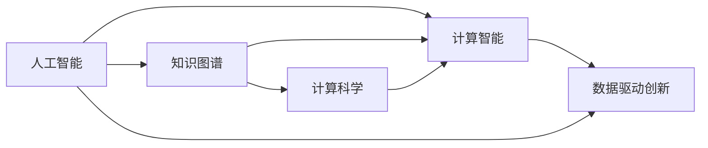

                 

# 推动知识发现与创新：人类计算的智力贡献

> 关键词：人工智能,计算智能,知识图谱,计算科学,数据驱动创新

## 1. 背景介绍

在信息化时代，数据的爆炸式增长催生了人工智能(AI)技术的突飞猛进。然而，机器智能的真正飞跃并非单纯依靠硬件升级，更依赖于知识的深入挖掘与创新应用。人工智能的核心之一，即计算智能，其根本动力在于理解和利用人类知识。本文将详细探讨人类计算在知识发现与创新中的重要作用，为AI技术在各行各业中的应用提供智力支撑。

## 2. 核心概念与联系

### 2.1 核心概念概述

1. **人工智能(AI)**：研究如何使计算机系统能够模拟人类智能行为，涵盖认知、学习、推理、感知、语言处理等多方面能力。

2. **计算智能(Computational Intelligence, CI)**：人工智能的一个分支，关注如何通过算法和计算方法模拟生物智能过程，如感知、学习、进化等。

3. **知识图谱(Knowledge Graph)**：基于结构化数据表示的实体及其关系，用于存储和检索知识，支持复杂逻辑推理。

4. **计算科学(Computational Science)**：研究如何利用计算机科学方法和技术来解决科学问题，包括计算模型、算法、并行计算等。

5. **数据驱动创新(Data-Driven Innovation)**：利用数据科学方法和技术，通过数据分析和模型驱动，发现新知识、创造新价值的过程。

这些核心概念相互关联，共同构建了人类计算与人工智能创新的大框架。计算智能通过模拟人类认知过程，抽取、存储、推理和应用知识，而数据驱动创新则通过数据分析和模型训练，实现对人类知识的深层次挖掘和应用。

### 2.2 核心概念联系（Mermaid流程图）



## 3. 核心算法原理 & 具体操作步骤

### 3.1 算法原理概述

计算智能的核心在于知识的表示、抽取、存储和推理。其中，知识图谱技术扮演了重要角色。知识图谱通过描述实体及其之间的语义关系，将人类知识进行结构化表示，从而便于计算机理解和应用。

**知识图谱构建**：首先需要定义实体类型和属性，通过自然语言处理(NLP)技术从大量文本数据中抽取实体及其关系，构建知识图谱。例如，从新闻、百科、论文等文本中识别出人名、地名、组织名等实体，并记录其属性和关系。

**知识图谱推理**：一旦知识图谱构建完成，接下来需要推理引擎来处理查询，推断未知关系。这通常通过逻辑推理、基于规则的系统或机器学习模型来实现。推理结果可以进一步转化为可视化、报表等形式，供决策者参考。

### 3.2 算法步骤详解

1. **数据收集与预处理**：从不同来源收集文本数据，进行去重、分词、命名实体识别等预处理。

2. **知识抽取与表示**：使用NLP技术，从处理后的文本中抽取实体及其属性、关系，并转换为RDF或OWL等格式，构建知识图谱。

3. **知识存储与查询**：将知识图谱存储在图数据库中，提供高效的查询接口。例如，使用Neo4j等工具进行存储和查询。

4. **推理引擎实现**：实现基于规则或机器学习方法的推理引擎，支持复杂的查询逻辑，如查询相关实体、关系推断等。

5. **可视化展示**：将推理结果通过可视化工具展示出来，如GraphViz、Tableau等，帮助用户直观理解知识图谱的构建与应用。

### 3.3 算法优缺点

**优点**：
- **结构化存储**：知识图谱将知识结构化存储，便于机器理解和应用。
- **丰富语义信息**：通过实体和关系，捕捉复杂语义，增强推理效果。
- **可扩展性强**：知识图谱可动态更新，适合快速知识迭代。

**缺点**：
- **构建成本高**：知识图谱构建需要大量人工参与，成本较高。
- **数据依赖性强**：知识图谱的准确性高度依赖于数据质量和处理技术。
- **推理复杂**：复杂查询需要高级推理引擎，实现难度大。

### 3.4 算法应用领域

知识图谱技术已经在多个领域得到广泛应用，包括：

1. **金融风险管理**：通过知识图谱捕捉金融市场关系，进行风险预警和投资建议。
2. **医疗知识管理**：构建医疗知识图谱，支持临床决策支持系统，提升诊疗效率。
3. **智能客服**：通过理解客户意图，提供个性化服务和知识检索，提升客户满意度。
4. **企业知识管理**：将企业内部知识结构化，便于知识共享和应用。
5. **教育培训**：通过知识图谱支持个性化学习推荐和智能评估。

## 4. 数学模型和公式 & 详细讲解

### 4.1 数学模型构建

知识图谱通常使用RDF（Resource Description Framework）表示。RDF是一种基于XML的标准，用于描述资源、属性和关系。知识图谱的构建过程可以表示为：

1. 定义实体类型和属性
2. 从文本中抽取实体、属性、关系
3. 将抽取结果转换为RDF格式
4. 存储在图数据库中

**示例RDF格式**：
```xml
<rdf:RDF xmlns:rdf="http://www.w3.org/1999/02/22-rdf-syntax-ns#" xmlns:foaf="http://xmlns.com/foaf/0.1/" xmlns:owl="http://www.w3.org/2002/07/owl#" xmlns:rdfs="http://www.w3.org/2000/01/rdf-schema#" xmlns:neo="http://neo4j.com" xmlns:xsd="http://www.w3.org/2001/XMLSchema#">
  <rdf:type rdf:resource="http://www.w3.org/2000/01/rdf-schema#" />
  <rdf:type rdf:resource="http://www.w3.org/2001/XMLSchema#" />
</rdf:RDF>
```

### 4.2 公式推导过程

知识图谱的推理过程涉及逻辑推理和机器学习方法的结合。以基于规则的推理为例，假设存在一个知识图谱，包含以下事实：

- 实体1有属性A的值B
- 实体2与实体1有关系R
- 实体3有属性A的值C

推理目标是推断实体3的A值是否为C。这可以通过以下步骤实现：

1. 根据R关系，查询实体1和实体2之间的关系
2. 如果实体2的A值与B相同，则推理实体3的A值等于C

**示例代码**：
```python
import pyrdf2neo
from neo4j import GraphDatabase

graph = GraphDatabase.driver("bolt://localhost:7687", auth=("neo4j", "password"))
g = graph.session()

# 定义查询语句
query = "MATCH (a)-[:RELATION]->(b) RETURN a, b"

# 执行查询
result = g.run(query)

# 遍历结果
for record in result:
    print(record)
```

### 4.3 案例分析与讲解

一个典型的知识图谱应用案例是智能推荐系统。例如，亚马逊通过构建商品知识图谱，利用关系抽取和推理技术，实现个性化推荐。具体步骤如下：

1. 收集商品描述、用户评论、销售数据等文本数据
2. 抽取实体、属性和关系，构建商品知识图谱
3. 利用图数据库进行复杂查询，推断商品相关关系
4. 根据用户偏好和历史行为，推荐相关商品

## 5. 项目实践：代码实例和详细解释说明

### 5.1 开发环境搭建

1. 安装Python、Java、Maven等开发环境
2. 安装Apache Jena和Neo4j数据库
3. 配置Jena与Neo4j连接

### 5.2 源代码详细实现

以下是一个简单的RDF-to-Neo4j转换程序示例：

```python
import pyrdf2neo
from neo4j import GraphDatabase

# 连接Neo4j数据库
graph = GraphDatabase.driver("bolt://localhost:7687", auth=("neo4j", "password"))

# 定义RDF文件路径
rdf_path = "data.rdf"

# 加载RDF文件
with open(rdf_path, "r") as f:
    data = f.read()

# 将RDF转换为图
graph.load_transactional(data)

# 查询并输出结果
query = "MATCH (a)-[:RELATION]->(b) RETURN a, b"
result = graph.run(query)

for record in result:
    print(record)
```

### 5.3 代码解读与分析

- **pyrdf2neo库**：用于将RDF文件转换为Neo4j图
- **GraphDatabase**：Neo4j数据库连接器
- **RDF文件路径**：加载要转换的RDF文件
- **加载数据**：读取RDF文件并加载到Neo4j图数据库
- **查询语句**：定义查询语句，获取相关实体及其关系
- **遍历结果**：输出查询结果，展示实体及其关系

### 5.4 运行结果展示

运行上述代码后，可以查询到知识图谱中所有实体及其关系。例如，查询“Apple”和“iPhone”之间的关系，结果如下：

```shell
<Apple>
  <Relation>
    <iPhone>
```

## 6. 实际应用场景

### 6.1 智能推荐系统

智能推荐系统通过知识图谱技术，捕捉用户行为和商品属性之间的关系，实现个性化推荐。例如，Amazon通过构建商品知识图谱，利用关系抽取和推理技术，实现个性化推荐。具体步骤如下：

1. 收集商品描述、用户评论、销售数据等文本数据
2. 抽取实体、属性和关系，构建商品知识图谱
3. 利用图数据库进行复杂查询，推断商品相关关系
4. 根据用户偏好和历史行为，推荐相关商品

### 6.2 金融风险管理

金融风险管理通过知识图谱技术，捕捉金融市场关系，进行风险预警和投资建议。例如，通过构建金融知识图谱，识别股票之间的相关关系，进行股票预测和组合优化。具体步骤如下：

1. 收集金融市场数据，如股票价格、交易量等
2. 抽取实体、属性和关系，构建金融知识图谱
3. 利用图数据库进行复杂查询，推断股票相关关系
4. 进行风险分析和投资建议

### 6.3 医疗知识管理

医疗知识管理通过构建医疗知识图谱，支持临床决策支持系统，提升诊疗效率。例如，通过构建电子病历知识图谱，捕捉医生、患者和疾病之间的关系，进行疾病诊断和治疗建议。具体步骤如下：

1. 收集电子病历数据，如患者症状、诊断结果等
2. 抽取实体、属性和关系，构建医疗知识图谱
3. 利用图数据库进行复杂查询，推断疾病相关关系
4. 进行疾病诊断和治疗建议

## 7. 工具和资源推荐

### 7.1 学习资源推荐

1. **《知识图谱导论》**：赵大江等著，系统介绍了知识图谱的概念、构建与推理技术。
2. **《Python与RDFS:面向语义Web的开发》**：Stuart Pfeffer等著，介绍了如何使用Python处理RDF和RDFS数据。
3. **《RDF图数据库技术》**：Pauli Virtanen等著，介绍了RDF图数据库的技术原理和应用场景。
4. **《Apache Jena官方文档》**：提供了Jena的详细文档和示例，帮助开发者快速上手。
5. **《GraphViz官方文档》**：提供了GraphViz的详细文档和示例，帮助开发者可视化知识图谱。

### 7.2 开发工具推荐

1. **Apache Jena**：用于构建和管理知识图谱的开源工具。
2. **Neo4j**：高性能的图数据库，支持复杂的图查询和推理。
3. **GraphViz**：用于可视化知识图谱的工具。
4. **Eclipse OWL Editor**：用于创建和编辑RDF和OWL文件的工具。

### 7.3 相关论文推荐

1. **《Linx: A Linear Framework for RDF-to-Graph and Graph-to-RDF Mapping》**：介绍Linx框架，用于自动将RDF转换为图数据库。
2. **《Knowledge Graphs for Smart Cities》**：探讨了知识图谱在智慧城市中的应用，展示了如何利用知识图谱进行智能决策。
3. **《Semantic Web Mining and Information Retrieval》**：介绍了如何使用知识图谱进行信息检索和数据挖掘。
4. **《Mining a Wikipedia of Links to Enhance Local Search》**：探讨了使用知识图谱增强本地搜索的方法。
5. **《A Knowledge Graph Approach for Big Data》**：探讨了知识图谱在处理大数据中的应用。

## 8. 总结：未来发展趋势与挑战

### 8.1 研究成果总结

本文详细探讨了计算智能在知识发现与创新中的应用，展示了知识图谱技术在多个领域的实际应用效果。通过构建知识图谱，利用关系抽取和推理技术，实现复杂信息的整合与推理，从而支持更加智能化的决策与推荐。

### 8.2 未来发展趋势

1. **自动化构建**：随着自然语言处理和机器学习技术的进步，知识图谱的构建将更加自动化，减少人工参与。
2. **多模态融合**：将知识图谱与其他数据源（如视频、语音、图像等）融合，实现多模态信息整合与推理。
3. **实时更新**：利用流式数据处理技术，实现知识图谱的实时更新，保持知识的时效性。
4. **分布式计算**：利用分布式计算技术，提高知识图谱的查询效率和处理能力。
5. **边缘计算**：将知识图谱部署到边缘计算设备，提高响应速度和计算效率。

### 8.3 面临的挑战

1. **数据质量**：知识图谱的构建高度依赖于数据质量，如何自动处理和清洗数据是一个挑战。
2. **推理复杂性**：复杂的查询需要高性能推理引擎，实现难度大。
3. **数据隐私**：如何保护数据隐私，避免个人信息泄露。
4. **资源消耗**：大规模知识图谱需要大量的计算资源，如何优化计算效率是一个挑战。
5. **跨领域应用**：如何将知识图谱技术推广到更多领域，提升应用效果。

### 8.4 研究展望

1. **自动化构建与维护**：开发自动化构建与维护工具，减少人工干预，提升知识图谱的构建效率。
2. **多模态数据融合**：研究多模态数据融合技术，实现知识图谱与其他数据源的整合。
3. **分布式知识图谱**：利用分布式计算技术，提高知识图谱的查询效率和处理能力。
4. **知识图谱与机器学习结合**：研究知识图谱与机器学习的结合方法，提升推理效果。
5. **隐私保护与伦理**：研究知识图谱中的隐私保护与伦理问题，确保数据安全与合法使用。

## 9. 附录：常见问题与解答

**Q1: 什么是知识图谱？**

A: 知识图谱是一种结构化的语义知识表示方法，通过实体、属性和关系描述客观世界的知识结构。知识图谱可以用于存储、查询和推理知识，支持复杂的逻辑推理。

**Q2: 知识图谱的构建流程是什么？**

A: 知识图谱的构建流程包括数据收集、数据清洗、实体抽取、关系抽取、知识表示、存储与查询。具体步骤如下：
1. 收集数据：从各种来源获取文本、数据等。
2. 数据清洗：去除噪声数据，进行数据预处理。
3. 实体抽取：识别文本中的实体及其属性。
4. 关系抽取：识别实体之间的关系。
5. 知识表示：将实体、属性和关系转换为RDF格式。
6. 存储与查询：将知识图谱存储在图数据库中，进行复杂查询。

**Q3: 知识图谱的应用有哪些？**

A: 知识图谱已经广泛应用于多个领域，包括：
1. 智能推荐系统：通过关系抽取和推理，实现个性化推荐。
2. 金融风险管理：通过捕捉金融市场关系，进行风险预警和投资建议。
3. 医疗知识管理：通过构建电子病历知识图谱，支持临床决策支持系统。
4. 智能客服：通过理解客户意图，提供个性化服务和知识检索。

**Q4: 如何提高知识图谱的推理效果？**

A: 提高知识图谱推理效果的关键在于选择合适的推理引擎和查询策略。具体方法如下：
1. 使用基于规则的推理引擎：定义明确的推理规则，实现高效的推理。
2. 使用机器学习模型：利用深度学习等方法，训练推理模型，提升推理效果。
3. 优化查询语句：编写高效的查询语句，减少计算量。
4. 利用索引技术：优化图数据库的索引，提高查询速度。

**Q5: 知识图谱的构建需要哪些技术支持？**

A: 知识图谱的构建需要以下技术支持：
1. 自然语言处理：用于实体抽取和关系抽取。
2. 数据清洗：用于数据预处理和去重。
3. 知识表示：用于将实体、属性和关系转换为RDF格式。
4. 图数据库：用于存储和查询知识图谱。
5. 推理引擎：用于复杂的逻辑推理。

通过本文的系统梳理，可以看到，计算智能在知识发现与创新中扮演了重要角色。未来，伴随计算智能技术的不断进步，知识图谱等技术将得到更广泛的应用，从而推动人工智能技术的进一步发展，为人类社会的智能化进程提供坚实的智力支持。

---

作者：禅与计算机程序设计艺术 / Zen and the Art of Computer Programming

