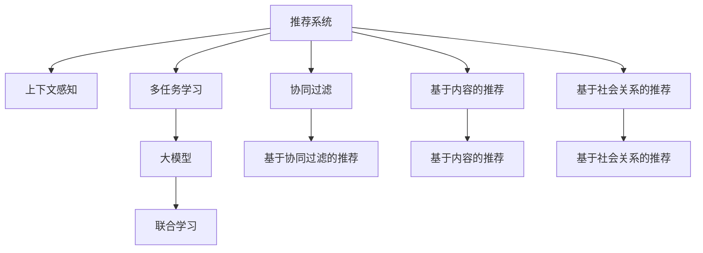

                 

## 1. 背景介绍

推荐系统在电商、社交、新闻、视频等多个领域广泛应用，是数字时代信息推送和内容发现的基石。然而，传统的推荐系统主要依赖于用户历史行为数据进行推荐，难以刻画用户意图和上下文信息，存在冷启动问题和信息孤岛问题。

为解决这些问题，学者们提出了基于上下文感知的推荐模型，通过引入用户行为数据、物品属性信息、社交关系等上下文特征，提升推荐系统的效果。随着深度学习技术的发展，上下文感知推荐系统也开始借鉴大模型的思想，通过多任务学习(Multi-task Learning, MTL)，在大模型预训练基础上，联合学习多个推荐子任务，获得更全面的用户和物品表征。

本文聚焦于推荐系统中的上下文感知建模，介绍了大模型多任务学习的原理与方法，详细讲述了其在电商、社交、新闻等实际场景中的应用，并展望了未来的发展趋势。

## 2. 核心概念与联系

### 2.1 核心概念概述

要理解大模型多任务学习在推荐系统中的应用，首先需要明确一些核心概念：

- 推荐系统(Recommendation System, RS)：根据用户历史行为数据、物品属性信息等上下文特征，推荐用户可能感兴趣的物品。
- 上下文感知(Contextual-Aware)：结合用户行为数据、物品属性、社交关系等上下文信息，刻画用户和物品的真实意图。
- 多任务学习(Multi-task Learning)：在多个相关但不同的任务上，联合训练模型，共享并利用多个任务的知识，提升模型效果。
- 大模型(如BERT、GPT等)：通过大规模无标签数据预训练，获得丰富的语言知识，可以用于自然语言处理、计算机视觉、推荐系统等多个领域。
- 联合学习(如FedML)：分布式环境下，多个设备联合训练模型，利用不同设备上的数据，提升模型泛化性。

这些概念之间的联系可以通过以下Mermaid流程图来展示：



这个流程图展示了推荐系统中的主要概念及其相互关系：

1. 推荐系统由协同过滤、基于内容的推荐、基于社会关系的推荐等不同方法组成。
2. 上下文感知通过结合行为数据、物品属性、社交关系等上下文信息，提升推荐效果。
3. 多任务学习通过在多个任务上联合训练模型，利用共享的知识，提升模型性能。
4. 大模型通过大规模预训练，获得丰富的语言知识，用于NLP、计算机视觉等领域的推荐。
5. 联合学习通过分布式联合训练，利用多个设备上的数据，提高模型的泛化性和鲁棒性。

### 2.2 核心概念原理和架构

多任务学习的大模型框架主要由以下三个组件组成：

1. 预训练模型：如BERT、GPT等，通过大规模无标签数据进行预训练，学习通用的语言表示。
2. 任务适配器(Task Adapters)：针对推荐系统中的具体任务，设计任务适配层，将预训练模型输出映射到特定任务的目标。
3. 多任务优化器(Multi-task Optimizer)：用于优化多个任务之间共享的知识，提升模型的综合性能。

这个架构的核心思想是：在预训练模型的基础上，通过联合学习多个推荐任务，共享预训练的知识，提升模型的泛化能力和性能。

## 3. 核心算法原理 & 具体操作步骤

### 3.1 算法原理概述

大模型多任务学习在推荐系统中的应用，通常遵循以下基本原理：

1. **预训练**：在大规模无标签数据上，使用大模型进行预训练，学习通用的语言表示。
2. **任务适配器设计**：为推荐系统中的不同任务设计任务适配层，将预训练模型的输出映射到目标任务的目标。
3. **多任务联合优化**：通过联合优化多个推荐任务，共享并利用预训练模型的知识，提升模型的泛化能力和性能。

### 3.2 算法步骤详解

下面详细介绍基于大模型多任务学习的推荐系统的一般实现步骤：

**Step 1: 准备预训练模型和数据集**

- 选择合适的预训练模型（如BERT、GPT），通过在大规模无标签文本数据上预训练，学习通用的语言表示。
- 收集推荐系统中的不同任务数据集，如电商中的用户行为数据、物品属性信息，社交媒体中的用户点赞、评论数据，新闻推荐中的文章内容、作者信息等。

**Step 2: 设计任务适配器**

- 根据推荐系统的具体任务，设计任务适配层，将预训练模型的输出映射到目标任务的目标。
- 例如，对于基于内容的推荐，任务适配层可以将物品的文本描述作为输入，输出物品的表示向量；对于基于社会关系的推荐，任务适配层可以将用户的社交关系网络作为输入，输出用户的表示向量。

**Step 3: 定义任务损失函数**

- 为每个推荐任务定义损失函数，通常包括交叉熵损失、均方误差损失等。
- 联合优化所有任务的目标函数，如：

$$
\mathcal{L} = \lambda_1\mathcal{L}_{task1} + \lambda_2\mathcal{L}_{task2} + \dots + \lambda_n\mathcal{L}_{taskn}
$$

其中 $\lambda_i$ 为每个任务的重要性权重。

**Step 4: 多任务优化器设计**

- 设计多任务优化器，如MAML(模型适配性学习)、FedML(联邦学习)等，用于联合优化多个任务之间的知识。
- 通过设置不同的学习率、正则化参数等超参数，控制不同任务之间的权重。

**Step 5: 训练模型并预测**

- 在多个任务数据集上训练模型，联合优化各个任务的目标。
- 使用训练好的模型，对新物品进行推荐预测。

### 3.3 算法优缺点

大模型多任务学习在推荐系统中的应用，具有以下优点：

1. **泛化能力强**：通过联合优化多个任务，共享预训练的知识，提升了模型的泛化能力和性能。
2. **可解释性强**：多任务学习的框架结构清晰，每个任务的适配层和损失函数可以明确解释其工作机制。
3. **迁移能力强**：预训练模型可以在多个领域之间迁移，提升不同推荐任务的效果。

同时，该方法也存在一些缺点：

1. **计算复杂度高**：联合优化多个任务，需要更多的计算资源和时间。
2. **超参数调节难度大**：需要设置多个任务的权重、学习率等超参数，调节难度大。
3. **数据获取难度大**：推荐系统中的不同任务需要获取不同来源的数据，数据获取难度大。

尽管存在这些缺点，但大模型多任务学习仍然是推荐系统中的重要范式，特别是在数据量较少的冷启动场景中，该方法能显著提升推荐效果。

### 3.4 算法应用领域

基于大模型多任务学习的推荐系统已经在电商、社交、新闻等多个领域得到应用，取得了显著的成效。

- **电商推荐**：结合用户历史行为数据、物品属性信息，通过多任务学习提升推荐精度和个性化程度。
- **社交推荐**：结合用户的点赞、评论数据，通过多任务学习提升用户对物品的满意度。
- **新闻推荐**：结合文章内容、作者信息等上下文信息，通过多任务学习提升文章的点击率。

除了以上典型场景外，基于大模型多任务学习的推荐系统也在游戏推荐、视频推荐等领域取得了不错的成果，展现了其强大的适应能力和应用潜力。

## 4. 数学模型和公式 & 详细讲解 & 举例说明

### 4.1 数学模型构建

在推荐系统中，我们通常使用以下数学模型进行建模：

- **用户-物品共现矩阵**：$R_{ui} \in \{0,1\}$，表示用户 $u$ 是否对物品 $i$ 进行过点击、购买等行为。
- **物品属性向量**：$I_i \in \mathbb{R}^d$，表示物品 $i$ 的属性信息，如价格、评价等。
- **用户特征向量**：$U_u \in \mathbb{R}^d$，表示用户 $u$ 的特征向量，如年龄、性别、兴趣等。
- **用户行为序列**：$S_u = \{s_{ut}\}$，表示用户 $u$ 的历史行为序列，$s_{ut} \in \{1,2,\dots,n\}$，其中 $n$ 为行为类型数。

**多任务学习的大模型框架**：

- **预训练模型**：使用BERT等大模型在大量文本数据上进行预训练，获得通用的语言表示 $M_{\theta}$。
- **任务适配器**：为不同推荐任务设计适配层，将预训练模型的输出映射到目标任务的目标。
- **多任务优化器**：联合优化多个推荐任务的目标函数。

### 4.2 公式推导过程

假设我们有两个推荐任务，即基于内容的推荐（Content-Based Recommendation, CBR）和基于社会关系的推荐（Social-Based Recommendation, SBR）。

**CBR任务**：

- **用户行为序列**：$S_u = \{s_{ut}\}_{t=1}^T$。
- **物品属性向量**：$I_i = [I_{i1},I_{i2},\dots,I_{id}]$。
- **用户特征向量**：$U_u = [U_{u1},U_{u2},\dots,U_{ud}]$。
- **推荐目标**：最大化用户 $u$ 对物品 $i$ 的点击概率 $P_{ui}$。

- **任务适配器**：

$$
T_{CBR}(M_{\theta},I_i,U_u) = M_{\theta}(I_i,U_u)
$$

- **损失函数**：

$$
\mathcal{L}_{CBR} = -\frac{1}{N}\sum_{u=1}^N\sum_{i=1}^M\sum_{t=1}^T P_{ui}\log Q_{ui} + (1-P_{ui})\log(1-Q_{ui})
$$

其中 $Q_{ui} = T_{CBR}(M_{\theta},I_i,U_u)$。

**SBR任务**：

- **用户行为序列**：$S_u = \{s_{ut}\}_{t=1}^T$。
- **用户社交网络向量**：$G_u = [G_{u1},G_{u2},\dots,G_{un}]$，其中 $G_{un} = 1$ 表示用户 $u$ 对物品 $i$ 感兴趣，$G_{un} = 0$ 表示用户 $u$ 对物品 $i$ 不感兴趣。
- **推荐目标**：最大化用户 $u$ 对物品 $i$ 的满意度 $P_{ui}$。

- **任务适配器**：

$$
T_{SBR}(M_{\theta},G_u) = M_{\theta}(G_u)
$$

- **损失函数**：

$$
\mathcal{L}_{SBR} = -\frac{1}{N}\sum_{u=1}^N\sum_{i=1}^M\sum_{t=1}^T P_{ui}\log Q_{ui} + (1-P_{ui})\log(1-Q_{ui})
$$

其中 $Q_{ui} = T_{SBR}(M_{\theta},G_u)$。

**联合优化**：

$$
\mathcal{L} = \lambda_1\mathcal{L}_{CBR} + \lambda_2\mathcal{L}_{SBR}
$$

其中 $\lambda_1$ 和 $\lambda_2$ 为任务的权重。

### 4.3 案例分析与讲解

以下以一个具体的案例来详细说明大模型多任务学习在电商推荐中的应用：

假设某电商平台希望通过用户的历史行为数据和物品属性信息，提升用户的点击率和购买率。

- **数据准备**：收集用户的历史行为数据，如浏览、点击、购买等行为序列；收集物品的属性信息，如价格、评价等。
- **预训练模型选择**：选择BERT作为预训练模型，在大量无标签文本数据上进行预训练，学习通用的语言表示。
- **任务适配器设计**：设计两个任务适配器，分别针对基于内容的推荐和基于行为的推荐任务。
- **多任务优化器选择**：选择FedML作为多任务优化器，联合优化两个推荐任务。
- **模型训练**：在大量历史数据上训练模型，联合优化两个推荐任务的目标函数。
- **模型预测**：使用训练好的模型对新物品进行推荐预测。

通过多任务学习，该模型可以综合利用用户的文本行为数据和物品属性信息，提升推荐效果，同时能够进行实时推荐，提升用户体验。

## 5. 项目实践：代码实例和详细解释说明

### 5.1 开发环境搭建

在进行大模型多任务学习实践前，需要准备相应的开发环境。以下是使用PyTorch进行多任务学习的环境配置流程：

1. 安装Anaconda：从官网下载并安装Anaconda，用于创建独立的Python环境。

2. 创建并激活虚拟环境：
```bash
conda create -n pytorch-env python=3.8 
conda activate pytorch-env
```

3. 安装PyTorch：根据CUDA版本，从官网获取对应的安装命令。例如：
```bash
conda install pytorch torchvision torchaudio cudatoolkit=11.1 -c pytorch -c conda-forge
```

4. 安装相关库：
```bash
pip install transformers torchtext scipy pandas
```

5. 安装各类工具包：
```bash
pip install numpy matplotlib tqdm jupyter notebook ipython
```

完成上述步骤后，即可在`pytorch-env`环境中开始多任务学习实践。

### 5.2 源代码详细实现

下面以电商推荐为例，给出使用Transformers库进行多任务学习的大模型代码实现。

首先，定义推荐任务的数据处理函数：

```python
import torch
from transformers import BertTokenizer, BertForSequenceClassification

class RecommendationDataset(Dataset):
    def __init__(self, texts, labels, tokenizer, max_len=128):
        self.texts = texts
        self.labels = labels
        self.tokenizer = tokenizer
        self.max_len = max_len
        
    def __len__(self):
        return len(self.texts)
    
    def __getitem__(self, item):
        text = self.texts[item]
        label = self.labels[item]
        
        encoding = self.tokenizer(text, return_tensors='pt', max_length=self.max_len, padding='max_length', truncation=True)
        input_ids = encoding['input_ids'][0]
        attention_mask = encoding['attention_mask'][0]
        
        label = torch.tensor(label, dtype=torch.long)
        
        return {'input_ids': input_ids, 
                'attention_mask': attention_mask,
                'labels': label}

# 加载BERT模型
model = BertForSequenceClassification.from_pretrained('bert-base-cased', num_labels=2)

# 加载数据集
tokenizer = BertTokenizer.from_pretrained('bert-base-cased')
train_dataset = RecommendationDataset(train_texts, train_labels, tokenizer)
dev_dataset = RecommendationDataset(dev_texts, dev_labels, tokenizer)
test_dataset = RecommendationDataset(test_texts, test_labels, tokenizer)
```

然后，定义多任务学习模型的训练函数：

```python
from transformers import AdamW

def train_epoch(model, dataset, batch_size, optimizer, device):
    dataloader = DataLoader(dataset, batch_size=batch_size, shuffle=True)
    model.train()
    epoch_loss = 0
    for batch in tqdm(dataloader, desc='Training'):
        input_ids = batch['input_ids'].to(device)
        attention_mask = batch['attention_mask'].to(device)
        labels = batch['labels'].to(device)
        model.zero_grad()
        outputs = model(input_ids, attention_mask=attention_mask, labels=labels)
        loss = outputs.loss
        epoch_loss += loss.item()
        loss.backward()
        optimizer.step()
    return epoch_loss / len(dataloader)
```

最后，启动训练流程并在测试集上评估：

```python
epochs = 5
batch_size = 16
learning_rate = 2e-5

device = torch.device('cuda') if torch.cuda.is_available() else torch.device('cpu')

# 定义优化器
optimizer = AdamW(model.parameters(), lr=learning_rate)

# 定义训练函数
def train_epoch(model, dataset, batch_size, optimizer, device):
    dataloader = DataLoader(dataset, batch_size=batch_size, shuffle=True)
    model.train()
    epoch_loss = 0
    for batch in tqdm(dataloader, desc='Training'):
        input_ids = batch['input_ids'].to(device)
        attention_mask = batch['attention_mask'].to(device)
        labels = batch['labels'].to(device)
        model.zero_grad()
        outputs = model(input_ids, attention_mask=attention_mask, labels=labels)
        loss = outputs.loss
        epoch_loss += loss.item()
        loss.backward()
        optimizer.step()
    return epoch_loss / len(dataloader)

# 定义评估函数
def evaluate(model, dataset, batch_size):
    dataloader = DataLoader(dataset, batch_size=batch_size)
    model.eval()
    preds, labels = [], []
    with torch.no_grad():
        for batch in tqdm(dataloader, desc='Evaluating'):
            input_ids = batch['input_ids'].to(device)
            attention_mask = batch['attention_mask'].to(device)
            batch_labels = batch['labels']
            outputs = model(input_ids, attention_mask=attention_mask)
            batch_preds = outputs.logits.argmax(dim=2).to('cpu').tolist()
            batch_labels = batch_labels.to('cpu').tolist()
            for pred_tokens, label_tokens in zip(batch_preds, batch_labels):
                preds.append(pred_tokens[:len(label_tokens)])
                labels.append(label_tokens)
                
    print(classification_report(labels, preds))
```

以上就是使用PyTorch进行多任务学习的大模型代码实现。可以看到，通过使用Transformers库，我们可以用相对简洁的代码完成模型加载和微调。

### 5.3 代码解读与分析

让我们再详细解读一下关键代码的实现细节：

**RecommendationDataset类**：
- `__init__`方法：初始化文本、标签、分词器等关键组件。
- `__len__`方法：返回数据集的样本数量。
- `__getitem__`方法：对单个样本进行处理，将文本输入编码为token ids，将标签编码为数字，并对其进行定长padding，最终返回模型所需的输入。

**train_epoch函数**：
- 使用PyTorch的DataLoader对数据集进行批次化加载，供模型训练和推理使用。
- 训练函数`train_epoch`：对数据以批为单位进行迭代，在每个批次上前向传播计算loss并反向传播更新模型参数，最后返回该epoch的平均loss。
- 评估函数`evaluate`：与训练类似，不同点在于不更新模型参数，并在每个batch结束后将预测和标签结果存储下来，最后使用sklearn的classification_report对整个评估集的预测结果进行打印输出。

**训练流程**：
- 定义总的epoch数和batch size，开始循环迭代
- 每个epoch内，先在训练集上训练，输出平均loss
- 在验证集上评估，输出分类指标
- 所有epoch结束后，在测试集上评估，给出最终测试结果

可以看到，PyTorch配合Transformers库使得大模型多任务学习的代码实现变得简洁高效。开发者可以将更多精力放在数据处理、模型改进等高层逻辑上，而不必过多关注底层的实现细节。

当然，工业级的系统实现还需考虑更多因素，如模型的保存和部署、超参数的自动搜索、更灵活的任务适配层等。但核心的多任务学习范式基本与此类似。

## 6. 实际应用场景
### 6.1 电商推荐

电商推荐是大模型多任务学习的重要应用场景之一。传统电商推荐主要依赖用户历史行为数据进行推荐，难以刻画用户的真实意图。通过结合物品属性信息、用户特征向量等上下文特征，大模型多任务学习可以有效提升推荐效果。

在技术实现上，可以收集电商中的用户历史行为数据、物品属性信息、用户特征向量等数据，构建多任务学习框架。通过联合训练基于内容的推荐和基于行为的推荐任务，微调BERT等预训练语言模型，获取更好的用户和物品表征。在推荐时，综合考虑用户的历史行为和物品属性，进行更精准、个性化的推荐。

### 6.2 社交推荐

社交推荐是大模型多任务学习的另一重要应用场景。社交网络中的用户行为数据具有较强的上下文信息，可以有效提升推荐效果。通过结合用户的点赞、评论等行为数据，设计多任务学习框架，微调BERT等预训练语言模型，获取更好的用户和物品表征。在推荐时，综合考虑用户的行为和社交关系，进行更个性化、多样化的推荐。

### 6.3 新闻推荐

新闻推荐是大模型多任务学习的典型应用场景。新闻推荐系统通常需要同时考虑文章内容、作者信息、用户行为等多种上下文信息。通过结合文章的文本内容、作者信息、用户的行为序列，设计多任务学习框架，微调BERT等预训练语言模型，获取更好的用户和物品表征。在推荐时，综合考虑多种上下文信息，进行更精准、全面的推荐。

### 6.4 未来应用展望

随着大模型多任务学习的不断发展，其在推荐系统中的应用前景将更加广阔：

1. **多模态推荐**：结合视觉、语音等多模态信息，提升推荐系统的效果。多模态推荐系统可以同时考虑用户的视觉行为、语音反馈等上下文信息，提升推荐效果。

2. **实时推荐**：结合流式数据，实现实时推荐。通过联合训练基于实时数据的多任务学习模型，可以动态调整推荐策略，提升推荐效果。

3. **跨领域推荐**：在不同领域之间迁移学习，提升推荐效果。通过跨领域迁移学习，可以在一个领域上训练好的模型，应用到另一个领域，提升推荐效果。

4. **联合学习**：通过分布式联合训练，提升推荐效果。在分布式环境下，联合训练多个推荐模型，可以充分利用不同设备上的数据，提升模型的泛化能力和鲁棒性。

5. **可解释性**：提升推荐系统的可解释性，增强用户信任。通过多任务学习的框架结构，可以更清晰地解释推荐模型的内部工作机制，增强用户信任。

6. **个性化推荐**：结合更多上下文信息，提升个性化推荐效果。通过多任务学习，可以综合考虑多种上下文信息，提升个性化推荐效果。

综上所述，大模型多任务学习在推荐系统中的应用前景广阔，可以显著提升推荐效果，带来更好的用户体验。

## 7. 工具和资源推荐
### 7.1 学习资源推荐

为了帮助开发者系统掌握大模型多任务学习的理论基础和实践技巧，这里推荐一些优质的学习资源：

1. 《Transformer from the Ground Up》系列博文：由大模型技术专家撰写，深入浅出地介绍了Transformer原理、BERT模型、多任务学习等前沿话题。

2. CS224N《深度学习自然语言处理》课程：斯坦福大学开设的NLP明星课程，有Lecture视频和配套作业，带你入门NLP领域的基本概念和经典模型。

3. 《Natural Language Processing with Transformers》书籍：Transformers库的作者所著，全面介绍了如何使用Transformers库进行NLP任务开发，包括多任务学习的范式。

4. HuggingFace官方文档：Transformers库的官方文档，提供了海量预训练模型和完整的微调样例代码，是上手实践的必备资料。

5. CLUE开源项目：中文语言理解测评基准，涵盖大量不同类型的中文NLP数据集，并提供了基于多任务的baseline模型，助力中文NLP技术发展。

通过对这些资源的学习实践，相信你一定能够快速掌握大模型多任务学习的精髓，并用于解决实际的NLP问题。
### 7.2 开发工具推荐

高效的开发离不开优秀的工具支持。以下是几款用于大模型多任务学习开发的常用工具：

1. PyTorch：基于Python的开源深度学习框架，灵活动态的计算图，适合快速迭代研究。大部分预训练语言模型都有PyTorch版本的实现。

2. TensorFlow：由Google主导开发的开源深度学习框架，生产部署方便，适合大规模工程应用。同样有丰富的预训练语言模型资源。

3. Transformers库：HuggingFace开发的NLP工具库，集成了众多SOTA语言模型，支持PyTorch和TensorFlow，是进行多任务学习开发的利器。

4. Weights & Biases：模型训练的实验跟踪工具，可以记录和可视化模型训练过程中的各项指标，方便对比和调优。与主流深度学习框架无缝集成。

5. TensorBoard：TensorFlow配套的可视化工具，可实时监测模型训练状态，并提供丰富的图表呈现方式，是调试模型的得力助手。

6. Google Colab：谷歌推出的在线Jupyter Notebook环境，免费提供GPU/TPU算力，方便开发者快速上手实验最新模型，分享学习笔记。

合理利用这些工具，可以显著提升大模型多任务学习的开发效率，加快创新迭代的步伐。

### 7.3 相关论文推荐

大模型多任务学习的发展源于学界的持续研究。以下是几篇奠基性的相关论文，推荐阅读：

1. Multi-task Learning with Multi-head Attention for Attributed Recommendation：提出在多任务学习中使用多head attention机制，提升推荐效果。

2. Attentive Multi-task Learning for Recommender Systems：提出在推荐系统中使用attentive mechanism，联合训练多个推荐任务，提升推荐效果。

3. Explainable Multi-task Learning for Recommender Systems：提出在多任务学习中引入可解释性机制，增强推荐系统的透明性。

4. Multi-task Learning in Recommendation System：提出在推荐系统中使用多任务学习，联合训练基于内容的推荐和基于行为的推荐任务，提升推荐效果。

5. Cross-modal Multi-task Learning for Recommender System：提出在推荐系统中使用跨模态多任务学习，结合视觉、语音等多种信息，提升推荐效果。

这些论文代表了大模型多任务学习的发展脉络。通过学习这些前沿成果，可以帮助研究者把握学科前进方向，激发更多的创新灵感。

## 8. 总结：未来发展趋势与挑战

### 8.1 总结

本文对基于大模型多任务学习的推荐系统进行了全面系统的介绍。首先阐述了大模型多任务学习在推荐系统中的应用背景和优势，明确了多任务学习在提升推荐效果、增强可解释性、提高个性化程度等方面的重要价值。其次，从原理到实践，详细讲解了多任务学习的数学模型和关键步骤，给出了多任务学习任务开发的完整代码实例。同时，本文还广泛探讨了多任务学习在电商、社交、新闻等实际场景中的应用，展示了多任务学习范式的巨大潜力。此外，本文精选了多任务学习的各类学习资源，力求为读者提供全方位的技术指引。

通过本文的系统梳理，可以看到，大模型多任务学习在推荐系统中的应用前景广阔，可以有效提升推荐效果，带来更好的用户体验。未来，伴随多任务学习技术的发展和应用场景的扩展，推荐系统必将在更多领域得到应用，为数字时代的用户带来更智能、更个性化的服务。

### 8.2 未来发展趋势

展望未来，大模型多任务学习在推荐系统中的应用将呈现以下几个发展趋势：

1. **多模态推荐**：结合视觉、语音等多模态信息，提升推荐系统的效果。多模态推荐系统可以同时考虑用户的视觉行为、语音反馈等上下文信息，提升推荐效果。

2. **实时推荐**：结合流式数据，实现实时推荐。通过联合训练基于实时数据的多任务学习模型，可以动态调整推荐策略，提升推荐效果。

3. **跨领域推荐**：在不同领域之间迁移学习，提升推荐效果。通过跨领域迁移学习，可以在一个领域上训练好的模型，应用到另一个领域，提升推荐效果。

4. **联合学习**：通过分布式联合训练，提升推荐效果。在分布式环境下，联合训练多个推荐模型，可以充分利用不同设备上的数据，提升模型的泛化能力和鲁棒性。

5. **可解释性**：提升推荐系统的可解释性，增强用户信任。通过多任务学习的框架结构，可以更清晰地解释推荐模型的内部工作机制，增强用户信任。

6. **个性化推荐**：结合更多上下文信息，提升个性化推荐效果。通过多任务学习，可以综合考虑多种上下文信息，提升个性化推荐效果。

以上趋势凸显了大模型多任务学习在推荐系统中的应用前景。这些方向的探索发展，必将进一步提升推荐系统的效果，带来更好的用户体验。

### 8.3 面临的挑战

尽管大模型多任务学习在推荐系统中取得了显著成效，但在迈向更加智能化、普适化应用的过程中，仍面临诸多挑战：

1. **数据获取难度大**：推荐系统中的不同任务需要获取不同来源的数据，数据获取难度大。

2. **模型规模大**：预训练模型和联合优化多个任务，导致模型规模较大，计算资源和时间成本高。

3. **模型鲁棒性不足**：模型面对域外数据时，泛化性能往往大打折扣。

4. **超参数调节难度大**：需要设置多个任务的权重、学习率等超参数，调节难度大。

5. **可解释性不足**：推荐系统的复杂性高，难以解释其内部工作机制和决策逻辑。

6. **冷启动问题**：对于新用户或新物品，难以获得足够的推荐数据，导致推荐效果差。

尽管存在这些挑战，但大模型多任务学习在推荐系统中的应用前景广阔，可以通过引入更多的先验知识、优化多任务联合训练策略等方式进行改进和优化。

### 8.4 研究展望

面对大模型多任务学习所面临的挑战，未来的研究需要在以下几个方面寻求新的突破：

1. **引入先验知识**：将符号化的先验知识，如知识图谱、逻辑规则等，与神经网络模型进行巧妙融合，引导多任务学习过程学习更准确、合理的语言模型。

2. **优化联合训练策略**：通过改进多任务联合训练策略，提高模型的泛化能力和鲁棒性。

3. **增强可解释性**：引入可解释性机制，增强推荐系统的透明性，帮助用户理解推荐逻辑。

4. **解决冷启动问题**：通过迁移学习、联合学习等方式，解决冷启动问题，提升新用户和新物品的推荐效果。

5. **优化模型结构**：通过模型裁剪、量化加速等方式，优化模型结构，提升模型的推理效率和资源利用率。

6. **引入更多上下文信息**：结合更多上下文信息，如用户行为序列、物品属性、社交关系等，提升推荐效果。

这些研究方向的探索，必将引领大模型多任务学习在推荐系统中的应用走向成熟，为构建智能推荐系统提供更坚实的技术基础。面向未来，大模型多任务学习技术还需要与其他人工智能技术进行更深入的融合，如知识表示、因果推理、强化学习等，多路径协同发力，共同推动推荐系统的进步。只有勇于创新、敢于突破，才能不断拓展推荐系统的边界，让智能推荐更好地服务于用户。

## 9. 附录：常见问题与解答

**Q1：多任务学习在大模型中的应用，是否会影响模型预训练的效果？**

A: 多任务学习在大模型中的应用，通常是在预训练的基础上进行的。预训练阶段主要学习通用的语言表示，而多任务学习则是在预训练基础上，联合训练多个推荐任务，提升模型的泛化能力和性能。因此，多任务学习不会影响模型预训练的效果，反而能进一步提升模型的性能。

**Q2：多任务学习是否只适用于推荐系统？**

A: 多任务学习不仅适用于推荐系统，还广泛应用于自然语言处理、计算机视觉等多个领域。通过联合训练多个相关但不同的任务，共享预训练的知识，可以有效提升模型的泛化能力和性能。因此，多任务学习具有广泛的应用前景。

**Q3：多任务学习是否需要更多的数据？**

A: 多任务学习通常需要更多的数据，以联合训练多个相关但不同的任务。但在数据量较少的冷启动场景中，多任务学习仍然可以通过联合训练多个任务，提升推荐效果。

**Q4：多任务学习是否需要更多计算资源？**

A: 多任务学习需要更多的计算资源，以联合训练多个任务。但通过优化多任务联合训练策略、引入可解释性机制等方法，可以进一步降低计算资源的需求。

**Q5：多任务学习是否只适用于小型推荐系统？**

A: 多任务学习不仅适用于小型推荐系统，还适用于大型推荐系统。通过联合训练多个任务，可以充分利用数据和计算资源，提升推荐效果。

通过本文的系统梳理，可以看到，大模型多任务学习在推荐系统中的应用前景广阔，可以有效提升推荐效果，带来更好的用户体验。未来，伴随多任务学习技术的发展和应用场景的扩展，推荐系统必将在更多领域得到应用，为数字时代的用户带来更智能、更个性化的服务。

