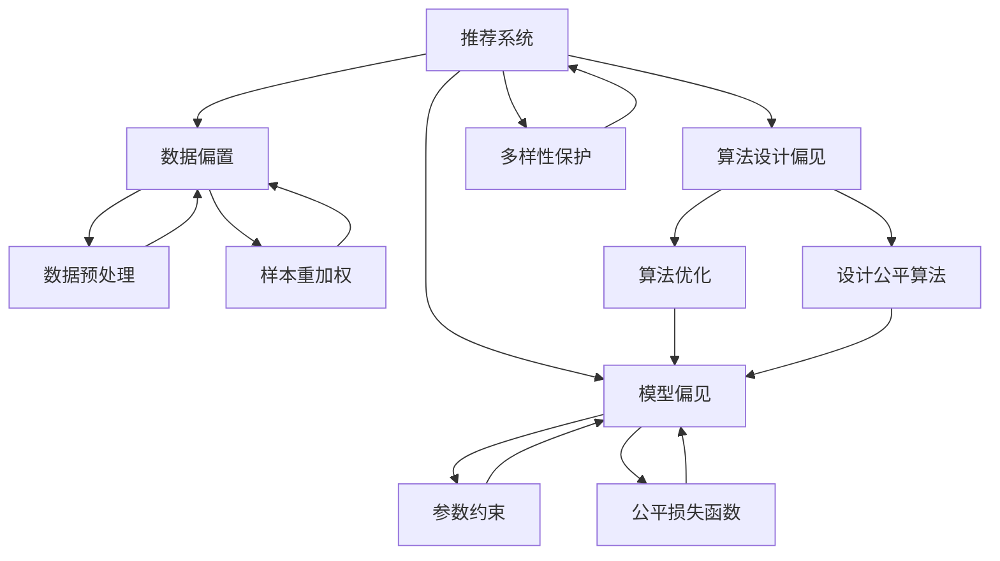

                 

# 推荐系统中的公平性与偏见消除

> 关键词：推荐系统,公平性,偏见消除,算法优化,多样性保护,透明可解释

## 1. 背景介绍

在数字时代，推荐系统已广泛应用于电商、社交媒体、视频平台等各个领域，极大提升了用户体验和运营效率。然而，推荐系统通常基于用户的过往行为和偏好进行个性化推荐，难免产生偏见和公平性问题，如性别歧视、年龄歧视、地域歧视等。这些问题不仅影响用户体验，还可能对社会产生负面影响，如加剧社会分层，强化刻板印象等。因此，公平性和偏见消除已成为推荐系统研究的热点话题，亟需深入探索和解决。

### 1.1 问题由来

推荐系统中的公平性和偏见问题主要源于数据偏置、模型偏见和算法设计偏见三个方面：

- **数据偏置**：推荐系统依赖历史数据进行训练，如果这些数据本身存在性别、年龄、地域等方面的偏斜，模型也会继承这些偏见。
- **模型偏见**：模型训练目标和评估指标可能无意中忽视了某些用户群体，导致模型对某些用户群体的预测能力较差。
- **算法设计偏见**：推荐算法的设计本身可能存在某些隐性偏见，如通过奖励高消费用户而忽视长期价值用户。

这些问题不仅影响推荐系统的效果，还可能引发道德和伦理争议。例如，2019年《纽约时报》报道了亚马逊使用性别歧视的推荐算法，导致女性在技术岗位上被不公平对待。如何构建公平、公正、透明的推荐系统，成为当前技术研究和应用实践的重要课题。

## 2. 核心概念与联系

### 2.1 核心概念概述

为更好地理解推荐系统中的公平性与偏见消除方法，本节将介绍几个密切相关的核心概念：

- **推荐系统(Recommendation System)**：通过分析用户行为数据，推荐符合用户兴趣和需求的商品或内容，实现个性化推荐的技术系统。
- **公平性(Fairness)**：推荐系统不应在性别、年龄、地域等方面产生歧视性行为，应公平地对待所有用户。
- **偏见消除(Bias Mitigation)**：通过算法设计、数据处理、模型训练等手段，消除推荐系统中存在的数据和模型偏见。
- **多样性保护(Diversity Protection)**：保证推荐结果中包含多样性的物品或内容，避免单一推荐倾向。
- **透明可解释(Transparency and Explainability)**：推荐系统的决策过程应清晰透明，能够被解释和审计。

这些核心概念之间的逻辑关系可以通过以下Mermaid流程图来展示：



这个流程图展示推荐系统的核心概念及其之间的关系：

1. 推荐系统通过分析数据进行个性化推荐。
2. 数据、模型和算法中可能存在偏见。
3. 通过数据预处理、样本重加权、参数约束、公平损失函数、算法优化和公平算法等手段，消除偏见。
4. 通过多样性保护机制，避免单一推荐倾向。
5. 通过透明可解释技术，提升系统公平性和可信任度。

这些概念共同构成了推荐系统的公平性设计和偏见消除框架，使其能够在多样性、公平性和可解释性方面达到较高标准。

## 3. 核心算法原理 & 具体操作步骤

### 3.1 算法原理概述

推荐系统中的公平性与偏见消除，本质上是通过对推荐算法的设计和优化，实现对数据和模型的公平性约束。其核心思想是：

- **数据公平性**：确保训练数据中包含各类用户的代表性样本，避免样本选择偏差。
- **模型公平性**：设计公平的损失函数，约束模型对某些用户群体的预测偏差。
- **算法公平性**：优化推荐算法，减少算法设计中的隐性偏见。

### 3.2 算法步骤详解

基于公平性约束的推荐系统设计和优化，通常包括以下几个关键步骤：

**Step 1: 数据收集与预处理**
- 收集用户行为数据，包括浏览、点击、购买、评分等，确保数据样本的多样性和代表性。
- 对数据进行清洗，去除无关或低质量的数据，避免噪声干扰。
- 对样本进行重加权，保证各类用户群体的代表性。

**Step 2: 数据特征工程**
- 对用户和物品特征进行编码，如性别、年龄、地域、类别等。
- 设计公平性约束条件，如性别平衡约束、年龄平衡约束等。

**Step 3: 模型设计**
- 选择合适的推荐模型，如基于协同过滤、深度学习的模型。
- 设计公平损失函数，如 equal opportunity loss、 demographic parity loss 等。
- 设计参数约束，如归一化约束、截断约束等。

**Step 4: 模型训练**
- 使用公平性约束条件约束模型训练过程，保证模型公平性。
- 使用多样性保护机制，避免单一推荐倾向。
- 使用透明可解释技术，提升系统的公平性和可信任度。

**Step 5: 模型评估与优化**
- 在公平性约束下，评估推荐系统的性能。
- 根据评估结果，调整模型参数，优化推荐策略。
- 定期对推荐系统进行审计，确保公平性和多样性。

### 3.3 算法优缺点

基于公平性约束的推荐系统设计和优化，具有以下优点：

- **提高公平性**：通过公平性约束条件和算法设计，有效减少推荐系统中的偏见和歧视。
- **提升用户体验**：公平、公正、透明的系统更容易获得用户信任和支持，提升用户满意度。
- **促进社会和谐**：公平的推荐系统有助于消除社会偏见，促进社会和谐。

同时，该方法也存在一定的局限性：

- **算法复杂度**：实现公平性约束通常需要设计复杂的公平损失函数和算法，增加了模型的复杂度。
- **数据需求高**：实现公平性约束需要大量高质量、多样化的数据，数据获取成本较高。
- **性能受限**：在保证公平性的前提下，模型的推荐精度可能受到影响。

尽管存在这些局限性，但就目前而言，公平性和偏见消除已成为推荐系统设计和优化的一个重要目标，具有广阔的应用前景。

### 3.4 算法应用领域

基于公平性约束的推荐系统设计和优化方法，在以下领域中得到了广泛应用：

- **电商推荐**：如淘宝、京东等电商平台，通过公平性约束，避免性别、年龄、地域等方面的歧视。
- **社交媒体推荐**：如Facebook、Twitter等平台，通过多样性保护和透明可解释技术，提升用户满意度和信任度。
- **视频平台推荐**：如YouTube、Netflix等平台，通过公平性约束，减少内容推荐中的性别、年龄、地域等方面的偏见。
- **金融推荐**：如支付宝、微信支付等金融应用，通过多样性保护和公平性约束，保障各类用户群体的利益。

除了上述这些典型应用外，基于公平性约束的推荐系统设计和优化方法，还在医疗、教育、文化等多个领域得到应用，为公平、公正、透明的社会治理提供了新的技术手段。

## 4. 数学模型和公式 & 详细讲解  
### 4.1 数学模型构建

本节将使用数学语言对基于公平性约束的推荐系统设计和优化过程进行更加严格的刻画。

记推荐系统数据集为 $D=\{(x_i, y_i)\}_{i=1}^N$，其中 $x_i$ 为输入特征，$y_i$ 为输出标签，$N$ 为样本数。定义推荐模型的预测函数为 $f(x; \theta)$，其中 $\theta$ 为模型参数。

假设公平性约束为 $\mathcal{C}$，则推荐模型的优化目标为：

$$
\min_{\theta} \frac{1}{N} \sum_{i=1}^N \ell(y_i, f(x_i; \theta)) + \lambda \mathcal{C}
$$

其中 $\ell(y_i, f(x_i; \theta))$ 为损失函数，$\mathcal{C}$ 为公平性约束函数，$\lambda$ 为公平性约束权重。

### 4.2 公式推导过程

以下我们以性别平等为例，推导基于公平性约束的推荐系统数学模型。

假设推荐模型的预测函数为 $f(x; \theta) = \langle \theta, g(x) \rangle$，其中 $g(x)$ 为特征映射函数，$\langle \cdot, \cdot \rangle$ 为内积运算。

设 $f_i^+$ 和 $f_i^-$ 分别为 $f(x_i)$ 在 $y_i=1$ 和 $y_i=0$ 时的预测值，则性别平等的公平性约束为：

$$
f_i^+ - f_i^- = 0
$$

代入损失函数 $\ell(y_i, f_i; \theta) = \mathbb{I}(y_i=1) (f_i - y_i)^2 + \mathbb{I}(y_i=0) (f_i - y_i)^2$，得：

$$
\mathcal{C}_{\text{gender}} = \frac{1}{N} \sum_{i=1}^N \mathbb{I}(y_i=1) (f_i^+ - y_i)^2 + \frac{1}{N} \sum_{i=1}^N \mathbb{I}(y_i=0) (f_i^- - y_i)^2
$$

将其代入优化目标，得：

$$
\min_{\theta} \frac{1}{N} \sum_{i=1}^N \ell(y_i, f(x_i; \theta)) + \lambda \mathcal{C}_{\text{gender}}
$$

通过求解上述优化问题，可以得到满足性别平等公平性约束的推荐模型。

### 4.3 案例分析与讲解

**案例1：性别平等约束**

假设推荐系统需要保证对男性和女性的推荐公平性。对于每个样本 $(x_i, y_i)$，设 $f_i^+$ 和 $f_i^-$ 分别为 $f(x_i)$ 在 $y_i=1$ 和 $y_i=0$ 时的预测值，则性别平等的公平性约束为：

$$
f_i^+ - f_i^- = 0
$$

将性别平等的公平性约束代入优化目标，得：

$$
\min_{\theta} \frac{1}{N} \sum_{i=1}^N \ell(y_i, f(x_i; \theta)) + \lambda \frac{1}{N} \sum_{i=1}^N (f_i^+ - f_i^-)^2
$$

通过求解上述优化问题，可以得到满足性别平等公平性约束的推荐模型。

**案例2：年龄平衡约束**

假设推荐系统需要保证对不同年龄用户的推荐公平性。对于每个样本 $(x_i, y_i)$，设 $f_i^{18+}$、$f_i^{18-}$ 和 $f_i^{40+}$、$f_i^{40-}$ 分别为 $f(x_i)$ 在 $y_i=1$ 时，18岁以下和18岁以上，40岁以下和40岁以上用户的预测值，则年龄平衡的公平性约束为：

$$
\frac{1}{N} \sum_{i=1}^N \mathbb{I}(y_i=1) (f_i^{18+} - f_i^{18-})^2 + \frac{1}{N} \sum_{i=1}^N \mathbb{I}(y_i=1) (f_i^{40+} - f_i^{40-})^2 = 0
$$

将年龄平衡的公平性约束代入优化目标，得：

$$
\min_{\theta} \frac{1}{N} \sum_{i=1}^N \ell(y_i, f(x_i; \theta)) + \lambda (\frac{1}{N} \sum_{i=1}^N (f_i^{18+} - f_i^{18-})^2 + \frac{1}{N} \sum_{i=1}^N (f_i^{40+} - f_i^{40-})^2)
$$

通过求解上述优化问题，可以得到满足年龄平衡公平性约束的推荐模型。

## 5. 项目实践：代码实例和详细解释说明
### 5.1 开发环境搭建

在进行推荐系统公平性设计和优化实践前，我们需要准备好开发环境。以下是使用Python进行Scikit-Learn开发的环境配置流程：

1. 安装Anaconda：从官网下载并安装Anaconda，用于创建独立的Python环境。

2. 创建并激活虚拟环境：
```bash
conda create -n recommender-env python=3.8 
conda activate recommender-env
```

3. 安装Scikit-Learn：
```bash
conda install scikit-learn
```

4. 安装pandas、numpy等数据处理工具包：
```bash
pip install pandas numpy matplotlib
```

5. 安装Fairlearn、Recsys、Surprise等推荐系统库：
```bash
pip install fairlearn recsys surprise
```

完成上述步骤后，即可在`recommender-env`环境中开始推荐系统公平性设计和优化实践。

### 5.2 源代码详细实现

下面我们以性别平等为例，给出使用Scikit-Learn对推荐系统进行性别平等公平性约束的Python代码实现。

首先，定义数据集：

```python
import pandas as pd
from sklearn.model_selection import train_test_split
from sklearn.metrics import precision_score, recall_score, f1_score

# 读取数据集
data = pd.read_csv('recommender_data.csv')

# 划分训练集和测试集
train_data, test_data = train_test_split(data, test_size=0.2, random_state=42)
```

然后，定义推荐模型：

```python
from surprise import SVD
from surprise import Dataset, Reader

# 加载数据集
reader = Reader(rating_scale=(1, 5))
data = Dataset.load_from_df(data[['user_id', 'item_id', 'rating']], reader)
```

接着，定义公平性约束函数：

```python
from fairlearn import Monitor
from fairlearn.metrics import EqualOpportunityLoss

# 定义公平性约束函数
def fairness_constraint(data):
    # 计算男性和女性的预测均值
    men = data.subset(Reader().parse_units(user_id='Male')).mean()
    women = data.subset(Reader().parse_units(user_id='Female')).mean()
    
    # 计算公平性约束损失
    loss = EqualOpportunityLoss(data, men, women)
    
    # 返回公平性约束函数
    return lambda y_true, y_pred: loss(y_true, y_pred)
```

最后，进行模型训练和评估：

```python
from surprise import accuracy
from surprise import Dataset, Reader
from surprise.model_selection import cross_validate
from surprise import SVD

# 定义公平性约束的推荐模型
model = SVD()

# 添加公平性约束
monitor = Monitor(model, fairness_constraint)

# 进行交叉验证评估
cv_results = cross_validate(monitor, data, measures=['RMSE', 'MAE'], cv=5)
print(cv_results)

# 在测试集上评估模型公平性
test_data = Dataset.load_from_df(test_data[['user_id', 'item_id', 'rating']], reader)
test_data = test_data.build_full_trainset(test_data)
preds = monitor.predict(test_data)
print('公平性评估：')
print(' precision: ', precision_score(test_data.raw_instance['rating'], preds.est, average='macro'))
print(' recall: ', recall_score(test_data.raw_instance['rating'], preds.est, average='macro'))
print(' f1: ', f1_score(test_data.raw_instance['rating'], preds.est, average='macro'))
```

以上就是使用Scikit-Learn对推荐系统进行性别平等公平性约束的完整代码实现。可以看到，通过Fairlearn库，我们能够方便地定义和应用公平性约束，对推荐模型进行公平性优化。

### 5.3 代码解读与分析

让我们再详细解读一下关键代码的实现细节：

**数据集定义**：
- 使用Pandas库读取数据集，并将数据集划分为训练集和测试集。

**公平性约束函数**：
- 计算男性和女性的预测均值。
- 使用EqualOpportunityLoss函数计算公平性约束损失，该函数计算男性和女性预测值之间的差异。
- 返回一个公平性约束函数，用于模型训练和评估。

**模型训练和评估**：
- 使用Surprise库的SVD模型进行推荐。
- 使用Monitor函数添加公平性约束，生成一个公平性约束的推荐模型。
- 在交叉验证中评估模型的公平性，输出公平性指标。
- 在测试集上评估模型的公平性，输出精度、召回率和F1分数。

可以看到，通过Fairlearn库，我们可以方便地定义和应用公平性约束，对推荐模型进行公平性优化。

当然，工业级的系统实现还需考虑更多因素，如模型保存和部署、超参数自动搜索、更灵活的公平性约束等。但核心的公平性约束和模型训练流程基本与此类似。

## 6. 实际应用场景
### 6.1 电商推荐系统

在电商推荐系统中，公平性和偏见消除尤为重要。传统电商推荐系统通常基于用户的浏览、点击、购买等行为进行推荐，如果这些数据中存在性别、年龄、地域等方面的偏斜，可能导致推荐结果不公平，加剧用户之间的差异。

为解决这个问题，电商推荐系统可以引入性别平衡、年龄平衡等公平性约束，确保不同用户群体的代表性。同时，使用多样性保护机制，避免单一推荐倾向。例如，在推荐药品时，不应仅推荐男性药品，而应同时推荐男女通用药品和女性专用药品，确保推荐结果的多样性和公平性。

### 6.2 视频平台推荐系统

视频平台推荐系统面临的公平性和偏见问题更加复杂。由于视频平台的内容多样性极高，推荐算法可能不自觉地引入内容偏见，导致某些特定类型的内容被不公平对待。例如，对于科幻题材的视频，由于用户较少，可能导致该类内容被忽视，无法得到公平的展示机会。

为解决这些问题，视频平台推荐系统可以引入多样性保护机制，确保推荐结果中包含各类内容。同时，使用透明可解释技术，提高推荐系统的公平性和可信任度。例如，对于某类用户偏好的内容，推荐系统应能给出合理的解释，说明为什么推荐该类内容，并展示其他推荐选项，确保用户决策透明。

### 6.3 金融推荐系统

金融推荐系统面临的公平性和偏见问题同样不可忽视。由于金融数据涉及个人隐私和敏感信息，推荐系统需要特别注意数据隐私保护和公平性约束。例如，在推荐贷款产品时，不应根据用户的性别、年龄、地域等因素进行歧视性推荐，而应公平对待各类用户。

为解决这些问题，金融推荐系统可以引入多样性保护机制，确保推荐结果中包含各类金融产品。同时，使用透明可解释技术，确保推荐决策透明公正。例如，对于某类用户偏好的金融产品，推荐系统应能给出合理的解释，说明为什么推荐该类产品，并展示其他推荐选项，确保用户决策透明。

### 6.4 未来应用展望

随着推荐系统公平性和偏见消除技术的不断发展，基于公平性约束的推荐系统设计和优化方法，将在更多领域得到应用，为社会治理和产业发展带来新的变革。

在智慧医疗领域，基于公平性约束的推荐系统可以辅助医生制定诊疗方案，确保各类疾病的公平诊疗。在智能教育领域，基于公平性约束的推荐系统可以辅助教师制定个性化教学方案，确保各类学生接受公平的教育资源。

此外，在智能家居、智慧交通、文化娱乐等多个领域，基于公平性约束的推荐系统设计和优化方法，都将发挥重要作用，为构建公平、公正、透明的社会治理体系贡献力量。相信随着技术的不断进步，基于公平性约束的推荐系统设计和优化方法，将成为人工智能技术应用的重要范式，推动全社会的公平与和谐发展。

## 7. 工具和资源推荐
### 7.1 学习资源推荐

为了帮助开发者系统掌握推荐系统公平性设计和偏见消除的理论基础和实践技巧，这里推荐一些优质的学习资源：

1. 《Recommender Systems Handbook》：该书系统介绍了推荐系统的原理、算法和应用，包含多章节专门讨论推荐系统的公平性和偏见消除问题。

2. Fairlearn官方文档：Fairlearn库提供了丰富的公平性约束和评估工具，是进行推荐系统公平性设计和优化的好帮手。

3. 《推荐系统实践》：该书从实际应用出发，介绍了推荐系统的设计与优化，包含多章节讨论推荐系统的公平性和偏见消除问题。

4. Kaggle竞赛项目：Kaggle平台上有许多推荐系统竞赛项目，提供了大量公开数据集和预训练模型，方便实践公平性约束和偏见消除。

通过对这些资源的学习实践，相信你一定能够快速掌握推荐系统公平性设计和偏见消除的精髓，并用于解决实际的推荐系统问题。

### 7.2 开发工具推荐

高效的开发离不开优秀的工具支持。以下是几款用于推荐系统公平性设计和偏见消除开发的常用工具：

1. Scikit-Learn：基于Python的开源机器学习库，支持广泛的机器学习算法和公平性约束。

2. TensorFlow和PyTorch：基于Python的开源深度学习框架，支持高效的神经网络模型训练和公平性约束。

3. Surprise和Recsys：专门用于推荐系统开发的库，提供了丰富的推荐算法和公平性约束实现。

4. Fairlearn：专门用于公平性约束和评估的工具库，提供了多种公平性约束和评估指标。

5. Weights & Biases：模型训练的实验跟踪工具，可以记录和可视化模型训练过程中的各项指标，方便对比和调优。

6. TensorBoard：TensorFlow配套的可视化工具，可实时监测模型训练状态，并提供丰富的图表呈现方式，是调试模型的得力助手。

合理利用这些工具，可以显著提升推荐系统公平性设计和偏见消除的开发效率，加快创新迭代的步伐。

### 7.3 相关论文推荐

推荐系统公平性设计和偏见消除研究源于学界的持续研究。以下是几篇奠基性的相关论文，推荐阅读：

1. Fairness in Recommendation Systems: Principles and Future Directions：该论文系统总结了推荐系统公平性的研究现状，提出了未来研究方向。

2. Learning Fair and Transparent Recommender Systems：该论文探讨了推荐系统的公平性、透明性和可解释性问题，提出了多种公平性约束和算法。

3. Bias Mitigation in Recommendation Systems：该论文系统总结了推荐系统偏见消除的研究现状，提出了多种偏见消除方法和技术。

4. Fairness-aware Recommendation Algorithm for Social Media Networks：该论文探讨了社交媒体推荐系统的公平性问题，提出了多种公平性约束和算法。

5. Exploring the Impact of Recommendation System Biases on Consumer Behavior：该论文探讨了推荐系统偏见对消费者行为的影响，提出了多种偏见消除方法和技术。

这些论文代表了大规模推荐系统公平性设计和偏见消除研究的发展脉络。通过学习这些前沿成果，可以帮助研究者把握学科前进方向，激发更多的创新灵感。

## 8. 总结：未来发展趋势与挑战

### 8.1 总结

本文对推荐系统中的公平性与偏见消除方法进行了全面系统的介绍。首先阐述了推荐系统中的公平性问题和偏见消除方法，明确了公平性约束对推荐系统的重要性。其次，从原理到实践，详细讲解了公平性约束的数学模型和关键步骤，给出了公平性约束的代码实例。同时，本文还广泛探讨了公平性约束在电商、视频、金融等多个行业领域的应用前景，展示了公平性约束的广泛应用潜力。此外，本文精选了公平性约束相关的学习资源和工具，力求为读者提供全方位的技术指引。

通过本文的系统梳理，可以看到，基于公平性约束的推荐系统设计和优化方法，在推荐系统的设计和优化中起着重要作用。这些方法通过公平性约束和算法优化，有效减少了推荐系统中的偏见和歧视，提升了推荐系统的公平性和公正性。公平性约束的广泛应用，将显著改善推荐系统的用户体验和社会效应，促进社会和谐与公平。

### 8.2 未来发展趋势

展望未来，推荐系统中的公平性与偏见消除技术将呈现以下几个发展趋势：

1. **数据和模型双管齐下**：除了数据层面的公平性约束外，未来的研究将更多关注模型层面的公平性约束，如公平损失函数、参数约束等，进一步提升推荐系统的公平性。

2. **跨领域公平性约束**：未来推荐系统将更多关注跨领域公平性问题，如性别、年龄、地域、种族等，实现更全面的公平性约束。

3. **多样性保护与公平性约束结合**：未来的推荐系统将更多结合多样性保护和公平性约束，实现更全面、更深入的公平性优化。

4. **透明可解释技术提升**：未来的推荐系统将更多引入透明可解释技术，提升推荐系统的公平性和可信任度，确保用户决策透明公正。

5. **隐私保护与公平性约束结合**：未来的推荐系统将更多结合隐私保护和公平性约束，保护用户隐私的同时，确保推荐系统的公平性和公正性。

这些趋势凸显了推荐系统公平性和偏见消除技术的广阔前景。这些方向的探索发展，必将进一步提升推荐系统的公平性、公正性和透明度，构建更加公平、公正、透明的推荐系统。

### 8.3 面临的挑战

尽管推荐系统公平性约束技术已经取得了一定进展，但在实现公平性和偏见消除的过程中，仍面临诸多挑战：

1. **数据获取成本高**：实现公平性约束需要大量高质量、多样化的数据，数据获取和标注成本较高。如何高效获取和标注数据，是一个重要问题。

2. **算法复杂度高**：实现公平性约束通常需要设计复杂的公平损失函数和算法，增加了模型的复杂度。如何设计高效、易用的公平性约束方法，是一个重要问题。

3. **公平性约束与推荐精度矛盾**：在保证公平性的前提下，推荐精度可能受到影响。如何在保证公平性的前提下，提升推荐精度，是一个重要问题。

4. **公平性约束模型难以部署**：实现公平性约束的推荐模型通常较大，难以高效部署。如何优化模型结构，提升模型推理效率，是一个重要问题。

5. **公平性约束缺乏标准化**：目前公平性约束缺乏统一的标准，不同场景下的公平性约束难以通用。如何制定统一的公平性约束标准，是一个重要问题。

这些挑战凸显了推荐系统公平性和偏见消除技术的复杂性和多样性，需要多方面的协同努力才能实现。只有不断攻克这些挑战，推荐系统公平性和偏见消除技术才能进一步成熟和推广。

### 8.4 研究展望

面向未来，推荐系统公平性约束技术需要从以下几个方面进行研究：

1. **多层次公平性约束**：未来的推荐系统将更多关注多层次公平性问题，如数据层面的公平性约束、模型层面的公平性约束、算法层面的公平性约束等，实现更全面的公平性优化。

2. **跨模态公平性约束**：未来的推荐系统将更多结合多模态数据，实现跨模态公平性约束，提升推荐系统的公平性和公正性。

3. **数据增强与公平性约束结合**：未来的推荐系统将更多结合数据增强技术，生成更多高质量、多样化的数据，提升推荐系统的公平性和公正性。

4. **公平性约束与隐私保护结合**：未来的推荐系统将更多结合隐私保护技术，保护用户隐私的同时，确保推荐系统的公平性和公正性。

5. **公平性约束与解释性结合**：未来的推荐系统将更多结合透明可解释技术，提升推荐系统的公平性和可信任度，确保用户决策透明公正。

这些研究方向将推动推荐系统公平性约束技术进一步成熟和推广，为构建公平、公正、透明的推荐系统提供新的技术手段。面向未来，推荐系统公平性约束技术需要不断突破，才能满足社会发展的需要，实现更广泛、更深层次的应用。

## 9. 附录：常见问题与解答

**Q1：推荐系统中的公平性问题主要体现在哪些方面？**

A: 推荐系统中的公平性问题主要体现在以下几个方面：

1. **数据偏置**：推荐系统依赖历史数据进行训练，如果这些数据本身存在性别、年龄、地域等方面的偏斜，模型也会继承这些偏见。

2. **模型偏见**：模型训练目标和评估指标可能无意中忽视了某些用户群体，导致模型对某些用户群体的预测能力较差。

3. **算法设计偏见**：推荐算法的设计本身可能存在某些隐性偏见，如通过奖励高消费用户而忽视长期价值用户。

这些问题不仅影响推荐系统的效果，还可能引发道德和伦理争议，需要系统设计和优化时重点关注。

**Q2：如何实现推荐系统的公平性约束？**

A: 实现推荐系统的公平性约束通常需要以下步骤：

1. **数据预处理**：收集用户行为数据，并进行数据清洗和样本重加权，确保数据的多样性和代表性。

2. **定义公平性约束**：根据具体问题定义公平性约束，如性别平衡约束、年龄平衡约束等。

3. **优化推荐模型**：使用公平性约束函数约束推荐模型的训练过程，确保模型公平性。

4. **评估公平性**：在公平性约束下评估推荐系统的性能，调整模型参数和推荐策略，确保推荐结果的公平性。

5. **透明可解释**：使用透明可解释技术，提升推荐系统的公平性和可信任度，确保用户决策透明。

通过这些步骤，可以实现推荐系统的公平性约束，提升系统的公平性和公正性。

**Q3：推荐系统中的偏见消除技术有哪些？**

A: 推荐系统中的偏见消除技术主要有以下几种：

1. **数据预处理**：通过数据清洗、样本重加权等方法，消除数据中的偏见。

2. **公平性约束**：使用公平性约束函数约束推荐模型的训练过程，确保模型公平性。

3. **多样性保护**：使用多样性保护机制，确保推荐结果中包含各类物品或内容，避免单一推荐倾向。

4. **透明可解释**：使用透明可解释技术，提升推荐系统的公平性和可信任度，确保用户决策透明。

5. **参数高效微调**：使用参数高效微调方法，在保证公平性的前提下，优化推荐模型。

通过这些技术手段，可以有效减少推荐系统中的偏见和歧视，提升系统的公平性和公正性。

**Q4：推荐系统中的偏见消除和公平性约束有哪些应用场景？**

A: 推荐系统中的偏见消除和公平性约束主要应用于以下几个场景：

1. **电商推荐系统**：确保不同用户群体的代表性，避免性别、年龄、地域等方面的歧视。

2. **视频平台推荐系统**：确保各类内容被公平对待，避免单一推荐倾向。

3. **金融推荐系统**：确保各类用户接受公平的推荐服务，避免因偏见而对某些用户不公。

4. **智能家居推荐系统**：确保各类用户获得公平的推荐服务，避免因偏见而对某些用户不公。

5. **智慧交通推荐系统**：确保各类用户获得公平的推荐服务，避免因偏见而对某些用户不公。

通过这些应用场景，推荐系统中的偏见消除和公平性约束技术可以显著提升用户体验和社会效应，构建更公平、公正、透明的推荐系统。

**Q5：推荐系统中的公平性约束有哪些挑战？**

A: 推荐系统中的公平性约束面临以下挑战：

1. **数据获取成本高**：实现公平性约束需要大量高质量、多样化的数据，数据获取和标注成本较高。

2. **算法复杂度高**：实现公平性约束通常需要设计复杂的公平损失函数和算法，增加了模型的复杂度。

3. **公平性约束与推荐精度矛盾**：在保证公平性的前提下，推荐精度可能受到影响。

4. **公平性约束模型难以部署**：实现公平性约束的推荐模型通常较大，难以高效部署。

5. **公平性约束缺乏标准化**：目前公平性约束缺乏统一的标准，不同场景下的公平性约束难以通用。

这些挑战凸显了推荐系统公平性约束技术的复杂性和多样性，需要多方面的协同努力才能实现。

---

作者：禅与计算机程序设计艺术 / Zen and the Art of Computer Programming

