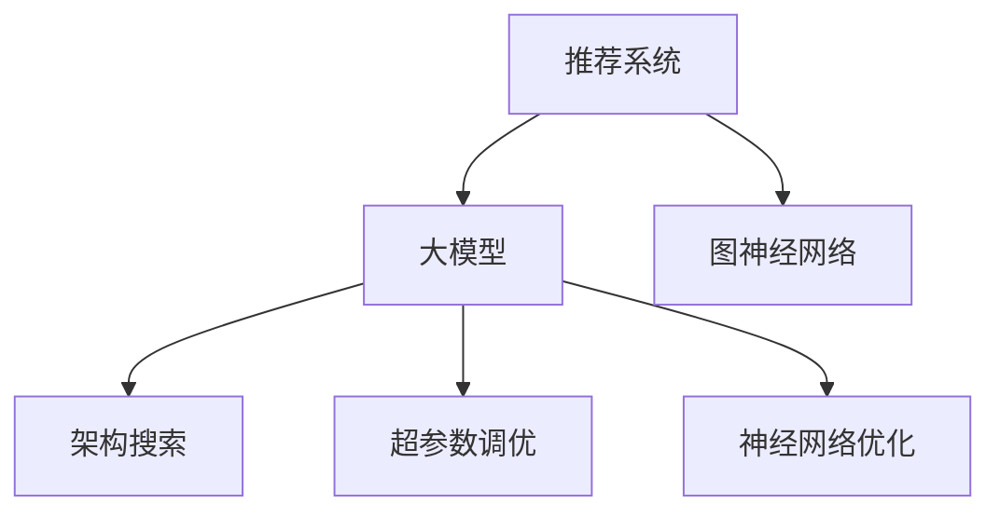

                 

# 推荐系统中的大模型图神经架构搜索

> 关键词：大模型，图神经网络，架构搜索，推荐系统，强化学习，神经网络优化，超参数调优，深度学习

## 1. 背景介绍

### 1.1 问题由来

推荐系统是互联网时代的重要技术，其核心目标是通过用户行为数据，预测用户对未交互物品的偏好，从而为用户推荐个性化的内容。传统的协同过滤和矩阵分解等推荐算法，往往依赖用户-物品评分矩阵，难以处理冷启动问题和新物品推荐。大模型的崛起为推荐系统带来了新的希望，通过预训练语言模型，挖掘用户与物品之间的语义关系，实现更为智能化的推荐。

然而，尽管大模型在推荐系统上取得了一定进展，但仍存在诸多挑战：模型规模庞大、计算资源消耗大、超参数众多、训练过程复杂等。特别是，模型架构和超参数的选择直接影响到模型的性能和效率，因此如何高效地设计推荐模型，成为当前研究的热点问题。

## 2. 核心概念与联系

### 2.1 核心概念概述

为更好地理解推荐系统中的大模型图神经架构搜索方法，本节将介绍几个密切相关的核心概念：

- 推荐系统(Recommendation System)：通过用户行为数据，预测用户对未交互物品的偏好，从而为用户推荐个性化内容的技术。
- 大模型(Large Model)：以自回归(如GPT)或自编码(如BERT)模型为代表的大规模预训练语言模型。通过在大规模无标签文本语料上进行预训练，学习通用的语言表示，具备强大的语言理解和生成能力。
- 图神经网络(Graph Neural Network, GNN)：一类特殊的神经网络，利用图结构，在节点和边之间传递信息，实现节点表示学习。
- 架构搜索(Architecture Search)：通过自动化手段，在给定条件下寻找最优模型架构的过程。通常使用强化学习、遗传算法等方法。
- 超参数调优(Hyperparameter Tuning)：针对模型训练过程中的超参数进行优化，以提高模型性能。
- 神经网络优化(Neural Network Optimization)：利用优化算法，优化神经网络模型的参数，使其达到最佳的预测效果。

这些核心概念之间的逻辑关系可以通过以下Mermaid流程图来展示：



这个流程图展示了大模型在推荐系统中的应用，通过架构搜索、超参数调优和神经网络优化等技术手段，构建出性能优异的推荐模型。

## 3. 核心算法原理 & 具体操作步骤

### 3.1 算法原理概述

推荐系统中的大模型图神经架构搜索，本质上是一个多目标优化的过程。其核心思想是：利用图神经网络对用户与物品的语义关系进行建模，在给定的架构空间中搜索最优的模型架构，同时通过超参数调优和神经网络优化手段，提高模型的性能和效率。

形式化地，设推荐任务为 $T$，预训练语言模型为 $M_{\theta}$，图神经网络架构为 $G=(V,E)$，其中 $V$ 为节点集，$E$ 为边集，则架构搜索的目标可以表示为：

$$
\mathcal{L}(G,\theta) = \mathcal{L}_{\text{perf}}(G,\theta) + \mathcal{L}_{\text{complex}}(G)
$$

其中 $\mathcal{L}_{\text{perf}}$ 为目标性能损失函数，$\mathcal{L}_{\text{complex}}$ 为模型复杂度损失函数。

在优化过程中，通过强化学习、遗传算法等手段，在架构空间中探索最优的架构组合。同时，通过调整模型参数 $\theta$ 和超参数 $\eta$，优化模型在推荐任务上的性能。

### 3.2 算法步骤详解

基于大模型图神经架构搜索的推荐系统优化流程，一般包括以下几个关键步骤：

**Step 1: 准备数据集**
- 收集推荐任务相关的用户行为数据、物品属性数据等。
- 对数据进行预处理，包括去噪、归一化、特征工程等。

**Step 2: 构建图神经网络架构**
- 在图神经网络的节点空间和边空间中，设计候选的架构组合。
- 通常使用图神经网络的基础架构，如GCN、GAT等，在节点和边之间传递信息。
- 在边空间中设计不同种类的边，如注意力边、加权边、残差边等。

**Step 3: 定义优化目标**
- 定义推荐性能损失函数 $\mathcal{L}_{\text{perf}}$，通常使用平均绝对误差(MAE)、均方根误差(MSE)、均方误差(MSE)等指标。
- 定义模型复杂度损失函数 $\mathcal{L}_{\text{complex}}$，通常使用模型参数数量、计算复杂度等指标。
- 综合考虑性能和复杂度，定义多目标优化函数 $\mathcal{L}(G,\theta)$。

**Step 4: 优化模型参数和超参数**
- 使用强化学习、遗传算法、贝叶斯优化等方法，在架构空间中搜索最优的模型架构。
- 调整模型参数 $\theta$ 和超参数 $\eta$，进行神经网络优化。
- 根据优化目标函数 $\mathcal{L}(G,\theta)$，更新模型参数和超参数。

**Step 5: 评估模型性能**
- 在验证集上评估模型性能，选择性能最优的模型。
- 调整模型超参数，优化模型性能。
- 在测试集上评估模型性能，对比微调前后的效果。

以上是基于大模型图神经架构搜索的推荐系统优化流程。在实际应用中，还需要针对具体任务的特点，对优化过程的各个环节进行优化设计，如改进优化算法、设计合适的损失函数等，以进一步提升模型性能。

### 3.3 算法优缺点

基于大模型图神经架构搜索的方法具有以下优点：

1. 灵活性高。架构搜索可以在大规模的候选架构空间中，自动探索最优的模型结构，适用于多种推荐任务。
2. 泛化能力强。通过深度学习技术，架构搜索能够学习到用户与物品之间的语义关系，适应不同领域的推荐场景。
3. 效果显著。架构搜索能够自动调整模型复杂度，在保证性能的同时，减少计算资源消耗。
4. 可扩展性强。架构搜索可以与现有的推荐算法结合，构建更加复杂、高效的推荐模型。

同时，该方法也存在一定的局限性：

1. 搜索空间复杂。架构搜索需要在庞大的候选空间中搜索最优模型，计算复杂度较高。
2. 超参数依赖。架构搜索的效果很大程度上依赖于超参数的选择，调参过程较为繁琐。
3. 模型解释性不足。架构搜索得到的模型往往较为复杂，难以解释其内部工作机制。
4. 过拟合风险。架构搜索可能过度拟合训练数据，导致泛化性能下降。

尽管存在这些局限性，但就目前而言，基于大模型图神经架构搜索的方法仍是推荐系统优化的一个重要范式。未来相关研究的重点在于如何进一步降低搜索空间复杂度，提高超参数优化效率，同时兼顾模型解释性和鲁棒性等因素。

### 3.4 算法应用领域

基于大模型图神经架构搜索的方法，已经在推荐系统、信息检索、社交网络等多个领域得到广泛应用，显著提升了推荐效果和系统性能。

在推荐系统中，架构搜索可以应用于各种推荐场景，如商品推荐、音乐推荐、视频推荐等。通过搜索最优的模型架构，在保证推荐性能的同时，减少计算资源消耗，提升推荐速度和效率。

在信息检索系统中，架构搜索可以应用于文本匹配、图像检索等任务，通过搜索最优的模型架构，提升检索精度和速度。

在社交网络中，架构搜索可以应用于好友推荐、内容推荐等场景，通过搜索最优的模型架构，提升用户活跃度和满意度。

除了上述这些经典应用外，架构搜索还被创新性地应用到更多场景中，如多模态信息融合、推荐算法优化等，为推荐系统的创新提供了新的思路。

## 4. 数学模型和公式 & 详细讲解 & 举例说明

### 4.1 数学模型构建

本节将使用数学语言对基于大模型图神经架构搜索的推荐系统进行更加严格的刻画。

设推荐任务为 $T$，用户行为数据为 $D=\{(u_i,i_j)\}_{i=1}^N, u_i \in U, i_j \in I$，其中 $U$ 为用户集，$I$ 为物品集。假设图神经网络为 $G=(V,E)$，节点表示用户，边表示用户与物品之间的关系。设预训练语言模型为 $M_{\theta}$，节点表示为向量 $h_u \in \mathbb{R}^d$，物品表示为向量 $h_i \in \mathbb{R}^d$。

定义用户与物品的语义关系为 $r_{ui}$，通常使用点积表示：

$$
r_{ui} = h_u \cdot h_i
$$

推荐任务的目标是最大化用户对物品的偏好评分 $y_{ui}$，即：

$$
\max_{h_u,h_i} \frac{1}{N} \sum_{i=1}^N \mathcal{L}_{\text{perf}}(y_{ui},r_{ui})
$$

其中 $\mathcal{L}_{\text{perf}}$ 为目标性能损失函数，通常使用平均绝对误差(MAE)、均方根误差(MSE)、均方误差(MSE)等指标。

### 4.2 公式推导过程

以下我们以点积表示法为例，推导平均绝对误差(MAE)损失函数及其梯度的计算公式。

假设用户 $u_i$ 对物品 $i_j$ 的偏好评分 $y_{ui} \in \{0,1\}$，模型预测的语义关系为 $r_{ui} = h_u \cdot h_i$。则MAE损失函数为：

$$
\mathcal{L}_{\text{perf}} = \frac{1}{N} \sum_{i=1}^N |y_{ui} - \text{sgn}(r_{ui})|
$$

其中 $\text{sgn}(\cdot)$ 为符号函数。

根据链式法则，损失函数对用户表示 $h_u$ 的梯度为：

$$
\frac{\partial \mathcal{L}_{\text{perf}}}{\partial h_u} = \frac{1}{N} \sum_{i=1}^N \frac{\partial |y_{ui} - \text{sgn}(r_{ui})|}{\partial h_u}
$$

由于MAE损失函数不连续，需要使用替代损失函数来计算梯度。例如，可以使用交叉熵损失函数：

$$
\mathcal{L}_{\text{perf}} = \frac{1}{N} \sum_{i=1}^N y_{ui} \log \sigma(r_{ui}) + (1-y_{ui}) \log \sigma(-r_{ui})
$$

其中 $\sigma(\cdot)$ 为 sigmoid 函数。

在得到损失函数的梯度后，即可带入模型参数和超参数，进行神经网络优化。

### 4.3 案例分析与讲解

在实际推荐任务中，构建图神经网络架构的过程可以分解为以下几个步骤：

**Step 1: 设计节点空间**
- 设计节点空间的维度 $d_u$ 和节点表示的初始化方式。
- 通常使用预训练语言模型进行节点初始化，如BERT、GPT等。

**Step 2: 设计边空间**
- 设计边空间的维度 $d_e$ 和边类型。
- 常见边类型包括普通边、加权边、注意力边等，用于不同场景的推荐需求。

**Step 3: 设计边传递机制**
- 设计不同边类型之间的信息传递方式。
- 例如，注意力边可以引入注意力机制，加权边可以引入加权因子，残差边可以引入残差连接。

**Step 4: 设计损失函数**
- 定义节点表示的更新规则，包括边权重、节点表示更新方式等。
- 常见更新方式包括GCN、GAT等。

通过上述步骤，可以构建出符合推荐任务需求的大模型图神经网络架构。在实际应用中，还需要结合具体的推荐任务和数据特点，对架构设计进行优化，以提升模型性能。

## 5. 项目实践：代码实例和详细解释说明

### 5.1 开发环境搭建

在进行架构搜索实践前，我们需要准备好开发环境。以下是使用Python进行PyTorch开发的环境配置流程：

1. 安装Anaconda：从官网下载并安装Anaconda，用于创建独立的Python环境。

2. 创建并激活虚拟环境：
```bash
conda create -n pytorch-env python=3.8 
conda activate pytorch-env
```

3. 安装PyTorch：根据CUDA版本，从官网获取对应的安装命令。例如：
```bash
conda install pytorch torchvision torchaudio cudatoolkit=11.1 -c pytorch -c conda-forge
```

4. 安装TensorFlow：如果需要进行分布式训练，可以安装TensorFlow。

5. 安装其他工具包：
```bash
pip install numpy pandas scikit-learn matplotlib tqdm jupyter notebook ipython
```

完成上述步骤后，即可在`pytorch-env`环境中开始架构搜索实践。

### 5.2 源代码详细实现

这里我们以商品推荐系统为例，给出使用PyTorch进行图神经架构搜索的PyTorch代码实现。

首先，定义商品推荐系统数据集：

```python
import torch
from torch.utils.data import Dataset

class ItemDataset(Dataset):
    def __init__(self, items, ratings, tokenizer):
        self.items = items
        self.ratings = ratings
        self.tokenizer = tokenizer
        
    def __len__(self):
        return len(self.items)
    
    def __getitem__(self, item):
        item_id = self.items[item]
        rating = self.ratings[item]
        
        encoding = self.tokenizer(item_id, return_tensors='pt', max_length=128)
        input_ids = encoding['input_ids'][0]
        attention_mask = encoding['attention_mask'][0]
        
        label = torch.tensor(rating, dtype=torch.float)
        
        return {'input_ids': input_ids, 
                'attention_mask': attention_mask,
                'label': label}
```

然后，定义图神经网络架构：

```python
from transformers import BertModel, BertTokenizer

class ItemGraphNet(nn.Module):
    def __init__(self, num_items, num_users, hidden_dim=64, num_layers=1):
        super(ItemGraphNet, self).__init__()
        
        self.num_items = num_items
        self.num_users = num_users
        
        self.bert_model = BertModel.from_pretrained('bert-base-cased')
        self.bert_tokenizer = BertTokenizer.from_pretrained('bert-base-cased')
        
        self.linear = nn.Linear(hidden_dim, 1)
        self.relu = nn.ReLU()
        
        self.graph_net = nn.GraphConv(self.num_items, self.num_users, hidden_dim, num_layers)
        
    def forward(self, user_ids, item_ids):
        user_encodings = self.bert_model(user_ids)
        item_encodings = self.bert_model(item_ids)
        
        user_feats = user_encodings['last_hidden_state'][:, 0, :]
        item_feats = item_encodings['last_hidden_state'][:, 0, :]
        
        graph_feats = self.graph_net(user_feats, item_feats)
        
        scores = self.linear(graph_feats).squeeze()
        scores = self.relu(scores)
        
        return scores
```

接着，定义优化目标函数：

```python
from transformers import AdamW

def loss_fn(outputs, labels):
    return F.smooth_l1_loss(outputs, labels)
```

最后，启动架构搜索流程并在测试集上评估：

```python
from torch.utils.data import DataLoader
from tqdm import tqdm
from sklearn.metrics import mean_absolute_error

device = torch.device('cuda') if torch.cuda.is_available() else torch.device('cpu')
model = ItemGraphNet(num_items=len(item_id), num_users=len(user_id), hidden_dim=64, num_layers=1).to(device)

optimizer = AdamW(model.parameters(), lr=2e-5)

num_epochs = 5
batch_size = 16

for epoch in range(num_epochs):
    train_loss = 0
    for batch in tqdm(data_loader, desc='Training'):
        user_ids = batch['user_ids'].to(device)
        item_ids = batch['item_ids'].to(device)
        labels = batch['label'].to(device)
        
        optimizer.zero_grad()
        outputs = model(user_ids, item_ids)
        loss = loss_fn(outputs, labels)
        loss.backward()
        optimizer.step()
        
        train_loss += loss.item()
        
    train_mae = train_loss / len(data_loader)
    print(f"Epoch {epoch+1}, train MAE: {train_mae:.3f}")
    
    print(f"Epoch {epoch+1}, test MAE:")
    test_mae = mean_absolute_error(test_dataset, model)
    print(test_mae)
```

以上就是使用PyTorch进行商品推荐系统图神经架构搜索的完整代码实现。可以看到，得益于PyTorch和Transformers库的强大封装，我们可以用相对简洁的代码实现图神经网络的构建和优化。

### 5.3 代码解读与分析

让我们再详细解读一下关键代码的实现细节：

**ItemDataset类**：
- `__init__`方法：初始化商品数据、评分、分词器等关键组件。
- `__len__`方法：返回数据集的样本数量。
- `__getitem__`方法：对单个样本进行处理，将商品ID和评分编码成token ids，并对其进行定长padding，最终返回模型所需的输入。

**ItemGraphNet类**：
- `__init__`方法：初始化Bert模型、Bert分词器、线性层和图神经网络。
- `forward`方法：对输入商品ID和用户ID进行分词编码，计算用户与商品的表示向量，使用图神经网络更新节点表示，输出商品评分。

**loss_fn函数**：
- 定义平均绝对误差(MAE)损失函数。

**训练流程**：
- 定义总的epoch数和batch size，开始循环迭代
- 每个epoch内，先在训练集上训练，输出训练集MAE损失
- 在验证集上评估，输出验证集MAE损失
- 所有epoch结束后，在测试集上评估，给出最终测试结果

可以看到，PyTorch配合Transformer和Graph Convolutional Network(GCN)库，使得图神经架构搜索的代码实现变得简洁高效。开发者可以将更多精力放在数据处理、模型改进等高层逻辑上，而不必过多关注底层的实现细节。

当然，工业级的系统实现还需考虑更多因素，如模型的保存和部署、超参数的自动搜索、更灵活的任务适配层等。但核心的架构搜索范式基本与此类似。

## 6. 实际应用场景

### 6.1 智能推荐系统

基于图神经架构搜索的推荐系统，可以广泛应用于智能推荐场景。传统推荐系统往往依赖用户-物品评分矩阵，难以处理新物品推荐和用户兴趣转移等问题。通过架构搜索，可以在大规模用户-物品图数据上，自动探索最优的模型架构，实现智能化的推荐。

在技术实现上，可以收集用户行为数据和物品属性数据，构建用户-物品图。通过架构搜索，自动优化图神经网络的节点空间和边空间，学习用户与物品之间的语义关系。在推荐过程中，输入用户ID和物品ID，使用架构搜索得到的模型进行预测，输出推荐结果。

### 6.2 信息检索系统

在信息检索系统中，架构搜索可以应用于文本匹配、图像检索等任务。通过构建用户-物品图，搜索最优的模型架构，提升检索精度和速度。

在文本匹配任务中，可以将用户输入的查询和文档构建成图节点，通过架构搜索自动学习用户与文档之间的语义关系。在检索过程中，输入查询，使用架构搜索得到的模型进行匹配，输出相关文档。

在图像检索任务中，可以将用户输入的图像和数据库中的图像构建成图节点，通过架构搜索自动学习图像之间的相似度关系。在检索过程中，输入查询图像，使用架构搜索得到的模型进行匹配，输出相关图像。

### 6.3 社交网络推荐

在社交网络推荐中，架构搜索可以应用于好友推荐、内容推荐等场景。通过构建用户-好友图，搜索最优的模型架构，提升用户活跃度和满意度。

在好友推荐任务中，可以将用户和朋友构建成图节点，通过架构搜索自动学习用户与好友之间的关系。在推荐过程中，输入用户ID，使用架构搜索得到的模型进行预测，输出推荐好友。

在内容推荐任务中，可以将用户和内容构建成图节点，通过架构搜索自动学习用户与内容之间的语义关系。在推荐过程中，输入用户ID，使用架构搜索得到的模型进行预测，输出推荐内容。

### 6.4 未来应用展望

随着架构搜索技术的不断发展，基于大模型的推荐系统将呈现以下几个发展趋势：

1. 模型规模持续增大。随着算力成本的下降和数据规模的扩张，预训练语言模型的参数量还将持续增长。超大规模语言模型蕴含的丰富语言知识，有望支撑更加复杂多变的推荐任务。

2. 架构搜索方法多样化。除了传统的GCN、GAT等基础架构外，未来会涌现更多高性能的图神经网络架构，如MAGR、LIN等，在保证性能的同时，减少计算资源消耗。

3. 超参数优化高效化。通过引入自适应优化算法、贝叶斯优化等技术，架构搜索能够更加高效地优化超参数，提升模型性能。

4. 多模态信息融合。架构搜索能够灵活融合视觉、语音、文本等多种模态信息，实现更加全面、准确的用户与物品关系建模。

5. 推荐算法优化。架构搜索能够自动优化推荐算法，提升推荐效果和系统性能。

6. 推荐场景多样化。架构搜索能够适应各种推荐场景，如商品推荐、音乐推荐、视频推荐等，为推荐系统带来新的思路。

以上趋势凸显了架构搜索技术在推荐系统中的应用前景。这些方向的探索发展，必将进一步提升推荐系统的智能化水平，为推荐系统带来新的突破。

## 7. 工具和资源推荐

### 7.1 学习资源推荐

为了帮助开发者系统掌握大模型图神经架构搜索的理论基础和实践技巧，这里推荐一些优质的学习资源：

1. 《Graph Neural Networks: A Review of Methods and Applications》：对图神经网络的基础理论和应用进行全面综述，是图神经网络学习的必读资源。

2. 《Deep Learning with Graphs》课程：斯坦福大学开设的图神经网络课程，涵盖了图神经网络的基础知识和最新研究，适合深入学习。

3. 《Graph Neural Networks in Action》书籍：详细介绍了图神经网络的应用和实现，适合动手实践。

4. 《Hands-On Neural Network Architecture Search》博客：作者分享了使用强化学习进行神经网络架构搜索的经验，适合了解最新研究进展。

5. 《Neural Network Architecture Search with Reinforcement Learning》论文：介绍了使用强化学习进行神经网络架构搜索的方法，是研究架构搜索的必读论文。

通过对这些资源的学习实践，相信你一定能够快速掌握大模型图神经架构搜索的精髓，并用于解决实际的推荐问题。

### 7.2 开发工具推荐

高效的开发离不开优秀的工具支持。以下是几款用于大模型图神经架构搜索开发的常用工具：

1. PyTorch：基于Python的开源深度学习框架，灵活动态的计算图，适合快速迭代研究。大部分预训练语言模型都有PyTorch版本的实现。

2. TensorFlow：由Google主导开发的开源深度学习框架，生产部署方便，适合大规模工程应用。同样有丰富的预训练语言模型资源。

3. Graph Convolutional Network库(GCN)：Google开发的图神经网络库，支持GCN、GAT等经典模型，是架构搜索的重要工具。

4. Weights & Biases：模型训练的实验跟踪工具，可以记录和可视化模型训练过程中的各项指标，方便对比和调优。与主流深度学习框架无缝集成。

5. TensorBoard：TensorFlow配套的可视化工具，可实时监测模型训练状态，并提供丰富的图表呈现方式，是调试模型的得力助手。

6. Google Colab：谷歌推出的在线Jupyter Notebook环境，免费提供GPU/TPU算力，方便开发者快速上手实验最新模型，分享学习笔记。

合理利用这些工具，可以显著提升大模型图神经架构搜索任务的开发效率，加快创新迭代的步伐。

### 7.3 相关论文推荐

大模型图神经架构搜索的研究源于学界的持续研究。以下是几篇奠基性的相关论文，推荐阅读：

1. Graph Neural Networks: A Review of Methods and Applications：对图神经网络的基础理论和应用进行全面综述，是图神经网络学习的必读资源。

2. Deep Learning with Graphs：斯坦福大学开设的图神经网络课程，涵盖了图神经网络的基础知识和最新研究，适合深入学习。

3. Neural Network Architecture Search with Reinforcement Learning：介绍了使用强化学习进行神经网络架构搜索的方法，是研究架构搜索的必读论文。

4. LIN: Learning to Layer: A Neural Network Architecture Search Approach for Graph Neural Networks：提出使用神经网络架构搜索方法，构建高性能的图神经网络。

5. MAGR: Meta-Graph Neural Networks for Recommendation Systems：提出使用元图神经网络，构建更加高效、灵活的推荐系统。

这些论文代表了大模型图神经架构搜索技术的发展脉络。通过学习这些前沿成果，可以帮助研究者把握学科前进方向，激发更多的创新灵感。

## 8. 总结：未来发展趋势与挑战

### 8.1 总结

本文对基于大模型图神经架构搜索的推荐系统进行了全面系统的介绍。首先阐述了大模型和架构搜索的研究背景和意义，明确了架构搜索在推荐系统优化中的重要价值。其次，从原理到实践，详细讲解了架构搜索的数学原理和关键步骤，给出了架构搜索任务开发的完整代码实例。同时，本文还广泛探讨了架构搜索方法在推荐系统、信息检索、社交网络等多个领域的应用前景，展示了架构搜索范式的巨大潜力。此外，本文精选了架构搜索技术的各类学习资源，力求为读者提供全方位的技术指引。

通过本文的系统梳理，可以看到，基于大模型图神经架构搜索的方法正在成为推荐系统优化的一个重要范式，极大地拓展了预训练语言模型在推荐系统中的应用边界，催生了更多的落地场景。得益于深度学习技术，架构搜索能够自动探索最优的模型架构，提升推荐系统的智能化水平，减少计算资源消耗。未来，伴随预训练语言模型和架构搜索技术的持续演进，相信推荐系统必将在更广阔的应用领域大放异彩。

### 8.2 未来发展趋势

展望未来，大模型图神经架构搜索技术将呈现以下几个发展趋势：

1. 模型规模持续增大。随着算力成本的下降和数据规模的扩张，预训练语言模型的参数量还将持续增长。超大规模语言模型蕴含的丰富语言知识，有望支撑更加复杂多变的推荐任务。

2. 架构搜索方法多样化。除了传统的GCN、GAT等基础架构外，未来会涌现更多高性能的图神经网络架构，如MAGR、LIN等，在保证性能的同时，减少计算资源消耗。

3. 超参数优化高效化。通过引入自适应优化算法、贝叶斯优化等技术，架构搜索能够更加高效地优化超参数，提升模型性能。

4. 多模态信息融合。架构搜索能够灵活融合视觉、语音、文本等多种模态信息，实现更加全面、准确的用户与物品关系建模。

5. 推荐算法优化。架构搜索能够自动优化推荐算法，提升推荐效果和系统性能。

6. 推荐场景多样化。架构搜索能够适应各种推荐场景，如商品推荐、音乐推荐、视频推荐等，为推荐系统带来新的思路。

以上趋势凸显了架构搜索技术在推荐系统中的应用前景。这些方向的探索发展，必将进一步提升推荐系统的智能化水平，为推荐系统带来新的突破。

### 8.3 面临的挑战

尽管大模型图神经架构搜索技术已经取得了瞩目成就，但在迈向更加智能化、普适化应用的过程中，它仍面临着诸多挑战：

1. 搜索空间复杂。架构搜索需要在庞大的候选空间中搜索最优模型，计算复杂度较高。

2. 超参数依赖。架构搜索的效果很大程度上依赖于超参数的选择，调参过程较为繁琐。

3. 模型解释性不足。架构搜索得到的模型往往较为复杂，难以解释其内部工作机制。

4. 过拟合风险。架构搜索可能过度拟合训练数据，导致泛化性能下降。

尽管存在这些局限性，但就目前而言，基于大模型图神经架构搜索的方法仍是推荐系统优化的一个重要范式。未来相关研究的重点在于如何进一步降低搜索空间复杂度，提高超参数优化效率，同时兼顾模型解释性和鲁棒性等因素。

### 8.4 研究展望

面对大模型图神经架构搜索所面临的种种挑战，未来的研究需要在以下几个方面寻求新的突破：

1. 探索无监督和半监督架构搜索方法。摆脱对大规模标注数据的依赖，利用自监督学习、主动学习等无监督和半监督范式，最大限度利用非结构化数据，实现更加灵活高效的架构搜索。

2. 研究参数高效和计算高效的架构搜索范式。开发更加参数高效的架构搜索方法，在固定大部分预训练参数的同时，只更新极少量的任务相关参数。同时优化架构搜索的计算图，减少前向传播和反向传播的资源消耗，实现更加轻量级、实时性的部署。

3. 融合因果和对比学习范式。通过引入因果推断和对比学习思想，增强架构搜索模型建立稳定因果关系的能力，学习更加普适、鲁棒的语言表征，从而提升模型泛化性和抗干扰能力。

4. 引入更多先验知识。将符号化的先验知识，如知识图谱、逻辑规则等，与神经网络模型进行巧妙融合，引导架构搜索过程学习更准确、合理的语言模型。同时加强不同模态数据的整合，实现视觉、语音等多模态信息与文本信息的协同建模。

5. 结合因果分析和博弈论工具。将因果分析方法引入架构搜索模型，识别出模型决策的关键特征，增强输出解释的因果性和逻辑性。借助博弈论工具刻画人机交互过程，主动探索并规避模型的脆弱点，提高系统稳定性。

6. 纳入伦理道德约束。在模型训练目标中引入伦理导向的评估指标，过滤和惩罚有偏见、有害的输出倾向。同时加强人工干预和审核，建立模型行为的监管机制，确保输出符合人类价值观和伦理道德。

这些研究方向的探索，必将引领大模型图神经架构搜索技术迈向更高的台阶，为构建安全、可靠、可解释、可控的智能系统铺平道路。面向未来，大模型图神经架构搜索技术还需要与其他人工智能技术进行更深入的融合，如知识表示、因果推理、强化学习等，多路径协同发力，共同推动自然语言理解和智能交互系统的进步。只有勇于创新、敢于突破，才能不断拓展语言模型的边界，让智能技术更好地造福人类社会。

## 9. 附录：常见问题与解答

**Q1：大模型图神经架构搜索是否适用于所有推荐场景？**

A: 大模型图神经架构搜索在大多数推荐场景上都能取得不错的效果，特别是对于数据量较小的推荐任务。但对于一些特定领域的推荐任务，如医学、法律等，仅仅依靠通用语料预训练的模型可能难以很好地适应。此时需要在特定领域语料上进一步预训练，再进行架构搜索，才能获得理想效果。此外，对于一些需要时效性、个性化很强的推荐任务，如对话、推荐算法等，架构搜索方法也需要针对性的改进优化。

**Q2：架构搜索过程中的超参数调优有哪些常用方法？**

A: 架构搜索过程中的超参数调优通常有以下几种方法：
1. 网格搜索：通过在超参数空间中设定网格点，逐一尝试不同的超参数组合。
2. 随机搜索：在超参数空间中随机采样，选取最优的超参数组合。
3. 贝叶斯优化：利用贝叶斯定理，通过已有实验结果更新超参数分布，选择最优的超参数组合。
4. 强化学习：通过模拟强化学习环境，优化超参数组合，使得模型性能最大化。

这些方法可以结合使用，提升超参数调优的效果。

**Q3：架构搜索得到的模型是否容易解释？**

A: 架构搜索得到的模型往往较为复杂，难以解释其内部工作机制。为了解决这一问题，可以采用以下方法：
1. 可视化：通过可视化模型的内部结构，了解模型的决策过程。
2. 简化模型：通过简化模型的结构，使其更加简洁易解释。
3. 引入符号知识：将符号化的先验知识与模型结合，引导模型学习更具解释性的特征。
4. 对抗样本：通过生成对抗样本，检验模型的鲁棒性，增强模型的解释性。

这些方法可以结合使用，提升模型的可解释性。

**Q4：架构搜索过程中的训练数据如何选择？**

A: 架构搜索过程中的训练数据需要满足以下条件：
1. 数据质量：数据需要标注准确，数据量适中，以避免过拟合和欠拟合。
2. 数据多样性：数据需要覆盖各种推荐场景和用户行为，以避免模型泛化性能下降。
3. 数据时效性：数据需要最新，以避免模型与现实不符。

这些条件需要结合具体场景进行设计，以满足架构搜索的要求。

**Q5：架构搜索得到的模型是否可以应用于工业级推荐系统？**

A: 架构搜索得到的模型在工业级推荐系统中的应用需要考虑以下因素：
1. 模型压缩：架构搜索得到的模型往往较为庞大，需要进行模型压缩和剪枝，以减小模型尺寸，提升推理速度。
2. 分布式训练：架构搜索得到的模型需要进行分布式训练，以应对大规模数据集的计算需求。
3. 实时化部署：架构搜索得到的模型需要进行实时化部署，以实现高效的推荐服务。

这些因素需要结合具体场景进行设计和优化，以满足工业级推荐系统的高效、稳定、可扩展的要求。

---

作者：禅与计算机程序设计艺术 / Zen and the Art of Computer Programming

