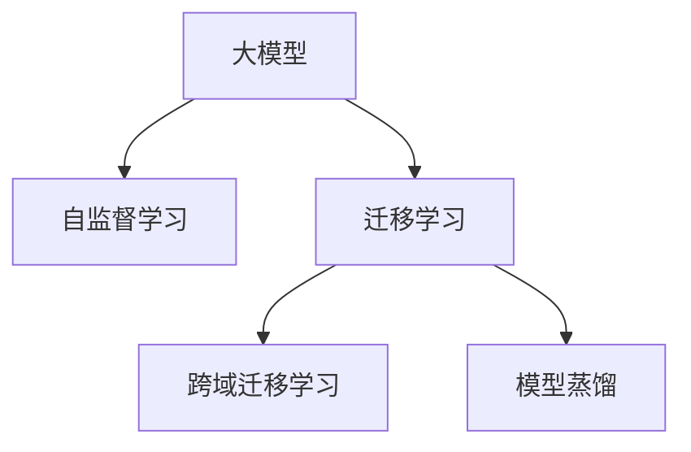

                 

## 1. 背景介绍

推荐系统在电商、新闻、社交、影视等多个领域中已广为人知，并逐渐成为各大企业竞争的焦点。构建个性化推荐系统，可以帮助用户发现潜在兴趣，提升用户体验，进而驱动业务增长。然而，传统的基于协同过滤、内容过滤的推荐算法，往往在面对小样本、多类别、动态变化等场景时，效果不尽如人意。大模型技术，尤其是跨域学习的引入，为推荐系统带来了新的突破，使得推荐更加精准、高效。

### 1.1 问题由来

推荐系统面临的主要挑战包括：

- **数据稀缺性**：用户行为数据通常稀疏且不平衡，导致算法难以有效预测。
- **多样性需求**：用户需求千差万别，推荐系统需要提供丰富多样的内容。
- **动态变化**：用户偏好和市场环境不断变化，推荐系统需要具备自适应能力。

### 1.2 问题核心关键点

大模型技术，尤其是跨域学习，在推荐系统中的应用主要集中在以下几个方面：

- **自监督学习**：使用大规模无标签数据进行预训练，学习通用特征表示，提升推荐系统的泛化能力。
- **迁移学习**：将预训练模型知识迁移到特定推荐任务上，减少数据标注需求，加速模型训练。
- **跨域迁移学习**：在大规模无标签数据上预训练模型，通过迁移学习在小规模标注数据上微调，提高推荐精度。

### 1.3 问题研究意义

跨域学习技术，结合大模型的强大表示能力，使得推荐系统在数据稀缺、领域繁多、需求多样等场景下，仍能精准高效地为用户推荐合适的产品或内容。通过跨域迁移学习，不仅可以解决冷启动问题，还能够提升推荐系统的动态适应性，满足用户不断变化的兴趣需求。

## 2. 核心概念与联系

### 2.1 核心概念概述

为更好地理解跨域学习在大模型推荐系统中的应用，本节将介绍几个关键概念：

- **大模型**：以Transformer为基础的大型神经网络模型，如GPT、BERT等。大模型通过在大规模语料上进行预训练，学习到丰富的语言知识和特征表示。
- **自监督学习**：利用大规模无标签数据进行预训练，学习到通用的语言知识和特征表示。
- **迁移学习**：将预训练模型的知识迁移到特定推荐任务上，减少数据标注需求，加速模型训练。
- **跨域迁移学习**：在大规模无标签数据上预训练模型，通过迁移学习在小规模标注数据上微调，提高推荐精度。
- **模型蒸馏**：将大模型的知识蒸馏到小模型中，减少计算资源消耗，提升推理效率。

这些核心概念之间的逻辑关系可以通过以下Mermaid流程图来展示：



这个流程图展示了从大模型到大规模推荐系统的整个学习过程：

1. 大模型通过自监督学习在大规模语料上预训练，学习到通用的语言知识和特征表示。
2. 迁移学习将预训练模型迁移到特定推荐任务上，通过少样本学习来适应新场景。
3. 跨域迁移学习在大规模无标签数据上预训练模型，在小规模标注数据上微调，提升推荐精度。
4. 模型蒸馏将大模型的知识蒸馏到小模型中，减少计算资源消耗，提升推理效率。

## 3. 核心算法原理 & 具体操作步骤

### 3.1 算法原理概述

跨域学习在大模型推荐系统中的核心思想是：利用大模型在大规模无标签数据上预训练的知识，通过迁移学习在特定推荐任务上微调，以适应新场景、解决新问题。

形式化地，假设大模型为 $M_{\theta}$，其中 $\theta$ 为预训练得到的模型参数。给定推荐任务 $T$ 的标注数据集 $D=\{(x_i, y_i)\}_{i=1}^N, x_i \in \mathcal{X}, y_i \in \mathcal{Y}$，跨域迁移学习的目标是在不增加标注数据量的情况下，通过微调提升模型在特定推荐任务上的性能。

### 3.2 算法步骤详解

基于跨域学习的大模型推荐系统一般包括以下几个关键步骤：

**Step 1: 准备预训练模型和数据集**
- 选择合适的预训练语言模型 $M_{\theta}$ 作为初始化参数，如 GPT、BERT 等。
- 准备推荐任务 $T$ 的标注数据集 $D$，划分为训练集、验证集和测试集。一般要求标注数据与预训练数据的分布不要差异过大。

**Step 2: 添加推荐适配层**
- 根据推荐任务类型，在预训练模型顶层设计合适的输出层和损失函数。
- 对于分类任务，通常在顶层添加线性分类器和交叉熵损失函数。
- 对于生成任务，通常使用语言模型的解码器输出概率分布，并以负对数似然为损失函数。

**Step 3: 设置微调超参数**
- 选择合适的优化算法及其参数，如 AdamW、SGD 等，设置学习率、批大小、迭代轮数等。
- 设置正则化技术及强度，包括权重衰减、Dropout、Early Stopping 等。
- 确定冻结预训练参数的策略，如仅微调顶层，或全部参数都参与微调。

**Step 4: 执行梯度训练**
- 将训练集数据分批次输入模型，前向传播计算损失函数。
- 反向传播计算参数梯度，根据设定的优化算法和学习率更新模型参数。
- 周期性在验证集上评估模型性能，根据性能指标决定是否触发 Early Stopping。
- 重复上述步骤直到满足预设的迭代轮数或 Early Stopping 条件。

**Step 5: 测试和部署**
- 在测试集上评估微调后模型 $M_{\hat{\theta}}$ 的性能，对比微调前后的精度提升。
- 使用微调后的模型对新样本进行推理预测，集成到实际的应用系统中。
- 持续收集新的数据，定期重新微调模型，以适应数据分布的变化。

以上是基于跨域学习微调大模型推荐系统的一般流程。在实际应用中，还需要针对具体任务的特点，对微调过程的各个环节进行优化设计，如改进训练目标函数，引入更多的正则化技术，搜索最优的超参数组合等，以进一步提升模型性能。

### 3.3 算法优缺点

跨域学习在大模型推荐系统中的应用具有以下优点：

- **数据需求低**：利用大规模无标签数据进行预训练，减少对标注数据的需求。
- **泛化能力强**：通过迁移学习，提高模型在新场景下的适应性，提升推荐精度。
- **快速迭代**：在大模型上微调推荐适配层，可以快速适应新任务，加速模型开发。

同时，该方法也存在一定的局限性：

- **计算成本高**：预训练模型规模大，需要大量的计算资源。
- **迁移效果不稳定**：不同任务之间的迁移效果可能存在差异，需要进行调整。
- **数据分布差异**：若预训练数据与推荐任务数据分布差异较大，迁移效果可能不佳。
- **动态适应性差**：一旦完成微调，模型的动态适应性较差。

尽管存在这些局限性，但就目前而言，跨域学习仍是大模型推荐系统应用的重要范式。未来相关研究的重点在于如何进一步降低计算成本，提高迁移效果，增强模型的动态适应性，同时兼顾可解释性和伦理安全性等因素。

### 3.4 算法应用领域

跨域学习在大模型推荐系统中已经得到了广泛的应用，覆盖了电商、新闻、社交等多个领域，例如：

- **电商推荐**：通过用户历史行为数据进行推荐。利用大规模无标签用户行为数据预训练大模型，通过迁移学习在小规模标注数据上微调，生成个性化推荐。
- **新闻推荐**：根据用户兴趣和历史阅读行为推荐相关新闻。利用大规模无标签新闻数据预训练大模型，通过迁移学习在小规模标注数据上微调，推荐用户感兴趣的内容。
- **社交推荐**：通过用户社交行为数据推荐相关内容。利用大规模无标签社交行为数据预训练大模型，通过迁移学习在小规模标注数据上微调，生成个性化社交推荐。
- **影视推荐**：根据用户观影历史推荐相关电影。利用大规模无标签观影数据预训练大模型，通过迁移学习在小规模标注数据上微调，推荐用户感兴趣的电影。

除了上述这些经典应用外，跨域学习技术还被创新性地应用于广告投放、音乐推荐、教育推荐等场景中，为推荐系统带来了新的突破。随着预训练模型和迁移学习方法不断进步，相信跨域学习将进一步提升推荐系统的精度和效果，加速推荐技术在更多领域的产业化进程。

## 4. 数学模型和公式 & 详细讲解  
### 4.1 数学模型构建

本节将使用数学语言对跨域学习在大模型推荐系统中的应用进行更加严格的刻画。

记推荐任务 $T$ 的标注数据集为 $D=\{(x_i, y_i)\}_{i=1}^N, x_i \in \mathcal{X}, y_i \in \mathcal{Y}$。假设大模型为 $M_{\theta}$，其中 $\theta$ 为预训练得到的模型参数。定义模型 $M_{\theta}$ 在输入 $x$ 上的输出为 $\hat{y}=M_{\theta}(x) \in \mathcal{Y}$。推荐任务 $T$ 的损失函数为 $\ell(\hat{y}, y)$，例如交叉熵损失、均方误差损失等。

跨域迁移学习的目标是最小化损失函数，即找到最优参数：

$$
\theta^* = \mathop{\arg\min}_{\theta} \mathcal{L}(\theta; D)
$$

其中 $\mathcal{L}(\theta; D)$ 为损失函数，可以表示为：

$$
\mathcal{L}(\theta; D) = \frac{1}{N}\sum_{i=1}^N \ell(M_{\theta}(x_i), y_i)
$$

在实践中，我们通常使用基于梯度的优化算法（如SGD、Adam等）来近似求解上述最优化问题。设 $\eta$ 为学习率，$\lambda$ 为正则化系数，则参数的更新公式为：

$$
\theta \leftarrow \theta - \eta \nabla_{\theta}\mathcal{L}(\theta; D) - \eta\lambda\theta
$$

其中 $\nabla_{\theta}\mathcal{L}(\theta; D)$ 为损失函数对参数 $\theta$ 的梯度，可通过反向传播算法高效计算。

### 4.2 公式推导过程

以下我们以二分类任务为例，推导交叉熵损失函数及其梯度的计算公式。

假设模型 $M_{\theta}$ 在输入 $x$ 上的输出为 $\hat{y}=M_{\theta}(x) \in [0,1]$，表示样本属于正类的概率。真实标签 $y \in \{0,1\}$。则二分类交叉熵损失函数定义为：

$$
\ell(\hat{y}, y) = -[y\log \hat{y} + (1-y)\log (1-\hat{y})]
$$

将其代入损失函数，得：

$$
\mathcal{L}(\theta; D) = -\frac{1}{N}\sum_{i=1}^N [y_i\log M_{\theta}(x_i)+(1-y_i)\log(1-M_{\theta}(x_i))]
$$

根据链式法则，损失函数对参数 $\theta_k$ 的梯度为：

$$
\frac{\partial \mathcal{L}(\theta; D)}{\partial \theta_k} = -\frac{1}{N}\sum_{i=1}^N (\frac{y_i}{M_{\theta}(x_i)}-\frac{1-y_i}{1-M_{\theta}(x_i)}) \frac{\partial M_{\theta}(x_i)}{\partial \theta_k}
$$

其中 $\frac{\partial M_{\theta}(x_i)}{\partial \theta_k}$ 可进一步递归展开，利用自动微分技术完成计算。

在得到损失函数的梯度后，即可带入参数更新公式，完成模型的迭代优化。重复上述过程直至收敛，最终得到适应推荐任务的最优模型参数 $\theta^*$。

## 5. 项目实践：代码实例和详细解释说明
### 5.1 开发环境搭建

在进行推荐系统开发前，我们需要准备好开发环境。以下是使用Python进行PyTorch开发的环境配置流程：

1. 安装Anaconda：从官网下载并安装Anaconda，用于创建独立的Python环境。

2. 创建并激活虚拟环境：
```bash
conda create -n recommendation-env python=3.8 
conda activate recommendation-env
```

3. 安装PyTorch：根据CUDA版本，从官网获取对应的安装命令。例如：
```bash
conda install pytorch torchvision torchaudio cudatoolkit=11.1 -c pytorch -c conda-forge
```

4. 安装Transformer库：
```bash
pip install transformers
```

5. 安装各类工具包：
```bash
pip install numpy pandas scikit-learn matplotlib tqdm jupyter notebook ipython
```

完成上述步骤后，即可在`recommendation-env`环境中开始推荐系统开发。

### 5.2 源代码详细实现

下面我们以推荐系统为例，给出使用Transformers库对BERT模型进行推荐系统微调的PyTorch代码实现。

首先，定义推荐系统的数据处理函数：

```python
from transformers import BertTokenizer
from torch.utils.data import Dataset
import torch

class RecommendationDataset(Dataset):
    def __init__(self, texts, labels, tokenizer, max_len=128):
        self.texts = texts
        self.labels = labels
        self.tokenizer = tokenizer
        self.max_len = max_len
        
    def __len__(self):
        return len(self.texts)
    
    def __getitem__(self, item):
        text = self.texts[item]
        label = self.labels[item]
        
        encoding = self.tokenizer(text, return_tensors='pt', max_length=self.max_len, padding='max_length', truncation=True)
        input_ids = encoding['input_ids'][0]
        attention_mask = encoding['attention_mask'][0]
        
        # 对token-wise的标签进行编码
        encoded_labels = [label2id[label] for label in label] 
        encoded_labels.extend([label2id['default']] * (self.max_len - len(encoded_labels)))
        labels = torch.tensor(encoded_labels, dtype=torch.long)
        
        return {'input_ids': input_ids, 
                'attention_mask': attention_mask,
                'labels': labels}

# 标签与id的映射
label2id = {'default': 0, 'positive': 1, 'negative': 2}
id2label = {v: k for k, v in label2id.items()}

# 创建dataset
tokenizer = BertTokenizer.from_pretrained('bert-base-cased')

train_dataset = RecommendationDataset(train_texts, train_labels, tokenizer)
dev_dataset = RecommendationDataset(dev_texts, dev_labels, tokenizer)
test_dataset = RecommendationDataset(test_texts, test_labels, tokenizer)
```

然后，定义模型和优化器：

```python
from transformers import BertForTokenClassification, AdamW

model = BertForTokenClassification.from_pretrained('bert-base-cased', num_labels=len(label2id))

optimizer = AdamW(model.parameters(), lr=2e-5)
```

接着，定义训练和评估函数：

```python
from torch.utils.data import DataLoader
from tqdm import tqdm
from sklearn.metrics import classification_report

device = torch.device('cuda') if torch.cuda.is_available() else torch.device('cpu')
model.to(device)

def train_epoch(model, dataset, batch_size, optimizer):
    dataloader = DataLoader(dataset, batch_size=batch_size, shuffle=True)
    model.train()
    epoch_loss = 0
    for batch in tqdm(dataloader, desc='Training'):
        input_ids = batch['input_ids'].to(device)
        attention_mask = batch['attention_mask'].to(device)
        labels = batch['labels'].to(device)
        model.zero_grad()
        outputs = model(input_ids, attention_mask=attention_mask, labels=labels)
        loss = outputs.loss
        epoch_loss += loss.item()
        loss.backward()
        optimizer.step()
    return epoch_loss / len(dataloader)

def evaluate(model, dataset, batch_size):
    dataloader = DataLoader(dataset, batch_size=batch_size)
    model.eval()
    preds, labels = [], []
    with torch.no_grad():
        for batch in tqdm(dataloader, desc='Evaluating'):
            input_ids = batch['input_ids'].to(device)
            attention_mask = batch['attention_mask'].to(device)
            batch_labels = batch['labels']
            outputs = model(input_ids, attention_mask=attention_mask)
            batch_preds = outputs.logits.argmax(dim=2).to('cpu').tolist()
            batch_labels = batch_labels.to('cpu').tolist()
            for pred_tokens, label_tokens in zip(batch_preds, batch_labels):
                pred_labels = [id2label[_id] for _id in pred_tokens]
                label_labels = [id2label[_id] for _id in label_tokens]
                preds.append(pred_labels[:len(label_labels)])
                labels.append(label_labels)
                
    print(classification_report(labels, preds))
```

最后，启动训练流程并在测试集上评估：

```python
epochs = 5
batch_size = 16

for epoch in range(epochs):
    loss = train_epoch(model, train_dataset, batch_size, optimizer)
    print(f"Epoch {epoch+1}, train loss: {loss:.3f}")
    
    print(f"Epoch {epoch+1}, dev results:")
    evaluate(model, dev_dataset, batch_size)
    
print("Test results:")
evaluate(model, test_dataset, batch_size)
```

以上就是使用PyTorch对BERT进行推荐系统微调的完整代码实现。可以看到，得益于Transformers库的强大封装，我们可以用相对简洁的代码完成BERT模型的加载和微调。

### 5.3 代码解读与分析

让我们再详细解读一下关键代码的实现细节：

**RecommendationDataset类**：
- `__init__`方法：初始化文本、标签、分词器等关键组件。
- `__len__`方法：返回数据集的样本数量。
- `__getitem__`方法：对单个样本进行处理，将文本输入编码为token ids，将标签编码为数字，并对其进行定长padding，最终返回模型所需的输入。

**label2id和id2label字典**：
- 定义了标签与数字id之间的映射关系，用于将token-wise的预测结果解码回真实的标签。

**训练和评估函数**：
- 使用PyTorch的DataLoader对数据集进行批次化加载，供模型训练和推理使用。
- 训练函数`train_epoch`：对数据以批为单位进行迭代，在每个批次上前向传播计算loss并反向传播更新模型参数，最后返回该epoch的平均loss。
- 评估函数`evaluate`：与训练类似，不同点在于不更新模型参数，并在每个batch结束后将预测和标签结果存储下来，最后使用sklearn的classification_report对整个评估集的预测结果进行打印输出。

**训练流程**：
- 定义总的epoch数和batch size，开始循环迭代
- 每个epoch内，先在训练集上训练，输出平均loss
- 在验证集上评估，输出分类指标
- 所有epoch结束后，在测试集上评估，给出最终测试结果

可以看到，PyTorch配合Transformers库使得BERT微调的代码实现变得简洁高效。开发者可以将更多精力放在数据处理、模型改进等高层逻辑上，而不必过多关注底层的实现细节。

当然，工业级的系统实现还需考虑更多因素，如模型的保存和部署、超参数的自动搜索、更灵活的任务适配层等。但核心的微调范式基本与此类似。

## 6. 实际应用场景
### 6.1 智能客服系统

基于大模型技术，智能客服系统可以显著提升用户服务体验。通过跨域学习，智能客服系统能够利用预训练模型的知识，更好地理解用户需求，提供个性化、准确的回答。

在技术实现上，可以收集企业内部的历史客服对话记录，将问题和最佳答复构建成监督数据，在此基础上对预训练对话模型进行微调。微调后的对话模型能够自动理解用户意图，匹配最合适的答案模板进行回复。对于客户提出的新问题，还可以接入检索系统实时搜索相关内容，动态组织生成回答。如此构建的智能客服系统，能大幅提升客户咨询体验和问题解决效率。

### 6.2 新闻推荐

新闻推荐系统面临冷启动、多样性、实时性等挑战，传统的协同过滤算法难以应对。通过跨域学习，新闻推荐系统可以利用大规模无标签新闻数据预训练模型，通过迁移学习在小规模标注数据上微调，生成个性化的新闻推荐。

在技术实现上，可以收集用户阅读行为数据，将其标注为正向、负向或中性。利用大规模无标签新闻数据预训练BERT模型，通过迁移学习在小规模标注数据上微调，生成用户可能感兴趣的新闻。此外，可以通过检索技术将实时新闻与用户兴趣进行匹配，动态生成推荐结果，提升推荐系统的实时性。

### 6.3 电商推荐

电商推荐系统需要在大规模无标签用户行为数据上预训练模型，通过迁移学习在小规模标注数据上微调，生成个性化推荐。

在技术实现上，可以收集用户浏览、点击、购买等行为数据，利用大规模无标签用户行为数据预训练BERT模型，通过迁移学习在小规模标注数据上微调，生成个性化推荐。此外，可以利用跨域学习技术，将不同领域的数据进行融合，提升推荐系统的多样性。

### 6.4 未来应用展望

随着大模型技术的发展，跨域学习将在更多领域得到应用，为传统行业带来变革性影响。

在智慧医疗领域，基于跨域学习的推荐系统，可以辅助医生推荐合适的药品、诊疗方案等，提升医疗服务的智能化水平。

在智慧教育领域，跨域学习技术可应用于个性化推荐、智能作业批改、学情分析等方面，因材施教，促进教育公平，提高教学质量。

在智慧城市治理中，跨域学习技术可应用于城市事件监测、舆情分析、应急指挥等环节，提高城市管理的自动化和智能化水平，构建更安全、高效的未来城市。

此外，在企业生产、社会治理、文娱传媒等众多领域，跨域学习技术也将不断涌现，为NLP技术带来了新的突破。相信随着技术的日益成熟，跨域学习技术必将在构建人机协同的智能时代中扮演越来越重要的角色。

## 7. 工具和资源推荐
### 7.1 学习资源推荐

为了帮助开发者系统掌握跨域学习在大模型推荐系统中的应用，这里推荐一些优质的学习资源：

1. 《Transformer从原理到实践》系列博文：由大模型技术专家撰写，深入浅出地介绍了Transformer原理、BERT模型、跨域学习等前沿话题。

2. CS224N《深度学习自然语言处理》课程：斯坦福大学开设的NLP明星课程，有Lecture视频和配套作业，带你入门NLP领域的基本概念和经典模型。

3. 《Natural Language Processing with Transformers》书籍：Transformers库的作者所著，全面介绍了如何使用Transformers库进行NLP任务开发，包括跨域学习在内的诸多范式。

4. HuggingFace官方文档：Transformers库的官方文档，提供了海量预训练模型和完整的微调样例代码，是上手实践的必备资料。

5. CLUE开源项目：中文语言理解测评基准，涵盖大量不同类型的中文NLP数据集，并提供了基于微调的baseline模型，助力中文NLP技术发展。

通过对这些资源的学习实践，相信你一定能够快速掌握跨域学习在大模型推荐系统中的精髓，并用于解决实际的NLP问题。
### 7.2 开发工具推荐

高效的开发离不开优秀的工具支持。以下是几款用于跨域学习开发的常用工具：

1. PyTorch：基于Python的开源深度学习框架，灵活动态的计算图，适合快速迭代研究。大部分预训练语言模型都有PyTorch版本的实现。

2. TensorFlow：由Google主导开发的开源深度学习框架，生产部署方便，适合大规模工程应用。同样有丰富的预训练语言模型资源。

3. Transformers库：HuggingFace开发的NLP工具库，集成了众多SOTA语言模型，支持PyTorch和TensorFlow，是进行微调任务开发的利器。

4. Weights & Biases：模型训练的实验跟踪工具，可以记录和可视化模型训练过程中的各项指标，方便对比和调优。与主流深度学习框架无缝集成。

5. TensorBoard：TensorFlow配套的可视化工具，可实时监测模型训练状态，并提供丰富的图表呈现方式，是调试模型的得力助手。

6. Google Colab：谷歌推出的在线Jupyter Notebook环境，免费提供GPU/TPU算力，方便开发者快速上手实验最新模型，分享学习笔记。

合理利用这些工具，可以显著提升跨域学习任务的开发效率，加快创新迭代的步伐。

### 7.3 相关论文推荐

跨域学习在大模型推荐系统中的应用源于学界的持续研究。以下是几篇奠基性的相关论文，推荐阅读：

1. Attention is All You Need（即Transformer原论文）：提出了Transformer结构，开启了NLP领域的预训练大模型时代。

2. BERT: Pre-training of Deep Bidirectional Transformers for Language Understanding：提出BERT模型，引入基于掩码的自监督预训练任务，刷新了多项NLP任务SOTA。

3. Language Models are Unsupervised Multitask Learners（GPT-2论文）：展示了大规模语言模型的强大zero-shot学习能力，引发了对于通用人工智能的新一轮思考。

4. Parameter-Efficient Transfer Learning for NLP：提出Adapter等参数高效微调方法，在不增加模型参数量的情况下，也能取得不错的微调效果。

5. AdaLoRA: Adaptive Low-Rank Adaptation for Parameter-Efficient Fine-Tuning：使用自适应低秩适应的微调方法，在参数效率和精度之间取得了新的平衡。

这些论文代表了大模型技术的发展脉络。通过学习这些前沿成果，可以帮助研究者把握学科前进方向，激发更多的创新灵感。

## 8. 总结：未来发展趋势与挑战

### 8.1 总结

本文对跨域学习在大模型推荐系统中的应用进行了全面系统的介绍。首先阐述了跨域学习在大模型推荐系统中的研究背景和意义，明确了跨域学习在推荐系统中的独特价值。其次，从原理到实践，详细讲解了跨域学习的数学原理和关键步骤，给出了跨域学习任务开发的完整代码实例。同时，本文还广泛探讨了跨域学习技术在电商、新闻、社交等多个领域的应用前景，展示了跨域学习范式的巨大潜力。此外，本文精选了跨域学习技术的各类学习资源，力求为读者提供全方位的技术指引。

通过本文的系统梳理，可以看到，跨域学习技术在大模型推荐系统中的应用，为推荐系统在数据稀缺、领域繁多、需求多样等场景下，仍能精准高效地为用户推荐合适的产品或内容，提供了新的思路和方法。未来，伴随跨域学习方法和大模型技术的不断进步，相信推荐系统将在更多领域得到应用，为传统行业带来新的变革和机遇。

### 8.2 未来发展趋势

展望未来，跨域学习技术将在推荐系统中的应用呈现以下几个发展趋势：

1. **数据需求减少**：利用大规模无标签数据进行预训练，减少对标注数据的需求。

2. **迁移效果提升**：通过迁移学习，提高模型在不同领域和新场景下的适应性，提升推荐精度。

3. **实时性增强**：通过跨域迁移学习和小样本学习，提升推荐系统的实时性和动态适应性。

4. **跨模态融合**：将视觉、语音、文本等多种模态的数据进行融合，提升推荐系统的多样性和精准性。

5. **知识蒸馏优化**：将大模型的知识蒸馏到小模型中，减少计算资源消耗，提升推理效率。

6. **可解释性增强**：利用因果分析和博弈论工具，提高模型的可解释性和可控性。

这些趋势凸显了跨域学习技术的广阔前景。这些方向的探索发展，必将进一步提升推荐系统的精度和效果，加速推荐技术在更多领域的产业化进程。

### 8.3 面临的挑战

尽管跨域学习技术已经取得了显著进展，但在迈向更加智能化、普适化应用的过程中，它仍面临诸多挑战：

1. **计算成本高**：预训练模型规模大，需要大量的计算资源。

2. **迁移效果不稳定**：不同任务之间的迁移效果可能存在差异，需要进行调整。

3. **数据分布差异**：若预训练数据与推荐任务数据分布差异较大，迁移效果可能不佳。

4. **动态适应性差**：一旦完成微调，模型的动态适应性较差。

5. **可解释性不足**：模型的决策过程缺乏可解释性，难以对其推理逻辑进行分析和调试。

6. **安全性问题**：模型可能学习到有偏见、有害的信息，通过迁移传递到推荐任务，产生误导性、歧视性的输出。

尽管存在这些挑战，但就目前而言，跨域学习仍是大模型推荐系统应用的重要范式。未来相关研究的重点在于如何进一步降低计算成本，提高迁移效果，增强模型的动态适应性，同时兼顾可解释性和伦理安全性等因素。

### 8.4 研究展望

面对跨域学习面临的这些挑战，未来的研究需要在以下几个方面寻求新的突破：

1. **无监督和半监督学习**：摆脱对大规模标注数据的依赖，利用自监督学习、主动学习等无监督和半监督范式，最大限度利用非结构化数据，实现更加灵活高效的跨域学习。

2. **参数高效和计算高效的跨域学习范式**：开发更加参数高效的跨域学习方法，在固定大部分预训练参数的同时，只更新极少量的任务相关参数。同时优化跨域学习的计算图，减少前向传播和反向传播的资源消耗，实现更加轻量级、实时性的部署。

3. **跨模态融合学习**：将视觉、语音、文本等多种模态的数据进行融合，提升跨域学习系统的多样性和精准性。

4. **因果分析和博弈论工具**：通过引入因果推断和博弈论思想，增强跨域学习模型建立稳定因果关系的能力，学习更加普适、鲁棒的语言表征，从而提升模型泛化性和抗干扰能力。

5. **融合专家知识**：将符号化的先验知识，如知识图谱、逻辑规则等，与神经网络模型进行巧妙融合，引导跨域学习过程学习更准确、合理的语言模型。

6. **引入伦理导向评估指标**：在跨域学习目标中引入伦理导向的评估指标，过滤和惩罚有偏见、有害的输出倾向。

这些研究方向的发展，必将引领跨域学习技术迈向更高的台阶，为构建安全、可靠、可解释、可控的智能系统铺平道路。面向未来，跨域学习技术还需要与其他人工智能技术进行更深入的融合，如知识表示、因果推理、强化学习等，多路径协同发力，共同推动自然语言理解和智能交互系统的进步。只有勇于创新、敢于突破，才能不断拓展语言模型的边界，让智能技术更好地造福人类社会。

## 9. 附录：常见问题与解答

**Q1：跨域学习是否适用于所有推荐系统？**

A: 跨域学习在大多数推荐系统上都能取得不错的效果，特别是对于数据稀缺、领域繁多的场景。但对于一些特定领域的推荐系统，如特定行业的推荐，可能需要针对领域特点进行优化调整。

**Q2：如何选择合适的预训练模型？**

A: 选择合适的预训练模型需要考虑以下几个因素：
1. 推荐任务类型：如电商推荐、新闻推荐、社交推荐等。
2. 数据分布：预训练数据与推荐任务数据分布是否相似。
3. 模型性能：参考已有的微调结果和精度表现。
4. 计算资源：考虑预训练模型的大小和训练资源的可用性。

**Q3：如何提高跨域学习的迁移效果？**

A: 提高跨域学习的迁移效果可以从以下几个方面入手：
1. 选择合适的预训练模型和任务适配层。
2. 使用合适的正则化技术，如L2正则、Dropout等。
3. 应用数据增强技术，如回译、近义替换等。
4. 引入对抗训练，提高模型鲁棒性。
5. 使用模型蒸馏技术，将大模型知识蒸馏到小模型中。

**Q4：跨域学习在实际部署中需要注意哪些问题？**

A: 跨域学习在实际部署中需要注意以下几个问题：
1. 模型裁剪：去除不必要的层和参数，减小模型尺寸，加快推理速度。
2. 量化加速：将浮点模型转为定点模型，压缩存储空间，提高计算效率。
3. 服务化封装：将模型封装为标准化服务接口，便于集成调用。
4. 弹性伸缩：根据请求流量动态调整资源配置，平衡服务质量和成本。
5. 监控告警：实时采集系统指标，设置异常告警阈值，确保服务稳定性。

通过合理设计和优化跨域学习模型，可以提升推荐系统的性能和用户满意度，同时保障系统的稳定性和安全性。

