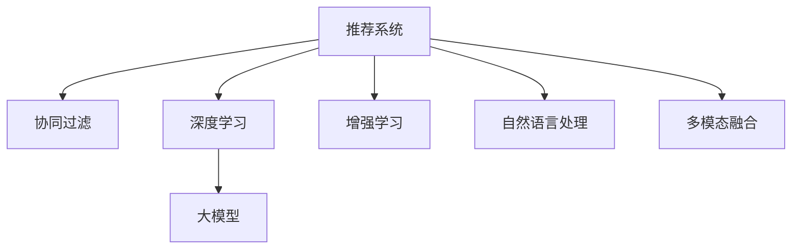

                 

# 推荐系统中的长尾商品曝光：大模型的创新策略

> 关键词：推荐系统, 长尾商品, 大模型, 协同过滤, 深度学习, 增强学习, 自然语言处理, 多模态融合

## 1. 背景介绍

### 1.1 问题由来

随着电子商务的发展，消费者对商品的选择日益多样化，对长尾商品的关注也在增加。长尾商品，即那些销量较低、但种类繁多的商品，构成了电子商务平台的重要组成部分。然而，长尾商品的曝光不足，导致了用户难以发现并购买到这些商品，从而影响了平台的用户体验和收益。推荐系统，作为提升用户购物体验的重要工具，正面临着如何有效曝光长尾商品的挑战。

### 1.2 问题核心关键点

长尾商品的曝光问题核心在于推荐系统如何平衡主流商品和长尾商品的推荐比例，以及如何利用数据和算法手段提升长尾商品的曝光度。目前，推荐系统主要基于协同过滤、深度学习和增强学习等技术，但传统的推荐算法往往偏向于主流商品，忽视了长尾商品的潜在价值。而大模型的引入，为推荐系统提供了新的解决方案，能够更好地理解和推荐长尾商品。

## 2. 核心概念与联系

### 2.1 核心概念概述

为更好地理解如何利用大模型解决长尾商品曝光问题，本节将介绍几个关键概念：

- **推荐系统**：基于用户的历史行为数据和物品属性信息，为用户推荐感兴趣的商品的系统。
- **长尾商品**：那些销量较低但种类繁多的商品，构成了电子商务平台的重要组成部分。
- **大模型**：以自回归或自编码模型为代表的大规模预训练语言模型，通过在大规模无标签文本语料上进行预训练，学习到通用的语言表示。
- **协同过滤**：基于用户和物品相似度进行推荐的算法，包括基于用户的协同过滤和基于物品的协同过滤。
- **深度学习**：通过多层神经网络模型进行特征提取和模式学习，用于推荐系统的学习和推理。
- **增强学习**：通过试错学习，不断调整推荐策略，最大化用户满意度和收益。
- **自然语言处理**（NLP）：处理和理解自然语言的技术，用于解析商品描述、用户评论等文本数据。
- **多模态融合**：将文本、图像、视频等多种信息融合到推荐系统中，提升推荐效果。

这些核心概念之间的逻辑关系可以通过以下Mermaid流程图来展示：



这个流程图展示推荐系统的核心概念及其之间的关系：

1. 推荐系统通过协同过滤、深度学习、增强学习等算法进行推荐。
2. 大模型通过预训练学习到通用的语言表示，用于自然语言处理和多模态融合。
3. 自然语言处理和多模态融合技术能够更好地理解商品和用户特征，提升推荐效果。

## 3. 核心算法原理 & 具体操作步骤
### 3.1 算法原理概述

大模型在推荐系统中的应用，主要通过以下几个步骤实现：

1. **预训练阶段**：在大量无标签文本数据上训练大模型，学习到通用的语言表示。
2. **微调阶段**：在推荐数据集上微调大模型，使其能够适应推荐任务。
3. **推理阶段**：利用微调后的模型，对商品和用户数据进行处理，进行推荐。

通过预训练和微调，大模型能够从海量的文本数据中学习到丰富的语言知识和模式，从而更好地理解和推荐长尾商品。

### 3.2 算法步骤详解

以下是利用大模型解决长尾商品曝光问题的具体步骤：

**Step 1: 数据收集与预处理**

- 收集商品描述、用户评论、历史购买记录等数据。
- 对数据进行清洗、去重、分词、向量化等预处理。
- 将商品描述和用户评论数据作为大模型的输入，进行预训练。

**Step 2: 选择大模型**

- 选择合适的预训练大模型，如BERT、GPT等。
- 利用预训练模型学习通用的语言表示，用于后续的微调。

**Step 3: 微调训练**

- 在推荐数据集上微调大模型。
- 微调的目标是最大化推荐准确率和长尾商品的曝光度。
- 使用合适的优化算法和损失函数，如AdamW、交叉熵等。

**Step 4: 推理与评估**

- 利用微调后的模型对商品和用户数据进行处理，进行推荐。
- 使用相关指标评估推荐效果，如召回率、点击率、曝光度等。
- 根据评估结果不断调整模型参数，优化推荐策略。

### 3.3 算法优缺点

利用大模型解决长尾商品曝光问题的方法具有以下优点：

1. **通用性强**：大模型能够学习通用的语言表示，适用于多种类型的推荐任务。
2. **语义理解能力强**：能够理解商品描述、用户评论中的语义信息，提升推荐的相关性和个性化。
3. **高效性**：利用大模型的预训练和微调，可以大幅减少特征工程的工作量，提升模型训练和推理效率。
4. **灵活性**：可以灵活引入其他模型和技术，如多模态融合、深度学习等，提升推荐效果。

然而，该方法也存在一些局限性：

1. **数据依赖**：微调模型的效果很大程度上依赖于推荐数据集的质量和数量，获取高质量数据成本较高。
2. **计算资源需求高**：大模型的预训练和微调需要大量的计算资源，对硬件要求较高。
3. **模型解释性不足**：大模型往往是“黑盒”模型，难以解释其内部的推理过程。
4. **可解释性不足**：大模型的输出结果缺乏可解释性，难以进行调试和优化。

尽管存在这些局限性，但大模型在推荐系统中的应用，已经显著提升了长尾商品的曝光度和推荐效果。

### 3.4 算法应用领域

大模型在推荐系统中的应用，已经在多个领域得到验证和应用：

- **电商推荐**：在电商平台上，大模型被广泛用于推荐长尾商品、个性化推荐、内容推荐等。
- **内容推荐**：在视频、音乐、图书等数字内容平台上，大模型用于推荐用户可能感兴趣的内容。
- **金融推荐**：在金融领域，大模型被用于推荐个性化的理财产品、财经新闻等。
- **旅游推荐**：在旅游平台上，大模型用于推荐个性化的旅游路线、景点等。

这些应用场景展示了大模型在推荐系统中的广泛适用性和巨大潜力。

## 4. 数学模型和公式 & 详细讲解
### 4.1 数学模型构建

在推荐系统中，大模型的应用主要通过以下几个数学模型实现：

- **用户-商品矩阵**：表示用户和商品之间的关联矩阵。
- **商品-商品相似度矩阵**：表示商品之间的相似度矩阵。
- **用户行为模型**：用于预测用户对商品的兴趣和行为。
- **推荐模型**：将用户行为和商品特征结合起来，进行推荐。

### 4.2 公式推导过程

以推荐模型的公式推导为例，假设推荐模型为 $M_{\theta}$，输入为 $x_i$，输出为 $y_i$。

**用户行为模型**：

$$
y_i = M_{\theta}(x_i) + \epsilon
$$

其中，$\epsilon$ 为误差项。

**推荐模型**：

$$
y_{j|i} = M_{\theta}(x_i, x_j) + \epsilon_{j|i}
$$

其中，$y_{j|i}$ 表示用户 $i$ 对商品 $j$ 的兴趣评分，$\epsilon_{j|i}$ 为误差项。

通过对用户行为和商品特征的建模，推荐模型能够预测用户对商品的兴趣评分，从而进行推荐。

### 4.3 案例分析与讲解

以电商推荐系统为例，利用大模型进行推荐的过程如下：

1. **数据收集与预处理**：
   - 收集商品描述、用户评论、历史购买记录等数据。
   - 对数据进行清洗、去重、分词、向量化等预处理。

2. **选择大模型**：
   - 选择合适的预训练大模型，如BERT。
   - 利用预训练模型学习通用的语言表示。

3. **微调训练**：
   - 在电商推荐数据集上微调大模型。
   - 微调的目标是最大化推荐准确率和长尾商品的曝光度。
   - 使用合适的优化算法和损失函数，如AdamW、交叉熵等。

4. **推理与评估**：
   - 利用微调后的模型对商品和用户数据进行处理，进行推荐。
   - 使用相关指标评估推荐效果，如召回率、点击率、曝光度等。
   - 根据评估结果不断调整模型参数，优化推荐策略。

## 5. 项目实践：代码实例和详细解释说明
### 5.1 开发环境搭建

在进行大模型推荐实践前，我们需要准备好开发环境。以下是使用Python进行PyTorch开发的环境配置流程：

1. 安装Anaconda：从官网下载并安装Anaconda，用于创建独立的Python环境。

2. 创建并激活虚拟环境：
```bash
conda create -n pytorch-env python=3.8 
conda activate pytorch-env
```

3. 安装PyTorch：根据CUDA版本，从官网获取对应的安装命令。例如：
```bash
conda install pytorch torchvision torchaudio cudatoolkit=11.1 -c pytorch -c conda-forge
```

4. 安装Transformers库：
```bash
pip install transformers
```

5. 安装各类工具包：
```bash
pip install numpy pandas scikit-learn matplotlib tqdm jupyter notebook ipython
```

完成上述步骤后，即可在`pytorch-env`环境中开始微调实践。

### 5.2 源代码详细实现

下面以电商推荐系统为例，给出使用Transformers库对BERT模型进行微调的PyTorch代码实现。

首先，定义电商推荐任务的数据处理函数：

```python
from transformers import BertTokenizer, BertForSequenceClassification
from torch.utils.data import Dataset
import torch

class EcommDataset(Dataset):
    def __init__(self, texts, labels, tokenizer, max_len=128):
        self.texts = texts
        self.labels = labels
        self.tokenizer = tokenizer
        self.max_len = max_len
        
    def __len__(self):
        return len(self.texts)
    
    def __getitem__(self, item):
        text = self.texts[item]
        label = self.labels[item]
        
        encoding = self.tokenizer(text, return_tensors='pt', max_length=self.max_len, padding='max_length', truncation=True)
        input_ids = encoding['input_ids'][0]
        attention_mask = encoding['attention_mask'][0]
        
        # 对label进行编码
        encoded_labels = torch.tensor(label, dtype=torch.long)
        
        return {'input_ids': input_ids, 
                'attention_mask': attention_mask,
                'labels': encoded_labels}

# 标签与id的映射
label2id = {'positive': 1, 'negative': 0}
id2label = {v: k for k, v in label2id.items()}

# 创建dataset
tokenizer = BertTokenizer.from_pretrained('bert-base-uncased')

train_dataset = EcommDataset(train_texts, train_labels, tokenizer)
dev_dataset = EcommDataset(dev_texts, dev_labels, tokenizer)
test_dataset = EcommDataset(test_texts, test_labels, tokenizer)
```

然后，定义模型和优化器：

```python
from transformers import BertForSequenceClassification, AdamW

model = BertForSequenceClassification.from_pretrained('bert-base-uncased', num_labels=2)

optimizer = AdamW(model.parameters(), lr=2e-5)
```

接着，定义训练和评估函数：

```python
from torch.utils.data import DataLoader
from tqdm import tqdm
from sklearn.metrics import accuracy_score, precision_score, recall_score, f1_score

device = torch.device('cuda') if torch.cuda.is_available() else torch.device('cpu')
model.to(device)

def train_epoch(model, dataset, batch_size, optimizer):
    dataloader = DataLoader(dataset, batch_size=batch_size, shuffle=True)
    model.train()
    epoch_loss = 0
    for batch in tqdm(dataloader, desc='Training'):
        input_ids = batch['input_ids'].to(device)
        attention_mask = batch['attention_mask'].to(device)
        labels = batch['labels'].to(device)
        model.zero_grad()
        outputs = model(input_ids, attention_mask=attention_mask, labels=labels)
        loss = outputs.loss
        epoch_loss += loss.item()
        loss.backward()
        optimizer.step()
    return epoch_loss / len(dataloader)

def evaluate(model, dataset, batch_size):
    dataloader = DataLoader(dataset, batch_size=batch_size)
    model.eval()
    preds, labels = [], []
    with torch.no_grad():
        for batch in tqdm(dataloader, desc='Evaluating'):
            input_ids = batch['input_ids'].to(device)
            attention_mask = batch['attention_mask'].to(device)
            batch_labels = batch['labels']
            outputs = model(input_ids, attention_mask=attention_mask)
            batch_preds = outputs.logits.argmax(dim=1).to('cpu').tolist()
            batch_labels = batch_labels.to('cpu').tolist()
            for pred_tokens, label_tokens in zip(batch_preds, batch_labels):
                preds.append(pred_tokens)
                labels.append(label_tokens)
                
    accuracy = accuracy_score(labels, preds)
    precision = precision_score(labels, preds)
    recall = recall_score(labels, preds)
    f1 = f1_score(labels, preds)
    print(f"Accuracy: {accuracy:.2f}, Precision: {precision:.2f}, Recall: {recall:.2f}, F1 Score: {f1:.2f}")
```

最后，启动训练流程并在测试集上评估：

```python
epochs = 5
batch_size = 16

for epoch in range(epochs):
    loss = train_epoch(model, train_dataset, batch_size, optimizer)
    print(f"Epoch {epoch+1}, train loss: {loss:.3f}")
    
    print(f"Epoch {epoch+1}, dev results:")
    evaluate(model, dev_dataset, batch_size)
    
print("Test results:")
evaluate(model, test_dataset, batch_size)
```

以上就是使用PyTorch对BERT进行电商推荐任务微调的完整代码实现。可以看到，得益于Transformers库的强大封装，我们可以用相对简洁的代码完成BERT模型的加载和微调。

### 5.3 代码解读与分析

让我们再详细解读一下关键代码的实现细节：

**EcommDataset类**：
- `__init__`方法：初始化文本、标签、分词器等关键组件。
- `__len__`方法：返回数据集的样本数量。
- `__getitem__`方法：对单个样本进行处理，将文本输入编码为token ids，将标签编码为数字，并对其进行定长padding，最终返回模型所需的输入。

**label2id和id2label字典**：
- 定义了标签与数字id之间的映射关系，用于将预测结果解码为真实标签。

**训练和评估函数**：
- 使用PyTorch的DataLoader对数据集进行批次化加载，供模型训练和推理使用。
- 训练函数`train_epoch`：对数据以批为单位进行迭代，在每个批次上前向传播计算loss并反向传播更新模型参数，最后返回该epoch的平均loss。
- 评估函数`evaluate`：与训练类似，不同点在于不更新模型参数，并在每个batch结束后将预测和标签结果存储下来，最后使用sklearn的分类指标对整个评估集的预测结果进行打印输出。

**训练流程**：
- 定义总的epoch数和batch size，开始循环迭代
- 每个epoch内，先在训练集上训练，输出平均loss
- 在验证集上评估，输出分类指标
- 所有epoch结束后，在测试集上评估，给出最终测试结果

可以看到，PyTorch配合Transformers库使得BERT微调的代码实现变得简洁高效。开发者可以将更多精力放在数据处理、模型改进等高层逻辑上，而不必过多关注底层的实现细节。

当然，工业级的系统实现还需考虑更多因素，如模型的保存和部署、超参数的自动搜索、更灵活的任务适配层等。但核心的微调范式基本与此类似。

## 6. 实际应用场景
### 6.1 智能推荐系统

大模型在推荐系统中的应用，已经在多个领域得到验证和应用：

- **电商推荐**：在电商平台上，大模型被广泛用于推荐长尾商品、个性化推荐、内容推荐等。
- **内容推荐**：在视频、音乐、图书等数字内容平台上，大模型用于推荐用户可能感兴趣的内容。
- **金融推荐**：在金融领域，大模型被用于推荐个性化的理财产品、财经新闻等。
- **旅游推荐**：在旅游平台上，大模型用于推荐个性化的旅游路线、景点等。

这些应用场景展示了大模型在推荐系统中的广泛适用性和巨大潜力。

### 6.2 未来应用展望

随着大模型和微调方法的不断发展，推荐系统将呈现以下几个发展趋势：

1. **推荐结果的多样性**：大模型能够学习到丰富的语义信息，推荐结果将更加多样化，满足用户的多样化需求。
2. **个性化推荐**：大模型能够更好地理解用户兴趣和行为，推荐系统将更加个性化，提升用户满意度。
3. **实时推荐**：大模型的推理速度快，能够实时响应用户请求，提升推荐系统的响应速度。
4. **多模态融合**：将文本、图像、视频等多种信息融合到推荐系统中，提升推荐效果。
5. **用户行为建模**：利用大模型进行用户行为建模，预测用户对商品的兴趣，提升推荐准确率。
6. **冷启动问题**：解决冷启动问题，提升新用户或新商品的推荐效果。

这些趋势将使得推荐系统更加智能化、高效化和个性化，提升用户的购物体验和平台收益。

## 7. 工具和资源推荐
### 7.1 学习资源推荐

为了帮助开发者系统掌握大模型在推荐系统中的应用，这里推荐一些优质的学习资源：

1. 《推荐系统》系列博文：由大模型技术专家撰写，深入浅出地介绍了推荐系统的原理、算法和实际应用。

2. 《深度学习推荐系统》课程：斯坦福大学开设的推荐系统课程，有Lecture视频和配套作业，带你入门推荐系统领域的基本概念和经典模型。

3. 《推荐系统实战》书籍：介绍推荐系统的经典算法和实际应用，包括协同过滤、深度学习等推荐方法。

4. 《自然语言处理与深度学习》书籍：介绍自然语言处理和深度学习的相关知识，为推荐系统提供技术支持。

5. Kaggle竞赛：参加Kaggle推荐系统竞赛，实战练习推荐系统算法和模型调参。

通过对这些资源的学习实践，相信你一定能够快速掌握大模型在推荐系统中的应用，并用于解决实际的推荐问题。

### 7.2 开发工具推荐

高效的开发离不开优秀的工具支持。以下是几款用于推荐系统开发的常用工具：

1. PyTorch：基于Python的开源深度学习框架，灵活动态的计算图，适合快速迭代研究。

2. TensorFlow：由Google主导开发的开源深度学习框架，生产部署方便，适合大规模工程应用。

3. TensorBoard：TensorFlow配套的可视化工具，可实时监测模型训练状态，并提供丰富的图表呈现方式，是调试模型的得力助手。

4. Weights & Biases：模型训练的实验跟踪工具，可以记录和可视化模型训练过程中的各项指标，方便对比和调优。

5. Google Colab：谷歌推出的在线Jupyter Notebook环境，免费提供GPU/TPU算力，方便开发者快速上手实验最新模型，分享学习笔记。

合理利用这些工具，可以显著提升推荐系统的开发效率，加快创新迭代的步伐。

### 7.3 相关论文推荐

推荐系统的发展离不开学界的持续研究。以下是几篇奠基性的相关论文，推荐阅读：

1. Personalized Recommendation Algorithms in Practice: Algorithmic Challenges and Recommendation Research 2020（用户推荐算法在实践中的应用：2020年推荐研究）
2. Recommender Systems Handbook（推荐系统手册）
3. Recommender Systems with Deep Learning（深度学习推荐系统）
4. Natural Language Processing (NLP) in Recommendation Systems（自然语言处理在推荐系统中的应用）

这些论文代表了大模型在推荐系统中的应用方向和研究进展，通过学习这些前沿成果，可以帮助研究者把握学科前进方向，激发更多的创新灵感。

## 8. 总结：未来发展趋势与挑战

### 8.1 总结

本文对利用大模型解决长尾商品曝光问题的推荐系统进行了全面系统的介绍。首先阐述了大模型和推荐系统的发展背景和意义，明确了大模型在推荐系统中的重要作用。其次，从原理到实践，详细讲解了推荐系统中大模型的应用方法和关键步骤，给出了电商推荐任务的完整代码实例。同时，本文还广泛探讨了大模型在推荐系统中的广泛应用前景，展示了微调技术在推荐系统中的巨大潜力。

通过本文的系统梳理，可以看到，大模型在推荐系统中的应用，已经成为推荐系统中不可或缺的重要范式，极大地提升了推荐系统的推荐效果和个性化程度。未来，伴随大模型和微调方法的持续演进，推荐系统将能够更加高效、智能地推荐长尾商品，提升用户的购物体验和平台收益。

### 8.2 未来发展趋势

展望未来，大模型在推荐系统中的应用将呈现以下几个发展趋势：

1. **推荐结果的多样性**：大模型能够学习到丰富的语义信息，推荐结果将更加多样化，满足用户的多样化需求。
2. **个性化推荐**：大模型能够更好地理解用户兴趣和行为，推荐系统将更加个性化，提升用户满意度。
3. **实时推荐**：大模型的推理速度快，能够实时响应用户请求，提升推荐系统的响应速度。
4. **多模态融合**：将文本、图像、视频等多种信息融合到推荐系统中，提升推荐效果。
5. **用户行为建模**：利用大模型进行用户行为建模，预测用户对商品的兴趣，提升推荐准确率。
6. **冷启动问题**：解决冷启动问题，提升新用户或新商品的推荐效果。

这些趋势将使得推荐系统更加智能化、高效化和个性化，提升用户的购物体验和平台收益。

### 8.3 面临的挑战

尽管大模型在推荐系统中的应用已经取得了显著成效，但在迈向更加智能化、高效化应用的过程中，它仍面临着诸多挑战：

1. **数据依赖**：微调模型的效果很大程度上依赖于推荐数据集的质量和数量，获取高质量数据成本较高。
2. **计算资源需求高**：大模型的预训练和微调需要大量的计算资源，对硬件要求较高。
3. **模型解释性不足**：大模型往往是“黑盒”模型，难以解释其内部的推理过程。
4. **可解释性不足**：大模型的输出结果缺乏可解释性，难以进行调试和优化。
5. **鲁棒性问题**：大模型在面对不同的数据分布和噪声时，可能出现鲁棒性不足的问题。
6. **冷启动问题**：新用户或新商品缺乏足够的历史数据，导致推荐效果不佳。

尽管存在这些挑战，但大模型在推荐系统中的应用，已经显著提升了长尾商品的曝光度和推荐效果。未来，伴随技术的发展和数据的积累，这些挑战终将一一被克服，大模型在推荐系统中的应用将更加广泛和深入。

### 8.4 研究展望

面对大模型在推荐系统中的挑战，未来的研究需要在以下几个方面寻求新的突破：

1. **数据增强**：通过数据增强技术，扩大训练集的多样性，提升推荐系统的泛化能力。
2. **多任务学习**：利用多任务学习技术，提升推荐系统的性能和鲁棒性。
3. **模型压缩**：对大模型进行压缩和剪枝，减小模型尺寸，提高推理速度和计算效率。
4. **对抗训练**：引入对抗训练技术，增强推荐系统的鲁棒性和安全性。
5. **多模态融合**：将文本、图像、视频等多种信息融合到推荐系统中，提升推荐效果。
6. **用户行为建模**：利用大模型进行用户行为建模，预测用户对商品的兴趣，提升推荐准确率。
7. **冷启动问题**：解决冷启动问题，提升新用户或新商品的推荐效果。

这些研究方向的探索，将进一步推动大模型在推荐系统中的应用，实现更加智能化、高效化和个性化的推荐效果。

## 9. 附录：常见问题与解答

**Q1：大模型在推荐系统中的作用是什么？**

A: 大模型通过预训练学习到通用的语言表示，用于自然语言处理和多模态融合，能够更好地理解商品和用户特征，提升推荐的相关性和个性化。

**Q2：如何选择合适的大模型？**

A: 选择合适的预训练大模型，需要考虑任务类型和数据规模。一般而言，BERT适用于文本类任务，GPT适用于生成类任务。同时，需要评估大模型的预训练效果和计算资源需求。

**Q3：如何处理推荐系统中的冷启动问题？**

A: 冷启动问题是推荐系统中常见的挑战，可以通过多模态融合、利用用户行为建模等方法进行解决。多模态融合能够综合利用多种信息源，提升推荐效果；用户行为建模能够利用用户的历史行为数据，预测用户对商品的兴趣。

**Q4：大模型在推荐系统中的应用有哪些优势？**

A: 大模型具有以下优势：
1. 通用性强，适用于多种类型的推荐任务。
2. 语义理解能力强，能够理解商品描述、用户评论中的语义信息。
3. 高效性，利用大模型的预训练和微调，可以大幅减少特征工程的工作量。
4. 灵活性，可以灵活引入其他模型和技术，如多模态融合、深度学习等。

这些优势使得大模型在推荐系统中具有显著的应用潜力。

**Q5：大模型在推荐系统中面临的主要挑战是什么？**

A: 大模型在推荐系统中面临的主要挑战包括：
1. 数据依赖，微调模型的效果很大程度上依赖于推荐数据集的质量和数量。
2. 计算资源需求高，大模型的预训练和微调需要大量的计算资源。
3. 模型解释性不足，大模型往往是“黑盒”模型，难以解释其内部的推理过程。
4. 可解释性不足，大模型的输出结果缺乏可解释性，难以进行调试和优化。
5. 鲁棒性问题，大模型在面对不同的数据分布和噪声时，可能出现鲁棒性不足的问题。
6. 冷启动问题，新用户或新商品缺乏足够的历史数据，导致推荐效果不佳。

尽管存在这些挑战，但大模型在推荐系统中的应用，已经显著提升了长尾商品的曝光度和推荐效果。未来，伴随技术的发展和数据的积累，这些挑战终将一一被克服，大模型在推荐系统中的应用将更加广泛和深入。

总之，大模型在推荐系统中的应用，已经成为推荐系统中不可或缺的重要范式，极大地提升了推荐系统的推荐效果和个性化程度。未来，伴随大模型和微调方法的持续演进，推荐系统将能够更加高效、智能地推荐长尾商品，提升用户的购物体验和平台收益。

