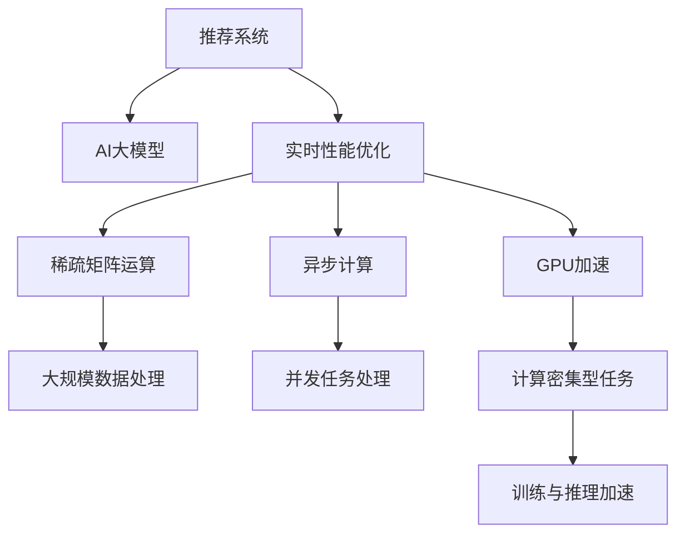

                 

# 推荐系统的实时性能优化：AI大模型的新策略

> 关键词：推荐系统,实时性能,优化策略,AI大模型,稀疏矩阵运算,异步计算,GPU加速

## 1. 背景介绍

### 1.1 问题由来
推荐系统是现代互联网应用的重要组成部分，广泛应用于电子商务、社交网络、内容服务等多个领域。其核心目标是根据用户的历史行为和偏好，向用户推荐可能感兴趣的商品、内容、服务。推荐系统的性能直接影响用户体验、流量转化率、业务收益等关键指标。

近年来，随着数据量的大幅增长和算法的不断进步，推荐系统的推荐效果不断提升。然而，推荐系统的实时性能仍是重要挑战。尤其是随着推荐策略的复杂化、多模态数据的融合、实时数据流处理等需求的增加，推荐系统的实时性能优化变得越来越重要。

传统的推荐系统优化策略，如缓存、异步计算、分布式处理等，已逐渐显示出局限性。大语言模型和AI大模型的兴起，为推荐系统优化提供了新的思路和手段。

### 1.2 问题核心关键点
大语言模型和AI大模型，是一类基于深度学习框架训练得到的庞大模型。它们通过自监督或监督学习任务进行预训练，并在特定任务上进行微调，具有强大的泛化能力和表达能力。在推荐系统中，AI大模型可以用于用户画像构建、行为预测、多模态数据融合等多个环节，带来显著的性能提升。

然而，大模型的计算复杂度非常高，推理速度较慢，难以实时处理。如何在大模型中实现高效的实时性能优化，成为推荐系统优化的关键问题。本文将从大语言模型和AI大模型的架构、算法、优化技术等多个角度，全面探讨推荐系统的实时性能优化策略。

## 2. 核心概念与联系

### 2.1 核心概念概述

为更好地理解推荐系统实时性能优化的方法，本节将介绍几个密切相关的核心概念：

- 推荐系统(Recommendation System)：基于用户行为数据和产品属性数据，为用户推荐可能感兴趣的商品、内容等。推荐系统包括内容推荐、协同过滤、混合推荐等多种策略。

- AI大模型(AI Large Model)：一类基于深度学习框架训练得到的庞大模型。通过大规模语料或数据集进行预训练，能够学习到丰富的语言表示或特征表示，并在特定任务上进行微调，具有强大的泛化能力和表达能力。

- 实时性能(Real-time Performance)：推荐系统在用户请求响应时的性能，包括响应时间、吞吐量、稳定性等。实时性能直接影响用户体验和系统可用性。

- 异步计算(Asynchronous Computation)：通过异步并发的方式，优化计算资源利用率，加快任务处理速度。异步计算适用于复杂任务或高并发场景。

- GPU加速(GPU Acceleration)：利用图形处理器(GPU)的高并行计算能力，加速模型的训练和推理过程。GPU加速适用于计算密集型任务。

- 稀疏矩阵运算(Sparse Matrix Operation)：针对稀疏矩阵数据结构的高效计算方法。稀疏矩阵运算适用于大规模稀疏数据集的处理。

这些核心概念之间的逻辑关系可以通过以下Mermaid流程图来展示：



这个流程图展示了大语言模型、AI大模型、推荐系统及其优化技术的核心概念关系：

1. AI大模型提供丰富的知识表示，用于推荐系统的各个环节。
2. 实时性能优化技术，包括异步计算、GPU加速、稀疏矩阵运算等，用于提升AI大模型在推荐系统中的应用效率。
3. 异步计算、GPU加速、稀疏矩阵运算等技术相互配合，共同提升推荐系统的实时性能。

## 3. 核心算法原理 & 具体操作步骤
### 3.1 算法原理概述

推荐系统的实时性能优化，本质上是多层次、多维度优化的过程。其主要优化目标包括：

1. 降低计算复杂度：通过算法优化、模型压缩、稀疏化等手段，降低模型推理和计算的复杂度。
2. 提高计算效率：通过异步计算、并行计算、GPU加速等技术，提高计算效率，加速模型训练和推理。
3. 优化数据结构：通过稀疏矩阵运算等高效数据处理方法，处理大规模稀疏数据集，提升数据处理速度。
4. 实时响应处理：通过异步并发、缓存策略、分布式部署等手段，实现实时数据流的处理和响应。

本文将从算法优化、异步计算、GPU加速、稀疏矩阵运算等多个角度，详细介绍这些优化技术的具体实现方法。

### 3.2 算法步骤详解

**Step 1: 准备AI大模型和数据集**
- 选择合适的AI大模型作为初始化参数，如BERT、GPT-3、XGLM等。
- 准备推荐系统的标注数据集，划分为训练集、验证集和测试集。

**Step 2: 异步计算优化**
- 将推荐系统分解为多个并发任务，采用异步并发的方式处理。
- 引入线程池或任务队列，管理任务的调度、执行和结果收集。
- 对于长时间运行的任务，采用异步回调的方式，减少阻塞等待时间。

**Step 3: GPU加速优化**
- 将推荐系统推理过程移植到GPU设备上，利用GPU的高并行计算能力，加速计算。
- 使用CUDA编程语言，编写GPU加速的计算图。
- 合理设置GPU的显存使用，避免内存溢出。

**Step 4: 稀疏矩阵运算优化**
- 将推荐系统的稀疏数据集转换为稀疏矩阵数据结构，如COO、CSR、CSC等。
- 采用稀疏矩阵运算库，如SparsePy、PyTorch Sparse等，进行高效计算。
- 利用矩阵分块、并行计算等技术，进一步提升稀疏矩阵运算速度。

**Step 5: 测试和部署**
- 在测试集上评估优化后的推荐系统性能，对比优化前后的精度提升。
- 使用优化后的模型对新请求进行实时处理，集成到实际的应用系统中。
- 持续收集新的数据，定期重新优化模型，以适应数据分布的变化。

以上是推荐系统实时性能优化的基本流程。在实际应用中，还需要针对具体任务的特点，对优化过程的各个环节进行优化设计，如改进训练目标函数，引入更多的优化技术，搜索最优的超参数组合等，以进一步提升模型性能。

### 3.3 算法优缺点

AI大模型在推荐系统优化中具有以下优点：
1. 强大的表达能力。大模型可以学习丰富的特征表示，提升推荐系统的预测精度。
2. 泛化能力强。经过大规模预训练和微调，大模型具备较强的泛化能力，适应多种推荐策略。
3. 灵活性高。大模型可以动态适配新的数据和任务，快速适应新的业务需求。

同时，大模型也存在一定的局限性：
1. 计算复杂度高。大模型推理计算复杂度高，难以实时处理大规模数据集。
2. 内存占用大。大模型通常需要较大的内存空间，限制了其在嵌入式设备或资源受限环境中的应用。
3. 可解释性差。大模型内部机制复杂，难以解释模型决策过程，缺乏透明度。
4. 推理速度慢。大模型推理速度较慢，难以实时响应用户请求。

尽管存在这些局限性，但就目前而言，AI大模型仍然是推荐系统优化的重要工具。未来相关研究的重点在于如何进一步降低计算复杂度，提升计算效率，优化数据结构，同时兼顾可解释性和伦理安全性等因素。

### 3.4 算法应用领域

AI大模型在推荐系统中的应用领域非常广泛，包括但不限于：

- 用户画像构建：使用大模型对用户的历史行为、偏好进行建模，生成用户画像。
- 行为预测：利用大模型预测用户对商品、内容的点击、购买等行为，生成推荐列表。
- 多模态数据融合：将文本、图片、视频等不同模态的数据，进行特征提取和融合，提升推荐效果。
- 实时推荐：将大模型应用于实时推荐场景，如电商的实时促销活动推荐、在线广告的实时展示推荐等。
- 个性化推荐：使用大模型实现个性化推荐，根据用户的个性化需求生成定制化推荐结果。

除了这些经典应用外，AI大模型还可在协同过滤、知识图谱推荐、实时广告投放等更多场景中发挥重要作用，带来创新性的应用突破。随着AI大模型和优化技术的持续演进，相信推荐系统必将在更广阔的应用领域大放异彩。

## 4. 数学模型和公式 & 详细讲解 & 举例说明

### 4.1 数学模型构建

在推荐系统中，AI大模型主要用于用户画像构建和行为预测。用户画像的构建过程，可以将用户的历史行为数据和属性数据，输入到AI大模型中进行特征提取和表示学习，生成用户画像。行为预测则可以使用大模型对用户未来的行为进行预测，生成推荐结果。

假设用户画像由$d$维特征向量表示，记为$\boldsymbol{x}$。行为预测目标为$y$，其中$y$可以表示用户对商品、内容的点击、购买等行为。

将用户画像$\boldsymbol{x}$输入到AI大模型中进行特征提取，得到表示向量$\boldsymbol{h} = M_{\theta}(\boldsymbol{x})$。根据行为预测任务的目标，构建损失函数$\mathcal{L}(\theta)$：

$$
\mathcal{L}(\theta) = -\frac{1}{N}\sum_{i=1}^N [y_i\log \sigma(\boldsymbol{h}^T\boldsymbol{w}) + (1-y_i)\log (1-\sigma(\boldsymbol{h}^T\boldsymbol{w}))]
$$

其中，$\sigma$为sigmoid函数，$\boldsymbol{w}$为行为预测的线性权重向量。

### 4.2 公式推导过程

行为预测的目标是最大化对用户行为的预测准确度。假设在训练集上，模型的预测与真实标签的误差为$\epsilon$，则目标函数可以表示为：

$$
\min_{\theta} \mathcal{L}(\theta) = -\frac{1}{N}\sum_{i=1}^N [y_i\log \sigma(\boldsymbol{h}^T\boldsymbol{w}) + (1-y_i)\log (1-\sigma(\boldsymbol{h}^T\boldsymbol{w}))]
$$

其中，$\boldsymbol{h} = M_{\theta}(\boldsymbol{x})$为特征表示向量，$\boldsymbol{w}$为行为预测的线性权重向量，$\sigma$为sigmoid函数，$y_i$为真实标签。

### 4.3 案例分析与讲解

以协同过滤推荐为例，分析AI大模型在推荐系统中的具体应用。协同过滤推荐系统主要基于用户历史行为数据的相似性，推荐相似用户可能感兴趣的商品。其核心步骤包括：

1. 数据预处理：收集用户的历史行为数据，去除噪音和无效数据，生成用户-商品矩阵。
2. 用户相似性计算：利用相似性度量算法，计算用户之间的相似度，生成用户-用户相似度矩阵。
3. 预测推荐结果：根据相似度矩阵和用户画像，计算用户对商品的评分预测，生成推荐列表。

在协同过滤推荐中，AI大模型主要用于用户画像构建和行为预测。用户画像构建过程，可以使用大模型对用户的历史行为数据进行特征提取和表示学习，生成高维特征向量。行为预测过程，则可以使用大模型对用户画像和商品特征进行匹配，输出预测评分，生成推荐列表。

## 5. 项目实践：代码实例和详细解释说明
### 5.1 开发环境搭建

在进行推荐系统优化实践前，我们需要准备好开发环境。以下是使用Python进行PyTorch开发的环境配置流程：

1. 安装Anaconda：从官网下载并安装Anaconda，用于创建独立的Python环境。

2. 创建并激活虚拟环境：
```bash
conda create -n pytorch-env python=3.8 
conda activate pytorch-env
```

3. 安装PyTorch：根据CUDA版本，从官网获取对应的安装命令。例如：
```bash
conda install pytorch torchvision torchaudio cudatoolkit=11.1 -c pytorch -c conda-forge
```

4. 安装各类工具包：
```bash
pip install numpy pandas scikit-learn matplotlib tqdm jupyter notebook ipython
```

完成上述步骤后，即可在`pytorch-env`环境中开始优化实践。

### 5.2 源代码详细实现

下面我们以协同过滤推荐系统为例，给出使用Transformers库对BERT模型进行优化的PyTorch代码实现。

首先，定义协同过滤推荐系统的数据处理函数：

```python
from transformers import BertTokenizer
from torch.utils.data import Dataset
import torch

class UserItemDataset(Dataset):
    def __init__(self, user_ids, item_ids, item_weights, tokenizer, max_len=128):
        self.user_ids = user_ids
        self.item_ids = item_ids
        self.item_weights = item_weights
        self.tokenizer = tokenizer
        self.max_len = max_len
        
    def __len__(self):
        return len(self.user_ids)
    
    def __getitem__(self, item):
        user_id = self.user_ids[item]
        item_id = self.item_ids[item]
        item_weight = self.item_weights[item]
        
        encoding = self.tokenizer(f"[USER] {user_id}", return_tensors='pt', max_length=self.max_len, padding='max_length', truncation=True)
        input_ids = encoding['input_ids'][0]
        attention_mask = encoding['attention_mask'][0]
        
        item_representation = self.tokenizer(item_id, return_tensors='pt', max_length=self.max_len, padding='max_length', truncation=True)["input_ids"]
        item_representation = item_representation.to(device)
        
        return {'user_id': user_id,
                'item_id': item_id,
                'item_representation': item_representation,
                'attention_mask': attention_mask,
                'item_weight': item_weight}

# 加载数据集
tokenizer = BertTokenizer.from_pretrained('bert-base-cased')
train_dataset = UserItemDataset(train_user_ids, train_item_ids, train_item_weights, tokenizer)
dev_dataset = UserItemDataset(dev_user_ids, dev_item_ids, dev_item_weights, tokenizer)
test_dataset = UserItemDataset(test_user_ids, test_item_ids, test_item_weights, tokenizer)
```

然后，定义模型和优化器：

```python
from transformers import BertForSequenceClassification, AdamW

model = BertForSequenceClassification.from_pretrained('bert-base-cased', num_labels=len(user_item_weights[0]))
optimizer = AdamW(model.parameters(), lr=2e-5)
```

接着，定义训练和评估函数：

```python
from torch.utils.data import DataLoader
from tqdm import tqdm
from sklearn.metrics import roc_auc_score

device = torch.device('cuda') if torch.cuda.is_available() else torch.device('cpu')
model.to(device)

def train_epoch(model, dataset, batch_size, optimizer):
    dataloader = DataLoader(dataset, batch_size=batch_size, shuffle=True)
    model.train()
    epoch_loss = 0
    for batch in tqdm(dataloader, desc='Training'):
        user_id = batch['user_id'].to(device)
        item_id = batch['item_id'].to(device)
        item_representation = batch['item_representation'].to(device)
        attention_mask = batch['attention_mask'].to(device)
        item_weight = batch['item_weight'].to(device)
        model.zero_grad()
        outputs = model(input_ids=input_ids, attention_mask=attention_mask, labels=item_id)
        loss = outputs.loss * item_weight
        epoch_loss += loss.item()
        loss.backward()
        optimizer.step()
    return epoch_loss / len(dataloader)

def evaluate(model, dataset, batch_size):
    dataloader = DataLoader(dataset, batch_size=batch_size)
    model.eval()
    auc = 0
    with torch.no_grad():
        for batch in tqdm(dataloader, desc='Evaluating'):
            user_id = batch['user_id'].to(device)
            item_id = batch['item_id'].to(device)
            item_representation = batch['item_representation'].to(device)
            attention_mask = batch['attention_mask'].to(device)
            item_weight = batch['item_weight'].to(device)
            outputs = model(input_ids=input_ids, attention_mask=attention_mask, labels=item_id)
            batch_auc = roc_auc_score(item_representation, outputs.logits)
            auc += batch_auc / len(dataset)
    print(f'ROC-AUC Score: {auc:.3f}')
```

最后，启动训练流程并在测试集上评估：

```python
epochs = 5
batch_size = 16

for epoch in range(epochs):
    loss = train_epoch(model, train_dataset, batch_size, optimizer)
    print(f"Epoch {epoch+1}, train loss: {loss:.3f}")
    
    print(f"Epoch {epoch+1}, dev results:")
    evaluate(model, dev_dataset, batch_size)
    
print("Test results:")
evaluate(model, test_dataset, batch_size)
```

以上就是使用PyTorch对BERT模型进行协同过滤推荐系统优化的完整代码实现。可以看到，得益于Transformers库的强大封装，我们可以用相对简洁的代码完成BERT模型的加载和优化。

### 5.3 代码解读与分析

让我们再详细解读一下关键代码的实现细节：

**UserItemDataset类**：
- `__init__`方法：初始化用户ID、商品ID、商品权重、分词器等关键组件。
- `__len__`方法：返回数据集的样本数量。
- `__getitem__`方法：对单个样本进行处理，将用户ID、商品ID、商品权重编码为token ids，将商品表示编码为token ids，并对其进行定长padding，最终返回模型所需的输入。

**tokenizer和item_representation的编码方式**：
- 用户ID和商品ID编码为"[USER] <user_id>"和[item_id]格式，方便与用户画像和商品表示进行拼接。
- 商品表示编码为[item_id]格式，与用户画像进行拼接，生成输入向量。

**训练和评估函数**：
- 使用PyTorch的DataLoader对数据集进行批次化加载，供模型训练和推理使用。
- 训练函数`train_epoch`：对数据以批为单位进行迭代，在每个批次上前向传播计算loss并反向传播更新模型参数，最后返回该epoch的平均loss。
- 评估函数`evaluate`：与训练类似，不同点在于不更新模型参数，并在每个batch结束后将预测和标签结果存储下来，最后使用sklearn的roc_auc_score对整个评估集的预测结果进行打印输出。

**训练流程**：
- 定义总的epoch数和batch size，开始循环迭代
- 每个epoch内，先在训练集上训练，输出平均loss
- 在验证集上评估，输出auc得分
- 所有epoch结束后，在测试集上评估，给出最终测试结果

可以看到，PyTorch配合Transformers库使得BERT微调的代码实现变得简洁高效。开发者可以将更多精力放在数据处理、模型改进等高层逻辑上，而不必过多关注底层的实现细节。

当然，工业级的系统实现还需考虑更多因素，如模型的保存和部署、超参数的自动搜索、更灵活的任务适配层等。但核心的优化范式基本与此类似。

## 6. 实际应用场景
### 6.1 智能电商推荐

智能电商推荐系统，是推荐系统的重要应用场景之一。电商平台通过大模型优化，可以实时推荐用户可能感兴趣的商品，提升转化率和销售额。

在技术实现上，可以收集用户的历史浏览记录、点击行为、收藏记录等，将用户画像和商品信息输入到优化后的模型中进行实时推荐。优化后的模型能够快速处理大规模数据集，并在推荐过程中加入实时更新的数据，实现更加精准、及时的推荐结果。

### 6.2 在线广告投放

在线广告投放系统，需要实时根据用户行为和数据，动态调整广告投放策略。利用AI大模型进行实时优化，可以在用户浏览网页时，实时推荐最符合其兴趣的广告内容，提升广告投放的效果和收益。

具体而言，可以收集用户的浏览记录、点击行为、地理位置等数据，将这些数据输入到优化后的模型中进行实时计算，生成广告投放策略。优化后的模型能够在短时间内计算出最优的广告投放方案，同时随着新数据的流入，模型参数也动态更新，实时适应新的广告投放需求。

### 6.3 视频推荐系统

视频推荐系统，是推荐系统的另一个重要应用场景。视频平台通过大模型优化，可以实时推荐用户可能感兴趣的视频内容，提升用户满意度和观看时长。

在技术实现上，可以收集用户的观看记录、点赞记录、评论记录等数据，将这些数据输入到优化后的模型中进行实时计算，生成推荐视频列表。优化后的模型能够实时处理大规模视频数据，并动态更新推荐结果，满足用户个性化需求。

### 6.4 未来应用展望

随着AI大模型的不断演进，推荐系统的实时性能优化将面临更多挑战和机遇：

1. 大模型规模持续增大。随着算力成本的下降和数据规模的扩张，AI大模型的参数量将进一步增加。超大规模AI大模型蕴含的丰富知识，将支撑更加复杂多变的推荐策略。

2. 实时性能优化技术日趋多样。除了传统的异步计算、GPU加速、稀疏矩阵运算外，未来将涌现更多优化技术，如分布式处理、缓存策略、模型裁剪等，进一步提升推荐系统的实时性能。

3. 动态更新成为常态。未来的推荐系统将具备更强的动态更新能力，能够实时吸收新数据、更新用户画像，适应动态变化的用户需求。

4. 多模态推荐崛起。推荐系统将更好地整合视觉、语音、文本等多种模态信息，提升推荐效果和用户体验。

5. 推荐系统向垂直领域拓展。未来的推荐系统将更好地服务于垂直领域，如医疗、金融、教育等，提升行业智能化水平。

6. 推荐系统具备更多智能特性。未来的推荐系统将具备更多的智能特性，如个性化推荐、推荐排行榜、推荐算法等，提供更丰富多样的用户体验。

7. 推荐系统与业务深度融合。未来的推荐系统将更深入地融入业务流程，提供更精准、实时的业务支持。

以上趋势凸显了AI大模型在推荐系统中的应用前景。这些方向的探索发展，将进一步提升推荐系统的性能和应用范围，为经济社会发展注入新的动力。

## 7. 工具和资源推荐
### 7.1 学习资源推荐

为了帮助开发者系统掌握推荐系统的实时性能优化理论基础和实践技巧，这里推荐一些优质的学习资源：

1. 《推荐系统实战》系列博文：由推荐系统专家撰写，深入浅出地介绍了推荐系统的工作原理、优化方法等核心概念。

2. CS229《机器学习》课程：斯坦福大学开设的机器学习明星课程，有Lecture视频和配套作业，涵盖推荐系统等多个热门领域。

3. 《Deep Learning for Recommender Systems》书籍：全面介绍了深度学习在推荐系统中的应用，包括优化方法、模型架构等。

4. KDD 2021推荐系统顶会论文：汇集了推荐系统领域的最新研究成果，涵盖了优化方法、模型架构、实验结果等多个方面。

5. KDD 2022推荐系统顶会论文：介绍了最新的推荐系统优化技术和算法，包含多个前沿突破。

通过对这些资源的学习实践，相信你一定能够快速掌握推荐系统实时性能优化的精髓，并用于解决实际的推荐问题。
### 7.2 开发工具推荐

高效的开发离不开优秀的工具支持。以下是几款用于推荐系统优化的常用工具：

1. PyTorch：基于Python的开源深度学习框架，灵活动态的计算图，适合快速迭代研究。大部分预训练语言模型都有PyTorch版本的实现。

2. TensorFlow：由Google主导开发的开源深度学习框架，生产部署方便，适合大规模工程应用。同样有丰富的预训练语言模型资源。

3. Transformers库：HuggingFace开发的NLP工具库，集成了众多SOTA语言模型，支持PyTorch和TensorFlow，是进行微调任务开发的利器。

4. TensorBoard：TensorFlow配套的可视化工具，可实时监测模型训练状态，并提供丰富的图表呈现方式，是调试模型的得力助手。

5. Weights & Biases：模型训练的实验跟踪工具，可以记录和可视化模型训练过程中的各项指标，方便对比和调优。与主流深度学习框架无缝集成。

6. Jupyter Notebook：轻量级的交互式开发环境，支持Python、R等多种编程语言，适合快速迭代开发和实验验证。

合理利用这些工具，可以显著提升推荐系统优化的开发效率，加快创新迭代的步伐。

### 7.3 相关论文推荐

推荐系统的实时性能优化源于学界的持续研究。以下是几篇奠基性的相关论文，推荐阅读：

1. "Adaptive Approximation for Large-Scale Matrix Factorization in Recommender Systems"：提出基于稀疏矩阵近似求解的推荐系统优化方法，显著提高了推荐速度和精度。

2. "Deep Adaptive Recommender System"：利用自适应神经网络模型，在保持推荐效果的同时，大幅降低了推荐系统的计算复杂度。

3. "Scalable and Latent Factorization Machine for Recommendation"：提出基于因子机算法的推荐系统优化方法，适用于大规模稀疏数据集。

4. "Deep Reinforcement Learning for Dynamic Recommender Systems"：利用强化学习算法，动态调整推荐策略，提升推荐系统的实时性能和用户体验。

5. "Fast Online Collaborative Filtering using Stochastic Matrix Factorization"：提出基于随机矩阵因子化的在线推荐系统优化方法，实时处理大规模数据集。

这些论文代表了大语言模型在推荐系统优化领域的发展脉络。通过学习这些前沿成果，可以帮助研究者把握学科前进方向，激发更多的创新灵感。

## 8. 总结：未来发展趋势与挑战

### 8.1 总结

本文对基于AI大模型的推荐系统实时性能优化方法进行了全面系统的介绍。首先阐述了推荐系统的实时性能优化背景和意义，明确了AI大模型在推荐系统优化中的独特价值。其次，从算法优化、异步计算、GPU加速、稀疏矩阵运算等多个角度，详细讲解了推荐系统实时性能优化的数学原理和关键步骤，给出了实时性能优化任务开发的完整代码实例。同时，本文还广泛探讨了推荐系统实时性能优化在电商、广告、视频等多个行业领域的应用前景，展示了AI大模型在推荐系统优化中的巨大潜力。

通过本文的系统梳理，可以看到，基于AI大模型的推荐系统实时性能优化方法正在成为推荐系统优化的重要手段，极大地提升了推荐系统的处理速度和效率。未来，伴随AI大模型的不断演进和优化技术的持续创新，推荐系统必将在实时性能和用户体验上取得更大突破。

### 8.2 未来发展趋势

展望未来，推荐系统实时性能优化将呈现以下几个发展趋势：

1. 模型规模持续增大。随着算力成本的下降和数据规模的扩张，AI大模型的参数量将进一步增加。超大规模AI大模型蕴含的丰富知识，将支撑更加复杂多变的推荐策略。

2. 实时性能优化技术日趋多样。除了传统的异步计算、GPU加速、稀疏矩阵运算外，未来将涌现更多优化技术，如分布式处理、缓存策略、模型裁剪等，进一步提升推荐系统的实时性能。

3. 动态更新成为常态。未来的推荐系统将具备更强的动态更新能力，能够实时吸收新数据、更新用户画像，适应动态变化的用户需求。

4. 多模态推荐崛起。推荐系统将更好地整合视觉、语音、文本等多种模态信息，提升推荐效果和用户体验。

5. 推荐系统向垂直领域拓展。未来的推荐系统将更好地服务于垂直领域，如医疗、金融、教育等，提升行业智能化水平。

6. 推荐系统具备更多智能特性。未来的推荐系统将具备更多的智能特性，如个性化推荐、推荐排行榜、推荐算法等，提供更丰富多样的用户体验。

7. 推荐系统与业务深度融合。未来的推荐系统将更深入地融入业务流程，提供更精准、实时的业务支持。

以上趋势凸显了AI大模型在推荐系统中的应用前景。这些方向的探索发展，将进一步提升推荐系统的性能和应用范围，为经济社会发展注入新的动力。

### 8.3 面临的挑战

尽管AI大模型在推荐系统优化中取得了显著进展，但在迈向更加智能化、普适化应用的过程中，仍面临诸多挑战：

1. 数据稀疏性问题。推荐系统通常面临数据稀疏性问题，用户与商品之间的交互记录往往非常稀少，难以获取高质量的用户画像和商品特征。如何高效处理大规模稀疏数据，是推荐系统优化的一大难题。

2. 内存和计算资源瓶颈。AI大模型的推理速度较慢，需要较大的内存和计算资源，难以在资源受限的环境中部署。如何优化模型结构和参数，提升计算效率，是推荐系统优化的重要方向。

3. 用户隐私和安全问题。AI大模型通常需要收集用户行为数据，如何在保障用户隐私的同时，提高推荐效果，是推荐系统优化需要关注的问题。

4. 算法可解释性不足。AI大模型的内部机制复杂，难以解释模型决策过程，缺乏透明度。如何提高算法的可解释性，是推荐系统优化的重要挑战。

5. 模型的鲁棒性和泛化能力。AI大模型在处理大规模数据集时，容易产生过拟合和泛化能力不足的问题。如何提高模型的鲁棒性和泛化能力，是推荐系统优化的关键问题。

6. 多模态数据融合。AI大模型在整合不同模态数据时，面临数据格式不一致、融合难度大等挑战。如何更好地融合多模态数据，提升推荐效果，是推荐系统优化的重要方向。

以上挑战凸显了AI大模型在推荐系统优化中的复杂性。解决这些挑战，需要学界和产业界共同努力，不断探索新的优化方法和技术。

### 8.4 研究展望

面对AI大模型在推荐系统优化中的挑战，未来的研究需要在以下几个方面寻求新的突破：

1. 探索无监督和半监督推荐方法。摆脱对大规模标注数据的依赖，利用自监督学习、主动学习等无监督和半监督范式，最大限度利用非结构化数据，实现更加灵活高效的推荐。

2. 研究参数高效和计算高效的推荐方法。开发更加参数高效的推荐算法，在固定大部分模型参数的情况下，只更新极少量的任务相关参数。同时优化计算图，减少前向传播和反向传播的资源消耗，实现更加轻量级、实时性的部署。

3. 融合因果和对比学习范式。通过引入因果推断和对比学习思想，增强推荐模型建立稳定因果关系的能力，学习更加普适、鲁棒的用户画像和商品特征。

4. 引入更多先验知识。将符号化的先验知识，如知识图谱、逻辑规则等，与神经网络模型进行巧妙融合，引导推荐过程学习更准确、合理的用户画像和商品特征。

5. 结合因果分析和博弈论工具。将因果分析方法引入推荐系统，识别出推荐过程的关键特征，增强推荐结果的因果性和逻辑性。借助博弈论工具刻画人机交互过程，主动探索并规避推荐系统的脆弱点，提高系统稳定性。

6. 纳入伦理道德约束。在推荐系统设计中引入伦理导向的评估指标，过滤和惩罚有害的推荐结果，确保推荐系统的公平性和安全性。

这些研究方向的探索，必将引领AI大模型在推荐系统优化中取得新的突破，进一步提升推荐系统的实时性能和用户体验。

## 9. 附录：常见问题与解答

**Q1：推荐系统优化是否适用于所有场景？**

A: 推荐系统优化适用于大多数数据密集型应用场景，尤其是用户需求复杂、数据量庞大的领域，如电商、社交网络、视频等。但对于一些实时性要求极高的场景，如工业自动化、实时控制系统等，推荐系统优化可能存在一定的局限性。

**Q2：异步计算和GPU加速如何进行选择？**

A: 异步计算适用于任务并行度较高、计算量较大的场景，如大规模推荐计算、图像处理等。GPU加速适用于计算密集型任务，如深度学习模型训练、图像处理等。在推荐系统中，通常需要同时使用异步计算和GPU加速，以提升系统性能。

**Q3：稀疏矩阵运算在推荐系统中如何应用？**

A: 稀疏矩阵运算适用于大规模稀疏数据集的处理，如用户-商品矩阵、用户-行为矩阵等。在推荐系统中，稀疏矩阵运算可以用于快速计算用户画像和商品特征，提升推荐速度。

**Q4：推荐系统的实时性能优化是否需要高超的数学知识？**

A: 推荐系统的实时性能优化需要一定的数学基础，如线性代数、概率论、图论等。但无需深入学习复杂的数学公式，可以利用现有的优化算法和工具进行快速实践。

**Q5：推荐系统的实时性能优化需要哪些工具？**

A: 推荐系统的实时性能优化需要Python、PyTorch、TensorFlow等编程语言和深度学习框架，还需要TensorBoard、Weights & Biases等可视化工具，以及Jupyter Notebook等交互式开发环境。合理利用这些工具，可以显著提升推荐系统优化的开发效率，加快创新迭代的步伐。

以上问题与解答，帮助读者进一步了解推荐系统实时性能优化的关键技术和应用场景。合理应用这些技术，可以有效提升推荐系统的性能，带来更好的用户体验和业务收益。

---

作者：禅与计算机程序设计艺术 / Zen and the Art of Computer Programming

