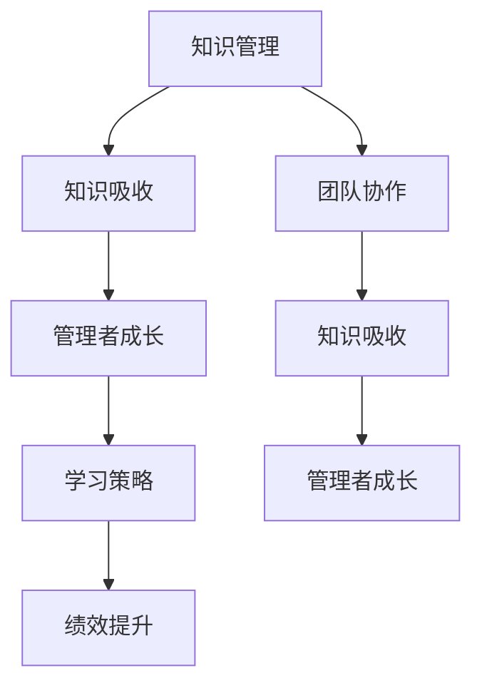

                 

# 提升知识吸收率:管理者成长的关键

> 关键词：知识管理, 知识吸收, 管理者成长, 学习策略, 绩效提升, 团队协作

## 1. 背景介绍

### 1.1 问题由来
在知识经济时代，管理者扮演着重要的角色，他们是组织知识创新的核心驱动力。然而，由于知识量激增，管理者面临前所未有的知识压力。如何高效吸收、利用知识，成为每个管理者必须面对的挑战。

管理者需要在有限的时间内掌握专业技能，提升自身素质，优化团队协作，推动企业发展。传统依靠经验积累的学习方式难以应对快速变化的环境，通过科学的学习策略和方法，提升知识吸收率，是管理者成长的关键。

### 1.2 问题核心关键点
核心问题在于如何构建一个高效的知识吸收体系，提升管理者的学习效率。这不仅涉及个体的学习策略和行为，也与组织的知识管理体系、团队协作机制、绩效评估标准等多方面紧密相关。

### 1.3 问题研究意义
研究提升知识吸收率的策略和方法，对于管理者自身的职业成长，对于组织知识创新能力的提升，具有重要意义。它能够帮助管理者在竞争激烈的市场环境中脱颖而出，为企业的长远发展奠定坚实的基础。

## 2. 核心概念与联系

### 2.1 核心概念概述

为更好地理解提升知识吸收率的方法，本节将介绍几个密切相关的核心概念：

- **知识管理(Knowledge Management, KM)**：旨在组织、存储、共享和应用知识，通过知识管理，个人和组织能够更好地利用知识资源，提升效率和创新能力。
- **知识吸收(Knowledge Absorption)**：指个人或团队获取、理解和应用新知识的过程。吸收率高的管理者能够快速掌握最新知识，并将其转化为实际生产力。
- **管理者成长(Managerial Growth)**：管理者通过不断学习和实践，提升领导能力、决策能力、沟通能力和团队管理能力的过程。
- **学习策略(Learning Strategies)**：一套科学的、系统化的学习方法和技巧，旨在提升学习效率和效果。
- **绩效提升(Performance Enhancement)**：通过有效的知识吸收和学习策略，管理者能够在工作绩效上取得显著提升，推动团队和组织的整体进步。
- **团队协作(Team Collaboration)**：团队成员之间有效的沟通、协调和合作，是知识吸收和应用的重要保障。

这些核心概念之间的逻辑关系可以通过以下Mermaid流程图来展示：



这个流程图展示了几者之间的逻辑关系：

1. 通过知识管理，获取和组织各类知识资源。
2. 知识管理为知识吸收提供基础，管理者通过有效的学习策略，吸收新知识。
3. 知识吸收直接推动管理者成长，提升领导能力和决策能力。
4. 管理者成长又会反馈到绩效提升，提高团队和工作效率。
5. 团队协作是知识吸收和应用的重要环节，促进知识共享和创新。

## 3. 核心算法原理 & 具体操作步骤

### 3.1 算法原理概述

提升知识吸收率的策略方法，本质上是一个系统化的学习和优化过程。其核心思想是：通过科学的知识管理体系、高效的学习策略和良好的团队协作机制，促进知识的获取、理解和应用，进而实现管理者的全面成长和组织绩效的提升。

形式化地，假设管理者 $M$ 希望通过一系列学习策略 $S$ 和知识管理体系 $KM$ 提升其知识吸收率 $A$，目标函数为：

$$
\max_{S,KM} A(S,KM)
$$

其中 $A(S,KM)$ 表示在给定的学习策略和知识管理体系下，管理者的知识吸收率。

### 3.2 算法步骤详解

提升知识吸收率的算法步骤主要包括以下几个关键环节：

**Step 1: 构建知识管理体系**
- 设计知识管理框架，包括知识库、知识共享平台、知识地图等。
- 确定知识分类、存储和检索的标准。
- 制定知识共享和交流的规范和流程。

**Step 2: 制定学习策略**
- 根据工作需求和个人发展目标，制定个性化学习计划。
- 采用多种学习方式，如在线课程、研讨会、读书笔记等。
- 建立学习反馈机制，定期评估学习效果。

**Step 3: 实施知识吸收**
- 利用知识管理系统，快速检索和获取新知识。
- 采用主动学习和协作学习的方式，深化理解。
- 通过实践应用，巩固和验证所学知识。

**Step 4: 评估和调整**
- 定期进行学习效果评估，通过考试、考核等方式检验学习成果。
- 根据评估结果，调整学习策略和知识管理体系。
- 建立持续改进的机制，不断优化知识吸收过程。

**Step 5: 反馈和应用**
- 将吸收的知识应用于实际工作中，推动团队和组织绩效提升。
- 通过反馈和反思，总结经验，提炼精华，形成知识库。

通过以上步骤，管理者能够构建一个高效的知识吸收体系，实现知识的快速获取、深度理解和有效应用。

### 3.3 算法优缺点

提升知识吸收率的策略方法具有以下优点：
1. 系统化。通过科学的知识管理体系和高效的学习策略，能够系统地推进知识吸收过程。
2. 针对性。根据个人需求和组织目标，制定个性化学习计划，提升学习效率。
3. 持续改进。通过不断的评估和调整，优化知识吸收过程，实现持续改进。
4. 促进成长。通过知识的获取和应用，提升管理者的综合素质和绩效水平。

同时，该方法也存在一定的局限性：
1. 初始投入大。构建知识管理体系和学习策略需要一定的资源和精力投入。
2. 实施难度高。需要管理者具备较强的组织协调能力和持续学习的毅力。
3. 依赖外部支持。知识的获取和应用往往需要外部系统的支持，如知识库、学习平台等。

尽管存在这些局限性，但总体而言，提升知识吸收率的方法仍然是一种高效的管理者成长途径。未来研究需要更多关注如何降低初始投入，提高实施便捷性，提升知识系统的自适应能力。

### 3.4 算法应用领域

提升知识吸收率的策略方法，在多个领域都有广泛的应用，例如：

- **企业培训与开发**：通过系统的知识管理体系和个性化学习策略，提升员工的知识吸收率，提高企业竞争力。
- **项目管理**：通过知识共享和协作学习，提高项目管理团队的决策能力和执行效率。
- **组织创新**：通过知识吸收和创新，推动企业的技术创新和产品创新。
- **战略规划**：通过知识吸收和市场分析，制定科学合理的战略规划。
- **团队建设**：通过知识共享和团队协作，提升团队的凝聚力和协作能力。

## 4. 数学模型和公式 & 详细讲解 & 举例说明

### 4.1 数学模型构建

本节将使用数学语言对提升知识吸收率的方法进行更加严格的刻画。

记管理者的知识吸收率为 $A$，知识管理系统的效率为 $KM$，学习策略的有效性为 $S$。则知识吸收率可以表示为：

$$
A(S,KM) = f(S,KM)
$$

其中 $f$ 表示知识吸收率与知识管理系统、学习策略之间的关系。

### 4.2 公式推导过程

为了简化问题，我们假设知识管理系统和资源平台的效率对知识吸收率的影响可以通过线性函数表示：

$$
A(S,KM) = S + KM
$$

这表明，学习策略的有效性 $S$ 和知识管理系统的效率 $KM$ 对知识吸收率 $A$ 具有加和效应。

通过上述线性模型，管理者可以通过提升学习策略的有效性和优化知识管理系统，来实现知识吸收率的提升。

### 4.3 案例分析与讲解

假设某公司希望通过提升知识吸收率来提高员工的工作绩效。通过分析员工的学习习惯和知识获取方式，公司决定引入知识管理系统和在线学习平台。根据公式 $A(S,KM) = S + KM$，公司的目标是将知识吸收率从当前水平 $A_0$ 提升至目标水平 $A_t$。

首先，公司对员工的学习习惯进行调研，发现大部分员工使用内部论坛和文档库进行知识检索，但缺乏系统的学习计划和反馈机制。公司决定引入在线学习平台和知识库，并制定系统的学习计划和反馈机制。设引入知识管理系统后，知识管理系统的效率为 $KM_1$，学习策略的有效性为 $S_1$。

经过一段时间的实施，公司的知识吸收率达到了目标水平 $A_t$。通过对比实施前后的数据，可以计算出 $KM_1$ 和 $S_1$ 的具体数值，评估提升知识吸收率的效果。

## 5. 项目实践：代码实例和详细解释说明

### 5.1 开发环境搭建

在进行知识管理体系和在线学习平台的开发前，我们需要准备好开发环境。以下是使用Python进行Django开发的环境配置流程：

1. 安装Anaconda：从官网下载并安装Anaconda，用于创建独立的Python环境。

2. 创建并激活虚拟环境：
```bash
conda create -n myenv python=3.8 
conda activate myenv
```

3. 安装Django：从官网获取对应的安装命令。例如：
```bash
pip install django==4.0
```

4. 安装各种工具包：
```bash
pip install django-crispy-forms django-ckeditor django-pgdb django-gis django-rest-framework
```

完成上述步骤后，即可在`myenv`环境中开始项目开发。

### 5.2 源代码详细实现

这里我们以一个简单的知识管理系统为例，展示如何使用Django框架实现。

首先，定义模型的数据结构：

```python
from django.db import models

class Knowledge(models.Model):
    title = models.CharField(max_length=255)
    content = models.TextField()
    date = models.DateTimeField(auto_now_add=True)

class User(models.Model):
    username = models.CharField(max_length=50)
    email = models.EmailField(unique=True)
```

然后，定义视图函数：

```python
from django.shortcuts import render, redirect
from django.http import HttpResponse
from .models import Knowledge

def knowledge_list(request):
    knowledge = Knowledge.objects.all()
    return render(request, 'knowledge/list.html', {'knowledge': knowledge})

def knowledge_detail(request, pk):
    knowledge = Knowledge.objects.get(pk=pk)
    return render(request, 'knowledge/detail.html', {'knowledge': knowledge})
```

接着，编写模板文件：

```html
<!-- list.html -->
<html>
    <body>
        <h1>知识列表</h1>
        <ul>
            
            <li><a href="">{{ item.title }}</a></li>
            
        </ul>
    </body>
</html>

<!-- detail.html -->
<html>
    <body>
        <h1>{{ knowledge.title }}</h1>
        <p>{{ knowledge.content }}</p>
    </body>
</html>
```

最后，启动开发服务器：

```bash
python manage.py runserver
```

通过上述代码，我们实现了基本的知识管理系统，包括知识列表展示和知识详情查看。

### 5.3 代码解读与分析

让我们再详细解读一下关键代码的实现细节：

**Knowledge和User模型**：
- `Knowledge` 模型定义了知识项的基本信息，包括标题、内容和创建时间。
- `User` 模型定义了用户的基本信息，包括用户名和邮箱。

**视图函数**：
- `knowledge_list` 函数用于展示知识列表，获取所有知识项并渲染到模板中。
- `knowledge_detail` 函数用于展示知识详情，根据ID获取指定知识项并渲染到模板中。

**模板文件**：
- `list.html` 文件用于展示知识列表，循环遍历所有知识项并输出标题和链接。
- `detail.html` 文件用于展示知识详情，输出知识项的标题和内容。

**开发服务器**：
- `python manage.py runserver` 命令启动Django开发服务器，将项目代码运行在本地开发环境中。

可以看到，使用Django框架进行知识管理系统的开发，能够快速构建出高效的知识检索和展示功能。通过不断优化前端设计和后端逻辑，可以实现更丰富的知识管理功能，如知识分类、知识推荐、知识更新等。

## 6. 实际应用场景

### 6.1 企业培训与开发

企业可以利用知识管理系统和在线学习平台，构建一个系统的学习体系，提升员工的整体素质和绩效。通过个性化学习计划和在线考核，员工能够快速掌握新知识和技能，提高工作效率。

在技术实现上，企业可以根据不同岗位的需求，定制相应的学习路径和考核标准，利用知识管理系统进行学习进度管理和学习效果评估。

### 6.2 项目管理

项目团队可以通过知识管理系统，共享项目文档、技术方案、风险预警等信息，提升团队的决策能力和执行效率。通过在线协作工具，团队成员可以实时沟通和交流，促进知识共享和协作。

在技术实现上，可以结合项目管理工具如Trello、Jira等，将知识管理系统嵌入到项目管理流程中，实现知识的动态更新和团队协作。

### 6.3 组织创新

通过知识吸收和创新，组织能够快速应对市场变化，推动技术进步和产品迭代。知识管理系统和在线学习平台，可以成为组织创新能力的坚实基础。

在技术实现上，可以引入知识地图和推荐系统，帮助员工快速定位所需知识，并根据历史数据和反馈，动态调整推荐策略。

### 6.4 战略规划

战略规划部门可以通过知识管理系统，获取最新的市场信息、技术动态和政策法规，制定科学合理的战略规划。通过知识吸收和分析，提升战略决策的科学性和前瞻性。

在技术实现上，可以利用自然语言处理和知识图谱技术，对知识进行分类、归纳和整合，构建知识驱动的战略决策支持系统。

## 7. 工具和资源推荐

### 7.1 学习资源推荐

为了帮助开发者系统掌握提升知识吸收率的理论基础和实践技巧，这里推荐一些优质的学习资源：

1. 《管理者的知识管理手册》系列博文：由知识管理专家撰写，深入浅出地介绍了知识管理的原理、方法、工具和案例。

2. Coursera《学习设计与技术》课程：由美国密歇根大学开设，深入讲解了学习设计、评估和应用的方法论。

3. 《学习者的未来》书籍：Google教育团队编写的书籍，系统地介绍了未来的学习模式和技术趋势。

4. Udemy《学习策略与方法》课程：通过在线视频和互动练习，帮助学习者掌握有效的学习策略和方法。

5. Hacker News《知识管理》板块：汇集了大量关于知识管理的讨论和资源，是了解最新研究进展的好地方。

通过对这些资源的学习实践，相信你一定能够快速掌握提升知识吸收率的关键要素，并用于解决实际的管理问题。

### 7.2 开发工具推荐

高效的开发离不开优秀的工具支持。以下是几款用于知识管理系统和在线学习平台开发的常用工具：

1. Django：基于Python的开源Web框架，灵活动态的URL路由和模板系统，适合快速迭代研究。

2. Flask：轻量级的Web框架，简单易用，适合快速开发和部署小规模知识管理系统。

3. AngularJS/React：现代化的前端框架，支持丰富的交互和动画效果，提升用户体验。

4. Bootstrap/Stylus：流行的前端设计框架，提供丰富的样式和组件，提升UI设计质量。

5. Git/GitHub：版本控制系统，支持代码协作和版本管理，方便团队协作开发。

合理利用这些工具，可以显著提升知识管理系统和在线学习平台的开发效率，加快创新迭代的步伐。

### 7.3 相关论文推荐

知识吸收和管理技术的发展源于学界的持续研究。以下是几篇奠基性的相关论文，推荐阅读：

1. Knowledge Management: An Analysis and Proposed Framework for Learning Organization（Knowledge Management综述论文）：总结了知识管理的理论和实践，提出了知识管理的框架。

2. Learning by Doing: A Field Experiment with Learning Technologies in China（知识吸收机制研究）：通过实证研究，探讨了知识吸收机制在不同文化和环境下的影响。

3. How Management Knowledge Evolves and Changes in Time（管理知识演化研究）：分析了管理知识随时间演变的规律和趋势。

4. Learning Strategies: What Works, What Doesn't, and Why（学习策略研究）：探讨了不同的学习策略对知识吸收率的影响。

5. The Relationship between Knowledge Management Practices and Organizational Performance: An Empirical Investigation（知识管理与组织绩效关系研究）：研究了知识管理实践对组织绩效的影响。

这些论文代表了大语言模型微调技术的发展脉络。通过学习这些前沿成果，可以帮助研究者把握学科前进方向，激发更多的创新灵感。

## 8. 总结：未来发展趋势与挑战

### 8.1 总结

本文对提升知识吸收率的策略方法进行了全面系统的介绍。首先阐述了知识吸收率提升在管理者成长中的重要意义，明确了知识管理体系、学习策略和团队协作之间的紧密联系。其次，从原理到实践，详细讲解了知识吸收率的计算模型和提升方法，给出了知识管理系统开发的完整代码实现。同时，本文还广泛探讨了知识吸收率提升在多个领域的应用前景，展示了其广泛的应用价值。

通过本文的系统梳理，可以看到，提升知识吸收率的方法已经在多个领域得到了广泛应用，为管理者提供了科学的学习策略和管理工具。未来，伴随知识吸收率提升技术的不断进步，必将进一步推动管理者的职业成长和组织的发展进步。

### 8.2 未来发展趋势

展望未来，提升知识吸收率的策略方法将呈现以下几个发展趋势：

1. 技术驱动。人工智能、大数据、自然语言处理等技术的应用，将进一步提升知识吸收的效率和效果。

2. 数据驱动。通过分析学习行为和知识分布，制定个性化的学习计划，提升学习效率。

3. 协同驱动。通过团队协作和知识共享，促进知识的传播和应用，提升组织创新能力。

4. 自适应驱动。知识管理系统和在线学习平台，将具备自适应学习策略的能力，动态调整学习路径和资源配置。

5. 持续驱动。建立持续改进的机制，定期评估和优化知识管理体系和学习策略，实现知识的不断更新和提升。

6. 可视化驱动。通过知识可视化技术，帮助管理者直观地理解和应用知识，提升学习效果。

这些趋势展示了提升知识吸收率技术的发展方向，将推动知识管理系统的智能化和科学化，为管理者的成长和组织的发展提供新的动力。

### 8.3 面临的挑战

尽管提升知识吸收率的策略方法已经取得了显著成效，但在迈向更加智能化、普适化应用的过程中，它仍面临着诸多挑战：

1. 初始投入高。构建知识管理系统和学习策略需要较大的前期投入，包括硬件设备、软件工具、人力资源等。

2. 实施难度大。知识吸收率的提升需要持续的投入和维护，难以一蹴而就。

3. 数据安全风险。知识管理系统需要处理大量敏感信息，数据安全和隐私保护成为重要问题。

4. 组织文化差异。不同组织和团队的文化背景和工作习惯不同，难以统一实施知识管理体系。

5. 个体差异。员工的个体差异较大，统一的培训和评估标准难以满足所有人的需求。

6. 资源分配。知识管理系统和在线学习平台需要大量的资源支持，如何合理分配资源成为重要问题。

这些挑战需要管理者在实际应用中不断探索和解决，才能将提升知识吸收率的技术转化为真正的管理效能。

### 8.4 研究展望

面对提升知识吸收率所面临的挑战，未来的研究需要在以下几个方面寻求新的突破：

1. 大数据和人工智能的深度融合。将大数据和人工智能技术应用于知识管理，提升知识的获取、分类、推荐和应用能力。

2. 知识吸收率的动态评估。引入动态评估机制，实时监测和管理知识吸收率，根据反馈进行优化。

3. 知识吸收率的个性化定制。通过分析员工的学习行为和知识偏好，定制个性化的学习路径和资源，提升学习效果。

4. 知识吸收率的自适应学习。开发自适应学习系统，根据员工的学习状态和知识储备，动态调整学习策略和资源配置。

5. 知识吸收率的安全保护。引入数据加密、权限控制等技术，保障知识管理系统和数据的安全。

这些研究方向的探索，必将引领提升知识吸收率技术迈向更高的台阶，为管理者的成长和组织的发展提供新的支持。面向未来，管理者需要不断学习新技术、掌握新方法，才能在知识经济时代中保持竞争优势。

## 9. 附录：常见问题与解答

**Q1：如何选择合适的学习策略？**

A: 选择学习策略需要考虑多方面因素，如个人学习风格、知识领域、工作需求等。一般建议选择多种学习方式组合，如在线课程、阅读、实践、交流等，以实现全面的知识获取和应用。

**Q2：如何构建知识管理体系？**

A: 构建知识管理体系需要明确知识分类、存储和检索的标准，设计知识共享和交流的流程，引入知识库、知识图谱、推荐系统等工具。可以通过内部研讨、专家咨询等方式，制定详细的知识管理策略。

**Q3：知识吸收率如何评估？**

A: 知识吸收率的评估可以从多个维度进行，如知识掌握程度、应用效果、反馈反馈等。可以设计考试、考核、问卷调查等工具，定期评估员工的知识吸收情况。

**Q4：知识管理系统和在线学习平台如何设计？**

A: 知识管理系统和在线学习平台的设计需要考虑用户界面、数据存储、交互体验、安全保障等因素。可以使用Django、Flask等Web框架进行开发，结合AngularJS/React、Bootstrap等前端技术提升用户体验。

**Q5：如何提升知识吸收率的持续改进？**

A: 持续改进是提升知识吸收率的关键。可以通过定期的评估和反馈，调整学习策略和知识管理体系。同时引入自适应学习技术，动态调整学习路径和资源配置，实现持续改进。

通过本文的系统梳理，可以看到，提升知识吸收率的方法已经在多个领域得到了广泛应用，为管理者提供了科学的学习策略和管理工具。未来，伴随知识吸收率提升技术的不断进步，必将进一步推动管理者的职业成长和组织的发展进步。面向未来，管理者需要不断学习新技术、掌握新方法，才能在知识经济时代中保持竞争优势。

