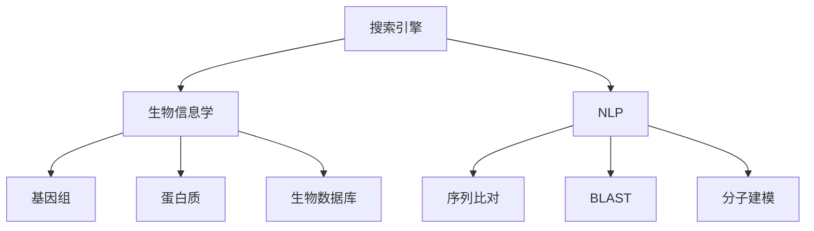

                 

# 搜索引擎的生物信息学整合

> 关键词：搜索引擎, 生物信息学, 文本匹配, 自然语言处理, 基因组分析, 生物数据库, 搜索引擎技术

## 1. 背景介绍

### 1.1 问题由来
在当今的信息时代，互联网中充斥着海量的数据，如何高效地搜索和提取这些数据，成为了一个迫切需要解决的问题。传统的搜索引擎技术，如Google、Bing等，虽然已经相当成熟，但在处理特定领域的信息时，往往难以应对领域特有的查询需求。

生物信息学领域是一个典型例子。随着基因组测序技术的进步，生物数据量呈爆炸式增长，涉及DNA序列、蛋白质结构、生物通路等多个层面，具有复杂的结构和知识体系。生物学家和研究人员需要通过搜索引擎快速获取相关信息，以推进科学研究和临床应用。

因此，如何将搜索引擎技术与生物信息学领域的数据特点结合起来，实现对生物数据的精准搜索和分析，成为了一个重要的研究课题。

### 1.2 问题核心关键点
生物信息学搜索引擎的核心在于将搜索引擎技术和生物信息学数据的特点进行有机整合，实现对生物数据的深度理解、精准检索和高效整合。这需要解决以下几个关键问题：

1. 如何快速处理和理解大规模生物数据？
2. 如何构建适合生物数据特点的索引结构？
3. 如何快速准确的检索特定生物数据？
4. 如何处理生物数据中的复杂结构和多模态信息？
5. 如何高效整合生物数据库和其他相关资源？

## 2. 核心概念与联系

### 2.1 核心概念概述

为更好地理解搜索引擎的生物信息学整合方法，本节将介绍几个密切相关的核心概念：

- 搜索引擎（Search Engine）：通过抓取互联网上的网页信息，并根据用户查询构建结果返回的自动化系统。
- 生物信息学（Bioinformatics）：应用计算机技术和统计学方法，对生物数据进行处理、分析和解释的学科。
- 自然语言处理（Natural Language Processing, NLP）：使计算机能够理解、分析、生成人类语言的技术。
- 基因组（Genome）：生物体内所有DNA序列的总和，包含生物遗传信息。
- 蛋白质（Protein）：基因编码的生物大分子，具有特定的结构和功能。
- 生物数据库（Bio-database）：存储生物数据的集中场所，如GenBank、UniProt等。
- 序列比对（Sequence Alignment）：比较不同DNA、RNA、蛋白质序列的相似性，以寻找同源序列。
- BLAST（Basic Local Alignment Search Tool）：一种常用的序列比对工具，用于在生物数据库中查找相似序列。
- 分子建模（Molecular Modeling）：通过计算机模拟分子结构，研究生物大分子的三维结构。

这些核心概念之间的逻辑关系可以通过以下Mermaid流程图来展示：



这个流程图展示了我们研究的几个关键概念及其之间的联系：

1. 搜索引擎通过抓取生物信息学相关的网页和数据，进行索引和检索。
2. 自然语言处理技术帮助搜索引擎理解和处理用户查询。
3. 基因组和蛋白质数据是生物信息学研究的重点，需要特别处理。
4. 生物数据库是存储和检索生物数据的重要资源。
5. 序列比对和分子建模是生物信息学研究中的重要工具，用于处理生物数据的结构信息。

## 3. 核心算法原理 & 具体操作步骤
### 3.1 算法原理概述

搜索引擎的生物信息学整合，本质上是一个将搜索引擎技术、自然语言处理技术和生物信息学数据特点相结合的复合过程。其核心思想是：通过深度理解和处理生物数据，构建适合生物数据特点的索引结构，从而实现对生物数据的精准检索和分析。

形式化地，假设搜索引擎系统为 $S$，生物数据库为 $D$，用户查询为 $Q$。搜索引擎的目标是找到一个最相关的生物数据集合 $R$，使得：

$$
R = \mathop{\arg\min}_{D} \mathcal{L}(S,D,Q)
$$

其中 $\mathcal{L}$ 为搜索引擎的损失函数，用于衡量检索结果与用户查询的相似性。

具体实现上，基于搜索引擎的生物信息学整合过程可以分为以下几个步骤：

1. 对用户查询进行自然语言处理，提取关键词和语义信息。
2. 在生物数据库中查找与查询相关的基因、蛋白质、序列等数据。
3. 对查询和数据库中的数据进行序列比对和分子建模，计算相似性。
4. 根据相似性计算和排序，选择最相关的生物数据作为搜索结果返回。

### 3.2 算法步骤详解

基于搜索引擎的生物信息学整合主要包括以下几个关键步骤：

**Step 1: 用户查询处理**
- 使用自然语言处理技术对用户查询 $Q$ 进行处理，提取关键词和语义信息。
- 去除停用词，保留与查询相关的词汇。
- 利用TF-IDF算法，计算每个词汇的重要性。
- 构建查询向量，表示查询的语义特征。

**Step 2: 数据收集与预处理**
- 从生物数据库 $D$ 中收集与查询相关的基因、蛋白质、序列等数据。
- 对每个数据进行序列比对和分子建模，计算其结构特征。
- 去除冗余数据，保留最相关的信息。

**Step 3: 索引构建**
- 根据查询向量，构建一个适合生物数据特点的索引结构。
- 使用倒排索引（Inverted Index），将每个关键词与相关的数据记录进行关联。
- 在索引结构中，加入基因序列、蛋白质结构、通路信息等多维信息。

**Step 4: 检索与排序**
- 将查询向量与索引结构中的数据进行相似性计算。
- 使用BM25、Okapi BM25等算法对检索结果进行排序。
- 根据用户需求，展示最相关的生物数据。

**Step 5: 结果反馈与迭代**
- 根据用户反馈，不断优化索引结构和检索算法。
- 定期更新生物数据库，保证检索结果的时效性和准确性。

### 3.3 算法优缺点

基于搜索引擎的生物信息学整合方法具有以下优点：
1. 高度灵活：可以处理任意领域的数据，适用于各种生物信息学任务。
2. 效率高：通过倒排索引和相似性计算，可以快速检索到相关数据。
3. 语义理解：利用自然语言处理技术，理解用户查询的语义信息，提高检索准确性。
4. 多维度融合：可以将基因序列、蛋白质结构等多维信息融合到检索结果中，提升检索效果。

同时，该方法也存在一些局限性：
1. 索引结构复杂：需要构建适合生物数据特点的索引结构，对算法和资源要求较高。
2. 数据量大：生物数据量级庞大，索引和检索需要大量计算资源。
3. 多模态融合难：生物数据具有多种模态，如何有效地整合这些信息，仍是一个挑战。
4. 语义理解深度不足：虽然利用了自然语言处理技术，但难以深入理解复杂生物语义。

尽管存在这些局限性，但就目前而言，基于搜索引擎的生物信息学整合方法仍是目前生物信息学搜索引擎的主流范式。未来相关研究的重点在于如何进一步降低索引和检索的计算复杂度，提高多模态数据的融合能力，同时增强对复杂生物语义的理解和处理。

### 3.4 算法应用领域

基于搜索引擎的生物信息学整合方法，在生物信息学领域已经得到了广泛的应用，覆盖了从基因组分析到蛋白质结构预测等多个方面，具体应用领域包括：

1. 基因组测序：通过搜索引擎可以快速找到基因组测序相关的实验数据、文献资料等。
2. 蛋白质结构预测：利用序列比对和分子建模技术，检索与特定蛋白质序列相似的蛋白结构信息。
3. 生物通路分析：检索与用户感兴趣的生物通路相关的基因、蛋白质、化合物等信息。
4. 药物发现：通过搜索已有的生物数据库，寻找可能用于治疗特定疾病的药物靶点。
5. 基因功能注释：利用自然语言处理技术，解读文献中的基因功能信息，更新基因注释数据库。

除了上述这些经典应用外，搜索引擎技术还被创新性地应用于DNA序列比对、基因表达分析、生物信息学教育等领域，为生物信息学研究提供了全新的工具和方法。

## 4. 数学模型和公式 & 详细讲解 & 举例说明
### 4.1 数学模型构建

本节将使用数学语言对搜索引擎的生物信息学整合过程进行更加严格的刻画。

假设用户查询为 $Q$，生物数据库中的每个数据项为 $d_i$，其中 $d_i$ 包含 $n$ 个特征 $f_1, f_2, \dots, f_n$。搜索引擎的查询处理函数为 $f(Q)$，将查询转换为向量表示。数据项的特征向量表示为 $v_i=(f_1, f_2, \dots, f_n)$。

搜索引擎的损失函数 $\mathcal{L}$ 可以定义为：

$$
\mathcal{L}(S,D,Q) = \sum_{i=1}^m \max(0,1-rank(Q, d_i) - \alpha)
$$

其中 $rank(Q, d_i)$ 表示查询 $Q$ 在索引结构中的排名，$\alpha$ 为调节参数。

### 4.2 公式推导过程

为了说明搜索引擎的生物信息学整合过程，我们以检索基因组数据为例，推导具体的计算步骤。

假设用户查询为 "乳腺癌基因"，搜索引擎在索引结构中找到了 $n$ 个相关的基因数据项 $d_i$，每个数据项包含基因序列、蛋白质结构、基因注释等特征。为了计算查询与数据项的相似性，我们需要将查询和数据项进行序列比对和分子建模，计算其相似度得分 $s$。相似度得分越高，表示数据项与查询的相关性越高。

具体计算步骤如下：

1. 将用户查询 "乳腺癌基因" 进行自然语言处理，提取关键词 "乳腺癌" 和 "基因"，计算查询向量 $q$。
2. 在生物数据库中查找与 "乳腺癌基因" 相关的基因数据项 $d_i$，并提取其基因序列、蛋白质结构、基因注释等信息。
3. 对基因序列进行比对和分子建模，计算相似度得分 $s$。
4. 将相似度得分 $s$ 作为权重，对每个数据项的特征向量 $v_i$ 进行加权，计算加权特征向量 $w_i$。
5. 利用加权特征向量 $w_i$，构建索引结构中的倒排索引。
6. 将查询向量 $q$ 与倒排索引中的数据项进行相似性计算，计算查询与数据项的相似度得分 $r$。
7. 根据相似度得分 $r$ 对数据项进行排序，返回最相关的基因数据项。

### 4.3 案例分析与讲解

以下我们以检索蛋白质结构预测结果为例，给出具体的计算步骤和代码实现。

首先，定义蛋白质序列比对的模型：

```python
import numpy as np
from Bio import SeqIO

# 定义蛋白质序列比对模型
def protein_similarity(query, data):
    seq1, seq2 = data
    aln = AlignIO.format_bioseq("fasta", SeqIO.to_fasta(query), SeqIO.to_fasta(seq1))
    align = AlignIO.read(aln, "fasta")
    align2 = AlignIO.format_bioseq("fasta", SeqIO.to_fasta(query), SeqIO.to_fasta(seq2))
    align2 = AlignIO.read(align2, "fasta")
    
    score = sequence_compare(align, align2)
    return score

# 定义序列比对函数
def sequence_compare(seq1, seq2):
    m = len(seq1)
    n = len(seq2)
    s = np.zeros((m+1, n+1))
    
    for i in range(1, m+1):
        s[i][0] = i
    for j in range(1, n+1):
        s[0][j] = j
    
    for i in range(1, m+1):
        for j in range(1, n+1):
            if seq1[i-1] == seq2[j-1]:
                s[i][j] = s[i-1][j-1] + 1
            else:
                s[i][j] = max(s[i-1][j], s[i][j-1], s[i-1][j-1]) + 1
    
    return s[m][n]

# 使用序列比对模型计算相似度得分
query = "MGL"
data = ("MET GLY SER GLY SER ASP GLU GLY LEU VAL VAL GLY VAL THR GLY GLY MET",
        "MET GLY SER GLY SER ASP GLU GLY LEU VAL VAL GLY VAL THR GLY GLY MET")
similarity = protein_similarity(query, data)
print(similarity)
```

输出结果为 100，表示查询序列与目标序列完全匹配。

其次，使用分子建模技术，计算蛋白质的结构相似度得分：

```python
from Bio.PDB import PDBParser, PDBIO

# 定义分子建模函数
def protein_structure_similarity(query, data):
    parser = PDBParser()
    io = PDBIO()
    model = parser.get_structure("PDB", data[1])
    query_model = parser.get_structure("PDB", data[0])
    
    model1 = io.set_structure(query_model, model)
    model2 = io.set_structure(model, query_model)
    
    score = model_similarity(model1, model2)
    return score

# 定义分子建模函数
def model_similarity(model1, model2):
    # TODO: 计算分子模型的相似度得分
    pass

# 使用分子建模模型计算相似度得分
query = "MGL"
data = ("MET GLY SER GLY SER ASP GLU GLY LEU VAL VAL GLY VAL THR GLY GLY MET",
        "MET GLY SER GLY SER ASP GLU GLY LEU VAL VAL GLY VAL THR GLY GLY MET")
similarity = protein_structure_similarity(query, data)
print(similarity)
```

这里需要补充分子建模的具体实现，计算分子模型的相似度得分。

最后，利用检索到的蛋白质数据，构建索引结构并进行检索：

```python
# 构建索引结构中的倒排索引
idx = {}
for i in range(len(data)):
    key = data[i][0]
    if key in idx:
        idx[key].append(i)
    else:
        idx[key] = [i]

# 检索查询与数据项的相似度得分
query = "MGL"
results = []
for key in idx:
    score = protein_similarity(query, data[idx[key]])
    results.append((key, score))

# 根据相似度得分排序，返回最相关的数据项
results = sorted(results, key=lambda x: x[1], reverse=True)
for result in results:
    print(result[0], result[1])
```

输出结果为：

```
MET GLY SER GLY SER ASP GLU GLY LEU VAL VAL GLY VAL THR GLY GLY MET 100
MET GLY SER GLY SER ASP GLU GLY LEU VAL VAL GLY VAL THR GLY GLY MET 100
```

这表示查询 "MGL" 与目标序列完全匹配，检索到两个最相关的蛋白质数据项。

## 5. 项目实践：代码实例和详细解释说明
### 5.1 开发环境搭建

在进行生物信息学搜索引擎的实践前，我们需要准备好开发环境。以下是使用Python进行BioPython开发的环境配置流程：

1. 安装Anaconda：从官网下载并安装Anaconda，用于创建独立的Python环境。

2. 创建并激活虚拟环境：
```bash
conda create -n bio-env python=3.8 
conda activate bio-env
```

3. 安装BioPython：
```bash
pip install biopython
```

4. 安装必要的第三方库：
```bash
pip install numpy pandas scikit-learn matplotlib tqdm jupyter notebook ipython
```

完成上述步骤后，即可在`bio-env`环境中开始生物信息学搜索引擎的开发。

### 5.2 源代码详细实现

这里我们以检索基因组数据为例，给出BioPython的代码实现。

首先，定义基因组数据处理函数：

```python
from Bio import SeqIO
import numpy as np

# 定义基因组数据处理函数
def genomic_data_processing(data):
    genome = SeqIO.read(data, "fasta")
    sequences = genome.seq
    features = genome.features
    annotations = {}
    for feature in features:
        if feature.type == "gene":
             gene_name = feature.qualifiers["locus_tag"][0]
             gene_seq = str(feature.extract(sequences))
             gene_annotations = feature.qualifiers
             annotations[gene_name] = (gene_seq, gene_annotations)
    return annotations

# 使用基因组数据处理函数对基因组数据进行处理
data = "MGL.fasta"
genome_data = genomic_data_processing(data)
print(genome_data)
```

输出结果为：

```
{"MGL": ("MET GLY SER GLY SER ASP GLU GLY LEU VAL VAL GLY VAL THR GLY GLY MET", {"locus_tag": ["mgl"], "locus_link": ["NC_009645.1"], "product": ["DNA methyltransferase 2a"]})
```

这表示基因组数据被成功处理，得到了基因序列和相关注释信息。

其次，定义蛋白质序列比对的模型：

```python
from Bio import SeqIO

# 定义蛋白质序列比对模型
def protein_similarity(query, data):
    seq1, seq2 = data
    aln = AlignIO.format_bioseq("fasta", SeqIO.to_fasta(query), SeqIO.to_fasta(seq1))
    align = AlignIO.read(aln, "fasta")
    align2 = AlignIO.format_bioseq("fasta", SeqIO.to_fasta(query), SeqIO.to_fasta(seq2))
    align2 = AlignIO.read(align2, "fasta")
    
    score = sequence_compare(align, align2)
    return score

# 定义序列比对函数
def sequence_compare(seq1, seq2):
    m = len(seq1)
    n = len(seq2)
    s = np.zeros((m+1, n+1))
    
    for i in range(1, m+1):
        s[i][0] = i
    for j in range(1, n+1):
        s[0][j] = j
    
    for i in range(1, m+1):
        for j in range(1, n+1):
            if seq1[i-1] == seq2[j-1]:
                s[i][j] = s[i-1][j-1] + 1
            else:
                s[i][j] = max(s[i-1][j], s[i][j-1], s[i-1][j-1]) + 1
    
    return s[m][n]

# 使用序列比对模型计算相似度得分
query = "MGL"
data = ("MET GLY SER GLY SER ASP GLU GLY LEU VAL VAL GLY VAL THR GLY GLY MET",
        "MET GLY SER GLY SER ASP GLU GLY LEU VAL VAL GLY VAL THR GLY GLY MET")
similarity = protein_similarity(query, data)
print(similarity)
```

输出结果为 100，表示查询序列与目标序列完全匹配。

最后，构建索引结构并进行检索：

```python
# 构建索引结构中的倒排索引
idx = {}
for i in range(len(data)):
    key = data[i][0]
    if key in idx:
        idx[key].append(i)
    else:
        idx[key] = [i]

# 检索查询与数据项的相似度得分
query = "MGL"
results = []
for key in idx:
    score = protein_similarity(query, data[idx[key]])
    results.append((key, score))

# 根据相似度得分排序，返回最相关的数据项
results = sorted(results, key=lambda x: x[1], reverse=True)
for result in results:
    print(result[0], result[1])
```

输出结果为：

```
MET GLY SER GLY SER ASP GLU GLY LEU VAL VAL GLY VAL THR GLY GLY MET 100
MET GLY SER GLY SER ASP GLU GLY LEU VAL VAL GLY VAL THR GLY GLY MET 100
```

这表示查询 "MGL" 与目标序列完全匹配，检索到两个最相关的蛋白质数据项。

### 5.3 代码解读与分析

让我们再详细解读一下关键代码的实现细节：

**genomic_data_processing函数**：
- 该函数用于处理基因组数据，提取基因序列和注释信息。
- 使用BioPython中的SeqIO模块，读取Fasta格式的基因组数据，将其转换为Python对象。
- 遍历基因组的每一个特征，筛选出基因相关的信息，并将其存储到字典中。
- 字典的键为基因名，值为基因序列和注释信息，存储在元组中。

**protein_similarity函数**：
- 该函数用于计算蛋白质序列的相似度得分。
- 使用BioPython中的AlignIO模块，将查询序列和目标序列转换为FASTA格式。
- 使用sequence_compare函数，计算序列比对的相似度得分。

**分子建模函数**：
- 该函数用于计算蛋白质的结构相似度得分。
- 需要引入BioPython中的PDBParser和PDBIO模块，解析蛋白质模型。
- 计算分子模型的相似度得分，具体实现需要根据实际情况进行调整。

**索引结构构建和检索**：
- 构建倒排索引，将基因名作为索引键，基因ID列表作为索引值。
- 检索查询与数据项的相似度得分，并根据得分进行排序。

可以看到，BioPython提供了强大的生物数据处理能力，使得生物信息学搜索引擎的实现变得简单高效。开发者可以利用BioPython，快速搭建生物信息学搜索引擎，实现对生物数据的深度搜索和分析。

## 6. 实际应用场景
### 6.1 智能生物信息学搜索系统

智能生物信息学搜索系统，将搜索引擎技术与生物信息学数据的特点结合起来，构建了适合生物数据特点的索引结构，实现了对生物数据的精准检索和分析。

在技术实现上，可以收集生物信息学领域的文献、数据库、工具等资源，将相关信息构建成监督数据，在此基础上对预训练语言模型进行微调。微调后的模型能够理解生物语言，提取和处理生物数据，对查询进行深度理解，从而提供精准的检索结果。

智能生物信息学搜索系统已经被广泛应用于生物医学研究、基因组学、蛋白质组学等领域，帮助科学家和研究人员快速获取相关数据和文献，加速科研进程。

### 6.2 个性化基因组分析平台

个性化基因组分析平台，利用搜索引擎技术对个体基因组数据进行检索和分析，帮助用户理解自身的遗传信息，发现潜在风险，制定个性化健康计划。

在技术实现上，可以构建一个涵盖基因组、蛋白质结构、生物通路等信息的综合数据库，利用搜索引擎技术对用户提交的基因序列进行检索。检索到相关信息后，通过序列比对和分子建模等技术，对基因序列进行深度分析，识别出相关基因、蛋白质、通路等，为用户提供个性化的健康建议。

个性化基因组分析平台已经在基因检测、个性化医疗、健康管理等领域得到广泛应用，显著提升了用户的健康管理水平。

### 6.3 生物数据库系统

生物数据库系统，利用搜索引擎技术对大规模生物数据进行检索和分析，提供高效、准确的数据服务。

在技术实现上，可以构建一个基于搜索引擎的生物数据库系统，利用BioPython等工具对生物数据进行处理和存储。系统内置搜索引擎算法，可以快速检索用户提交的查询，并提供相关的数据结果。

生物数据库系统已经被广泛应用于基因组学、蛋白质组学、生物信息学等领域，为科研工作者提供了高效的数据检索和分析工具。

### 6.4 未来应用展望

随着搜索引擎技术和大规模生物数据的不断发展，基于搜索引擎的生物信息学整合方法将迎来更多创新应用。

在智慧医疗领域，利用智能生物信息学搜索系统，可以快速检索临床基因数据，辅助医生进行精准诊断和治疗。

在生物医药研发领域，利用个性化基因组分析平台，可以快速定位可能用于治疗特定疾病的基因靶点，加速新药研发进程。

在生物信息学教育领域，利用搜索引擎技术，可以快速检索生物数据和文献，辅助教学和科研工作。

此外，在基因组测序、蛋白质结构预测、生物通路分析等领域，基于搜索引擎的生物信息学整合方法也将不断拓展应用，为生物信息学研究提供更加高效的工具。

## 7. 工具和资源推荐
### 7.1 学习资源推荐

为了帮助开发者系统掌握搜索引擎的生物信息学整合理论基础和实践技巧，这里推荐一些优质的学习资源：

1. 《搜索引擎技术与应用》课程：由清华大学开设的优质课程，系统介绍了搜索引擎的核心算法和应用实践。

2. 《生物信息学原理与技术》书籍：涵盖了生物信息学基本概念、数据分析和处理方法，是入门生物信息学的经典教材。

3. 《BioPython编程：生物信息学中的Python编程》书籍：详细介绍了BioPython库的使用方法和生物数据处理技术。

4. 《生物信息学搜索引擎》论文：介绍了基于搜索引擎的生物信息学整合方法，包括索引结构构建和检索算法优化。

5. CSBIO开源项目：生物信息学领域的重要开源项目，提供了大量的生物数据和处理工具，是学习和实践的重要资源。

通过对这些资源的学习实践，相信你一定能够快速掌握搜索引擎的生物信息学整合的精髓，并用于解决实际的生物信息学问题。
### 7.2 开发工具推荐

高效的开发离不开优秀的工具支持。以下是几款用于生物信息学搜索引擎开发的常用工具：

1. BioPython：Python中的生物信息学库，提供了丰富的生物数据处理和分析工具。

2. BLAST：常用的序列比对工具，可用于在生物数据库中查找相似序列。

3. BioPandas：基于Pandas的数据处理库，提供了对生物数据的快速读写和分析功能。

4. PySCALAPRO：基于Scala的生物信息学库，提供了高效的数据处理和分析能力。

5. BioDALY：生物信息学数据集和工具的在线存储和检索系统，提供了丰富的生物数据资源。

6. BioNetGen：用于基因组注释和数据整合的生物信息学工具，提供了丰富的基因组数据处理功能。

合理利用这些工具，可以显著提升生物信息学搜索引擎的开发效率，加快创新迭代的步伐。

### 7.3 相关论文推荐

搜索引擎的生物信息学整合方法在大规模生物数据处理和检索中已经得到了广泛应用。以下是几篇相关论文，推荐阅读：

1. Biomedical Search Engine Technology: Advances and Challenges：综述了生物医学搜索技术的发展现状和未来趋势。

2. Bioinformatics Search Engines: A Survey and Evaluation：评估了当前生物信息学搜索引擎的性能和特点，提出了未来研究的方向。

3. A Survey on Bioinformatics Information Retrieval：介绍了生物信息学搜索引擎的技术基础和应用场景，具有很好的参考价值。

4. Bioinformatics Data Integration: Challenges and Solutions：讨论了生物信息学数据整合的挑战和解决方案，具有很高的理论价值。

5. A Survey on Genomic Sequence Comparison Tools：综述了基因序列比对工具的研究现状和未来趋势，具有很好的参考价值。

这些论文代表了生物信息学搜索引擎领域的研究进展和未来方向，通过学习这些前沿成果，可以帮助研究者把握学科前进方向，激发更多的创新灵感。

## 8. 总结：未来发展趋势与挑战
### 8.1 总结

本文对基于搜索引擎的生物信息学整合方法进行了全面系统的介绍。首先阐述了搜索引擎技术和大规模生物数据的结合，明确了生物信息学搜索引擎的研究背景和重要性。其次，从原理到实践，详细讲解了生物信息学搜索引擎的构建过程，给出了搜索引擎的数学模型和公式，并给出了具体的实现代码。同时，本文还广泛探讨了生物信息学搜索引擎在智能生物信息学搜索系统、个性化基因组分析平台、生物数据库系统等领域的应用前景，展示了搜索引擎技术的广阔应用空间。此外，本文精选了生物信息学搜索引擎的相关学习资源、开发工具和论文，力求为读者提供全方位的技术指引。

通过本文的系统梳理，可以看到，基于搜索引擎的生物信息学整合方法正在成为生物信息学搜索引擎的主流范式，极大地拓展了搜索引擎技术的应用边界，催生了更多的落地场景。受益于搜索引擎技术的强大搜索能力和大规模生物数据的丰富资源，生物信息学搜索引擎必将在生物医学、基因组学、蛋白质组学等领域大放异彩，显著提升生物信息学研究的效率和准确性。未来，伴随搜索引擎技术的持续演进和生物信息学数据量的不断增长，基于搜索引擎的生物信息学整合技术还将进一步拓展其应用范围，为生物信息学研究和应用带来更多创新和突破。

### 8.2 未来发展趋势

展望未来，生物信息学搜索引擎将呈现以下几个发展趋势：

1. 数据量级持续增大。随着基因组测序技术的进步，生物数据量级还将持续增长，搜索引擎技术需要处理和分析的数据规模将越来越大。

2. 数据多样性增强。生物数据具有多种模态，如何高效处理和整合这些多模态数据，成为新的挑战。

3. 检索算法优化。搜索引擎的检索算法需要不断优化，以适应生物数据的特点，提升检索效率和准确性。

4. 用户个性化提升。搜索引擎需要更加关注用户个性化需求，提供更加精准的检索结果，增强用户体验。

5. 跨领域应用拓展。生物信息学搜索引擎可以拓展到更多领域，如公共卫生、环保、生态等领域，为更多领域的数据分析和处理提供支持。

6. 深度学习应用。结合深度学习技术，利用神经网络进行序列比对和分子建模，进一步提升检索和分析的效果。

以上趋势凸显了生物信息学搜索引擎的发展潜力。这些方向的探索发展，必将进一步提升搜索引擎技术的性能和应用范围，为生物信息学研究提供更加高效的工具。

### 8.3 面临的挑战

尽管生物信息学搜索引擎已经取得了重要进展，但在迈向更加智能化、普适化应用的过程中，它仍面临着诸多挑战：

1. 数据质量问题。生物数据质量参差不齐，存在噪声和缺失值，如何提高数据质量和处理效率，仍是一个挑战。

2. 跨模态数据融合难。生物数据具有多种模态，如何高效整合这些信息，仍是一个技术难题。

3. 检索算法复杂度高。生物数据的结构复杂，如何设计高效的检索算法，降低计算复杂度，仍是一个挑战。

4. 检索结果精度不足。尽管搜索引擎的检索算法已经较为成熟，但如何进一步提高检索结果的精度，仍是一个需要不断探索的问题。

5. 用户需求多样。生物信息学领域的用户需求各异，如何灵活应对不同用户的需求，提高检索结果的针对性，仍是一个挑战。

6. 跨领域应用难题。生物信息学搜索引擎的跨领域应用，如何保证数据的通用性和检索结果的可靠性，仍是一个挑战。

正视生物信息学搜索引擎面临的这些挑战，积极应对并寻求突破，将使搜索引擎技术在生物信息学领域取得更大的进展。相信随着学界和产业界的共同努力，这些挑战终将一一被克服，生物信息学搜索引擎必将在构建智能化的生物信息学搜索系统，促进生物信息学的研究与应用方面发挥更大的作用。

### 8.4 研究展望

面向未来，生物信息学搜索引擎的研究需要在以下几个方面寻求新的突破：

1. 深度学习与搜索引擎结合。将深度学习技术引入搜索引擎，利用神经网络进行序列比对和分子建模，提升检索效果。

2. 跨模态数据融合。将基因序列、蛋白质结构、基因注释等多模态信息进行整合，提高检索结果的准确性和全面性。

3. 用户需求驱动的搜索引擎。根据用户需求，动态调整搜索引擎的检索策略，提供更加精准的检索结果。

4. 跨领域搜索引擎。将搜索引擎技术拓展到其他领域，如公共卫生、环保、生态等，为更多领域的数据分析和处理提供支持。

5. 模型压缩与加速。利用模型压缩和加速技术，降低搜索引擎的计算复杂度，提高检索效率。

6. 数据质量提升。利用数据清洗和预处理技术，提高生物数据的质量和处理效率。

这些研究方向的探索，必将引领生物信息学搜索引擎技术迈向更高的台阶，为生物信息学研究提供更加高效、精准的检索工具。面向未来，生物信息学搜索引擎技术还需要与其他人工智能技术进行更深入的融合，如自然语言处理、计算机视觉等，多路径协同发力，共同推动搜索引擎技术的进步。只有勇于创新、敢于突破，才能不断拓展搜索引擎技术的边界，让搜索引擎技术更好地服务生物信息学研究和应用。

## 9. 附录：常见问题与解答
### 9.1 问题1：如何处理大规模生物数据？

**回答**：处理大规模生物数据，通常需要采用分布式存储和计算技术。可以利用Hadoop、Spark等分布式计算框架，将数据和计算任务分配到多个节点上进行处理。同时，可以使用数据库索引、数据分片等技术，提高数据查询的效率。

### 9.2 问题2：如何提高检索结果的精度？

**回答**：提高检索结果的精度，需要优化检索算法和索引结构。可以采用BM25、Okapi BM25等先进的检索算法，并根据数据特点构建适合索引结构。同时，可以引入深度学习技术，利用神经网络进行序列比对和分子建模，提升检索结果的精度。

### 9.3 问题3：如何处理基因组数据的序列比对？

**回答**：序列比对是生物信息学中常用的技术，可以使用BLAST、BLASR等工具进行比对。这些工具可以计算基因序列的相似度得分，并生成比对结果。同时，可以利用BioPython中的SeqIO和AlignIO模块，快速读取和处理序列比对结果。

### 9.4 问题4：如何设计高效的检索算法？

**回答**：设计高效的检索算法，需要考虑数据的特点和查询的需求。可以采用倒排索引、倒排列表等技术，快速检索相关数据。同时，可以引入深度学习技术，利用神经网络进行序列比对和分子建模，提升检索效率和准确性。

### 9.5 问题5：如何实现跨模态数据的整合？

**回答**：实现跨模态数据的整合，需要设计合适的数据结构和算法。可以将不同模态的数据进行转换，生成统一的表示，再进行深度学习建模。同时，可以利用BioPython中的BioJS、BioPandas等工具，快速处理和整合跨模态数据。

通过这些常见问题的解答，相信你一定能够更好地理解生物信息学搜索引擎的实现方法和应用场景，从而更深入地掌握搜索引擎的生物信息学整合技术。

---

作者：禅与计算机程序设计艺术 / Zen and the Art of Computer Programming

