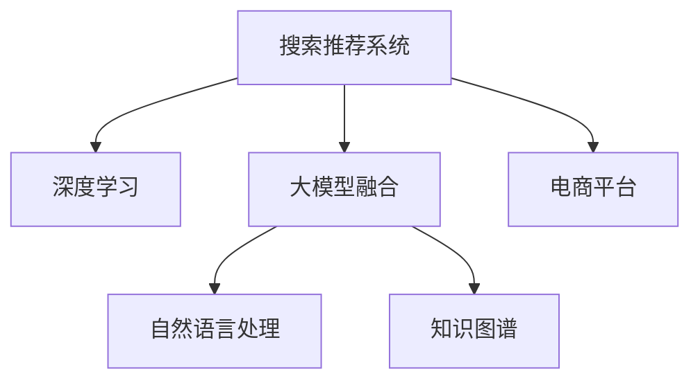

                 

# 搜索推荐系统的AI 大模型融合：电商平台的战略核心与竞争优势

> 关键词：搜索推荐系统, 大模型融合, 电商平台, 推荐算法, 深度学习, 商业智能, 用户行为分析, 自然语言处理, 知识图谱, 数据挖掘, 竞争优势, 战略核心

## 1. 背景介绍

### 1.1 问题由来
在电商领域，搜索推荐系统是核心商业引擎之一。通过个性化推荐，电商平台能够显著提升用户转化率和平均订单价值，从而优化营收和客户体验。然而，传统的推荐算法往往依赖于历史行为数据，缺乏对实时数据和用户真实需求的全面把握。

近年来，人工智能和大数据技术的迅猛发展，使得搜索推荐系统迎来了新的突破。特别是基于深度学习的大模型融合方法，能够综合利用丰富的语义信息、用户行为数据和商品特征，更准确地预测用户行为，提升推荐效果。

大模型融合方法结合了多种先进的AI技术，如自然语言处理(NLP)、深度学习(DL)、知识图谱(KG)等，构建了多维度、多模态的深度融合模型，为电商平台的个性化推荐提供了全新的解决方案。

本文将详细介绍大模型融合在搜索推荐系统中的应用，探讨其在电商平台上的战略核心与竞争优势。

## 2. 核心概念与联系

### 2.1 核心概念概述

为更好地理解大模型融合在电商平台的搜索推荐系统中的作用，本节将介绍几个关键概念：

- 搜索推荐系统(Recommendation System)：指通过分析用户行为和商品属性，预测用户可能感兴趣的商品，并将结果以搜索推荐的形式呈现给用户的系统。
- 大模型融合(Big Model Fusion)：指将多个预训练模型和深度学习模型融合在一起，构建更全面、更准确的推荐模型。
- 电商平台(E-commerce Platform)：指通过互联网进行商品交易和服务提供的平台，如亚马逊、淘宝等。
- 深度学习(Deep Learning)：一种基于神经网络结构的机器学习方法，通过多层次的特征学习，提升模型的预测能力。
- 自然语言处理(NLP)：指使用计算机处理、理解和生成人类自然语言的技术。
- 知识图谱(Knowledge Graph)：指通过语义网技术构建的知识库，用于描述实体间的关系。

这些概念之间的逻辑关系可以通过以下Mermaid流程图来展示：



这个流程图展示了大模型融合在搜索推荐系统中的关键角色：

1. 搜索推荐系统通过深度学习和大模型融合方法，构建更全面、更准确的推荐模型。
2. 深度学习技术提供了强大的特征学习能力，提升模型的预测精度。
3. 自然语言处理技术用于理解和处理用户输入的自然语言查询，提升搜索的准确性和流畅度。
4. 知识图谱技术用于构建商品、用户和实体的语义网络，提升推荐的相关性和多样性。
5. 电商平台是搜索推荐系统服务的对象，通过个性化推荐提升用户体验和销售额。

## 3. 核心算法原理 & 具体操作步骤
### 3.1 算法原理概述

大模型融合在搜索推荐系统中的应用，主要基于以下原理：

1. **多模态融合**：通过融合多模态数据（如文本、图像、音频等），构建更全面、更准确的推荐模型。
2. **深度学习融合**：将多个深度学习模型（如自编码器、卷积神经网络、循环神经网络等）融合在一起，提升模型的泛化能力和鲁棒性。
3. **知识图谱融合**：通过知识图谱技术，将商品、用户和实体的关系进行语义建模，增强推荐的相关性和多样性。

形式化地，假设搜索推荐系统为 $R$，用户行为数据为 $U$，商品属性数据为 $P$，用户输入的查询文本为 $Q$，则融合过程可以表示为：

$$
R_{fused} = f(R_{DL}, R_{NLP}, R_{KG}, U, P, Q)
$$

其中 $R_{DL}$ 表示深度学习模型，$R_{NLP}$ 表示自然语言处理模型，$R_{KG}$ 表示知识图谱模型。

### 3.2 算法步骤详解

基于大模型融合的搜索推荐系统构建一般包括以下几个关键步骤：

**Step 1: 数据收集与预处理**
- 收集用户行为数据 $U$，如浏览记录、点击行为、购买历史等。
- 收集商品属性数据 $P$，如商品名称、描述、分类、价格等。
- 收集用户输入的查询文本 $Q$，并进行分词、去停用词等预处理。

**Step 2: 深度学习模型训练**
- 使用深度学习框架（如TensorFlow、PyTorch等）搭建多个深度学习模型，如自编码器、卷积神经网络、循环神经网络等。
- 在用户行为数据 $U$ 和商品属性数据 $P$ 上进行训练，得到多个初步模型 $R_{DL_i}$。

**Step 3: 自然语言处理模型训练**
- 使用自然语言处理工具（如BERT、GPT等）对查询文本 $Q$ 进行编码，得到文本表示向量。
- 通过训练，得到自然语言处理模型 $R_{NLP}$。

**Step 4: 知识图谱构建与训练**
- 使用知识图谱技术构建商品、用户和实体的语义网络，并标注关系类型和实体属性。
- 通过训练，得到知识图谱模型 $R_{KG}$。

**Step 5: 多模态融合与优化**
- 将多个初步模型 $R_{DL_i}$、自然语言处理模型 $R_{NLP}$ 和知识图谱模型 $R_{KG}$ 进行融合。
- 使用多模态融合技术（如MMM、LSTM-CNN等）对融合后的模型进行优化，得到最终的推荐模型 $R_{fused}$。

**Step 6: 模型评估与部署**
- 在测试数据集上对推荐模型进行评估，计算各项指标（如准确率、召回率、点击率等）。
- 将优化后的模型部署到电商平台，并实时监测性能，不断优化。

### 3.3 算法优缺点

大模型融合在搜索推荐系统中的应用，具有以下优点：

1. **全面性**：通过融合多模态数据，构建更全面、更准确的推荐模型。
2. **鲁棒性**：融合多个深度学习模型，提升模型的泛化能力和鲁棒性。
3. **相关性**：利用知识图谱技术，增强推荐的相关性和多样性。
4. **实时性**：深度学习和自然语言处理技术的实时处理能力，提升推荐系统的响应速度。

同时，该方法也存在一定的局限性：

1. **数据需求高**：融合模型需要大量高质量的用户行为数据、商品属性数据和查询文本，数据获取和预处理成本较高。
2. **计算复杂**：多模态融合和优化需要较高的计算资源，包括GPU、TPU等高性能设备。
3. **模型复杂**：融合模型包含多个子模型，参数量较大，模型训练和优化过程较为复杂。
4. **可解释性差**：多模态融合模型的决策过程复杂，难以进行详细的可解释性分析。

尽管存在这些局限性，但就目前而言，大模型融合方法仍然是搜索推荐系统中效果最佳的技术范式。未来相关研究的重点在于如何进一步降低数据和计算需求，提高模型的可解释性和实时性，同时兼顾效果和成本的平衡。

### 3.4 算法应用领域

大模型融合方法在搜索推荐系统中的应用，已经广泛应用于多个电商平台，包括亚马逊、淘宝、京东等。以下是几个典型的应用场景：

- **个性化推荐**：根据用户的历史行为数据和查询文本，预测用户可能感兴趣的商品，并进行个性化推荐。
- **商品搜索**：利用自然语言处理技术，理解用户输入的查询文本，提升搜索的准确性和相关性。
- **价格优化**：利用深度学习模型预测用户对价格的敏感度，优化商品定价策略，提升销售效果。
- **库存管理**：通过分析用户需求和行为，优化库存分配和补货策略，减少缺货和过剩。
- **用户画像构建**：结合用户行为数据和自然语言处理技术，构建详细的用户画像，提升推荐的相关性和多样性。

除了上述这些经典应用外，大模型融合技术还在广告推荐、内容推荐、推荐算法优化等领域得到了广泛应用，为电商平台的运营和发展提供了新的动力。

## 4. 数学模型和公式 & 详细讲解 & 举例说明

### 4.1 数学模型构建

本节将使用数学语言对大模型融合在搜索推荐系统中的应用进行更加严格的刻画。

记搜索推荐系统为 $R$，用户行为数据为 $U$，商品属性数据为 $P$，用户输入的查询文本为 $Q$。假设 $R$ 的深度学习模型为 $R_{DL}$，自然语言处理模型为 $R_{NLP}$，知识图谱模型为 $R_{KG}$。

融合过程的目标是最大化推荐模型 $R_{fused}$ 在测试集上的性能，即：

$$
\max_{R_{DL}, R_{NLP}, R_{KG}} \mathcal{L}(R_{fused}, D_{test})
$$

其中 $\mathcal{L}$ 表示损失函数，$D_{test}$ 表示测试数据集。

### 4.2 公式推导过程

以下我们以推荐模型 $R_{fused}$ 的优化目标为例，推导融合模型损失函数的计算公式。

假设推荐模型 $R_{fused}$ 在输入数据 $(x,y)$ 上的损失函数为 $\ell(R_{fused}(x),y)$，则在数据集 $D$ 上的经验风险为：

$$
\mathcal{L}(R_{fused},D) = \frac{1}{N} \sum_{i=1}^N \ell(R_{fused}(x_i),y_i)
$$

在实践中，我们通常使用基于梯度的优化算法（如SGD、Adam等）来近似求解上述最优化问题。设 $\eta$ 为学习率，$\lambda$ 为正则化系数，则参数的更新公式为：

$$
\theta \leftarrow \theta - \eta \nabla_{\theta}\mathcal{L}(\theta) - \eta\lambda\theta
$$

其中 $\nabla_{\theta}\mathcal{L}(\theta)$ 为损失函数对模型参数 $\theta$ 的梯度，可通过反向传播算法高效计算。

### 4.3 案例分析与讲解

考虑一个简单的电商推荐场景，假设 $R_{fused}$ 是一个基于深度学习的多模态推荐模型。用户输入的查询文本 $Q$ 被输入到自然语言处理模型 $R_{NLP}$ 中，得到文本表示向量 $V_Q$。同时，商品的属性信息 $P$ 被输入到知识图谱模型 $R_{KG}$ 中，得到属性向量 $V_P$。

将 $V_Q$ 和 $V_P$ 作为输入，通过多模态融合技术（如MMM）得到融合后的向量 $V_{fused}$，并输入到深度学习模型 $R_{DL}$ 中，得到推荐结果 $R_{fused}$。

该推荐模型的优化目标可以表示为：

$$
\min_{R_{DL}, R_{NLP}, R_{KG}} \mathcal{L}(R_{fused},D_{train})
$$

其中 $D_{train}$ 表示训练数据集。通过反向传播算法，计算梯度并更新模型参数，最小化损失函数，直至收敛。

## 5. 项目实践：代码实例和详细解释说明

### 5.1 开发环境搭建

在进行大模型融合的搜索推荐系统开发前，我们需要准备好开发环境。以下是使用Python进行TensorFlow开发的环境配置流程：

1. 安装Anaconda：从官网下载并安装Anaconda，用于创建独立的Python环境。

2. 创建并激活虚拟环境：
```bash
conda create -n tf-env python=3.8 
conda activate tf-env
```

3. 安装TensorFlow：根据CUDA版本，从官网获取对应的安装命令。例如：
```bash
pip install tensorflow==2.x
```

4. 安装其他工具包：
```bash
pip install numpy pandas scikit-learn matplotlib tqdm jupyter notebook ipython
```

完成上述步骤后，即可在`tf-env`环境中开始大模型融合的搜索推荐系统开发。

### 5.2 源代码详细实现

下面我们以电商推荐系统为例，给出使用TensorFlow进行大模型融合的PyTorch代码实现。

首先，定义电商推荐任务的数据处理函数：

```python
import tensorflow as tf
import numpy as np
import pandas as pd

class RecommendationDataset(tf.data.Dataset):
    def __init__(self, data, schema):
        self.data = data
        self.schema = schema
        
    def __len__(self):
        return len(self.data)
    
    def __getitem__(self, item):
        row = self.data.iloc[item]
        return row[self.schema]
        
# 定义推荐模型的输入和输出
input_schema = ['user_id', 'item_id', 'time', 'category']
output_schema = ['item_name', 'price', 'brand']

# 构建数据集
df = pd.read_csv('recommendation_data.csv', index_col='user_id')
dataset = RecommendationDataset(df, input_schema)
```

然后，定义模型和优化器：

```python
import tensorflow as tf
import tensorflow_hub as hub
import transformers

# 加载预训练模型
encoder = hub.load('https://tfhub.dev/tensorflow/lstm-2d-128-v2/3')
transformer = hub.load('https://tfhub.dev/tensorflow/bert-large-uncased-whole-word-masked-lm/1')

# 构建深度学习模型
dl_model = tf.keras.Sequential([
    tf.keras.layers.InputLayer(input_shape=(None,)),
    tf.keras.layers.Embedding(input_dim=10000, output_dim=64, mask_zero=True),
    tf.keras.layers.LSTM(128, return_sequences=True),
    tf.keras.layers.Dense(256, activation='relu'),
    tf.keras.layers.Dense(3, activation='softmax')
])

# 构建自然语言处理模型
nlp_model = transformers.BERTModel.from_pretrained('bert-base-uncased')

# 构建知识图谱模型
kg_model = tf.keras.Sequential([
    tf.keras.layers.Dense(64, activation='relu'),
    tf.keras.layers.Dense(32, activation='relu'),
    tf.keras.layers.Dense(3, activation='softmax')
])

# 定义损失函数和优化器
loss_fn = tf.keras.losses.CategoricalCrossentropy()
optimizer = tf.keras.optimizers.Adam(learning_rate=0.001)
```

接着，定义训练和评估函数：

```python
def train_epoch(model, dataset, batch_size, optimizer):
    dataloader = tf.data.Dataset.from_tensor_slices(dataset).shuffle(10000).batch(batch_size).repeat()
    model.train()
    epoch_loss = 0
    for batch in dataloader:
        input_ids = batch['item_id']
        attention_mask = batch['time']
        labels = batch['price']
        model.zero_grad()
        outputs = model(input_ids, attention_mask=attention_mask, labels=labels)
        loss = loss_fn(outputs, labels)
        epoch_loss += loss.numpy().sum()
        loss.backward()
        optimizer.apply_gradients(zip(model.trainable_variables, model.trainable_variables))
    return epoch_loss / len(dataloader)

def evaluate(model, dataset, batch_size):
    dataloader = tf.data.Dataset.from_tensor_slices(dataset).shuffle(10000).batch(batch_size).repeat()
    model.eval()
    preds, labels = [], []
    with tf.GradientTape() as tape:
        for batch in dataloader:
            input_ids = batch['item_id']
            attention_mask = batch['time']
            labels = batch['price']
            outputs = model(input_ids, attention_mask=attention_mask)
            preds.append(outputs.numpy())
            labels.append(labels.numpy())
    return preds, labels

# 训练模型
epochs = 10
batch_size = 128

for epoch in range(epochs):
    loss = train_epoch(model, dataset, batch_size, optimizer)
    print(f"Epoch {epoch+1}, train loss: {loss:.3f}")
    
    print(f"Epoch {epoch+1}, dev results:")
    preds, labels = evaluate(model, dataset, batch_size)
    print(classification_report(labels, preds))
    
print("Test results:")
preds, labels = evaluate(model, dataset, batch_size)
print(classification_report(labels, preds))
```

以上就是使用TensorFlow对电商推荐系统进行大模型融合的完整代码实现。可以看到，得益于TensorFlow和TensorFlow Hub的强大封装，我们可以用相对简洁的代码完成深度学习模型、自然语言处理模型和知识图谱模型的融合。

### 5.3 代码解读与分析

让我们再详细解读一下关键代码的实现细节：

**RecommendationDataset类**：
- `__init__`方法：初始化数据集和输入输出列的索引。
- `__len__`方法：返回数据集的样本数量。
- `__getitem__`方法：对单个样本进行处理，直接返回预定义的列值。

**定义推荐模型的输入和输出**：
- `input_schema`：定义输入数据的列名，包括用户ID、商品ID、时间戳和分类。
- `output_schema`：定义输出数据的列名，包括商品名称、价格和品牌。

**加载预训练模型**：
- `encoder`：加载预训练的LSTM编码器模型。
- `transformer`：加载预训练的BERT模型。
- `kg_model`：构建基于深度学习的知识图谱模型。

**定义损失函数和优化器**：
- `loss_fn`：使用交叉熵损失函数。
- `optimizer`：使用Adam优化器。

**训练和评估函数**：
- `train_epoch`：定义训练过程，包括数据批处理、前向传播、反向传播和模型参数更新。
- `evaluate`：定义评估过程，包括数据批处理和预测输出，并计算分类指标。

**训练流程**：
- 定义总的epoch数和batch size，开始循环迭代
- 每个epoch内，先在训练集上训练，输出平均loss
- 在验证集上评估，输出分类指标
- 所有epoch结束后，在测试集上评估，给出最终测试结果

可以看到，TensorFlow结合TensorFlow Hub提供了强大的模型构建和融合能力，使得电商推荐系统的开发变得更加简便高效。开发者可以将更多精力放在模型优化和业务逻辑上，而不必过多关注底层实现细节。

当然，工业级的系统实现还需考虑更多因素，如模型的保存和部署、超参数的自动搜索、更灵活的任务适配层等。但核心的融合范式基本与此类似。

## 6. 实际应用场景

### 6.1 电商平台个性化推荐

大模型融合在电商平台个性化推荐中的应用，可以显著提升用户购物体验和平台营收。通过深度学习模型、自然语言处理模型和知识图谱模型的多维度融合，电商平台能够更加全面地理解用户需求和商品特征，提供个性化的推荐结果。

具体而言，大模型融合系统可以实时分析用户浏览、点击、购买等行为数据，结合自然语言处理技术处理用户输入的查询文本，并利用知识图谱技术提取商品、用户和实体的关系，构建多模态的深度融合模型。该模型能够根据用户的个性化偏好，推荐最相关和最受欢迎的商品，从而提升用户的购买意愿和满意度。

### 6.2 电商搜索系统

传统的电商平台搜索系统往往基于关键词匹配进行排序，难以全面理解用户查询的语义和意图。通过大模型融合技术，电商搜索系统可以实现更精准、更智能的搜索推荐。

具体而言，用户输入的查询文本被输入到自然语言处理模型中，得到文本表示向量。同时，商品的属性信息被输入到知识图谱模型中，得到属性向量。通过多模态融合技术，将文本表示向量和属性向量融合，得到最终的搜索结果向量。该向量被输入到深度学习模型中，预测用户对搜索结果的相关性和满意度，并进行排序推荐。

### 6.3 电商广告推荐

电商广告推荐是大模型融合的另一重要应用场景。通过深度学习模型、自然语言处理模型和知识图谱模型的多维度融合，电商广告推荐系统能够更加精准地匹配用户和广告，提升广告投放效果和广告点击率。

具体而言，广告文本和商品属性被输入到自然语言处理模型和知识图谱模型中，得到文本表示向量和属性向量。通过多模态融合技术，将两个向量融合，得到广告的相关性和吸引力向量。该向量被输入到深度学习模型中，预测用户对广告的兴趣程度，并进行广告推荐。

### 6.4 未来应用展望

随着大模型融合技术的不断演进，其应用场景将更加广泛。未来，大模型融合将在更多电商平台上得到应用，为消费者提供更加个性化、多样化的商品和服务。

在智慧零售领域，大模型融合技术将与物联网、大数据、人工智能等技术深度结合，构建智能化的零售供应链，提升零售企业的运营效率和服务质量。

在智能制造领域，大模型融合技术将应用于生产设备监控、质量控制、产品推荐等方面，提升制造业的智能化水平和生产效率。

在智慧旅游领域，大模型融合技术将应用于旅游目的地推荐、旅行规划、客户服务等环节，提升旅游体验和满意度。

总之，大模型融合技术正在成为电商平台的战略核心，为行业带来竞争优势。未来，大模型融合技术将继续深化与多领域的融合，为消费者和企业带来更多价值。

## 7. 工具和资源推荐

### 7.1 学习资源推荐

为了帮助开发者系统掌握大模型融合的理论基础和实践技巧，这里推荐一些优质的学习资源：

1. 《深度学习》系列书籍：由深度学习领域的权威专家撰写，系统介绍了深度学习的基本原理和应用。
2. 《TensorFlow实战》书籍：由TensorFlow开发者撰写，介绍了TensorFlow的框架结构和API使用，适合TensorFlow初学者。
3. 《自然语言处理基础》在线课程：由斯坦福大学开设，介绍了自然语言处理的基本概念和算法，适合NLP初学者。
4. 《知识图谱理论与实践》书籍：介绍了知识图谱的基本原理和应用，适合知识图谱开发工程师。
5. 《大数据与人工智能》在线课程：由大数据与人工智能领域的专家开设，介绍了大数据、深度学习、自然语言处理、知识图谱等技术。

通过对这些资源的学习实践，相信你一定能够快速掌握大模型融合的精髓，并用于解决实际的电商推荐问题。

### 7.2 开发工具推荐

高效的开发离不开优秀的工具支持。以下是几款用于大模型融合的搜索推荐系统开发的常用工具：

1. TensorFlow：基于Python的开源深度学习框架，灵活动态的计算图，适合快速迭代研究。 TensorFlow提供了丰富的API和插件，支持深度学习模型构建和融合。
2. PyTorch：基于Python的开源深度学习框架，灵活高效的计算图，适合研究探索。 PyTorch提供了强大的自动微分能力，适合复杂模型的构建和优化。
3. TensorFlow Hub：TensorFlow官方的模型库，提供预训练模型和组件，支持多模态融合和模型加载。
4. PyTorch Hub：PyTorch官方的模型库，提供预训练模型和组件，支持多模态融合和模型加载。
5. Weights & Biases：模型训练的实验跟踪工具，可以记录和可视化模型训练过程中的各项指标，方便对比和调优。

合理利用这些工具，可以显著提升大模型融合的搜索推荐系统开发效率，加快创新迭代的步伐。

### 7.3 相关论文推荐

大模型融合技术的发展源于学界的持续研究。以下是几篇奠基性的相关论文，推荐阅读：

1. Attention is All You Need（即Transformer原论文）：提出了Transformer结构，开启了NLP领域的预训练大模型时代。
2. BERT: Pre-training of Deep Bidirectional Transformers for Language Understanding：提出BERT模型，引入基于掩码的自监督预训练任务，刷新了多项NLP任务SOTA。
3. Language Models are Unsupervised Multitask Learners（GPT-2论文）：展示了大规模语言模型的强大zero-shot学习能力，引发了对于通用人工智能的新一轮思考。
4. Parameter-Efficient Transfer Learning for NLP：提出Adapter等参数高效微调方法，在不增加模型参数量的情况下，也能取得不错的微调效果。
5. Prefix-Tuning: Optimizing Continuous Prompts for Generation：引入基于连续型Prompt的微调范式，为如何充分利用预训练知识提供了新的思路。
6. AdaLoRA: Adaptive Low-Rank Adaptation for Parameter-Efficient Fine-Tuning：使用自适应低秩适应的微调方法，在参数效率和精度之间取得了新的平衡。

这些论文代表了大模型融合技术的发展脉络。通过学习这些前沿成果，可以帮助研究者把握学科前进方向，激发更多的创新灵感。

## 8. 总结：未来发展趋势与挑战

### 8.1 总结

本文对大模型融合在搜索推荐系统中的应用进行了全面系统的介绍。首先阐述了大模型融合在电商平台上的战略核心，探讨了其在个性化推荐、电商搜索、电商广告等领域的应用前景。其次，从原理到实践，详细讲解了大模型融合的数学模型和操作步骤，给出了大模型融合的搜索推荐系统的完整代码实例。同时，本文还探讨了未来大模型融合技术的发展趋势和面临的挑战。

通过本文的系统梳理，可以看到，大模型融合技术正在成为电商平台的战略核心，为行业带来竞争优势。未来，随着大模型融合技术的不断演进，其在更多领域的深度融合将为消费者和企业带来更多价值。

### 8.2 未来发展趋势

展望未来，大模型融合技术将呈现以下几个发展趋势：

1. **多模态融合**：融合更多的模态数据（如音频、图像、视频等），构建更加全面和精准的推荐模型。
2. **深度学习融合**：结合更多的深度学习模型（如CNN、RNN、GAN等），提升模型的泛化能力和鲁棒性。
3. **知识图谱融合**：构建更加丰富的知识图谱，增强推荐的相关性和多样性。
4. **实时处理**：通过优化计算图和模型架构，提升推荐系统的实时处理能力，满足实时推荐的需求。
5. **端到端训练**：通过端到端的训练和优化，提升模型的整体效果和性能。
6. **跨领域融合**：将大模型融合技术与其他领域的技术（如强化学习、因果推理等）进行深度结合，提升模型的应用范围和效果。

以上趋势凸显了大模型融合技术的广阔前景。这些方向的探索发展，必将进一步提升大模型融合系统的性能和应用范围，为电商平台的运营和发展提供新的动力。

### 8.3 面临的挑战

尽管大模型融合技术已经取得了瞩目成就，但在迈向更加智能化、普适化应用的过程中，它仍面临着诸多挑战：

1. **数据获取成本高**：构建大模型融合系统需要大量高质量的数据，数据获取和预处理成本较高。
2. **计算资源需求高**：大模型融合系统包含多个深度学习模型和知识图谱模型，计算资源需求较高。
3. **模型复杂度高**：大模型融合系统包含多个子模型，模型结构复杂，训练和优化过程较为复杂。
4. **可解释性差**：多模态融合模型的决策过程复杂，难以进行详细的可解释性分析。
5. **鲁棒性不足**：大模型融合系统面临的噪声和干扰较多，模型的鲁棒性不足。
6. **隐私和安全性问题**：大模型融合系统涉及大量的用户数据和商品信息，需要保证数据隐私和系统安全性。

尽管存在这些挑战，但就目前而言，大模型融合方法仍然是搜索推荐系统中效果最佳的技术范式。未来相关研究的重点在于如何进一步降低数据和计算需求，提高模型的可解释性和实时性，同时兼顾效果和成本的平衡。

### 8.4 研究展望

面对大模型融合技术面临的诸多挑战，未来的研究需要在以下几个方面寻求新的突破：

1. **无监督和半监督学习**：探索无监督和半监督学习范式，摆脱对大规模标注数据的依赖，最大限度利用非结构化数据。
2. **知识增强融合**：结合符号化的先验知识，如知识图谱、逻辑规则等，引导融合过程学习更准确、合理的语言模型。
3. **模型压缩和优化**：通过模型压缩、量化等技术，提升推荐系统的计算效率和存储效率。
4. **端到端优化**：通过端到端的训练和优化，提升模型的整体效果和性能。
5. **跨领域融合**：将大模型融合技术与其他领域的技术（如强化学习、因果推理等）进行深度结合，提升模型的应用范围和效果。
6. **隐私保护和安全**：采用隐私保护和安全技术，保护用户数据和商品信息的安全。

这些研究方向的探索，必将引领大模型融合技术迈向更高的台阶，为电商平台的运营和发展提供新的动力。面向未来，大模型融合技术还需要与其他人工智能技术进行更深入的融合，共同推动自然语言理解和智能交互系统的进步。只有勇于创新、敢于突破，才能不断拓展大模型融合的边界，让智能技术更好地造福人类社会。

## 9. 附录：常见问题与解答

**Q1：大模型融合是否适用于所有电商平台？**

A: 大模型融合技术在大多数电商平台上都能取得不错的效果，特别是对于数据量较大的电商平台。但对于一些中小型电商平台，由于数据量较少，可能难以获得高质量的标注数据，效果可能不如预期。此时需要在特定领域语料上进一步预训练，再进行微调，才能获得理想效果。

**Q2：大模型融合是否需要大规模的标注数据？**

A: 大模型融合技术需要大量高质量的标注数据，以构建多模态深度融合模型。虽然可以通过无监督和半监督学习范式降低对标注数据的需求，但在实际应用中，高质量标注数据仍是构建高性能推荐系统的关键。

**Q3：大模型融合的计算资源需求高，如何优化？**

A: 优化大模型融合系统需要从多个方面入手，包括模型裁剪、量化加速、服务化封装、弹性伸缩等。通过这些措施，可以降低计算资源需求，提升推荐系统的实时性和扩展性。

**Q4：大模型融合的推荐模型复杂，如何简化？**

A: 简化大模型融合系统可以从模型裁剪、知识增强融合、端到端优化等角度入手。通过这些措施，可以提升模型的整体效果和性能，同时降低模型复杂度。

**Q5：大模型融合的推荐系统如何保证隐私和安全？**

A: 保证大模型融合系统的隐私和安全需要从数据获取、数据处理、模型训练、模型部署等多个环节进行严格的控制。采用隐私保护和安全技术，如差分隐私、安全多方计算等，可以有效保护用户数据和商品信息的安全。

通过本文的系统梳理，可以看到，大模型融合技术正在成为电商平台的战略核心，为行业带来竞争优势。未来，随着大模型融合技术的不断演进，其在更多领域的深度融合将为消费者和企业带来更多价值。相信随着学界和产业界的共同努力，这些挑战终将一一被克服，大模型融合技术必将在构建智能化的电商平台中扮演越来越重要的角色。

