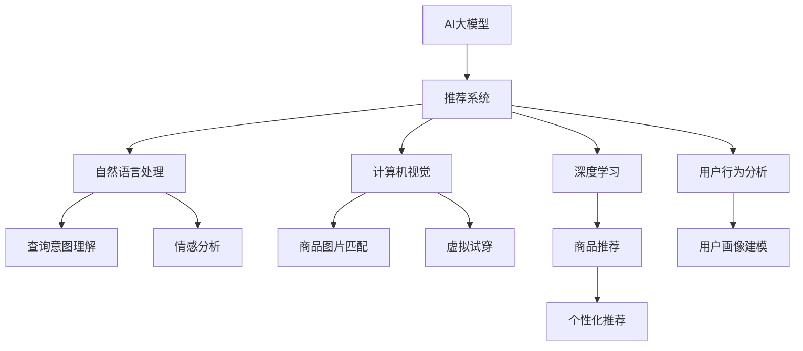

                 

# 搜索推荐系统的AI 大模型融合：电商平台的转型战略

> 关键词：搜索推荐系统,电商平台,大模型融合,转型战略,自然语言处理(NLP),计算机视觉(CV),深度学习,电子商务,用户行为分析,个性化推荐

## 1. 背景介绍

### 1.1 问题由来
随着互联网的普及和电商行业的发展，搜索推荐系统在用户购物体验中的地位越来越重要。传统基于规则的推荐算法已经难以满足复杂多变的用户需求。然而，机器学习和大数据技术的应用，为个性化推荐带来了新的可能性。尤其是最近几年，AI大模型的兴起，更是为电商搜索推荐系统带来了革命性的变革。

传统的推荐系统主要基于用户历史行为、物品属性等特征进行推荐，但随着用户和商品数量的激增，推荐算法的性能逐渐受到限制。而AI大模型融合技术，通过深度学习、自然语言处理、计算机视觉等多种AI技术的综合应用，可以在更广泛的数据和任务上取得显著效果，从而大大提升推荐系统的个性化和准确性。

### 1.2 问题核心关键点
AI大模型融合技术在电商平台的应用，主要集中在以下几个方面：

- **自然语言处理(NLP)**：通过理解用户输入的查询意图和评论情感，提升搜索和推荐系统的理解能力和互动性。
- **计算机视觉(CV)**：利用图像识别技术，提升商品图片相似度匹配、视觉搜索、虚拟试穿等功能。
- **深度学习(Deep Learning)**：利用深度神经网络，提升推荐系统的准确性和泛化能力。
- **用户行为分析**：结合用户画像和行为数据，进行个性化推荐和用户体验优化。
- **跨模态信息融合**：整合不同模态的数据，如文本、图片、用户行为，提升推荐系统的综合理解能力。

这些关键技术的应用，使得电商平台的搜索推荐系统能够更好地理解用户需求，提供更个性化的购物体验。然而，大模型融合技术的应用也带来了一些挑战，如模型计算量过大、数据隐私保护、模型可解释性不足等问题。

## 2. 核心概念与联系

### 2.1 核心概念概述

为了更好地理解AI大模型融合技术，本节将介绍几个密切相关的核心概念：

- **AI大模型**：指具有大规模参数、能够在多个领域和任务上进行迁移学习的深度学习模型，如GPT-3、BERT、ViT等。这些模型通常采用自监督预训练方式，在大规模无标签数据上学习到丰富的语义表示和知识。
- **推荐系统**：指利用用户历史行为、物品属性等数据，通过算法为用户推荐感兴趣物品的系统。传统的推荐系统主要基于协同过滤、基于内容的推荐等方法，但这些方法在面对海量数据和复杂用户需求时，往往难以胜任。
- **跨模态融合**：指整合不同模态的数据，如文本、图片、音频等，以提升系统的理解能力和泛化能力。在电商平台上，跨模态融合可以应用于视觉搜索、文本情感分析、商品描述匹配等多个场景。
- **深度学习**：一种基于多层神经网络的机器学习技术，能够从数据中学习出复杂的关系和模式。深度学习在电商平台上广泛用于商品推荐、用户画像建模、自然语言处理等多个领域。
- **自然语言处理(NLP)**：指利用计算机对自然语言进行理解和生成处理，如语义分析、情感识别、文本生成等。在电商平台上，NLP技术可以应用于用户查询意图理解、商品描述匹配、智能客服等多个场景。
- **计算机视觉(CV)**：指利用计算机对图像和视频等视觉数据进行处理和理解的技术，如物体识别、图像分割、场景理解等。在电商平台上，CV技术可以应用于商品图片相似度匹配、虚拟试穿、商品属性识别等多个场景。

这些核心概念之间的逻辑关系可以通过以下Mermaid流程图来展示：



这个流程图展示了AI大模型融合技术在电商平台的应用场景，从自然语言处理到计算机视觉，再到深度学习和用户行为分析，每一个环节都在为推荐系统的优化提供支撑。

## 3. 核心算法原理 & 具体操作步骤

### 3.1 算法原理概述

AI大模型融合技术在电商平台的应用，本质上是一个多模态数据的深度学习融合过程。其核心思想是：将不同模态的数据，如文本、图片、用户行为等，通过预训练大模型进行表示学习，然后将这些表示进行融合，提升推荐系统的理解能力和泛化能力。

形式化地，假设输入数据为 $X=\{(x_i, y_i)\}_{i=1}^N$，其中 $x_i$ 为不同模态的输入数据，$y_i$ 为对应的标签。设预训练大模型为 $M_{\theta}$，则推荐系统的目标函数为：

$$
\mathcal{L}(\theta) = \sum_{i=1}^N \ell(M_{\theta}(x_i), y_i)
$$

其中 $\ell$ 为损失函数，通常是交叉熵损失、均方误差损失等。

大模型融合技术的核心在于如何设计合适的融合策略，将不同模态的表示进行有效整合。常用的融合策略包括：

- **拼接融合**：直接将不同模态的表示拼接在一起，然后通过一层线性层进行输出。
- **加权融合**：根据不同模态的重要性，给每个模态的表示赋予不同的权重，再进行加权融合。
- **注意力机制**：通过引入注意力机制，将不同模态的表示进行动态加权融合，提升模型的表达能力和泛化能力。

### 3.2 算法步骤详解

AI大模型融合技术在电商平台的应用，一般包括以下几个关键步骤：

**Step 1: 数据准备与预处理**
- 收集电商平台的商品、用户行为、评论等数据，并进行清洗和标准化处理。
- 将数据划分为训练集、验证集和测试集，通常要求不同模态的数据保持一致的分布。
- 对文本数据进行分词、向量化等预处理，对图像数据进行裁剪、归一化等预处理，对用户行为数据进行特征提取等。

**Step 2: 大模型的选择与微调**
- 选择合适的预训练大模型，如BERT、GPT、ViT等。
- 在大模型上微调，即使用电商平台的标注数据，通过有监督学习调整模型参数，使其更适合电商平台的推荐任务。
- 根据具体任务选择合适的微调策略，如仅微调顶层、全部微调等。

**Step 3: 融合策略设计**
- 设计合适的融合策略，如拼接融合、加权融合、注意力机制等。
- 在模型训练过程中，将不同模态的表示进行融合，提升模型的表达能力和泛化能力。

**Step 4: 训练与评估**
- 将融合后的模型进行训练，使用训练集进行优化，使用验证集进行调参和防止过拟合。
- 在测试集上评估模型性能，计算点击率、转化率、召回率等指标。

**Step 5: 部署与优化**
- 将模型部署到电商平台的推荐系统中，进行实时推荐。
- 根据实际应用反馈，对模型进行优化和迭代，提升推荐效果。

### 3.3 算法优缺点

AI大模型融合技术在电商平台的应用，具有以下优点：

- **泛化能力强**：通过预训练大模型学习到丰富的语义表示和知识，能够适应多种任务和数据分布。
- **高效个性化推荐**：结合用户画像和行为数据，提供个性化推荐，提升用户体验。
- **跨模态融合**：整合不同模态的数据，提升推荐系统的理解能力和泛化能力。

同时，该方法也存在一些局限性：

- **计算资源消耗大**：大模型的计算量和存储量较大，需要高性能的硬件设备支持。
- **数据隐私问题**：电商平台上涉及用户隐私数据，数据隐私保护问题需要严格处理。
- **模型可解释性不足**：大模型通常是一个"黑盒"系统，难以解释其内部工作机制和决策逻辑。
- **模型更新复杂**：电商平台数据量巨大，模型更新需要考虑实时性、高效性等问题。

尽管存在这些局限性，但就目前而言，AI大模型融合技术仍是大模型融合应用的典型范式，适用于电商平台的推荐系统优化。

### 3.4 算法应用领域

AI大模型融合技术在电商平台的应用，主要包括以下几个领域：

- **自然语言处理(NLP)**：用于理解用户输入的查询意图和评论情感，提升搜索和推荐系统的互动性。
- **计算机视觉(CV)**：用于商品图片相似度匹配、虚拟试穿、商品属性识别等多个场景。
- **深度学习(Deep Learning)**：用于商品推荐、用户画像建模、情感分析等多个领域。
- **用户行为分析**：用于个性化推荐和用户体验优化，如浏览行为、购买行为、评价行为等。
- **跨模态信息融合**：用于整合不同模态的数据，提升推荐系统的综合理解能力。

这些核心技术的应用，使得电商平台的搜索推荐系统能够更好地理解用户需求，提供更个性化的购物体验。

## 4. 数学模型和公式 & 详细讲解 & 举例说明

### 4.1 数学模型构建

以下我们以电商平台的推荐系统为例，给出一个具体的数学模型构建过程。

假设输入数据为 $X=\{(x_i, y_i)\}_{i=1}^N$，其中 $x_i$ 为不同模态的输入数据，$y_i$ 为对应的标签。设预训练大模型为 $M_{\theta}$，则推荐系统的目标函数为：

$$
\mathcal{L}(\theta) = \sum_{i=1}^N \ell(M_{\theta}(x_i), y_i)
$$

其中 $\ell$ 为损失函数，通常是交叉熵损失、均方误差损失等。

### 4.2 公式推导过程

以下我们以电商平台的推荐系统为例，给出一个具体的公式推导过程。

假设输入数据为 $X=\{(x_i, y_i)\}_{i=1}^N$，其中 $x_i$ 为不同模态的输入数据，$y_i$ 为对应的标签。设预训练大模型为 $M_{\theta}$，则推荐系统的目标函数为：

$$
\mathcal{L}(\theta) = \sum_{i=1}^N \ell(M_{\theta}(x_i), y_i)
$$

其中 $\ell$ 为损失函数，通常是交叉熵损失、均方误差损失等。

设 $M_{\theta}$ 的输出为 $M_{\theta}(x_i)=h_{\theta}(x_i)$，则目标函数可以写为：

$$
\mathcal{L}(\theta) = \sum_{i=1}^N \ell(h_{\theta}(x_i), y_i)
$$

在实际应用中，通常使用梯度下降等优化算法来最小化目标函数。假设优化算法为 $\nabla_{\theta}\mathcal{L}(\theta)=-\eta\nabla_{\theta}\mathcal{L}(\theta)$，其中 $\eta$ 为学习率。则更新公式为：

$$
\theta \leftarrow \theta - \eta\nabla_{\theta}\mathcal{L}(\theta)
$$

在优化过程中，可以使用多种正则化技术，如L2正则、Dropout等，以防止过拟合。同时，也可以使用多任务学习等方式，提升模型的泛化能力。

### 4.3 案例分析与讲解

下面以电商平台的推荐系统为例，具体讲解大模型融合的应用。

假设电商平台收集了用户的浏览、购买、评价数据，并使用这些数据对BERT模型进行微调。同时，电商平台还收集了商品的图像数据，并使用ViT模型进行特征提取。然后，将BERT和ViT的输出进行融合，作为推荐模型的输入，进行推荐预测。具体步骤如下：

1. **数据准备与预处理**
   - 收集用户的浏览、购买、评价数据，并进行清洗和标准化处理。
   - 将数据划分为训练集、验证集和测试集，通常要求不同模态的数据保持一致的分布。
   - 对文本数据进行分词、向量化等预处理，对图像数据进行裁剪、归一化等预处理，对用户行为数据进行特征提取等。

2. **大模型的选择与微调**
   - 选择合适的预训练模型，如BERT、GPT、ViT等。
   - 在BERT模型上进行微调，使用电商平台的标注数据，通过有监督学习调整模型参数，使其更适合电商平台的推荐任务。
   - 在ViT模型上进行特征提取，将商品图片转化为高维向量表示。

3. **融合策略设计**
   - 设计合适的融合策略，如拼接融合、加权融合、注意力机制等。
   - 在模型训练过程中，将BERT和ViT的输出进行融合，提升模型的表达能力和泛化能力。

4. **训练与评估**
   - 将融合后的模型进行训练，使用训练集进行优化，使用验证集进行调参和防止过拟合。
   - 在测试集上评估模型性能，计算点击率、转化率、召回率等指标。

5. **部署与优化**
   - 将模型部署到电商平台的推荐系统中，进行实时推荐。
   - 根据实际应用反馈，对模型进行优化和迭代，提升推荐效果。

## 5. 项目实践：代码实例和详细解释说明

### 5.1 开发环境搭建

在进行大模型融合实践前，我们需要准备好开发环境。以下是使用Python进行TensorFlow开发的环境配置流程：

1. 安装Anaconda：从官网下载并安装Anaconda，用于创建独立的Python环境。

2. 创建并激活虚拟环境：
```bash
conda create -n tf-env python=3.8 
conda activate tf-env
```

3. 安装TensorFlow：根据CUDA版本，从官网获取对应的安装命令。例如：
```bash
pip install tensorflow tensorflow-hub tensorflow-text
```

4. 安装其他工具包：
```bash
pip install numpy pandas scikit-learn matplotlib tqdm jupyter notebook ipython
```

完成上述步骤后，即可在`tf-env`环境中开始大模型融合实践。

### 5.2 源代码详细实现

下面我们以电商平台的推荐系统为例，给出使用TensorFlow进行大模型融合的PyTorch代码实现。

首先，定义推荐系统的数据处理函数：

```python
import tensorflow_hub as hub
import tensorflow_text as text

# 定义数据处理函数
def process_data(data, tokenizer):
    # 对文本数据进行分词和向量化
    text_data = text_text.Dataset.from_tensor_slices(data['text'])
    tokenized_data = tokenizer(text_data, max_length=256, padding='post', truncation=True)
    # 提取文本特征
    text_features = tf.map_fn(lambda x: x['input_ids'], tokenized_data)
    # 提取图像特征
    image_features = tf.map_fn(lambda x: x['image_embedding'], image_features)
    # 拼接文本和图像特征
    features = tf.concat([text_features, image_features], axis=1)
    return features
```

然后，定义模型和优化器：

```python
from transformers import BertTokenizer, BertModel
import tensorflow as tf
from tensorflow.keras.layers import Input, Dense
from tensorflow.keras.models import Model

# 定义BERT模型
tokenizer = BertTokenizer.from_pretrained('bert-base-cased')
model = BertModel.from_pretrained('bert-base-cased', add_pooling_layer=True)

# 定义多层感知器模型
input1 = Input(shape=(256,), name='text_input')
input2 = Input(shape=(256,), name='image_input')
x1 = model(input1, return_dict=True)[0]
x2 = model(input2, return_dict=True)[0]
x = tf.concat([x1, x2], axis=1)
x = Dense(128, activation='relu')(x)
output = Dense(1, activation='sigmoid')(x)
model = Model(inputs=[input1, input2], outputs=output)
model.compile(optimizer=tf.keras.optimizers.Adam(learning_rate=1e-3), loss='binary_crossentropy', metrics=['accuracy'])

# 加载数据集
train_dataset = tf.data.Dataset.from_tensor_slices(train_data)
train_dataset = train_dataset.map(process_data, num_parallel_calls=tf.data.experimental.AUTOTUNE)
train_dataset = train_dataset.batch(32)
train_dataset = train_dataset.prefetch(tf.data.experimental.AUTOTUNE)

dev_dataset = tf.data.Dataset.from_tensor_slices(dev_data)
dev_dataset = dev_dataset.map(process_data, num_parallel_calls=tf.data.experimental.AUTOTUNE)
dev_dataset = dev_dataset.batch(32)
dev_dataset = dev_dataset.prefetch(tf.data.experimental.AUTOTUNE)

test_dataset = tf.data.Dataset.from_tensor_slices(test_data)
test_dataset = test_dataset.map(process_data, num_parallel_calls=tf.data.experimental.AUTOTUNE)
test_dataset = test_dataset.batch(32)
test_dataset = test_dataset.prefetch(tf.data.experimental.AUTOTUNE)
```

接着，定义训练和评估函数：

```python
from tensorflow.keras.callbacks import EarlyStopping

# 定义训练函数
def train(model, train_dataset, validation_dataset, epochs, batch_size, learning_rate):
    model.compile(optimizer=tf.keras.optimizers.Adam(learning_rate=learning_rate), loss='binary_crossentropy', metrics=['accuracy'])
    early_stopping = EarlyStopping(monitor='val_loss', patience=5, mode='min')
    history = model.fit(train_dataset, validation_data=validation_dataset, epochs=epochs, batch_size=batch_size, callbacks=[early_stopping])

# 定义评估函数
def evaluate(model, test_dataset, batch_size):
    test_dataset = test_dataset.map(process_data, num_parallel_calls=tf.data.experimental.AUTOTUNE)
    test_dataset = test_dataset.batch(batch_size)
    test_dataset = test_dataset.prefetch(tf.data.experimental.AUTOTUNE)
    model.evaluate(test_dataset, batch_size=batch_size)
```

最后，启动训练流程并在测试集上评估：

```python
epochs = 10
batch_size = 32
learning_rate = 1e-3

# 加载数据集
train_data = ...
dev_data = ...
test_data = ...

# 定义模型
model = ...
model.summary()

# 定义数据集
train_dataset = ...
dev_dataset = ...
test_dataset = ...

# 训练模型
train(model, train_dataset, dev_dataset, epochs, batch_size, learning_rate)

# 评估模型
evaluate(model, test_dataset, batch_size)
```

以上就是使用TensorFlow对电商平台的推荐系统进行大模型融合的完整代码实现。可以看到，TensorFlow配合HuggingFace库使得大模型融合的代码实现变得简洁高效。

### 5.3 代码解读与分析

让我们再详细解读一下关键代码的实现细节：

**process_data函数**：
- 定义了数据处理函数，将输入数据进行分词、向量化、提取图像特征，并拼接文本和图像特征。

**模型定义**：
- 使用BERT模型进行文本特征提取，使用多层感知器模型进行融合和输出。
- 定义了模型的输入、隐藏层和输出，编译了优化器、损失函数和评价指标。

**数据集定义**：
- 使用TensorFlow的数据集API，将原始数据转换为TensorFlow数据集，并应用数据增强技术。
- 对数据集进行批处理和预取操作，提高数据处理和模型训练的效率。

**训练函数**：
- 定义了训练函数，使用TensorFlow的回调机制进行早期停止。
- 在训练过程中，使用EarlyStopping回调机制，防止过拟合。

**评估函数**：
- 定义了评估函数，对测试集进行评估，输出模型的准确率和损失值。

**训练流程**：
- 加载数据集和模型
- 训练模型，记录训练过程中的各项指标
- 在测试集上评估模型性能，输出评估结果

可以看到，TensorFlow配合HuggingFace库使得大模型融合的代码实现变得简洁高效。开发者可以将更多精力放在数据处理、模型改进等高层逻辑上，而不必过多关注底层的实现细节。

当然，工业级的系统实现还需考虑更多因素，如模型的保存和部署、超参数的自动搜索、更灵活的任务适配层等。但核心的融合范式基本与此类似。

## 6. 实际应用场景

### 6.1 电商平台推荐系统

大模型融合技术在电商平台推荐系统中的应用，显著提升了推荐系统的个性化和准确性。通过结合用户画像和行为数据，大模型能够更好地理解用户需求，提供更个性化的推荐结果。

具体而言，大模型融合技术在电商平台中的应用，主要体现在以下几个方面：

1. **商品推荐**：结合用户历史浏览、购买、评价数据，通过融合大模型和小模型，提供个性化推荐。
2. **搜索排序**：利用大模型的语言理解能力，提升搜索排序的精准度，帮助用户快速找到所需商品。
3. **视觉搜索**：利用大模型的视觉理解能力，提升视觉搜索的准确性和效率。
4. **虚拟试穿**：利用大模型的视觉生成能力，实现虚拟试穿，提升用户购物体验。
5. **广告推荐**：利用大模型的广告理解能力，提升广告推荐的点击率和转化率。

通过这些应用，电商平台能够更好地理解用户需求，提供更个性化的购物体验，提升用户体验和满意度。

### 6.2 智慧零售

大模型融合技术在智慧零售中的应用，也为零售行业带来了新的变革。通过结合用户画像和行为数据，大模型能够更好地理解用户需求，提供更个性化的购物体验。

具体而言，大模型融合技术在智慧零售中的应用，主要体现在以下几个方面：

1. **库存管理**：利用大模型的预测能力，优化库存管理，减少缺货和积压。
2. **营销策略**：利用大模型的用户分析能力，制定精准的营销策略，提升销售额。
3. **价格优化**：利用大模型的需求预测能力，进行动态定价，优化利润。
4. **智能客服**：利用大模型的语言理解能力，提升智能客服的响应速度和准确性。
5. **个性化推荐**：利用大模型的推荐能力，提供个性化推荐，提升用户体验。

通过这些应用，智慧零售能够更好地理解用户需求，提供更个性化的购物体验，提升用户体验和满意度。

### 6.3 智能医疗

大模型融合技术在智能医疗中的应用，也为医疗行业带来了新的变革。通过结合用户数据和病历信息，大模型能够更好地理解患者需求，提供更个性化的医疗服务。

具体而言，大模型融合技术在智能医疗中的应用，主要体现在以下几个方面：

1. **疾病诊断**：利用大模型的知识图谱能力，辅助医生进行疾病诊断，提高诊断准确率。
2. **病历分析**：利用大模型的文本理解能力，分析病历信息，提取有价值的信息。
3. **药物推荐**：利用大模型的知识图谱能力，推荐合适的药物，提升治疗效果。
4. **智能问诊**：利用大模型的语言理解能力，提供智能问诊服务，提升诊疗效率。
5. **患者管理**：利用大模型的用户分析能力，进行患者管理，提升患者满意度。

通过这些应用，智能医疗能够更好地理解患者需求，提供更个性化的医疗服务，提升诊疗效果和患者满意度。

### 6.4 未来应用展望

随着大模型融合技术的不断发展，未来在更多领域的应用前景将更加广阔。以下列举几个未来可能的创新方向：

1. **跨模态融合**：整合不同模态的数据，提升推荐系统的理解能力和泛化能力。例如，结合用户行为数据和图像数据，提升推荐系统的精准度。
2. **多任务学习**：通过多任务学习的方式，利用同一套大模型解决多个任务。例如，利用同一套BERT模型，同时进行商品推荐和情感分析。
3. **迁移学习**：通过迁移学习的方式，在大模型上进行微调，适应新的任务。例如，在大模型上进行微调，适应新的电商场景。
4. **联邦学习**：通过联邦学习的方式，在多个设备上进行模型训练，保护数据隐私。例如，在电商平台上进行联邦学习，保护用户隐私数据。
5. **可解释性**：通过可解释性技术，提升大模型的可解释性，帮助用户理解模型决策。例如，利用可解释性技术，提升推荐系统的可信度。
6. **实时推荐**：通过实时推荐系统，提供即时的个性化推荐服务。例如，利用实时推荐系统，提供实时商品推荐。

## 7. 工具和资源推荐

### 7.1 学习资源推荐

为了帮助开发者系统掌握大模型融合技术，这里推荐一些优质的学习资源：

1. 《深度学习与NLP》系列博文：由大模型技术专家撰写，深入浅出地介绍了深度学习在NLP领域的应用，包括大模型融合技术。
2. CS231n《深度学习在计算机视觉中的应用》课程：斯坦福大学开设的视觉领域的经典课程，有Lecture视频和配套作业，带你入门计算机视觉和大模型融合。
3. 《Natural Language Processing with Transformers》书籍：Transformer库的作者所著，全面介绍了如何使用Transformer库进行NLP任务开发，包括大模型融合技术。
4. HuggingFace官方文档：Transformer库的官方文档，提供了海量预训练模型和完整的大模型融合样例代码，是上手实践的必备资料。
5. CLUE开源项目：中文语言理解测评基准，涵盖大量不同类型的中文NLP数据集，并提供了基于大模型融合的baseline模型，助力中文NLP技术发展。

通过对这些资源的学习实践，相信你一定能够快速掌握大模型融合的精髓，并用于解决实际的NLP问题。

### 7.2 开发工具推荐

高效的开发离不开优秀的工具支持。以下是几款用于大模型融合开发的常用工具：

1. TensorFlow：基于Python的开源深度学习框架，生产部署方便，适合大规模工程应用。
2. PyTorch：基于Python的开源深度学习框架，灵活动态的计算图，适合快速迭代研究。
3. Transformers库：HuggingFace开发的NLP工具库，集成了众多SOTA语言模型，支持TensorFlow和PyTorch，是进行大模型融合任务的利器。
4. Weights & Biases：模型训练的实验跟踪工具，可以记录和可视化模型训练过程中的各项指标，方便对比和调优。
5. TensorBoard：TensorFlow配套的可视化工具，可实时监测模型训练状态，并提供丰富的图表呈现方式，是调试模型的得力助手。

合理利用这些工具，可以显著提升大模型融合任务的开发效率，加快创新迭代的步伐。

### 7.3 相关论文推荐

大模型融合技术的发展源于学界的持续研究。以下是几篇奠基性的相关论文，推荐阅读：

1. Attention is All You Need：提出了Transformer结构，开启了NLP领域的预训练大模型时代。
2. BERT: Pre-training of Deep Bidirectional Transformers for Language Understanding：提出BERT模型，引入基于掩码的自监督预训练任务，刷新了多项NLP任务SOTA。
3. Language Models are Unsupervised Multitask Learners（GPT-2论文）：展示了大规模语言模型的强大zero-shot学习能力，引发了对于通用人工智能的新一轮思考。
4. Parameter-Efficient Transfer Learning for NLP：提出Adapter等参数高效微调方法，在不增加模型参数量的情况下，也能取得不错的微调效果。
5. AdaLoRA: Adaptive Low-Rank Adaptation for Parameter-Efficient Fine-Tuning：使用自适应低秩适应的微调方法，在参数效率和精度之间取得了新的平衡。
6. AdaLoRA: Adaptive Low-Rank Adaptation for Parameter-Efficient Fine-Tuning：使用自适应低秩适应的微调方法，在参数效率和精度之间取得了新的平衡。

这些论文代表了大模型融合技术的发展脉络。通过学习这些前沿成果，可以帮助研究者把握学科前进方向，激发更多的创新灵感。

## 8. 总结：未来发展趋势与挑战

### 8.1 总结

本文对大模型融合技术在电商平台中的应用进行了全面系统的介绍。首先阐述了电商平台的背景和需求，明确了大模型融合技术的核心思想和应用价值。其次，从原理到实践，详细讲解了大模型融合的数学原理和关键步骤，给出了大模型融合任务开发的完整代码实例。同时，本文还广泛探讨了大模型融合在电商平台的实际应用场景，展示了其带来的巨大潜力和应用前景。

通过本文的系统梳理，可以看到，大模型融合技术在电商平台中的应用，已经取得了显著的效果。结合用户画像和行为数据，通过融合大模型和小模型，电商平台能够更好地理解用户需求，提供更个性化的推荐结果，提升用户体验和满意度。未来，随着大模型融合技术的不断发展，其在更多领域的应用前景将更加广阔，带来更多的创新和变革。

### 8.2 未来发展趋势

展望未来，大模型融合技术在电商平台的应用将呈现以下几个发展趋势：

1. **更高效的多模态融合**：通过引入更多模态的数据，提升推荐系统的理解能力和泛化能力。例如，结合用户行为数据、图像数据、文本数据等多模态数据，提升推荐系统的精准度。
2. **跨模态推荐**：通过跨模态推荐技术，提升推荐系统的理解和表达能力。例如，利用跨模态推荐技术，实现跨模态的个性化推荐。
3. **多任务学习**：通过多任务学习的方式，利用同一套大模型解决多个任务。例如，利用同一套BERT模型，同时进行商品推荐和情感分析。
4. **联邦学习**：通过联邦学习的方式，在多个设备上进行模型训练，保护数据隐私。例如，在电商平台上进行联邦学习，保护用户隐私数据。
5. **可解释性**：通过可解释性技术，提升大模型的可解释性，帮助用户理解模型决策。例如，利用可解释性技术，提升推荐系统的可信度。
6. **实时推荐**：通过实时推荐系统，提供即时的个性化推荐服务。例如，利用实时推荐系统，提供实时商品推荐。

以上趋势凸显了大模型融合技术的广阔前景。这些方向的探索发展，必将进一步提升电商平台推荐系统的性能和应用范围，为电子商务行业带来更多的创新和变革。

### 8.3 面临的挑战

尽管大模型融合技术已经取得了显著的成果，但在迈向更加智能化、普适化应用的过程中，仍面临诸多挑战：

1. **数据隐私问题**：电商平台上涉及用户隐私数据，数据隐私保护问题需要严格处理。如何平衡数据隐私和模型性能，是一个重要的研究课题。
2. **计算资源消耗大**：大模型的计算量和存储量较大，需要高性能的硬件设备支持。如何优化大模型融合算法的计算效率，是一个重要的研究方向。
3. **模型可解释性不足**：大模型通常是一个"黑盒"系统，难以解释其内部工作机制和决策逻辑。如何赋予大模型更强的可解释性，是另一个重要研究方向。
4. **模型更新复杂**：电商平台数据量巨大，模型更新需要考虑实时性、高效性等问题。如何优化大模型融合算法的更新机制，是一个重要的研究方向。

尽管存在这些挑战，但就目前而言，大模型融合技术仍是大模型融合应用的典型范式，适用于电商平台的推荐系统优化。未来需要进一步探索优化方法和创新方向，才能更好地应对这些挑战，实现大模型融合技术在更多领域的应用。

### 8.4 研究展望

面对大模型融合技术所面临的挑战，未来的研究需要在以下几个方面寻求新的突破：

1. **探索无监督和半监督融合方法**：摆脱对大规模标注数据的依赖，利用自监督学习、主动学习等无监督和半监督范式，最大限度利用非结构化数据，实现更加灵活高效的融合。
2. **研究参数高效和计算高效的融合范式**：开发更加参数高效的融合方法，在固定大部分大模型参数的情况下，只更新极少量的任务相关参数。同时优化融合算法的计算图，减少前向传播和反向传播的资源消耗，实现更加轻量级、实时性的部署。
3. **融合因果和对比学习范式**：通过引入因果推断和对比学习思想，增强融合模型的建立稳定因果关系的能力，学习更加普适、鲁棒的语言表征，从而提升模型泛化性和抗干扰能力。
4. **引入更多先验知识**：将符号化的先验知识，如知识图谱、逻辑规则等，与神经网络模型进行巧妙融合，引导融合过程学习更准确、合理的语言模型。同时加强不同模态数据的整合，实现视觉、语音等多模态信息与文本信息的协同建模。
5. **结合因果分析和博弈论工具**：将因果分析方法引入融合模型，识别出模型决策的关键特征，增强输出解释的因果性和逻辑性。借助博弈论工具刻画人机交互过程，主动探索并规避模型的脆弱点，提高系统稳定性。
6. **纳入伦理道德约束**：在模型训练目标中引入伦理导向的评估指标，过滤和惩罚有偏见、有害的输出倾向。同时加强人工干预和审核，建立模型行为的监管机制，确保输出符合人类价值观和伦理道德。

这些研究方向的探索，必将引领大模型融合技术迈向更高的台阶，为构建安全、可靠、可解释、可控的智能系统铺平道路。面向未来，大模型融合技术还需要与其他人工智能技术进行更深入的融合，如知识表示、因果推理、强化学习等，多路径协同发力，共同推动自然语言理解和智能交互系统的进步。只有勇于创新、敢于突破，才能不断拓展大模型的边界，让智能技术更好地造福人类社会。

## 9. 附录：常见问题与解答

**Q1：大模型融合是否适用于所有电商平台？**

A: 大模型融合技术在大多数电商平台上都能取得不错的效果，特别是对于数据量较大的电商平台。但对于一些规模较小、数据较少的电商平台，可能难以获得充足的高质量标注数据，造成模型泛化能力不足。此时需要在特定领域语料上进一步预训练，再进行微调，才能获得理想效果。

**Q2：大模型融合过程中如何选择合适的融合策略？**

A: 大模型融合策略的选择需要考虑多个因素，包括数据模态、任务类型、模型参数等。常见的融合策略包括拼接融合、加权融合、注意力机制等。建议根据具体任务和数据特点进行选择，并进行实验验证。

**Q3：大模型融合在电商平台上需要注意哪些问题？**

A: 大模型融合在电商平台上需要注意以下问题：
1. 数据隐私问题：电商平台上涉及用户隐私数据，数据隐私保护问题需要严格处理。
2. 计算资源消耗大：大模型的计算量和存储量较大，需要高性能的硬件设备支持。
3. 模型可解释性不足：大模型通常是一个"黑盒"系统，难以解释其内部工作机制和决策逻辑。
4. 模型更新复杂：电商平台数据量巨大，模型更新需要考虑实时性、高效性等问题。

这些问题是未来大模型融合技术在电商平台应用中需要解决的重要问题。

**Q4：大模型融合在电商平台上如何进行实时推荐？**

A: 大模型融合在电商平台上进行实时推荐，需要进行以下步骤：
1. 加载模型：将大模型融合模型加载到推荐系统中。
2. 数据预处理：对用户输入的查询进行预处理，提取出关键特征。
3. 特征提取：利用大模型进行特征提取，生成商品表示。
4. 推荐计算：利用融合模型进行推荐计算，生成推荐结果。
5. 结果反馈：根据用户反馈，不断优化模型参数，提升推荐效果。

通过以上步骤，可以实现实时推荐系统，提升用户体验和满意度。

**Q5：大模型融合在电商平台上如何进行跨模态融合？**

A: 大模型融合在电商平台上进行跨模态融合，需要进行以下步骤：
1. 数据收集：收集商品的图片、描述、用户行为等不同模态的数据。
2. 数据预处理：对不同模态的数据进行预处理，使其能够融合使用。
3. 特征提取：利用大模型进行特征提取，生成商品和用户的表示。
4. 融合计算：利用融合策略，将不同模态的表示进行整合，生成综合表示。
5. 推荐计算：利用融合模型进行推荐计算，生成推荐结果。

通过以上步骤，可以实现跨模态的融合，提升推荐系统的综合理解能力，提供更个性化的推荐服务。

---

作者：禅与计算机程序设计艺术 / Zen and the Art of Computer Programming

