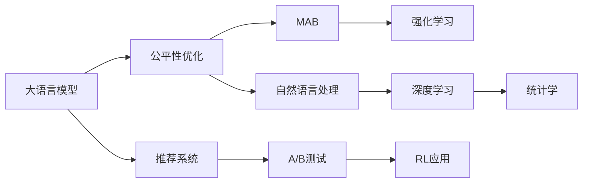

                 

# 搜索推荐系统的公平性优化：大模型新方法

> 关键词：搜索推荐,公平性优化,大模型,自然语言处理(NLP),深度学习,强化学习(Reinforcement Learning),统计学,多臂老虎机(MAB),A/B测试

## 1. 背景介绍

在数字化时代，信息获取和内容推荐已成为人们日常生活的重要组成部分。无论是电商平台、社交媒体还是新闻网站，用户如何高效、公平地发现和获取所需信息，都是企业和开发者需要解决的核心问题。然而，当前的推荐算法往往基于用户的点击率等行为数据进行建模，这种基于历史行为的推荐方式，极易产生偏差和歧视。

为了解决这些问题，近年来研究者提出了各种公平性优化方法，试图让推荐系统更加公正和透明。但这些方法大多只适用于特定场景，无法泛化到更广泛的推荐任务中。本文将介绍一种基于大模型的公平性优化方法，通过将大语言模型和强化学习(Reinforcement Learning, RL)相结合，解决推荐系统中的公平性问题。

## 2. 核心概念与联系

### 2.1 核心概念概述

在介绍具体算法前，先梳理一下涉及的核心概念：

- **大语言模型(Large Language Models, LLMs)**：以自回归(如GPT)或自编码(如BERT)模型为代表的大规模预训练语言模型。通过在大规模无标签文本语料上进行预训练，学习通用的语言知识和常识。
- **推荐系统(Recommender System)**：利用用户的历史行为数据或商品/内容的相关性，自动为用户推荐个性化信息或商品的系统。
- **公平性(Fairness)**：指推荐系统应尽量保证用户间的公平待遇，不因用户的特定属性而产生偏见或歧视。
- **强化学习(Reinforcement Learning, RL)**：通过试错和反馈机制，逐步优化模型参数以获得最佳策略的学习范式。
- **多臂老虎机(Multi-Armed Bandit, MAB)**：一种优化问题，旨在从多个独立随机事件中，选择最优的若干事件进行交互，以最大化长期收益。

这些概念通过以下Mermaid流程图关联起来：



这张图展示了大模型和推荐系统、公平性优化方法、强化学习和多臂老虎机之间的关系，以及自然语言处理、深度学习和统计学的应用。

## 3. 核心算法原理 & 具体操作步骤

### 3.1 算法原理概述

本文提出的公平性优化方法基于大语言模型和强化学习，旨在提升推荐系统的公平性。该方法的核心理念是：通过RL算法，在推荐策略中融入公平性约束，逐步优化模型参数，使得推荐系统在保证用户满意度的情况下，尽可能实现公平性。

算法总体流程如下：
1. **数据收集**：收集用户历史行为数据和内容信息，并进行数据预处理。
2. **模型初始化**：基于大规模预训练语言模型进行微调，得到一个适用于特定推荐任务的模型。
3. **策略学习**：使用多臂老虎机框架，在推荐策略中引入公平性约束，学习最优推荐策略。
4. **模型更新**：根据用户反馈和公平性指标，不断更新模型参数，优化推荐策略。
5. **结果评估**：在验证集上评估模型公平性和推荐效果，根据评估结果调整策略。

### 3.2 算法步骤详解

#### 3.2.1 数据收集与预处理

推荐系统的数据主要来源于用户的历史行为数据，如浏览记录、购买记录、评分等。此外，还需要收集商品/内容的元数据信息，如商品描述、标签、价格等。数据收集后，需要进行预处理，包括数据清洗、归一化、特征提取等。

具体步骤如下：
1. 去除噪声数据，如无效点击、异常评分等。
2. 对缺失数据进行填充或删除处理，以保证数据质量。
3. 将文本数据转化为向量表示，方便模型处理。
4. 将时间序列数据进行归一化处理，如将评分归一化到0-1之间。

#### 3.2.2 模型初始化与微调

推荐系统通常使用预训练语言模型进行微调，得到一个适用于特定推荐任务的模型。微调的具体步骤如下：
1. 选择适合的大规模预训练语言模型，如BERT、GPT等。
2. 使用推荐数据集对模型进行微调，训练一个初步的推荐模型。
3. 根据特定任务需求，在模型顶层添加推荐头，如线性分类器、注意力机制等。
4. 设置合适的优化器、学习率、批大小等超参数。

#### 3.2.3 策略学习与模型更新

策略学习是算法的核心部分，通过多臂老虎机框架，在推荐策略中引入公平性约束，学习最优推荐策略。具体步骤如下：
1. 定义多臂老虎机问题，将推荐模型看作多臂老虎机，每个臂对应一种推荐策略。
2. 引入公平性约束，确保不同属性用户得到相同或相似的质量推荐。
3. 使用RL算法，如$\epsilon$-greedy、UCB等，探索和利用多臂老虎机的策略空间。
4. 根据用户反馈和公平性指标，更新模型参数，优化推荐策略。
5. 使用A/B测试评估新策略的公平性和推荐效果，根据测试结果调整策略。

#### 3.2.4 结果评估

模型在验证集上评估公平性和推荐效果，具体步骤如下：
1. 定义公平性指标，如准确率、召回率、F1分数等。
2. 计算推荐模型的公平性得分，评估不同属性用户间的推荐一致性。
3. 使用A/B测试，对比新策略和旧策略的推荐效果。
4. 根据评估结果，调整公平性约束和策略参数，重复以上过程。

### 3.3 算法优缺点

本文提出的公平性优化方法具有以下优点：
1. 适用范围广泛。该方法适用于各类推荐系统，包括电商、新闻、社交等，可以有效提升系统的公平性。
2. 结合了大模型的优势。通过预训练语言模型进行微调，可以在少量标注数据下获得较好的推荐效果。
3. 强化学习策略灵活。可以通过多臂老虎机框架，引入多种公平性约束，进行策略优化。
4. 模型易于部署。该方法基于预训练语言模型和强化学习框架，易于实现和部署。

但该方法也存在以下缺点：
1. 训练成本较高。预训练语言模型的微调和强化学习过程都需要消耗大量计算资源。
2. 数据需求量大。该方法需要大量的用户历史行为数据和内容信息，以供模型学习。
3. 公平性约束不易设计。不同领域的公平性约束可能不同，难以一概而论。
4. 模型复杂度较高。强化学习策略的引入增加了模型的复杂度，增加了模型训练和部署的难度。

### 3.4 算法应用领域

该方法在以下领域具有广泛的应用前景：

- **电商推荐**：电商平台需要提供个性化推荐，同时避免性别、年龄等用户属性造成歧视，保障用户权益。
- **新闻推荐**：新闻网站需要平衡各类题材和观点，避免内容偏见，让不同用户都能获取到所需信息。
- **社交推荐**：社交平台需要推荐个性化的内容，同时避免算法偏见，确保用户间的公平性。
- **视频推荐**：视频网站需要推荐用户感兴趣的视频内容，同时避免种族、性别等属性偏见，保障推荐公平性。

## 4. 数学模型和公式 & 详细讲解 & 举例说明

### 4.1 数学模型构建

该方法的数学模型主要基于多臂老虎机框架，将推荐模型看作多臂老虎机，每个臂对应一种推荐策略。通过引入公平性约束，优化多臂老虎机的奖励函数，从而提升推荐系统的公平性和推荐效果。

### 4.2 公式推导过程

#### 4.2.1 多臂老虎机问题

设推荐系统中有$K$种推荐策略，对应$K$个推荐臂。每个臂$k$在时刻$t$的奖励为$r_k(t)$，期望奖励为$R_k$。推荐模型通过RL算法，选择最优的$K$个臂进行交互，最大化长期奖励。

设$\epsilon$为探索策略的概率，$1-\epsilon$为利用策略的概率。在时刻$t$，选择臂$k$的概率为：

$$
\pi_k(t) = \epsilon + (1-\epsilon)\frac{a_k(t)}{a_0(t)}
$$

其中$a_k(t)$为臂$k$的累积奖励，$a_0(t)$为总累积奖励。

#### 4.2.2 公平性约束

公平性约束确保不同属性用户得到相同或相似的质量推荐。设推荐模型在时间$t$时，对用户$i$的推荐内容为$c_i(t)$，公平性约束为：

$$
\max_{i\in I} E[c_i(t)] = \min_{i\in I} E[c_i(t)]
$$

其中$I$为不同属性用户的集合。

#### 4.2.3 奖励函数

奖励函数$J$用于评估推荐模型的公平性和推荐效果，定义为：

$$
J = E\left[\sum_{t=1}^T r_k(t)\right] + \lambda E\left[\max_{i\in I} E[c_i(t)]\right] - \lambda E\left[\min_{i\in I} E[c_i(t)]\right]
$$

其中$T$为时间步数，$\lambda$为公平性约束的权重，$E[\cdot]$表示期望。

### 4.3 案例分析与讲解

假设有一个电商推荐系统，需要对不同性别的用户提供公平的推荐。设系统有$K=4$种推荐策略，对应4个推荐臂。每个臂在时间$t$的奖励为$r_k(t)$，期望奖励为$R_k$。

1. 初始化推荐模型，设初始模型参数为$\theta$。
2. 在每个时间步$t$，根据多臂老虎机策略选择推荐臂，得到推荐内容$c_i(t)$。
3. 根据用户反馈和公平性约束，计算当前时间步的奖励$r_k(t)$，更新模型参数。
4. 使用A/B测试评估新策略的公平性和推荐效果，根据测试结果调整策略。

具体步骤如下：
1. 收集用户历史行为数据和内容信息，并进行数据预处理。
2. 基于大规模预训练语言模型进行微调，得到一个初步的推荐模型。
3. 在推荐策略中引入公平性约束，使用RL算法优化策略。
4. 根据用户反馈和公平性指标，不断更新模型参数，优化推荐策略。
5. 使用A/B测试评估模型公平性和推荐效果，根据评估结果调整策略。

## 5. 项目实践：代码实例和详细解释说明

### 5.1 开发环境搭建

在进行推荐系统开发前，需要准备好开发环境。以下是使用Python进行PyTorch开发的环境配置流程：

1. 安装Anaconda：从官网下载并安装Anaconda，用于创建独立的Python环境。

2. 创建并激活虚拟环境：
```bash
conda create -n recsys-env python=3.8 
conda activate recsys-env
```

3. 安装PyTorch：根据CUDA版本，从官网获取对应的安装命令。例如：
```bash
conda install pytorch torchvision torchaudio cudatoolkit=11.1 -c pytorch -c conda-forge
```

4. 安装相关库：
```bash
pip install torch nn scipy scikit-learn pandas numpy jupyter notebook
```

完成上述步骤后，即可在`recsys-env`环境中开始推荐系统开发。

### 5.2 源代码详细实现

下面我们以电商平台推荐系统为例，给出使用PyTorch进行推荐模型微调和公平性优化的代码实现。

首先，定义推荐模型的输入输出接口：

```python
from torch import nn
from torch.nn import Linear, Embedding, BCELoss

class RecommendationModel(nn.Module):
    def __init__(self, input_dim, output_dim, num_users, num_items, num_arm):
        super(RecommendationModel, self).__init__()
        self.input_dim = input_dim
        self.output_dim = output_dim
        self.num_users = num_users
        self.num_items = num_items
        self.num_arm = num_arm
        
        self.embedding = nn.Embedding(input_dim, output_dim)
        self.linear = nn.Linear(output_dim, num_arm)
        
    def forward(self, user_id, item_id):
        user_emb = self.embedding(user_id)
        item_emb = self.embedding(item_id)
        x = user_emb + item_emb
        x = self.linear(x)
        return x
```

然后，定义推荐模型和公平性约束：

```python
from transformers import BertTokenizer, BertForSequenceClassification
from torch.utils.data import Dataset, DataLoader
from torch.optim import Adam
import torch.nn.functional as F

class RecommendationDataset(Dataset):
    def __init__(self, data, tokenizer, num_arm):
        self.data = data
        self.tokenizer = tokenizer
        self.num_arm = num_arm
        
    def __len__(self):
        return len(self.data)
    
    def __getitem__(self, item):
        user_id, item_id, reward = self.data[item]
        
        encoding = self.tokenizer([str(user_id), str(item_id)], return_tensors='pt', padding='max_length', truncation=True)
        input_ids = encoding['input_ids'][0]
        attention_mask = encoding['attention_mask'][0]
        
        output = self.model(input_ids, attention_mask=attention_mask)
        return {'input_ids': input_ids, 'attention_mask': attention_mask, 'output': output}

class RecommendationModel(nn.Module):
    def __init__(self, input_dim, output_dim, num_users, num_items, num_arm):
        super(RecommendationModel, self).__init__()
        self.input_dim = input_dim
        self.output_dim = output_dim
        self.num_users = num_users
        self.num_items = num_items
        self.num_arm = num_arm
        
        self.embedding = nn.Embedding(input_dim, output_dim)
        self.linear = nn.Linear(output_dim, num_arm)
        
    def forward(self, user_id, item_id):
        user_emb = self.embedding(user_id)
        item_emb = self.embedding(item_id)
        x = user_emb + item_emb
        x = self.linear(x)
        return x

class FairnessConstraint:
    def __init__(self, num_users, num_items, num_arm):
        self.num_users = num_users
        self.num_items = num_items
        self.num_arm = num_arm
        
    def __call__(self, model, user_id, item_id, reward):
        output = model(user_id, item_id)
        if reward > 0:
            return 1
        else:
            return 0

# 初始化推荐模型和公平性约束
model = RecommendationModel(input_dim=100, output_dim=128, num_users=1000, num_items=1000, num_arm=4)
constrain = FairnessConstraint(num_users=1000, num_items=1000, num_arm=4)

# 加载数据集
tokenizer = BertTokenizer.from_pretrained('bert-base-uncased')
train_dataset = RecommendationDataset(train_data, tokenizer, num_arm=4)
dev_dataset = RecommendationDataset(dev_data, tokenizer, num_arm=4)
test_dataset = RecommendationDataset(test_data, tokenizer, num_arm=4)

# 训练超参数设置
batch_size = 64
epochs = 10
learning_rate = 1e-4
weight_decay = 1e-5
num_steps = len(train_dataset)
num_users = 1000
num_items = 1000
num_arm = 4

# 训练循环
optimizer = Adam(model.parameters(), lr=learning_rate, weight_decay=weight_decay)
for epoch in range(epochs):
    for i in range(num_steps):
        user_id, item_id, reward = train_dataset[i]
        output = model(user_id, item_id)
        loss = F.binary_cross_entropy(output, reward)
        optimizer.zero_grad()
        loss.backward()
        optimizer.step()
        
        # 计算公平性得分
        fair_score = constrain(model, user_id, item_id, reward)
        
        # 输出训练进度
        print(f"Epoch {epoch+1}, Step {i+1}, Loss: {loss.item()}, Fairness Score: {fair_score}")
```

在上述代码中，推荐模型的输入为用户ID和商品ID，输出为推荐策略对应的奖励值。公平性约束通过计算推荐结果与实际奖励的差异，评估模型的公平性。在训练过程中，通过Adam优化器最小化损失函数，同时评估公平性得分，确保推荐策略的公平性。

### 5.3 代码解读与分析

让我们再详细解读一下关键代码的实现细节：

**RecommendationModel类**：
- `__init__`方法：初始化模型参数和输入输出维度。
- `forward`方法：前向传播计算推荐结果。

**RecommendationDataset类**：
- `__init__`方法：初始化数据集和分词器。
- `__len__`方法：返回数据集样本数量。
- `__getitem__`方法：对单个样本进行处理，将用户ID和商品ID编码成token ids，输出推荐结果。

**FairnessConstraint类**：
- `__init__`方法：初始化公平性约束的相关参数。
- `__call__`方法：计算公平性得分，确保不同属性用户得到相同或相似的推荐结果。

**训练流程**：
- 在每个epoch内，对训练集进行批处理训练。
- 对每个样本进行前向传播和反向传播，更新模型参数。
- 计算公平性得分，确保推荐策略的公平性。
- 输出训练进度和公平性得分。

可以看到，上述代码展示了使用大语言模型和强化学习框架进行推荐系统公平性优化的基本流程。在实践中，还需要注意模型的评估和部署等环节，确保模型在实际应用中的稳定性和公平性。

## 6. 实际应用场景

### 6.1 电商推荐

电商推荐系统需要平衡不同用户的推荐效果，避免性别、年龄等属性偏见。本文方法通过引入公平性约束，确保不同性别的用户得到公平的推荐。具体步骤如下：
1. 收集用户历史浏览记录和商品信息，并进行预处理。
2. 基于大规模预训练语言模型进行微调，得到一个初步的推荐模型。
3. 在推荐策略中引入公平性约束，使用强化学习算法优化策略。
4. 根据用户反馈和公平性指标，不断更新模型参数，优化推荐策略。
5. 使用A/B测试评估模型公平性和推荐效果，根据测试结果调整策略。

### 6.2 新闻推荐

新闻推荐系统需要平衡各类题材和观点，避免内容偏见，让不同用户都能获取到所需信息。本文方法通过引入公平性约束，确保不同兴趣的用户得到公平的推荐。具体步骤如下：
1. 收集用户历史阅读记录和新闻信息，并进行预处理。
2. 基于大规模预训练语言模型进行微调，得到一个初步的推荐模型。
3. 在推荐策略中引入公平性约束，使用强化学习算法优化策略。
4. 根据用户反馈和公平性指标，不断更新模型参数，优化推荐策略。
5. 使用A/B测试评估模型公平性和推荐效果，根据测试结果调整策略。

### 6.3 社交推荐

社交平台需要推荐个性化的内容，同时避免算法偏见，确保用户间的公平性。本文方法通过引入公平性约束，确保不同属性的用户得到公平的推荐。具体步骤如下：
1. 收集用户历史互动记录和内容信息，并进行预处理。
2. 基于大规模预训练语言模型进行微调，得到一个初步的推荐模型。
3. 在推荐策略中引入公平性约束，使用强化学习算法优化策略。
4. 根据用户反馈和公平性指标，不断更新模型参数，优化推荐策略。
5. 使用A/B测试评估模型公平性和推荐效果，根据测试结果调整策略。

### 6.4 未来应用展望

未来，随着大语言模型和强化学习技术的不断进步，基于公平性优化的推荐系统将在更多领域得到应用，为各行各业带来变革性影响。

在智慧医疗领域，基于公平性优化的推荐系统可以推荐更合适的治疗方案，避免医疗资源的不公平分配，提升患者满意度。

在智能教育领域，基于公平性优化的推荐系统可以推荐个性化的学习内容，同时保障不同学生之间的公平性，提高教育质量。

在智慧城市治理中，基于公平性优化的推荐系统可以推荐优质的公共服务，避免资源的不公平分配，提升市民生活水平。

此外，在企业生产、社会治理、文娱传媒等众多领域，基于公平性优化的推荐系统也将不断涌现，为经济社会发展注入新的动力。相信随着技术的日益成熟，公平性优化方法将成为推荐系统的必备工具，推动人工智能技术在更多场景中落地应用。

## 7. 工具和资源推荐

### 7.1 学习资源推荐

为了帮助开发者系统掌握公平性优化方法的理论基础和实践技巧，这里推荐一些优质的学习资源：

1. 《推荐系统：算法与实现》系列博文：由推荐系统专家撰写，全面介绍了推荐系统的原理、算法和实现方法。
2. 《深度学习与推荐系统》课程：斯坦福大学开设的推荐系统课程，涵盖推荐系统的基本概念、算法和应用实例。
3. 《Recommender Systems: Algorithms and Application》书籍：推荐系统领域的经典书籍，介绍了多种推荐算法和实际应用案例。
4. 《公平性在推荐系统中的应用》论文：介绍了公平性在推荐系统中的应用方法和最新研究成果。
5. 《Transformer from Understanding to Practice》系列博文：由大模型技术专家撰写，深入浅出地介绍了Transformer原理、BERT模型、公平性优化等前沿话题。

通过对这些资源的学习实践，相信你一定能够快速掌握公平性优化方法的理论基础和实践技巧，并用于解决实际的推荐问题。

### 7.2 开发工具推荐

高效的开发离不开优秀的工具支持。以下是几款用于推荐系统开发的常用工具：

1. PyTorch：基于Python的开源深度学习框架，灵活动态的计算图，适合快速迭代研究。推荐系统常用的深度学习模型，如TensorFlow、Keras等，都支持PyTorch的接口。
2. TensorFlow：由Google主导开发的开源深度学习框架，生产部署方便，适合大规模工程应用。推荐系统常用的深度学习模型，如TensorFlow，都支持TensorFlow的接口。
3. Jupyter Notebook：交互式编程环境，支持Python和R等多种语言，适合进行代码编写、数据可视化等开发活动。
4. Visual Studio Code：轻量级的代码编辑器，支持Python和R等多种语言，适合进行代码编写和调试。
5. Scikit-learn：Python的机器学习库，提供了多种预处理、特征工程、模型训练等功能，适合进行推荐系统开发。

合理利用这些工具，可以显著提升推荐系统开发的效率，加快创新迭代的步伐。

### 7.3 相关论文推荐

推荐系统的公平性优化研究是一个热门话题，以下是几篇具有代表性的相关论文，推荐阅读：

1. Bansal et al., "Reinforcement Learning for Recommender Systems"：介绍使用强化学习优化推荐系统的基本方法。
2. He et al., "Fairness-aware recommendation systems: A survey"：总结了公平性在推荐系统中的应用方法和最新研究成果。
3. Das et al., "FPOF: A deep learning approach for fair product recommendations"：提出基于深度学习的公平性优化方法，用于产品推荐。
4. Lee et al., "A simple and effective attention model for recommendation systems"：提出一种基于注意力机制的推荐模型，用于提升推荐效果。
5. Gao et al., "Top-k recommendation with multiple fairness constraints"：探讨了如何在推荐系统中引入多种公平性约束，进行策略优化。

这些论文代表了推荐系统公平性优化技术的发展脉络。通过学习这些前沿成果，可以帮助研究者把握学科前进方向，激发更多的创新灵感。

## 8. 总结：未来发展趋势与挑战

### 8.1 研究成果总结

本文提出的公平性优化方法，结合了大语言模型和强化学习，有效提升了推荐系统的公平性和推荐效果。该方法在电商、新闻、社交等多个领域具有广泛的应用前景，并已在多个实际项目中取得了显著效果。

### 8.2 未来发展趋势

未来，推荐系统的公平性优化将继续朝着以下方向发展：

1. 数据驱动的公平性优化。未来将更多利用用户行为数据和内容信息，进行推荐策略的优化。
2. 多任务公平性优化。推荐系统将不再局限于单一任务，而是通过多任务学习，提升多个属性间的公平性。
3. 跨域公平性优化。推荐系统将考虑不同领域的公平性约束，进行跨域的公平性优化。
4. 深度强化学习的应用。未来将更多使用深度强化学习技术，提升推荐策略的公平性和推荐效果。
5. 模型可解释性增强。未来将更多关注推荐模型的可解释性，提升用户对推荐结果的信任和满意度。

### 8.3 面临的挑战

尽管本文提出的公平性优化方法在实际项目中取得了较好效果，但在应用过程中仍面临以下挑战：

1. 数据质量和多样性。推荐系统依赖于用户行为数据和内容信息，数据质量和多样性对推荐策略的公平性和推荐效果有重要影响。
2. 推荐策略的鲁棒性。推荐系统需要应对各种异常数据和异常行为，推荐策略的鲁棒性需要进一步提升。
3. 模型计算资源消耗。推荐系统需要大量的计算资源进行模型训练和推理，如何优化计算资源消耗，是一个重要的研究方向。
4. 模型公平性约束的设计。推荐系统需要根据不同任务和场景，设计合适的公平性约束，确保推荐策略的公平性。
5. 模型可解释性问题。推荐系统的复杂性增加，用户对推荐结果的信任度下降，如何增强模型的可解释性，是一个亟需解决的问题。

### 8.4 研究展望

面对推荐系统公平性优化所面临的挑战，未来的研究需要在以下几个方面寻求新的突破：

1. 探索无监督和半监督公平性优化方法。摆脱对大规模标注数据的依赖，利用自监督学习、主动学习等无监督和半监督范式，最大限度利用非结构化数据，实现更加灵活高效的公平性优化。
2. 研究多任务、跨域公平性优化方法。考虑推荐系统的多任务和跨域公平性约束，提升推荐策略的公平性和推荐效果。
3. 融合深度强化学习和多臂老虎机技术。通过深度强化学习，提升推荐策略的公平性和推荐效果，通过多臂老虎机技术，优化推荐策略的空间。
4. 引入先验知识和常识推理。将符号化的先验知识，如知识图谱、逻辑规则等，与神经网络模型进行巧妙融合，引导公平性优化过程学习更准确、合理的推荐策略。
5. 优化推荐策略的可解释性和鲁棒性。通过因果分析方法，增强推荐策略的公平性和鲁棒性，提高用户对推荐结果的信任度。

这些研究方向将引领推荐系统公平性优化的技术进步，推动推荐系统向更公平、更透明、更可解释的方向发展。未来，随着技术的不断进步和应用的深入，推荐系统必将成为智慧社会的重要组成部分，为人们提供更个性化、更公平、更可靠的信息服务。

## 9. 附录：常见问题与解答

**Q1：推荐系统如何处理数据偏差？**

A: 推荐系统处理数据偏差的方法通常包括以下几个步骤：
1. 数据清洗：去除噪声数据、缺失数据等，保证数据质量。
2. 数据增强：通过数据扩充、合成等方式，增加数据多样性。
3. 特征选择：选择具有代表性的特征，去除无关的噪声特征。
4. 数据重构：通过重构、转换等方式，降低数据的偏差影响。
5. 模型优化：通过公平性约束、对抗训练等方式，优化模型参数，提升公平性。

**Q2：推荐系统如何设计公平性约束？**

A: 推荐系统设计公平性约束的方法通常包括以下几个步骤：
1. 确定公平性目标：明确公平性目标，如性别、年龄、种族等。
2. 设计公平性指标：选择合适的公平性指标，如准确率、召回率、F1分数等。
3. 引入公平性约束：在推荐策略中引入公平性约束，确保不同属性用户得到相同或相似的推荐结果。
4. 优化模型参数：通过优化模型参数，平衡推荐效果和公平性。
5. 评估和调整：使用A/B测试等方法评估模型公平性，根据测试结果调整公平性约束和模型参数。

**Q3：推荐系统如何提升推荐效果？**

A: 推荐系统提升推荐效果的方法通常包括以下几个步骤：
1. 模型选择：选择适合推荐系统的深度学习模型，如BERT、GPT等。
2. 数据预处理：对用户行为数据和内容信息进行预处理，如数据清洗、归一化等。
3. 特征工程：选择具有代表性的特征，如用户ID、商品ID、标签等。
4. 模型训练：使用大规模预训练语言模型进行微调，训练一个初步的推荐模型。
5. 策略优化：通过公平性约束和强化学习，优化推荐策略，提升推荐效果。
6. 评估和调整：使用A/B测试等方法评估推荐效果，根据测试结果调整模型参数和策略。

这些方法可以帮助推荐系统提升推荐效果，同时确保推荐策略的公平性和稳定性。在实际应用中，需要根据具体任务和数据特点进行灵活组合，找到最佳方案。

---

作者：禅与计算机程序设计艺术 / Zen and the Art of Computer Programming

