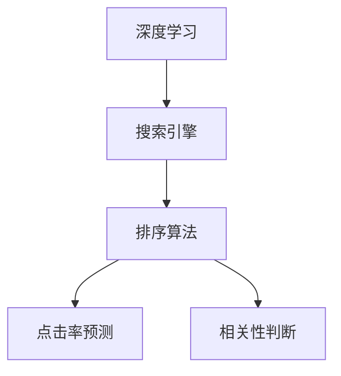

                 

# 搜索结果排序：从规则到AI的进化

## 1. 背景介绍

在现代信息爆炸的时代，搜索引擎的搜索结果排序算法直接影响到用户的信息获取效率和体验。从早期的基于规则的排序算法到当前的深度学习算法，搜索引擎技术经历了多次革命性的演进。本博客将详细探讨搜索引擎从基于规则到基于深度学习的排序算法发展历程，分析其优缺点，并展望未来搜索排序技术的方向。

### 1.1 问题由来

传统的搜索引擎排序算法主要依赖于简单的关键词匹配和权重计算。这种方法在互联网初期起到了重要作用，但随着数据量的大幅增长，用户的查询需求日趋复杂，基于规则的算法逐渐无法满足用户的搜索体验。在这种情况下，人工智能驱动的深度学习排序算法应运而生。

### 1.2 问题核心关键点

目前，深度学习驱动的搜索排序算法在信息检索、广告推荐等诸多领域展现出了巨大的潜力。其核心思想是通过训练深度神经网络模型，自动学习搜索引擎数据和用户查询之间的复杂映射关系。这种方法在处理大规模数据、捕捉用户意图、提升查询相关性等方面具有明显优势。

### 1.3 问题研究意义

理解搜索引擎排序算法从规则到深度学习的演进，对于优化搜索引擎体验，推动信息检索技术的发展具有重要意义：

1. 提升用户搜索体验：深度学习排序算法能够更好地捕捉用户查询意图，提供更加准确、相关性更高的搜索结果。
2. 加速搜索结果反馈：深度学习算法可以实时处理海量查询请求，迅速反馈搜索结果。
3. 提升广告投放效果：通过分析用户行为和搜索数据，深度学习算法可以精准定位广告受众，提高广告投放效果。
4. 支持个性化推荐：深度学习算法能够分析用户历史行为，提供个性化搜索结果和推荐内容。
5. 推动技术创新：深度学习在搜索排序领域的应用促进了人工智能技术的发展，带来了新一轮技术创新。

## 2. 核心概念与联系

### 2.1 核心概念概述

为更好地理解搜索引擎排序算法从规则到深度学习的演进，本节将介绍几个密切相关的核心概念：

- 深度学习：一种基于多层神经网络的机器学习方法，通过不断迭代优化模型参数，学习数据的复杂映射关系。
- 搜索引擎：一种从海量互联网数据中自动提取、组织、检索信息的系统。搜索引擎的核心功能是排序算法，用于匹配用户查询并返回最相关的结果。
- 排序算法：一种基于某种规则或模型，对搜索结果进行排名，以决定搜索结果展示顺序的算法。
- 点击率预测：通过训练深度神经网络，预测用户点击搜索结果的概率，用于优化排序算法。
- 相关性判断：衡量搜索结果与用户查询的匹配程度，是排序算法的核心评价指标。

这些概念之间的逻辑关系可以通过以下Mermaid流程图来展示：



这个流程图展示了深度学习在搜索引擎技术中的应用：

1. 深度学习为搜索引擎提供强大的数据建模能力，辅助优化排序算法。
2. 排序算法根据用户查询和搜索结果构建的模型，自动调整搜索结果的展示顺序。
3. 点击率预测和相关性判断是排序算法的关键子任务，决定了搜索结果的排序顺序。

## 3. 核心算法原理 & 具体操作步骤
### 3.1 算法原理概述

深度学习驱动的搜索排序算法，本质上是一个端到端的预测模型。其核心思想是：利用深度神经网络，从用户查询和搜索结果的特征向量中自动学习相关性判断和点击率预测模型，从而优化搜索结果的排序顺序。

形式化地，设用户查询为 $q$，搜索结果为 $d$，相关性判断和点击率预测模型为 $f$，则优化目标为：

$$
\min_{f} \mathcal{L}(f) = \frac{1}{N} \sum_{i=1}^N [\ell(\hat{r}_i, r_i)]
$$

其中，$\ell$ 为交叉熵损失函数，$\hat{r}_i$ 为模型预测的点击率，$r_i$ 为实际点击率。

通过反向传播算法，模型可以不断更新参数，最小化损失函数，从而提升预测准确率。

### 3.2 算法步骤详解

深度学习驱动的搜索排序算法一般包括以下几个关键步骤：

**Step 1: 数据准备**
- 收集大量查询-点击数据，构建训练集和验证集。
- 对查询和搜索结果进行特征工程，提取有效的特征表示。

**Step 2: 模型选择与构建**
- 选择适合的任务模型结构，如深度神经网络、注意力机制等。
- 在训练集上训练模型，不断调整模型参数以提升性能。

**Step 3: 模型评估与优化**
- 在验证集上评估模型的点击率和相关性判断性能，使用交叉验证等方法优化模型参数。
- 应用正则化技术、模型集成等方法提升模型泛化能力。

**Step 4: 结果排序**
- 使用训练好的模型对用户查询和搜索结果进行预测，计算相关性和点击率。
- 根据预测结果对搜索结果进行排序，返回给用户。

### 3.3 算法优缺点

深度学习驱动的搜索排序算法具有以下优点：

1. 数据适应性更强：能够自动捕捉用户查询意图，适应不同查询场景。
2. 泛化能力更强：能够处理各种类型的数据，在多个领域展现出良好的效果。
3. 预测精度更高：通过复杂模型能够提升点击率和相关性判断的准确率。

同时，该算法也存在以下缺点：

1. 数据需求量大：深度学习算法需要大量标注数据进行训练，对于小型搜索引擎，数据获取成本较高。
2. 模型训练时间长：深度神经网络结构复杂，训练耗时较长，对算力要求高。
3. 模型泛化风险高：模型容易出现过拟合，尤其是对于数据分布变化较大的场景。
4. 难以解释：深度学习模型通常被视为"黑盒"，难以解释其内部工作机制。

尽管存在这些局限性，但就目前而言，深度学习在搜索排序领域仍然是最先进的技术范式。未来相关研究的重点在于如何进一步降低模型对标注数据的依赖，提高模型的泛化能力和可解释性，同时兼顾计算效率。

### 3.4 算法应用领域

深度学习驱动的搜索排序算法，已经在搜索引擎、广告推荐、个性化推荐等众多领域得到广泛应用，覆盖了广告精准投放、用户行为分析、信息检索等多个场景。

具体而言，深度学习算法在以下领域展现出显著优势：

- 搜索引擎：优化搜索结果排序，提升用户搜索体验。
- 广告推荐：通过分析用户行为和搜索数据，精准定位广告受众，提高广告投放效果。
- 个性化推荐：分析用户历史行为，提供个性化搜索结果和推荐内容。
- 电子商务：预测用户购买行为，优化推荐系统，提升用户购物体验。
- 智能家居：分析用户行为模式，优化智能家居系统，提升用户生活便捷性。

除了上述这些经典应用外，深度学习算法还被创新性地应用到更多场景中，如健康医疗、金融服务等，为各行各业带来变革性影响。

## 4. 数学模型和公式 & 详细讲解  
### 4.1 数学模型构建

本节将使用数学语言对深度学习驱动的搜索排序算法进行更加严格的刻画。

设用户查询为 $q$，搜索结果为 $d$，相关性判断和点击率预测模型为 $f$，则点击率预测和相关性判断模型的输入特征表示为 $x \in \mathbb{R}^n$，输出为 $\hat{y} \in [0,1]$。模型训练的目标是最大化预测概率：

$$
\max_{f} \mathcal{L}(f) = \frac{1}{N} \sum_{i=1}^N [\log\hat{r}_i - r_i]
$$

其中，$\hat{r}_i = f(x_i)$，$r_i$ 为实际点击率。

在训练过程中，可以通过最小化交叉熵损失函数来优化模型：

$$
\min_{f} \mathcal{L}(f) = \frac{1}{N} \sum_{i=1}^N [-\hat{r}_i\log r_i - (1-\hat{r}_i)\log (1-r_i)]
$$

通过反向传播算法，模型可以不断更新参数，最小化损失函数，从而提升预测准确率。

### 4.2 公式推导过程

以下我们以二分类任务为例，推导深度学习驱动的搜索排序算法的基本公式。

假设模型 $f$ 在输入 $x$ 上的输出为 $\hat{y}=f(x) \in [0,1]$，表示样本属于正类的概率。真实标签 $y \in \{0,1\}$。则二分类交叉熵损失函数定义为：

$$
\ell(f(x),y) = -[y\log \hat{y} + (1-y)\log (1-\hat{y})]
$$

将其代入经验风险公式，得：

$$
\mathcal{L}(f) = -\frac{1}{N}\sum_{i=1}^N [y_i\log f(x_i)+(1-y_i)\log(1-f(x_i))]
$$

在训练过程中，模型通过前向传播和反向传播，不断调整权重矩阵和偏置向量，使得损失函数最小化。最终得到的模型 $f$ 可以对新的用户查询和搜索结果进行预测，判断其相关性和点击率，并进行排序。

### 4.3 案例分析与讲解

以谷歌的AdRank算法为例，该算法是基于深度学习驱动的广告推荐系统，通过学习广告和用户行为的复杂映射关系，预测广告点击率和用户点击广告的概率，优化广告排序。

AdRank算法通过以下步骤实现：

1. 对用户查询和广告进行特征工程，提取文本、图像、时间戳等多种特征。
2. 使用深度神经网络模型，将用户查询和广告特征映射到高维空间中。
3. 通过softmax层输出每个广告的点击概率，根据点击率预测结果对广告进行排序。
4. 在实际广告投放中，将排名靠前的广告展示给用户，提升广告点击率和用户体验。

AdRank算法通过深度学习模型的自适应性，能够处理各种数据类型，提升广告推荐的效果和精准度。同时，通过不断调整模型参数，能够适应广告投放环境的快速变化。

## 5. 项目实践：代码实例和详细解释说明
### 5.1 开发环境搭建

在进行深度学习驱动的搜索排序算法实践前，我们需要准备好开发环境。以下是使用Python进行TensorFlow开发的代码环境配置流程：

1. 安装Anaconda：从官网下载并安装Anaconda，用于创建独立的Python环境。

2. 创建并激活虚拟环境：
```bash
conda create -n tf-env python=3.8 
conda activate tf-env
```

3. 安装TensorFlow：根据CUDA版本，从官网获取对应的安装命令。例如：
```bash
conda install tensorflow -c conda-forge
```

4. 安装Keras：
```bash
pip install keras
```

5. 安装各类工具包：
```bash
pip install numpy pandas scikit-learn matplotlib tqdm jupyter notebook ipython
```

完成上述步骤后，即可在`tf-env`环境中开始深度学习驱动的搜索排序算法实践。

### 5.2 源代码详细实现

这里我们以点击率预测为例，给出使用TensorFlow实现深度神经网络模型的代码实现。

首先，定义点击率预测任务的输入和输出：

```python
from tensorflow.keras.layers import Input, Dense
from tensorflow.keras.models import Model

# 定义模型输入
input_layer = Input(shape=(n_features,))

# 定义模型结构
hidden_layer = Dense(64, activation='relu')(input_layer)
output_layer = Dense(1, activation='sigmoid')(hidden_layer)

# 定义模型输出
output = output_layer

# 构建模型
model = Model(inputs=input_layer, outputs=output)

# 编译模型
model.compile(loss='binary_crossentropy', optimizer='adam', metrics=['accuracy'])
```

然后，定义训练和评估函数：

```python
from tensorflow.keras.datasets import mnist
from tensorflow.keras.utils import to_categorical
from sklearn.model_selection import train_test_split

# 加载MNIST数据集
(x_train, y_train), (x_test, y_test) = mnist.load_data()

# 数据预处理
x_train = x_train.reshape(-1, n_features).astype('float32') / 255.0
x_test = x_test.reshape(-1, n_features).astype('float32') / 255.0
y_train = to_categorical(y_train, num_classes=2)
y_test = to_categorical(y_test, num_classes=2)

# 数据划分
x_train, x_val, y_train, y_val = train_test_split(x_train, y_train, test_size=0.2)

# 定义训练和评估函数
def train(model, x_train, y_train, x_val, y_val, batch_size, epochs):
    model.fit(x_train, y_train, batch_size=batch_size, epochs=epochs, validation_data=(x_val, y_val))

def evaluate(model, x_test, y_test, batch_size):
    model.evaluate(x_test, y_test, batch_size=batch_size)
```

最后，启动模型训练并在测试集上评估：

```python
n_features = 784
n_epochs = 10
batch_size = 32

# 训练模型
train(model, x_train, y_train, x_val, y_val, batch_size, n_epochs)

# 评估模型
evaluate(model, x_test, y_test, batch_size)
```

以上就是使用TensorFlow实现点击率预测任务的完整代码实现。可以看到，通过TensorFlow框架，深度学习模型的训练和评估变得简洁高效。

### 5.3 代码解读与分析

让我们再详细解读一下关键代码的实现细节：

**输入层定义**：
- `Input` 层用于定义模型的输入，通过指定输入维度和数据类型，指定模型的输入特征。

**隐藏层定义**：
- `Dense` 层定义了模型的一个全连接层，通过指定激活函数和隐藏单元数，决定了模型的非线性特征提取能力。

**输出层定义**：
- `Dense` 层定义了模型的输出层，通过指定激活函数和输出单元数，决定了模型的输出类型和规模。

**模型编译与训练**：
- `compile` 方法用于配置模型的损失函数、优化器和评价指标。
- `fit` 方法用于训练模型，指定训练数据和验证数据，以及训练的轮数和批量大小。

**模型评估**：
- `evaluate` 方法用于评估模型的性能，计算损失和准确率。

可以看到，TensorFlow提供了一站式的深度学习模型开发环境，通过简单的API调用，可以高效地实现模型的训练、评估和优化。

## 6. 实际应用场景

### 6.1 智能搜索系统

深度学习驱动的搜索排序算法可以广泛应用于智能搜索系统的构建。传统搜索系统往往只依赖简单的关键词匹配和权重计算，难以满足用户的多样化查询需求。通过深度学习算法，搜索系统可以理解用户查询的意图，自动优化搜索结果的排序，提升用户搜索体验。

在技术实现上，可以收集用户查询日志和点击数据，构建标注数据集，在此基础上对预训练模型进行微调。微调后的模型能够更好地捕捉用户查询的语义和上下文，生成更相关、更高质量的搜索结果。同时，通过不断收集用户反馈，可以动态优化搜索排序模型，实现搜索体验的持续提升。

### 6.2 个性化推荐系统

当前的推荐系统往往只依赖用户历史行为数据进行物品推荐，难以捕捉用户多样化的兴趣和需求。深度学习算法能够自动学习用户行为的复杂关系，提供更加个性化的推荐内容。

在实践中，可以收集用户浏览、点击、评分等行为数据，提取和用户交互的物品特征，通过深度学习模型训练出推荐模型。推荐模型能够分析用户历史行为，预测用户对新物品的偏好，并动态调整推荐策略，提升推荐效果。

### 6.3 广告推荐系统

深度学习算法在广告推荐系统中的应用非常广泛。广告推荐系统需要根据用户行为和搜索数据，精准定位广告受众，提高广告投放效果。通过深度学习模型，广告推荐系统能够自动学习用户行为和搜索数据，预测用户点击广告的概率，优化广告排序和投放策略。

具体而言，深度学习算法可以分析用户历史行为、搜索意图和广告内容，通过构建点击率预测模型，优化广告排序。在实际广告投放中，根据预测结果动态调整广告投放策略，提升广告点击率和转化率。

### 6.4 未来应用展望

随着深度学习算法的不断演进，基于深度学习的搜索排序技术将呈现以下几个发展趋势：

1. 模型规模持续增大。随着算力成本的下降和数据规模的扩张，深度学习模型将持续增长，能够处理更加复杂的数据类型和查询需求。
2. 多模态融合技术兴起。深度学习算法将支持多模态数据融合，将文本、图像、语音等多种数据类型结合起来，提升推荐和搜索效果。
3. 动态自适应技术发展。深度学习算法将支持动态调整模型参数，根据用户行为和环境变化，实时优化搜索结果和推荐内容。
4. 低延迟技术进步。深度学习算法将支持低延迟推理，通过优化模型结构和计算图，提升模型的实时处理能力。
5. 强化学习应用。深度学习算法将结合强化学习技术，自动探索最优的推荐和搜索策略，提升用户体验。

以上趋势凸显了深度学习在搜索排序领域的巨大潜力。这些方向的探索发展，必将进一步提升搜索排序技术的性能和应用范围，为人类认知智能的进化带来深远影响。

## 7. 工具和资源推荐
### 7.1 学习资源推荐

为了帮助开发者系统掌握深度学习驱动的搜索排序算法的理论基础和实践技巧，这里推荐一些优质的学习资源：

1. 《深度学习》课程：斯坦福大学开设的深度学习入门课程，提供丰富的理论讲解和实践样例，适合初学者。
2. TensorFlow官方文档：TensorFlow官方文档，提供完整的模型开发、训练和评估流程，是深度学习开发的必备参考资料。
3. Keras官方文档：Keras官方文档，提供简洁易用的API调用，适合快速原型设计和实验验证。
4. Coursera深度学习专项课程：由深度学习专家Andrew Ng主讲的专项课程，涵盖深度学习理论和实践，适合系统学习。
5. 《深度学习实战》书籍：深度学习实战书籍，提供丰富的案例分析和代码实现，适合进阶学习和项目实践。

通过对这些资源的学习实践，相信你一定能够快速掌握深度学习驱动的搜索排序算法的精髓，并用于解决实际的搜索排序问题。

### 7.2 开发工具推荐

高效的开发离不开优秀的工具支持。以下是几款用于深度学习驱动的搜索排序算法开发的常用工具：

1. TensorFlow：由Google主导开发的深度学习框架，生产部署方便，适合大规模工程应用。
2. Keras：一个高级深度学习API，简洁易用，支持多种深度学习模型和架构。
3. PyTorch：由Facebook开发的深度学习框架，灵活高效，适合快速原型设计和实验验证。
4. Jupyter Notebook：一个交互式的开发环境，适合快速原型设计和数据探索。
5. Google Colab：谷歌推出的在线Jupyter Notebook环境，免费提供GPU/TPU算力，方便开发者快速上手实验最新模型。

合理利用这些工具，可以显著提升深度学习驱动的搜索排序算法的开发效率，加快创新迭代的步伐。

### 7.3 相关论文推荐

深度学习在搜索排序领域的发展源于学界的持续研究。以下是几篇奠基性的相关论文，推荐阅读：

1. Deep Click Prediction with Wide & Deep Model（DeepFM）：提出DeepFM模型，结合宽项和深度模型，提升点击率预测的准确率。
2. A Neural Probabilistic Language Model（RNN）：提出RNN模型，用于自然语言处理任务，展示了深度学习模型的强大预测能力。
3. Attention is All You Need（Transformer）：提出Transformer模型，开创了自注意力机制在深度学习中的广泛应用，提升了模型的泛化能力和性能。
4. Learning Phrase Representations using RNN Encoder–Decoder for Statistical Machine Translation（Seq2Seq）：提出Seq2Seq模型，用于机器翻译任务，展示了深度学习在自然语言处理中的应用潜力。
5. Using the Output Embedding to Improve Language Modeling（BERT）：提出BERT模型，利用双向Transformer结构和掩码语言模型，提升了语言模型的性能。

这些论文代表了大模型在搜索排序领域的发展脉络。通过学习这些前沿成果，可以帮助研究者把握学科前进方向，激发更多的创新灵感。

## 8. 总结：未来发展趋势与挑战

### 8.1 总结

本文对深度学习驱动的搜索排序算法进行了全面系统的介绍。首先阐述了深度学习在搜索排序领域的应用背景和意义，明确了深度学习算法在信息检索、广告推荐等诸多领域的重要作用。其次，从原理到实践，详细讲解了深度学习算法的基本结构和训练流程，给出了深度学习算法的代码实现。同时，本文还广泛探讨了深度学习算法在智能搜索、个性化推荐、广告推荐等多个场景中的应用前景，展示了深度学习算法的广泛应用。

通过本文的系统梳理，可以看到，深度学习在搜索排序领域的不断演进，极大地提升了信息检索的精度和效率，改变了传统搜索推荐系统的应用范式。深度学习算法以其强大的数据建模能力和泛化能力，成为了现代信息检索和推荐系统的重要基石。未来，伴随深度学习算法的持续进步，搜索排序技术还将带来更多创新突破，推动信息检索技术的发展。

### 8.2 未来发展趋势

展望未来，深度学习驱动的搜索排序技术将呈现以下几个发展趋势：

1. 模型规模持续增大。随着算力成本的下降和数据规模的扩张，深度学习模型将持续增长，能够处理更加复杂的数据类型和查询需求。
2. 多模态融合技术兴起。深度学习算法将支持多模态数据融合，将文本、图像、语音等多种数据类型结合起来，提升推荐和搜索效果。
3. 动态自适应技术发展。深度学习算法将支持动态调整模型参数，根据用户行为和环境变化，实时优化搜索结果和推荐内容。
4. 低延迟技术进步。深度学习算法将支持低延迟推理，通过优化模型结构和计算图，提升模型的实时处理能力。
5. 强化学习应用。深度学习算法将结合强化学习技术，自动探索最优的推荐和搜索策略，提升用户体验。

以上趋势凸显了深度学习在搜索排序领域的巨大潜力。这些方向的探索发展，必将进一步提升搜索排序技术的性能和应用范围，为人类认知智能的进化带来深远影响。

### 8.3 面临的挑战

尽管深度学习在搜索排序领域已经取得了显著成效，但在迈向更加智能化、普适化应用的过程中，它仍面临着诸多挑战：

1. 数据需求量大：深度学习算法需要大量标注数据进行训练，对于小型搜索引擎，数据获取成本较高。
2. 模型训练时间长：深度神经网络结构复杂，训练耗时较长，对算力要求高。
3. 模型泛化风险高：模型容易出现过拟合，尤其是对于数据分布变化较大的场景。
4. 难以解释：深度学习模型通常被视为"黑盒"，难以解释其内部工作机制。

尽管存在这些局限性，但就目前而言，深度学习在搜索排序领域仍然是最先进的技术范式。未来相关研究的重点在于如何进一步降低模型对标注数据的依赖，提高模型的泛化能力和可解释性，同时兼顾计算效率。

### 8.4 研究展望

面对深度学习驱动的搜索排序算法所面临的种种挑战，未来的研究需要在以下几个方面寻求新的突破：

1. 探索无监督和半监督学习范式。摆脱对大规模标注数据的依赖，利用自监督学习、主动学习等无监督和半监督范式，最大限度利用非结构化数据，实现更加灵活高效的深度学习算法。
2. 研究参数高效和计算高效的深度学习算法。开发更加参数高效的深度学习算法，在固定大部分预训练参数的同时，只更新极少量的任务相关参数。同时优化深度学习算法的计算图，减少前向传播和反向传播的资源消耗，实现更加轻量级、实时性的部署。
3. 引入更多先验知识。将符号化的先验知识，如知识图谱、逻辑规则等，与深度神经网络模型进行巧妙融合，引导深度学习算法学习更准确、合理的语言模型。同时加强不同模态数据的整合，实现视觉、语音等多模态信息与文本信息的协同建模。
4. 结合因果分析和博弈论工具。将因果分析方法引入深度学习算法，识别出算法决策的关键特征，增强输出解释的因果性和逻辑性。借助博弈论工具刻画人机交互过程，主动探索并规避深度学习算法的脆弱点，提高系统稳定性。
5. 纳入伦理道德约束。在深度学习算法训练目标中引入伦理导向的评估指标，过滤和惩罚有害的输出倾向。同时加强人工干预和审核，建立算法行为的监管机制，确保输出符合人类价值观和伦理道德。

这些研究方向的探索，必将引领深度学习在搜索排序领域的技术进步，为构建安全、可靠、可解释、可控的智能系统铺平道路。面向未来，深度学习算法还需要与其他人工智能技术进行更深入的融合，如知识表示、因果推理、强化学习等，多路径协同发力，共同推动自然语言理解和智能交互系统的进步。只有勇于创新、敢于突破，才能不断拓展深度学习算法的边界，让智能技术更好地造福人类社会。

## 9. 附录：常见问题与解答

**Q1：深度学习驱动的搜索排序算法是否适用于所有应用场景？**

A: 深度学习驱动的搜索排序算法在大多数应用场景中都能取得不错的效果，特别是对于数据量较大的场景。但对于一些数据量较小、计算资源有限的场景，如移动设备搜索，可能需要采用更为轻量级的算法实现。

**Q2：如何缓解深度学习模型训练过程中的过拟合问题？**

A: 过拟合是深度学习模型训练过程中的常见问题。常见的缓解策略包括：
1. 数据增强：通过回译、近义替换等方式扩充训练集。
2. 正则化：使用L2正则、Dropout、Early Stopping等方法防止过拟合。
3. 模型集成：使用集成学习技术，组合多个模型的预测结果，降低单个模型的过拟合风险。

这些策略往往需要根据具体场景进行灵活组合。只有在数据、模型、训练、推理等各环节进行全面优化，才能最大限度地发挥深度学习算法的威力。

**Q3：深度学习驱动的搜索排序算法在落地部署时需要注意哪些问题？**

A: 将深度学习驱动的搜索排序算法转化为实际应用，还需要考虑以下因素：
1. 模型裁剪：去除不必要的层和参数，减小模型尺寸，加快推理速度。
2. 量化加速：将浮点模型转为定点模型，压缩存储空间，提高计算效率。
3. 服务化封装：将模型封装为标准化服务接口，便于集成调用。
4. 弹性伸缩：根据请求流量动态调整资源配置，平衡服务质量和成本。
5. 监控告警：实时采集系统指标，设置异常告警阈值，确保服务稳定性。
6. 安全防护：采用访问鉴权、数据脱敏等措施，保障数据和模型安全。

深度学习驱动的搜索排序算法在实际应用中，还需要不断优化模型结构，提高推理效率，保障模型安全性，才能真正实现高效、可靠、安全的智能搜索系统。

**Q4：深度学习算法在搜索排序中面临的伦理道德问题有哪些？**

A: 深度学习算法在搜索排序中面临的伦理道德问题主要包括以下几个方面：
1. 数据隐私：深度学习模型需要大量的用户数据进行训练，可能涉及用户隐私和数据安全。
2. 算法偏见：深度学习模型可能继承数据中的偏见，导致算法决策的公平性问题。
3. 输出透明度：深度学习模型通常被视为"黑盒"，难以解释其内部工作机制，可能导致输出结果的不透明性和不可解释性。
4. 安全性：深度学习模型可能被恶意攻击者利用，进行有害的预测和推荐，影响系统安全。

这些问题需要在算法设计和应用过程中加以考虑，并采取相应的技术手段和政策措施进行防范和应对。

通过本文的系统梳理，可以看到，深度学习驱动的搜索排序算法在信息检索、广告推荐等领域展现出强大的应用潜力。伴随深度学习技术的持续进步，未来必将推动信息检索技术的进一步发展，带来更智能、更高效的搜索体验。面对深度学习在搜索排序领域的应用前景和挑战，研究者需要在模型设计、数据处理、训练优化、推理部署等多个环节协同发力，推动深度学习算法在实际应用中的落地和普及。

