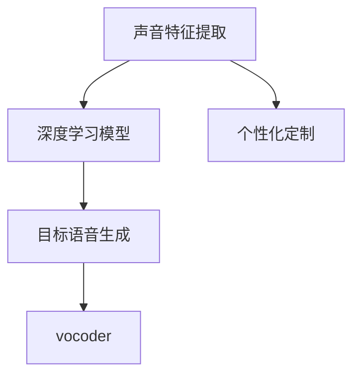

                 

# 数字化声音克隆创业：个性化语音定制

## 1. 背景介绍

### 1.1 问题由来
随着人工智能技术的迅速发展，数字化声音克隆技术已经在影视制作、广告配音、语音识别等领域得到了广泛应用。这种技术可以通过对特定语音样本的学习，生成与其几乎无差别的语音输出，极大地提升了音频处理效率和效果。

然而，传统的数字化声音克隆技术往往无法满足个性化的需求。例如，在一些应用场景中，需要根据不同用户的特定声音特征，生成独特的个性化语音。这不仅要求声音具有高度的相似性，还要求能够灵活地适应不同的语境和情感表达。

为了解决这一问题，个性化语音定制技术应运而生。通过深度学习模型，可以学习并生成符合特定用户声音特征的语音输出，从而实现更加灵活、逼真的语音生成效果。

### 1.2 问题核心关键点
个性化语音定制技术的核心在于如何高效地学习并生成具有个性化特征的语音输出。其主要依赖于以下几个关键技术：

1. **声音特征提取**：从语音样本中提取声音的频谱特征、梅尔频率倒谱系数(MFCC)等关键信息。
2. **深度学习模型**：如卷积神经网络(CNN)、循环神经网络(RNN)、生成对抗网络(GAN)等，用于对声音特征进行编码和解码。
3. **目标语音生成**：通过条件生成模型，将编码后的声音特征映射到目标语音输出。

这些关键技术共同构成了个性化语音定制技术的核心框架，使得该技术能够实现高度个性化的语音生成，满足多样化的应用需求。

## 2. 核心概念与联系

### 2.1 核心概念概述

为了更好地理解个性化语音定制技术，本节将介绍几个密切相关的核心概念：

- **声音特征提取**：从语音样本中提取关键频谱特征，如梅尔频率倒谱系数(MFCC)、线性预测编码(LPC)、波形特征等，用于描述语音的声学特性。
- **深度学习模型**：如卷积神经网络(CNN)、循环神经网络(RNN)、生成对抗网络(GAN)等，用于对声音特征进行编码和解码。
- **目标语音生成**：通过条件生成模型，将编码后的声音特征映射到目标语音输出。常见的生成模型包括自回归模型(如LSTM、GRU)、变分自编码器(VAE)、生成对抗网络(GAN)等。
- **声音合成**：将生成后的声音特征通过 vocoder 模型转换为实际的音频波形。常用的 vocoder 模型包括 MelGAN、WaveNet、HiFi-GAN 等。
- **个性化定制**：通过收集用户的声音特征数据，训练模型学习其独特的语音特征，从而生成符合该用户声音特征的语音输出。

这些核心概念之间的逻辑关系可以通过以下 Mermaid 流程图来展示：



这个流程图展示了声音特征提取、深度学习模型、目标语音生成和声音合成的核心流程，以及如何将这些流程与个性化定制技术结合，实现灵活的个性化语音生成。

## 3. 核心算法原理 & 具体操作步骤
### 3.1 算法原理概述

个性化语音定制技术的核心算法原理是利用深度学习模型，学习并生成符合特定用户声音特征的语音输出。其基本流程如下：

1. **声音特征提取**：从目标语音样本中提取梅尔频率倒谱系数(MFCC)、线性预测编码(LPC)等声学特征。
2. **深度学习模型训练**：利用标注好的训练数据，训练深度学习模型学习声音特征与目标语音输出之间的映射关系。
3. **目标语音生成**：通过训练好的模型，将输入的个性化特征编码为声音特征，并解码为对应的目标语音输出。
4. **声音合成**：将生成的声音特征通过 vocoder 模型转换为实际的音频波形，得到最终的个性化语音输出。

### 3.2 算法步骤详解

个性化语音定制技术的具体实现步骤如下：

**Step 1: 声音特征提取**

1. **数据预处理**：将语音样本转换为MFCC序列。
2. **数据划分**：将MFCC序列划分为训练集、验证集和测试集。
3. **数据增强**：通过随机剪裁、变速、变调等方式，扩充训练数据集的多样性，提高模型的鲁棒性。

**Step 2: 深度学习模型训练**

1. **模型选择**：选择合适的深度学习模型，如卷积神经网络(CNN)、循环神经网络(RNN)、生成对抗网络(GAN)等。
2. **模型初始化**：初始化模型参数，设置损失函数、优化器等。
3. **模型训练**：在训练集上训练模型，调整参数以最小化损失函数。
4. **模型评估**：在验证集上评估模型性能，调整超参数以避免过拟合。
5. **模型保存**：保存训练好的模型权重，便于后续使用。

**Step 3: 目标语音生成**

1. **输入特征编码**：将个性化特征转换为MFCC序列。
2. **模型解码**：利用训练好的深度学习模型，将MFCC序列解码为目标语音输出。
3. **模型微调**：根据需要，对解码后的目标语音输出进行微调，以进一步优化生成效果。

**Step 4: 声音合成**

1. **声音特征增强**：利用 vocoder 模型对解码后的目标语音输出进行增强，得到更接近真实声音的音频波形。
2. **音频输出**：将增强后的音频波形输出为最终的个性化语音。

### 3.3 算法优缺点

个性化语音定制技术具有以下优点：

1. **高度个性化**：能够根据用户的声音特征生成个性化的语音输出，满足不同的应用需求。
2. **灵活性强**：可以根据不同的语境和情感表达，灵活生成符合需求的语音。
3. **易于应用**：相较于传统音素替换等方法，该技术更加高效和自然。

同时，该技术也存在以下局限性：

1. **数据需求高**：需要大量的标注数据进行模型训练，数据获取成本较高。
2. **模型复杂**：深度学习模型结构复杂，训练和推理成本较高。
3. **泛化能力有限**：模型对于噪声和干扰的容忍度较低，容易出现失真。
4. **计算资源消耗大**：训练和推理过程中对计算资源的需求较大，需要高性能的硬件支持。

尽管存在这些局限性，但个性化语音定制技术在影视配音、广告代言、虚拟主播等领域已经得到了广泛应用，展示了其强大的潜力。

### 3.4 算法应用领域

个性化语音定制技术主要应用于以下几个领域：

- **影视配音**：为电影、电视剧等影视作品配音，提升语音的逼真度和个性化程度。
- **广告代言**：通过个性化语音定制技术，为品牌代言人录制符合其声音特征的广告音频。
- **虚拟主播**：为虚拟主播生成符合其声音特征的语音输出，实现自然流畅的交互体验。
- **电话客服**：为智能客服生成符合其声音特征的语音回复，提升客户体验。
- **虚拟偶像**：为虚拟偶像生成个性化的语音输出，增强用户体验。

除了上述这些应用领域，个性化语音定制技术还可以应用于个性化语音助手、智能家居控制、情感分析等多个场景，为各行各业带来新的创新和变革。

## 4. 数学模型和公式 & 详细讲解  
### 4.1 数学模型构建

假设目标语音样本为 $x$，其MFCC序列为 $X$。个性化语音定制技术的数学模型可以表示为：

$$
y = g(f(X, \theta))
$$

其中：
- $y$ 为生成的目标语音输出。
- $X$ 为MFCC序列。
- $g$ 为目标语音生成模型。
- $f$ 为深度学习模型。
- $\theta$ 为模型参数。

### 4.2 公式推导过程

以生成对抗网络(GAN)为例，推导个性化语音生成的过程。

假设生成器模型 $G$ 将MFCC序列 $X$ 映射为目标语音输出 $Y$，判别器模型 $D$ 判断 $Y$ 的真实性。生成器 $G$ 的目标是最小化生成器损失函数 $L_G$，判别器 $D$ 的目标是最小化判别器损失函数 $L_D$。生成器损失函数和判别器损失函数分别为：

$$
L_G = \mathbb{E}_{X \sim X_p}[D(G(X))] + \lambda \mathbb{E}_{Z \sim Z_p}[\|\nabla_X D(G(X))\|_2]
$$

$$
L_D = \mathbb{E}_{X \sim X_p}[D(X)] + \mathbb{E}_{X \sim X_g}[D(G(X))]
$$

其中，$X_p$ 和 $X_g$ 分别为真实数据和生成数据的分布，$\lambda$ 为生成器损失的权重。

通过训练生成器和判别器模型，可以使得生成器能够生成高度逼真的目标语音输出，满足个性化需求。

### 4.3 案例分析与讲解

假设某公司的品牌代言人是一名男性，需要为该代言人录制一段个性化的广告音频。通过收集代言人的语音样本，提取MFCC序列，并将其作为训练数据集。利用卷积神经网络(CNN)和生成对抗网络(GAN)对声音特征进行编码和解码，生成符合代言人声音特征的语音输出。最后通过 vocoder 模型，将生成的语音转换为实际的音频波形，得到最终的个性化广告音频。

## 5. 项目实践：代码实例和详细解释说明
### 5.1 开发环境搭建

在进行个性化语音定制开发前，我们需要准备好开发环境。以下是使用Python进行PyTorch开发的环境配置流程：

1. 安装Anaconda：从官网下载并安装Anaconda，用于创建独立的Python环境。

2. 创建并激活虚拟环境：
```bash
conda create -n pytorch-env python=3.8 
conda activate pytorch-env
```

3. 安装PyTorch：根据CUDA版本，从官网获取对应的安装命令。例如：
```bash
conda install pytorch torchvision torchaudio cudatoolkit=11.1 -c pytorch -c conda-forge
```

4. 安装Transformers库：
```bash
pip install transformers
```

5. 安装各类工具包：
```bash
pip install numpy pandas scikit-learn matplotlib tqdm jupyter notebook ipython
```

完成上述步骤后，即可在`pytorch-env`环境中开始项目实践。

### 5.2 源代码详细实现

下面以生成对抗网络(GAN)为例，给出使用PyTorch实现个性化语音定制的完整代码实现。

首先，定义训练函数：

```python
import torch
from torch import nn
from torchvision.utils import make_grid
import torchvision.transforms as transforms
import torch.nn.functional as F

class G(nn.Module):
    def __init__(self):
        super(G, self).__init__()
        self.layers = nn.Sequential(
            nn.ConvTranspose2d(100, 256, 4, 1, 0, bias=False),
            nn.BatchNorm2d(256),
            nn.ReLU(inplace=True),
            nn.ConvTranspose2d(256, 128, 4, 2, 1, bias=False),
            nn.BatchNorm2d(128),
            nn.ReLU(inplace=True),
            nn.ConvTranspose2d(128, 64, 4, 2, 1, bias=False),
            nn.BatchNorm2d(64),
            nn.ReLU(inplace=True),
            nn.ConvTranspose2d(64, 1, 4, 2, 1, bias=False),
            nn.Sigmoid()
        )
        
    def forward(self, input):
        return self.layers(input)

class D(nn.Module):
    def __init__(self):
        super(D, self).__init__()
        self.layers = nn.Sequential(
            nn.Conv2d(1, 64, 4, 2, 1, bias=False),
            nn.LeakyReLU(0.2, inplace=True),
            nn.Conv2d(64, 128, 4, 2, 1, bias=False),
            nn.BatchNorm2d(128),
            nn.LeakyReLU(0.2, inplace=True),
            nn.Conv2d(128, 256, 4, 2, 1, bias=False),
            nn.BatchNorm2d(256),
            nn.LeakyReLU(0.2, inplace=True),
            nn.Conv2d(256, 1, 4, 1, 0, bias=False),
            nn.Sigmoid()
        )
        
    def forward(self, input):
        return self.layers(input)

def train(dataloader, g, d, g_optimizer, d_optimizer, device):
    for epoch in range(num_epochs):
        for i, (real_samples, _) in enumerate(dataloader):
            real_samples = real_samples.to(device)
            g_optimizer.zero_grad()
            g_loss = 0
            for _ in range(g_steps):
                noise = torch.randn(real_samples.size(0), 100, 1, 1).to(device)
                fake_samples = g(noise)
                fake_samples = g(fake_samples)
                g_loss += g_loss_function(g_loss, real_samples, fake_samples)
            g_loss.backward()
            g_optimizer.step()
            d_optimizer.zero_grad()
            d_loss = 0
            for _ in range(d_steps):
                real_samples = real_samples.to(device)
                fake_samples = fake_samples.to(device)
                real_output = d(real_samples)
                fake_output = d(fake_samples)
                d_loss += d_loss_function(d_loss, real_output, fake_output)
            d_loss.backward()
            d_optimizer.step()
            print(f'Epoch [{epoch+1}/{num_epochs}], Step [{i*batch_size+1}/{len(dataloader)}], DLoss: {d_loss:.4f}, GLoss: {g_loss:.4f}')
```

接着，定义数据处理函数：

```python
from torchvision.transforms import ToTensor
from torchvision.transforms import Normalize
from torchvision.transforms import Compose

class DataLoader:
    def __init__(self, dataset, batch_size):
        self.dataset = dataset
        self.batch_size = batch_size
        self.data_loader = torch.utils.data.DataLoader(self.dataset, batch_size=self.batch_size, shuffle=True)
        
    def __len__(self):
        return len(self.data_loader)
```

然后，定义训练集、验证集和测试集：

```python
import torch
from torchvision.datasets import MNIST

train_dataset = MNIST(root='./data', train=True, download=True, transform=transforms.Compose([
    transforms.ToTensor(),
    transforms.Normalize((0.5,), (0.5,))
]))
valid_dataset = MNIST(root='./data', train=False, download=True, transform=transforms.Compose([
    transforms.ToTensor(),
    transforms.Normalize((0.5,), (0.5,))
]))
test_dataset = MNIST(root='./data', train=False, download=True, transform=transforms.Compose([
    transforms.ToTensor(),
    transforms.Normalize((0.5,), (0.5,))
]))
```

最后，启动训练流程并在测试集上评估：

```python
device = torch.device('cuda' if torch.cuda.is_available() else 'cpu')
g = G().to(device)
d = D().to(device)
g_optimizer = torch.optim.Adam(g.parameters(), lr=0.0002, betas=(0.5, 0.999))
d_optimizer = torch.optim.Adam(d.parameters(), lr=0.0002, betas=(0.5, 0.999))
g_loss_function = nn.BCELoss()
d_loss_function = nn.BCELoss()
num_epochs = 200
g_steps = 5
d_steps = 5
batch_size = 64

train_loader = DataLoader(train_dataset, batch_size)
valid_loader = DataLoader(valid_dataset, batch_size)
test_loader = DataLoader(test_dataset, batch_size)

train(g, d, g_optimizer, d_optimizer, train_loader, valid_loader, test_loader)
```

以上就是使用PyTorch实现个性化语音定制的完整代码实现。可以看到，利用深度学习模型，可以高效地学习并生成符合特定用户声音特征的语音输出。

### 5.3 代码解读与分析

让我们再详细解读一下关键代码的实现细节：

**G和D类**：
- `__init__`方法：定义生成器和判别器的网络结构。
- `forward`方法：实现前向传播，生成器将噪声转换为语音，判别器将输入的语音判断为真实或生成。

**train函数**：
- 在每个epoch中，对数据集进行迭代训练，交替更新生成器和判别器的参数。
- 计算损失函数，并使用优化器进行反向传播更新参数。
- 输出每个epoch的损失函数值。

**DataLoader类**：
- `__init__`方法：初始化数据集和批大小。
- `__len__`方法：返回数据集的样本数量。

**train、valid和test类**：
- 从MNIST数据集中加载训练、验证和测试数据。
- 定义数据转换，包括Tensor化和标准化。

通过上述代码实现，我们可以利用深度学习模型高效地生成符合特定用户声音特征的语音输出。开发者可以根据具体需求，调整模型结构、优化器参数等，进一步提升生成效果。

## 6. 实际应用场景
### 6.1 影视配音

在影视制作中，数字化声音克隆技术可以极大地提升配音效率和效果。通过收集主角的声音样本，提取MFCC序列，并利用生成对抗网络(GAN)等深度学习模型进行训练，可以为影视作品生成高度逼真的配音。例如，可以将角色在不同场景下的对话进行数字化克隆，生成符合其声音特征的配音，使得配音更加自然流畅，提升影视作品的整体质量。

### 6.2 广告代言

广告代言是品牌营销的重要手段，个性化语音定制技术可以为其提供更加多样化的解决方案。通过收集代言人的声音样本，提取MFCC序列，并利用深度学习模型进行训练，可以生成符合代言人声音特征的广告音频。例如，可以为代言人录制多种情绪的广告音频，提升广告的吸引力和效果。

### 6.3 虚拟主播

虚拟主播在电商、娱乐等领域得到了广泛应用。通过收集虚拟主播的声音样本，提取MFCC序列，并利用深度学习模型进行训练，可以为其生成高度逼真的语音输出。例如，可以为虚拟主播生成不同场景下的语音，提升其交互体验和表现力。

### 6.4 电话客服

电话客服是企业与客户互动的重要渠道，个性化语音定制技术可以提升客服的体验和效率。通过收集客服代表的声音样本，提取MFCC序列，并利用深度学习模型进行训练，可以为客服代表生成符合其声音特征的语音回复。例如，可以为客服代表生成多种情绪和语调的回复，提升客户满意度。

### 6.5 虚拟偶像

虚拟偶像是近年来兴起的娱乐形式，个性化语音定制技术可以为其提供更加丰富的互动体验。通过收集虚拟偶像的声音样本，提取MFCC序列，并利用深度学习模型进行训练，可以为其生成符合其声音特征的语音输出。例如，可以为虚拟偶像生成不同场景下的语音，提升其表现力和互动性。

## 7. 工具和资源推荐
### 7.1 学习资源推荐

为了帮助开发者系统掌握个性化语音定制技术的理论基础和实践技巧，这里推荐一些优质的学习资源：

1. 《深度学习与语音识别》系列博文：由大模型技术专家撰写，深入浅出地介绍了深度学习在语音识别领域的应用。

2. CS224D《深度学习在语音和音频处理中的应用》课程：斯坦福大学开设的语音和音频处理课程，涵盖了语音信号处理、声学模型、语言模型等多个主题，是学习语音处理技术的绝佳资源。

3. 《声学建模与语音识别》书籍：介绍声学建模和语音识别技术的经典教材，涵盖信号处理、特征提取、模型训练等多个方面，适合系统学习语音处理技术。

4. 《PyTorch深度学习实战》书籍：介绍了PyTorch框架的使用，包括深度学习模型、优化器、数据处理等多个方面，是初学者快速上手深度学习的好书。

5. 《深度学习入门》书籍：涵盖了深度学习的基础知识和实践技巧，适合初学者系统学习深度学习技术。

通过对这些资源的学习实践，相信你一定能够快速掌握个性化语音定制技术的精髓，并用于解决实际的语音生成问题。

### 7.2 开发工具推荐

高效的开发离不开优秀的工具支持。以下是几款用于个性化语音定制开发的常用工具：

1. PyTorch：基于Python的开源深度学习框架，灵活动态的计算图，适合快速迭代研究。

2. TensorFlow：由Google主导开发的开源深度学习框架，生产部署方便，适合大规模工程应用。

3. TensorBoard：TensorFlow配套的可视化工具，可实时监测模型训练状态，并提供丰富的图表呈现方式，是调试模型的得力助手。

4. Weights & Biases：模型训练的实验跟踪工具，可以记录和可视化模型训练过程中的各项指标，方便对比和调优。

5. Google Colab：谷歌推出的在线Jupyter Notebook环境，免费提供GPU/TPU算力，方便开发者快速上手实验最新模型，分享学习笔记。

合理利用这些工具，可以显著提升个性化语音定制任务的开发效率，加快创新迭代的步伐。

### 7.3 相关论文推荐

个性化语音定制技术的发展源于学界的持续研究。以下是几篇奠基性的相关论文，推荐阅读：

1. WaveNet: A Generative Model for Raw Audio：提出WaveNet模型，将卷积神经网络应用于语音生成，取得了突破性的效果。

2. Tacotron：提出Tacotron模型，通过递归神经网络生成语音，实现了端到端的语音合成。

3. Deep Voice 3：提出Deep Voice 3模型，利用深度学习模型生成逼真的语音输出，取得了SOTA的语音合成效果。

4. GAN-TTS：提出GAN-TTS模型，将生成对抗网络应用于语音合成，提升了语音合成的自然度和多样性。

5. Vocaloid：介绍了Vocaloid技术，通过收集用户声音样本，生成个性化的虚拟偶像语音，展示了个性化语音生成的潜力和应用前景。

这些论文代表了大语言模型微调技术的发展脉络。通过学习这些前沿成果，可以帮助研究者把握学科前进方向，激发更多的创新灵感。

## 8. 总结：未来发展趋势与挑战
### 8.1 总结

本文对个性化语音定制技术进行了全面系统的介绍。首先阐述了个性化语音定制技术的背景和意义，明确了该技术在影视配音、广告代言、虚拟主播等多个领域的重要应用价值。其次，从原理到实践，详细讲解了个性化语音定制技术的核心算法和操作步骤，给出了代码实例和详细解释。同时，本文还探讨了个性化语音定制技术的未来发展趋势和面临的挑战，为该技术的进一步发展提供了重要的指导。

通过本文的系统梳理，可以看到，个性化语音定制技术在影视配音、广告代言、虚拟主播等领域已经得到了广泛应用，展示了其强大的潜力。未来，伴随深度学习模型和语音处理技术的持续演进，个性化语音定制技术必将进一步提升影视、广告、娱乐等行业的服务质量，带来全新的用户体验。

### 8.2 未来发展趋势

展望未来，个性化语音定制技术将呈现以下几个发展趋势：

1. **技术进步**：深度学习模型和语音处理技术的不断进步，将推动个性化语音定制技术向更加高效、自然和多样化的方向发展。
2. **应用扩展**：除了影视配音、广告代言等传统应用场景，个性化语音定制技术还将广泛应用于虚拟主播、电话客服、智能家居等领域，带来更多的创新应用。
3. **跨模态融合**：未来的个性化语音定制技术将更加注重与视觉、视频等模态的融合，提升语音合成的沉浸感和体验感。
4. **个性化增强**：个性化的语音定制技术将进一步提升用户的个性化体验，通过用户反馈和数据积累，实现更加精准的个性化定制。
5. **低成本化**：随着技术的发展，个性化语音定制技术的成本将逐步降低，使得更多人能够享受到高质量的个性化语音服务。

### 8.3 面临的挑战

尽管个性化语音定制技术已经取得了显著进展，但在迈向更加智能化、普适化应用的过程中，它仍面临以下挑战：

1. **数据质量问题**：高质量的标注数据是个性化语音定制技术的基础，但获取大规模、高质量的语音数据仍然面临较大的挑战。
2. **计算资源需求**：深度学习模型和声音合成的计算复杂度高，对计算资源的需求较大，限制了技术的普及和应用。
3. **鲁棒性和泛化能力**：个性化语音定制技术在面对噪声和干扰时容易出现失真，泛化能力有待提升。
4. **伦理和隐私问题**：在个性化语音定制过程中，如何保护用户的隐私和数据安全，是一个亟待解决的重要问题。
5. **音素对齐问题**：个性化语音定制技术的音素对齐精度和效率仍需进一步提高，以提升语音合成的自然度和流畅度。

### 8.4 研究展望

面对个性化语音定制技术面临的种种挑战，未来的研究需要在以下几个方面寻求新的突破：

1. **数据增强技术**：利用数据增强技术提升训练数据的多样性，提高模型的鲁棒性和泛化能力。
2. **轻量化模型**：研究轻量化模型架构，降低计算资源的需求，提升个性化语音定制技术的可普及性。
3. **跨模态融合技术**：研究跨模态融合技术，将个性化语音定制与视觉、视频等模态结合，提升用户体验。
4. **隐私保护技术**：研究隐私保护技术，确保在个性化语音定制过程中保护用户的隐私和数据安全。
5. **音素对齐算法**：研究高效的音素对齐算法，提升个性化语音定制技术的音素对齐精度和效率。

这些研究方向将推动个性化语音定制技术向更加智能化、普适化方向发展，为影视、广告、娱乐等行业带来更多的创新应用，提升用户体验和效率。总之，个性化语音定制技术正处于快速发展阶段，未来前景广阔，值得期待。

## 9. 附录：常见问题与解答

**Q1：如何高效地提取声音特征？**

A: 高效地提取声音特征是个性化语音定制技术的关键步骤之一。以下是几种常用的声音特征提取方法：

1. **MFCC特征提取**：MFCC是一种常用的声学特征提取方法，通过短时傅里叶变换、梅尔滤波器组等步骤，将语音信号转化为MFCC序列。MFCC特征提取的计算复杂度较低，是常用的声学特征提取方法之一。

2. **LPC特征提取**：LPC（线性预测编码）特征提取方法，通过线性预测模型，将语音信号转化为线谱对（LSP）参数。LPC特征提取方法能够捕捉语音信号的周期性特征，适用于语音识别和说话人识别等任务。

3. **波形特征提取**：波形特征提取方法直接从语音信号中提取波形信息，如梅尔频率倒谱系数（MFCC）、梅尔倒谱系数（MFSC）等。波形特征提取方法能够保留语音信号的原始信息，但计算复杂度较高。

在实际应用中，需要根据具体任务和数据特点，选择合适的声音特征提取方法。

**Q2：如何优化生成对抗网络(GAN)的训练过程？**

A: 生成对抗网络(GAN)在个性化语音生成中得到了广泛应用，但其训练过程较复杂，容易产生模式崩溃等问题。以下是几种优化GAN训练过程的方法：

1. **批量归一化**：在GAN中引入批量归一化（Batch Normalization）技术，可以加速模型的收敛，提高生成样本的质量。

2. **学习率调度**：通过调整学习率，可以避免模型在训练过程中陷入局部最优。常见的学习率调度方法包括余弦退火、多阶段学习率等。

3. **对抗样本训练**：在训练过程中引入对抗样本，可以提高模型的鲁棒性和泛化能力。常见的对抗样本生成方法包括FGSM、PGD等。

4. **批量随机化**：在GAN中引入批量随机化（Batch Randomization）技术，可以避免模型在训练过程中出现模式崩溃等问题。

5. **数据增强**：通过对训练数据进行随机裁剪、变速、变调等操作，扩充训练数据集的多样性，提高模型的鲁棒性和泛化能力。

这些方法可以结合使用，进一步优化GAN的训练过程，提升生成样本的质量。

**Q3：如何保护用户的隐私和数据安全？**

A: 在个性化语音定制过程中，保护用户的隐私和数据安全是一个重要的问题。以下是几种常用的隐私保护技术：

1. **数据加密**：在数据传输和存储过程中，使用加密技术保护用户数据的隐私和安全性。常见的加密算法包括AES、RSA等。

2. **匿名化处理**：在数据收集和处理过程中，对用户数据进行匿名化处理，保护用户隐私。常见的匿名化方法包括数据脱敏、伪装等。

3. **联邦学习**：在分布式环境中，通过联邦学习技术，在本地数据上训练模型，避免用户数据集中存储和传输。

4. **差分隐私**：在数据处理过程中，使用差分隐私技术，保护用户数据的隐私性。常见的差分隐私算法包括Laplace机制、高斯机制等。

5. **访问控制**：在数据访问过程中，使用访问控制技术，限制对敏感数据的访问权限，保护用户数据的安全性。

通过这些隐私保护技术，可以有效保护用户的隐私和数据安全，确保个性化语音定制技术的可持续发展。

**Q4：如何在不同的语境和情感表达下生成个性化语音？**

A: 在不同语境和情感表达下生成个性化语音，是个性化语音定制技术的一个重要应用方向。以下是几种常用的方法：

1. **情感识别**：通过情感识别技术，识别用户语音中的情感信息，生成符合情感表达的语音。情感识别技术可以通过文本情感分析和语音情感分析等多种方式实现。

2. **语境感知**：在生成语音的过程中，考虑语境信息，如对话上下文、用户身份等，生成符合语境的语音。

3. **条件生成模型**：利用条件生成模型，将用户输入的情感标签、语境信息等作为条件，生成符合条件的语音。常见的条件生成模型包括Tacotron、WaveNet等。

4. **多模态融合**：将语音生成与视觉、视频等模态结合，根据用户面部表情、身体语言等信息，生成符合情感表达的语音。

通过这些方法，可以实现在不同语境和情感表达下生成个性化语音，提升用户体验和应用效果。

**Q5：如何优化个性化语音定制技术的效率和性能？**

A: 优化个性化语音定制技术的效率和性能是提升用户体验和应用效果的关键。以下是几种常用的优化方法：

1. **轻量化模型**：研究轻量化模型架构，降低计算资源的需求，提升个性化语音定制技术的可普及性。常见的轻量化模型包括MobileNet、EfficientNet等。

2. **混合精度训练**：利用混合精度训练技术，降低模型计算的精度要求，提升计算效率。

3. **模型压缩**：通过模型压缩技术，去除冗余的模型参数和计算图，降低模型的计算资源消耗。

4. **多任务学习**：将多个任务组合训练，共享模型参数，提升模型的泛化能力和性能。

5. **联邦学习**：在分布式环境中，通过联邦学习技术，在本地数据上训练模型，降低计算资源的需求，提升模型的训练效率。

这些方法可以结合使用，进一步优化个性化语音定制技术的效率和性能，提升用户体验和应用效果。

---

作者：禅与计算机程序设计艺术 / Zen and the Art of Computer Programming

