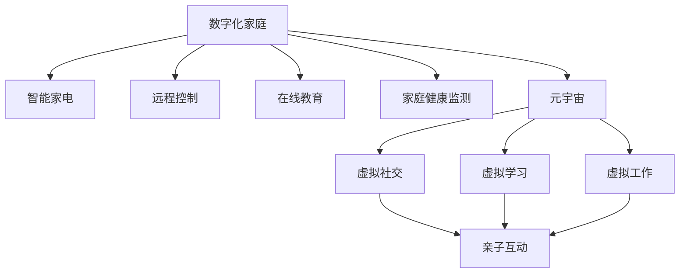

                 

# 数字化家庭：元宇宙时代的亲子关系

## 1. 背景介绍

### 1.1 问题由来
随着科技的飞速发展，尤其是移动互联网和人工智能的普及，家庭环境正逐步数字化、智能化。尤其在元宇宙时代，家庭数字化趋势更加明显。然而，这也在某种程度上对家庭亲子关系产生了深刻影响。如何有效利用数字化技术，维护和加强亲子关系，成为我们亟待探讨的课题。

### 1.2 问题核心关键点
家庭数字化转型的主要驱动因素包括智能家居设备的普及、互联网教育的推广、远程办公的常态化等。数字化技术带来的便利和挑战并存，如何处理这些变化，提升亲子关系，是本文关注的重点。

### 1.3 问题研究意义
本文探讨数字技术在家庭中的应用，特别是其对亲子关系的影响，旨在为数字化家庭建设提供策略建议，帮助家庭在利用科技的同时，更好地维护和发展亲子关系。

## 2. 核心概念与联系

### 2.1 核心概念概述

1. **数字化家庭（Digital Home）**：
   - **概念**：利用互联网、人工智能等现代科技，将家庭生活各个方面进行数字化、智能化的改造。
   - **特点**：包括智能家电、远程控制、在线教育、家庭健康监测等。

2. **元宇宙（Metaverse）**：
   - **概念**：一个虚拟的、三维、沉浸式的数字世界，人们可以在其中进行社交、娱乐、工作等各种活动。
   - **特点**：提供无限可能，改变人们的互动方式和生活体验。

3. **亲子关系（Parent-Child Relationship）**：
   - **概念**：父母与子女之间的情感、互动关系。
   - **特点**：直接影响儿童的成长和发展，是家庭幸福的重要基石。

4. **家庭数字化（Digitalization of Family）**：
   - **概念**：在家庭中应用数字化技术，提升生活便利性和家庭治理效率。
   - **特点**：旨在实现家庭生活的智能化、自动化。

### 2.2 核心概念原理和架构的 Mermaid 流程图



此图展示了数字化家庭中主要概念的联系。智能家电、远程控制、在线教育、家庭健康监测等元素都是数字化家庭的关键组成部分。元宇宙作为数字技术的新形态，对家庭数字化的发展具有重要推动作用。虚拟社交、虚拟学习、虚拟工作等新形式，都在重塑亲子关系。

## 3. 核心算法原理 & 具体操作步骤

### 3.1 算法原理概述

在元宇宙时代，亲子关系的数字化可以通过虚拟社交、虚拟学习、智能家居等多种途径实现。算法原理主要围绕虚拟环境构建、情感识别、交互设计等方面展开。

### 3.2 算法步骤详解

1. **虚拟环境构建**：
   - **步骤**：
     - **硬件配置**：选择适合家庭的VR设备和智能设备，如头戴设备、手柄等。
     - **软件配置**：安装和使用虚拟社交、学习、工作等应用软件。
   - **示例**：
     - 家庭可以通过VR设备进入元宇宙，参与虚拟社交、学习活动，如参加虚拟学校、虚拟游乐园等。
     - 在虚拟环境中，家庭成员可以通过语音、文字等多种方式进行交流。

2. **情感识别**：
   - **步骤**：
     - **数据采集**：通过摄像头、麦克风等设备采集家庭成员的表情、声音等数据。
     - **算法处理**：使用深度学习、计算机视觉等算法进行情感识别，判断家庭成员的情绪状态。
   - **示例**：
     - 在虚拟社交或学习场景中，系统可以通过摄像头识别家庭成员的表情变化，判断其情绪是否快乐、沮丧等。
     - 系统可以给出相应的反馈，如播放愉悦的音乐、提供安抚的话语等。

3. **交互设计**：
   - **步骤**：
     - **界面设计**：设计友好的用户界面，便于家庭成员进行操作。
     - **交互逻辑**：根据家庭成员的行为和反馈，动态调整交互内容。
   - **示例**：
     - 在虚拟学习场景中，系统可以动态调整教学内容，如通过表情变化调整讲解方式。
     - 在虚拟工作场景中，系统可以根据家庭成员的工作状态，调整工作任务和休息时间。

### 3.3 算法优缺点

**优点**：
- **便利性**：数字化技术极大地提升了家庭成员的生活便利性，使互动更加方便。
- **互动性**：通过虚拟环境，家庭成员可以进行跨时空的互动，弥补物理距离带来的隔阂。
- **个性化**：利用大数据和人工智能，可以根据家庭成员的需求和行为，提供个性化服务。

**缺点**：
- **依赖性**：过度依赖数字设备可能削弱家庭成员之间的实际交流。
- **隐私问题**：数据采集和处理可能涉及隐私问题，需要严格遵守隐私保护法规。
- **依赖网络**：虚拟环境和智能设备的正常运行需要稳定的网络连接，可能存在中断风险。

### 3.4 算法应用领域

在家庭数字化和元宇宙时代，数字技术和亲子关系的应用领域主要包括以下几个方面：

1. **智能家居**：
   - **应用**：智能音箱、智能灯光、智能温控等，通过语音助手进行控制。
   - **示例**：家庭成员可以通过语音助手进行远程控制家中的设备，如开启灯光、调节温度等。

2. **远程教育**：
   - **应用**：在线课程、虚拟课堂、互动教学等。
   - **示例**：家长可以在虚拟课堂中观察孩子的学习状态，老师可以通过互动方式进行教学。

3. **健康监测**：
   - **应用**：智能手环、智能手表、健康监测软件等。
   - **示例**：通过智能手环实时监测家庭成员的健康数据，及时发现异常情况，进行干预。

4. **虚拟娱乐**：
   - **应用**：虚拟游戏、虚拟旅行、虚拟运动等。
   - **示例**：家庭成员可以在虚拟世界中一起参与游戏、旅行，增强互动和体验。

5. **情感辅导**：
   - **应用**：情感分析、情感识别、虚拟心理咨询等。
   - **示例**：系统可以根据家庭成员的情绪变化，提供情感支持和心理咨询，缓解心理压力。

## 4. 数学模型和公式 & 详细讲解 & 举例说明

### 4.1 数学模型构建

假设有一个虚拟学习环境，系统通过摄像头和麦克风采集家庭成员的表情和声音数据。定义表情和声音的数据集为$D=\{(x_i,y_i)\}_{i=1}^N$，其中$x_i$表示第$i$个样本的面部表情图像，$y_i$表示对应的情绪标签，可以是快乐、沮丧、愤怒等。

### 4.2 公式推导过程

假设系统采用卷积神经网络（CNN）进行表情识别。网络结构包括卷积层、池化层、全连接层等。输入为$x_i$，输出为情绪标签$y_i$。系统的目标是最小化交叉熵损失函数：

$$
\mathcal{L} = -\frac{1}{N}\sum_{i=1}^N(y_i\log \hat{y_i} + (1-y_i)\log(1-\hat{y_i}))
$$

其中$\hat{y_i}$为网络输出的情绪预测值。

### 4.3 案例分析与讲解

以情感识别为例，假设系统已经训练好了一个CNN模型，用于识别家庭成员的表情情绪。该模型的输出层包含3个神经元，分别对应快乐、沮丧、愤怒3种情绪。系统可以使用如下代码实现表情识别：

```python
import torch
import torch.nn as nn
import torchvision.transforms as transforms
from torch.utils.data import DataLoader

class EmotionRecognition(nn.Module):
    def __init__(self):
        super(EmotionRecognition, self).__init__()
        self.cnn = nn.Sequential(
            nn.Conv2d(3, 32, 3, 1, 1),
            nn.ReLU(),
            nn.MaxPool2d(2, 2),
            nn.Conv2d(32, 64, 3, 1, 1),
            nn.ReLU(),
            nn.MaxPool2d(2, 2),
            nn.Conv2d(64, 128, 3, 1, 1),
            nn.ReLU(),
            nn.MaxPool2d(2, 2),
            nn.Flatten(),
            nn.Linear(128*28*28, 256),
            nn.ReLU(),
            nn.Linear(256, 3)
        )

    def forward(self, x):
        x = self.cnn(x)
        return x

# 假设已经训练好了模型
model = EmotionRecognition()
model.eval()

# 假设已经加载了数据集
data_loader = DataLoader(dataset, batch_size=32, shuffle=False)

for images, labels in data_loader:
    images = images.to(device)
    labels = labels.to(device)
    with torch.no_grad():
        outputs = model(images)
        loss = nn.CrossEntropyLoss()(outputs, labels)
```

通过以上代码，系统可以对家庭成员的表情图像进行实时识别，输出相应的情绪标签。

## 5. 项目实践：代码实例和详细解释说明

### 5.1 开发环境搭建

1. **硬件配置**：
   - **头戴设备**：选择适合家庭的VR头戴设备，如Oculus Quest 2、HTC Vive等。
   - **手柄设备**：选择适合的手柄设备，如Oculus Touch、HTC Vive控制器等。
   - **智能家居设备**：选择适合家庭的智能家居设备，如智能音箱、智能灯光、智能温控等。

2. **软件配置**：
   - **操作系统**：确保所有设备能够正常运行Linux、Windows或macOS操作系统。
   - **软件安装**：安装VR软件、智能家居控制软件、虚拟教育软件等。

3. **网络配置**：
   - **网络带宽**：确保家庭网络带宽能够支持VR设备和智能家居设备的运行。
   - **Wi-Fi和有线网络**：安装和配置家庭Wi-Fi和有线网络，确保网络稳定性。

### 5.2 源代码详细实现

以智能家居控制为例，假设家庭有智能音箱和智能灯光。系统可以通过语音助手进行控制。以下是一个简单的Python代码示例：

```python
import pyaudio
import speech_recognition as sr
import requests

# 初始化语音识别器
r = sr.Recognizer()

# 定义智能音箱控制函数
def control_light(light, command):
    # 假设已经连接了智能灯光设备
    url = 'http://192.168.0.100:8080/light/control'
    payload = {'command': command}
    response = requests.post(url, json=payload)
    print(response.text)

# 监听语音输入
with sr.Microphone() as source:
    audio = r.listen(source)
    text = r.recognize_google(audio)

# 处理语音输入并控制灯光
if '开灯' in text:
    control_light(1, '开')
elif '关灯' in text:
    control_light(1, '关')
elif '调亮' in text:
    control_light(1, '调亮')
elif '调暗' in text:
    control_light(1, '调暗')
```

### 5.3 代码解读与分析

**代码功能**：
- **语音识别**：通过麦克风和语音识别库，识别家庭成员的语音指令。
- **智能家居控制**：根据语音指令，通过网络请求控制智能灯光设备的开关、亮度等。

**代码解释**：
- **初始化语音识别器**：使用SpeechRecognition库初始化语音识别器。
- **控制灯光**：定义控制灯光的函数，通过网络请求控制智能灯光设备。
- **监听语音输入**：使用麦克风监听语音输入，识别文本。
- **处理语音指令**：根据语音指令，调用控制灯光函数。

**代码执行结果**：
- **开灯**：通过语音指令“开灯”，控制智能灯光开启。
- **关灯**：通过语音指令“关灯”，控制智能灯光关闭。
- **调亮**：通过语音指令“调亮”，控制智能灯光亮度调高。
- **调暗**：通过语音指令“调暗”，控制智能灯光亮度调低。

## 6. 实际应用场景

### 6.1 智能家居

在智能家居场景中，家庭成员可以通过语音助手控制家中的设备，如开启灯光、调节温度等。这不仅提升了生活的便利性，也增强了家庭成员之间的互动。

### 6.2 远程教育

在远程教育场景中，家庭成员可以通过虚拟课堂参与在线课程，老师可以通过互动方式进行教学。这使得家长可以更好地了解孩子的学习情况，及时提供帮助。

### 6.3 健康监测

在健康监测场景中，家庭成员可以通过智能手环等设备实时监测健康数据，及时发现异常情况，进行干预。这有助于保障家庭成员的健康安全。

### 6.4 虚拟娱乐

在虚拟娱乐场景中，家庭成员可以在虚拟世界中一起参与游戏、旅行，增强互动和体验。这使得家庭成员能够跨越物理距离，保持紧密的联系。

## 7. 工具和资源推荐

### 7.1 学习资源推荐

1. **《数字化家庭：智能家居与物联网》**：一本介绍智能家居技术的书籍，涵盖智能音箱、智能灯光、智能温控等设备的使用和配置。
2. **《元宇宙：虚拟世界的未来》**：一本介绍元宇宙技术的书籍，涵盖虚拟社交、虚拟学习、虚拟工作等内容。
3. **《亲子关系心理学》**：一本介绍亲子关系心理学的书籍，帮助家长更好地理解孩子的心理需求，建立良好的亲子关系。

### 7.2 开发工具推荐

1. **VR开发工具**：如Unity、Unreal Engine等，用于开发虚拟环境。
2. **智能家居控制软件**：如Home Assistant、SmartThings等，用于控制智能家居设备。
3. **语音助手API**：如Alexa技能、Google Assistant API等，用于语音助手开发。

### 7.3 相关论文推荐

1. **《数字化家庭：智能家居的未来》**：探讨智能家居技术的发展趋势和应用前景。
2. **《元宇宙：虚拟现实与未来》**：探讨虚拟现实技术的发展和应用，预测未来趋势。
3. **《虚拟社交：元宇宙中的新型人际互动》**：探讨虚拟社交技术的发展和应用，分析其对人际关系的影响。

## 8. 总结：未来发展趋势与挑战

### 8.1 未来发展趋势

未来，数字化家庭和元宇宙技术将在家庭生活中扮演越来越重要的角色。以下趋势值得关注：

1. **技术普及**：智能家居设备和VR设备将更加普及，提升家庭成员的生活便利性和互动体验。
2. **数据驱动**：通过大数据分析和人工智能，可以更好地了解家庭成员的需求和行为，提供个性化服务。
3. **跨界融合**：数字技术与教育、医疗、娱乐等行业的深度融合，将带来更多的应用场景。

### 8.2 面临的挑战

数字化家庭和元宇宙技术在应用过程中，也面临诸多挑战：

1. **技术成熟度**：智能家居设备和VR设备的成熟度和稳定性有待提升。
2. **隐私和安全**：家庭成员的隐私数据和设备安全需要得到保障。
3. **用户接受度**：部分家庭成员对新技术的接受度较低，需要逐步推广。

### 8.3 研究展望

未来，数字化家庭和元宇宙技术的发展需要更多研究和创新：

1. **技术优化**：优化智能家居设备和VR设备的技术，提高其稳定性和可靠性。
2. **隐私保护**：研究隐私保护技术，保障家庭成员的数据安全。
3. **用户体验**：提升家庭成员的使用体验，增强其对新技术的接受度和信任度。

## 9. 附录：常见问题与解答

**Q1: 智能家居设备如何选择？**

A: 选择智能家居设备时，需要考虑设备的兼容性、易用性和价格等因素。例如，选择智能音箱时需要考虑是否支持语音助手、是否具有网络连接、价格是否合理等。

**Q2: 如何保障家庭成员的隐私安全？**

A: 保障家庭成员隐私安全，需要采取以下措施：
- **数据加密**：使用加密技术保护家庭成员的数据传输和存储。
- **访问控制**：设置设备访问权限，确保只有授权用户才能使用。
- **定期更新**：定期更新智能家居设备和VR设备的固件，保障设备安全。

**Q3: 家庭成员对新技术的接受度较低，如何应对？**

A: 应对家庭成员对新技术接受度较低的情况，可以采取以下措施：
- **宣传教育**：通过宣传和教育，提高家庭成员对新技术的认知。
- **逐步推广**：逐步引入新技术，先从简单的功能开始，逐步增加复杂功能。
- **用户反馈**：及时收集家庭成员的反馈，改进和优化设备功能。

---

作者：禅与计算机程序设计艺术 / Zen and the Art of Computer Programming

