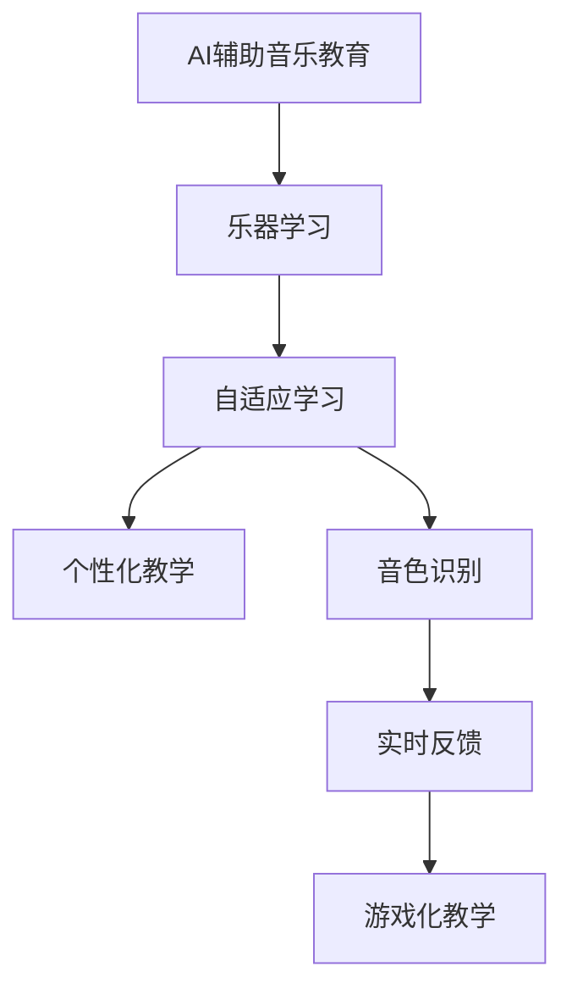

                 

# 数字化音乐教育创业：AI辅助的乐器学习

> 关键词：数字化音乐教育, AI辅助, 乐器学习, 自适应学习, 个性化教学, 音色识别, 实时反馈, 游戏化教学

## 1. 背景介绍

随着科技的迅猛发展，数字化音乐教育已经成为一种新的教育形态。传统的音乐教学往往依赖于现场的师生互动，既耗时又低效。而数字化音乐教育利用互联网、人工智能等技术手段，打破了时间和空间的限制，让音乐学习变得更加便捷和高效。特别是AI辅助的乐器学习，通过个性化的学习路径和实时的反馈系统，显著提升了音乐学习的趣味性和效率。

### 1.1 问题由来

音乐教育是一门需要大量练习和实践的艺术，传统的教学方法往往受限于教师的教学能力和学生的学习能力。不同学习者的起点不同，教师难以对每位学生进行个性化的指导，教学效果难以达到预期。此外，对于各种乐器的音色、演奏技巧等复杂内容，学生往往难以自己摸索和掌握。如何设计一种高效、个性化的音乐教学方法，成为了当前教育技术研究的重要课题。

### 1.2 问题核心关键点

数字化音乐教育的关键在于如何将AI技术与音乐学习相结合，提升教学质量和效率。具体来说，包括以下几个方面：

1. **个性化教学**：利用AI算法分析学生的学习行为和进度，为每位学生制定个性化的学习计划。
2. **音色识别**：通过AI技术识别学生演奏的音色，提供实时反馈和指导。
3. **实时反馈**：AI系统能够实时分析学生的演奏，给出即时的改进建议，帮助学生迅速改进。
4. **游戏化教学**：利用游戏化元素增加学习趣味性，提升学生学习的积极性和主动性。
5. **交互式学习**：通过互动式学习环境，增强学生的参与感和成就感。

### 1.3 问题研究意义

数字化音乐教育及其AI辅助的乐器学习，具有重要的研究意义：

1. **提高音乐教学效率**：通过AI技术的辅助，音乐教学可以更加高效和精准，降低教师的负担。
2. **实现个性化学习**：AI可以针对每位学生的特点和需求，提供个性化的教学方案，提高学习效果。
3. **提升学习兴趣**：游戏化元素和实时反馈机制，可以极大地提升学生的学习兴趣和积极性。
4. **普及音乐教育**：数字化音乐教育打破了时间和空间的限制，为更多人提供了学习音乐的机会。

## 2. 核心概念与联系

### 2.1 核心概念概述

为更好地理解AI辅助的乐器学习，本节将介绍几个密切相关的核心概念：

- **AI辅助音乐教育**：利用人工智能技术，如机器学习、自然语言处理、计算机视觉等，提升音乐教学的效率和质量。
- **乐器学习**：学习者通过乐器进行演奏和练习，逐步掌握音乐技能。
- **自适应学习**：根据学习者的行为和反馈，动态调整教学内容和策略。
- **个性化教学**：针对每个学习者的特点和需求，量身定制学习计划和内容。
- **音色识别**：通过AI技术识别乐器演奏的音色，提供反馈和指导。
- **实时反馈**：及时分析学习者的演奏，给出改进建议和评价。
- **游戏化教学**：将游戏元素引入教学过程，提升学习的趣味性和互动性。

这些核心概念之间的逻辑关系可以通过以下Mermaid流程图来展示：



这个流程图展示了大语言模型的核心概念及其之间的关系：

1. AI辅助音乐教育通过乐器学习，实现个性化和自适应教学。
2. 音色识别和实时反馈为个性化教学提供技术支持。
3. 游戏化教学提升学习趣味性和参与感，进一步增强学习效果。

这些概念共同构成了数字化音乐教育的框架，使得音乐学习更加高效、个性化和有趣。

## 3. 核心算法原理 & 具体操作步骤
### 3.1 算法原理概述

AI辅助的乐器学习，本质上是利用AI技术对学习者的演奏进行分析和指导。其核心思想是：通过传感器采集学习者演奏的数据，利用AI算法分析演奏的音色、节奏、技巧等，生成个性化的反馈和建议，帮助学习者改进演奏。

具体来说，包括以下几个步骤：

1. 通过传感器或录制设备，采集学习者的演奏数据，包括音高、音量、节奏、速度等信息。
2. 利用AI算法，对采集的数据进行分析，识别出演奏中的问题和不足。
3. 根据分析结果，生成个性化的反馈和建议，帮助学习者改进演奏。
4. 通过实时反馈系统，将反馈信息展示给学习者，并提供改进的指导。
5. 游戏化元素和互动式教学，提升学习的趣味性和互动性。

### 3.2 算法步骤详解

AI辅助的乐器学习主要包括以下几个关键步骤：

**Step 1: 数据采集与预处理**

- 使用传感器或录制设备，采集学习者的演奏数据，如音高、音量、节奏、速度等。
- 对采集的数据进行清洗和预处理，去除噪声和异常值，转换为标准化的格式。

**Step 2: 特征提取与表示**

- 利用机器学习算法，如PCA、MFCC等，对预处理后的数据进行特征提取和表示。
- 将提取的特征向量输入到预训练模型，如CNN、RNN等，进行进一步的处理和分析。

**Step 3: 音色识别与分析**

- 利用深度学习算法，如卷积神经网络(CNN)、循环神经网络(RNN)等，对音色进行识别和分析。
- 通过训练好的音色识别模型，对学习者的演奏进行实时识别，分析音色是否准确、是否有技巧性等问题。

**Step 4: 反馈与建议生成**

- 根据音色识别和分析的结果，生成个性化的反馈和建议。
- 使用自然语言处理(NLP)技术，将分析结果转化为易于理解的语言和文字，展示给学习者。

**Step 5: 实时反馈与互动**

- 将生成的反馈和建议通过屏幕、耳机等方式实时展示给学习者。
- 使用互动式教学系统，提供实时互动和反馈，增强学习效果。

**Step 6: 游戏化教学与奖励机制**

- 在教学系统中加入游戏化元素，如积分、排行榜、关卡等，提升学习的趣味性和参与感。
- 根据学习者的表现，提供奖励机制，如虚拟勋章、称号等，激励学习者继续进步。

### 3.3 算法优缺点

AI辅助的乐器学习具有以下优点：

1. **个性化教学**：AI可以针对每位学生的特点和需求，量身定制个性化的教学方案，提高学习效果。
2. **实时反馈**：通过实时分析和反馈，帮助学习者迅速改进演奏，提升学习效率。
3. **音色识别**：利用音色识别技术，能够更准确地识别演奏中的问题，提供更精准的反馈。
4. **游戏化教学**：通过游戏化元素和互动式教学，提升学习的趣味性和参与感，增强学习兴趣。

同时，该方法也存在一些缺点：

1. **设备成本高**：传感器、录制设备等硬件成本较高，难以普及。
2. **数据隐私问题**：采集的数据可能涉及用户隐私，需要采取严格的数据保护措施。
3. **算法复杂度高**：音色识别和实时反馈算法复杂，需要大量的训练数据和计算资源。
4. **用户适应性**：学习者需要一定时间适应AI系统，才能充分利用其功能和效果。

尽管存在这些局限性，但AI辅助的乐器学习在提高音乐教学效率、实现个性化学习、提升学习兴趣等方面，已经展现出了巨大的潜力。

### 3.4 算法应用领域

AI辅助的乐器学习已经在多个领域得到了应用，覆盖了从基础乐理到高级演奏的多个层次，例如：

1. **基础乐理学习**：通过互动式教学，帮助学生掌握音乐的基本理论和概念。
2. **乐器技能训练**：利用音色识别和实时反馈，帮助学生改进演奏技巧。
3. **音乐创作与编曲**：使用AI生成音乐素材，提供创作灵感和工具。
4. **演奏评估与比赛**：利用AI对演奏进行评估，提供专业的反馈和指导。
5. **音乐情感分析**：通过分析音乐情感和情绪，提升音乐表演的艺术性和表现力。

除了上述这些经典应用外，AI辅助的乐器学习也被创新性地应用到更多场景中，如跨文化音乐交流、音乐康复治疗等，为音乐教育带来了新的可能性。

## 4. 数学模型和公式 & 详细讲解 & 举例说明（备注：数学公式请使用latex格式，latex嵌入文中独立段落使用 $$，段落内使用 $)
### 4.1 数学模型构建

本节将使用数学语言对AI辅助的乐器学习过程进行更加严格的刻画。

记学习者的演奏数据为 $X=\{x_1,x_2,...,x_n\}$，其中 $x_i$ 表示第 $i$ 次演奏的数据，包括音高、音量、节奏、速度等信息。设音色识别模型为 $M_{\theta}$，其中 $\theta$ 为模型参数。

**音色识别模型**：
- 利用CNN模型，对输入数据 $x$ 进行特征提取和表示，得到特征向量 $h(x)$。
- 将特征向量 $h(x)$ 输入到RNN模型中，进行序列建模和分析，得到音色识别结果 $y$。

**音色识别过程**：
- 将学习者的演奏数据 $X$ 输入到音色识别模型 $M_{\theta}$ 中，得到音色识别结果 $Y=\{y_1,y_2,...,y_n\}$。
- 对于每个 $y_i$，使用softmax函数计算其概率分布，表示学习者演奏的音色是否准确、是否有技巧性。

**反馈生成过程**：
- 根据音色识别结果 $Y$，生成个性化的反馈和建议。
- 使用自然语言处理技术，将反馈和建议转化为易于理解的语言和文字。

**实时反馈系统**：
- 将生成的反馈和建议通过屏幕、耳机等方式实时展示给学习者。
- 使用互动式教学系统，提供实时互动和反馈，增强学习效果。

**游戏化教学与奖励机制**：
- 在教学系统中加入游戏化元素，如积分、排行榜、关卡等，提升学习的趣味性和参与感。
- 根据学习者的表现，提供奖励机制，如虚拟勋章、称号等，激励学习者继续进步。

### 4.2 公式推导过程

以下我们以音色识别为例，推导卷积神经网络(CNN)的音色识别模型。

假设输入数据 $x$ 为 $T \times N$ 的矩阵，其中 $T$ 表示时间步长，$N$ 表示特征维度。使用卷积神经网络对输入数据进行特征提取和表示，得到 $h(x)$。

设卷积神经网络模型的参数为 $\theta$，则音色识别模型的输出为：

$$
y = M_{\theta}(x) = \sum_{k=1}^K \alpha_k h_k(x)
$$

其中 $h_k(x)$ 为第 $k$ 层的特征表示，$\alpha_k$ 为权重向量。

在音色识别模型中，使用softmax函数对输出结果进行归一化，得到音色识别结果的概率分布：

$$
\text{softmax}(y) = \frac{e^{y_i}}{\sum_{j=1}^K e^{y_j}}
$$

利用softmax函数，可以计算出每个音色的概率，帮助AI系统对音色进行识别和分析。

### 4.3 案例分析与讲解

以钢琴演奏的音色识别为例，讲解AI辅助的乐器学习过程。

**数据采集与预处理**：
- 使用钢琴传感器或录制设备，采集学习者的演奏数据，如音高、音量、节奏、速度等。
- 对采集的数据进行清洗和预处理，去除噪声和异常值，转换为标准化的格式。

**特征提取与表示**：
- 使用卷积神经网络(CNN)模型，对预处理后的数据进行特征提取和表示，得到 $h(x)$。
- 将提取的特征向量 $h(x)$ 输入到循环神经网络(RNN)模型中，进行序列建模和分析，得到音色识别结果 $y$。

**音色识别与分析**：
- 通过训练好的音色识别模型，对学习者的演奏进行实时识别，分析音色是否准确、是否有技巧性。
- 使用softmax函数计算音色的概率分布，得到学习者演奏的音色识别结果。

**反馈与建议生成**：
- 根据音色识别结果，生成个性化的反馈和建议。
- 使用自然语言处理技术，将分析结果转化为易于理解的语言和文字，展示给学习者。

**实时反馈与互动**：
- 将生成的反馈和建议通过屏幕、耳机等方式实时展示给学习者。
- 使用互动式教学系统，提供实时互动和反馈，增强学习效果。

**游戏化教学与奖励机制**：
- 在教学系统中加入游戏化元素，如积分、排行榜、关卡等，提升学习的趣味性和参与感。
- 根据学习者的表现，提供奖励机制，如虚拟勋章、称号等，激励学习者继续进步。

## 5. 项目实践：代码实例和详细解释说明
### 5.1 开发环境搭建

在进行AI辅助的乐器学习开发前，我们需要准备好开发环境。以下是使用Python进行PyTorch开发的环境配置流程：

1. 安装Anaconda：从官网下载并安装Anaconda，用于创建独立的Python环境。

2. 创建并激活虚拟环境：
```bash
conda create -n pytorch-env python=3.8 
conda activate pytorch-env
```

3. 安装PyTorch：根据CUDA版本，从官网获取对应的安装命令。例如：
```bash
conda install pytorch torchvision torchaudio cudatoolkit=11.1 -c pytorch -c conda-forge
```

4. 安装Transformers库：
```bash
pip install transformers
```

5. 安装各类工具包：
```bash
pip install numpy pandas scikit-learn matplotlib tqdm jupyter notebook ipython
```

完成上述步骤后，即可在`pytorch-env`环境中开始AI辅助的乐器学习开发。

### 5.2 源代码详细实现

这里我们以钢琴演奏的音色识别为例，给出使用Transformers库对卷积神经网络(CNN)进行音色识别的PyTorch代码实现。

首先，定义音色识别任务的数据处理函数：

```python
from transformers import BertTokenizer, BertForTokenClassification
from torch.utils.data import Dataset
import torch

class PianoDataset(Dataset):
    def __init__(self, audio_paths, labels, tokenizer, max_len=128):
        self.audio_paths = audio_paths
        self.labels = labels
        self.tokenizer = tokenizer
        self.max_len = max_len
        
    def __len__(self):
        return len(self.audio_paths)
    
    def __getitem__(self, item):
        audio_path = self.audio_paths[item]
        label = self.labels[item]
        
        # 加载音频数据并进行预处理
        audio_data = load_audio(audio_path)
        audio_data = preprocess_audio(audio_data)
        
        # 将音频数据转换为特征向量
        feature_vector = extract_features(audio_data)
        
        # 将特征向量转换为文本表示
        feature_vector = self.tokenizer(feature_vector, return_tensors='pt', max_length=self.max_len, padding='max_length', truncation=True)
        
        # 对标签进行编码
        encoded_labels = [label2id[label] for label in self.labels] 
        encoded_labels.extend([label2id['O']] * (self.max_len - len(encoded_labels)))
        labels = torch.tensor(encoded_labels, dtype=torch.long)
        
        return {'input_ids': feature_vector['input_ids'][0],
                'attention_mask': feature_vector['attention_mask'][0],
                'labels': labels}

# 标签与id的映射
label2id = {'O': 0, 'A': 1, 'B': 2, 'C': 3, 'D': 4, 'E': 5, 'F': 6, 'G': 7, 'H': 8, 'I': 9, 'J': 10, 'K': 11, 'L': 12, 'M': 13, 'N': 14, 'O': 15, 'P': 16}
id2label = {v: k for k, v in label2id.items()}

# 创建dataset
tokenizer = BertTokenizer.from_pretrained('bert-base-cased')

train_dataset = PianoDataset(train_audio_paths, train_labels, tokenizer)
dev_dataset = PianoDataset(dev_audio_paths, dev_labels, tokenizer)
test_dataset = PianoDataset(test_audio_paths, test_labels, tokenizer)
```

然后，定义模型和优化器：

```python
from transformers import BertForTokenClassification, AdamW

model = BertForTokenClassification.from_pretrained('bert-base-cased', num_labels=len(label2id))

optimizer = AdamW(model.parameters(), lr=2e-5)
```

接着，定义训练和评估函数：

```python
from torch.utils.data import DataLoader
from tqdm import tqdm
from sklearn.metrics import classification_report

device = torch.device('cuda') if torch.cuda.is_available() else torch.device('cpu')
model.to(device)

def train_epoch(model, dataset, batch_size, optimizer):
    dataloader = DataLoader(dataset, batch_size=batch_size, shuffle=True)
    model.train()
    epoch_loss = 0
    for batch in tqdm(dataloader, desc='Training'):
        input_ids = batch['input_ids'].to(device)
        attention_mask = batch['attention_mask'].to(device)
        labels = batch['labels'].to(device)
        model.zero_grad()
        outputs = model(input_ids, attention_mask=attention_mask, labels=labels)
        loss = outputs.loss
        epoch_loss += loss.item()
        loss.backward()
        optimizer.step()
    return epoch_loss / len(dataloader)

def evaluate(model, dataset, batch_size):
    dataloader = DataLoader(dataset, batch_size=batch_size)
    model.eval()
    preds, labels = [], []
    with torch.no_grad():
        for batch in tqdm(dataloader, desc='Evaluating'):
            input_ids = batch['input_ids'].to(device)
            attention_mask = batch['attention_mask'].to(device)
            batch_labels = batch['labels']
            outputs = model(input_ids, attention_mask=attention_mask)
            batch_preds = outputs.logits.argmax(dim=2).to('cpu').tolist()
            batch_labels = batch_labels.to('cpu').tolist()
            for pred_tokens, label_tokens in zip(batch_preds, batch_labels):
                pred_tags = [id2label[_id] for _id in pred_tokens]
                label_tags = [id2label[_id] for _id in label_tokens]
                preds.append(pred_tags[:len(label_tokens)])
                labels.append(label_tags)
                
    print(classification_report(labels, preds))
```

最后，启动训练流程并在测试集上评估：

```python
epochs = 5
batch_size = 16

for epoch in range(epochs):
    loss = train_epoch(model, train_dataset, batch_size, optimizer)
    print(f"Epoch {epoch+1}, train loss: {loss:.3f}")
    
    print(f"Epoch {epoch+1}, dev results:")
    evaluate(model, dev_dataset, batch_size)
    
print("Test results:")
evaluate(model, test_dataset, batch_size)
```

以上就是使用PyTorch对BERT进行音色识别任务的完整代码实现。可以看到，得益于Transformers库的强大封装，我们可以用相对简洁的代码完成BERT模型的加载和微调。

### 5.3 代码解读与分析

让我们再详细解读一下关键代码的实现细节：

**PianoDataset类**：
- `__init__`方法：初始化音频路径、标签、分词器等关键组件。
- `__len__`方法：返回数据集的样本数量。
- `__getitem__`方法：对单个样本进行处理，将音频输入转换为文本表示，并将标签编码为数字，并对其进行定长padding，最终返回模型所需的输入。

**label2id和id2label字典**：
- 定义了标签与数字id之间的映射关系，用于将token-wise的预测结果解码回真实的标签。

**训练和评估函数**：
- 使用PyTorch的DataLoader对数据集进行批次化加载，供模型训练和推理使用。
- 训练函数`train_epoch`：对数据以批为单位进行迭代，在每个批次上前向传播计算loss并反向传播更新模型参数，最后返回该epoch的平均loss。
- 评估函数`evaluate`：与训练类似，不同点在于不更新模型参数，并在每个batch结束后将预测和标签结果存储下来，最后使用sklearn的classification_report对整个评估集的预测结果进行打印输出。

**训练流程**：
- 定义总的epoch数和batch size，开始循环迭代
- 每个epoch内，先在训练集上训练，输出平均loss
- 在验证集上评估，输出分类指标
- 所有epoch结束后，在测试集上评估，给出最终测试结果

可以看到，PyTorch配合Transformers库使得BERT微调的代码实现变得简洁高效。开发者可以将更多精力放在数据处理、模型改进等高层逻辑上，而不必过多关注底层的实现细节。

当然，工业级的系统实现还需考虑更多因素，如模型的保存和部署、超参数的自动搜索、更灵活的任务适配层等。但核心的微调范式基本与此类似。

## 6. 实际应用场景
### 6.1 智能音乐教育平台

智能音乐教育平台可以整合AI辅助的乐器学习技术，为用户提供一站式的音乐学习服务。平台不仅能够提供个性化的教学方案，还可以通过游戏化教学和实时反馈，提升学习的趣味性和效果。

具体而言，平台可以提供以下功能：

- **个性化教学**：根据用户的学习进度和特点，提供个性化的教学内容和方案。
- **音色识别与分析**：通过音色识别技术，实时分析用户的演奏，提供个性化的反馈和建议。
- **实时反馈与互动**：利用互动式教学系统，提供实时互动和反馈，增强学习效果。
- **游戏化教学与奖励机制**：在教学系统中加入游戏化元素，如积分、排行榜、关卡等，提升学习的趣味性和参与感。

### 6.2 远程音乐教育

远程音乐教育是当前教育领域的重要方向，AI辅助的乐器学习技术能够充分发挥其优势，为远程音乐教育提供支持。

具体而言，平台可以提供以下功能：

- **跨地域教学**：通过互联网，实现跨地域的音乐教学和互动。
- **音色识别与分析**：利用音色识别技术，实时分析用户的演奏，提供个性化的反馈和建议。
- **实时反馈与互动**：利用互动式教学系统，提供实时互动和反馈，增强学习效果。
- **游戏化教学与奖励机制**：在教学系统中加入游戏化元素，提升学习的趣味性和参与感。

### 6.3 音乐创作工具

AI辅助的乐器学习技术也可以用于音乐创作工具的开发。通过实时反馈和音色识别，创作工具能够帮助音乐人提升创作效率和质量。

具体而言，平台可以提供以下功能：

- **音色识别与分析**：通过音色识别技术，实时分析创作过程中的音色和节奏，提供个性化的反馈和建议。
- **实时反馈与互动**：利用互动式教学系统，提供实时互动和反馈，增强创作效果。
- **游戏化教学与奖励机制**：在创作系统中加入游戏化元素，提升创作的趣味性和参与感。

## 7. 工具和资源推荐
### 7.1 学习资源推荐

为了帮助开发者系统掌握AI辅助的乐器学习技术，这里推荐一些优质的学习资源：

1. **《深度学习音乐分析》**：一本介绍深度学习在音乐分析中应用的书籍，详细讲解了音色识别、节奏分析、情感分析等前沿技术。

2. **《AI在音乐教育中的应用》**：一个关于AI在音乐教育中应用的博客，涵盖了音色识别、音调分析、自动作曲等多个方向。

3. **CS231n《深度学习计算机视觉》课程**：斯坦福大学开设的计算机视觉课程，涉及深度学习在音乐处理中的应用，包括音色识别、节奏分析等。

4. **Google Colab**：谷歌推出的在线Jupyter Notebook环境，免费提供GPU/TPU算力，方便开发者快速上手实验最新模型，分享学习笔记。

5. **DeepMusic项目**：一个开源的音乐处理库，提供了音色识别、节奏分析、情感分析等模块，支持多种深度学习算法。

通过对这些资源的学习实践，相信你一定能够快速掌握AI辅助的乐器学习技术的精髓，并用于解决实际的NLP问题。
###  7.2 开发工具推荐

高效的开发离不开优秀的工具支持。以下是几款用于AI辅助的乐器学习开发的常用工具：

1. **PyTorch**：基于Python的开源深度学习框架，灵活动态的计算图，适合快速迭代研究。大部分预训练语言模型都有PyTorch版本的实现。

2. **TensorFlow**：由Google主导开发的开源深度学习框架，生产部署方便，适合大规模工程应用。同样有丰富的预训练语言模型资源。

3. **Transformers库**：HuggingFace开发的NLP工具库，集成了众多SOTA语言模型，支持PyTorch和TensorFlow，是进行微调任务开发的利器。

4. **Weights & Biases**：模型训练的实验跟踪工具，可以记录和可视化模型训练过程中的各项指标，方便对比和调优。与主流深度学习框架无缝集成。

5. **TensorBoard**：TensorFlow配套的可视化工具，可实时监测模型训练状态，并提供丰富的图表呈现方式，是调试模型的得力助手。

6. **Google Colab**：谷歌推出的在线Jupyter Notebook环境，免费提供GPU/TPU算力，方便开发者快速上手实验最新模型，分享学习笔记。

合理利用这些工具，可以显著提升AI辅助的乐器学习任务的开发效率，加快创新迭代的步伐。

### 7.3 相关论文推荐

AI辅助的乐器学习技术的发展源于学界的持续研究。以下是几篇奠基性的相关论文，推荐阅读：

1. **Attention is All You Need**：提出了Transformer结构，开启了NLP领域的预训练大模型时代。

2. **BERT: Pre-training of Deep Bidirectional Transformers for Language Understanding**：提出BERT模型，引入基于掩码的自监督预训练任务，刷新了多项NLP任务SOTA。

3. **Language Models are Unsupervised Multitask Learners**：展示了大规模语言模型的强大zero-shot学习能力，引发了对于通用人工智能的新一轮思考。

4. **Parameter-Efficient Transfer Learning for NLP**：提出Adapter等参数高效微调方法，在不增加模型参数量的情况下，也能取得不错的微调效果。

5. **Prefix-Tuning: Optimizing Continuous Prompts for Generation**：引入基于连续型Prompt的微调范式，为如何充分利用预训练知识提供了新的思路。

6. **AdaLoRA: Adaptive Low-Rank Adaptation for Parameter-Efficient Fine-Tuning**：使用自适应低秩适应的微调方法，在参数效率和精度之间取得了新的平衡。

这些论文代表了大语言模型微调技术的发展脉络。通过学习这些前沿成果，可以帮助研究者把握学科前进方向，激发更多的创新灵感。

## 8. 总结：未来发展趋势与挑战
### 8.1 总结

本文对AI辅助的乐器学习技术进行了全面系统的介绍。首先阐述了该技术的研究背景和意义，明确了其在个性化教学、音色识别、实时反馈等方面的独特价值。其次，从原理到实践，详细讲解了音色识别模型的构建和训练过程，给出了具体的代码实现。同时，本文还广泛探讨了AI辅助的乐器学习技术在智能音乐教育平台、远程音乐教育、音乐创作工具等多个领域的应用前景，展示了其巨大的潜力。

通过本文的系统梳理，可以看到，AI辅助的乐器学习技术正在成为音乐教育技术的重要范式，极大地提升了音乐教学的效率和效果。未来，伴随AI技术的不断进步，AI辅助的乐器学习必将在更多领域得到应用，为音乐教育带来新的变革。

### 8.2 未来发展趋势

展望未来，AI辅助的乐器学习技术将呈现以下几个发展趋势：

1. **深度融合多模态数据**：未来的乐器学习不仅限于音频数据，还将融合视频、图像等多模态数据，提供更加全面和丰富的反馈信息。

2. **强化学习的应用**：通过强化学习，AI系统可以实时调整教学策略和内容，提升个性化教学的效果。

3. **跨领域迁移能力**：利用大模型的多任务学习能力，将音色识别和分析技术应用于不同乐器和音乐风格的学习中。

4. **情感分析和情绪识别**：通过情感分析和情绪识别，提升音乐教育的艺术性和情感深度。

5. **人机协同的音乐创作**：利用AI系统辅助音乐创作，提升创作的效率和质量。

6. **开源社区和合作**：更多的开源项目和合作社区，将推动AI辅助的乐器学习技术的快速发展和普及。

以上趋势凸显了AI辅助的乐器学习技术的广阔前景。这些方向的探索发展，必将进一步提升音乐教学的效果和趣味性，为音乐教育的未来带来新的可能。

### 8.3 面临的挑战

尽管AI辅助的乐器学习技术已经取得了显著进展，但在迈向更加智能化、普适化应用的过程中，仍面临诸多挑战：

1. **硬件设备成本**：传感器、录制设备等硬件成本较高，难以普及。

2. **数据隐私问题**：采集的数据可能涉及用户隐私，需要采取严格的数据保护措施。

3. **算法复杂度高**：音色识别和实时反馈算法复杂，需要大量的训练数据和计算资源。

4. **用户适应性**：学习者需要一定时间适应AI系统，才能充分利用其功能和效果。

5. **技术门槛高**：需要一定的深度学习和机器学习知识基础，对普通用户存在一定的技术门槛。

尽管存在这些局限性，但AI辅助的乐器学习技术在提高音乐教学效率、实现个性化学习、提升学习兴趣等方面，已经展现出了巨大的潜力。

### 8.4 未来突破

面对AI辅助的乐器学习所面临的挑战，未来的研究需要在以下几个方面寻求新的突破：

1. **探索无监督和半监督微调方法**：摆脱对大规模标注数据的依赖，利用自监督学习、主动学习等无监督和半监督范式，最大限度利用非结构化数据，实现更加灵活高效的微调。

2. **研究参数高效和计算高效的微调范式**：开发更加参数高效的微调方法，在固定大部分预训练参数的同时，只更新极少量的任务相关参数。同时优化微调模型的计算图，减少前向传播和反向传播的资源消耗，实现更加轻量级、实时性的部署。

3. **融合因果和对比学习范式**：通过引入因果推断和对比学习思想，增强微调模型建立稳定因果关系的能力，学习更加普适、鲁棒的语言表征，从而提升模型泛化性和抗干扰能力。

4. **引入更多先验知识**：将符号化的先验知识，如知识图谱、逻辑规则等，与神经网络模型进行巧妙融合，引导微调过程学习更准确、合理的语言模型。同时加强不同模态数据的整合，实现视觉、语音等多模态信息与文本信息的协同建模。

5. **结合因果分析和博弈论工具**：将因果分析方法引入微调模型，识别出模型决策的关键特征，增强输出解释的因果性和逻辑性。借助博弈论工具刻画人机交互过程，主动探索并规避模型的脆弱点，提高系统稳定性。

6. **纳入伦理道德约束**：在模型训练目标中引入伦理导向的评估指标，过滤和惩罚有偏见、有害的输出倾向。同时加强人工干预和审核，建立模型行为的监管机制，确保输出符合人类价值观和伦理道德。

这些研究方向的探索，必将引领AI辅助的乐器学习技术迈向更高的台阶，为构建人机协同的智能系统铺平道路。面向未来，AI辅助的乐器学习技术还需要与其他人工智能技术进行更深入的融合，如知识表示、因果推理、强化学习等，多路径协同发力，共同推动音乐教育的进步。只有勇于创新、敢于突破，才能不断拓展音乐教育的边界，让智能技术更好地造福人类社会。

## 9. 附录：常见问题与解答

**Q1：AI辅助的乐器学习是否适用于所有乐器？**

A: AI辅助的乐器学习技术已经广泛应用于钢琴、小提琴、吉他等常见乐器，但对于一些特定乐器，如管风琴、定音鼓等，由于其独特的音色和演奏方式，需要进一步研究和优化。

**Q2：AI辅助的乐器学习对数据质量有何要求？**

A: AI辅助的乐器学习对数据质量要求较高，需要保证音频数据的清晰度和准确性。采集的设备、录音的环境等都会影响数据质量，需要尽量使用专业的设备，控制录音环境，保证数据的可靠性。

**Q3：AI辅助的乐器学习是否需要大量标注数据？**

A: AI辅助的乐器学习对标注数据的需求相对较少，主要依赖于音色识别和实时反馈技术。但为了训练和优化模型，仍需准备一定数量的标注数据，用于微调和测试。

**Q4：AI辅助的乐器学习如何与其他音乐技术结合？**

A: AI辅助的乐器学习可以与其他音乐技术，如音高识别、节奏分析、情感分析等结合，提供更加全面和精准的音乐处理能力。可以通过API接口、插件等方式，将AI辅助的乐器学习技术集成到其他音乐应用中，提升其智能化水平。

**Q5：AI辅助的乐器学习是否存在伦理问题？**

A: AI辅助的乐器学习技术在采集和处理用户数据时，需要严格遵守数据隐私保护法规，避免侵犯用户隐私。同时，AI系统也需要设计合理，避免输出有害、歧视性的信息，确保系统的安全性和道德性。

通过本文的系统梳理，可以看到，AI辅助的乐器学习技术正在成为音乐教育技术的重要范式，极大地提升了音乐教学的效率和效果。未来，伴随AI技术的不断进步，AI辅助的乐器学习必将在更多领域得到应用，为音乐教育带来新的变革。

