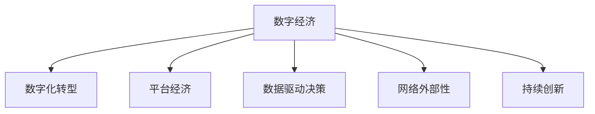

                 

# 数字经济：社会发展的助推器

## 1. 背景介绍

### 1.1 问题由来
随着互联网和信息技术的发展，数字经济正逐渐成为推动社会经济发展的重要引擎。数字经济是指以信息技术和数据为核心驱动力，通过数字化转型改造传统经济模式，形成新的经济增长点。数字经济不仅包括电子商务、云计算、大数据、物联网等新兴领域，也涵盖了实体经济中传统行业的数字化转型。

近年来，数字化技术的迅猛发展催生了各行各业数字化应用的涌现，加速了全球经济转型升级。数字经济已经成为各国经济增长的新引擎，对提高社会生产效率、创新产业结构、优化资源配置、推动社会公平等方面产生了深远影响。

### 1.2 问题核心关键点
数字经济的核心在于通过数字化技术，实现信息、数据和智能的深度融合。其主要特征包括：

1. **数字化转型**：利用大数据、人工智能、物联网等技术，对传统经济活动进行数字化改造，提高效率，降低成本，创造新的价值。
2. **平台经济**：通过互联网平台，连接海量供需双方，实现资源高效匹配，推动市场交易的规模化和多元化。
3. **数据驱动决策**：基于大数据分析和人工智能算法，实现精准的商业决策和市场预测，提升企业竞争力。
4. **网络外部性**：数字经济中的产品和服务具有显著的网络外部性，使用人数越多，价值越高，形成正反馈循环。
5. **持续创新**：数字经济依托于快速迭代的技术进步，推动新产品、新服务的持续创新，促进经济活力。

这些关键点共同构成了数字经济的发展基础，推动了全球经济的持续增长和产业结构的深度变革。

## 2. 核心概念与联系

### 2.1 核心概念概述

为更好地理解数字经济的发展，本节将介绍几个密切相关的核心概念：

- **数字经济**：基于信息技术和数据为核心驱动力，通过数字化转型改造传统经济模式，形成新的经济增长点。
- **数字化转型**：利用大数据、人工智能、物联网等技术，对传统经济活动进行数字化改造，提高效率，降低成本，创造新的价值。
- **平台经济**：通过互联网平台，连接海量供需双方，实现资源高效匹配，推动市场交易的规模化和多元化。
- **数据驱动决策**：基于大数据分析和人工智能算法，实现精准的商业决策和市场预测，提升企业竞争力。
- **网络外部性**：数字经济中的产品和服务具有显著的网络外部性，使用人数越多，价值越高，形成正反馈循环。
- **持续创新**：数字经济依托于快速迭代的技术进步，推动新产品、新服务的持续创新，促进经济活力。

这些核心概念之间的逻辑关系可以通过以下Mermaid流程图来展示：



这个流程图展示了大语言模型的核心概念及其之间的关系：

1. 数字经济通过数字化转型，优化资源配置，提高效率，降低成本。
2. 平台经济作为数字经济的载体，通过互联网平台，实现资源的高效匹配和市场交易的规模化。
3. 数据驱动决策通过大数据分析和人工智能算法，实现精准的商业决策和市场预测，提升企业竞争力。
4. 网络外部性增强了数字经济的价值，形成正反馈循环。
5. 持续创新推动数字经济的快速迭代，不断涌现新产品、新服务。

这些核心概念共同构成了数字经济的发展框架，使其在各个层面影响着社会经济的运行和发展。

## 3. 核心算法原理 & 具体操作步骤
### 3.1 算法原理概述

数字经济的核心在于数字化技术的应用，通过对数据的收集、处理和分析，实现资源的高效配置和利用。其核心算法原理主要包括以下几个方面：

- **数据收集与清洗**：通过各种方式收集海量数据，包括交易数据、用户行为数据、设备传感器数据等，并进行数据清洗和预处理，确保数据质量。
- **数据分析与建模**：利用统计分析、机器学习等技术，对数据进行建模和预测，提取有用信息，支持决策制定。
- **人工智能与算法**：通过深度学习、强化学习等人工智能算法，实现复杂数据的自动处理和决策优化，提升智能化水平。
- **区块链技术**：利用区块链技术的不可篡改性和透明性，构建安全的数据共享和交易平台，增强信任度。
- **物联网与传感技术**：通过物联网和传感技术，实现设备间的互联互通，实时收集和传输数据，提升数字化控制水平。

### 3.2 算法步骤详解

数字经济的实施步骤通常包括以下几个关键环节：

1. **数据收集与整合**：利用传感器、API接口等方式，收集相关数据，并整合到统一的数据平台。
2. **数据清洗与预处理**：对数据进行去重、去噪、归一化等处理，确保数据的一致性和完整性。
3. **数据分析与建模**：使用统计分析、机器学习等方法，对数据进行建模和预测，提取有用信息。
4. **算法优化与训练**：通过不断优化算法模型，提高预测和决策的准确性。
5. **部署与应用**：将训练好的模型应用到实际业务中，实现数据驱动的商业决策和市场预测。
6. **持续迭代与优化**：根据业务反馈和环境变化，持续迭代优化算法和模型，提升系统性能。

### 3.3 算法优缺点

数字经济中的核心算法具有以下优点：

- **提升效率与降低成本**：通过数字化技术优化业务流程，提高效率，降低运营成本。
- **数据驱动决策**：利用大数据分析和人工智能算法，实现精准的商业决策和市场预测，提升企业竞争力。
- **增强创新能力**：依托于快速迭代的技术进步，推动新产品、新服务的持续创新，促进经济活力。

同时，这些算法也存在一定的局限性：

- **数据隐私与安全**：海量数据收集和处理可能涉及隐私和安全问题，需制定严格的隐私保护措施。
- **算法偏见与公平性**：数据和算法中的偏见可能影响决策的公平性，需进行充分评估和校准。
- **技术复杂度**：数字化技术的实现和维护需要高水平的技术能力和资源投入。
- **环境适应性**：数字经济对环境的适应性可能存在局限，需不断调整优化。

### 3.4 算法应用领域

数字经济的核心算法在各个领域都得到了广泛应用，具体包括：

- **零售业**：通过大数据分析和推荐算法，实现个性化推荐，提升用户体验，增加销售额。
- **金融业**：利用区块链技术和智能合约，实现去中心化的金融交易，提升交易安全性和透明度。
- **制造业**：通过物联网和传感技术，实现设备互联和实时监控，提升生产效率和产品质量。
- **医疗健康**：利用大数据分析和人工智能算法，实现精准医疗和健康管理，提升服务质量。
- **农业**：通过物联网和传感器，实现农业生产监测和智能化管理，提升农业生产效率和产量。

这些应用领域展示了数字经济在各个行业的广泛影响，推动了传统产业的数字化转型和升级。

## 4. 数学模型和公式 & 详细讲解 & 举例说明

### 4.1 数学模型构建

数字经济的数学模型通常涉及以下几个关键方面：

- **回归模型**：用于预测数值型变量，如销售预测、价格预测等。
- **分类模型**：用于分类问题，如用户行为分类、信用评估等。
- **聚类模型**：用于分组问题，如市场细分、客户分类等。
- **关联规则模型**：用于发现数据中的关联关系，如购物篮分析、用户行为分析等。
- **时间序列模型**：用于预测时间序列数据，如股票价格预测、需求预测等。

### 4.2 公式推导过程

以回归模型为例，常见的线性回归模型为：

$$
y = \beta_0 + \beta_1 x_1 + \beta_2 x_2 + \cdots + \beta_n x_n + \epsilon
$$

其中 $y$ 为目标变量，$x_i$ 为输入变量，$\beta_i$ 为模型系数，$\epsilon$ 为误差项。

线性回归模型的目标是最小化残差平方和（RSS）：

$$
RSS = \sum_{i=1}^N (y_i - \hat{y}_i)^2
$$

其中 $\hat{y}_i$ 为模型预测值。

利用最小二乘法求解模型系数 $\beta_i$，使其最小化RSS：

$$
\beta_i = \frac{\sum_{i=1}^N x_{ij} (y_i - \bar{y})}{\sum_{i=1}^N x_{ij}^2}
$$

其中 $x_{ij}$ 为输入变量，$\bar{y}$ 为样本均值。

### 4.3 案例分析与讲解

假设我们有一组销售数据，包括时间、销售额和广告支出。利用线性回归模型预测销售额与广告支出之间的关系，公式为：

$$
\hat{Sales} = \beta_0 + \beta_1 Time + \beta_2 AdExp + \epsilon
$$

通过训练数据，求解模型系数 $\beta_0, \beta_1, \beta_2$，得到回归模型：

$$
\hat{Sales} = 1000 + 200 Time + 500 AdExp + \epsilon
$$

利用该模型进行销售预测，例如：

- 当时间 $Time = 6$ 个月，广告支出 $AdExp = 5000$ 元时，预测销售额为：

$$
\hat{Sales} = 1000 + 200 \times 6 + 500 \times 5000 + \epsilon = 6000 + \epsilon
$$

其中 $\epsilon$ 为误差项，可通过实际数据验证。

## 5. 项目实践：代码实例和详细解释说明

### 5.1 开发环境搭建

在进行数字经济项目实践前，我们需要准备好开发环境。以下是使用Python进行Scikit-learn开发的开发环境配置流程：

1. 安装Anaconda：从官网下载并安装Anaconda，用于创建独立的Python环境。

2. 创建并激活虚拟环境：
```bash
conda create -n pytorch-env python=3.8 
conda activate pytorch-env
```

3. 安装Scikit-learn：
```bash
conda install scikit-learn
```

4. 安装各类工具包：
```bash
pip install numpy pandas matplotlib scikit-learn ipython
```

完成上述步骤后，即可在`pytorch-env`环境中开始数字经济项目实践。

### 5.2 源代码详细实现

我们以销售预测项目为例，给出使用Scikit-learn进行回归分析的Python代码实现。

首先，准备数据集和目标变量：

```python
import pandas as pd
from sklearn.model_selection import train_test_split

data = pd.read_csv('sales_data.csv')
X = data[['Time', 'AdExp']]
y = data['Sales']

# 数据分割
X_train, X_test, y_train, y_test = train_test_split(X, y, test_size=0.2, random_state=42)
```

然后，定义模型并进行训练：

```python
from sklearn.linear_model import LinearRegression
from sklearn.metrics import mean_squared_error

model = LinearRegression()
model.fit(X_train, y_train)

# 预测并评估
y_pred = model.predict(X_test)
rmse = mean_squared_error(y_test, y_pred, squared=False)
print(f'RMSE: {rmse:.2f}')
```

最后，输出模型预测结果：

```python
new_data = pd.DataFrame({'Time': [6, 8, 10], 'AdExp': [5000, 6000, 7000]})
preds = model.predict(new_data)
print(f'预测销售额: {preds:.2f}')
```

以上就是使用Scikit-learn进行销售预测的完整代码实现。可以看到，利用Scikit-learn的线性回归模型，可以轻松完成数据的建模和预测，实现数据驱动的商业决策。

### 5.3 代码解读与分析

让我们再详细解读一下关键代码的实现细节：

**数据准备**：
- 使用Pandas库读取数据集，将时间、广告支出作为输入变量，销售额作为目标变量。
- 使用train_test_split方法将数据集分为训练集和测试集。

**模型定义与训练**：
- 定义LinearRegression模型，并进行训练，使用训练数据拟合模型参数。
- 利用test数据集进行预测，并计算预测误差（RMSE）。

**模型预测**：
- 定义新数据，包括时间、广告支出，使用模型进行预测。
- 输出预测结果。

可以看到，Scikit-learn提供的工具和接口，使得数据建模和预测变得简洁高效。开发者只需关注业务逻辑，而不必过多关注底层实现。

当然，工业级的系统实现还需考虑更多因素，如模型的保存和部署、超参数的自动搜索、更灵活的任务适配层等。但核心的回归分析范式基本与此类似。

## 6. 实际应用场景
### 6.1 智能物流与供应链管理

数字经济中的物联网和传感器技术，可以广泛应用于智能物流与供应链管理中，实现实时监控和智能化管理。通过安装传感器监测货物状态，采集温度、湿度、位置等信息，可以实现货物的精准定位和实时跟踪。同时，利用数据分析和机器学习算法，可以实现库存优化、需求预测、路径规划等功能，提高物流效率，降低运营成本。

例如，亚马逊利用其智能物流系统AWS IoT，实时监控仓库中的货物状态，实现货物的高效流转和调度。通过物联网传感器，实现对货物的精细化管理，提升物流速度和准确性。

### 6.2 智慧城市建设

数字经济中的平台经济和数据驱动决策，为智慧城市建设提供了新的思路和工具。通过搭建城市数据平台，集中收集交通、环境、能源等数据，利用大数据分析和人工智能算法，实现城市治理的智能化。

例如，深圳利用大数据平台和人工智能算法，构建了“城市大脑”系统，实现交通流量预测、能源消耗监控、空气质量分析等功能。通过实时数据分析，提升城市管理的效率和精准性，构建更安全、高效、可持续的未来城市。

### 6.3 数字金融与普惠金融

数字经济中的区块链技术和数据驱动决策，为数字金融和普惠金融提供了新的实现方式。通过区块链技术，实现去中心化的金融交易，提升交易的透明度和安全性。利用大数据分析和机器学习算法，实现精准的信贷评估、风险控制等功能，降低金融风险，提高金融服务的普及率。

例如，蚂蚁金服利用区块链技术，实现了去中心化的支付系统，提升了支付的效率和安全性。通过大数据分析和机器学习算法，实现了精准的信贷评估和风险控制，推动普惠金融的发展。

### 6.4 未来应用展望

随着数字经济技术的不断进步，未来将会出现更多新的应用场景，推动经济社会的持续发展。

- **虚拟现实与增强现实**：利用虚拟现实和增强现实技术，提升用户体验，拓展数字经济的边界。
- **边缘计算**：利用边缘计算技术，实现数据的本地处理和存储，提升数据处理的效率和安全性。
- **人工智能与人类协作**：结合人工智能技术与人类智慧，实现更高效、更智能的工作方式，推动社会生产力的提升。
- **量子计算**：利用量子计算技术，提升数据处理的速度和效率，推动数字经济的深度发展。

这些新兴技术的发展，将进一步推动数字经济的创新和应用，带来新的商业模式和社会变革。数字经济不仅将改变经济运行的方方面面，也将深刻影响人们的生活方式和社会结构。

## 7. 工具和资源推荐
### 7.1 学习资源推荐

为了帮助开发者系统掌握数字经济的核心技术，这里推荐一些优质的学习资源：

1. 《大数据与人工智能》课程：由清华大学开设的在线课程，系统讲解了大数据、人工智能等核心技术，适合初学者入门。
2. 《Python数据分析实战》书籍：由知名数据科学家编写的实战指南，详细介绍了Python在数据分析中的应用。
3. 《深度学习》课程：由斯坦福大学开设的在线课程，深入讲解了深度学习模型的原理和实现，适合进阶学习。
4. 《Python数据科学手册》书籍：由数据科学家编写的手册，系统介绍了Python在数据科学中的应用。
5. 《人工智能》课程：由斯坦福大学开设的在线课程，全面讲解了人工智能的发展历程和核心技术。

通过对这些资源的学习实践，相信你一定能够快速掌握数字经济的核心技术，并用于解决实际的业务问题。

### 7.2 开发工具推荐

高效的开发离不开优秀的工具支持。以下是几款用于数字经济开发的常用工具：

1. Python：作为数据科学的主流语言，Python以其简洁易用的特性，广泛应用于数据处理和分析。
2. R语言：数据科学领域的另一重要工具，以其丰富的统计分析库和绘图库，广泛用于数据建模和可视化。
3. Jupyter Notebook：基于Web的交互式编程环境，支持多种编程语言，方便快速迭代实验和分享。
4. Tableau：数据可视化工具，支持多种数据源和可视化效果，方便进行数据探索和展示。
5. Apache Hadoop：开源分布式计算框架，支持大数据处理和分布式存储，广泛用于数据仓库和数据湖构建。
6. Apache Spark：快速的大数据处理引擎，支持多种数据源和编程接口，适合大数据分析与机器学习。

合理利用这些工具，可以显著提升数字经济项目的开发效率，加快创新迭代的步伐。

### 7.3 相关论文推荐

数字经济的核心技术在学界和产业界得到了广泛研究。以下是几篇奠基性的相关论文，推荐阅读：

1. 《Big Data: A Revolution That Will Transform How We Live, Work and Think》书籍：由著名数据科学家Viktor Mayer-Schönberger和Kenneth Cukier合著，系统介绍了大数据技术的发展与应用。
2. 《The Algorithmic Information Society》论文：探讨了算法如何影响社会和经济的发展，分析了算法透明性和公平性等问题。
3. 《Blockchain Technology and the Digital Economy》论文：分析了区块链技术在数字经济中的应用与挑战，探讨了区块链的未来发展方向。
4. 《Artificial Intelligence in the Age of Globalization》论文：探讨了人工智能技术对全球化的影响，分析了人工智能的伦理与法律问题。
5. 《Data-Driven Business Models in Digital Economies》论文：分析了数据驱动商业模式的创新与应用，探讨了数据资产管理和隐私保护等问题。

这些论文代表了大数据、人工智能、区块链等核心技术的发展脉络，为理解数字经济提供了深厚的理论基础。

## 8. 总结：未来发展趋势与挑战
### 8.1 总结

本文对数字经济的核心技术进行了全面系统的介绍。首先阐述了数字经济的背景和核心概念，明确了数字化技术在各个行业中的应用基础。其次，从原理到实践，详细讲解了数字经济的数学模型和算法实现，给出了数据驱动决策的具体案例。同时，本文还广泛探讨了数字经济在智能物流、智慧城市、数字金融等多个领域的应用前景，展示了数字经济的广阔前景。此外，本文精选了数字经济的学习资源，力求为读者提供全方位的技术指引。

通过本文的系统梳理，可以看到，数字经济通过数字化技术的应用，优化了资源配置，提高了生产效率，推动了经济转型升级。数字经济不仅改变了传统产业，也催生了新的商业模式和社会变革。未来，随着数字技术的不断进步，数字经济还将迎来更多的创新和发展，为全球经济带来新的活力和机遇。

### 8.2 未来发展趋势

展望未来，数字经济的发展趋势将呈现以下几个方向：

1. **数字化智能化融合**：数字技术与智能化技术的深度融合，将进一步推动产业升级和创新发展，提升社会生产效率。
2. **平台经济的多元化**：平台经济的不断扩展和深化，将形成更加多元化的生态系统，提升资源配置的效率和公平性。
3. **数据驱动决策的普及**：数据驱动决策在更多领域的广泛应用，将提升决策的精准性和透明度，推动企业竞争力提升。
4. **数据治理和隐私保护**：随着数据驱动决策的普及，数据治理和隐私保护将成为重要议题，需要制定严格的政策和技术手段。
5. **跨领域合作与协作**：数字经济的发展离不开跨领域合作与协作，不同行业之间的数据共享和协同创新将推动整体进步。
6. **人工智能的普惠化**：人工智能技术的普及将带来更多普惠化应用，促进社会公平与共享。

这些趋势凸显了数字经济的前景和潜力，为经济社会的持续发展提供了新的方向和动力。

### 8.3 面临的挑战

尽管数字经济已经取得了显著成果，但在迈向更加智能化、普惠化应用的过程中，它仍面临着诸多挑战：

1. **数据隐私与安全**：海量数据的收集和处理可能涉及隐私和安全问题，需制定严格的数据隐私保护政策。
2. **技术公平性与普惠性**：数字技术的普及和应用可能存在技术公平性和普惠性问题，需确保不同群体能够公平访问和使用。
3. **技术伦理与社会责任**：数字技术的快速发展和应用可能带来伦理和社会责任问题，需制定严格的技术伦理标准和监管机制。
4. **数据治理与标准化**：数字经济中的数据治理和标准化问题，需制定统一的数据标准和治理框架。
5. **技术变革与就业影响**：数字技术的变革可能对就业市场产生影响，需制定配套的就业保障和培训政策。

这些挑战需要在技术、政策和社会等各个层面共同应对，以确保数字经济的健康发展。

### 8.4 研究展望

面对数字经济面临的挑战，未来的研究需要在以下几个方面寻求新的突破：

1. **隐私保护与数据安全**：开发更加安全、高效的隐私保护技术，确保数据安全和隐私保护。
2. **公平性与普惠性**：探索更加公平、普惠的数字技术应用模式，缩小数字鸿沟，提升社会的公平性。
3. **技术伦理与社会责任**：制定严格的技术伦理标准和监管机制，确保数字技术应用的伦理性和社会责任。
4. **数据治理与标准化**：制定统一的数据标准和治理框架，推动数据的高效管理和共享。
5. **就业保障与培训**：制定配套的就业保障和培训政策，确保数字技术变革对就业市场的平稳过渡。

这些研究方向的探索，必将引领数字经济迈向更加智能、普惠、公平的发展方向，为全球经济和社会带来新的变革和机遇。

## 9. 附录：常见问题与解答

**Q1：数字经济是否会取代传统经济？**

A: 数字经济并不是取代传统经济，而是对传统经济的数字化转型和升级。数字经济通过数字化技术的应用，优化了资源配置，提高了生产效率，推动了经济转型升级。传统经济中的许多环节和要素仍将存在，但会在数字化技术的推动下进行优化和升级。数字经济与传统经济将长期共存，共同推动经济的发展。

**Q2：数字经济是否存在安全隐患？**

A: 数字经济中的数据隐私和安全问题是一个重要挑战。海量数据的收集和处理可能涉及隐私和安全问题，需制定严格的数据隐私保护政策。同时，利用先进的网络攻击手段，数据和系统的安全防护也需要不断提升。因此，数据隐私和安全是数字经济发展中必须解决的问题。

**Q3：数字经济的发展是否会导致就业减少？**

A: 数字经济的发展可能会对某些传统行业带来就业冲击，但也会创造更多新兴职业和岗位。数字经济推动了产业升级和创新发展，提升了社会生产效率，同时催生了新的商业模式和社会变革。因此，数字经济将带来更多的就业机会，但也需要关注就业结构的调整和优化。

**Q4：数字经济是否会带来伦理和社会问题？**

A: 数字经济的发展可能会带来伦理和社会问题，如数据隐私、算法偏见、技术公平性等。需制定严格的技术伦理标准和监管机制，确保数字技术应用的伦理性和社会责任。同时，需关注数字技术对社会公平和共享的影响，确保技术的普惠性和包容性。

**Q5：数字经济的发展是否需要政策支持？**

A: 数字经济的发展离不开政策的支持和引导。政府需制定科学合理的发展规划，推动数字经济的快速健康发展。同时，需制定配套的政策措施，如数据隐私保护、技术伦理规范、就业保障等，确保数字经济的健康发展。

总之，数字经济已经成为推动经济社会发展的关键力量，需要各方共同努力，实现技术、政策和社会等多方面的协同发展。只有从多个维度进行全面创新和优化，才能最大化数字经济的潜力和价值，为全球经济带来新的活力和机遇。

