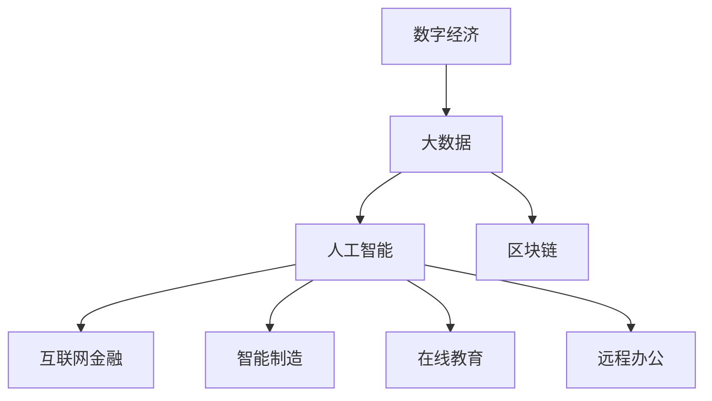

                 

# 数字经济：社会发展的助推器

> 关键词：数字经济, 社会变革, 人工智能, 大数据, 区块链, 互联网金融, 智能制造

## 1. 背景介绍

### 1.1 问题由来
数字经济是人类进入信息化时代的产物，是指利用数字技术和互联网基础设施，推动经济活动的数字化、网络化和智能化，创造新价值、新业态和新动力的一种经济形态。数字经济的发展改变了传统的商业模式、生产方式和社会结构，带来了前所未有的机遇和挑战。

近年来，随着大数据、云计算、人工智能、区块链等新兴技术的发展和应用，数字经济呈现出蓬勃发展的态势。尤其是在全球范围内，数字经济已经成为推动经济增长、实现社会进步的重要力量。通过利用数字化工具和平台，企业能够更高效地生产、流通和分配商品和服务，消费者也获得了更加多样化和便捷的消费体验。

然而，数字经济的发展也带来了新的问题，如数据隐私、信息安全、数字鸿沟等。如何在享受数字经济带来的便利和好处的同时，确保技术的伦理和责任，成为全社会共同关注的重要课题。

## 2. 核心概念与联系

### 2.1 核心概念概述

为了深入理解数字经济及其对社会发展的推动作用，本节将介绍几个关键概念及其之间的联系：

- **数字经济（Digital Economy）**：以数字化、网络化和智能化为特征的新型经济形态。包括互联网金融、智能制造、电子商务、在线教育、远程办公等多个领域。
- **大数据（Big Data）**：指规模巨大、类型多样的数据集，通过分析挖掘可以发现深层次的知识和规律。大数据技术是数字经济的重要基石。
- **人工智能（AI）**：指通过机器学习、深度学习等算法，使计算机具备类人智能，能够进行自主决策和智能化的任务处理。AI是数字经济的关键驱动力。
- **区块链（Blockchain）**：一种分布式账本技术，具有去中心化、不可篡改、可追溯等特点。区块链在数字经济中广泛应用于金融、供应链、版权保护等领域。
- **互联网金融（Fintech）**：利用互联网技术创新金融服务方式，提高金融服务的效率和可及性。互联网金融是数字经济的典型应用。
- **智能制造（Industry 4.0）**：通过物联网、人工智能等技术，实现生产过程的智能化和自动化。智能制造是数字经济的重要组成部分。
- **在线教育（E-learning）**：借助互联网平台进行远程教育和学习，打破时间和空间的限制。在线教育是数字经济的新兴领域。
- **远程办公（Remote Work）**：通过网络技术实现远程工作和协作，提升工作效率和灵活性。远程办公是数字经济的重要实践。

这些概念之间的逻辑关系可以通过以下Mermaid流程图来展示：



这个流程图展示了大语言模型的核心概念及其之间的关系：

1. 数字经济基于大数据、人工智能、区块链等技术，推动各行业的发展。
2. 大数据提供了大量的数据支撑，使人工智能模型能够学习到深层次的知识和规律。
3. 人工智能通过机器学习算法，提高了数据分析和处理的能力，为数字经济提供了核心驱动力。
4. 区块链提供了去中心化的信任机制，增强了数字经济的可靠性和安全性。
5. 互联网金融、智能制造、在线教育、远程办公等都是数字经济的具体应用和实践。

这些概念共同构成了数字经济的完整框架，使其能够全面驱动经济、社会、文化等各个方面的进步。

## 3. 核心算法原理 & 具体操作步骤
### 3.1 算法原理概述

数字经济的发展离不开技术的支撑，而技术的发展又依赖于算法和算力的提升。本文聚焦于数字经济的核心算法原理，包括大数据、人工智能和区块链等技术的基本算法，以及其具体操作流程。

### 3.2 算法步骤详解

数字经济的算法和操作步骤通常包括以下几个关键步骤：

**Step 1: 数据收集与清洗**
- 收集相关行业的各类数据，如消费行为、生产过程、市场交易等。
- 清洗数据，去除噪声和异常值，确保数据的质量和完整性。

**Step 2: 数据分析与挖掘**
- 使用大数据分析技术，如数据挖掘、聚类、关联规则等，挖掘数据中的潜在知识和规律。
- 利用机器学习算法，如回归、分类、聚类等，构建预测模型，进行精准预测和决策。

**Step 3: 模型训练与优化**
- 利用训练数据集，训练机器学习模型，并进行参数优化。
- 使用验证集和测试集评估模型的性能，调整超参数，提升模型效果。

**Step 4: 模型应用与迭代**
- 将训练好的模型应用于实际场景，进行数据处理、预测、决策等。
- 不断收集新数据，重新训练和优化模型，实现模型迭代和升级。

### 3.3 算法优缺点

数字经济的算法和操作步骤具有以下优点：
1. 数据驱动：通过大数据分析，可以发现数据中的深层次规律和趋势，驱动决策和创新。
2. 高效精准：机器学习算法能够高效处理海量数据，提供精准的预测和决策支持。
3. 智能化决策：人工智能技术能够模拟人类智能，进行自主决策和智能化的任务处理。
4. 去中心化：区块链技术提供了去中心化的信任机制，提高了数据和交易的安全性。

同时，该方法也存在一定的局限性：
1. 数据隐私问题：大量数据收集和使用，可能引发数据隐私和安全问题。
2. 算法透明性不足：机器学习模型通常是"黑盒"，难以解释其内部决策过程。
3. 模型泛化能力有限：大数据和机器学习模型往往基于特定数据集进行训练，泛化能力有限。
4. 技术门槛高：数字经济涉及多种复杂技术，技术门槛较高，需要专业人才和资源投入。

尽管存在这些局限性，但就目前而言，数字经济的算法和操作步骤仍是大规模应用的主要方式。未来相关研究的重点在于如何进一步提高算法的透明性和可解释性，确保数据隐私和安全，以及降低技术门槛，促进更多领域和行业的数字化转型。

### 3.4 算法应用领域

数字经济的算法和技术在多个领域得到了广泛应用，以下是几个典型的应用场景：

- **互联网金融**：利用大数据和人工智能技术，提供智能风控、智能投顾、区块链支付等金融服务。
- **智能制造**：通过物联网和大数据技术，实现生产过程的实时监控、预测维护、优化生产计划等。
- **电子商务**：利用大数据分析和机器学习算法，推荐商品、优化库存、预测需求等，提升用户体验。
- **在线教育**：通过数据分析和个性化推荐算法，提升教学效果和用户体验。
- **医疗健康**：利用大数据和人工智能技术，进行疾病预测、个性化治疗、远程诊断等。
- **物流供应链**：通过物联网和区块链技术，实现供应链的透明化、可追溯化和高效管理。
- **社交媒体**：利用大数据分析，进行用户行为分析、内容推荐、广告投放等。

这些应用场景展示了数字经济在各个行业中的广泛应用和深远影响。随着技术的不断进步，数字经济的应用领域还将进一步拓展，为各行各业带来更多创新和机遇。

## 4. 数学模型和公式 & 详细讲解
### 4.1 数学模型构建

数字经济中的算法和数学模型通常是基于大数据和机器学习的。本文将介绍几个典型的数学模型及其构建方法。

假设我们有一个包含 $N$ 个样本和 $M$ 个特征的训练数据集 $D=\{(x_i,y_i)\}_{i=1}^N$，其中 $x_i$ 为特征向量，$y_i$ 为标签。常见的数学模型包括线性回归、逻辑回归、决策树、随机森林、神经网络等。

线性回归模型的数学公式为：

$$
y_i = \theta_0 + \sum_{j=1}^M \theta_j x_{ij}
$$

其中 $\theta_j$ 为模型参数，$\theta_0$ 为截距。

逻辑回归模型的数学公式为：

$$
\log \frac{p_i}{1-p_i} = \theta_0 + \sum_{j=1}^M \theta_j x_{ij}
$$

其中 $p_i$ 为样本属于正类的概率。

决策树模型的构建过程通常包括特征选择、分裂节点、剪枝等步骤，最终构建出一个树形结构模型。

随机森林模型是通过多次随机采样和特征选择，构建多个决策树，并将它们的结果进行集成，得到最终的预测结果。

神经网络模型通常由多个层次构成，每个层次包含多个神经元，通过前向传播和反向传播算法，不断调整神经元权重，最终得到模型的预测结果。

### 4.2 公式推导过程

以线性回归模型为例，推导其训练过程和损失函数。

假设模型参数 $\theta = (\theta_0, \theta_1, \ldots, \theta_M)$，训练样本 $(x_i, y_i)$，则模型预测结果为：

$$
y_i = \theta_0 + \sum_{j=1}^M \theta_j x_{ij}
$$

模型的损失函数通常采用均方误差（MSE），计算公式为：

$$
L(\theta) = \frac{1}{N} \sum_{i=1}^N (y_i - \hat{y}_i)^2
$$

其中 $\hat{y}_i$ 为模型预测结果，$y_i$ 为真实标签。

通过梯度下降算法，对损失函数求偏导，得到参数更新公式：

$$
\theta_j \leftarrow \theta_j - \frac{\eta}{N} \sum_{i=1}^N (2 \hat{y}_i - y_i) x_{ij}
$$

其中 $\eta$ 为学习率。

通过不断迭代，优化模型参数，使得损失函数最小化，最终得到训练好的模型。

### 4.3 案例分析与讲解

以电子商务领域的推荐系统为例，分析其数据处理、算法应用和模型优化过程。

**数据处理**：收集用户的浏览、购买、评价等行为数据，将用户和商品信息进行匹配，构建用户-商品交互矩阵。对数据进行清洗、去重、缺失值处理等，确保数据的质量和完整性。

**算法应用**：利用协同过滤、内容推荐等算法，对用户进行个性化推荐。协同过滤算法通过分析用户行为和商品属性，找到与目标用户相似的用户群体，推荐其喜欢的商品。内容推荐算法通过分析商品内容和用户偏好，直接推荐相似的商品。

**模型优化**：利用A/B测试、交叉验证等方法，评估推荐系统的效果，不断优化模型参数。使用聚类、特征选择等技术，提升推荐系统的性能和效率。

## 5. 项目实践：代码实例和详细解释说明
### 5.1 开发环境搭建

在进行数字经济相关项目开发时，通常需要使用Python、R、MATLAB等编程语言，以及相应的开发环境。以下是Python开发环境搭建的详细步骤：

1. 安装Anaconda：从官网下载并安装Anaconda，用于创建独立的Python环境。

2. 创建并激活虚拟环境：
```bash
conda create -n python-env python=3.8 
conda activate python-env
```

3. 安装必要的Python库：
```bash
pip install numpy pandas scikit-learn matplotlib
```

4. 安装必要的第三方库：
```bash
pip install scikit-learn numpy matplotlib pandas
```

5. 安装相关的数据处理库：
```bash
pip install pandas numpy
```

6. 安装机器学习库：
```bash
pip install scikit-learn
```

7. 安装可视化库：
```bash
pip install matplotlib seaborn
```

完成上述步骤后，即可在`python-env`环境中进行数字经济项目的开发。

### 5.2 源代码详细实现

以下是一个简单的Python代码实例，演示了如何使用scikit-learn库进行线性回归模型的训练和预测。

```python
from sklearn.linear_model import LinearRegression
from sklearn.model_selection import train_test_split
from sklearn.metrics import mean_squared_error
import numpy as np
import pandas as pd

# 读取数据集
data = pd.read_csv('data.csv')

# 数据预处理
X = data[['feature1', 'feature2', 'feature3']]
y = data['label']

# 划分训练集和测试集
X_train, X_test, y_train, y_test = train_test_split(X, y, test_size=0.2, random_state=42)

# 训练模型
model = LinearRegression()
model.fit(X_train, y_train)

# 预测结果
y_pred = model.predict(X_test)

# 计算误差
mse = mean_squared_error(y_test, y_pred)
print('均方误差：', mse)
```

在这个代码实例中，我们使用scikit-learn库的LinearRegression模型，对包含三个特征和一个标签的数据集进行训练和预测。首先，我们读取数据集，并进行数据预处理。然后，将数据划分为训练集和测试集，使用LinearRegression模型进行训练。最后，对测试集进行预测，并计算均方误差。

### 5.3 代码解读与分析

下面对代码的各个部分进行详细解读和分析：

- **数据读取**：使用pandas库读取数据集，并存储在data变量中。

- **数据预处理**：将数据集中的特征列和标签列分别存储在X和y变量中，使用train_test_split函数将数据划分为训练集和测试集。

- **模型训练**：使用LinearRegression模型进行训练，fit函数用于训练模型，训练数据集为X_train和y_train。

- **模型预测**：使用predict函数对测试集进行预测，预测结果存储在y_pred变量中。

- **误差计算**：使用mean_squared_error函数计算预测结果与真实标签之间的均方误差。

## 6. 实际应用场景
### 6.1 互联网金融

互联网金融是数字经济的重要应用之一，通过互联网技术创新金融服务方式，提高金融服务的效率和可及性。以下是一个典型的互联网金融应用场景：

**应用场景**：智能投顾（Robo-Advisor）

**数据处理**：收集用户的个人信息、财务状况、投资偏好等数据，建立用户画像。对数据进行清洗、去重、缺失值处理等，确保数据的质量和完整性。

**算法应用**：利用机器学习算法，如随机森林、神经网络等，构建用户投资风险评估模型。通过分析用户的财务状况和投资偏好，进行风险评估和资产配置，生成个性化的投资建议。

**模型优化**：利用A/B测试、交叉验证等方法，评估智能投顾系统的效果，不断优化模型参数。使用聚类、特征选择等技术，提升推荐系统的性能和效率。

**实际应用**：用户登录智能投顾系统，填写相关信息。系统根据用户的财务状况和投资偏好，生成个性化的投资建议。用户可以根据自己的情况，选择投资组合并进行实时监控和调整。

### 6.2 智能制造

智能制造是数字经济的重要组成部分，通过物联网和大数据技术，实现生产过程的智能化和自动化。以下是一个典型的智能制造应用场景：

**应用场景**：智能供应链管理

**数据处理**：收集生产设备、物流信息、生产过程等数据，建立生产供应链的数据管理系统。对数据进行清洗、去重、缺失值处理等，确保数据的质量和完整性。

**算法应用**：利用大数据分析和机器学习算法，构建供应链预测和优化模型。通过分析历史数据和实时数据，进行需求预测、库存管理、物流优化等，提高供应链的效率和可靠性。

**模型优化**：利用A/B测试、交叉验证等方法，评估供应链管理系统的效果，不断优化模型参数。使用聚类、特征选择等技术，提升供应链管理的性能和效率。

**实际应用**：生产设备通过物联网传感器实时采集生产数据，上传到数据管理系统。系统根据历史数据和实时数据，进行需求预测和库存管理，优化物流路径，实现智能化生产。

## 7. 工具和资源推荐
### 7.1 学习资源推荐

为了帮助开发者系统掌握数字经济中的算法和应用，这里推荐一些优质的学习资源：

1. 《Python数据科学手册》：由Jake VanderPlas撰写，系统介绍了Python在数据科学中的应用，包括数据处理、机器学习、数据可视化等。

2. 《深度学习入门》：由斋藤康毅撰写，全面介绍了深度学习的基本概念、算法和应用，适合初学者入门。

3. 《机器学习实战》：由Peter Harrington撰写，通过实际项目展示了机器学习的应用，适合实战练习。

4. 《数据科学导论》：由David J. Hand等作者合著，系统介绍了数据科学的基本概念、方法和应用，适合全面学习。

5. Kaggle：数据科学竞赛平台，提供大量的数据集和算法挑战，适合实战练习和提升技能。

通过对这些资源的学习实践，相信你一定能够快速掌握数字经济中的算法和应用，并用于解决实际问题。

### 7.2 开发工具推荐

高效的开发离不开优秀的工具支持。以下是几款用于数字经济开发的常用工具：

1. Python：开源的编程语言，拥有丰富的科学计算库和数据分析工具，适合数据科学和机器学习开发。

2. R：专门用于数据分析和统计计算的语言，拥有丰富的数据处理和可视化库，适合统计分析和数据科学应用。

3. MATLAB：数学软件，拥有强大的数学计算和图形处理功能，适合数值计算和仿真模拟。

4. TensorFlow：由Google开发的深度学习框架，适合大规模机器学习和深度学习任务。

5. PyTorch：由Facebook开发的深度学习框架，适合灵活的算法开发和实验验证。

6. Scikit-learn：Python机器学习库，提供多种机器学习算法和工具，适合数据处理和模型训练。

7. Jupyter Notebook：开源的交互式编程环境，支持Python、R等多种语言，适合数据科学和机器学习应用。

合理利用这些工具，可以显著提升数字经济项目的开发效率，加快创新迭代的步伐。

### 7.3 相关论文推荐

数字经济的发展离不开学界的持续研究。以下是几篇奠基性的相关论文，推荐阅读：

1. "On the Shoulders of Giants: The Deep Web and the Future of Knowledge Discovery"：文章介绍了Web挖掘技术的发展和应用，提出了Big Web的概念。

2. "Deep Learning"：由Ian Goodfellow等作者合著，全面介绍了深度学习的基本概念、算法和应用，适合深入学习。

3. "Machine Learning Yearning"：由Andrew Ng撰写，系统介绍了机器学习的最佳实践和应用，适合实战练习。

4. "Data Science for Business"：由Peter C. Warden等作者合著，系统介绍了数据科学的基本概念、方法和应用，适合全面学习。

这些论文代表了大数据、人工智能等技术的发展脉络。通过学习这些前沿成果，可以帮助研究者把握学科前进方向，激发更多的创新灵感。

## 8. 总结：未来发展趋势与挑战
### 8.1 总结

本文对数字经济及其对社会发展的推动作用进行了全面系统的介绍。首先阐述了数字经济的基本概念和主要特征，明确了其在推动经济增长、实现社会进步方面的重要作用。其次，从原理到实践，详细讲解了数字经济的算法原理和操作步骤，给出了数字经济项目开发的完整代码实例。同时，本文还广泛探讨了数字经济在金融、制造、电子商务等多个领域的应用前景，展示了其巨大的市场潜力和发展机遇。此外，本文精选了数字经济的学习资源，力求为读者提供全方位的技术指引。

通过本文的系统梳理，可以看到，数字经济在当今社会中的重要地位和广泛影响。随着数字技术的发展和应用，数字经济将成为推动社会进步和经济增长的重要力量。未来，伴随数字经济技术的不断进步和普及，我们必将迎来更加智能、高效、可持续的发展前景。

### 8.2 未来发展趋势

展望未来，数字经济的发展将呈现以下几个趋势：

1. 数据驱动：大数据和人工智能技术将更加广泛地应用于各个领域，驱动决策和创新。

2. 智能化决策：人工智能技术将模拟人类智能，进行自主决策和智能化的任务处理。

3. 去中心化：区块链技术将更加广泛地应用于金融、供应链等领域，提供去中心化的信任机制。

4. 多模态融合：通过将大数据、人工智能、区块链等技术融合，实现更加全面、高效的数据处理和智能决策。

5. 个性化服务：通过大数据和人工智能技术，实现更加个性化、定制化的服务体验。

6. 可持续性：数字经济将更加注重可持续发展，利用大数据和人工智能技术，推动环保、节能等目标实现。

7. 全球化：数字经济将打破地域限制，推动全球范围内的资源共享和协同创新。

以上趋势凸显了数字经济的广阔前景。这些方向的探索发展，必将进一步提升数字经济在各个领域的影响力和应用效果。

### 8.3 面临的挑战

尽管数字经济已经取得了显著成就，但在迈向更加智能化、普适化应用的过程中，仍面临诸多挑战：

1. 数据隐私问题：大规模数据收集和使用，可能引发数据隐私和安全问题。如何保护数据隐私，确保数据安全，成为数字经济发展的关键问题。

2. 算法透明性不足：机器学习模型通常是"黑盒"，难以解释其内部决策过程。如何提高算法的透明性和可解释性，确保算法决策的公正性和合理性，将是数字经济中的重要课题。

3. 技术门槛高：数字经济涉及多种复杂技术，技术门槛较高，需要专业人才和资源投入。如何降低技术门槛，促进更多领域和行业的数字化转型，将是一大挑战。

4. 伦理和责任问题：数字经济在带来便利和高效的同时，也可能引发伦理和责任问题。如何在技术应用中平衡效率和伦理，确保技术应用的公正性和可持续性，将是一大挑战。

5. 国际竞争：数字经济的发展将引发国际竞争，如何在全球范围内推动数字经济的健康发展，确保技术应用的公平和公正，将是一大挑战。

6. 技术安全和稳定性：数字经济中的技术应用可能面临各种安全威胁和稳定性问题。如何保障技术的可靠性和安全性，确保技术应用的稳定性和持久性，将是一大挑战。

这些挑战凸显了数字经济在发展过程中面临的复杂性和多样性。只有全面应对这些挑战，才能确保数字经济的可持续发展和广泛应用。

### 8.4 研究展望

未来，数字经济的研究将进一步深化，以下几个方向值得关注：

1. 大数据和人工智能技术的融合应用：通过将大数据和人工智能技术融合，实现更加全面、高效的数据处理和智能决策。

2. 去中心化和区块链技术的应用：利用去中心化和区块链技术，推动数字经济的透明化和可追溯化，提升数据和交易的安全性。

3. 多模态数据的整合与应用：通过将大数据、人工智能、区块链等技术融合，实现多模态数据的整合与应用，提升数字经济的应用效果。

4. 数据隐私和安全保护：通过技术手段和法律规范，保护数据隐私和安全，确保数字经济的健康发展。

5. 算法透明性和可解释性：通过提高算法的透明性和可解释性，确保算法决策的公正性和合理性，提升数字经济的公信力。

6. 数字经济伦理和责任：通过构建伦理框架和规范，确保数字经济应用中的公正性和可持续性，推动数字经济的良性发展。

这些研究方向将进一步推动数字经济的创新和应用，为经济社会的发展注入新的动力。总之，数字经济的发展需要各领域的协同合作，共同应对挑战，才能实现其广泛应用和深远影响。

## 9. 附录：常见问题与解答

**Q1：数字经济中的大数据和人工智能技术，如何平衡数据隐私和安全性？**

A: 数字经济中，大数据和人工智能技术的广泛应用，带来了数据隐私和安全性问题。为了平衡数据隐私和安全性，可以采取以下措施：

1. 数据匿名化：通过去标识化、脱敏等技术，对数据进行处理，防止个人隐私泄露。

2. 数据加密：对数据进行加密处理，确保数据在传输和存储过程中的安全性。

3. 访问控制：通过身份验证、授权等措施，控制数据访问权限，防止未授权访问。

4. 安全审计：建立数据安全审计机制，定期检查和评估数据安全状况，及时发现和修复安全漏洞。

5. 合规监管：遵守数据保护法律法规，如GDPR、CCPA等，确保数据处理过程的合法性和合规性。

通过以上措施，可以在保护数据隐私的同时，确保数据的安全性，实现数字经济的可持续发展。

**Q2：数字经济中的智能投顾系统，如何保证推荐结果的准确性和个性化？**

A: 智能投顾系统的推荐结果准确性和个性化，依赖于多个因素，包括数据质量、算法模型、用户反馈等。以下是一些关键措施：

1. 数据质量：确保数据的完整性、准确性和时效性，对数据进行清洗、去重、缺失值处理等，确保数据的质量和完整性。

2. 算法模型：选择适合的算法模型，如随机森林、神经网络等，进行投资风险评估和资产配置。通过不断优化模型参数，提升推荐系统的性能和效果。

3. 用户反馈：建立用户反馈机制，收集用户对推荐结果的评价和建议，及时调整推荐策略和模型参数。

4. 个性化推荐：通过用户画像和行为分析，对用户进行个性化推荐。根据用户的历史行为和偏好，生成个性化的投资建议。

5. 动态调整：根据市场变化和用户需求，动态调整推荐策略和模型参数，提升推荐系统的时效性和精准度。

通过以上措施，可以确保智能投顾系统的推荐结果的准确性和个性化，提升用户体验和投资效果。

**Q3：数字经济中的智能制造系统，如何确保供应链的稳定性和可靠性？**

A: 智能制造系统中的供应链管理，需要确保供应链的稳定性和可靠性。以下是一些关键措施：

1. 数据整合：将生产设备、物流信息、生产过程等数据整合到统一的数据管理系统，确保数据的完整性和一致性。

2. 实时监控：通过物联网传感器和数据管理系统，实时监控生产设备的状态和运行情况，及时发现和处理异常。

3. 预测分析：利用大数据分析和机器学习算法，进行需求预测、库存管理、物流优化等，提高供应链的效率和可靠性。

4. 智能调度：通过智能调度算法，优化生产计划和物流路径，实现资源的最优配置。

5. 应急预案：建立应急预案和风险管理机制，及时应对供应链中的突发事件，确保供应链的稳定性和可靠性。

通过以上措施，可以确保智能制造系统中的供应链稳定性和可靠性，提升生产效率和市场竞争力。

**Q4：数字经济中的在线教育平台，如何提升教学效果和用户体验？**

A: 数字经济中的在线教育平台，需要提升教学效果和用户体验。以下是一些关键措施：

1. 个性化推荐：通过数据分析和个性化推荐算法，对学生进行个性化推荐。根据学生的学习行为和偏好，推荐适合的课程和内容。

2. 互动教学：利用虚拟现实、增强现实等技术，实现互动教学。通过虚拟实验室、模拟实验等，提升学生的学习体验。

3. 智能辅导：通过智能辅导算法，对学生的学习进度和效果进行监控和评估，提供个性化的辅导和建议。

4. 多元评价：建立多元化的评价体系，综合考虑学生的学习成果、学习态度、学习行为等，全面评估学生的学习效果。

5. 实时反馈：通过实时反馈机制，及时调整教学策略和内容，提升教学效果和用户体验。

通过以上措施，可以提升数字经济中在线教育平台的学习效果和用户体验，推动教育公平和教育现代化。

**Q5：数字经济中的区块链技术，如何确保数据的透明性和可追溯性？**

A: 数字经济中的区块链技术，需要确保数据的透明性和可追溯性。以下是一些关键措施：

1. 去中心化存储：通过区块链技术，实现数据的去中心化存储，防止数据被篡改和删除。

2. 公开透明：区块链上的数据是公开透明的，任何人都可以在区块链上查看和验证数据。

3. 不可篡改：区块链上的数据一旦记录，就不可篡改，确保数据的真实性和可靠性。

4. 智能合约：利用智能合约技术，实现自动化的数据验证和处理，确保数据的准确性和完整性。

5. 隐私保护：通过匿名化、加密等技术，保护数据隐私，防止数据泄露和滥用。

通过以上措施，可以确保数字经济中区块链技术的数据透明性和可追溯性，提升数据的安全性和可靠性。

**Q6：数字经济中的智能供应链管理系统，如何实现高效物流？**

A: 数字经济中的智能供应链管理系统，需要实现高效物流。以下是一些关键措施：

1. 实时监控：通过物联网传感器和数据管理系统，实时监控生产设备的状态和运行情况，及时发现和处理异常。

2. 预测分析：利用大数据分析和机器学习算法，进行需求预测、库存管理、物流优化等，提高供应链的效率和可靠性。

3. 智能调度：通过智能调度算法，优化生产计划和物流路径，实现资源的最优配置。

4. 实时响应：建立实时响应机制，及时处理物流过程中的突发事件，确保物流的顺畅和高效。

5. 动态调整：根据市场需求和供应链状况，动态调整物流策略和计划，提升物流的灵活性和适应性。

通过以上措施，可以实现数字经济中智能供应链管理系统的高效物流，提升供应链的效率和竞争力。

---

作者：禅与计算机程序设计艺术 / Zen and the Art of Computer Programming

