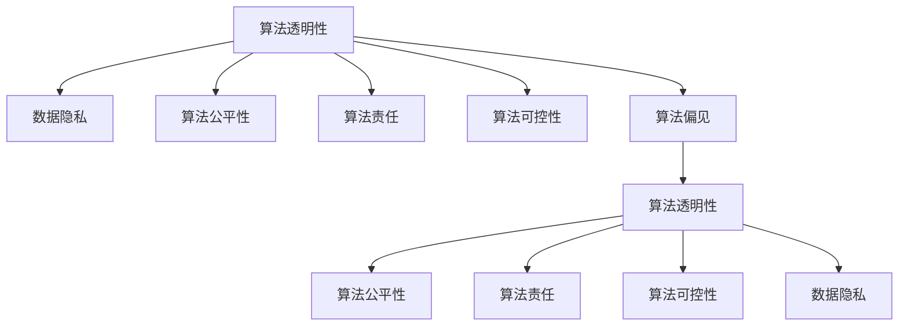
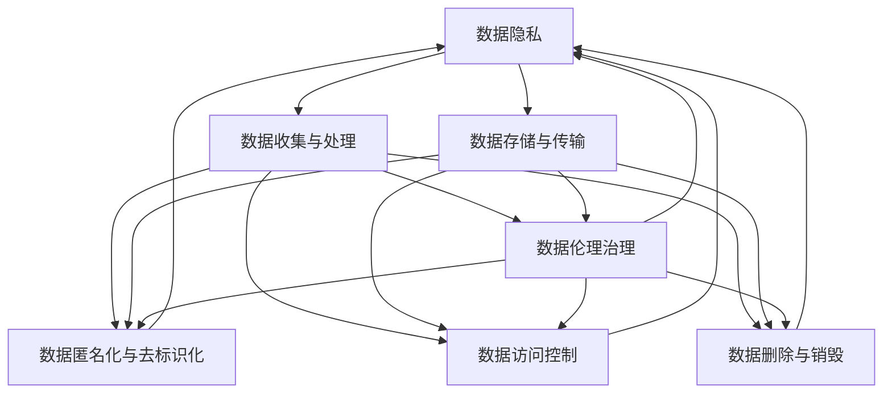

                 

# 数据伦理：算法治理与规范

## 1. 背景介绍

随着人工智能技术的飞速发展，大数据的广泛应用，算法在社会生活中的渗透和影响日益加深。与此同时，数据伦理问题也逐渐显现，给社会带来了诸多挑战。近年来，国内外关于数据伦理的讨论愈发激烈，不仅在学术界引起了广泛关注，也在政府、企业和社会各界引起了深刻反思。

### 1.1 数据伦理的概念与重要性

数据伦理，是指在数据的收集、处理、应用过程中，遵循的伦理规范和价值准则。数据伦理的重要性在于：

1. **保障数据隐私**：个人数据隐私是基本人权，保障数据隐私是算法应用的基础。
2. **避免数据偏见**：算法偏见会放大社会不公，通过数据伦理治理，减少算法歧视。
3. **提升社会信任**：数据伦理规范的实施，可以提升公众对数据应用和算法的信任度。

### 1.2 数据伦理问题的多样性

数据伦理问题复杂多样，主要包括以下几方面：

1. **数据隐私**：包括个人隐私泄露、数据滥用、数据监控等问题。
2. **数据偏见**：数据集的不均衡、偏见会传递到模型中，导致算法歧视。
3. **数据质量**：数据质量差、数据造假等问题会影响算法的准确性和公正性。
4. **算法透明**：算法的黑盒特性使得其决策过程难以解释和审查。
5. **算法可控性**：对算法结果的可控性和责任归属问题。

## 2. 核心概念与联系

### 2.1 核心概念概述

为更好地理解数据伦理在算法治理中的应用，本节将介绍几个关键核心概念：

1. **算法透明性(Algorithm Transparency)**：指算法的决策过程可被理解、可解释和可审查。
2. **算法公平性(Algorithm Fairness)**：指算法在对待不同群体时，不存在不公平对待或歧视。
3. **数据隐私(Data Privacy)**：指保护个人数据不受未经授权的收集、使用或泄露。
4. **算法责任(Algorithm Accountability)**：指算法结果的责任归属，以及在出现错误时的追责机制。
5. **算法可控性(Algorithm Controllability)**：指算法结果的可控性和可修改性。
6. **算法偏见(Bias in Algorithms)**：指算法在训练和应用过程中对某些群体或特征的不公平对待。

这些核心概念通过以下Mermaid流程图展示了它们之间的逻辑关系：



这些概念共同构成了算法治理的伦理框架，旨在通过规范算法的设计、训练和应用，实现算法的公平、透明和可信。

### 2.2 核心概念原理和架构的 Mermaid 流程图



这个流程图展示了数据伦理治理的整个过程，从数据隐私保护到数据治理策略的应用。

## 3. 核心算法原理 & 具体操作步骤

### 3.1 算法原理概述

数据伦理的实现，离不开对算法的治理和规范。核心算法原理主要包括以下几个方面：

1. **算法透明性**：通过可解释模型、透明的决策过程、透明的训练数据，使得算法可被审查和理解。
2. **算法公平性**：通过偏差检测、公平优化算法、公平数据集，减少算法偏见。
3. **数据隐私**：通过数据去标识化、差分隐私、数据访问控制等技术，保障数据隐私。
4. **算法责任**：通过模型训练的透明度、可追溯性、责任归属机制，明确算法结果的责任。
5. **算法可控性**：通过模型的可解释性、可修改性、可干预性，实现对算法结果的可控。

### 3.2 算法步骤详解

基于数据伦理的算法治理，通常包括以下几个关键步骤：

**Step 1: 数据收集与预处理**
- 明确数据收集的目的和范围，确保数据合法合规。
- 进行数据清洗和预处理，去除噪音和错误。
- 进行数据匿名化和去标识化，保障数据隐私。
- 设计数据访问控制机制，限制数据访问权限。

**Step 2: 模型训练与优化**
- 选择适合的算法模型，进行公平性训练。
- 使用偏差检测工具，识别和校正算法偏见。
- 设计透明的训练流程，记录训练日志。
- 进行模型的可解释性分析和训练数据审查。

**Step 3: 算法部署与应用**
- 部署模型到生产环境，设置访问控制策略。
- 持续监测模型性能，收集反馈数据。
- 定期进行模型更新和维护，修正问题。
- 建立算法的责任归属机制，明确责任归属。

**Step 4: 伦理审查与改进**
- 定期进行算法伦理审查，评估算法表现。
- 根据审查结果，进行算法改进和优化。
- 建立伦理监督机制，确保算法合规。
- 设立用户反馈渠道，提升算法透明度和可信度。

### 3.3 算法优缺点

基于数据伦理的算法治理方法具有以下优点：

1. **提升公平性**：通过检测和校正算法偏见，提升算法的公平性和公正性。
2. **增强透明度**：透明的训练和决策过程，提高了算法的可信度和可审查性。
3. **保障隐私**：数据隐私保护措施，防止数据滥用和泄露。
4. **明确责任**：明确的责任归属机制，确保算法应用的可控性和可追溯性。

然而，该方法也存在一定的局限性：

1. **技术复杂**：实现算法透明、公平、隐私保护等，需要复杂的算法和数据处理技术。
2. **成本高**：算法治理和伦理审查需要较高的成本和资源投入。
3. **法律规范不完善**：当前法律规范对数据伦理的约束不足，实际操作中存在法律风险。
4. **用户接受度**：用户对算法透明和隐私保护的接受度，可能影响算法的推广应用。

### 3.4 算法应用领域

基于数据伦理的算法治理方法，在多个领域得到了广泛应用：

1. **金融领域**：使用算法透明性、公平性、隐私保护等措施，保障金融产品的公平性和安全性。
2. **医疗领域**：通过算法透明性、责任归属、隐私保护等，确保医疗诊断和治疗的准确性和隐私保护。
3. **教育领域**：使用算法透明性和公平性，提升个性化教育的效果和公平性。
4. **公共安全**：通过算法透明性和可控性，确保公共安全监控和预警的公正性和可控性。
5. **环境保护**：利用算法透明性和公平性，提升环境监测和预测的准确性和公正性。

## 4. 数学模型和公式 & 详细讲解 & 举例说明

### 4.1 数学模型构建

在数据伦理的算法治理中，常用的数学模型包括：

1. **公平性优化模型**：通过优化算法，减少算法偏见。如使用Fairness Constrained Optimizer，对模型进行公平性约束。
2. **差分隐私模型**：通过在数据集上加入噪声，保护数据隐私。如Laplace机制、高斯机制等。
3. **透明度评估模型**：通过评估模型输出和决策路径，提高算法的透明性。如LIME、SHAP等可解释模型。

### 4.2 公式推导过程

以差分隐私模型为例，Laplace机制的公式推导如下：

设 $D$ 为数据集，$f$ 为数据处理函数， $Q$ 为隐私预算。则在差分隐私下的数据处理公式为：

$$
f(D) = \arg\min_{f} \mathbb{E}[L(f(D), y)] + \frac{1}{\epsilon} \log(\frac{1}{\delta} \int_{S} \exp(-\frac{\|f(D) - f(D')\|}{\epsilon}) \mathrm{d}P_{D'}
$$

其中 $L$ 为损失函数， $\epsilon$ 为隐私保护参数， $\delta$ 为概率阈值。

### 4.3 案例分析与讲解

某电商平台使用机器学习模型进行推荐算法，要求算法在公平性和隐私保护方面合规。以下案例展示了如何应用差分隐私和公平性优化模型：

**Step 1: 数据预处理**
- 对用户行为数据进行去标识化，防止用户隐私泄露。
- 对数据集进行偏差检测，识别算法偏见。

**Step 2: 模型训练**
- 使用Fairness Constrained Optimizer，对推荐模型进行公平性优化。
- 在训练数据上应用Laplace机制，进行差分隐私保护。

**Step 3: 算法部署**
- 在生产环境中部署推荐模型，设置访问控制策略。
- 持续监测模型性能，收集用户反馈数据。

**Step 4: 伦理审查**
- 定期进行算法伦理审查，评估算法表现。
- 根据审查结果，进行算法改进和优化。

## 5. 项目实践：代码实例和详细解释说明

### 5.1 开发环境搭建

在进行数据伦理的算法治理项目开发前，需要准备好开发环境。以下是使用Python进行PyTorch开发的环境配置流程：

1. 安装Anaconda：从官网下载并安装Anaconda，用于创建独立的Python环境。

2. 创建并激活虚拟环境：
```bash
conda create -n ethics-env python=3.8 
conda activate ethics-env
```

3. 安装PyTorch：根据CUDA版本，从官网获取对应的安装命令。例如：
```bash
conda install pytorch torchvision torchaudio cudatoolkit=11.1 -c pytorch -c conda-forge
```

4. 安装相关库：
```bash
pip install sklearn numpy pandas transformers
```

完成上述步骤后，即可在`ethics-env`环境中开始项目开发。

### 5.2 源代码详细实现

下面我们以推荐系统为例，给出使用差分隐私和公平性优化模型进行推荐算法开发的具体代码实现。

**Step 1: 数据预处理**

```python
from sklearn.preprocessing import StandardScaler
from sklearn.model_selection import train_test_split

# 数据预处理
scaler = StandardScaler()
X = scaler.fit_transform(data)
y = label

# 划分训练集和测试集
X_train, X_test, y_train, y_test = train_test_split(X, y, test_size=0.2)
```

**Step 2: 模型训练**

```python
from torch.nn import BCEWithLogitsLoss
from sklearn.metrics import accuracy_score
from sklearn.linear_model import LogisticRegression

# 构建公平性优化模型
class FairnessLogisticRegression(LogisticRegression):
    def __init__(self, *args, **kwargs):
        super().__init__(*args, **kwargs)
        self.fairness_constraint = 0.1

    def fit(self, X, y, sample_weight=None, solver='lbfgs', max_iter=100, verbose=0, positive=False):
        super().fit(X, y, sample_weight=sample_weight, solver=solver, max_iter=max_iter, verbose=verbose, positive=positive)
        self.coef_, self.intercept_, self._dual_gap_ = self._fit()

    def fit_transform(self, X, y, **fit_params):
        super().fit_transform(X, y, **fit_params)
        return self

# 应用差分隐私保护
from laplace import LaplaceNoise

epsilon = 1.0
delta = 1e-5

def laplace privacy(f):
    return LaplaceNoise(f, epsilon, delta).noise

# 训练公平性优化模型
model = FairnessLogisticRegression()
model.fit(X_train, y_train, sample_weight=laplace privacy(sample_weight))
```

**Step 3: 模型评估**

```python
# 模型评估
y_pred = model.predict(X_test)
print(f"Accuracy: {accuracy_score(y_test, y_pred)}")
```

### 5.3 代码解读与分析

让我们再详细解读一下关键代码的实现细节：

**数据预处理**：
- 使用sklearn对用户行为数据进行去标识化处理，保护用户隐私。
- 使用Laplace机制对数据集进行差分隐私保护，防止数据泄露。

**模型训练**：
- 构建公平性优化模型，通过加入公平性约束，减少算法偏见。
- 在训练过程中应用差分隐私保护，确保模型训练的隐私性。

**模型评估**：
- 通过模型预测，计算准确率，评估模型性能。

## 6. 实际应用场景

### 6.1 金融领域

在金融领域，基于数据伦理的算法治理尤为重要。金融机构面临的风险复杂多变，数据伦理规范能够帮助其提升风险管理水平，确保公平性和安全性。

**实际案例**：一家银行使用算法模型进行信用评分。该模型需同时满足公平性和隐私保护要求：

**Step 1: 数据预处理**
- 对客户历史数据进行去标识化处理，防止数据泄露。
- 对数据集进行偏差检测，识别算法偏见。

**Step 2: 模型训练**
- 使用Fairness Constrained Optimizer，对信用评分模型进行公平性优化。
- 在训练数据上应用差分隐私保护，确保数据隐私。

**Step 3: 模型应用**
- 在生产环境中部署信用评分模型，设置访问控制策略。
- 持续监测模型性能，收集用户反馈数据。

### 6.2 医疗领域

医疗领域对数据伦理的要求更为严格，算法应用必须遵循隐私保护和公平性原则。使用数据伦理规范，能够确保医疗诊断和治疗的准确性和公正性。

**实际案例**：一家医院使用机器学习模型进行患者风险评估。该模型需同时满足公平性和隐私保护要求：

**Step 1: 数据预处理**
- 对患者数据进行去标识化处理，防止数据泄露。
- 对数据集进行偏差检测，识别算法偏见。

**Step 2: 模型训练**
- 使用Fairness Constrained Optimizer，对患者风险评估模型进行公平性优化。
- 在训练数据上应用差分隐私保护，确保数据隐私。

**Step 3: 模型应用**
- 在生产环境中部署患者风险评估模型，设置访问控制策略。
- 持续监测模型性能，收集医生和患者的反馈数据。

### 6.3 公共安全

公共安全领域对算法的透明度和可控性要求较高，确保算法应用的公正性和可控性至关重要。

**实际案例**：一家城市管理系统使用机器学习模型进行交通流量预测。该模型需同时满足公平性和透明度要求：

**Step 1: 数据预处理**
- 对交通数据进行去标识化处理，防止数据泄露。
- 对数据集进行偏差检测，识别算法偏见。

**Step 2: 模型训练**
- 使用Fairness Constrained Optimizer，对交通流量预测模型进行公平性优化。
- 在训练数据上应用差分隐私保护，确保数据隐私。

**Step 3: 模型应用**
- 在生产环境中部署交通流量预测模型，设置访问控制策略。
- 持续监测模型性能，收集交通部门和公众的反馈数据。

## 7. 工具和资源推荐

### 7.1 学习资源推荐

为帮助开发者系统掌握数据伦理的算法治理方法，以下是一些优质的学习资源：

1. 《数据伦理：人工智能时代的新挑战》书籍：全面介绍了数据伦理在人工智能应用中的重要性，以及如何应对数据伦理挑战。
2. 《算法透明性与公平性：理论与实践》课程：由知名专家开设的课程，详细讲解了算法透明性与公平性的理论基础和实践技巧。
3. Kaggle数据伦理竞赛：通过实际数据集和挑战，深入理解数据伦理在现实中的应用和挑战。
4. 数据伦理网站和博客：如Data Ethics Institute、Google AI Blog等，提供最新数据伦理研究成果和最佳实践。

通过对这些资源的学习实践，相信你一定能够快速掌握数据伦理的算法治理方法，并用于解决实际的伦理问题。

### 7.2 开发工具推荐

高效的开发离不开优秀的工具支持。以下是几款用于数据伦理算法治理开发的常用工具：

1. PyTorch：基于Python的开源深度学习框架，灵活动态的计算图，适合快速迭代研究。
2. TensorFlow：由Google主导开发的开源深度学习框架，生产部署方便，适合大规模工程应用。
3. Scikit-learn：基于Python的机器学习库，提供了丰富的算法和模型实现，包括差分隐私和公平性优化模型。
4. Weights & Biases：模型训练的实验跟踪工具，可以记录和可视化模型训练过程中的各项指标，方便对比和调优。
5. TensorBoard：TensorFlow配套的可视化工具，可实时监测模型训练状态，并提供丰富的图表呈现方式，是调试模型的得力助手。

合理利用这些工具，可以显著提升数据伦理算法的开发效率，加快创新迭代的步伐。

### 7.3 相关论文推荐

数据伦理的研究源于学界的持续研究。以下是几篇奠基性的相关论文，推荐阅读：

1. "Fairness in Machine Learning: Problems and Perspectives"：探讨了机器学习中的公平性问题，提出了公平性定义、检测和优化方法。
2. "Differential Privacy: Privacy-Preserving Data Mining in Practice"：介绍了差分隐私的基本概念和应用方法，提出了Laplace机制、高斯机制等差分隐私技术。
3. "Interpretable Machine Learning"：详细讲解了可解释模型的构建和应用，如LIME、SHAP等可解释模型。
4. "Data Privacy and Ethical Considerations in Machine Learning"：探讨了数据伦理在机器学习中的应用，提出了隐私保护和伦理审查方法。

这些论文代表了大数据伦理研究的发展脉络。通过学习这些前沿成果，可以帮助研究者把握学科前进方向，激发更多的创新灵感。

## 8. 总结：未来发展趋势与挑战

### 8.1 总结

本文对基于数据伦理的算法治理方法进行了全面系统的介绍。首先阐述了数据伦理的概念与重要性，明确了算法透明性、公平性、隐私保护等核心概念的伦理内涵。其次，从原理到实践，详细讲解了数据伦理的算法治理步骤和实现方法，给出了推荐系统开发的完整代码实例。同时，本文还探讨了数据伦理在金融、医疗、公共安全等领域的实际应用，展示了数据伦理算法治理的广阔前景。最后，本文精选了数据伦理学习资源、开发工具和相关论文，力求为读者提供全方位的技术指引。

通过本文的系统梳理，可以看到，基于数据伦理的算法治理方法正在成为人工智能伦理治理的重要范式，极大地拓展了算法应用的边界，推动了算法应用的合规化和规范化。未来，伴随数据伦理研究的持续演进，数据伦理算法治理必将在构建公平、透明、可信的智能系统中扮演越来越重要的角色。

### 8.2 未来发展趋势

展望未来，数据伦理的算法治理方法将呈现以下几个发展趋势：

1. **算法透明性增强**：未来的算法将更加透明和可解释，使得其决策过程能够被理解和审查。
2. **公平性优化提升**：通过更先进的公平性优化算法，减少算法偏见，提升算法的公平性和公正性。
3. **差分隐私技术进步**：差分隐私技术将不断进步，能够更好地保护数据隐私，减少隐私泄露风险。
4. **伦理审查机制完善**：建立完善的伦理审查机制，确保算法的公平、透明和可信。
5. **多领域应用拓展**：数据伦理算法治理将进一步拓展到更多领域，提升各行业的伦理治理水平。

以上趋势凸显了数据伦理算法治理技术的广阔前景。这些方向的探索发展，必将进一步提升算法的伦理合规性和可信度，为构建公平、透明、可信的智能系统铺平道路。

### 8.3 面临的挑战

尽管数据伦理算法治理技术已经取得了显著进展，但在迈向更加智能化、普适化应用的过程中，仍面临诸多挑战：

1. **技术复杂**：实现算法透明、公平、隐私保护等，需要复杂的算法和数据处理技术。
2. **成本高**：算法治理和伦理审查需要较高的成本和资源投入。
3. **法律规范不完善**：当前法律规范对数据伦理的约束不足，实际操作中存在法律风险。
4. **用户接受度**：用户对算法透明和隐私保护的接受度，可能影响算法的推广应用。
5. **数据质量和多样性**：数据质量和多样性不足，可能影响算法的准确性和公正性。

### 8.4 研究展望

面对数据伦理算法治理所面临的种种挑战，未来的研究需要在以下几个方面寻求新的突破：

1. **技术创新**：开发更高效、更简单的算法透明、公平性优化和差分隐私技术。
2. **法律合规**：加强数据伦理的法律研究和立法工作，为数据伦理技术的应用提供法律保障。
3. **用户教育**：提高公众对数据伦理技术的理解和接受度，增强公众对算法应用的信任。
4. **多学科融合**：将数据伦理与伦理学、社会学、法律学等学科相结合，提升数据伦理技术的理论深度和实践广度。
5. **数据质量提升**：加强数据治理和数据质量提升，确保算法的准确性和公正性。

这些研究方向的探索，必将引领数据伦理算法治理技术迈向更高的台阶，为构建公平、透明、可信的智能系统提供坚实的理论和技术基础。面向未来，数据伦理算法治理技术还需要与其他人工智能技术进行更深入的融合，如知识表示、因果推理、强化学习等，多路径协同发力，共同推动数据伦理算法治理技术的发展。

## 9. 附录：常见问题与解答

**Q1: 数据伦理算法治理的核心难点是什么？**

A: 数据伦理算法治理的核心难点在于平衡数据隐私、算法公平性和模型透明性之间的关系。在实现算法透明性和公平性的同时，如何保护数据隐私，防止数据滥用和泄露，是一个复杂且具有挑战性的问题。

**Q2: 数据伦理算法治理的实施过程中，如何确保算法的公平性？**

A: 确保算法的公平性，需要从数据集、模型训练和模型评估等多个环节进行全面优化。具体来说，可以从以下几个方面入手：
1. 数据集：确保数据集的多样性和代表性，避免数据偏见。
2. 模型训练：使用公平性优化算法，如Fairness Constrained Optimizer，对模型进行公平性约束。
3. 模型评估：使用公平性评估指标，如Demographic Parity、Equalized Odds等，评估模型的公平性。

**Q3: 如何在数据伦理算法治理中实现数据隐私保护？**

A: 实现数据隐私保护，可以通过差分隐私、数据去标识化、数据加密等技术手段。具体来说，可以从以下几个方面入手：
1. 差分隐私：使用Laplace机制、高斯机制等，在数据集上加入噪声，保护数据隐私。
2. 数据去标识化：去除数据中的个人信息，防止数据泄露。
3. 数据加密：对数据进行加密存储和传输，防止数据被未授权访问。

**Q4: 如何处理算法透明性和数据隐私之间的矛盾？**

A: 处理算法透明性和数据隐私之间的矛盾，需要采取以下策略：
1. 采用差分隐私技术，在保护数据隐私的同时，确保算法的透明性。
2. 在算法设计中引入公平性约束，确保算法的透明性和公平性。
3. 对算法进行可解释性分析，提升算法的透明性，并采用差分隐私技术保护数据隐私。

**Q5: 数据伦理算法治理的实施过程中，如何确保算法的可控性？**

A: 确保算法的可控性，可以从以下几个方面入手：
1. 设计可解释性算法，如LIME、SHAP等，提升算法的透明性。
2. 设计可干预性算法，如对抗训练、模型蒸馏等，提升算法的可控性。
3. 建立算法监控和评估机制，实时监测算法性能，确保算法应用的稳定性。

---

作者：禅与计算机程序设计艺术 / Zen and the Art of Computer Programming

