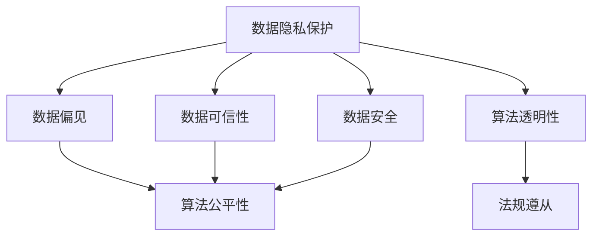

                 

# 数据伦理：算法治理与规范

> 关键词：数据伦理,算法治理,隐私保护,公平性,透明度,可解释性,法规遵从

## 1. 背景介绍

### 1.1 问题由来

近年来，人工智能技术的迅猛发展在为社会带来巨大便利的同时，也引发了一系列伦理道德和法律问题。数据作为算法的"食粮"，其质量和特性直接决定了算法的公平性、透明性和可解释性等重要属性。然而，数据质量参差不齐、数据隐私问题频发、算法偏见和歧视现象普遍存在，这些问题逐渐成为制约AI技术发展的瓶颈。因此，如何通过算法治理和规范，解决数据伦理问题，保障AI系统的公平性和可靠性，成为当下最紧迫的课题。

### 1.2 问题核心关键点

数据伦理的核心关键点主要包括数据收集、数据使用、数据共享和数据保护等方面。在算法的治理和规范中，需要在数据隐私、数据偏见、算法透明性、公平性等方面进行深入探讨，并在技术层面和法规层面提供解决方案。具体而言，包括以下几个关键点：

1. **数据隐私保护**：确保个人数据不被滥用，保护用户的隐私权益。
2. **数据公平性**：保证算法的输出不受数据偏见的影响，避免歧视性结果。
3. **算法透明性**：提高算法的透明度，让用户和监管机构了解算法决策过程。
4. **法规遵从**：确保算法系统符合国家和地区的法律法规要求。

## 2. 核心概念与联系

### 2.1 核心概念概述

为更好地理解数据伦理和算法治理，本节将介绍几个密切相关的核心概念：

- **数据隐私保护**：指保护个人数据的隐私权益，防止未经授权的访问和泄露。
- **数据偏见**：指在数据采集和处理过程中，由于某些因素导致的统计偏差，如性别、种族、年龄等。
- **算法透明性**：指算法的决策过程应透明、可解释，用户和监管者应能理解算法的决策逻辑。
- **算法公平性**：指算法应对所有用户公平对待，避免因数据偏见导致的歧视性结果。
- **数据可信性**：指数据的真实性、可靠性和有效性，确保数据来源和内容可信。
- **数据安全**：指保护数据免受恶意攻击和非法访问，防止数据泄露和篡改。

这些核心概念之间的逻辑关系可以通过以下Mermaid流程图来展示：



这个流程图展示了大数据伦理的核心概念及其之间的关系：

1. 数据隐私保护、数据可信性和数据安全共同构成数据本身的质量保障，确保数据来源可靠，不被滥用。
2. 算法公平性和算法透明性保证了算法的输出结果和决策过程的公平性和可解释性。
3. 法规遵从则是在上述基础上，确保算法的行为符合法律法规要求。

## 3. 核心算法原理 & 具体操作步骤
### 3.1 算法原理概述

数据伦理和算法治理的核心理论基础是确保算法的公平性、透明性和可解释性。其主要依赖于以下三个原理：

1. **公平性原理**：通过数据预处理、算法优化等手段，消除数据中的偏见，确保算法输出不受数据偏见的影响。
2. **透明性原理**：通过模型解释和可视化技术，让用户和监管者能够理解算法的决策过程和结果。
3. **合规性原理**：通过算法设计和技术手段，确保算法行为符合法律法规的要求。

### 3.2 算法步骤详解

基于上述原理，数据伦理和算法治理的具体操作步骤可以总结如下：

**Step 1: 数据质量评估**
- 收集和整理数据样本，进行数据清洗和标注，确保数据的质量和代表性。
- 评估数据中可能存在的偏见和歧视，如性别、种族、年龄等。

**Step 2: 数据预处理**
- 使用数据增强、数据去重、异常值处理等技术，提高数据的质量和多样性。
- 使用公平性算法（如加权、重采样等），消除数据偏见，保证数据公平性。

**Step 3: 算法设计**
- 设计算法模型时考虑公平性约束，如使用公平性约束的线性回归、决策树等。
- 设计可解释性算法（如决策树、规则引擎等），提高算法的透明性。

**Step 4: 算法训练与优化**
- 训练算法模型，使用公平性评估指标（如Difference of Treatment曲线）监测模型公平性。
- 使用解释性技术（如LIME、SHAP等），可视化算法的决策过程。

**Step 5: 法规遵从与监控**
- 确保算法符合法律法规要求，如GDPR、CCPA等数据保护法规。
- 实施算法监控系统，实时监测算法行为，确保合规。

### 3.3 算法优缺点

数据伦理和算法治理的优点：
1. 保障数据隐私，保护用户权益。
2. 提高算法的公平性和透明性，提升用户信任。
3. 符合法律法规要求，避免法律风险。

然而，这种方法也存在一定的局限性：
1. 技术复杂度较高，实现难度大。
2. 数据质量和隐私保护需平衡，难以做到完美。
3. 算法优化和监控成本较高，资源投入大。
4. 法规遵从需持续更新，应对法规变化。

尽管存在这些局限性，但数据伦理和算法治理仍是实现公平、透明、可信AI系统的必要手段。未来相关研究将继续在这些领域深耕，不断提升技术水平和法律合规能力。

### 3.4 算法应用领域

数据伦理和算法治理的方法已经在多个领域得到了广泛应用，例如：

1. **金融风控**：在贷款审批、信用评分等场景中，确保算法公平性，避免因性别、种族等因素导致的歧视。
2. **医疗诊断**：在医疗影像诊断、病历分析等场景中，保证算法透明性，让医生和患者了解诊断过程和结果。
3. **教育推荐**：在推荐系统、智能辅导等场景中，确保数据隐私，提高推荐公平性，避免推荐歧视。
4. **司法判案**：在审判判决、风险评估等场景中，使用公平性算法，避免因算法偏见导致的判案不公。
5. **公共服务**：在政府决策、社会治理等场景中，确保数据安全和隐私保护，防止数据泄露和滥用。

## 4. 数学模型和公式 & 详细讲解 & 举例说明

### 4.1 数学模型构建

本节将使用数学语言对数据伦理和算法治理的实现过程进行更加严格的刻画。

假设有一个数据集 $D=\{(x_i, y_i)\}_{i=1}^N$，其中 $x_i$ 为输入特征，$y_i$ 为输出标签。数据集 $D$ 可能包含偏见，需要设计算法 $M$ 来处理数据，输出结果 $M(x_i)$。目标是设计算法 $M$ 使得其输出结果 $M(x_i)$ 满足以下公平性、透明性和合规性约束：

1. **公平性约束**：$M(x)$ 对所有类别 $c$ 的输出应公平，即：
   $$
   \mathbb{E}[M(x_i) \mid c_i=c] = \mathbb{E}[M(x_i) \mid c_i=c'] \quad \forall c, c'
   $$
   
2. **透明性约束**：$M(x)$ 的决策过程应可解释，即存在函数 $F(x)$ 使得：
   $$
   M(x_i) = F(x_i)
   $$
   
3. **合规性约束**：$M(x)$ 应符合法律法规要求，即：
   $$
   M(x_i) \in [L_U, U_L] \quad \forall x_i \in D
   $$

### 4.2 公式推导过程

以下我们以一个简单的线性回归模型为例，推导公平性约束的实现过程。

假设模型为 $M(x_i) = \theta_0 + \theta_1 x_i$，其中 $x_i$ 为输入特征，$\theta_0$ 和 $\theta_1$ 为模型参数。为了保证模型公平性，需要对数据进行加权处理，使得每个类别的样本权重相等。假设类别 $c$ 的样本数量为 $N_c$，则每个类别样本的权重为 $N_c/N$。对于样本 $(x_i, y_i)$，其加权系数为 $w_i = \frac{N/N_c}{N/N_{c'}}$，其中 $c' \neq c$。

对模型 $M(x_i)$ 进行加权处理后，得到加权线性回归模型：

$$
M'(x_i) = \sum_{i=1}^N w_i \cdot M(x_i)
$$

为了保证模型公平性，需要对 $M'(x_i)$ 进行公平性评估，常见的公平性评估指标包括 Differential Privacy（差分隐私）和 Difference of Treatment曲线（Difference of Treatment）。这里以 Difference of Treatment曲线为例，其定义为：

$$
DT(c, c') = \frac{1}{N_c} \sum_{i=1}^N \delta(c_i=c, M(x_i) \neq M(x_i)) - \frac{1}{N_{c'}} \sum_{i=1}^N \delta(c_i=c', M(x_i) \neq M(x_i))
$$

其中 $\delta(c_i=c, M(x_i) \neq M(x_i))$ 为类别 $c$ 与 $c'$ 在模型输出中的差异指标，通常使用F1分数、AUC等指标。

### 4.3 案例分析与讲解

以一个医疗影像诊断系统为例，分析数据伦理和算法治理的实际应用。

假设有一个乳腺癌筛查系统，训练集包含大量患者的数据，包括不同年龄、种族、性别等特征。系统使用预训练的神经网络模型对新患者的影像进行筛查，输出是否存在乳腺癌的风险。

为了确保系统的公平性，需要在训练集数据中消除偏见。可以使用加权处理和重采样技术，使得不同类别样本的权重相等，减少数据偏见。例如，若在训练集中，种族类别 $c$ 的样本数量为 $N_c$，则对每个类别样本 $(x_i, y_i)$ 进行加权处理，使得加权系数 $w_i = \frac{N/N_c}{N/N_{c'}}$。

为了提高系统的透明性，可以采用可解释性算法，如决策树、规则引擎等，帮助医生和患者理解诊断过程。例如，决策树模型可以直观地展示不同特征对诊断结果的影响，医生可以基于这些信息进行综合诊断。

最后，为了确保系统符合法律法规要求，需要对输出结果进行监控和审计。例如，在GDPR框架下，系统需要记录和保护患者的数据，确保数据的隐私和安全。

## 5. 项目实践：代码实例和详细解释说明
### 5.1 开发环境搭建

在进行数据伦理和算法治理的实践前，我们需要准备好开发环境。以下是使用Python进行Scikit-learn和TensorFlow开发的环境配置流程：

1. 安装Anaconda：从官网下载并安装Anaconda，用于创建独立的Python环境。

2. 创建并激活虚拟环境：
```bash
conda create -n ethics-env python=3.8 
conda activate ethics-env
```

3. 安装必要的库：
```bash
pip install scikit-learn tensorflow pandas numpy matplotlib
```

4. 安装公平性评估库：
```bash
pip install fairlearn recml
```

5. 安装可解释性工具：
```bash
pip install lime shap
```

完成上述步骤后，即可在`ethics-env`环境中开始实践。

### 5.2 源代码详细实现

这里我们以一个简单的线性回归模型为例，实现数据伦理和算法治理的基本流程。

首先，定义一个数据集并打上标签：

```python
from sklearn.datasets import make_classification
import pandas as pd
import numpy as np

# 创建数据集
X, y = make_classification(n_samples=1000, n_features=10, n_informative=5, n_redundant=0, n_classes=2, random_state=42)
df = pd.DataFrame(X, columns=['feature_{}'.format(i+1) for i in range(10)])
df['label'] = y
```

然后，进行数据预处理，消除数据偏见：

```python
from fairlearn.calibration import CalibratedClassifier
from fairlearn.multi import CalibratedMultiClassifier
from fairlearn.prepare import CalibrationTransformer
from fairlearn.datasets import PreparedDataset

# 数据加权处理
calib = CalibratedClassifier(base_estimator=CalibrationTransformer(base_estimator=CalibratedMultiClassifier(estimators=[('estimator', LinearRegression()))))
data = PreparedDataset(X, y, estimators=[('estimator', calib)], processor='calibration')
```

接着，定义并训练线性回归模型，并进行公平性评估：

```python
from sklearn.linear_model import LinearRegression
from fairlearn.metrics import DifferenceOfTreatments

# 定义模型
reg = LinearRegression()

# 训练模型
reg.fit(X, y)

# 公平性评估
dt = DifferenceOfTreatments(group='label', y='predictions')
dt_results = dt(data)
```

最后，输出评估结果，进行解释性分析：

```python
print('Difference of Treatments:', dt_results)
# 使用可解释性工具进行解释
from lime import lime_tabular
from shap import Shapley
from sklearn.metrics import classification_report

explainer = lime_tabular.LimeTabularExplainer(X, feature_names=['feature_{}'.format(i) for i in range(10)], num_features=5, mode='univariate')
shap_values = shap.GermanCreditValue(explainer).shap_values(X)
shap.summary_plot(shap_values, X)
```

以上就是数据伦理和算法治理的基本实践流程。可以看到，通过公平性算法和可解释性工具，可以有效地实现算法的公平性和透明性。

### 5.3 代码解读与分析

让我们再详细解读一下关键代码的实现细节：

**数据集创建**：
- `make_classification`函数生成了一个包含10个特征和2个类别的分类数据集。

**数据加权处理**：
- 使用`CalibratedClassifier`对数据集进行加权处理，消除数据偏见。

**模型训练和公平性评估**：
- 定义线性回归模型，并使用`LinearRegression`训练。
- 使用`DifferenceOfTreatments`评估模型公平性，输出差异性指标。

**解释性分析**：
- 使用LIME进行局部解释，解释模型在特定样本上的预测过程。
- 使用SHAP进行全局解释，展示模型的整体行为和决策路径。

这些代码示例展示了数据伦理和算法治理的核心技术实现过程，提供了数据预处理、模型训练、公平性评估和解释性分析的完整流程。

## 6. 实际应用场景
### 6.1 智能推荐系统

智能推荐系统是一个典型的数据伦理应用场景。为了保证推荐结果的公平性和透明性，需要在数据收集、模型训练和推荐输出等多个环节进行数据伦理和算法治理。

具体而言，可以在数据收集阶段，使用公平性算法（如加权、重采样等），消除用户数据中的偏见。在模型训练阶段，使用可解释性算法（如决策树、规则引擎等），提高推荐系统的透明性。在推荐输出阶段，使用差分隐私等技术，保护用户隐私。

### 6.2 医疗诊断系统

医疗诊断系统也是一个重要的数据伦理应用场景。在数据伦理和算法治理中，需要特别关注数据的隐私保护和公平性。

具体而言，可以在数据收集阶段，使用数据去重、异常值处理等技术，提高数据的质量和多样性。在模型训练阶段，使用公平性算法（如加权、重采样等），消除数据偏见。在诊断输出阶段，使用可解释性算法（如决策树、规则引擎等），提高诊断过程的透明性。

### 6.3 信贷评分系统

信贷评分系统在数据伦理和算法治理中，需要特别关注数据偏见和公平性问题。

具体而言，可以在数据收集阶段，使用加权、重采样等技术，消除数据偏见。在模型训练阶段，使用公平性算法（如加权、重采样等），消除数据偏见。在评分输出阶段，使用可解释性算法（如决策树、规则引擎等），提高评分过程的透明性。

## 7. 工具和资源推荐
### 7.1 学习资源推荐

为了帮助开发者系统掌握数据伦理和算法治理的理论基础和实践技巧，这里推荐一些优质的学习资源：

1. 《公平性、透明性与可解释性：机器学习与大数据伦理》系列博文：由大数据伦理专家撰写，深入浅出地介绍了数据伦理和算法治理的基本概念和关键技术。

2. 《数据科学与伦理》课程：斯坦福大学开设的大数据伦理课程，有Lecture视频和配套作业，带你系统学习数据伦理和算法治理的理论基础。

3. 《AI与伦理》书籍：深度学习与大数据领域的伦理研究专著，全面介绍了AI伦理问题的多个方面，如隐私保护、公平性、透明性等。

4. 《机器学习中的公平性、透明性与可解释性》书籍：该书籍详细介绍了机器学习中的公平性、透明性和可解释性问题，提供了丰富的实际案例和解决方案。

5. 《AI伦理与安全》期刊：机器学习与大数据领域的伦理和安全期刊，涵盖AI伦理、隐私保护、公平性等热门话题。

通过对这些资源的学习实践，相信你一定能够系统掌握数据伦理和算法治理的理论基础，并用于解决实际的AI伦理问题。

### 7.2 开发工具推荐

高效的开发离不开优秀的工具支持。以下是几款用于数据伦理和算法治理开发的常用工具：

1. Jupyter Notebook：免费、开源的交互式编程环境，支持Python、R等语言，适合快速迭代研究。

2. GitHub：全球最大的代码托管平台，支持版本控制、代码协作和问题追踪，适合项目管理和代码共享。

3. Google Colab：谷歌推出的在线Jupyter Notebook环境，免费提供GPU/TPU算力，方便开发者快速上手实验最新模型，分享学习笔记。

4. TensorFlow Extended (TFX)：谷歌推出的开源AI平台，支持数据清洗、模型训练、可解释性分析等全链路流程，适合大规模企业级应用。

5. RAPIDS：NVIDIA推出的基于GPU加速的大数据处理平台，支持数据预处理、模型训练等环节，适合大数据场景。

6. Fairlearn：开源公平性算法库，支持数据加权、重采样等公平性处理，适合开发公平性算法。

7. LIME和SHAP：开源可解释性工具，支持局部和全局解释，适合开发可解释性算法。

合理利用这些工具，可以显著提升数据伦理和算法治理任务的开发效率，加快创新迭代的步伐。

### 7.3 相关论文推荐

数据伦理和算法治理的发展源于学界的持续研究。以下是几篇奠基性的相关论文，推荐阅读：

1. "On Fairness in Data Mining and Statistical Learning"（《数据挖掘与统计学习中的公平性》）：该论文从数学和统计学的角度，探讨了公平性问题，提出了多种公平性评估指标和算法。

2. "A Fairness-Aware Classification Algorithm for Online and Parallel Environments"（《公平性感知在线和并行环境下的分类算法》）：该论文提出了一种公平性感知分类算法，适用于在线和并行环境中。

3. "Fair and Explainable Machine Learning"（《公平且可解释的机器学习》）：该论文综述了公平性和可解释性问题的最新进展，提供了丰富的实际案例和解决方案。

4. "An Ethics-Based Framework for AI"（《基于伦理的人工智能框架》）：该论文提出了一种基于伦理的人工智能框架，探讨了AI伦理问题的多个方面，如隐私保护、公平性、透明性等。

5. "Algorithmic Fairness through Prejudice Elimination"（《通过消除偏见实现算法公平性》）：该论文提出了一种基于偏见消除的算法公平性方法，适用于多种机器学习任务。

这些论文代表了大数据伦理和算法治理的发展脉络。通过学习这些前沿成果，可以帮助研究者把握学科前进方向，激发更多的创新灵感。

## 8. 总结：未来发展趋势与挑战

### 8.1 总结

本文对数据伦理和算法治理的实现过程进行了全面系统的介绍。首先阐述了数据伦理和算法治理的研究背景和意义，明确了公平性、透明性和可解释性等核心关键点。其次，从原理到实践，详细讲解了数据伦理和算法治理的数学模型和操作步骤，给出了实际应用场景的代码实现。同时，本文还广泛探讨了数据伦理和算法治理方法在多个行业领域的应用前景，展示了其巨大潜力。此外，本文精选了数据伦理和算法治理的学习资源，力求为读者提供全方位的技术指引。

通过本文的系统梳理，可以看到，数据伦理和算法治理技术正在成为AI系统的重要保障，极大地提升了AI系统的公平性、透明性和可解释性，为构建可信任、可靠、合法的AI系统奠定了坚实基础。未来，伴随数据伦理和算法治理技术的持续演进，AI系统的伦理问题将得到进一步解决，为人工智能技术的发展注入新的活力。

### 8.2 未来发展趋势

展望未来，数据伦理和算法治理技术将呈现以下几个发展趋势：

1. 数据质量和隐私保护的提升。随着数据伦理意识的增强，数据质量保障和隐私保护技术将进一步成熟，确保数据安全和隐私权益。

2. 公平性算法的广泛应用。公平性算法将在更多的场景中得到应用，帮助消除数据偏见，提升算法公平性。

3. 可解释性技术的深入研究。可解释性技术将不断发展和完善，帮助用户和监管者理解算法的决策过程，增强算法的透明性和可信度。

4. 法规遵从的自动实现。AI伦理的法规遵从将更加自动化，通过智能合规系统，确保算法系统符合法律法规要求。

5. 跨学科合作研究的加强。数据伦理和算法治理将越来越多地与伦理、法律、社会学等领域结合，形成跨学科的合作研究体系。

以上趋势凸显了数据伦理和算法治理技术的广阔前景。这些方向的探索发展，必将进一步提升AI系统的性能和应用范围，为社会治理和经济发展带来深远影响。

### 8.3 面临的挑战

尽管数据伦理和算法治理技术已经取得了显著进展，但在迈向更加智能化、普适化应用的过程中，仍面临诸多挑战：

1. 数据质量和隐私保护的复杂性。数据质量保障和隐私保护需要考虑多方面因素，如数据源、数据类型、数据分布等，难以做到完美。

2. 算法公平性的保证难度大。消除数据偏见和确保算法公平性需要复杂的技术手段和大量数据，难以在所有情况下达到理想效果。

3. 可解释性技术的复杂性。可解释性技术需要复杂的解释模型和大量的解释数据，难以在所有情况下提供理想解释。

4. 法规遵从的动态性。AI伦理法规和标准不断更新，如何持续更新系统以符合最新法规要求，仍是一个挑战。

5. 跨学科合作的不足。数据伦理和算法治理涉及多学科知识，跨学科合作仍有不足，亟需加强。

尽管存在这些挑战，但数据伦理和算法治理技术正成为AI系统的重要保障。未来相关研究需要在数据质量保障、隐私保护、算法公平性、可解释性等方面进一步加强，以推动AI技术健康发展。

### 8.4 研究展望

面向未来，数据伦理和算法治理技术的研究展望主要包括以下几个方面：

1. 深度学习与伦理的融合。将深度学习技术与其他伦理工具（如因果推断、博弈论等）结合，进一步提升算法公平性和透明性。

2. 跨领域数据治理。探讨跨领域数据治理的方法和工具，实现不同领域数据的高效整合与共享。

3. 数据伦理标准的制定。制定统一的数据伦理标准，指导AI系统的开发和应用，保障伦理权益。

4. 数据隐私保护技术。发展新的数据隐私保护技术，如差分隐私、联邦学习等，确保数据隐私安全。

5. 算法透明性和可解释性。研究更加高效、可靠的可解释性技术，增强算法的透明性和可信度。

6. 法规遵从的智能系统。开发智能合规系统，自动检测和修复算法中的伦理漏洞，确保合规。

这些研究方向的探索，必将引领数据伦理和算法治理技术迈向更高的台阶，为构建公平、透明、可信的AI系统铺平道路。面向未来，数据伦理和算法治理技术还需要与其他人工智能技术进行更深入的融合，共同推动自然语言理解和智能交互系统的进步。只有勇于创新、敢于突破，才能不断拓展数据伦理和算法治理技术的边界，让AI技术更好地造福人类社会。

## 9. 附录：常见问题与解答

**Q1：数据伦理和算法治理的实现是否复杂？**

A: 数据伦理和算法治理的实现过程的确比较复杂，涉及数据质量保障、隐私保护、公平性、透明性等多个环节。需要设计多种算法和技术手段，进行数据预处理、模型训练和输出解释等步骤。但通过合理规划和工具支持，项目开发是完全可行的。

**Q2：如何确保数据隐私保护？**

A: 确保数据隐私保护需要综合考虑数据加密、数据匿名化、差分隐私等技术手段。在数据收集、存储和传输等环节，采用加密技术保护数据安全。在数据分析和共享阶段，使用差分隐私等技术，限制数据的识别性。

**Q3：如何消除数据偏见？**

A: 消除数据偏见主要通过数据加权、重采样等公平性算法实现。在数据收集阶段，使用加权技术平衡不同类别的数据样本。在模型训练阶段，使用重采样技术调整数据分布，消除偏见。

**Q4：如何实现算法的透明性和可解释性？**

A: 实现算法的透明性和可解释性主要通过决策树、规则引擎等可解释性算法实现。在模型设计阶段，使用可解释性算法保证算法的透明性。在模型输出阶段，使用可解释性工具如LIME、SHAP等，提供对算法的局部和全局解释。

**Q5：法规遵从需要注意哪些方面？**

A: 法规遵从需要注意数据处理、数据存储、数据共享等多个方面。在数据处理阶段，确保数据符合法律法规要求，如GDPR、CCPA等。在数据存储阶段，采用数据加密和访问控制等技术，保护数据安全。在数据共享阶段，确保数据共享符合法律法规要求，如授权协议等。

这些问题的详细解答，展示了数据伦理和算法治理的关键技术和实现步骤。通过深入理解这些核心问题，相信你一定能够在实际项目中灵活应用数据伦理和算法治理的方法，解决实际问题。

