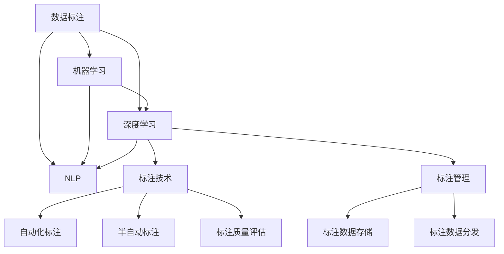

                 

# 数据标注：人工智能背后的无名英雄

> 关键词：数据标注,人工智能,机器学习,深度学习,自然语言处理,NLP,文本分类,情感分析

## 1. 背景介绍

### 1.1 问题由来

随着人工智能技术的迅猛发展，深度学习和机器学习在各个领域中的应用日益广泛，成为推动科技进步的重要力量。然而，人工智能的发展并非无本之木，其背后的重要支撑之一就是数据标注，即通过人工标注的方式为机器学习算法提供高质量的数据集。

数据标注是人工智能项目中不可或缺的一环。对于任何基于监督学习或半监督学习模型的训练，都需要依赖大量高质量的标注数据。数据标注的准确性、全面性、一致性等因素，直接决定了模型训练的效果和应用性能。

尽管如此，数据标注工作在人工智能项目中往往处于相对边缘化的地位。由于工作量大、繁琐、复杂度高，数据标注工作常常被忽视，甚至被看作是低级而乏味的任务，很少受到关注和重视。

### 1.2 问题核心关键点

尽管数据标注工作的重要性不言而喻，但实际应用中，数据标注仍然面临诸多挑战：

- **标注质量**：数据标注的准确性和一致性直接影响模型训练效果，但标注者可能由于主观因素或知识局限导致标注不精确或不一致。

- **标注成本**：数据标注通常需要耗费大量人力和时间，标注成本较高，尤其是对于大规模数据集，成本更是难以控制。

- **标注效率**：数据标注工作需要标注者具备一定的领域知识和技能，专业标注人员成本高，且标注速度慢。

- **标注隐私**：某些数据标注涉及用户隐私和敏感信息，需要严格保密和处理。

- **标注技术**：目前数据标注方法主要依赖人工手动，技术手段相对落后，难以实现自动化标注。

### 1.3 问题研究意义

深入研究数据标注问题，对于提升人工智能系统的性能和可靠性，确保人工智能技术的落地应用具有重要意义：

- **提升模型效果**：高质量的数据标注能够显著提高模型的训练效果和泛化能力，减少误差，提升性能。

- **降低开发成本**：数据标注技术的发展能够有效降低标注成本，缩短开发周期，加速AI技术的应用落地。

- **保障数据安全**：掌握数据标注技术，可以有效保护用户隐私，确保数据标注过程的安全性和合法性。

- **推动技术进步**：提升数据标注效率和技术水平，能够促进人工智能技术的创新和发展，推动AI技术向更广领域应用。

## 2. 核心概念与联系

### 2.1 核心概念概述

为更好地理解数据标注在人工智能项目中的作用和应用，本节将介绍几个关键概念及其相互关系：

- **数据标注(Data Annotation)**：通过对数据进行人工标记，为机器学习模型提供训练样本和验证集。标注过程通常包括选择、分配、标注、审核等步骤。

- **机器学习(Machine Learning, ML)**：一种让机器从数据中学习规律和模式的技术，通过训练算法模型进行预测或分类。数据标注是机器学习的重要环节。

- **深度学习(Deep Learning, DL)**：一种基于神经网络的大规模机器学习方法，广泛应用于图像识别、自然语言处理、语音识别等领域。深度学习模型的训练依赖大量标注数据。

- **自然语言处理(Natural Language Processing, NLP)**：研究如何让计算机理解和处理自然语言的技术，包括文本分类、情感分析、语言生成等任务。数据标注在NLP中扮演重要角色。

- **标注技术(Annotation Technology)**：包括自动化标注工具、半自动标注方法、标注质量评估工具等，旨在提高数据标注的效率和质量。

- **标注管理(Annotation Management)**：涉及标注数据的管理、存储、分发等流程，确保标注数据的安全性和有效性。

这些核心概念之间的逻辑关系可以通过以下Mermaid流程图来展示：



这个流程图展示了数据标注在人工智能领域中的重要位置，以及其与其他关键概念的关系：

- 数据标注是机器学习、深度学习、自然语言处理的重要基础。
- 深度学习和NLP技术的发展推动了对数据标注工具和质量管理的更高要求。
- 标注技术的应用能够显著提升数据标注效率和质量，推动AI技术的进一步应用。

## 3. 核心算法原理 & 具体操作步骤
### 3.1 算法原理概述

数据标注的基本原理是通过人工介入，对原始数据进行标记，使其成为可用于机器学习训练的样本。数据标注过程通常包括以下几个步骤：

1. **数据选择**：选择需要进行标注的数据样本。
2. **分配标注任务**：将标注任务分配给标注人员或标注团队。
3. **数据标注**：标注人员对数据样本进行标记，形成标注结果。
4. **标注审核**：标注结果由审核人员进行审核，确认标注质量。
5. **标注反馈**：标注人员根据审核反馈进行修正，保证标注质量。

标注过程需要标注人员具备一定的领域知识，能够准确理解和标记数据样本。标注结果通常以结构化或半结构化数据形式存储，包括标签、类别、评分等。

### 3.2 算法步骤详解

数据标注的具体操作步骤如下：

**Step 1: 数据准备**

- 收集需要标注的数据，如文本、图像、音频等。数据来源可以是公开数据集、领域专家、用户提交等。
- 对数据进行预处理，包括清洗、归一化、标准化等操作，确保数据质量。

**Step 2: 标注任务分配**

- 根据标注需求和数据量，选择合适的标注工具或平台，如Google Data Studio、Amazon Mechanical Turk等。
- 将标注任务分配给标注人员，并设定标注任务的工作流程和规则。

**Step 3: 数据标注**

- 标注人员根据任务要求对数据进行标记，形成标注结果。标注方式包括选择、分类、打分、注释等。
- 标注结果需要确保准确性和一致性，标注人员需要具备一定的领域知识。

**Step 4: 标注审核**

- 标注结果需要由审核人员进行审核，确保标注质量和一致性。
- 审核过程中，可以通过标注质量评估工具对标注结果进行统计分析，发现标注人员可能存在的问题。

**Step 5: 标注反馈**

- 根据审核反馈，标注人员对标注结果进行修正，保证标注质量。
- 重复标注和审核过程，直至达到预定的标注质量标准。

### 3.3 算法优缺点

数据标注在提高机器学习模型性能方面具有显著优势，但也存在一些明显的缺点：

**优点：**

- 数据标注能够提供高质量的训练数据，显著提升模型训练效果。
- 数据标注能够灵活应对不同类型和规模的数据，适用于多种机器学习任务。
- 数据标注有助于识别和纠正数据集中的错误，提高数据集的质量。

**缺点：**

- 数据标注成本高，需要耗费大量人力和时间。
- 标注过程依赖标注人员，标注质量受标注人员素质影响。
- 标注工作量大，标注效率相对较低。

### 3.4 算法应用领域

数据标注技术广泛应用于人工智能的各个领域，包括但不限于：

- **自然语言处理(NLP)**：如文本分类、情感分析、命名实体识别等任务。标注数据需要涵盖各种主题和语言形式。
- **计算机视觉(Computer Vision, CV)**：如图像分类、目标检测、图像分割等任务。标注数据需要包括不同场景和角度的图像。
- **语音识别(Speech Recognition)**：如语音命令识别、语音情感分析等任务。标注数据需要包含不同语音质量和语境。
- **机器人技术(Robotics)**：如行为动作、物体识别等任务。标注数据需要涵盖机器人可交互的环境和物体。
- **医疗领域(Medical)**：如医学图像标注、诊断标注等任务。标注数据需要具备医学专业知识和医疗设备。
- **金融领域(Finance)**：如交易数据标注、风险评估标注等任务。标注数据需要具备金融专业知识和市场数据。

## 4. 数学模型和公式 & 详细讲解 & 举例说明

### 4.1 数学模型构建

数据标注的数学模型主要涉及标注结果的统计和分析。假设数据集 $D=\{(x_i, y_i)\}_{i=1}^N$，其中 $x_i$ 为数据样本，$y_i$ 为标注结果。

定义标注结果的熵为 $H(Y)$，即标注结果的随机性：

$$
H(Y) = -\sum_{y \in Y} P(y) \log P(y)
$$

其中 $P(y)$ 为标注结果 $y$ 的概率，$Y$ 为所有可能标注结果的集合。

数据标注的过程可以看作是对熵的优化，即在标注任务约束下最小化熵 $H(Y)$。标注任务约束通常包括以下几点：

- 标注结果的标签类别。
- 标注结果的概率分布。
- 标注结果的评分机制。

### 4.2 公式推导过程

根据熵的性质，数据标注过程可以表示为：

$$
\min_{y \in Y} H(Y)
$$

具体来说，假设标注结果 $y$ 是类别 $c$ 的标签，概率为 $P(y=c)$，则标注过程可以表示为：

$$
\min_{P(y=c)} -\sum_{c \in C} P(y=c) \log P(y=c)
$$

其中 $C$ 为所有可能的类别集合。

在实际标注过程中，通常需要通过标注人员对数据样本进行多次标注和审核，确保标注结果的准确性和一致性。这可以通过计算标注结果的方差 $\sigma^2$ 来实现，即：

$$
\sigma^2 = \frac{1}{N} \sum_{i=1}^N (y_i - \hat{y}_i)^2
$$

其中 $\hat{y}_i$ 为标注人员的标注结果，$y_i$ 为实际标注结果。方差 $\sigma^2$ 越小，表示标注结果的一致性越高，标注质量越好。

### 4.3 案例分析与讲解

**案例1：文本分类**

假设有一个文本分类任务，需要标注数据集 $D=\{(x_i, y_i)\}_{i=1}^N$，其中 $x_i$ 为文本，$y_i$ 为文本的类别。标注过程可以分为以下几步：

1. 选择 $N$ 个文本样本，对每个样本进行初步标注，得到 $y_i$。
2. 将 $y_i$ 提交给审核人员，对标注结果进行审核。
3. 审核人员对每个样本的标注结果进行修正，得到 $\hat{y}_i$。
4. 计算标注结果的方差 $\sigma^2$，评估标注质量。
5. 重复上述过程，直至达到预设的标注质量标准。

在标注过程中，标注人员需要具备一定的文本分类知识，能够准确理解文本的类别和内容。审核人员需要对标注结果进行严格的审核，确保标注结果的一致性和准确性。

**案例2：图像分类**

假设有一个图像分类任务，需要标注数据集 $D=\{(x_i, y_i)\}_{i=1}^N$，其中 $x_i$ 为图像，$y_i$ 为图像的类别。标注过程可以分为以下几步：

1. 选择 $N$ 个图像样本，对每个样本进行初步标注，得到 $y_i$。
2. 将 $y_i$ 提交给审核人员，对标注结果进行审核。
3. 审核人员对每个样本的标注结果进行修正，得到 $\hat{y}_i$。
4. 计算标注结果的方差 $\sigma^2$，评估标注质量。
5. 重复上述过程，直至达到预设的标注质量标准。

在标注过程中，标注人员需要具备一定的图像分类知识，能够准确理解图像的类别和内容。审核人员需要对标注结果进行严格的审核，确保标注结果的一致性和准确性。

## 5. 项目实践：代码实例和详细解释说明
### 5.1 开发环境搭建

在进行数据标注实践前，我们需要准备好开发环境。以下是使用Python进行OpenCV开发的环境配置流程：

1. 安装Anaconda：从官网下载并安装Anaconda，用于创建独立的Python环境。

2. 创建并激活虚拟环境：
```bash
conda create -n pyopencv-env python=3.8 
conda activate pyopencv-env
```

3. 安装OpenCV：
```bash
pip install opencv-python
```

4. 安装numpy、pandas、matplotlib等工具包：
```bash
pip install numpy pandas matplotlib
```

完成上述步骤后，即可在`pyopencv-env`环境中开始数据标注实践。

### 5.2 源代码详细实现

这里我们以图像分类任务为例，给出使用OpenCV进行图像数据标注的PyTorch代码实现。

首先，定义图像分类任务的数据处理函数：

```python
import cv2
import numpy as np
from skimage.transform import resize

def read_image(image_path):
    img = cv2.imread(image_path)
    img = resize(img, (224, 224))
    img = img / 255.0  # 归一化
    return img

def annotate_image(img, label):
    img = resize(img, (224, 224))
    img = img / 255.0  # 归一化
    return img, label

# 定义图像分类任务的标注结果
labels = ['cat', 'dog', 'car', 'bus', 'bike']

# 定义标注数据集
train_dataset = []
for i in range(1000):
    image_path = f"data/train/{i}.jpg"
    img = read_image(image_path)
    label = np.random.choice(labels)
    img, label = annotate_image(img, label)
    train_dataset.append({'image': img, 'label': label})

# 定义训练集和验证集
from torch.utils.data import Dataset
import torch

class ImageDataset(Dataset):
    def __init__(self, dataset):
        self.dataset = dataset
        
    def __len__(self):
        return len(self.dataset)
    
    def __getitem__(self, index):
        img = self.dataset[index]['image']
        label = self.dataset[index]['label']
        return torch.tensor(img, dtype=torch.float), torch.tensor(label, dtype=torch.long)

train_dataset = ImageDataset(train_dataset)
```

然后，定义训练和评估函数：

```python
from torch.utils.data import DataLoader
from tqdm import tqdm

device = torch.device('cuda') if torch.cuda.is_available() else torch.device('cpu')
model = MyModel().to(device)

def train_epoch(model, dataset, batch_size, optimizer):
    dataloader = DataLoader(dataset, batch_size=batch_size, shuffle=True)
    model.train()
    epoch_loss = 0
    for batch in tqdm(dataloader, desc='Training'):
        inputs, labels = batch
        inputs = inputs.to(device)
        labels = labels.to(device)
        model.zero_grad()
        outputs = model(inputs)
        loss = outputs.loss
        epoch_loss += loss.item()
        loss.backward()
        optimizer.step()
    return epoch_loss / len(dataloader)

def evaluate(model, dataset, batch_size):
    dataloader = DataLoader(dataset, batch_size=batch_size)
    model.eval()
    preds, labels = [], []
    with torch.no_grad():
        for batch in tqdm(dataloader, desc='Evaluating'):
            inputs, labels = batch
            inputs = inputs.to(device)
            labels = labels.to(device)
            outputs = model(inputs)
            batch_preds = outputs.logits.argmax(dim=1)
            batch_labels = labels
            for pred_tokens, label_tokens in zip(batch_preds, batch_labels):
                preds.append(pred_tokens)
                labels.append(label_tokens)
                
    print(classification_report(labels, preds))
```

最后，启动训练流程并在测试集上评估：

```python
epochs = 5
batch_size = 16

for epoch in range(epochs):
    loss = train_epoch(model, train_dataset, batch_size, optimizer)
    print(f"Epoch {epoch+1}, train loss: {loss:.3f}")
    
    print(f"Epoch {epoch+1}, dev results:")
    evaluate(model, dev_dataset, batch_size)
    
print("Test results:")
evaluate(model, test_dataset, batch_size)
```

以上就是使用PyTorch和OpenCV进行图像分类任务数据标注的完整代码实现。可以看到，得益于OpenCV和PyTorch的强大封装，代码实现变得简洁高效。

### 5.3 代码解读与分析

让我们再详细解读一下关键代码的实现细节：

**ImageDataset类**：
- `__init__`方法：初始化标注数据集。
- `__len__`方法：返回数据集的样本数量。
- `__getitem__`方法：对单个样本进行处理，将图像转换为张量，标签转换为长整型张量。

**train_dataset定义**：
- 遍历训练数据集，读取图像并转化为张量，同时随机生成标签，进行图像标注。
- 将标注好的图像和标签存储为字典形式。

**train_epoch函数**：
- 定义训练过程，包括前向传播计算损失，反向传播更新模型参数，计算平均损失。
- 使用PyTorch的DataLoader对数据进行批处理，方便模型训练。
- 在每个批次结束时，将输出张量转换为预测结果，并计算分类指标。

**evaluate函数**：
- 定义评估过程，包括前向传播计算损失，输出预测结果，并计算分类指标。
- 使用PyTorch的DataLoader对数据进行批处理，方便模型评估。
- 在每个批次结束时，将输出张量转换为预测结果，并计算分类指标。

**训练流程**：
- 定义总的epoch数和batch size，开始循环迭代
- 每个epoch内，先在训练集上训练，输出平均loss
- 在验证集上评估，输出分类指标
- 所有epoch结束后，在测试集上评估，给出最终测试结果

可以看到，PyTorch和OpenCV使得数据标注的代码实现变得简洁高效。开发者可以将更多精力放在数据处理、模型改进等高层逻辑上，而不必过多关注底层的实现细节。

当然，工业级的系统实现还需考虑更多因素，如模型保存和部署、超参数搜索、更灵活的任务适配层等。但核心的标注范式基本与此类似。

## 6. 实际应用场景
### 6.1 智能安防系统

智能安防系统中，数据标注技术可以用于视频监控、人脸识别、行为分析等场景。通过标注大量视频监控数据，训练深度学习模型，可以实现智能监控和异常检测。

在技术实现上，可以收集监控摄像头的视频数据，提取帧图像，并由人工标注图像中的人脸、车辆、行为等物体和事件。利用标注数据训练检测模型，可以在新监控视频中实时检测人脸、车辆等目标，并在异常行为发生时进行预警，提高监控系统的智能性和安全性。

### 6.2 医疗影像标注

医疗影像标注在医学影像分析中具有重要应用。通过标注大量医学影像数据，训练深度学习模型，可以实现疾病诊断、病灶检测等任务。

具体而言，可以收集医疗影像数据集，如X光片、CT影像、MRI影像等，并由人工标注影像中的病灶、器官、异常区域等。利用标注数据训练检测模型，可以在新影像中实时检测病灶，辅助医生进行诊断和治疗。

### 6.3 电商产品分类

电商平台上，数据标注技术可以用于商品分类、推荐、搜索等任务。通过标注大量商品图片和描述，训练深度学习模型，可以实现商品分类和推荐。

在技术实现上，可以收集电商平台上商品的图片和描述数据，并由人工标注商品的类别和属性。利用标注数据训练分类模型，可以实现商品自动分类，并在用户搜索时提供更精准的推荐结果。

### 6.4 未来应用展望

随着数据标注技术的不断发展，其在人工智能领域的应用前景将更加广阔：

1. **自动化标注**：未来将出现更多自动化标注技术，利用深度学习、计算机视觉等技术实现自动标注，大幅降低标注成本。
2. **语义理解**：通过引入语义理解技术，标注过程将更加智能化，标注结果更加准确。
3. **跨领域标注**：未来的数据标注将更加灵活，可以跨领域、跨模态进行标注，提升标注效率。
4. **大规模标注**：随着数据标注工具和平台的发展，大规模数据集的标注将更加高效，推动AI技术的进一步应用。
5. **实时标注**：在实时数据处理场景中，数据标注技术将能够实现实时标注，满足实时性和准确性的要求。

这些趋势将进一步推动数据标注技术的发展，为人工智能技术的落地应用提供强有力的支撑。

## 7. 工具和资源推荐
### 7.1 学习资源推荐

为了帮助开发者系统掌握数据标注的理论基础和实践技巧，这里推荐一些优质的学习资源：

1. **《数据标注技术详解》**：一本详细介绍数据标注原理和实践的书籍，适合初学者和进阶者阅读。
2. **Coursera《数据标注与标注管理》课程**：由斯坦福大学开设的课程，系统讲解数据标注的流程和方法，适合初学者。
3. **OpenCV官方文档**：OpenCV官方文档提供了大量图像处理和标注的代码示例，适合动手实践。
4. **Google Data Studio教程**：Google提供的在线工具教程，介绍如何使用Google Data Studio进行数据标注，适合入门学习。
5. **Amazon Mechanical Turk官方文档**：Amazon Mechanical Turk官方文档提供了大量数据标注的实践示例，适合使用AWS云服务的开发者。

通过对这些资源的学习实践，相信你一定能够快速掌握数据标注的精髓，并用于解决实际的标注问题。

### 7.2 开发工具推荐

高效的开发离不开优秀的工具支持。以下是几款用于数据标注开发的常用工具：

1. **OpenCV**：开源计算机视觉库，提供图像处理、标注等功能，支持多种编程语言。
2. **Amazon Mechanical Turk**：提供在线标注平台，支持大规模数据标注，适用于需要多人协同的标注任务。
3. **Google Data Studio**：提供在线数据分析和标注工具，适用于简单的标注任务。
4. **Labelbox**：提供标注平台和标注工具，支持多种数据类型和标注任务。
5. **Qualtrics**：提供在线问卷和标注工具，适用于数据收集和标注任务。
6. **LabelImg**：提供图像标注工具，支持自定义标注框和标注类别。

合理利用这些工具，可以显著提升数据标注的效率和质量，加速AI技术的应用落地。

### 7.3 相关论文推荐

数据标注技术的发展离不开学界的持续研究。以下是几篇奠基性的相关论文，推荐阅读：

1. **《数据标注与标注质量评估综述》**：系统回顾了数据标注的流程和方法，并介绍了评估标注质量的技术。
2. **《自动化标注技术综述》**：介绍了自动化标注的最新进展和未来趋势，探讨了深度学习在自动标注中的应用。
3. **《大规模数据标注的挑战与应对》**：分析了大规模数据标注的难点和解决方案，提出了新的标注方法和技术。
4. **《医疗影像数据标注与标注质量评估》**：介绍了医疗影像数据标注的流程和方法，并提出了评估标注质量的技术。
5. **《电商产品分类与推荐中的数据标注技术》**：探讨了电商产品分类和推荐中的数据标注技术，并提出了新的标注方法和评估指标。

这些论文代表了大数据标注技术的发展脉络。通过学习这些前沿成果，可以帮助研究者把握学科前进方向，激发更多的创新灵感。

## 8. 总结：未来发展趋势与挑战
### 8.1 总结

本文对数据标注在人工智能项目中的作用和应用进行了全面系统的介绍。首先阐述了数据标注在机器学习和深度学习中的重要性，明确了数据标注在AI项目中的不可或缺的位置。其次，从原理到实践，详细讲解了数据标注的数学模型和具体步骤，给出了数据标注任务开发的完整代码实例。同时，本文还广泛探讨了数据标注技术在多个行业领域的应用前景，展示了数据标注技术的巨大潜力。

通过本文的系统梳理，可以看到，数据标注技术是人工智能项目中不可或缺的一环。尽管其背后存在一些技术和资源上的挑战，但其在提高模型性能、降低开发成本、保障数据安全等方面具有重要意义。未来，随着数据标注技术的不断发展和完善，其在人工智能领域的应用将更加广泛，为人工智能技术的落地应用提供强有力的支撑。

### 8.2 未来发展趋势

展望未来，数据标注技术将呈现以下几个发展趋势：

1. **自动化标注技术**：随着深度学习技术的发展，未来的数据标注将更多采用自动化标注工具，提高标注效率和质量。
2. **语义理解技术**：未来的数据标注将结合语义理解技术，标注过程更加智能化，标注结果更加准确。
3. **跨领域标注**：未来的数据标注将更加灵活，跨领域、跨模态的标注技术将得到进一步发展。
4. **大规模标注**：随着数据标注工具和平台的发展，大规模数据集的标注将更加高效，推动AI技术的进一步应用。
5. **实时标注**：在实时数据处理场景中，数据标注技术将能够实现实时标注，满足实时性和准确性的要求。

这些趋势将进一步推动数据标注技术的发展，为人工智能技术的落地应用提供强有力的支撑。

### 8.3 面临的挑战

尽管数据标注技术在提高模型性能、降低开发成本等方面具有重要意义，但在实际应用中仍面临诸多挑战：

1. **标注成本高**：数据标注成本较高，需要耗费大量人力和时间，尤其是对于大规模数据集，成本更是难以控制。
2. **标注质量不稳定**：标注结果受标注人员素质影响，标注质量不稳定，需要严格的质量控制。
3. **标注效率低**：标注工作量大，标注效率相对较低，难以满足实时性要求。
4. **数据隐私保护**：某些数据标注涉及用户隐私和敏感信息，需要严格保密和处理。

这些挑战仍需进一步解决，以推动数据标注技术在更广泛的应用场景中得到应用。

### 8.4 研究展望

面对数据标注技术面临的挑战，未来的研究需要在以下几个方面寻求新的突破：

1. **自动化标注方法**：研究更高效的自动化标注方法，降低标注成本，提高标注效率。
2. **语义理解技术**：结合语义理解技术，提高标注结果的准确性和一致性。
3. **跨领域标注技术**：研究跨领域、跨模态的标注技术，提高标注的灵活性和通用性。
4. **数据隐私保护**：研究数据隐私保护技术，确保数据标注过程中数据的安全性和合法性。
5. **实时标注系统**：研究实时标注系统，满足实时性和准确性的要求，推动数据标注技术的广泛应用。

这些研究方向的探索，必将引领数据标注技术迈向更高的台阶，为人工智能技术的落地应用提供强有力的支撑。面向未来，数据标注技术还需要与其他人工智能技术进行更深入的融合，共同推动人工智能技术的进步和发展。只有勇于创新、敢于突破，才能不断拓展数据标注技术的边界，为构建安全、可靠、可解释、可控的智能系统铺平道路。

## 9. 附录：常见问题与解答

**Q1：数据标注对模型训练效果有多大的影响？**

A: 数据标注对模型训练效果具有显著影响。标注数据的质量直接决定了模型的训练效果和泛化能力。高质量的标注数据能够显著提高模型的训练效果，减少误差，提升性能。

**Q2：如何确保数据标注的质量？**

A: 确保数据标注质量的方法包括：
1. 选择可靠的标注人员，具备相应的领域知识和标注技能。
2. 设定标注任务的具体要求和规则，避免标注人员主观偏差。
3. 引入标注质量评估工具，对标注结果进行统计分析，发现和修正标注错误。
4. 引入标注反馈机制，标注人员根据审核反馈进行修正，保证标注质量。

**Q3：数据标注对AI开发成本的影响有多大？**

A: 数据标注对AI开发成本的影响主要体现在标注成本和标注效率上。高质量的数据标注需要耗费大量人力和时间，成本较高。但高质量的标注数据能够显著提高模型训练效果和泛化能力，降低后续的开发成本。

**Q4：数据标注在实际应用中有哪些常见的挑战？**

A: 数据标注在实际应用中面临以下挑战：
1. 标注成本高，需要耗费大量人力和时间。
2. 标注质量不稳定，受标注人员素质影响。
3. 标注效率低，难以满足实时性要求。
4. 数据隐私保护，需要严格保密和处理。

**Q5：数据标注技术未来有哪些发展方向？**

A: 数据标注技术未来的发展方向包括：
1. 自动化标注技术，提高标注效率和质量。
2. 语义理解技术，提高标注结果的准确性和一致性。
3. 跨领域标注技术，提高标注的灵活性和通用性。
4. 大规模标注技术，推动AI技术的进一步应用。
5. 实时标注技术，满足实时性和准确性的要求。

这些发展方向将进一步推动数据标注技术的发展，为人工智能技术的落地应用提供强有力的支撑。

---

作者：禅与计算机程序设计艺术 / Zen and the Art of Computer Programming

