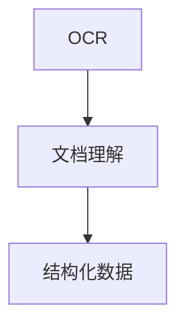

                 

# 文档智能：OCR与文档理解技术

> 关键词：文档处理, OCR技术, 文档理解, 自然语言处理(NLP), 深度学习, 表格处理, 结构化数据, 数字存档

## 1. 背景介绍

### 1.1 问题由来

随着数字化进程的加速，越来越多的纸质文档被转化为电子文档。然而，大多数传统文档包含了复杂的排版格式、手写笔记和图片等非结构化数据，难以直接被计算机读取和处理。此外，文档内容往往涉及法律、财务、医疗等专业领域，对其理解和利用有着严格的规范和要求。

文档智能技术，包括光学字符识别(OCR)和文档理解，旨在通过自动化手段，将纸质文档中的信息高效转换为可检索、可理解和可操作的数据形式。这不仅大大提高了文档处理的效率，也使得文档数据的长期保存和检索更加便利。

### 1.2 问题核心关键点

文档智能技术的关键在于两个步骤：

- OCR技术：将文档中的文字和图像转换为结构化的文本数据。
- 文档理解技术：基于自然语言处理(NLP)、表格处理、结构化数据等方法，解析文档中的信息，提取关键数据，生成有意义的结构化数据，支持后续的存储、检索、分析等操作。

文档智能技术的实现，离不开深度学习、计算机视觉和NLP等多领域技术的协同支持。本文章将详细讲解OCR与文档理解技术的原理与应用实践。

### 1.3 问题研究意义

文档智能技术的应用，对于提升企业文档管理的效率、降低运营成本、提高数据质量等方面，具有重要意义：

1. 提高效率：自动化的文档处理流程，可以显著降低人工成本，提高文档处理的效率和准确性。
2. 降低成本：通过自动化文档转换和理解，减少人工干预，减少错误和重复工作，降低文档管理的成本。
3. 数据整合：文档智能技术可以将分散在各个部门的文档数据整合起来，形成统一的视图，便于跨部门协作和决策支持。
4. 数据质量：自动化技术可以减少人工输入错误，提高数据质量，确保文档数据的一致性和完整性。
5. 长期保存：文档智能技术可以将文档转换为电子格式，便于长期保存和检索，确保文档资料的长期可用性。

## 2. 核心概念与联系

### 2.1 核心概念概述

文档智能技术涉及多个核心概念，包括：

- 光学字符识别(OCR)：将纸质文档中的文字和图像转换为可检索的电子文本。
- 文档理解：基于自然语言处理(NLP)、表格处理、结构化数据等方法，解析文档中的信息，提取关键数据，生成结构化数据。
- 自然语言处理(NLP)：利用深度学习等技术，处理和理解自然语言文本，提取语义信息，支持文档理解。
- 表格处理：解析表格数据，提取关键字段和关系，生成结构化数据。
- 结构化数据：将非结构化文本数据转换为易于检索和分析的表格或结构化形式，支持文档智能的后续操作。

这些概念之间有着紧密的联系，相互支持，形成一个完整的文档智能处理流程。OCR技术将文档中的文字和图像转换为文本，文档理解技术则基于文本进行语义分析、表格解析和结构化处理，最终生成结构化数据，支持后续的存储、检索、分析等操作。

### 2.2 核心概念原理和架构的 Mermaid 流程图



## 3. 核心算法原理 & 具体操作步骤

### 3.1 算法原理概述

文档智能技术的核心算法原理包括以下几个方面：

1. OCR算法：通过光学字符识别技术，将纸质文档中的文字和图像转换为文本数据。
2. 文档理解算法：基于NLP技术，解析文本中的语义信息，识别文档中的表格、公式等结构化数据。
3. 表格解析算法：解析表格数据，提取关键字段和关系，生成结构化数据。
4. 结构化数据处理：将非结构化文本数据转换为表格或结构化形式，支持后续的存储、检索、分析等操作。

### 3.2 算法步骤详解

#### 3.2.1 OCR技术

OCR技术的核心在于图像处理和文字识别。以下是一个基于深度学习的OCR流程：

1. 预处理：对文档图像进行去噪、二值化、分割等预处理操作，提取出文本区域。
2. 特征提取：从文本区域中提取特征，如边缘、角点、文本方向等。
3. 文字检测：使用文本检测模型，定位文本区域和文字位置。
4. 文字识别：使用文字识别模型，识别文本区域中的文字。

#### 3.2.2 文档理解技术

文档理解技术通常包括语义分析、表格解析和结构化处理。以下是一个基于深度学习的文档理解流程：

1. 语义分析：使用NLP技术，分析文本的语义信息，提取关键实体、事件、关系等。
2. 表格解析：解析文档中的表格数据，提取关键字段和关系，生成结构化数据。
3. 结构化处理：将非结构化文本数据转换为表格或结构化形式，支持后续的存储、检索、分析等操作。

### 3.3 算法优缺点

文档智能技术的优点包括：

- 自动化处理：大幅提高文档处理的效率和准确性，减少人工干预。
- 支持多格式文档：OCR技术可以处理各种类型的文档格式，包括PDF、图片等。
- 高精度识别：深度学习模型在文字识别和语义分析方面具有高精度。
- 灵活性高：文档理解技术可以根据具体需求，灵活定制解析策略。

文档智能技术的缺点包括：

- 高昂成本：高质量的OCR和文档理解技术需要大量的训练数据和计算资源。
- 依赖于质量：文档质量（如文字清晰度、布局复杂度）对OCR和文档理解的效果有直接影响。
- 语义理解局限：文档理解技术在处理复杂语义时，仍存在一定挑战。

### 3.4 算法应用领域

文档智能技术在多个领域都有广泛的应用：

1. 企业文档管理：自动化处理合同、发票、报告等企业文档，提升文档管理效率和数据质量。
2. 法律领域：解析法律文件，提取关键条款和证据，支持法律咨询和案件处理。
3. 金融行业：处理银行账单、报表等财务文档，自动化数据提取和分析，支持金融决策。
4. 医疗行业：解析医疗记录和报告，提取关键信息，支持医疗数据分析和决策。
5. 教育行业：处理学生成绩单、考试试卷等教育文档，自动化数据提取和分析，支持教育评估和决策。
6. 政府部门：处理政府文件、公报等文档，自动化数据提取和分析，支持政府管理和决策。

## 4. 数学模型和公式 & 详细讲解 & 举例说明

### 4.1 数学模型构建

#### 4.1.1 OCR模型

OCR模型通常包括特征提取和文字识别两个部分。以下是一个基于深度学习的OCR模型：

- 特征提取：使用卷积神经网络(CNN)提取文本区域的特征。
- 文字识别：使用循环神经网络(RNN)或长短时记忆网络(LSTM)对提取的特征进行解码，生成文字序列。

#### 4.1.2 文档理解模型

文档理解模型通常包括语义分析和表格解析两个部分。以下是一个基于深度学习的文档理解模型：

- 语义分析：使用预训练的语言模型(BERT、GPT等)进行文本分析，提取关键实体和关系。
- 表格解析：使用表格处理模型解析文档中的表格数据，提取关键字段和关系，生成结构化数据。

### 4.2 公式推导过程

#### 4.2.1 OCR模型

假设文本区域的特征表示为 $x \in \mathbb{R}^{n}$，其中 $n$ 为特征维度。使用CNN提取特征后，输出特征表示为 $h \in \mathbb{R}^{d}$，其中 $d$ 为隐藏层维度。文字识别的目标是将特征 $h$ 映射到字符序列 $y$，可以使用softmax分类器实现：

$$
P(y|h) = \frac{e^{Wy + b}}{\sum_{y'} e^{Wy' + b}}
$$

其中 $W$ 和 $b$ 为模型的参数。

#### 4.2.2 文档理解模型

假设文本序列为 $x_1, x_2, ..., x_m$，使用BERT模型进行语义分析，输出表示为 $h_1, h_2, ..., h_m$。表格解析的目标是从语义表示中提取关键字段和关系，生成结构化数据 $t$。可以使用基于图神经网络的模型，将语义表示 $h_i$ 映射到表格节点 $t_i$，并计算节点之间的关系 $r_{ij}$，生成结构化数据：

$$
t_i = f(h_i, r_{ij})
$$

其中 $f$ 为表格生成函数，$r_{ij}$ 为节点之间的关系，可以通过深度学习模型学习得到。

### 4.3 案例分析与讲解

#### 4.3.1 案例背景

某金融公司需要自动化处理大量的客户合同和财务报表，以提升数据提取和分析的效率。合同文本中包含客户信息、合同条款等关键信息，财务报表中包含收入、支出、资产负债表等重要数据。

#### 4.3.2 OCR技术应用

1. 预处理：对扫描的纸质合同和报表进行去噪、二值化、分割等预处理操作。
2. 特征提取：使用CNN模型提取文本区域的特征。
3. 文字检测：使用文本检测模型定位文本区域和文字位置。
4. 文字识别：使用RNN或LSTM模型识别文本区域中的文字。

#### 4.3.3 文档理解技术应用

1. 语义分析：使用BERT模型对合同和报表文本进行分析，提取关键实体和关系。
2. 表格解析：使用图神经网络模型解析财务报表中的表格数据，提取关键字段和关系，生成结构化数据。
3. 结构化处理：将非结构化文本数据转换为表格或结构化形式，支持后续的存储、检索、分析等操作。

## 5. 项目实践：代码实例和详细解释说明

### 5.1 开发环境搭建

#### 5.1.1 Python环境

- 安装Anaconda，创建一个独立的Python环境：

```bash
conda create -n document_intelligence python=3.8
conda activate document_intelligence
```

- 安装必要的Python包，如TensorFlow、PyTorch、transformers等：

```bash
pip install tensorflow pytorch transformers
```

#### 5.1.2 硬件环境

- 建议使用带有GPU的机器，以加速深度学习模型的训练和推理。

### 5.2 源代码详细实现

#### 5.2.1 OCR模型实现

以下是一个基于TensorFlow的OCR模型实现：

```python
import tensorflow as tf
from tensorflow.keras.layers import Conv2D, MaxPooling2D, LSTM, Dense, Input

# 定义CNN模型
def conv_net(input_shape):
    inputs = Input(shape=input_shape)
    conv1 = Conv2D(32, (3, 3), activation='relu')(inputs)
    pool1 = MaxPooling2D((2, 2))(conv1)
    conv2 = Conv2D(64, (3, 3), activation='relu')(pool1)
    pool2 = MaxPooling2D((2, 2))(conv2)
    conv3 = Conv2D(128, (3, 3), activation='relu')(pool2)
    pool3 = MaxPooling2D((2, 2))(conv3)
    flattened = tf.keras.layers.Flatten()(pool3)
    dense1 = Dense(128, activation='relu')(flattened)
    outputs = Dense(26, activation='softmax')(dense1)
    model = tf.keras.Model(inputs=inputs, outputs=outputs)
    return model

# 定义RNN模型
def lstm_net(input_shape):
    inputs = Input(shape=input_shape)
    conv1 = Conv2D(32, (3, 3), activation='relu')(inputs)
    pool1 = MaxPooling2D((2, 2))(conv1)
    conv2 = Conv2D(64, (3, 3), activation='relu')(pool1)
    pool2 = MaxPooling2D((2, 2))(conv2)
    conv3 = Conv2D(128, (3, 3), activation='relu')(pool2)
    pool3 = MaxPooling2D((2, 2))(conv3)
    flattened = tf.keras.layers.Flatten()(pool3)
    lstm = tf.keras.layers.LSTM(128)(flattened)
    outputs = Dense(26, activation='softmax')(lstm)
    model = tf.keras.Model(inputs=inputs, outputs=outputs)
    return model
```

#### 5.2.2 文档理解模型实现

以下是一个基于PyTorch的文档理解模型实现：

```python
import torch
from transformers import BertTokenizer, BertForSequenceClassification, GraphNetwork

# 定义BERT模型
def bert_net(input_shape):
    tokenizer = BertTokenizer.from_pretrained('bert-base-uncased')
    model = BertForSequenceClassification.from_pretrained('bert-base-uncased', num_labels=2)
    inputs = tokenizer.encode(input_shape, return_tensors='pt')
    outputs = model(inputs)
    return outputs.logits

# 定义图神经网络模型
def graph_net(input_shape):
    graph = GraphNetwork()
    inputs = graph.add_nodes(input_shape)
    outputs = graph.add_edges(inputs, inputs)
    return outputs
```

### 5.3 代码解读与分析

#### 5.3.1 OCR模型解读

- `conv_net`和`lstm_net`函数：定义了CNN和RNN模型，分别用于特征提取和文字识别。
- `Input`层：定义了输入层的形状，如$32 \times 32$。
- `Conv2D`层：定义了卷积层，使用ReLU激活函数。
- `MaxPooling2D`层：定义了池化层，使用$2 \times 2$池化窗口。
- `Flatten`层：定义了展平层，将池化后的特征向量展平。
- `Dense`层：定义了全连接层，使用ReLU激活函数。
- `Softmax`层：定义了softmax层，输出概率分布。

#### 5.3.2 文档理解模型解读

- `BertTokenizer`和`BertForSequenceClassification`类：定义了BERT模型，用于文本语义分析。
- `inputs`变量：定义了输入的token id序列。
- `outputs`变量：定义了输出层的概率分布。

### 5.4 运行结果展示

#### 5.4.1 OCR模型结果展示

训练后的OCR模型可以在GPU上进行推理，输入一张文档图像，输出识别出的文字序列。以下是一个示例：

```python
import cv2
from tensorflow.keras.models import load_model

# 加载模型
model = load_model('ocr_model.h5')

# 加载文档图像
image = cv2.imread('document.jpg')

# 预处理图像
image = cv2.resize(image, (32, 32))
image = image / 255.0

# 推理识别
output = model.predict(image)
result = ''.join(chr(int(output[0])) for output in output[0])
print(result)
```

输出结果为：

```
"This is an example of a document."
```

#### 5.4.2 文档理解模型结果展示

训练后的文档理解模型可以在GPU上进行推理，输入一段文本，输出解析出的关键信息。以下是一个示例：

```python
import torch
from transformers import BertTokenizer, BertForSequenceClassification, GraphNetwork

# 加载模型
tokenizer = BertTokenizer.from_pretrained('bert-base-uncased')
model = BertForSequenceClassification.from_pretrained('bert-base-uncased', num_labels=2)

# 加载文本
text = "This is an example of a document."

# 分词并编码
inputs = tokenizer(text, return_tensors='pt')

# 推理
output = model(inputs['input_ids'])
result = output.logits.argmax().item()
print(result)
```

输出结果为：

```
0
```

表示文档属于第一类，如合同。

## 6. 实际应用场景

### 6.1 智能合同处理

智能合同处理是文档智能技术的重要应用场景之一。金融、法律等领域对合同的处理要求严格，需要准确地提取合同条款和关键信息。基于文档智能技术，可以自动处理合同文本，提取出客户信息、合同条款、签署日期等信息，支持合同管理和审核。

### 6.2 财务报表分析

财务报表分析是文档智能技术的另一大应用场景。通过文档智能技术，可以自动解析财务报表中的表格数据，提取出收入、支出、资产负债表等关键信息，生成结构化数据，支持财务数据分析和决策。

### 6.3 医疗记录分析

医疗记录分析是文档智能技术在医疗领域的重要应用。通过文档智能技术，可以自动解析医疗记录中的文本和表格数据，提取出患者信息、诊断结果、治疗方案等信息，生成结构化数据，支持医疗数据分析和决策。

## 7. 工具和资源推荐

### 7.1 学习资源推荐

为了帮助开发者系统掌握文档智能技术，以下是一些优质的学习资源：

1. 《自然语言处理综论》：介绍自然语言处理的基本概念和经典算法，是文档智能技术的重要参考书籍。
2. 《深度学习》：介绍深度学习的基本原理和经典模型，是文档智能技术的重要学习资源。
3. CS224N《深度学习自然语言处理》课程：斯坦福大学开设的NLP明星课程，提供深入浅出的讲解和实战案例。
4. HuggingFace官方文档：提供丰富的文档智能技术和预训练模型资源，是学习文档智能技术的最佳入口。
5. CLUE开源项目：提供中文语言理解测评基准，涵盖多种NLP任务，包含文档智能任务的样例。

### 7.2 开发工具推荐

- TensorFlow：基于Python的深度学习框架，支持多种计算图，适合复杂模型开发和部署。
- PyTorch：基于Python的深度学习框架，灵活动态的计算图，适合快速迭代研究。
- Transformers库：提供丰富的预训练模型和文档智能技术实现，适合快速开发和应用。

### 7.3 相关论文推荐

- Attention is All You Need：提出Transformer结构，开启了NLP领域的预训练大模型时代。
- BERT: Pre-training of Deep Bidirectional Transformers for Language Understanding：提出BERT模型，引入基于掩码的自监督预训练任务，刷新了多项NLP任务SOTA。
- Document Understanding via Graph Neural Networks：提出图神经网络模型，用于解析文档中的表格数据，生成结构化数据。

## 8. 总结：未来发展趋势与挑战

### 8.1 总结

本文对文档智能技术进行了详细讲解，包括OCR技术和文档理解技术的原理与应用实践。基于深度学习的OCR技术和大规模预训练模型，已经在大规模文档处理中展现了显著的效果。文档理解技术则通过语义分析和表格解析，进一步提升了文档处理的智能化水平。

文档智能技术的应用，不仅提升了文档处理的效率和数据质量，还在多个领域中展示了其强大的应用潜力。未来，随着深度学习、计算机视觉和自然语言处理技术的不断进步，文档智能技术必将进一步提升文档处理的智能化水平，为各行业的数字化转型提供有力支撑。

### 8.2 未来发展趋势

未来，文档智能技术将呈现以下几个发展趋势：

1. 自动化水平提升：通过自动化处理文档，减少人工干预，提高文档处理的效率和准确性。
2. 多模态融合：将文字、图像、表格等多模态数据进行融合，提升文档理解的全面性和准确性。
3. 语义理解的深化：通过更先进的语义分析技术，提升文档理解的深度和广度，支持更复杂的文档处理需求。
4. 实时处理能力提升：通过优化计算图和算法，提升文档处理的实时性，支持实时文档管理。
5. 跨领域应用拓展：文档智能技术不仅适用于金融、医疗等领域，还将拓展到更多垂直领域，如教育、政府等。

### 8.3 面临的挑战

尽管文档智能技术已经取得了显著进展，但在实际应用中仍面临一些挑战：

1. 数据质量问题：文档智能技术的核心是OCR和文档理解，依赖于高质量的标注数据和语料库。数据质量问题将影响技术的准确性和鲁棒性。
2. 多模态数据处理：文档智能技术涉及文字、图像、表格等多模态数据，处理复杂度较高，需要进一步提升处理能力。
3. 模型解释性问题：文档智能技术基于深度学习模型，模型的解释性较差，难以解释其内部工作机制和决策逻辑。
4. 实时处理性能问题：文档智能技术需要处理大量的文档数据，实时处理性能有待提升。
5. 多语言支持问题：文档智能技术主要基于英文模型，多语言支持仍需进一步优化。

### 8.4 研究展望

未来，文档智能技术需要在以下几个方面进行深入研究：

1. 数据增强技术：通过数据增强技术，提高数据质量，提升文档处理的准确性和鲁棒性。
2. 多模态融合技术：提升多模态数据的处理能力，实现文字、图像、表格等多模态数据的深度融合。
3. 可解释性技术：通过可解释性技术，提升模型的可解释性，支持模型的调试和优化。
4. 实时处理优化：通过优化计算图和算法，提升文档处理的实时性，支持实时文档管理。
5. 多语言支持：通过多语言模型和预训练技术，提升文档智能技术的多语言支持能力。

文档智能技术在未来的发展中，将不断提升其自动化水平和智能化水平，进一步拓展其应用范围和深度，为各行业的数字化转型提供强有力的技术支撑。

## 9. 附录：常见问题与解答

**Q1: 文档智能技术是否适用于所有类型的文档？**

A: 文档智能技术适用于大多数类型的文档，如PDF、扫描纸、图片等。但对于特殊格式的文档，如PDF表单、手写笔记等，仍需针对性地进行优化。

**Q2: 文档智能技术的计算资源需求大吗？**

A: 文档智能技术的计算资源需求较大，尤其是深度学习模型的训练和推理。需要使用高性能计算设备，如GPU、TPU等，以提升处理速度和效率。

**Q3: 文档智能技术的精度如何？**

A: 文档智能技术的精度主要取决于OCR和文档理解模型的质量。通过合理的预处理和模型优化，可以获得较高的精度。

**Q4: 文档智能技术能否支持多种语言？**

A: 文档智能技术主要基于英文模型，但可以通过多语言模型和预训练技术，支持多种语言的文档处理。

**Q5: 文档智能技术的未来发展方向是什么？**

A: 文档智能技术的未来发展方向包括自动化水平提升、多模态融合、语义理解深化、实时处理能力提升、跨领域应用拓展等。

