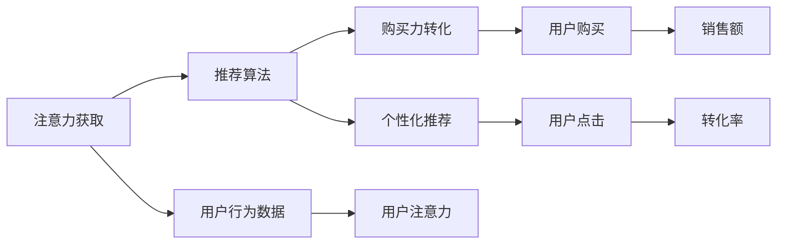

                 

# 新零售模式：注意力与购买力的融合

> 关键词：新零售模式, 注意力, 购买力, 融合, 推荐算法, 用户行为分析, 零售优化

## 1. 背景介绍

### 1.1 问题由来
随着互联网和移动互联网技术的飞速发展，电子商务已成为消费的重要渠道之一。然而，传统电商平台往往存在用户获取成本高、流量转化率低、用户留存困难等问题。为了突破这些问题，零售商开始探索一种更加智能化、个性化、高效化的新零售模式。

新零售模式以数据驱动为核心，通过大数据、人工智能等先进技术，全面整合线上线下渠道，打造无缝的消费体验，满足用户个性化需求，提升购物效率，增加销售额。其中，用户注意力与购买力的融合是新零售模式的核心。

### 1.2 问题核心关键点
在电商平台上，用户的注意力可以转化为购买力。如何有效地捕捉和利用用户的注意力，设计合理的推荐算法，促使用户进行购买，是新零售模式成功的关键。

核心问题包括：
- 如何精准获取用户的注意力？
- 如何利用用户的注意力进行推荐？
- 如何衡量和转化用户的购买力？

本文聚焦于新零售模式中注意力与购买力的融合，介绍了注意力获取、推荐算法、购买力转化等关键技术，并通过实际案例展示新零售模式的潜在价值。

## 2. 核心概念与联系

### 2.1 核心概念概述

新零售模式是一种结合线上线下、以数据驱动为核心，通过大数据、人工智能等技术手段，实现全渠道整合、无缝消费体验的零售模式。其主要特点包括：

- **全渠道整合**：打通线上线下渠道，实现数据共享和业务协同。
- **个性化推荐**：基于用户行为数据和模型，提供精准的个性化推荐。
- **实时交互**：通过聊天机器人、智能客服等，实现与用户的实时互动。
- **数据驱动决策**：利用数据和算法优化供应链、库存、营销等各个环节。

注意力指的是用户对信息的关注程度，是用户行为和需求的重要体现。在电商平台上，用户的注意力往往通过点击、浏览、评论等行为体现出来。购买力则是用户进行实际购买的能力和意愿，是零售商营销和运营的最终目标。

注意力与购买力的融合，主要依赖于以下几个关键技术：

- **注意力获取**：通过追踪用户的点击、浏览、评论等行为，获取用户的注意力数据。
- **推荐算法**：基于注意力数据，设计推荐算法，促使用户进行购买。
- **购买力转化**：通过用户行为分析，衡量和转化用户的购买力。

这三个关键技术共同构成了新零售模式的核心框架，使零售商能够实现精准的个性化推荐，提升用户购物体验，增加销售额。

### 2.2 核心概念原理和架构的 Mermaid 流程图



这个流程图展示了注意力获取、推荐算法和购买力转化的逻辑关系：

1. 用户行为数据通过注意力获取技术，转化为用户的注意力数据。
2. 基于用户的注意力数据，推荐算法设计个性化推荐，促使用户点击。
3. 用户点击后，购买力转化技术通过用户行为分析，衡量和转化用户的购买力，最终实现购买行为。

## 3. 核心算法原理 & 具体操作步骤

### 3.1 算法原理概述

新零售模式中的注意力与购买力融合，主要依赖于推荐算法。推荐算法通过分析用户行为数据，预测用户的兴趣和需求，提供个性化的推荐内容。

推荐算法基于用户行为数据，采用协同过滤、基于内容的推荐、混合推荐等方法，从大规模商品库中筛选出符合用户兴趣的商品，并通过模型计算得分，进行排序推荐。推荐算法的主要目标是通过用户的注意力数据，最大化用户的点击率和购买率，从而提高转化率和销售额。

### 3.2 算法步骤详解

推荐算法的步骤一般包括以下几个关键步骤：

**Step 1: 数据收集与预处理**
- 收集用户的点击、浏览、评价、收藏等行为数据，形成用户行为数据集。
- 对数据进行清洗、去重、归一化等预处理，提取有用的特征。

**Step 2: 特征工程**
- 基于用户行为数据，设计特征提取算法，构建特征向量。
- 常用的特征包括用户ID、商品ID、浏览时间、点击次数、评分等。

**Step 3: 模型训练**
- 选择推荐算法模型，如协同过滤、基于内容的推荐、深度学习等。
- 使用用户行为数据训练模型，调整模型参数。

**Step 4: 推荐计算**
- 将用户输入特征向量，计算出用户对各个商品的兴趣得分。
- 对商品进行排序，生成个性化推荐列表。

**Step 5: 效果评估**
- 使用交叉验证等方法，评估推荐算法的效果。
- 优化模型参数，提高推荐精度和效果。

### 3.3 算法优缺点

推荐算法在新零售模式中具有以下优点：
- 个性化推荐：通过分析用户行为数据，提供符合用户兴趣的推荐内容。
- 提高用户粘性：通过个性化推荐，增加用户点击和购买行为，提高用户留存率。
- 增加销售额：通过精准推荐，提高转化率，增加销售额。

同时，推荐算法也存在以下局限性：
- 数据隐私问题：用户行为数据的获取和存储涉及隐私问题，需要严格遵守数据保护法规。
- 冷启动问题：新用户的注意力数据不足，难以进行个性化推荐。
- 数据稀疏性：用户行为数据往往稀疏，难以捕捉全面的用户兴趣。

### 3.4 算法应用领域

推荐算法在新零售模式中广泛应用，具体包括：

- **商品推荐**：根据用户的浏览、点击、评价等行为，推荐用户可能感兴趣的商品。
- **个性化营销**：通过分析用户的行为和兴趣，进行有针对性的营销活动，提升用户参与度和转化率。
- **购物车推荐**：推荐用户可能感兴趣的商品添加到购物车中，提高购物车转化率。
- **优惠券推荐**：基于用户行为数据，推荐合适的优惠券，促进用户购买。
- **新商品推荐**：推荐热门或新上架的商品，增加商品的曝光率和销量。

这些应用场景展示了推荐算法在新零售模式中的重要价值，通过精准的推荐，提升用户购物体验，增加销售额。

## 4. 数学模型和公式 & 详细讲解

### 4.1 数学模型构建

推荐算法主要依赖于数学模型，其中最常用的是协同过滤算法。协同过滤算法通过分析用户行为数据，找到与目标用户兴趣相似的其他用户，推荐这些用户喜欢的商品。

协同过滤算法的基本模型可以表示为：

$$
\hat{y}_{ui} = \sum_{j=1}^n r_{uj} \cdot a_{ji}
$$

其中，$y_{ui}$ 表示用户 $u$ 对商品 $i$ 的评分，$n$ 表示用户数量，$r_{uj}$ 表示用户 $u$ 和用户 $j$ 的相似度，$a_{ji}$ 表示用户 $j$ 对商品 $i$ 的评分。

协同过滤算法的训练过程一般采用矩阵分解、奇异值分解等方法，将用户和商品的评分矩阵分解为用户矩阵和商品矩阵，并计算用户之间的相似度，找到与目标用户兴趣相似的其他用户，进行推荐。

### 4.2 公式推导过程

协同过滤算法的基本公式推导如下：

1. 将用户和商品的评分矩阵表示为：

$$
R_{n\times m} = U_{n\times k} \cdot V_{k\times m} + E_{n\times m}
$$

其中，$U$ 和 $V$ 分别为用户矩阵和商品矩阵，$E$ 为误差矩阵。

2. 通过奇异值分解，将 $U$ 和 $V$ 分解为：

$$
U \approx U_k \cdot D_k^{\frac{1}{2}}, \quad V \approx V_k \cdot D_k^{-\frac{1}{2}}
$$

其中，$D_k$ 为对角矩阵，$U_k$ 和 $V_k$ 为低秩矩阵。

3. 计算用户之间的相似度：

$$
r_{uv} = \frac{\sum_{i=1}^m u_i v_i}{\sqrt{\sum_{i=1}^m u_i^2}\sqrt{\sum_{i=1}^m v_i^2}}
$$

其中，$u_i$ 和 $v_i$ 分别表示用户 $u$ 和用户 $v$ 对商品 $i$ 的评分。

4. 计算目标用户 $u$ 对商品 $i$ 的预测评分：

$$
\hat{y}_{ui} = \sum_{j=1}^n r_{uj} \cdot a_{ji}
$$

其中，$r_{uj}$ 表示用户 $u$ 和用户 $j$ 的相似度，$a_{ji}$ 表示用户 $j$ 对商品 $i$ 的评分。

### 4.3 案例分析与讲解

下面以电商平台的个性化推荐为例，介绍推荐算法的具体应用。

假设某电商平台有 $100$ 个用户和 $100$ 个商品，每个用户对每个商品进行评分，评分范围为 $[1, 5]$。现需要对用户 $u=1$ 进行推荐，可以使用协同过滤算法。

1. 收集用户行为数据，得到评分矩阵 $R_{100\times 100}$。

2. 对评分矩阵进行奇异值分解，得到用户矩阵 $U_{100\times k}$ 和商品矩阵 $V_{k\times 100}$，其中 $k$ 为低秩矩阵的秩。

3. 计算用户之间的相似度 $r_{uj}$，找到与用户 $u=1$ 相似的其他用户。

4. 根据相似度，计算目标用户 $u=1$ 对商品 $i$ 的预测评分，生成个性化推荐列表。

假设用户 $u=1$ 对商品 $i=1$ 的评分为 $3$，其他用户 $j$ 对商品 $i$ 的评分为 $4$，相似度 $r_{uj}$ 为 $0.8$，则目标用户 $u=1$ 对商品 $i$ 的预测评分为：

$$
\hat{y}_{11} = 0.8 \cdot 4 = 3.2
$$

因此，平台推荐商品 $i=1$ 给用户 $u=1$，预测评分为 $3.2$。

## 5. 项目实践：代码实例和详细解释说明

### 5.1 开发环境搭建

在进行推荐算法实践前，需要准备好开发环境。以下是使用Python进行Scikit-learn开发的推荐系统开发环境配置流程：

1. 安装Anaconda：从官网下载并安装Anaconda，用于创建独立的Python环境。

2. 创建并激活虚拟环境：
```bash
conda create -n recomm_system python=3.8 
conda activate recomm_system
```

3. 安装Scikit-learn：
```bash
pip install scikit-learn
```

4. 安装其他相关工具包：
```bash
pip install numpy pandas matplotlib
```

完成上述步骤后，即可在`recomm_system`环境中开始推荐系统实践。

### 5.2 源代码详细实现

下面我们以协同过滤算法为例，给出使用Scikit-learn进行个性化推荐的Python代码实现。

首先，定义协同过滤算法的推荐函数：

```python
from sklearn.metrics.pairwise import cosine_similarity
from scipy.sparse.linalg import svds

def collaborative_filtering(R, k=100, method='svd'):
    if method == 'svd':
        U, s, Vt = svds(R, k)
        R_hat = U.dot(s[:k] / s[:k].sum()) * Vt.T
    elif method == 'random':
        R_hat = R.toarray()
        for i in range(1, k):
            user_j = random.randint(0, R_hat.shape[0]-1)
            rand = np.random.rand(R_hat.shape[0])
            rand = np.sort(rand)[::-1]
            rand = rand[:k]
            R_hat[:, user_j] = np.random.rand(R_hat.shape[0])
            R_hat = R_hat * rand.reshape((R_hat.shape[0], 1))
    else:
        raise ValueError("Method must be either 'svd' or 'random'")
    return R_hat

# 读取用户行为数据
import pandas as pd

data = pd.read_csv('user_behavior.csv')

# 将评分矩阵转换为Scikit-learn要求的格式
user_id = data['user_id'].astype(int)
item_id = data['item_id'].astype(int)
rating = data['rating'].astype(float)
R = pd.pivot_table(data, index=user_id, columns=item_id, values=rating, fill_value=0)

# 使用协同过滤算法计算推荐矩阵
R_hat = collaborative_filtering(R, k=100, method='svd')

# 生成推荐列表
def get_recommendations(user_id, R_hat, top_n=10):
    user_index = user_id - 1
    recommendations = (R_hat[user_index].argsort()[:-1:-1])[:top_n]
    return recommendations

# 获取用户1的推荐商品
user1_recommendations = get_recommendations(1, R_hat, top_n=10)
print(user1_recommendations)
```

代码中，首先定义了协同过滤算法的推荐函数`collaborative_filtering`，使用奇异值分解或随机矩阵分解计算推荐矩阵。然后读取用户行为数据，将其转换为Scikit-learn要求的格式，并调用`collaborative_filtering`函数计算推荐矩阵。最后，定义推荐函数`get_recommendations`，根据推荐矩阵生成个性化推荐列表。

### 5.3 代码解读与分析

让我们再详细解读一下关键代码的实现细节：

**协同过滤算法**：
- 使用`svds`函数进行奇异值分解，计算推荐矩阵 $R_{n\times m}$ 和用户矩阵 $U_{n\times k}$、商品矩阵 $V_{k\times m}$。
- 根据相似度计算目标用户 $u$ 对商品 $i$ 的预测评分。

**数据读取与处理**：
- 使用`pandas`读取用户行为数据。
- 将评分矩阵 $R_{n\times m}$ 转换为Scikit-learn要求的格式。

**推荐列表生成**：
- 根据推荐矩阵 $R_{n\times m}$，生成目标用户 $u$ 的个性化推荐列表。

**测试与展示**：
- 获取用户1的推荐商品，并进行展示。

## 6. 实际应用场景

### 6.1 智能推荐系统

智能推荐系统是推荐算法在新零售模式中的重要应用。通过精准的个性化推荐，智能推荐系统能够提升用户购物体验，增加用户粘性和购买率。

在实际应用中，智能推荐系统可以应用于电商平台、视频平台、音乐平台等多个场景。例如，电商平台通过推荐用户可能感兴趣的商品，提高用户的点击率和购买率，增加销售额。

### 6.2 个性化营销

个性化营销是推荐算法的另一重要应用。通过分析用户的行为和兴趣，个性化营销可以设计有针对性的营销活动，提升用户参与度和转化率。

例如，电商平台可以根据用户的购物历史和浏览记录，设计个性化的营销活动，如优惠券、限时折扣等，促进用户购买。通过精准的推荐，电商平台可以大大提高营销活动的转化率，增加销售额。

### 6.3 购物车推荐

购物车推荐是推荐算法在电商平台的典型应用之一。通过推荐用户可能感兴趣的商品添加到购物车中，购物车推荐可以提高购物车转化率，增加销售额。

例如，电商平台可以根据用户的浏览和购买历史，推荐可能添加到购物车中的商品。购物车推荐能够显著提高购物车转化率，增加用户购买意愿，提升销售额。

### 6.4 未来应用展望

随着推荐算法的不断发展，新零售模式的应用也将更加广泛和深入。未来，推荐算法将在以下几个方面进一步拓展：

- **跨领域推荐**：通过跨领域推荐，将用户的兴趣扩展到其他领域，如音乐、视频、游戏等。跨领域推荐能够提高用户的参与度和满意度，增加平台的粘性和用户留存率。
- **多模态推荐**：将文本、图像、语音等多模态数据整合，进行综合推荐。多模态推荐能够提供更加丰富和多样化的推荐内容，提升用户购物体验。
- **实时推荐**：通过实时推荐，及时响应用户的即时需求，提升购物体验。实时推荐能够大大缩短用户购物周期，提高转化率和销售额。
- **情感分析**：通过情感分析，识别用户的情感倾向，进行情感推荐。情感推荐能够提升用户的购物满意度和忠诚度，增加平台的口碑效应。

## 7. 工具和资源推荐

### 7.1 学习资源推荐

为了帮助开发者系统掌握推荐算法的理论基础和实践技巧，这里推荐一些优质的学习资源：

1. 《推荐系统原理与实践》：由大模型技术专家撰写，深入浅出地介绍了推荐算法的基本原理、常用方法和实际应用。
2. 《深度学习中的推荐系统》：斯坦福大学开设的NLP明星课程，有Lecture视频和配套作业，带你入门推荐算法的基本概念和经典模型。
3. 《深度学习与推荐系统》：书籍，全面介绍了深度学习在推荐系统中的应用，包括协同过滤、深度学习等前沿技术。
4. HuggingFace官方文档：推荐系统库的官方文档，提供了海量推荐模型和完整的推荐算法样例代码，是上手实践的必备资料。
5. Kaggle：数据科学竞赛平台，提供了大量推荐系统竞赛数据集和评测指标，适合进行实际训练和调优。

通过对这些资源的学习实践，相信你一定能够快速掌握推荐算法的精髓，并用于解决实际的推荐问题。

### 7.2 开发工具推荐

高效的开发离不开优秀的工具支持。以下是几款用于推荐系统开发的常用工具：

1. Scikit-learn：基于Python的开源机器学习库，支持多种推荐算法，如协同过滤、基于内容的推荐等。
2. TensorFlow：由Google主导开发的开源深度学习框架，支持分布式计算和GPU加速，适合大规模工程应用。
3. PyTorch：基于Python的开源深度学习框架，灵活的计算图机制，适合快速迭代研究。
4. Apache Spark：大规模数据处理引擎，支持分布式计算和数据挖掘，适合大数据推荐系统开发。
5. Flink：高性能数据流处理引擎，支持实时推荐系统开发，适合实时数据处理。

合理利用这些工具，可以显著提升推荐系统开发的效率，加快创新迭代的步伐。

### 7.3 相关论文推荐

推荐算法的研究源于学界的持续研究。以下是几篇奠基性的相关论文，推荐阅读：

1. Personalized Web Search Ranking via Matrix Factorization（矩阵分解推荐算法）：提出基于矩阵分解的推荐算法，解决推荐中的稀疏性问题。
2. Trustworthy Recommendation by SVD Collaborative Filtering（基于奇异值分解的协同过滤算法）：介绍基于奇异值分解的协同过滤算法，提升推荐准确率。
3. Neural Collaborative Filtering（神经协同过滤算法）：提出基于神经网络的协同过滤算法，提升推荐性能。
4. Deep Personalized Ranking with Matrix Factorization and Alternating Least Squares（基于深度学习的协同过滤算法）：介绍基于深度学习的协同过滤算法，提升推荐效果。
5. Factorization Machines for Recommender Systems（矩阵分解机推荐算法）：介绍矩阵分解机推荐算法，解决推荐中的多维稀疏性问题。

这些论文代表了大模型推荐算法的发展脉络。通过学习这些前沿成果，可以帮助研究者把握学科前进方向，激发更多的创新灵感。

## 8. 总结：未来发展趋势与挑战

### 8.1 研究成果总结

本文对推荐算法在新零售模式中的融合进行了全面系统的介绍。首先阐述了推荐算法在新零售模式中的重要价值，明确了推荐算法在获取用户注意力、进行个性化推荐和转化用户购买力方面的关键作用。其次，从原理到实践，详细讲解了协同过滤算法的数学模型和推荐流程，并给出了代码实例。同时，本文还广泛探讨了推荐算法在智能推荐系统、个性化营销、购物车推荐等实际应用场景中的应用前景，展示了推荐算法的巨大潜力。

通过本文的系统梳理，可以看到，推荐算法在新零售模式中的应用已经深入到各个环节，显著提升了用户购物体验和平台销售额。未来，伴随推荐算法的不断发展，新零售模式的应用将更加广泛和深入，为电商平台带来更多的商业价值。

### 8.2 未来发展趋势

展望未来，推荐算法在新零售模式中呈现以下几个发展趋势：

1. **跨领域推荐**：通过跨领域推荐，将用户的兴趣扩展到其他领域，如音乐、视频、游戏等。跨领域推荐能够提高用户的参与度和满意度，增加平台的粘性和用户留存率。
2. **多模态推荐**：将文本、图像、语音等多模态数据整合，进行综合推荐。多模态推荐能够提供更加丰富和多样化的推荐内容，提升用户购物体验。
3. **实时推荐**：通过实时推荐，及时响应用户的即时需求，提升购物体验。实时推荐能够大大缩短用户购物周期，提高转化率和销售额。
4. **情感分析**：通过情感分析，识别用户的情感倾向，进行情感推荐。情感推荐能够提升用户的购物满意度和忠诚度，增加平台的口碑效应。
5. **深度学习推荐**：基于深度学习的推荐算法将进一步发展，通过神经网络模型提升推荐精度和效果。深度学习推荐能够捕捉更加复杂的用户兴趣和行为特征，提供更加精准的个性化推荐。
6. **联邦学习推荐**：通过联邦学习技术，保护用户隐私的同时进行推荐。联邦学习推荐能够在大规模用户数据上训练推荐模型，提升推荐效果。

这些趋势展示了推荐算法在新零售模式中的广阔前景。这些方向的探索发展，必将进一步提升推荐系统的性能和应用范围，为电商平台带来更多的商业价值。

### 8.3 面临的挑战

尽管推荐算法在新零售模式中已经取得了瞩目成就，但在迈向更加智能化、普适化应用的过程中，它仍面临诸多挑战：

1. **数据隐私问题**：用户行为数据的获取和存储涉及隐私问题，需要严格遵守数据保护法规。
2. **冷启动问题**：新用户的注意力数据不足，难以进行个性化推荐。
3. **数据稀疏性**：用户行为数据往往稀疏，难以捕捉全面的用户兴趣。
4. **计算资源消耗**：大规模推荐系统需要大量的计算资源，导致资源消耗高。
5. **模型可解释性**：推荐算法的决策过程缺乏可解释性，难以进行调试和优化。
6. **多模态数据融合**：多模态数据整合和融合涉及复杂的模型设计和数据预处理，需要更多的研究和实践。

### 8.4 研究展望

面对推荐算法在新零售模式中面临的挑战，未来的研究需要在以下几个方面寻求新的突破：

1. **隐私保护**：通过差分隐私、联邦学习等技术，保护用户隐私的同时进行推荐。
2. **新用户推荐**：通过冷启动技术，提升新用户的推荐效果。
3. **多模态推荐**：通过多模态推荐算法，提升推荐效果。
4. **实时推荐**：通过实时推荐系统，提升用户购物体验。
5. **深度学习推荐**：基于深度学习的推荐算法将进一步发展，通过神经网络模型提升推荐精度和效果。
6. **模型可解释性**：通过可解释性研究，提升推荐算法的可解释性和可解释性。
7. **多模态数据融合**：通过多模态数据整合和融合，提升推荐效果。

这些研究方向将引领推荐算法在新零售模式中的应用进入新的阶段，为电商平台带来更多的商业价值。

## 9. 附录：常见问题与解答

**Q1：推荐算法能否应用于所有电商平台？**

A: 推荐算法可以应用于大多数电商平台，特别是用户规模较大、商品种类较多的平台。对于用户规模较小、商品种类较少的平台，推荐效果可能较差。

**Q2：推荐算法是否需要大量的标注数据？**

A: 推荐算法主要依赖于用户行为数据，不需要大量的标注数据。只要收集足够的用户行为数据，即可进行推荐。

**Q3：推荐算法如何进行冷启动？**

A: 冷启动问题可以通过以下方法解决：
1. 使用基于内容的推荐：根据商品的特征进行推荐。
2. 使用用户画像：根据用户的历史行为和兴趣进行推荐。
3. 使用协同过滤：通过相似用户的推荐进行冷启动。

**Q4：推荐算法是否能够处理多模态数据？**

A: 推荐算法可以处理多模态数据，但需要引入多模态推荐算法进行融合。多模态推荐算法能够将文本、图像、语音等多模态数据整合，进行综合推荐，提升推荐效果。

**Q5：推荐算法是否能够进行实时推荐？**

A: 推荐算法可以设计成实时推荐系统，通过实时数据处理和推荐，提升用户购物体验。实时推荐系统能够及时响应用户的即时需求，提高转化率和销售额。

通过以上回答，相信你对推荐算法在新零售模式中的应用有了更加深入的了解。推荐算法在新零售模式中的融合，将为电商平台带来更多的商业价值和用户满意度。随着推荐算法的不断发展，新零售模式的应用将更加广泛和深入。

---

作者：禅与计算机程序设计艺术 / Zen and the Art of Computer Programming

