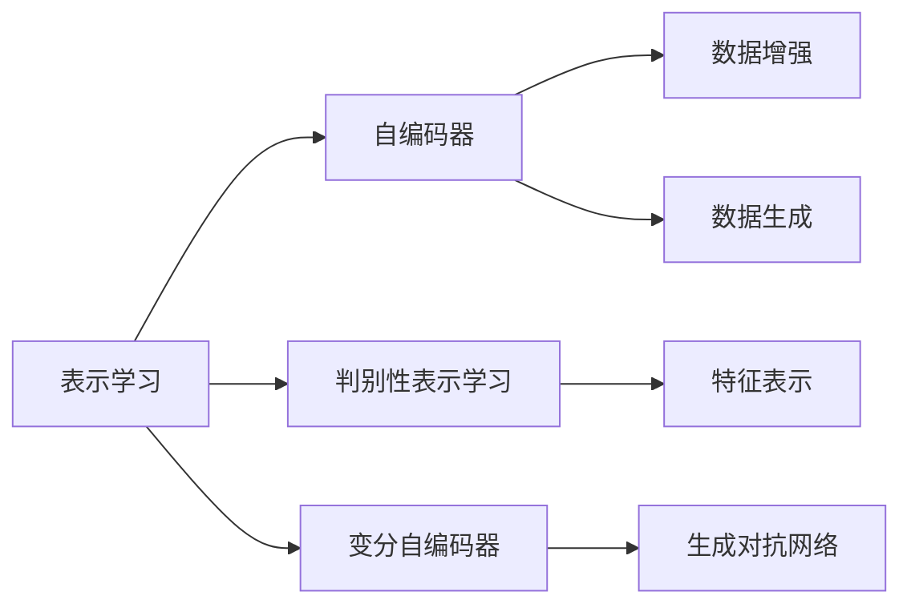

                 

# 无监督学习的理论进展:表示学习和生成模型

> 关键词：无监督学习, 表示学习, 生成模型, 深度学习, 自编码器, 变分自编码器, 生成对抗网络, 模型压缩, 特征表示

## 1. 背景介绍

### 1.1 问题由来
在人工智能领域，深度学习已经成为一种强大而普遍的技术，广泛应用于图像识别、自然语言处理、语音识别、推荐系统等多个领域。然而，深度学习通常需要大量的标注数据进行训练，这不仅耗时耗力，而且在某些情况下，获取高质量的标注数据几乎是不可能的。因此，无监督学习成为深度学习领域一个非常重要的研究方向，通过无需标注数据就能自动学习数据的结构信息，能够有效缓解深度学习对标注数据的依赖。

### 1.2 问题核心关键点
无监督学习的核心在于如何从数据中自动发现潜在结构，挖掘出有用的信息，而不依赖于人工标注。这包括两种主要的无监督学习方法：表示学习和生成模型。表示学习是从数据中学习有效的特征表示，生成模型则是通过数据生成的方式，学习数据的分布结构。

### 1.3 问题研究意义
无监督学习的研究对于人工智能技术的进步具有重要意义：

1. **数据标注成本的降低**：无监督学习能够通过自动学习数据结构，降低深度学习模型对大量标注数据的依赖，从而减少标注成本和时间。
2. **数据获取的灵活性**：无监督学习方法适用于数据稀缺或不具备标注数据的场景，具有更大的灵活性。
3. **模型泛化能力的提升**：无监督学习能提高模型的泛化能力，使得模型在不同任务和数据集上表现更加稳定和可靠。
4. **特征学习的独立性**：无监督学习可以独立于任务进行特征学习，形成更加通用的特征表示，有助于跨领域任务的迁移学习。

## 2. 核心概念与联系

### 2.1 核心概念概述

本节将介绍无监督学习中两个核心概念：表示学习和生成模型，并阐述它们之间的联系。

- **表示学习(Representation Learning)**：通过学习数据的内在表示，捕捉数据的本质特征，使得模型能够更好地理解和处理数据。常见的表示学习算法包括自编码器、变分自编码器、判别性表示学习等。
- **生成模型(Generative Modeling)**：通过学习数据的概率分布，生成新的数据样本。生成模型包括隐马尔可夫模型、高斯混合模型、玻尔兹曼机等。

这两个概念的联系在于，它们都是为了从数据中提取有用信息，只是方法和目的略有不同。表示学习更侧重于数据的特征提取和表示，而生成模型则侧重于数据的生成和建模。它们可以互相补充，用于解决不同的问题。例如，生成模型可以生成新的数据，用于数据增强和泛化；而表示学习则可以将生成模型生成的数据进一步处理，提取有用的特征表示。

### 2.2 核心概念原理和架构的 Mermaid 流程图(Mermaid 流程节点中不要有括号、逗号等特殊字符)



这个流程图展示了表示学习和生成模型的联系和区别：

- A 表示表示学习，包含自编码器、判别性表示学习、变分自编码器等多个分支。
- B 自编码器用于从数据中学习压缩表示，能够去除噪声，保留数据的有用信息。
- C 判别性表示学习通过优化表示和标签之间的判别性，学习有效的特征表示。
- D 变分自编码器通过生成过程学习数据的潜在分布，用于生成和建模。
- E 生成对抗网络（GAN）是生成模型的代表，通过对抗训练生成逼真的数据样本。
- F 数据增强通过自编码器等方法生成新的数据，用于提高模型的泛化能力。
- G 特征表示通过自编码器和判别性表示学习得到的数据，用于下游任务。
- H 数据生成通过变分自编码器和GAN等方法生成新的数据样本。

通过这个图表，我们可以更好地理解表示学习和生成模型之间的联系和区别。

## 3. 核心算法原理 & 具体操作步骤
### 3.1 算法原理概述

无监督学习的核心算法包括表示学习和生成模型，下面分别介绍这两种方法的原理。

#### 3.1.1 表示学习

表示学习的核心思想是通过对数据的处理，学习数据的有效表示，从而更好地理解和处理数据。常见的表示学习算法包括自编码器、变分自编码器、判别性表示学习等。

- **自编码器(Autocoder)**：通过编码器和解码器来学习数据的压缩表示，即学习一个将数据压缩到低维空间，再从低维空间解压回原始数据的映射。
- **变分自编码器(Variational Autoencoder, VAE)**：在自编码器的基础上，引入变分推断的方法，学习数据的潜在分布，用于生成和建模。
- **判别性表示学习(Discriminative Representation Learning)**：通过优化表示和标签之间的判别性，学习有效的特征表示。

#### 3.1.2 生成模型

生成模型的核心思想是通过学习数据的概率分布，生成新的数据样本，从而更好地理解数据的分布特性。常见的生成模型包括隐马尔可夫模型、高斯混合模型、玻尔兹曼机等。

- **隐马尔可夫模型(Hidden Markov Model, HMM)**：通过隐含状态和观测值之间的条件概率分布，学习数据生成的概率模型。
- **高斯混合模型(Gaussian Mixture Model, GMM)**：通过学习数据的高斯分布参数，生成新的数据样本。
- **玻尔兹曼机(Boltzmann Machine)**：通过能量函数学习数据的分布，用于生成和建模。

### 3.2 算法步骤详解

#### 3.2.1 表示学习算法步骤

1. **数据准备**：准备无标注的数据集，通常用于图像、文本、音频等不同类型的数据。
2. **模型选择**：选择合适的表示学习算法，如自编码器、变分自编码器、判别性表示学习等。
3. **模型训练**：使用数据集训练模型，优化模型参数，使得模型能够更好地学习数据的表示。
4. **特征提取**：通过训练好的模型提取数据的特征表示，用于下游任务。

#### 3.2.2 生成模型算法步骤

1. **数据准备**：准备无标注的数据集，用于生成模型的训练。
2. **模型选择**：选择合适的生成模型，如隐马尔可夫模型、高斯混合模型、玻尔兹曼机等。
3. **模型训练**：使用数据集训练生成模型，优化模型参数，使得模型能够更好地生成数据。
4. **数据生成**：通过训练好的生成模型生成新的数据样本，用于数据增强和建模。

### 3.3 算法优缺点

#### 3.3.1 表示学习算法优缺点

**优点**：

- 无需标注数据，适用于数据稀缺或不具备标注数据的场景。
- 能够学习数据的有效表示，提高模型的泛化能力。
- 可以独立于任务进行特征学习，形成更加通用的特征表示。

**缺点**：

- 通常需要较长的训练时间和计算资源。
- 需要大量的数据才能学习到有效的表示，如果数据较少，可能会出现过拟合的问题。
- 表示学习的效果很大程度上依赖于算法的质量和数据的质量。

#### 3.3.2 生成模型算法优缺点

**优点**：

- 能够生成逼真的数据样本，用于数据增强和泛化。
- 能够学习数据的概率分布，理解数据的分布特性。
- 适用于数据生成和建模，例如生成对抗网络（GAN）可以生成高质量的图像。

**缺点**：

- 生成模型通常需要大量的数据才能训练得到高质量的模型，如果数据较少，可能会生成低质量的样本。
- 生成模型的训练通常比表示学习更加复杂，需要更多的计算资源和时间。
- 生成模型的效果很大程度上依赖于模型架构和训练技巧。

### 3.4 算法应用领域

无监督学习的表示学习和生成模型在多个领域得到了广泛应用，包括但不限于以下几个方面：

- **计算机视觉**：图像分类、目标检测、图像生成、图像分割等任务。表示学习在图像特征提取、数据增强中发挥重要作用，生成模型可以用于生成逼真的图像。
- **自然语言处理**：文本生成、文本摘要、情感分析、命名实体识别等任务。表示学习用于提取文本特征，生成模型可以用于生成文本。
- **语音处理**：语音识别、语音合成、语音情感分析等任务。生成模型可以用于语音合成，表示学习用于语音特征提取。
- **推荐系统**：用户画像生成、商品推荐、广告投放等任务。表示学习用于提取用户和商品特征，生成模型可以用于生成新商品。

## 4. 数学模型和公式 & 详细讲解 & 举例说明

### 4.1 数学模型构建

#### 4.1.1 自编码器

自编码器由编码器（Encoder）和解码器（Decoder）两部分组成，其数学模型如下：

$$
\begin{aligned}
    z &= \sigma(E(x)) \\
    \hat{x} &= \sigma(D(z))
\end{aligned}
$$

其中 $E(x)$ 表示编码器，将输入数据 $x$ 映射到低维空间 $z$；$D(z)$ 表示解码器，将低维空间的数据 $z$ 映射回原始空间 $\hat{x}$；$\sigma$ 表示激活函数，通常使用 sigmoid 函数。

自编码器的目标是最小化重构误差：

$$
\min_{\theta_E, \theta_D} \mathcal{L} = \mathbb{E}_{x \sim p(x)} [||x - \hat{x}||^2]
$$

其中 $\mathcal{L}$ 表示重构误差，$x$ 表示输入数据，$\hat{x}$ 表示重构后的数据，$\theta_E$ 和 $\theta_D$ 分别表示编码器和解码器的参数。

#### 4.1.2 变分自编码器

变分自编码器在自编码器的基础上，引入变分推断的方法，学习数据的潜在分布。其数学模型如下：

$$
\begin{aligned}
    z &= \mu(x) + \sigma(x) \epsilon \\
    \hat{x} &= D(z)
\end{aligned}
$$

其中 $z$ 表示潜在空间的随机变量，$\mu(x)$ 和 $\sigma(x)$ 表示编码器的均值和方差，$\epsilon$ 表示标准正态分布的随机变量。变分自编码器的目标是最小化变分下界：

$$
\begin{aligned}
    \min_{\theta_E, \theta_D, \theta_Q} \mathcal{L} &= \mathbb{E}_{x \sim p(x)} [||x - \hat{x}||^2] + KL(\mu(x), q(z|x))
\end{aligned}
$$

其中 $q(z|x)$ 表示变分分布，$KL(\mu(x), q(z|x))$ 表示KL散度，用于衡量变分分布和潜在分布之间的差异。

### 4.2 公式推导过程

#### 4.2.1 自编码器推导

自编码器的重构误差最小化问题可以表示为：

$$
\min_{\theta_E, \theta_D} \mathcal{L} = \mathbb{E}_{x \sim p(x)} [||x - \hat{x}||^2]
$$

通过链式法则，对 $E(x)$ 和 $D(z)$ 求偏导，得到自编码器的更新公式：

$$
\begin{aligned}
    \frac{\partial \mathcal{L}}{\partial \theta_E} &= -2(E(x) - D(z)) \\
    \frac{\partial \mathcal{L}}{\partial \theta_D} &= -2(D(z) - x)
\end{aligned}
$$

#### 4.2.2 变分自编码器推导

变分自编码器的变分下界最小化问题可以表示为：

$$
\begin{aligned}
    \min_{\theta_E, \theta_D, \theta_Q} \mathcal{L} &= \mathbb{E}_{x \sim p(x)} [||x - \hat{x}||^2] + KL(\mu(x), q(z|x))
\end{aligned}
$$

通过链式法则，对 $E(x)$、$D(z)$ 和 $q(z|x)$ 求偏导，得到变分自编码器的更新公式：

$$
\begin{aligned}
    \frac{\partial \mathcal{L}}{\partial \theta_E} &= -2(E(x) - D(z)) + (1 - \sigma(z)) \frac{\partial \mu(x)}{\partial x} \\
    \frac{\partial \mathcal{L}}{\partial \theta_D} &= -2(D(z) - x) + \sigma(z) \frac{\partial \mu(x)}{\partial z} \\
    \frac{\partial \mathcal{L}}{\partial \theta_Q} &= - \frac{\partial \mu(x)}{\partial x} \frac{\partial \log q(z|x)}{\partial z}
\end{aligned}
$$

### 4.3 案例分析与讲解

#### 4.3.1 自编码器案例

考虑一个手写数字识别任务，使用自编码器提取数字图像的特征表示。具体步骤如下：

1. **数据准备**：准备手写数字图像数据集。
2. **模型选择**：选择自编码器作为表示学习模型。
3. **模型训练**：使用数据集训练自编码器，最小化重构误差。
4. **特征提取**：将测试集中的图像输入自编码器，提取特征表示。
5. **分类器训练**：使用提取的特征表示作为输入，训练一个简单的分类器，对测试集中的图像进行分类。

#### 4.3.2 变分自编码器案例

考虑一个图像生成任务，使用变分自编码器生成逼真的图像。具体步骤如下：

1. **数据准备**：准备图像数据集。
2. **模型选择**：选择变分自编码器作为生成模型。
3. **模型训练**：使用数据集训练变分自编码器，最小化变分下界。
4. **图像生成**：使用训练好的变分自编码器生成新的图像。
5. **评估生成质量**：通过评价指标（如FID、IS等）评估生成图像的质量。

## 5. 项目实践：代码实例和详细解释说明

### 5.1 开发环境搭建

在进行无监督学习项目实践前，我们需要准备好开发环境。以下是使用Python进行TensorFlow开发的环境配置流程：

1. 安装Anaconda：从官网下载并安装Anaconda，用于创建独立的Python环境。

2. 创建并激活虚拟环境：
```bash
conda create -n tf-env python=3.8 
conda activate tf-env
```

3. 安装TensorFlow：根据CUDA版本，从官网获取对应的安装命令。例如：
```bash
conda install tensorflow -c conda-forge
```

4. 安装各类工具包：
```bash
pip install numpy pandas scikit-learn matplotlib tqdm jupyter notebook ipython
```

完成上述步骤后，即可在`tf-env`环境中开始无监督学习实践。

### 5.2 源代码详细实现

下面我们以自编码器为例，给出使用TensorFlow对MNIST数据集进行自编码器训练的代码实现。

首先，定义MNIST数据集加载函数：

```python
from tensorflow.keras.datasets import mnist
from tensorflow.keras.utils import to_categorical

def load_mnist_data():
    (x_train, y_train), (x_test, y_test) = mnist.load_data()
    x_train = x_train.reshape(-1, 784) / 255.0
    x_test = x_test.reshape(-1, 784) / 255.0
    y_train = to_categorical(y_train)
    y_test = to_categorical(y_test)
    return x_train, y_train, x_test, y_test
```

然后，定义自编码器的模型：

```python
import tensorflow as tf
from tensorflow.keras import layers

class Autoencoder(tf.keras.Model):
    def __init__(self):
        super(Autoencoder, self).__init__()
        self.encoder = layers.Dense(128, activation='relu')
        self.decoder = layers.Dense(784, activation='sigmoid')

    def call(self, inputs):
        encoded = self.encoder(inputs)
        decoded = self.decoder(encoded)
        return decoded
```

接着，定义自编码器的训练函数：

```python
def train_autoencoder(x_train, y_train):
    model = Autoencoder()
    model.compile(optimizer='adam', loss='mse')

    for epoch in range(10):
        loss = model.train_on_batch(x_train, x_train)
        print(f'Epoch {epoch+1}, loss: {loss:.4f}')
```

最后，启动训练流程：

```python
x_train, y_train, x_test, y_test = load_mnist_data()
train_autoencoder(x_train, y_train)
```

以上就是使用TensorFlow对MNIST数据集进行自编码器训练的完整代码实现。可以看到，通过TensorFlow的高级API，可以方便地定义自编码器模型和训练函数，显著提高模型开发的效率。

### 5.3 代码解读与分析

让我们再详细解读一下关键代码的实现细节：

**load_mnist_data函数**：
- 加载MNIST数据集，将其转换为浮点型，并进行归一化处理。
- 使用to_categorical函数将标签转换为独热编码。

**Autoencoder类**：
- 定义自编码器的结构，包括编码器和解码器两部分。
- 在__init__函数中初始化编码器和解码器的权重。
- 在call函数中定义编码和解码的过程，并返回重构后的图像。

**train_autoencoder函数**：
- 实例化自编码器模型，并使用adam优化器和均方误差损失函数编译模型。
- 在每个epoch内，通过模型.train_on_batch函数进行训练，输出当前epoch的损失值。

**训练流程**：
- 加载MNIST数据集。
- 实例化自编码器模型。
- 在训练函数中，对模型进行10轮训练，每轮输出当前epoch的损失值。
- 训练结束后，自编码器可以用于提取图像的特征表示。

可以看到，TensorFlow使得无监督学习的实践变得简洁高效。开发者可以将更多精力放在数据处理、模型改进等高层逻辑上，而不必过多关注底层的实现细节。

当然，工业级的系统实现还需考虑更多因素，如模型的保存和部署、超参数的自动搜索、更灵活的任务适配层等。但核心的无监督学习范式基本与此类似。

## 6. 实际应用场景

### 6.1 图像数据增强

图像数据增强是无监督学习的一个重要应用场景，通过生成新的图像数据，提高模型的泛化能力，减少过拟合。例如，在图像分类任务中，自编码器可以用于生成新的图像样本，用于扩充训练集。

### 6.2 文本生成

文本生成是无监督学习在自然语言处理领域的一个重要应用，可以用于生成新的文本数据，用于数据增强和生成任务。例如，使用变分自编码器生成新的文本段落，用于情感分析、文本分类等任务。

### 6.3 语音合成

语音合成是无监督学习在语音处理领域的一个重要应用，可以用于生成新的语音数据，用于数据增强和语音识别任务。例如，使用生成对抗网络（GAN）生成逼真的语音样本，用于语音情感分析等任务。

### 6.4 未来应用展望

随着无监督学习的不断发展，未来的应用场景将更加多样，覆盖更多领域。例如：

- **医学影像分析**：使用生成模型和表示学习，对医学影像进行自动标注和分析，提高诊断的准确性和效率。
- **智能制造**：使用生成模型和表示学习，对制造过程进行优化和预测，提升生产线的智能化水平。
- **环境监测**：使用生成模型和表示学习，对环境数据进行分析和预测，预警环境风险。
- **金融预测**：使用生成模型和表示学习，对金融数据进行分析和预测，提供投资建议。

## 7. 工具和资源推荐

### 7.1 学习资源推荐

为了帮助开发者系统掌握无监督学习的理论基础和实践技巧，这里推荐一些优质的学习资源：

1. 《Deep Learning》课程：由斯坦福大学Andrew Ng教授讲授，全面介绍了深度学习的基本概念和核心算法。
2. 《Unsupervised Learning》课程：由MIT教授Tommi Jaakkola讲授，介绍了无监督学习的经典方法和前沿技术。
3. 《Representation Learning》书籍：该书由David Blei等撰写，系统介绍了表示学习的理论基础和实际应用。
4. 《Generative Adversarial Nets》论文：该论文由Ian Goodfellow等撰写，介绍了生成对抗网络的基本思想和算法实现。
5. 《GAN Zoo》网站：该网站汇集了各种生成对抗网络模型，提供了丰富的学习资源和代码实现。

通过对这些资源的学习实践，相信你一定能够快速掌握无监督学习的精髓，并用于解决实际的NLP问题。

### 7.2 开发工具推荐

高效的开发离不开优秀的工具支持。以下是几款用于无监督学习开发的常用工具：

1. TensorFlow：由Google主导开发的开源深度学习框架，生产部署方便，适合大规模工程应用。
2. PyTorch：由Facebook开发的开源深度学习框架，灵活动态的计算图，适合快速迭代研究。
3. Keras：基于TensorFlow和Theano的高级API，简单易用的深度学习框架，适用于快速原型开发。
4. Weights & Biases：模型训练的实验跟踪工具，可以记录和可视化模型训练过程中的各项指标，方便对比和调优。
5. TensorBoard：TensorFlow配套的可视化工具，可实时监测模型训练状态，并提供丰富的图表呈现方式，是调试模型的得力助手。

合理利用这些工具，可以显著提升无监督学习的开发效率，加快创新迭代的步伐。

### 7.3 相关论文推荐

无监督学习的相关研究已经取得了丰硕成果，以下是几篇奠基性的相关论文，推荐阅读：

1. Autoencoder：Hinton et al., 1986。
2. Variational Autoencoder：Kingma & Welling, 2013。
3. Generative Adversarial Networks：Goodfellow et al., 2014。
4. Auto-Encoding Variational Bayes：Kingma & Welling, 2014。
5. Deep Generative Image Models using a Learned Representation for Variable-Length Sequences：Goodfellow et al., 2016。

这些论文代表了无监督学习的发展脉络，通过学习这些前沿成果，可以帮助研究者把握学科前进方向，激发更多的创新灵感。

## 8. 总结：未来发展趋势与挑战

### 8.1 研究成果总结

无监督学习的研究在过去几年取得了显著进展，主要体现在以下几个方面：

1. **生成模型的突破**：生成对抗网络（GAN）和变分自编码器（VAE）等生成模型取得了显著进展，可以生成高质量的数据样本。
2. **表示学习的创新**：自编码器和判别性表示学习等表示学习算法不断改进，提高了模型的泛化能力和特征表示的质量。
3. **无监督学习的融合**：无监督学习和监督学习、半监督学习等方法进行融合，进一步提升了模型的性能和泛化能力。

### 8.2 未来发展趋势

展望未来，无监督学习的研究将呈现以下几个发展趋势：

1. **模型结构的优化**：生成模型和表示学习的模型结构将进一步优化，以提高模型的训练效率和生成质量。
2. **计算资源的利用**：随着计算资源的不断增长，无监督学习模型将能够处理更大规模的数据集，生成更高质量的数据样本。
3. **跨领域应用**：无监督学习将在更多领域得到应用，如医疗、制造、金融等，为这些领域带来变革性影响。
4. **数据增强技术**：数据增强技术将进一步发展，利用无监督学习生成新的数据样本，用于模型训练和优化。
5. **自动化超参优化**：自动化超参优化技术将进一步发展，使得无监督学习模型的训练更加高效。

### 8.3 面临的挑战

尽管无监督学习的研究取得了丰硕成果，但在迈向更加智能化、普适化应用的过程中，它仍面临着诸多挑战：

1. **数据质量和多样性**：无监督学习模型的性能很大程度上依赖于数据的质量和多样性，数据噪声和多样性不足会导致模型泛化能力不足。
2. **模型的可解释性**：无监督学习模型的决策过程通常缺乏可解释性，难以对其推理逻辑进行分析和调试。
3. **模型的鲁棒性**：无监督学习模型在面对新数据时，泛化能力往往不如监督学习模型，容易发生过拟合现象。
4. **计算资源的需求**：无监督学习模型通常需要较大的计算资源进行训练，如何在有限的计算资源下获得高质量的模型，仍然是一个挑战。

### 8.4 研究展望

面向未来，无监督学习的研究需要在以下几个方面寻求新的突破：

1. **模型压缩技术**：研究如何通过模型压缩技术，提高无监督学习模型的计算效率和空间利用率，以便在资源受限的条件下进行训练。
2. **跨模态学习**：研究如何利用无监督学习进行跨模态学习，整合视觉、语音、文本等多模态信息，提升模型的综合表现。
3. **自动化超参优化**：研究如何利用自动化超参优化技术，提升无监督学习模型的训练效率和性能。
4. **模型鲁棒性提升**：研究如何通过改进生成模型和表示学习算法，提升模型的泛化能力和鲁棒性，避免过拟合和灾难性遗忘。
5. **可解释性增强**：研究如何增强无监督学习模型的可解释性，使得模型的决策过程更加透明和可理解。

这些研究方向将进一步推动无监督学习技术的发展，为人工智能技术的未来进步提供更多可能性。

## 9. 附录：常见问题与解答

**Q1: 无监督学习和监督学习有什么区别？**

A: 无监督学习和监督学习的区别在于，无监督学习不需要标注数据，通过学习数据的内在结构来提取特征；而监督学习需要大量的标注数据，通过学习数据的标签来预测新样本的标签。

**Q2: 无监督学习的效果如何评估？**

A: 无监督学习的效果评估通常使用以下指标：
1. 重构误差：用于自编码器等表示学习模型的评估，表示重构后的数据与原始数据的相似度。
2. 数据生成质量：用于生成模型的效果评估，如FID、IS等指标，表示生成的数据与真实数据的相似度。
3. 特征表示质量：用于表示学习模型的效果评估，如t-SNE、UMAP等方法，用于可视化数据在特征空间中的分布情况。

**Q3: 无监督学习有哪些经典算法？**

A: 无监督学习的经典算法包括：
1. 自编码器（Autoencoder）：通过编码器和解码器学习数据的压缩表示。
2. 变分自编码器（Variational Autoencoder, VAE）：通过变分推断学习数据的潜在分布。
3. 生成对抗网络（Generative Adversarial Network, GAN）：通过对抗训练生成逼真的数据样本。
4. 隐马尔可夫模型（Hidden Markov Model, HMM）：通过隐含状态和观测值之间的条件概率分布，学习数据生成的概率模型。
5. 高斯混合模型（Gaussian Mixture Model, GMM）：通过学习数据的高斯分布参数，生成新的数据样本。
6. 玻尔兹曼机（Boltzmann Machine）：通过能量函数学习数据的分布，用于生成和建模。

**Q4: 无监督学习和半监督学习有什么区别？**

A: 无监督学习和半监督学习的区别在于，无监督学习完全不需要标注数据，通过学习数据的内在结构来提取特征；而半监督学习使用少量标注数据和大量无标注数据，通过标注数据指导模型的训练。

**Q5: 无监督学习的主要应用场景有哪些？**

A: 无监督学习的主要应用场景包括：
1. 数据增强：通过生成新的数据样本，用于数据增强和泛化。
2. 特征表示学习：通过学习数据的特征表示，用于下游任务。
3. 数据生成：通过生成新的数据样本，用于生成任务和数据建模。
4. 数据降维：通过学习数据的低维表示，用于数据可视化和降维处理。
5. 异常检测：通过学习数据的分布，检测数据中的异常点。

---

作者：禅与计算机程序设计艺术 / Zen and the Art of Computer Programming

