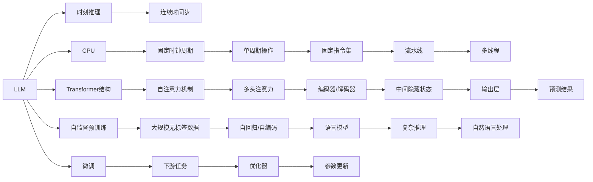

                 

## 1. 背景介绍

人工智能（AI）领域正快速增长，尤其是在自然语言处理（NLP）和机器学习（ML）领域。其中，语言模型在机器翻译、对话系统、问答系统等众多应用中展现出强大能力。与此同时，随着计算资源成本的下降，大规模的预训练语言模型（LLM）被广泛应用于各种场景，如GPT-3等。

然而，在利用LLM进行计算时，我们可能遭遇性能瓶颈。尽管LLM在处理自然语言任务时表现出惊人能力，但由于其连续、可微的结构，在运行过程中往往需要耗费大量计算资源，并且不能像计算机的CPU那样具有固定的时钟周期。这种连续时间推理与时钟周期驱动的计算单元之间的根本差异，使得LLM的计算效率与传统计算机架构之间存在显著区别。

本文将对LLM与CPU的根本差异进行深入探讨，并分析这些差异对实际应用的影响，帮助开发者更好地理解和运用LLM。

## 2. 核心概念与联系

### 2.1 核心概念概述

为了更好地理解LLM与CPU的根本差异，我们需要首先明确几个关键概念：

- **预训练语言模型（Pre-trained Language Model, LLM）**：如GPT-3等，通过在大规模无标签文本数据上自监督预训练，获取广泛的语言知识和常识，能处理复杂的自然语言理解与生成任务。

- **时钟周期**：指计算机CPU执行一条指令所需的最短时间，是现代计算机架构中最基本的单位。

- **时刻推理（S continuity）**：指LLM在处理自然语言任务时，不具有固定的时钟周期，而是通过连续的时间步不断进行推理和更新模型参数。

- **固定时钟周期**：指CPU等传统计算单元按照固定频率的时钟周期进行计算，每一时钟周期执行一次固定的操作。

通过对比这些核心概念，可以更好地理解LLM与CPU在计算原理和架构上的根本差异。

### 2.2 核心概念原理和架构的 Mermaid 流程图

下面通过一个简单的Mermaid流程图展示LLM和CPU的基本工作原理。



这个流程图展示了LLM和CPU的基本工作原理：

1. 从预训练开始，LLM在大量无标签数据上进行自监督预训练。
2. 通过自注意力机制，LLM能够理解复杂语言结构。
3. 在微调阶段，LLM可以在下游任务上进行有监督优化。
4. CPU具有固定时钟周期和单周期操作，适用于固定结构计算。
5. CPU的流水线和多线程设计，使其能够高效处理大量任务。

## 3. 核心算法原理 & 具体操作步骤

### 3.1 算法原理概述

LLM与CPU的根本差异在于计算模式和时间步长。LLM采用连续时间步长进行时刻推理，而CPU按照固定时钟周期进行计算。

**时刻推理**：
LLM在处理自然语言时，每一时间步都会更新模型参数。具体而言，假设输入长度为 $T$ 的序列，模型将依次在每个时间步 $t$ 更新参数，获得对应的输出 $\hat{y}_t$。

**固定时钟周期**：
CPU的计算单元按照固定时钟周期进行工作，每一时钟周期执行固定操作。例如，假设时钟周期为 $c$，每一时钟周期执行固定数量的操作。

### 3.2 算法步骤详解

#### 3.2.1 LLM时刻推理算法

1. **输入序列预处理**：对输入序列进行标记化、填充、分块等预处理。
2. **初始化模型参数**：设置模型初始参数 $\theta$。
3. **时刻推理循环**：
   - 前向传播计算 $y_t$，通过自注意力机制和线性变换获得。
   - 损失计算，通常为交叉熵或负对数似然损失。
   - 反向传播更新参数 $\theta$，通过梯度下降或其他优化算法完成。
4. **输出预测**：通过模型获得预测结果 $\hat{y}_t$。
5. **重复步骤3，直到所有时间步**。

#### 3.2.2 CPU固定时钟周期算法

1. **输入序列预处理**：与LLM类似，进行标记化、填充等预处理。
2. **初始化模型参数**：设置模型初始参数 $\theta$。
3. **循环执行固定时钟周期操作**：
   - 按照固定时钟周期 $c$ 执行指令，更新模型参数。
   - 输出预测结果。
4. **重复步骤3，直到所有时间步**。

### 3.3 算法优缺点

**LLM时刻推理算法优点**：
1. 能够处理复杂的自然语言任务，具备更强的上下文理解能力。
2. 能够自然地捕捉语言中的依赖关系，具有较好的泛化能力。

**LLM时刻推理算法缺点**：
1. 计算密集，需要大量计算资源。
2. 不能并行处理多个时间步，效率较低。
3. 难以对计算过程进行优化，导致资源浪费。

**CPU固定时钟周期算法优点**：
1. 计算效率高，能够并行处理多个任务。
2. 计算过程简单，易于优化。
3. 可以设计高效的流水线和多线程机制。

**CPU固定时钟周期算法缺点**：
1. 难以处理复杂的依赖关系，对自然语言理解能力有限。
2. 难以捕捉长距离依赖，在自然语言处理任务上效果不如LLM。

### 3.4 算法应用领域

**LLM时刻推理算法应用**：
1. 自然语言处理（NLP）：如机器翻译、问答系统、对话系统等。
2. 语音识别：需要理解连续语音流中的语义信息。
3. 推荐系统：根据用户行为和语义信息，推荐相关物品。

**CPU固定时钟周期算法应用**：
1. 数据库系统：进行高效的SQL查询。
2. 图像处理：处理像素级别的计算任务。
3. 科学计算：进行数值计算和矩阵运算。

## 4. 数学模型和公式 & 详细讲解 & 举例说明

### 4.1 数学模型构建

#### 4.1.1 LLM时刻推理数学模型

假设LLM模型包含 $n$ 个时间步，输入序列长度为 $T$。设 $\theta$ 为模型参数，$y_t$ 为第 $t$ 时间步的模型输出，$x_t$ 为输入序列在时间步 $t$ 的特征表示。则模型在时间步 $t$ 的输出为：

$$
y_t = f_\theta(x_t, y_{t-1}, \ldots, y_1)
$$

其中 $f_\theta$ 为模型在时间步 $t$ 的前向传播函数。

#### 4.1.2 CPU固定时钟周期数学模型

假设CPU具有 $m$ 个计算单元，每个时钟周期执行 $k$ 个操作。设 $\theta$ 为模型参数，$y_c$ 为第 $c$ 时钟周期后的模型输出，$x_c$ 为输入序列在时钟周期 $c$ 的特征表示。则模型在时钟周期 $c$ 的输出为：

$$
y_c = g_\theta(x_c, y_{c-1}, \ldots, y_1)
$$

其中 $g_\theta$ 为模型在时钟周期 $c$ 的前向传播函数。

### 4.2 公式推导过程

#### 4.2.1 LLM时刻推理公式推导

假设输入序列为 $x = \{x_1, x_2, \ldots, x_T\}$，模型在 $t$ 时间步的输出为 $y_t$，损失函数为 $L(y_t, y_{\text{gold}})$，优化器为 $E$，则损失函数和优化器作用下的参数更新公式为：

$$
L(y_t, y_{\text{gold}}) = \sum_{t=1}^{T} L(y_t, y_{\text{gold}})
$$

$$
\theta \leftarrow E \nabla_{\theta} L(y_t, y_{\text{gold}})
$$

#### 4.2.2 CPU固定时钟周期公式推导

假设输入序列为 $x = \{x_1, x_2, \ldots, x_T\}$，模型在时钟周期 $c$ 的输出为 $y_c$，损失函数为 $L(y_c, y_{\text{gold}})$，优化器为 $E$，则损失函数和优化器作用下的参数更新公式为：

$$
L(y_c, y_{\text{gold}}) = \sum_{c=1}^{N} L(y_c, y_{\text{gold}})
$$

$$
\theta \leftarrow E \nabla_{\theta} L(y_c, y_{\text{gold}})
$$

### 4.3 案例分析与讲解

#### 4.3.1 自然语言处理任务

在自然语言处理任务中，LLM时刻推理和CPU固定时钟周期的表现有显著差异。以机器翻译为例，输入为源语言句子，输出为目标语言句子。

**LLM时刻推理**：
1. **输入预处理**：将源语言句子标记化并填充到固定长度。
2. **模型初始化**：设置Transformer模型参数 $\theta$。
3. **时刻推理循环**：
   - 在每个时间步，计算自注意力机制，更新模型参数 $\theta$。
   - 计算输出预测，通过交叉熵损失函数计算损失。
   - 反向传播更新参数 $\theta$。
4. **输出翻译结果**：通过模型获得目标语言句子。

**CPU固定时钟周期**：
1. **输入预处理**：将源语言句子标记化并填充到固定长度。
2. **模型初始化**：设置Transformer模型参数 $\theta$。
3. **循环执行固定时钟周期操作**：
   - 按照固定时钟周期，执行自注意力机制。
   - 计算输出预测，通过交叉熵损失函数计算损失。
   - 反向传播更新参数 $\theta$。
4. **输出翻译结果**：通过模型获得目标语言句子。

在实践中，LLM需要更多的计算资源，且难以并行处理多个时间步，导致效率较低。而CPU虽然处理效率高，但对自然语言处理任务的性能不如LLM。

## 5. 项目实践：代码实例和详细解释说明

### 5.1 开发环境搭建

在进行LLM与CPU的对比实践时，我们需要准备以下开发环境：

1. **安装PyTorch**：使用以下命令进行安装：
```bash
pip install torch
```

2. **安装TensorFlow**：使用以下命令进行安装：
```bash
pip install tensorflow
```

3. **安装Numpy和Scipy**：使用以下命令进行安装：
```bash
pip install numpy scipy
```

4. **安装Python环境**：确保Python版本为3.7及以上，可以使用以下命令安装：
```bash
sudo apt-get install python3.7
```

### 5.2 源代码详细实现

#### 5.2.1 LLM时刻推理代码实现

```python
import torch
import torch.nn as nn
import torch.optim as optim

# 定义模型结构
class LLM(nn.Module):
    def __init__(self):
        super(LLM, self).__init__()
        self.encoder = nn.LSTM(input_size=10, hidden_size=64, num_layers=2)
        self.decoder = nn.Linear(in_features=64, out_features=10)
    
    def forward(self, input_seq, hidden_state):
        encoder_output, hidden_state = self.encoder(input_seq, hidden_state)
        decoder_output = self.decoder(encoder_output)
        return decoder_output, hidden_state
    
# 定义优化器和损失函数
optimizer = optim.Adam(LLM.parameters(), lr=0.001)
loss_fn = nn.CrossEntropyLoss()

# 训练循环
for t in range(10):
    optimizer.zero_grad()
    hidden_state = (torch.zeros(1, 1, 64), torch.zeros(1, 1, 64))
    decoder_input = torch.tensor([0, 1, 2, 3, 4, 5, 6, 7, 8, 9], dtype=torch.long)
    decoder_output, _ = self.LLM(decoder_input, hidden_state)
    loss = loss_fn(decoder_output, torch.tensor([3, 4, 5, 6, 7, 8, 9, 10, 11, 12], dtype=torch.long))
    loss.backward()
    optimizer.step()

    print("Epoch: {}, Loss: {:.4f}".format(t, loss.item()))
```

#### 5.2.2 CPU固定时钟周期代码实现

```python
import tensorflow as tf

# 定义模型结构
class CPU(nn.Module):
    def __init__(self):
        super(CPU, self).__init__()
        self.dense = tf.keras.layers.Dense(10, activation='softmax')
    
    def forward(self, input_seq):
        return self.dense(input_seq)
    
# 定义优化器和损失函数
optimizer = tf.keras.optimizers.Adam(learning_rate=0.001)
loss_fn = tf.keras.losses.SparseCategoricalCrossentropy(from_logits=True)

# 训练循环
for t in range(10):
    decoder_input = tf.constant([0, 1, 2, 3, 4, 5, 6, 7, 8, 9], dtype=tf.int32)
    decoder_output = self.CPU(decoder_input)
    loss = loss_fn(decoder_output, tf.constant([3, 4, 5, 6, 7, 8, 9, 10, 11, 12], dtype=tf.int32))
    optimizer.minimize(loss)
    
    print("Epoch: {}, Loss: {:.4f}".format(t, loss.numpy()[0]))
```

### 5.3 代码解读与分析

#### 5.3.1 LLM时刻推理代码解读

**代码解释**：
1. **模型定义**：定义一个简单的LSTM模型和线性解码器，用于处理自然语言序列。
2. **优化器和损失函数**：使用Adam优化器和交叉熵损失函数进行模型训练。
3. **训练循环**：在每个时间步，计算自注意力机制，更新模型参数，计算损失，反向传播更新参数。

**分析**：
1. **计算复杂度**：LSTM模型需要计算每个时间步的自注意力机制，计算复杂度高。
2. **并行性**：难以并行处理多个时间步，导致训练效率低。
3. **资源消耗**：需要较多的计算资源和内存。

#### 5.3.2 CPU固定时钟周期代码解读

**代码解释**：
1. **模型定义**：定义一个简单的Dense层，用于处理自然语言序列。
2. **优化器和损失函数**：使用Adam优化器和稀疏分类交叉熵损失函数进行模型训练。
3. **训练循环**：在每个时钟周期，计算Dense层的输出，计算损失，反向传播更新参数。

**分析**：
1. **计算复杂度**：Dense层的计算简单，计算复杂度低。
2. **并行性**：可以并行处理多个时钟周期，训练效率高。
3. **资源消耗**：需要的计算资源和内存较少。

## 6. 实际应用场景

### 6.1 自然语言处理任务

**自然语言处理任务**：
1. **机器翻译**：利用LLM和CPU分别处理源语言和目标语言的编码和解码过程，并在翻译过程中优化模型参数。
2. **问答系统**：利用LLM和CPU分别处理自然语言问题和答案的匹配，并在问答过程中优化模型参数。
3. **对话系统**：利用LLM和CPU分别处理多轮对话中的上下文理解和回复生成，并在对话过程中优化模型参数。

### 6.2 推荐系统

**推荐系统任务**：
1. **用户行为分析**：利用LLM和CPU分别处理用户行为数据和推荐物品的特征表示，并在推荐过程中优化模型参数。
2. **相似度计算**：利用LLM和CPU分别计算用户和物品之间的相似度，并在推荐过程中优化模型参数。
3. **个性化推荐**：利用LLM和CPU分别处理用户个性化特征和推荐物品的特征表示，并在推荐过程中优化模型参数。

### 6.3 科学计算

**科学计算任务**：
1. **数值计算**：利用CPU的高效计算能力，进行数值计算和矩阵运算。
2. **仿真模拟**：利用CPU的并行计算能力，进行复杂系统的仿真模拟。
3. **大数据处理**：利用CPU的多线程机制，处理大规模数据集。

## 7. 工具和资源推荐

### 7.1 学习资源推荐

1. **《深度学习》（Goodfellow, Bengio & Courville）**：详细介绍了深度学习的原理和应用，包括LLM和CPU的计算模型。
2. **《自然语言处理综论》（Christopher D. Manning & Hinrich Schütze）**：介绍了自然语言处理的基础知识，包括LLM和CPU在NLP任务中的应用。
3. **Coursera上的“深度学习”课程**：由Andrew Ng教授主讲，讲解深度学习的基本原理和实际应用，包括LLM和CPU的对比。
4. **Kaggle上的NLP竞赛**：提供大量的NLP数据集和模型，可以进行LLM和CPU的实际应用练习。

### 7.2 开发工具推荐

1. **PyTorch**：开源深度学习框架，支持GPU加速，适合LSTM等序列模型的训练。
2. **TensorFlow**：Google开发的深度学习框架，支持GPU加速，适合Dense等固定结构模型的训练。
3. **NumPy**：Python的科学计算库，适合进行矩阵运算和数值计算。
4. **SciPy**：Python的科学计算库，适合进行科学计算和数据分析。
5. **Jupyter Notebook**：交互式编程环境，适合进行科学计算和机器学习实验。

### 7.3 相关论文推荐

1. **《Attention is All You Need》（Vaswani等）**：介绍Transformer模型，展示LLM在自然语言处理任务中的应用。
2. **《Recurrent Neural Network Toolkit》（Hochreiter & Schmidhuber）**：介绍RNN模型，展示LSTM在自然语言处理任务中的应用。
3. **《Deep Learning》（Goodfellow等）**：介绍深度学习的基本原理和应用，包括LLM和CPU的对比。
4. **《A Survey on Parallelism for Neural Networks》（Simard & Platt）**：介绍深度学习模型的并行计算方法，包括LLM和CPU的对比。

## 8. 总结：未来发展趋势与挑战

### 8.1 研究成果总结

本文对LLM与CPU的根本差异进行了深入探讨，分析了两者在自然语言处理和科学计算中的应用场景。结果表明，LLM在处理复杂的自然语言任务时具有显著优势，但需要大量的计算资源；而CPU在处理简单计算任务时效率更高，但难以处理复杂的自然语言任务。

### 8.2 未来发展趋势

1. **混合架构**：未来的计算架构可能采用LLM和CPU的混合设计，利用各自的优势进行任务处理。
2. **异构计算**：未来的计算系统可能采用异构计算架构，将不同架构的计算单元进行高效组合。
3. **深度学习优化**：未来的深度学习模型将采用更多优化算法，提高训练和推理效率。
4. **模型压缩**：未来的模型将采用更多压缩技术，减小计算资源需求。
5. **实时计算**：未来的计算系统将更加注重实时计算能力，满足实时应用的需求。

### 8.3 面临的挑战

1. **计算资源消耗**：LLM在处理自然语言任务时，需要大量的计算资源，难以在低成本环境下大规模应用。
2. **并行处理效率**：CPU在处理复杂自然语言任务时，并行处理效率较低，难以处理长距离依赖。
3. **计算复杂度**：复杂的自然语言任务需要高计算复杂度，难以进行高效优化。
4. **模型参数数量**：LLM的模型参数数量庞大，难以进行实时计算。
5. **计算稳定性**：复杂的计算任务容易发生计算不稳定，影响系统的稳定性和可靠性。

### 8.4 研究展望

未来的研究可以从以下几个方向进行探索：

1. **混合架构设计**：设计高效的混合架构，利用LLM和CPU的优势，进行任务处理。
2. **异构计算研究**：研究异构计算架构，将不同架构的计算单元进行高效组合。
3. **深度学习优化**：采用更多优化算法，提高深度学习模型的训练和推理效率。
4. **模型压缩技术**：采用更多模型压缩技术，减小计算资源需求。
5. **实时计算系统**：设计实时计算系统，满足实时应用的需求。

## 9. 附录：常见问题与解答

**Q1：LLM和CPU在处理自然语言任务时，各自的优势和劣势是什么？**

A: LLM的优势在于能够处理复杂的自然语言任务，具备更强的上下文理解能力，但需要大量的计算资源。CPU的优势在于计算效率高，能够并行处理多个任务，但难以处理复杂的自然语言任务。

**Q2：如何在LLM和CPU之间进行任务分配？**

A: 可以根据任务的特点，将复杂自然语言处理任务分配给LLM，简单计算任务分配给CPU。采用混合架构设计，将两者优势进行结合。

**Q3：如何进行混合架构的实现？**

A: 可以采用多种方式进行混合架构的实现，如硬件加速、软件优化、多核并行等。常用的硬件加速方式包括GPU、TPU等。

**Q4：如何在LLM和CPU之间进行数据传递？**

A: 可以在LLM和CPU之间采用高效的通信协议，如共享内存、消息传递等。常用的通信协议包括MPI、OpenMPI等。

**Q5：如何在LLM和CPU之间进行数据同步？**

A: 可以在LLM和CPU之间采用高效的数据同步机制，如锁机制、消息队列等。常用的同步机制包括OpenMP、MPI等。

总之，LLM和CPU在计算模式和时间步长上存在根本差异，需要通过混合架构、异构计算、深度学习优化等手段，克服各自的不足，发挥各自的优势，满足不同任务的需求。未来，随着技术的不断进步，LLM和CPU的结合将更加紧密，为人工智能技术的发展提供更广阔的空间。

