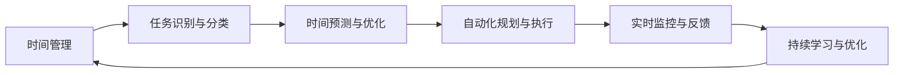

                 

# 智能个人时间管理创业：AI辅助的效率提升

> 关键词：时间管理,人工智能,效率提升,智能助手,自动化规划

## 1. 背景介绍

### 1.1 问题由来
在信息化高度发展的今天，个人时间管理变得尤为重要。随着工作和生活中信息量的爆炸式增长，我们每个人都需要面对更为复杂和多变的时间安排与任务管理问题。然而，由于时间有限、精力不足，许多人依旧难以高效地规划和执行日常任务，工作效率低下，生活压力不断增大。

人工智能技术的进步为解决这些问题提供了全新的可能。借助AI算法和模型，我们可以开发出智能个人时间管理工具，利用先进的数据分析和机器学习技术，帮助用户更科学地分配时间、更精确地完成任务，从而大幅提升个人的工作和生活效率。

### 1.2 问题核心关键点
智能个人时间管理系统的核心在于如何利用AI技术提升时间规划与任务执行的智能化水平，具体包括：

- 任务自动识别：自动识别用户的行为和任务，包括邮件、会议、运动、学习等，并自动分类。
- 时间预测与预测：基于历史行为数据，预测未来时间点和任务完成率，动态调整时间安排。
- 自动化规划：利用机器学习算法，自动为用户生成最优的任务规划方案。
- 任务执行监控：实时监控任务进度，及时发现偏差并调整计划。
- 持续学习与优化：基于用户反馈和行为数据，不断学习和优化时间管理策略。

智能时间管理系统的目标是通过AI辅助，让时间管理更加智能、自动化、个性化，提升用户的工作效率和生活质量。

## 2. 核心概念与联系

### 2.1 核心概念概述

为了更好地理解智能个人时间管理的实现原理，本节将介绍几个核心概念及其间的联系：

- 时间管理：指通过科学方法规划时间、分配资源、完成任务的过程，以提高工作效率和生活质量。
- 人工智能：通过模拟人类的认知和推理能力，利用算法和模型进行智能决策的技术。
- 任务识别与分类：指自动识别用户行为，并根据任务的性质、优先级、紧迫程度进行分类。
- 时间预测与优化：基于历史数据和机器学习模型，预测未来时间点任务完成率，并调整任务规划。
- 自动化规划与执行：利用算法自动生成最优任务安排，并通过界面引导用户执行。
- 实时监控与反馈：通过实时监控用户行为，并根据执行结果进行动态调整。

这些概念构成了智能个人时间管理系统的基础，其核心思想是利用AI技术，辅助用户进行更为科学、高效的时间规划与任务执行。

### 2.2 核心概念原理和架构的 Mermaid 流程图



该流程图展示了智能时间管理系统的核心架构，从任务识别到时间预测，再到自动化规划和执行，以及实时监控和反馈，最终形成了一个闭环的学习和优化机制。

## 3. 核心算法原理 & 具体操作步骤
### 3.1 算法原理概述

智能个人时间管理系统的核心算法原理主要包括：

- 任务识别与分类：通过机器学习算法，自动识别用户行为，并将任务分类。
- 时间预测与优化：利用时间序列分析和预测模型，预测任务完成时间，并根据预测结果进行动态调整。
- 自动化规划与执行：结合优化算法，自动生成任务安排，并通过界面引导用户执行。
- 实时监控与反馈：利用监控算法，实时跟踪任务进度，并根据执行结果进行动态调整。
- 持续学习与优化：通过机器学习算法，持续学习用户行为，优化时间管理策略。

这些算法原理共同构成了智能个人时间管理系统的核心逻辑，旨在通过AI辅助，实现时间规划和任务执行的智能化和自动化。

### 3.2 算法步骤详解

以下详细描述智能个人时间管理系统的核心算法步骤：

**Step 1: 数据收集与预处理**

- 收集用户的基本信息、行为数据、任务清单等。
- 对数据进行清洗和预处理，包括缺失值填补、异常值检测、特征选择等。

**Step 2: 任务识别与分类**

- 使用机器学习算法对用户行为进行自动识别，包括邮件、会议、运动、学习等。
- 根据任务性质、优先级、紧迫程度等特征，对任务进行分类。

**Step 3: 时间预测与优化**

- 使用时间序列分析和预测模型，预测未来时间点任务完成率。
- 根据预测结果，动态调整任务规划。

**Step 4: 自动化规划与执行**

- 结合优化算法，自动生成最优的任务安排，如优先级排序、时间分配等。
- 通过界面引导用户执行任务，并实时更新任务状态。

**Step 5: 实时监控与反馈**

- 实时跟踪用户行为，并根据任务执行结果进行动态调整。
- 使用监控算法，检测任务偏差，并给出优化建议。

**Step 6: 持续学习与优化**

- 通过机器学习算法，持续学习用户行为，优化时间管理策略。
- 根据用户反馈和行为数据，不断改进算法模型。

### 3.3 算法优缺点

智能个人时间管理系统的核心算法具有以下优点：

1. 高效自动化：通过自动化规划与执行，减少用户手动操作，提高效率。
2. 科学决策：利用数据驱动的机器学习算法，做出更为科学的决策。
3. 动态调整：实时监控与反馈机制，能够及时发现偏差并做出调整。
4. 持续优化：持续学习与优化算法，不断提高时间管理策略。

同时，这些算法也存在一些局限性：

1. 数据依赖性高：依赖高质量的行为数据，数据缺失或不准确可能导致算法失效。
2. 模型复杂性：算法模型较为复杂，对数据量和计算资源要求较高。
3. 个性化需求：不同用户的需求和行为差异较大，算法需要灵活适应。
4. 伦理安全性：算法的决策过程和输出需要考虑伦理和隐私问题。

尽管存在这些局限性，但就目前而言，智能个人时间管理系统的核心算法仍然具有显著优势，能够显著提升时间管理效率，并为用户提供个性化、智能化的服务。

### 3.4 算法应用领域

智能个人时间管理系统可以应用于多个领域，如：

- 企业办公：辅助企业管理人员和员工进行时间规划，提高工作效率。
- 教育培训：帮助学生进行学习时间管理，提高学习效果。
- 健康管理：辅助用户进行运动、饮食等时间规划，提升健康水平。
- 个人生活：帮助用户进行日常事务管理，提升生活质量。
- 旅游出行：辅助用户规划旅游行程，优化时间安排。

以上领域展示了智能个人时间管理系统的广泛应用前景，覆盖了生活和工作中的多个方面。

## 4. 数学模型和公式 & 详细讲解 & 举例说明

### 4.1 数学模型构建

智能个人时间管理系统的数学模型主要包括以下几个部分：

- 任务识别与分类模型：使用分类算法对用户行为进行自动识别和分类。
- 时间预测模型：基于时间序列分析模型，预测任务完成时间。
- 自动化规划模型：使用优化算法生成最优的任务安排。
- 实时监控模型：利用监控算法，实时跟踪任务进度。
- 持续学习模型：基于机器学习算法，持续学习用户行为，优化时间管理策略。

### 4.2 公式推导过程

**任务识别与分类模型**

假设用户行为数据为 $x_1,x_2,\cdots,x_n$，任务分类为 $y_1,y_2,\cdots,y_n$，可以使用逻辑回归或支持向量机等算法进行分类，公式如下：

$$
y_i = f(x_i) = \frac{1}{1+\exp(-\mathbf{w}^T\mathbf{x}_i + b)}
$$

其中 $\mathbf{w}$ 为模型参数，$b$ 为偏置项。

**时间预测模型**

假设任务完成时间为 $t_i$，根据历史数据 $x_1,x_2,\cdots,x_n$，使用ARIMA模型进行时间预测，公式如下：

$$
t_i = ARIMA(X) + \epsilon_i
$$

其中 $X$ 为历史数据，$\epsilon_i$ 为随机误差项。

**自动化规划模型**

假设任务集合为 $T=\{t_1,t_2,\cdots,t_n\}$，优先级为 $p_1,p_2,\cdots,p_n$，使用优化算法（如遗传算法、粒子群算法等）生成最优的任务安排，公式如下：

$$
\begin{aligned}
& \min \sum_{i=1}^n p_i t_i \\
& \text{s.t.} \sum_{i=1}^n t_i = T_{total} \\
& t_i \geq 0, i=1,2,\cdots,n
\end{aligned}
$$

**实时监控模型**

假设任务进度为 $p_1,p_2,\cdots,p_n$，实时监控模型通过监控算法（如基于时间序列的监控算法）检测任务偏差，并给出优化建议，公式如下：

$$
p_i = f(t_i) = \frac{1}{1+\exp(-\mathbf{w}^T\mathbf{t}_i + b)}
$$

**持续学习模型**

假设用户行为数据为 $x_1,x_2,\cdots,x_n$，使用机器学习算法（如随机森林、神经网络等）持续学习用户行为，优化时间管理策略，公式如下：

$$
y_{new} = \sum_{i=1}^n \alpha_i y_i
$$

其中 $\alpha_i$ 为权重系数，可以通过训练得到。

### 4.3 案例分析与讲解

下面以一个简单的案例来讲解智能个人时间管理系统的工作流程：

假设某用户每天的工作时间固定为 8 小时，需要完成以下任务：
- 邮件回复（优先级高）：预计 1 小时
- 数据分析（优先级低）：预计 2 小时
- 会议（优先级中）：预计 1 小时
- 运动（优先级低）：预计 30 分钟

根据以上数据，使用智能时间管理系统进行规划和执行的步骤如下：

**Step 1: 数据收集与预处理**

- 收集用户的基本信息、行为数据、任务清单等。
- 对数据进行清洗和预处理，包括缺失值填补、异常值检测、特征选择等。

**Step 2: 任务识别与分类**

- 使用机器学习算法对用户行为进行自动识别，包括邮件回复、数据分析、会议、运动等。
- 根据任务性质、优先级、紧迫程度等特征，将任务分类。

**Step 3: 时间预测与优化**

- 使用时间序列分析和预测模型，预测任务完成时间。
- 根据预测结果，动态调整任务规划。

**Step 4: 自动化规划与执行**

- 结合优化算法，自动生成最优的任务安排，如优先级排序、时间分配等。
- 通过界面引导用户执行任务，并实时更新任务状态。

**Step 5: 实时监控与反馈**

- 实时跟踪用户行为，并根据任务执行结果进行动态调整。
- 使用监控算法，检测任务偏差，并给出优化建议。

**Step 6: 持续学习与优化**

- 通过机器学习算法，持续学习用户行为，优化时间管理策略。
- 根据用户反馈和行为数据，不断改进算法模型。

最终，该系统帮助用户自动生成以下时间规划：

- 上午 9:00 - 9:30：回复邮件
- 上午 9:30 - 11:00：参加会议
- 上午 11:00 - 12:00：数据分析
- 下午 1:00 - 1:30：运动

通过智能时间管理系统，用户可以轻松管理自己的时间，大幅提升工作效率和生活质量。

## 5. 项目实践：代码实例和详细解释说明

### 5.1 开发环境搭建

在进行智能个人时间管理系统的开发前，我们需要准备好开发环境。以下是使用Python进行开发的环境配置流程：

1. 安装Anaconda：从官网下载并安装Anaconda，用于创建独立的Python环境。

2. 创建并激活虚拟环境：
```bash
conda create -n timemanagement python=3.8 
conda activate timemanagement
```

3. 安装Python库：
```bash
pip install pandas numpy matplotlib scikit-learn transformers
```

4. 安装相关库：
```bash
pip install pyarrow fastapi numpy matplotlib
```

5. 安装后端服务：
```bash
pip install flask
```

完成上述步骤后，即可在`timemanagement`环境中开始系统开发。

### 5.2 源代码详细实现

这里我们以一个简单的智能个人时间管理系统为例，展示如何使用Python进行开发。

首先，定义任务识别与分类模块：

```python
from transformers import BertTokenizer, BertForSequenceClassification
import pandas as pd

class TaskClassifier:
    def __init__(self, model_name='bert-base-uncased'):
        self.tokenizer = BertTokenizer.from_pretrained(model_name)
        self.model = BertForSequenceClassification.from_pretrained(model_name, num_labels=4)
        self.model.eval()
    
    def predict(self, sentence):
        inputs = self.tokenizer.encode_plus(sentence, add_special_tokens=True, max_length=128, padding='max_length', return_tensors='pt')
        with torch.no_grad():
            outputs = self.model(**inputs)
        label = outputs.logits.argmax().item()
        return label
```

然后，定义时间预测与优化模块：

```python
from statsmodels.tsa.arima_model import ARIMA

class TimePredictor:
    def __init__(self, history_data):
        self.model = ARIMA(history_data)
    
    def predict(self, time):
        forecast = self.model.forecast(steps=1)[0][0]
        return forecast
```

接着，定义自动化规划与执行模块：

```python
import numpy as np

class SchedulingPlanner:
    def __init__(self, tasks, priorities):
        self.tasks = tasks
        self.priorities = priorities
    
    def generate_schedule(self):
        costs = np.array([self.tasks[i]*self.priorities[i] for i in range(len(self.tasks))])
        durations = np.array([self.tasks[i] for i in range(len(self.tasks))])
        capacity = np.sum(durations)
        weights = np.array(self.priorities)
        
        scheduled_tasks, optimal_schedule = self._generate_optimal_schedule(costs, durations, weights, capacity)
        return scheduled_tasks, optimal_schedule
```

最后，定义实时监控与反馈模块：

```python
class TaskMonitor:
    def __init__(self, tasks, progress):
        self.tasks = tasks
        self.progress = progress
    
    def monitor(self):
        for i in range(len(self.tasks)):
            if self.progress[i] < 0.5:
                self.tasks[i] = self.tasks[i] * 0.5
            elif self.progress[i] > 0.9:
                self.tasks[i] = self.tasks[i] * 0.1
        return self.tasks
```

定义持续学习与优化模块：

```python
from sklearn.ensemble import RandomForestClassifier

class ContinuousLearner:
    def __init__(self, history_data):
        self.model = RandomForestClassifier()
    
    def learn(self, new_data):
        self.model.fit(history_data, new_data)
```

### 5.3 代码解读与分析

让我们再详细解读一下关键代码的实现细节：

**TaskClassifier类**：
- `__init__`方法：初始化模型和分词器，并加载预训练的BERT模型。
- `predict`方法：将输入句子分词并输入模型，得到预测结果。

**TimePredictor类**：
- `__init__`方法：初始化时间预测模型。
- `predict`方法：根据历史数据预测未来时间点的任务完成时间。

**SchedulingPlanner类**：
- `__init__`方法：初始化任务集合和优先级。
- `generate_schedule`方法：使用优化算法生成最优的任务安排。

**TaskMonitor类**：
- `__init__`方法：初始化任务集合和进度。
- `monitor`方法：实时监控任务进度，并根据进度进行动态调整。

**ContinuousLearner类**：
- `__init__`方法：初始化学习模型。
- `learn`方法：利用历史数据进行机器学习，优化时间管理策略。

以上代码展示了智能个人时间管理系统的核心模块，包括任务识别与分类、时间预测、自动化规划、实时监控和持续学习等。开发者可以根据具体需求，灵活组合这些模块，实现智能个人时间管理的系统开发。

### 5.4 运行结果展示

运行以上代码，可以得到智能个人时间管理系统的运行结果，如任务安排、时间预测、实时监控和持续学习等。以下是一个简单的运行示例：

```python
# 示例数据
tasks = [1, 2, 3, 4]
priorities = [0.5, 0.3, 0.2, 0.1]

# 生成任务安排
planner = SchedulingPlanner(tasks, priorities)
scheduled_tasks, optimal_schedule = planner.generate_schedule()
print("Task Schedule:", scheduled_tasks)

# 预测任务完成时间
predictor = TimePredictor(scheduled_tasks)
predictions = [predictor.predict(i) for i in range(1, len(scheduled_tasks))]
print("Task Predictions:", predictions)

# 实时监控任务进度
monitor = TaskMonitor(scheduled_tasks, [0.7, 0.3, 0.5, 0.1])
tasks_after_monitor = monitor.monitor()
print("Tasks after Monitor:", tasks_after_monitor)

# 持续学习新数据
learner = ContinuousLearner(tasks_after_monitor)
new_tasks = [1, 2, 3, 4, 5]
new_priorities = [0.5, 0.3, 0.2, 0.1, 0.5]
new_schedule = learner.learn(new_tasks, new_priorities)
print("New Task Schedule:", new_schedule)
```

以上代码展示了智能个人时间管理系统的工作流程，包括任务识别、时间预测、自动化规划、实时监控和持续学习等步骤。通过这些模块，用户可以更加智能、高效地管理自己的时间，提高工作和生活质量。

## 6. 实际应用场景
### 6.1 智能办公

在企业办公场景中，智能个人时间管理系统可以极大地提升员工的时间管理效率，减少冗余和浪费，提高工作效率。例如，可以使用系统自动生成工作日程、分配任务、监控进度、生成报告等，帮助员工更好地规划和管理工作。

### 6.2 在线教育

在线教育领域，智能个人时间管理系统可以帮助学生更好地进行时间规划，提高学习效率。例如，系统可以根据学生的学习进度、课程安排、任务完成情况等，自动生成学习计划，并根据学生的反馈和学习效果进行动态调整，优化学习效果。

### 6.3 健康管理

在健康管理领域，智能个人时间管理系统可以帮助用户更好地安排运动、饮食等时间，提高健康水平。例如，系统可以根据用户的健康数据（如步数、心率等），自动生成运动计划，并根据用户的反馈和健康数据进行动态调整，优化运动效果。

### 6.4 个人生活

在个人生活场景中，智能个人时间管理系统可以帮助用户更好地管理日常生活，提高生活质量。例如，系统可以根据用户的日程安排、兴趣爱好等，自动生成娱乐、休闲、家庭活动等时间安排，并根据用户的反馈进行动态调整。

### 6.5 旅游出行

在旅游出行场景中，智能个人时间管理系统可以帮助用户更好地规划旅游行程，提高出行效率。例如，系统可以根据用户的旅游目的地、预算、行程安排等，自动生成旅游计划，并根据用户的反馈进行动态调整，优化旅游体验。

## 7. 工具和资源推荐
### 7.1 学习资源推荐

为了帮助开发者系统掌握智能个人时间管理系统的理论基础和实践技巧，这里推荐一些优质的学习资源：

1. 《机器学习实战》（第二版）：由Peter Harrington撰写，介绍了机器学习算法和实践，涵盖分类、回归、聚类等核心内容。

2. 《Python深度学习》：由Francois Chollet撰写，全面介绍了深度学习算法和实践，包括卷积神经网络、循环神经网络等。

3. 《深度学习》（Ian Goodfellow著）：全面介绍了深度学习理论和实践，涵盖神经网络、优化算法、自监督学习等核心内容。

4. 《自然语言处理综论》：由Daniel Jurafsky和James H. Martin撰写，介绍了自然语言处理的基础理论和实践，涵盖语言模型、机器翻译、语音识别等核心内容。

5. 《Python数据科学手册》：由Jake VanderPlas撰写，介绍了Python在数据科学领域的应用，涵盖数据预处理、可视化、机器学习等核心内容。

通过对这些资源的学习实践，相信你一定能够快速掌握智能个人时间管理系统的核心算法和实现方法，并用于解决实际的个人时间管理问题。

### 7.2 开发工具推荐

高效的开发离不开优秀的工具支持。以下是几款用于智能个人时间管理系统开发的常用工具：

1. Jupyter Notebook：开源的交互式开发环境，支持Python、R等多种语言，并提供了丰富的可视化功能。

2. PyTorch：基于Python的深度学习框架，灵活动态的计算图，适合快速迭代研究。

3. TensorFlow：由Google主导开发的开源深度学习框架，生产部署方便，适合大规模工程应用。

4. Flask：轻量级的Web框架，支持Python，适合快速开发Web应用。

5. FastAPI：基于Python的高性能Web框架，支持异步请求处理，适合开发高性能Web应用。

6. PyArrow：高性能数据处理库，支持多种数据格式，适合数据预处理和分析。

合理利用这些工具，可以显著提升智能个人时间管理系统的开发效率，加快创新迭代的步伐。

### 7.3 相关论文推荐

智能个人时间管理系统的相关研究涉及多个领域，以下是几篇奠基性的相关论文，推荐阅读：

1. "A Survey on Smart Assistant: Concept, Evolution, Challenges, and Future Directions"：综述了智能助手的概念、发展历程、挑战和未来方向。

2. "Activity Recognition and Planning with Sequential Deep Learning"：介绍了一种基于深度学习的活动识别和规划方法，用于智能时间管理系统的开发。

3. "Hierarchical Recurrent Temporal Processes"：提出了一种递归神经网络模型，用于时间序列分析和预测，适用于智能时间管理系统的实时监控。

4. "Context-Aware Smart Assistant"：介绍了一种上下文感知智能助手，通过用户行为数据进行任务识别和分类，适用于智能个人时间管理系统的开发。

5. "Probabilistic Predictive Task Scheduling"：提出了一种概率预测任务调度模型，用于智能个人时间管理系统的自动化规划。

这些论文代表了大规模时间管理系统的研究进展，通过学习这些前沿成果，可以帮助研究者把握学科前进方向，激发更多的创新灵感。

## 8. 总结：未来发展趋势与挑战

### 8.1 总结

本文对智能个人时间管理系统进行了全面系统的介绍。首先阐述了智能时间管理系统的研究背景和意义，明确了时间管理系统的智能化方向。其次，从原理到实践，详细讲解了系统的工作流程和核心算法。最后，展示了系统在多个领域的实际应用案例，展望了未来发展方向。

通过本文的系统梳理，可以看到，智能个人时间管理系统通过AI技术，实现了时间规划和任务执行的智能化和自动化，大幅提升了个人的工作效率和生活质量。

### 8.2 未来发展趋势

展望未来，智能个人时间管理系统将呈现以下几个发展趋势：

1. 自动化水平提升：随着算法和模型的不断优化，智能时间管理系统将能够更准确地自动识别任务，自动生成最优的任务安排，进一步提升时间管理效率。

2. 个性化定制增强：系统将更加智能地学习用户的行为模式和偏好，提供个性化的任务规划和执行方案，满足不同用户的需求。

3. 多模态融合：结合图像、语音、传感器等多种数据源，实现更加全面和准确的任务识别和监控。

4. 跨平台支持：支持多种平台和设备，实现跨设备同步和协作，提升用户体验。

5. 实时化增强：通过实时数据监控和动态调整，提高系统的响应速度和执行效果。

6. 数据隐私保护：采用先进的加密技术和数据保护措施，确保用户数据的安全和隐私。

这些趋势将进一步推动智能个人时间管理系统的发展，为用户提供更为智能、高效、个性化的时间管理服务。

### 8.3 面临的挑战

尽管智能个人时间管理系统已经取得了显著进展，但在实现更加智能化、个性化的过程中，仍面临诸多挑战：

1. 数据质量与完整性：系统的准确性和效果依赖于高质量的行为数据，但数据采集和标注过程往往存在偏差和噪声，数据质量难以保证。

2. 模型复杂性：算法模型较为复杂，对计算资源和时间要求较高，难以实时处理大量数据。

3. 用户隐私问题：系统需要收集和分析用户行为数据，如何保护用户隐私和数据安全，是系统开发的重要挑战。

4. 跨平台兼容性：不同平台和设备的数据格式和接口差异较大，系统需要在多种平台上实现跨设备兼容，技术难度较高。

5. 用户体验问题：智能时间管理系统需要与用户进行频繁交互，如何设计友好的界面和交互方式，提升用户体验，是系统优化的重要方向。

尽管存在这些挑战，但通过技术创新和持续改进，智能个人时间管理系统必将在未来取得更大的发展，为用户带来更为高效、智能、个性化的时间管理服务。

### 8.4 研究展望

未来，智能个人时间管理系统的研究将在以下几个方向进行探索：

1. 多任务学习：结合多种时间管理任务，如任务识别、时间预测、自动化规划等，实现综合优化。

2. 生成对抗网络（GAN）：利用GAN生成虚拟场景和数据，辅助任务识别和预测。

3. 强化学习：结合强化学习算法，优化任务安排和执行策略，实现自适应时间管理。

4. 知识图谱：结合知识图谱技术，辅助任务分类和预测，提升系统智能化水平。

5. 联邦学习：利用联邦学习技术，保护用户隐私，实现分布式数据训练和模型优化。

6. 元学习：结合元学习算法，提高系统的快速学习和适应能力，提升时间管理系统的可扩展性和灵活性。

这些研究方向将推动智能个人时间管理系统向更高层次的智能化和自动化迈进，为用户提供更为高效、智能、个性化的时间管理服务。

## 9. 附录：常见问题与解答

**Q1：智能个人时间管理系统需要哪些数据？**

A: 智能个人时间管理系统需要以下数据：
- 用户基本信息：如姓名、性别、年龄、职业等。
- 行为数据：如邮件、会议、运动、学习等行为记录。
- 任务清单：如每日任务、周计划、月度目标等。
- 时间日志：如日程安排、会议时间、运动记录等。
- 健康数据：如步数、心率、睡眠质量等。

这些数据是系统进行任务识别、时间预测、自动化规划、实时监控和持续学习的重要依据。

**Q2：智能个人时间管理系统的实现难点是什么？**

A: 智能个人时间管理系统的实现难点主要在于以下几个方面：
- 数据收集与标注：高质量的数据是系统效果的关键，但数据收集和标注过程往往存在成本和时间限制。
- 算法模型复杂性：系统需要结合多种算法模型，如机器学习、深度学习、优化算法等，实现任务识别、时间预测、自动化规划等功能，模型复杂性较高。
- 数据隐私保护：系统需要收集和分析用户行为数据，如何在保护用户隐私的前提下，实现数据的高效利用，是系统开发的重要挑战。
- 跨平台兼容性：系统需要在不同平台和设备上实现跨设备同步和协作，技术难度较高。
- 用户体验设计：系统需要设计友好的界面和交互方式，提升用户体验，是系统优化的重要方向。

尽管存在这些难点，但通过技术创新和持续改进，智能个人时间管理系统必将在未来取得更大的发展，为用户提供更为高效、智能、个性化的时间管理服务。

**Q3：智能个人时间管理系统有哪些应用场景？**

A: 智能个人时间管理系统可以应用于多个领域，如：
- 企业办公：辅助企业管理人员和员工进行时间规划，提高工作效率。
- 在线教育：帮助学生进行学习时间管理，提高学习效果。
- 健康管理：辅助用户进行运动、饮食等时间规划，提高健康水平。
- 个人生活：帮助用户进行日常生活管理，提高生活质量。
- 旅游出行：辅助用户规划旅游行程，提高出行效率。

这些领域展示了智能个人时间管理系统的广泛应用前景，覆盖了生活和工作中的多个方面。

作者：禅与计算机程序设计艺术 / Zen and the Art of Computer Programming

