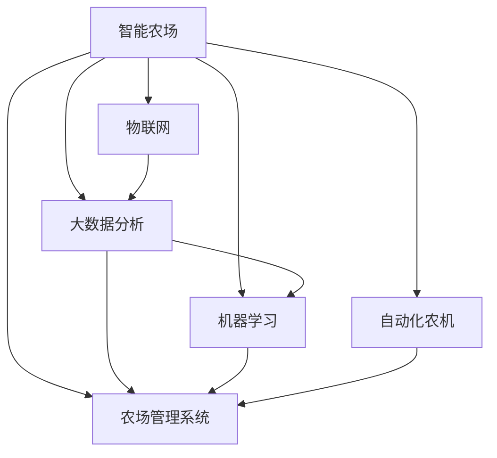

                 

# 智能农场创业：精准农业的未来方向

> 关键词：智能农场,精准农业,物联网(IoT),大数据分析,机器学习,人工智能(AI),自动化,自动化农机,农场管理

## 1. 背景介绍

### 1.1 问题由来
随着全球人口的持续增长，食品需求不断攀升，而可耕地资源相对有限。如何在有限的土地资源上生产更多的食物，成为一个严峻的挑战。精准农业技术应运而生，利用先进的数据采集与分析技术，提升农业生产效率，实现粮食生产的智能化管理。智能农场作为精准农业的一个重要方向，集成了物联网、大数据、机器学习等多种先进技术，极大地提升了农业生产的管理水平和效率。

### 1.2 问题核心关键点
智能农场创业的核心在于如何高效整合和管理各种数据资源，利用先进的技术手段实现农场管理的智能化、自动化。具体来说，以下四个方面是智能农场创业的重要关键点：

- **数据采集与分析**：通过物联网设备收集农场各个环节的数据，如土壤湿度、作物生长状态、天气情况等，并利用大数据分析技术进行综合分析。
- **决策支持系统**：结合机器学习和人工智能技术，对数据进行深入挖掘和处理，提供科学的种植建议和决策支持。
- **自动化农机**：利用自动化技术，如无人驾驶拖拉机、自动化播种和收割等，减少人力成本，提高生产效率。
- **农场管理系统**：构建一体化的农场管理系统，实现农场各个环节的实时监控和协同管理。

## 2. 核心概念与联系

### 2.1 核心概念概述

为了更好地理解智能农场创业的技术框架，我们首先介绍几个核心概念及其相互之间的联系：

- **智能农场**：利用物联网、大数据、人工智能等技术，实现农场管理的智能化、自动化。通过精准农业技术，提升土地利用效率，降低生产成本，提高农产品质量。

- **物联网(IoT)**：通过各种传感器和设备，实现对农场各个环节的数据实时采集和传输。物联网技术是智能农场数据采集的基础。

- **大数据分析**：对物联网设备采集的大量数据进行存储、分析和挖掘，发现数据中的模式和规律，为农场管理提供科学依据。

- **机器学习和人工智能(AI)**：利用算法对数据进行建模和预测，提供种植决策、病虫害防治、农机调度等建议，是智能农场决策支持系统的重要组成部分。

- **自动化农机**：通过机器人和自动化设备，实现农机的无人驾驶和自动化操作，提高农业生产效率，减少人力成本。

- **农场管理系统**：集成各种智能技术，实现对农场各个环节的实时监控和管理，支持农场运营的各个方面。

这些核心概念之间的逻辑关系可以通过以下Mermaid流程图来展示：



这个流程图展示出智能农场各个关键技术之间的联系，通过物联网设备采集数据，并利用大数据和人工智能技术进行分析和处理，最终通过自动化农机和农场管理系统实现农场管理的智能化和自动化。

## 3. 核心算法原理 & 具体操作步骤
### 3.1 算法原理概述

智能农场创业的核心算法原理基于以下几个关键环节：

- **数据采集**：通过各种物联网设备（如土壤湿度传感器、温度传感器、气象站等）实时采集农场各个环节的数据。这些数据通过无线传输技术发送到中央数据处理中心。
- **数据预处理**：对采集到的原始数据进行清洗、去噪和归一化处理，保证数据的质量和一致性。
- **特征提取**：利用机器学习和数据挖掘技术，从原始数据中提取有意义的特征，如作物生长状态、土壤湿度、气温等。
- **模型训练**：使用历史数据训练各种机器学习模型，如回归模型、分类模型、聚类模型等，用于预测作物生长状态、病虫害发生概率、土壤肥力等。
- **决策支持**：根据模型的预测结果，结合农场管理的实际需求，提供科学的种植建议、病虫害防治方案和农机调度计划。

### 3.2 算法步骤详解

智能农场创业的核心算法步骤主要包括以下几个方面：

1. **数据采集与传输**：
   - 安装各种物联网设备，如土壤湿度传感器、温度传感器、气象站等，实时采集农场数据。
   - 使用无线传输技术（如Wi-Fi、Zigbee、LoRa等）将采集到的数据传输到中央数据处理中心。

2. **数据预处理**：
   - 对原始数据进行清洗、去噪和归一化处理，去除异常值和错误数据，保证数据质量。
   - 使用数据转换技术，将不同格式和单位的数据转换为统一格式。

3. **特征提取**：
   - 使用特征提取技术（如PCA、LDA、ICA等）从原始数据中提取有意义的特征，如作物生长状态、土壤湿度、气温等。
   - 对提取出的特征进行降维和处理，减少计算复杂度。

4. **模型训练**：
   - 选择适合的机器学习算法，如回归、分类、聚类等，使用历史数据进行模型训练。
   - 进行交叉验证和模型调参，选择最优的模型和参数组合。

5. **决策支持**：
   - 根据模型的预测结果，结合农场管理的实际需求，提供科学的种植建议、病虫害防治方案和农机调度计划。
   - 将决策支持系统与农场管理系统集成，实现农场各个环节的协同管理。

### 3.3 算法优缺点

智能农场创业的算法具有以下优点：

- **提升生产效率**：通过自动化农机和决策支持系统，大幅降低人力成本，提高生产效率。
- **精准管理**：利用大数据分析和机器学习技术，实现对农场各个环节的精准管理，减少资源浪费。
- **科学决策**：通过科学的数据分析和模型预测，提供准确的种植建议和决策支持，提高农产品质量。

同时，该算法也存在以下局限性：

- **初始投资高**：需要购买和安装各种物联网设备，进行数据采集和传输，初始投资较高。
- **数据依赖性强**：模型的效果很大程度上依赖于采集到的数据质量，数据采集和传输过程中容易出现中断和误差。
- **模型复杂度高**：模型的训练和调参过程较为复杂，需要较高的技术水平和计算资源。

### 3.4 算法应用领域

智能农场创业的算法已在农业生产管理的多个领域得到广泛应用，具体包括：

- **农作物种植管理**：利用数据采集和分析技术，实现对农作物生长状态的实时监控和精准管理，提供种植建议和决策支持。
- **病虫害防治**：通过监测和分析作物生长状态和环境数据，及时发现和防治病虫害，减少损失。
- **农机调度**：利用自动化技术，实现无人驾驶拖拉机、自动化播种和收割等操作，提高农机作业效率。
- **农场运营管理**：集成各种智能技术，实现对农场各个环节的实时监控和管理，支持农场运营的各个方面。

此外，智能农场创业的算法还广泛应用于智慧农业、智能农业机器人、农业物联网等领域，为农业生产管理提供了强大的技术支撑。

## 4. 数学模型和公式 & 详细讲解  
### 4.1 数学模型构建

智能农场创业的数学模型主要包括以下几个部分：

- **数据采集与传输模型**：用于描述数据采集设备和无线传输技术的参数和行为。
- **数据预处理模型**：用于描述数据清洗、去噪和归一化等预处理技术的数学模型。
- **特征提取模型**：用于描述从原始数据中提取有意义的特征的数学模型。
- **模型训练模型**：用于描述机器学习模型的训练过程和参数调整方法。
- **决策支持模型**：用于描述农场管理决策的数学模型。

### 4.2 公式推导过程

以下以农作物生长状态的预测为例，展示智能农场创业的核心算法公式推导过程。

**假设模型**：
假设我们有一组历史数据 $D=\{(x_i, y_i)\}_{i=1}^N$，其中 $x_i$ 为环境特征（如气温、湿度、光照等），$y_i$ 为作物生长状态（如生长阶段、病虫害发生概率等）。

**回归模型**：
我们使用线性回归模型 $y = \theta^T x$ 进行预测，其中 $\theta$ 为模型参数，$x$ 为特征向量。

**模型训练**：
我们通过最小化均方误差损失函数进行模型训练：

$$
\min_{\theta} \sum_{i=1}^N (y_i - \theta^T x_i)^2
$$

通过梯度下降算法更新模型参数 $\theta$：

$$
\theta \leftarrow \theta - \eta \nabla_{\theta} \mathcal{L}(\theta)
$$

其中 $\mathcal{L}(\theta)$ 为损失函数，$\nabla_{\theta} \mathcal{L}(\theta)$ 为损失函数的梯度。

**特征提取**：
利用主成分分析(PCA)技术从原始数据中提取有意义的特征：

$$
X = W x
$$

其中 $W$ 为特征提取矩阵，$X$ 为提取后的特征向量。

**决策支持**：
根据模型的预测结果，提供种植建议和决策支持：

$$
S = \min_{s} \sum_{i=1}^N (y_i - s) f_i
$$

其中 $S$ 为种植建议，$f_i$ 为不同种植建议的权重。

### 4.3 案例分析与讲解

以智能农场创业的农作物种植管理为例，具体分析算法的应用过程：

**数据采集与传输**：
- 在农场安装各种物联网设备，如土壤湿度传感器、温度传感器、气象站等。
- 使用Wi-Fi将采集到的数据传输到中央数据处理中心。

**数据预处理**：
- 对采集到的原始数据进行清洗，去除异常值和错误数据。
- 使用归一化技术将不同格式和单位的数据转换为统一格式。

**特征提取**：
- 使用PCA技术从原始数据中提取有意义的特征，如气温、湿度、光照等。
- 对提取出的特征进行降维和处理，减少计算复杂度。

**模型训练**：
- 选择线性回归模型，使用历史数据进行模型训练。
- 进行交叉验证和模型调参，选择最优的模型和参数组合。

**决策支持**：
- 根据模型的预测结果，提供科学的种植建议和决策支持。
- 将决策支持系统与农场管理系统集成，实现农场各个环节的协同管理。

## 5. 项目实践：代码实例和详细解释说明
### 5.1 开发环境搭建

在进行智能农场创业的项目实践前，我们需要准备好开发环境。以下是使用Python进行PyTorch开发的环境配置流程：

1. 安装Anaconda：从官网下载并安装Anaconda，用于创建独立的Python环境。

2. 创建并激活虚拟环境：
```bash
conda create -n pytorch-env python=3.8 
conda activate pytorch-env
```

3. 安装PyTorch：根据CUDA版本，从官网获取对应的安装命令。例如：
```bash
conda install pytorch torchvision torchaudio cudatoolkit=11.1 -c pytorch -c conda-forge
```

4. 安装TensorFlow：
```bash
pip install tensorflow
```

5. 安装TensorBoard：
```bash
pip install tensorboard
```

6. 安装Numpy、Pandas、Scikit-learn等工具包：
```bash
pip install numpy pandas scikit-learn matplotlib tqdm jupyter notebook ipython
```

完成上述步骤后，即可在`pytorch-env`环境中开始智能农场创业的实践。

### 5.2 源代码详细实现

下面我们以智能农场创业的农作物生长状态预测为例，给出使用TensorFlow进行智能农场创业的代码实现。

首先，定义数据预处理函数：

```python
import numpy as np
import pandas as pd

def preprocess_data(data_file):
    data = pd.read_csv(data_file)
    # 数据清洗和去噪
    data = data.dropna()
    # 归一化
    data['temperature'] = (data['temperature'] - data['temperature'].mean()) / data['temperature'].std()
    data['humidity'] = (data['humidity'] - data['humidity'].mean()) / data['humidity'].std()
    data['light'] = (data['light'] - data['light'].mean()) / data['light'].std()
    # 特征选择
    features = ['temperature', 'humidity', 'light']
    X = data[features].values
    y = data['growth_state'].values
    return X, y
```

然后，定义模型训练函数：

```python
import tensorflow as tf
from sklearn.model_selection import train_test_split

def train_model(X, y, test_size=0.2):
    X_train, X_test, y_train, y_test = train_test_split(X, y, test_size=test_size, random_state=42)
    model = tf.keras.Sequential([
        tf.keras.layers.Dense(64, activation='relu', input_shape=(3,)),
        tf.keras.layers.Dense(64, activation='relu'),
        tf.keras.layers.Dense(1, activation='sigmoid')
    ])
    model.compile(optimizer='adam', loss='binary_crossentropy', metrics=['accuracy'])
    model.fit(X_train, y_train, epochs=50, batch_size=32, validation_data=(X_test, y_test))
    return model
```

接着，定义预测函数：

```python
def predict(model, X):
    y_pred = model.predict(X)
    return y_pred
```

最后，启动训练流程并在测试集上评估：

```python
# 数据预处理
X, y = preprocess_data('data.csv')

# 模型训练
model = train_model(X, y)

# 模型评估
X_test, y_test = preprocess_data('test.csv')
y_pred = predict(model, X_test)
print('Accuracy:', np.mean(y_pred == y_test))
```

以上就是使用TensorFlow对智能农场创业的农作物生长状态预测进行完整代码实现。可以看到，TensorFlow框架使得模型训练和预测的过程非常简单和直观。

### 5.3 代码解读与分析

让我们再详细解读一下关键代码的实现细节：

**数据预处理函数**：
- 使用Pandas读取数据文件。
- 进行数据清洗和去噪，去除缺失值和异常值。
- 对环境特征进行归一化处理，使其分布近似正态。
- 选择有意义的特征进行特征选择和降维。

**模型训练函数**：
- 使用Scikit-learn的数据分割函数，将数据集分为训练集和测试集。
- 构建包含两个隐藏层的神经网络模型，使用二分类交叉熵损失函数进行训练。
- 在训练过程中使用TensorFlow框架，通过Adam优化器进行参数更新。

**预测函数**：
- 使用训练好的模型对新数据进行预测，返回预测结果。

**训练流程**：
- 在训练集上使用模型训练函数进行模型训练。
- 在测试集上使用预测函数进行模型评估，输出准确率。

可以看到，TensorFlow框架使得模型训练和预测的过程非常简单和直观，开发者可以将更多精力放在数据处理和模型改进等高层逻辑上。

当然，实际应用中还需要考虑更多因素，如模型的保存和部署、超参数的自动搜索、更灵活的任务适配层等。但核心的智能农场创业算法基本与此类似。

## 6. 实际应用场景
### 6.1 智能农场

智能农场作为精准农业的一个重要方向，利用先进的数据采集与分析技术，实现农场管理的智能化和自动化。具体应用场景包括：

- **农作物种植管理**：利用数据采集和分析技术，实现对农作物生长状态的实时监控和精准管理，提供种植建议和决策支持。
- **病虫害防治**：通过监测和分析作物生长状态和环境数据，及时发现和防治病虫害，减少损失。
- **农机调度**：利用自动化技术，实现无人驾驶拖拉机、自动化播种和收割等操作，提高农机作业效率。
- **农场运营管理**：集成各种智能技术，实现对农场各个环节的实时监控和管理，支持农场运营的各个方面。

### 6.2 智慧农业

智慧农业是指通过物联网、大数据、人工智能等技术，实现农业生产的智能化和高效化。具体应用场景包括：

- **智能温室**：通过物联网设备采集温室内的环境数据，结合机器学习技术进行数据分析和预测，提供智能灌溉、智能施肥等建议。
- **智能养殖**：利用传感器和机器学习技术，实现对养殖环境的监控和预测，提高养殖效率和产品质量。
- **智慧农业机器人**：利用自动化和机器人技术，实现农机的自主导航、精确作业等操作。

### 6.3 农业物联网

农业物联网是指通过物联网技术，实现对农业生产各个环节的实时监控和数据采集。具体应用场景包括：

- **智能灌溉系统**：通过传感器采集土壤湿度和气象数据，结合机器学习技术进行数据分析和预测，实现智能灌溉。
- **智能施肥系统**：通过传感器采集土壤肥力数据，结合机器学习技术进行数据分析和预测，实现智能施肥。
- **智能监测系统**：通过传感器采集农作物的生长状态和环境数据，结合机器学习技术进行数据分析和预测，实现对农业生产的实时监控和预测。

## 7. 工具和资源推荐
### 7.1 学习资源推荐

为了帮助开发者系统掌握智能农场创业的理论基础和实践技巧，这里推荐一些优质的学习资源：

1. **TensorFlow官方文档**：TensorFlow的官方文档，提供了大量教程和样例代码，是学习智能农场创业算法的最佳资源。
2. **PyTorch官方文档**：PyTorch的官方文档，提供了大量教程和样例代码，是学习智能农场创业算法的另一重要资源。
3. **Coursera《深度学习专项课程》**：斯坦福大学开设的深度学习专项课程，涵盖深度学习的基础知识和应用案例，适合初学者入门。
4. **edX《人工智能基础》课程**：麻省理工学院开设的人工智能基础课程，涵盖人工智能的基本概念和算法，适合进一步深入学习。
5. **Kaggle智能农场创业竞赛**：Kaggle平台上举办的智能农场创业竞赛，提供大量数据和样例代码，适合实际练习和应用。

通过对这些资源的学习实践，相信你一定能够快速掌握智能农场创业的精髓，并用于解决实际的农业问题。

### 7.2 开发工具推荐

高效的开发离不开优秀的工具支持。以下是几款用于智能农场创业开发的常用工具：

1. **TensorFlow**：由Google主导开发的开源深度学习框架，生产部署方便，适合大规模工程应用。
2. **PyTorch**：由Facebook主导开发的开源深度学习框架，灵活动态的计算图，适合快速迭代研究。
3. **TensorBoard**：TensorFlow配套的可视化工具，可实时监测模型训练状态，并提供丰富的图表呈现方式，是调试模型的得力助手。
4. **Jupyter Notebook**：一个交互式的数据科学和机器学习环境，支持Python、R等多种语言，适合进行数据处理和模型训练。

合理利用这些工具，可以显著提升智能农场创业的开发效率，加快创新迭代的步伐。

### 7.3 相关论文推荐

智能农场创业的技术发展源于学界的持续研究。以下是几篇奠基性的相关论文，推荐阅读：

1. **《基于深度学习的精准农业模型》**：介绍如何使用深度学习模型进行农作物生长状态的预测，提出多种算法和技术。
2. **《智慧农业：物联网与大数据的融合》**：探讨物联网与大数据技术在智慧农业中的应用，提出多种智能农业解决方案。
3. **《农业物联网技术与应用》**：介绍农业物联网的基本概念和技术实现，涵盖智能灌溉、智能施肥等多个应用场景。

这些论文代表了大规模农业数据处理的最新进展，为智能农场创业提供了重要的理论支持。

## 8. 总结：未来发展趋势与挑战

### 8.1 总结

本文对智能农场创业的理论基础和实践过程进行了全面系统的介绍。首先阐述了智能农场创业的背景和重要性，明确了智能农场创业在提升农业生产效率、降低生产成本等方面的独特价值。其次，从原理到实践，详细讲解了智能农场创业的数学模型和关键算法，给出了智能农场创业项目的完整代码实例。同时，本文还广泛探讨了智能农场创业在农业生产管理、智慧农业、农业物联网等多个领域的应用前景，展示了智能农场创业范式的广阔潜力。最后，本文精选了智能农场创业的学习资源、开发工具和相关论文，力求为读者提供全方位的技术指引。

通过本文的系统梳理，可以看到，智能农场创业技术正在成为农业生产管理的重要方向，极大地提升了农业生产的管理水平和效率。未来，伴随数据采集技术的不断发展，智能农场创业将有更大的发展空间，为农业生产带来新的变革。

### 8.2 未来发展趋势

展望未来，智能农场创业技术将呈现以下几个发展趋势：

1. **数据采集技术不断进步**：随着物联网技术的不断进步，传感器和设备的成本不断降低，采集数据的质量和实时性将不断提升。
2. **数据分析技术更加多样化**：大数据、机器学习、深度学习等技术将不断应用于智能农场创业，提供更加精准、高效的分析结果。
3. **自动化技术不断提升**：自动化农机、自动化温室等设备将更加智能和高效，实现更加精准和高效的农业生产管理。
4. **集成化程度不断提升**：农场管理系统将更加集成化和智能化，实现对农场各个环节的实时监控和管理。
5. **可持续发展成为重要方向**：智能农场创业将更加注重可持续发展，如智能灌溉、智能施肥等，减少资源浪费和环境污染。

以上趋势凸显了智能农场创业技术的广阔前景。这些方向的探索发展，必将进一步提升农业生产的管理水平和效率，为人类食品供应和环境保护带来深远影响。

### 8.3 面临的挑战

尽管智能农场创业技术已经取得了瞩目成就，但在迈向更加智能化、普适化应用的过程中，它仍面临着诸多挑战：

1. **初始投资高**：需要购买和安装各种物联网设备，进行数据采集和传输，初始投资较高。
2. **数据依赖性强**：模型的效果很大程度上依赖于采集到的数据质量，数据采集和传输过程中容易出现中断和误差。
3. **技术门槛高**：智能农场创业需要掌握多种先进技术，如机器学习、深度学习、物联网等，技术门槛较高。
4. **集成化程度低**：农场管理系统需要集成多种设备和系统，集成化程度低可能导致系统不稳定。
5. **数据安全和隐私保护**：农业生产数据涉及个人隐私和农业安全，需要采取有效的数据安全和隐私保护措施。

正视智能农场创业面临的这些挑战，积极应对并寻求突破，将使智能农场创业技术更好地服务于农业生产，推动农业生产管理走向智能化和高效化。

### 8.4 研究展望

面对智能农场创业技术面临的挑战，未来的研究需要在以下几个方面寻求新的突破：

1. **降低初始投资成本**：开发更加低成本、高效能的物联网设备和传感器，降低智能农场创业的初始投资。
2. **提升数据采集质量**：研究和应用更加稳定、高效的无线传输技术，提升数据采集的实时性和准确性。
3. **降低技术门槛**：开发更加易用、易懂的开发工具和框架，降低智能农场创业的技术门槛。
4. **提高集成化程度**：开发更加集成化和智能化的农场管理系统，实现对农场各个环节的实时监控和管理。
5. **加强数据安全和隐私保护**：研究和应用更加有效的数据安全和隐私保护措施，确保农业生产数据的安全。

这些研究方向的探索，必将引领智能农场创业技术迈向更高的台阶，为农业生产管理带来更大的便利和效益。

## 9. 附录：常见问题与解答

**Q1：智能农场创业对农业生产有哪些好处？**

A: 智能农场创业通过数据采集和分析技术，实现对农业生产各个环节的实时监控和精准管理，具有以下好处：

1. **提高生产效率**：通过自动化农机和决策支持系统，大幅降低人力成本，提高生产效率。
2. **减少资源浪费**：利用大数据分析和机器学习技术，实现对农业生产各个环节的精准管理，减少资源浪费。
3. **提高农产品质量**：通过科学的数据分析和模型预测，提供准确的种植建议和决策支持，提高农产品质量。

**Q2：智能农场创业需要哪些关键技术？**

A: 智能农场创业需要以下关键技术：

1. **物联网(IoT)**：通过各种传感器和设备，实现对农场各个环节的数据实时采集和传输。
2. **大数据分析**：对物联网设备采集的大量数据进行存储、分析和挖掘，发现数据中的模式和规律。
3. **机器学习和人工智能(AI)**：利用算法对数据进行建模和预测，提供种植建议和决策支持。
4. **自动化农机**：通过机器人和自动化设备，实现农机的无人驾驶和自动化操作，提高农机作业效率。
5. **农场管理系统**：集成各种智能技术，实现对农场各个环节的实时监控和管理。

**Q3：智能农场创业的初始投资主要包括哪些方面？**

A: 智能农场创业的初始投资主要包括：

1. **物联网设备**：如土壤湿度传感器、温度传感器、气象站等，用于数据采集。
2. **无线传输设备**：如Wi-Fi、Zigbee、LoRa等，用于数据传输。
3. **计算设备**：如高性能服务器、GPU等，用于模型训练和数据处理。
4. **软件系统**：如农场管理系统、决策支持系统等，用于农场运营管理。
5. **技术培训和人员招聘**：用于技术支持和系统维护。

**Q4：智能农场创业的数据采集和传输技术有哪些？**

A: 智能农场创业的数据采集和传输技术主要包括以下几种：

1. **Wi-Fi**：通过Wi-Fi将数据传输到中央数据处理中心。
2. **Zigbee**：通过Zigbee协议将数据传输到中央数据处理中心。
3. **LoRa**：通过LoRa协议将数据传输到中央数据处理中心。
4. **蓝牙**：通过蓝牙将数据传输到中央数据处理中心。
5. **5G网络**：利用5G网络实现数据的高效传输。

**Q5：智能农场创业的模型训练过程主要有哪些步骤？**

A: 智能农场创业的模型训练过程主要包括以下几个步骤：

1. **数据预处理**：对原始数据进行清洗、去噪和归一化处理。
2. **特征提取**：利用特征提取技术从原始数据中提取有意义的特征。
3. **模型训练**：选择适合的机器学习算法，使用历史数据进行模型训练。
4. **模型评估**：在测试集上评估模型的性能，选择合适的模型和参数组合。

---

作者：禅与计算机程序设计艺术 / Zen and the Art of Computer Programming

