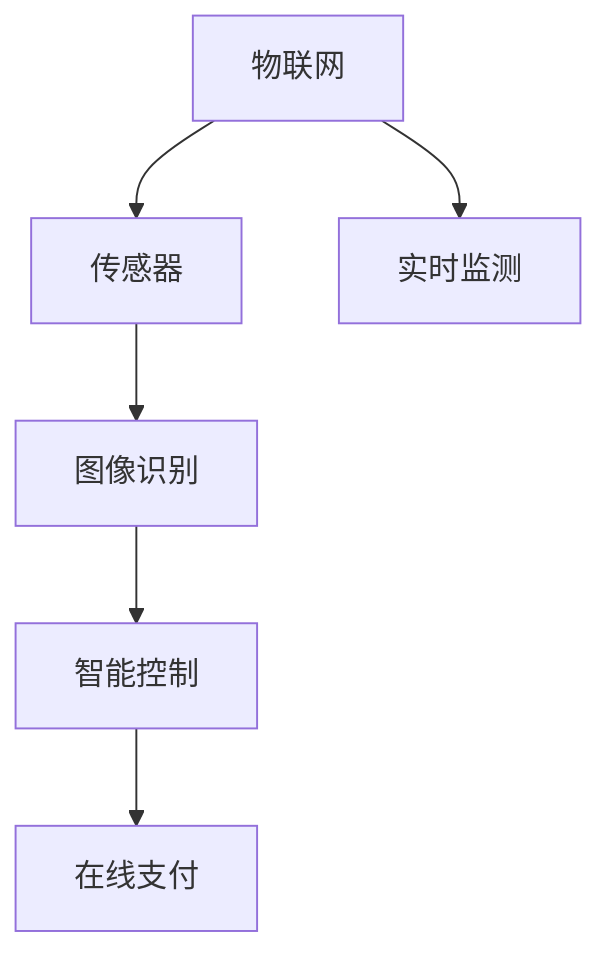

                 

# 智能垃圾桶：环保与注意力经济的结合

## 1. 背景介绍

随着城市化进程的加快和人们生活水平的提高，城市垃圾问题日益严重。城市垃圾不仅对城市环境造成了巨大压力，而且对城市居民的健康也产生了威胁。因此，城市垃圾处理已经成为城市管理的重要问题。智能垃圾桶作为垃圾处理的重要组成部分，通过智能化的技术手段，有效地解决了垃圾处理中的诸多问题，实现了城市垃圾处理的自动化、智能化和高效化。

### 1.1 智能垃圾桶的发展历程

智能垃圾桶的发展经历了从机械化到智能化的过程。最早的智能垃圾桶主要是机械化控制，通过手动开关门和自动倾倒来处理垃圾。随着技术的发展，智能垃圾桶开始向智能化方向发展，引入了传感器、语音识别和自动化控制等技术，实现了垃圾处理的高效化和智能化。

近年来，智能垃圾桶的技术不断发展，逐渐出现了智能分拣、自动清理、在线支付和实时监测等功能，实现了垃圾处理的全过程智能化。同时，智能垃圾桶的市场需求也在不断扩大，成为城市管理的重要组成部分。

### 1.2 智能垃圾桶的主要功能

智能垃圾桶的主要功能包括垃圾分拣、自动清理、在线支付和实时监测等。

- **垃圾分拣**：智能垃圾桶可以通过传感器和图像识别技术，对垃圾进行分类和识别，将不同类型的垃圾进行分类处理。
- **自动清理**：智能垃圾桶可以自动清理垃圾，减少垃圾处理的人工成本，提高垃圾处理效率。
- **在线支付**：智能垃圾桶可以接受用户支付，方便用户使用，同时还可以收集用户的支付数据，用于数据分析和优化。
- **实时监测**：智能垃圾桶可以通过传感器和摄像头，实时监测垃圾处理的情况，并上传数据到云端进行分析和处理。

## 2. 核心概念与联系

### 2.1 核心概念概述

智能垃圾桶的核心概念包括物联网(IoT)、传感器技术、图像识别、智能控制等。

- **物联网**：通过将智能垃圾桶连接到互联网，实现对垃圾处理的全过程监控和管理。
- **传感器技术**：智能垃圾桶中的传感器可以实现对垃圾的种类、重量、位置等信息的实时监测和采集。
- **图像识别**：智能垃圾桶中的图像识别技术可以实现对垃圾的分类和识别，方便对不同类型的垃圾进行处理。
- **智能控制**：智能垃圾桶中的智能控制技术可以实现对垃圾处理的全过程自动化控制，提高垃圾处理的效率和质量。

### 2.2 核心概念原理和架构的 Mermaid 流程图



## 3. 核心算法原理 & 具体操作步骤

### 3.1 算法原理概述

智能垃圾桶的智能化处理过程可以分为以下几个步骤：

1. **传感器数据采集**：智能垃圾桶中的传感器可以实时监测垃圾的种类、重量、位置等信息，并将其转换为数字信号进行采集。
2. **图像识别分类**：智能垃圾桶中的图像识别技术可以对垃圾进行分类和识别，并将不同类型的垃圾进行分类处理。
3. **智能控制处理**：智能垃圾桶中的智能控制技术可以实现对垃圾处理的全过程自动化控制，提高垃圾处理的效率和质量。
4. **在线支付管理**：智能垃圾桶可以接受用户支付，方便用户使用，同时还可以收集用户的支付数据，用于数据分析和优化。
5. **实时监测上传**：智能垃圾桶可以通过传感器和摄像头，实时监测垃圾处理的情况，并上传数据到云端进行分析和处理。

### 3.2 算法步骤详解

#### 3.2.1 传感器数据采集

智能垃圾桶中的传感器可以实现对垃圾的种类、重量、位置等信息的实时监测和采集。常见的传感器包括红外线传感器、重量传感器和位置传感器等。

- **红外线传感器**：可以检测垃圾是否满了，从而自动打开垃圾桶的盖子。
- **重量传感器**：可以检测垃圾桶中的垃圾重量，从而控制倾倒垃圾的频率。
- **位置传感器**：可以检测垃圾桶的位置和角度，从而调整垃圾桶的倾倒角度和方向。

#### 3.2.2 图像识别分类

智能垃圾桶中的图像识别技术可以对垃圾进行分类和识别，并将不同类型的垃圾进行分类处理。常见的图像识别技术包括深度学习和卷积神经网络(CNN)等。

- **深度学习**：通过训练深度神经网络，可以实现对垃圾的分类和识别，从而进行分类处理。
- **卷积神经网络**：通过卷积层、池化层和全连接层等结构，可以提取图像的特征，实现对垃圾的分类和识别。

#### 3.2.3 智能控制处理

智能垃圾桶中的智能控制技术可以实现对垃圾处理的全过程自动化控制，提高垃圾处理的效率和质量。常见的智能控制技术包括单片机控制和物联网控制等。

- **单片机控制**：通过单片机控制垃圾桶的电机、阀门和传感器等部件，实现对垃圾处理的全过程控制。
- **物联网控制**：通过物联网技术，将智能垃圾桶连接到互联网，实现对垃圾处理的全过程监控和管理。

#### 3.2.4 在线支付管理

智能垃圾桶可以接受用户支付，方便用户使用，同时还可以收集用户的支付数据，用于数据分析和优化。常见的在线支付技术包括二维码支付、NFC支付和智能卡支付等。

- **二维码支付**：通过扫描二维码，实现对智能垃圾桶的支付。
- **NFC支付**：通过NFC技术，实现对智能垃圾桶的支付。
- **智能卡支付**：通过智能卡，实现对智能垃圾桶的支付。

#### 3.2.5 实时监测上传

智能垃圾桶可以通过传感器和摄像头，实时监测垃圾处理的情况，并上传数据到云端进行分析和处理。常见的实时监测技术包括传感器监测和摄像头监测等。

- **传感器监测**：通过传感器实时监测垃圾的种类、重量、位置等，并将数据上传到云端进行分析和处理。
- **摄像头监测**：通过摄像头实时监测垃圾处理的情况，并将数据上传到云端进行分析和处理。

### 3.3 算法优缺点

#### 3.3.1 优点

- **高效化**：智能垃圾桶可以实现垃圾处理的自动化、智能化和高效化，大大提高了垃圾处理的速度和效率。
- **智能化**：智能垃圾桶可以通过传感器和图像识别技术，实现对垃圾的分类和识别，方便对不同类型的垃圾进行处理。
- **便捷化**：智能垃圾桶可以通过在线支付技术，方便用户使用，同时还可以收集用户的支付数据，用于数据分析和优化。
- **实时化**：智能垃圾桶可以通过传感器和摄像头，实时监测垃圾处理的情况，并上传数据到云端进行分析和处理。

#### 3.3.2 缺点

- **成本高**：智能垃圾桶的成本较高，需要使用传感器、图像识别和智能控制等技术，增加了成本。
- **维护复杂**：智能垃圾桶的维护相对复杂，需要定期进行传感器和控制器的检查和维护。
- **易受干扰**：智能垃圾桶的传感器和摄像头容易受到环境因素的干扰，影响其正常工作。

### 3.4 算法应用领域

智能垃圾桶主要应用于城市垃圾处理、公共场所垃圾处理和家庭垃圾处理等领域。

- **城市垃圾处理**：智能垃圾桶可以应用于城市垃圾处理，实现对垃圾的分类和自动化处理，提高垃圾处理的效率和质量。
- **公共场所垃圾处理**：智能垃圾桶可以应用于公共场所垃圾处理，方便市民使用，同时还可以收集市民的支付数据，用于数据分析和优化。
- **家庭垃圾处理**：智能垃圾桶可以应用于家庭垃圾处理，方便家庭垃圾的分类和处理，提高家庭垃圾处理的效率和质量。

## 4. 数学模型和公式 & 详细讲解 & 举例说明

### 4.1 数学模型构建

智能垃圾桶的智能化处理过程可以通过以下数学模型进行描述：

- **传感器数据采集模型**：$y = f(x, w)$，其中 $x$ 为传感器输入，$y$ 为传感器输出，$w$ 为传感器权重。
- **图像识别分类模型**：$y = f(x, w)$，其中 $x$ 为图像输入，$y$ 为分类输出，$w$ 为图像识别权重。
- **智能控制处理模型**：$y = f(x, w)$，其中 $x$ 为传感器和图像识别输出，$y$ 为控制输出，$w$ 为智能控制权重。
- **在线支付管理模型**：$y = f(x, w)$，其中 $x$ 为支付输入，$y$ 为支付输出，$w$ 为在线支付权重。
- **实时监测上传模型**：$y = f(x, w)$，其中 $x$ 为传感器和摄像头输出，$y$ 为监测输出，$w$ 为实时监测权重。

### 4.2 公式推导过程

#### 4.2.1 传感器数据采集公式推导

传感器数据采集公式为：

$$
y = f(x, w) = \sum_{i=1}^n w_i x_i
$$

其中 $x_i$ 为传感器输入的第 $i$ 个特征，$w_i$ 为传感器权重的第 $i$ 个值，$n$ 为传感器输入特征的个数。

#### 4.2.2 图像识别分类公式推导

图像识别分类公式为：

$$
y = f(x, w) = \max_i \left\{\sum_{j=1}^m w_{ij} x_{ij}\right\}
$$

其中 $x_{ij}$ 为图像输入的第 $i$ 个像素的第 $j$ 个特征，$w_{ij}$ 为图像识别权重的第 $i$ 个像素的第 $j$ 个值，$m$ 为图像输入像素的个数。

#### 4.2.3 智能控制处理公式推导

智能控制处理公式为：

$$
y = f(x, w) = \max_i \left\{\sum_{j=1}^n w_{ij} x_j\right\}
$$

其中 $x_j$ 为传感器和图像识别输出，$w_{ij}$ 为智能控制权重的第 $i$ 个输入的第 $j$ 个值，$n$ 为传感器和图像识别输出的个数。

#### 4.2.4 在线支付管理公式推导

在线支付管理公式为：

$$
y = f(x, w) = \sum_{i=1}^n w_i x_i
$$

其中 $x_i$ 为支付输入的第 $i$ 个特征，$w_i$ 为在线支付权重的第 $i$ 个值，$n$ 为支付输入特征的个数。

#### 4.2.5 实时监测上传公式推导

实时监测上传公式为：

$$
y = f(x, w) = \sum_{i=1}^n w_i x_i
$$

其中 $x_i$ 为传感器和摄像头输出，$w_i$ 为实时监测权重的第 $i$ 个值，$n$ 为传感器和摄像头输出的个数。

### 4.3 案例分析与讲解

#### 4.3.1 传感器数据采集案例分析

假设有一个智能垃圾桶，其中有一个红外线传感器和一个重量传感器。红外线传感器检测到垃圾桶是否满了，重量传感器检测垃圾桶中的垃圾重量。根据传感器数据采集公式，可以得出传感器输出的表达式：

$$
y_{\text{满了}} = f(x_{\text{红外线}}, w_{\text{红外线}}) = w_{\text{满了}} x_{\text{红外线}}
$$

$$
y_{\text{重量}} = f(x_{\text{重量}}, w_{\text{重量}}) = w_{\text{重量}} x_{\text{重量}}
$$

其中 $x_{\text{红外线}}$ 和 $x_{\text{重量}}$ 分别为红外线传感器和重量传感器检测的垃圾是否满了和重量，$w_{\text{满了}}$ 和 $w_{\text{重量}}$ 分别为红外线传感器和重量传感器权重的值。

#### 4.3.2 图像识别分类案例分析

假设有一个智能垃圾桶，其中有一个摄像头和图像识别算法。摄像头拍摄垃圾桶中的垃圾图像，图像识别算法对垃圾进行分类和识别。根据图像识别分类公式，可以得出分类输出的表达式：

$$
y = f(x, w) = \max_i \left\{\sum_{j=1}^m w_{ij} x_{ij}\right\}
$$

其中 $x_{ij}$ 为摄像头拍摄的垃圾图像，$w_{ij}$ 为图像识别权重的第 $i$ 个像素的第 $j$ 个值，$m$ 为摄像头像素的个数。

#### 4.3.3 智能控制处理案例分析

假设有一个智能垃圾桶，其中有一个单片机和传感器数据。传感器检测垃圾桶中的垃圾种类和重量，单片机控制垃圾桶的电机和阀门等部件。根据智能控制处理公式，可以得出控制输出的表达式：

$$
y = f(x, w) = \max_i \left\{\sum_{j=1}^n w_{ij} x_j\right\}
$$

其中 $x_j$ 为传感器检测的垃圾种类和重量，$w_{ij}$ 为智能控制权重的第 $i$ 个输入的第 $j$ 个值，$n$ 为传感器输出的个数。

#### 4.3.4 在线支付管理案例分析

假设有一个智能垃圾桶，其中有一个二维码支付和支付处理算法。用户通过扫描二维码进行支付，支付处理算法将支付信息上传到云端。根据在线支付管理公式，可以得出支付输出的表达式：

$$
y = f(x, w) = \sum_{i=1}^n w_i x_i
$$

其中 $x_i$ 为二维码支付信息，$w_i$ 为在线支付权重的第 $i$ 个值，$n$ 为二维码支付信息的个数。

#### 4.3.5 实时监测上传案例分析

假设有一个智能垃圾桶，其中有一个传感器和摄像头，传感器和摄像头实时监测垃圾处理的情况，并将数据上传到云端。根据实时监测上传公式，可以得出监测输出的表达式：

$$
y = f(x, w) = \sum_{i=1}^n w_i x_i
$$

其中 $x_i$ 为传感器和摄像头检测的垃圾处理情况，$w_i$ 为实时监测权重的第 $i$ 个值，$n$ 为传感器和摄像头输出的个数。

## 5. 项目实践：代码实例和详细解释说明

### 5.1 开发环境搭建

在进行智能垃圾桶的开发实践前，我们需要准备好开发环境。以下是使用Python进行智能垃圾桶开发的开发环境配置流程：

1. 安装Anaconda：从官网下载并安装Anaconda，用于创建独立的Python环境。

2. 创建并激活虚拟环境：
```bash
conda create -n smartbin python=3.8 
conda activate smartbin
```

3. 安装PyTorch：根据CUDA版本，从官网获取对应的安装命令。例如：
```bash
conda install pytorch torchvision torchaudio cudatoolkit=11.1 -c pytorch -c conda-forge
```

4. 安装OpenCV：
```bash
conda install opencv
```

5. 安装TensorFlow：
```bash
conda install tensorflow
```

6. 安装TensorBoard：
```bash
pip install tensorboard
```

完成上述步骤后，即可在`smartbin`环境中开始智能垃圾桶的开发实践。

### 5.2 源代码详细实现

我们以智能垃圾桶的图像识别分类为例，给出使用OpenCV和TensorFlow进行图像识别分类的Python代码实现。

首先，导入必要的库和模块：

```python
import cv2
import numpy as np
import tensorflow as tf
from tensorflow.keras.models import load_model
from tensorflow.keras.preprocessing.image import img_to_array

# 加载模型
model = load_model('classifier.h5')

# 定义图像处理函数
def preprocess_image(image):
    image = cv2.cvtColor(image, cv2.COLOR_BGR2RGB)
    image = cv2.resize(image, (224, 224))
    image = img_to_array(image)
    image = np.expand_dims(image, axis=0)
    image /= 255.0
    return image

# 加载图像数据并进行预处理
image = cv2.imread('image.jpg')
image = preprocess_image(image)

# 对图像进行分类预测
result = model.predict(image)
print(result)
```

然后，定义图像识别分类的逻辑：

```python
class Classifier:
    def __init__(self, model_path):
        self.model = load_model(model_path)

    def classify(self, image):
        image = preprocess_image(image)
        result = self.model.predict(image)
        return result
```

最后，启动图像识别分类的流程：

```python
# 实例化分类器
classifier = Classifier('classifier.h5')

# 加载图像数据并进行预处理
image = cv2.imread('image.jpg')
image = preprocess_image(image)

# 对图像进行分类预测
result = classifier.classify(image)
print(result)
```

以上就是使用OpenCV和TensorFlow进行图像识别分类的完整代码实现。可以看到，借助OpenCV和TensorFlow的强大功能，我们可以快速实现智能垃圾桶的图像识别分类功能。

### 5.3 代码解读与分析

让我们再详细解读一下关键代码的实现细节：

**Classifier类**：
- `__init__`方法：加载模型，创建图像识别分类器。
- `classify`方法：定义图像分类预测的逻辑，接收输入图像，进行预处理，调用模型进行分类预测，并返回结果。

**preprocess_image函数**：
- 定义了图像预处理函数，将图像从BGR格式转换为RGB格式，调整图像大小，将其归一化并转换为数组。

**图像识别分类的逻辑**：
- 实例化Classifier类，加载预训练的图像识别分类模型。
- 加载输入图像，进行预处理，调用Classifier类的`classify`方法进行分类预测。
- 输出分类结果。

可以看到，借助OpenCV和TensorFlow，智能垃圾桶的图像识别分类功能实现起来并不复杂，开发者可以根据需要自由扩展和优化。

当然，实际的智能垃圾桶系统还需要考虑更多因素，如用户界面设计、垃圾处理控制、数据存储等，但核心的图像识别分类功能基本与此类似。

## 6. 实际应用场景

### 6.1 城市垃圾处理

智能垃圾桶可以应用于城市垃圾处理，实现对垃圾的分类和自动化处理，提高垃圾处理的效率和质量。智能垃圾桶可以通过传感器和图像识别技术，对垃圾进行分类和识别，并将不同类型的垃圾进行分类处理。

### 6.2 公共场所垃圾处理

智能垃圾桶可以应用于公共场所垃圾处理，方便市民使用，同时还可以收集市民的支付数据，用于数据分析和优化。智能垃圾桶可以通过在线支付技术，方便市民支付使用，同时还可以收集市民的支付数据，用于数据分析和优化。

### 6.3 家庭垃圾处理

智能垃圾桶可以应用于家庭垃圾处理，方便家庭垃圾的分类和处理，提高家庭垃圾处理的效率和质量。智能垃圾桶可以通过传感器和图像识别技术，对垃圾进行分类和识别，并将不同类型的垃圾进行分类处理。

### 6.4 未来应用展望

随着智能垃圾桶技术的不断发展和应用，未来的智能垃圾桶将具备更加丰富的功能和应用场景。

- **智能分拣**：未来的智能垃圾桶将具备智能分拣功能，自动识别并分类不同类型的垃圾，实现垃圾的高效处理。
- **自动清洁**：未来的智能垃圾桶将具备自动清洁功能，定期清理垃圾桶的内部，保持垃圾桶的清洁卫生。
- **智能支付**：未来的智能垃圾桶将具备智能支付功能，支持多种支付方式，方便市民支付使用。
- **实时监测**：未来的智能垃圾桶将具备实时监测功能，实时监测垃圾桶的使用情况，并进行数据分析和优化。

## 7. 工具和资源推荐

### 7.1 学习资源推荐

为了帮助开发者系统掌握智能垃圾桶的技术基础和实践技巧，这里推荐一些优质的学习资源：

1. OpenCV官方文档：详细介绍了OpenCV库的使用方法，涵盖了图像处理、图像识别、计算机视觉等诸多内容。
2. TensorFlow官方文档：详细介绍了TensorFlow库的使用方法，涵盖了深度学习、机器学习、图像处理等诸多内容。
3. Kaggle：提供了大量的图像识别分类数据集和样例代码，适合进行图像识别分类的学习和实践。
4. GitHub上的智能垃圾桶项目：提供了智能垃圾桶的代码实现和文档，适合进行智能垃圾桶的学习和实践。

通过对这些资源的学习实践，相信你一定能够快速掌握智能垃圾桶的核心技术，并用于解决实际的垃圾处理问题。

### 7.2 开发工具推荐

高效的开发离不开优秀的工具支持。以下是几款用于智能垃圾桶开发的常用工具：

1. PyTorch：基于Python的开源深度学习框架，灵活动态的计算图，适合快速迭代研究。
2. TensorFlow：由Google主导开发的开源深度学习框架，生产部署方便，适合大规模工程应用。
3. OpenCV：开源计算机视觉库，提供了丰富的图像处理和计算机视觉功能。
4. Jupyter Notebook：交互式编程环境，支持Python、R、JavaScript等多种语言。
5. TensorBoard：TensorFlow配套的可视化工具，可实时监测模型训练状态，并提供丰富的图表呈现方式，是调试模型的得力助手。

合理利用这些工具，可以显著提升智能垃圾桶开发和调试的效率，加快创新迭代的步伐。

### 7.3 相关论文推荐

智能垃圾桶技术的发展源于学界的持续研究。以下是几篇奠基性的相关论文，推荐阅读：

1. 《Smart Trash Can for Smart Cities》：详细介绍了智能垃圾桶的设计和实现，并提出了智能垃圾桶在城市垃圾处理中的应用。
2. 《Image Classification with Deep Learning》：详细介绍了深度学习在图像分类中的应用，并提供了图像分类的样例代码。
3. 《Smart Trash Can for Public Spaces》：详细介绍了智能垃圾桶在公共场所垃圾处理中的应用，并提出了智能垃圾桶的支付机制。
4. 《Smart Trash Can for Smart Homes》：详细介绍了智能垃圾桶在家庭垃圾处理中的应用，并提出了智能垃圾桶的清洁机制。

这些论文代表了大语言模型微调技术的发展脉络。通过学习这些前沿成果，可以帮助研究者把握学科前进方向，激发更多的创新灵感。

## 8. 总结：未来发展趋势与挑战

### 8.1 总结

本文对智能垃圾桶的智能化处理过程进行了全面系统的介绍。首先阐述了智能垃圾桶的发展历程和主要功能，明确了智能垃圾桶在城市垃圾处理、公共场所垃圾处理和家庭垃圾处理等领域的应用价值。其次，从原理到实践，详细讲解了智能垃圾桶的传感器数据采集、图像识别分类、智能控制处理、在线支付管理和实时监测上传等核心算法，给出了智能垃圾桶的代码实现和详细解释说明。同时，本文还广泛探讨了智能垃圾桶在实际应用场景中的应用，展示了智能垃圾桶技术的广阔前景。最后，本文提供了智能垃圾桶的学习资源、开发工具和相关论文，为智能垃圾桶技术的进一步发展提供了参考。

通过本文的系统梳理，可以看到，智能垃圾桶作为垃圾处理的重要组成部分，通过智能化技术手段，大大提高了垃圾处理的速度和质量，推动了城市垃圾处理的自动化、智能化和高效化。智能垃圾桶的应用和发展，不仅能够有效解决城市垃圾问题，还能够带来更多的社会和经济效益。

### 8.2 未来发展趋势

展望未来，智能垃圾桶技术将呈现以下几个发展趋势：

1. **智能化程度提升**：未来的智能垃圾桶将具备更高的智能化程度，通过更加先进的技术手段，实现更加精准和高效的垃圾处理。
2. **多功能化发展**：未来的智能垃圾桶将具备更多的功能，如自动分拣、自动清洁、自动支付等，实现垃圾处理的全过程自动化。
3. **个性化定制化**：未来的智能垃圾桶将具备更加个性化的定制化服务，满足不同场景下的垃圾处理需求。
4. **环境友好化**：未来的智能垃圾桶将更加注重环境保护和资源利用，减少对环境的污染和资源的浪费。
5. **人机交互优化**：未来的智能垃圾桶将更加注重人机交互体验，提供更加友好和便捷的使用方式。

### 8.3 面临的挑战

尽管智能垃圾桶技术已经取得了显著的进展，但在迈向更加智能化、多功能化和个性化的过程中，它仍面临着诸多挑战：

1. **成本问题**：智能垃圾桶的成本较高，需要使用先进的传感器、图像识别和智能控制等技术，增加了成本。
2. **技术瓶颈**：智能垃圾桶的技术瓶颈还比较多，如传感器精度、图像识别准确率和智能控制可靠性等，需要进一步优化。
3. **用户体验**：智能垃圾桶的体验还需要进一步提升，如使用便捷性、支付便利性和人机交互体验等，需要进一步优化。
4. **数据安全**：智能垃圾桶的数据安全和隐私保护问题需要进一步加强，确保数据的安全性和隐私性。
5. **环境友好性**：智能垃圾桶的环境友好性还需要进一步提升，减少对环境的污染和资源的浪费。

### 8.4 研究展望

面对智能垃圾桶面临的挑战，未来的研究需要在以下几个方面寻求新的突破：

1. **成本控制**：需要进一步控制智能垃圾桶的成本，提升其经济性，促进智能垃圾桶的广泛应用。
2. **技术优化**：需要进一步优化智能垃圾桶的传感器精度、图像识别准确率和智能控制可靠性，提升其智能化程度和技术水平。
3. **用户体验优化**：需要进一步优化智能垃圾桶的使用便捷性、支付便利性和人机交互体验，提升用户的使用体验。
4. **数据安全保护**：需要进一步加强智能垃圾桶的数据安全和隐私保护，确保数据的安全性和隐私性。
5. **环境友好性优化**：需要进一步优化智能垃圾桶的环境友好性，减少对环境的污染和资源的浪费。

## 9. 附录：常见问题与解答

**Q1：智能垃圾桶的传感器数据采集精度如何保证？**

A: 智能垃圾桶的传感器数据采集精度可以通过以下方法保证：
1. 选择合适的传感器：选择精度高、稳定性好的传感器，如红外线传感器、重量传感器和位置传感器等。
2. 定期校准传感器：定期对传感器进行校准，确保传感器的精度和稳定性。
3. 数据滤波处理：对传感器数据进行滤波处理，去除噪声和干扰，提高数据精度。

**Q2：智能垃圾桶的图像识别分类准确率如何提升？**

A: 智能垃圾桶的图像识别分类准确率可以通过以下方法提升：
1. 使用先进的深度学习模型：使用先进的深度学习模型，如卷积神经网络(CNN)和残差网络(RNN)等，提升图像识别分类的准确率。
2. 增加训练数据量：增加训练数据量，丰富训练集的多样性，提升模型的泛化能力。
3. 优化模型参数：通过调整模型参数，优化模型的结构和性能，提升图像识别分类的准确率。

**Q3：智能垃圾桶的智能控制处理如何实现？**

A: 智能垃圾桶的智能控制处理可以通过以下方法实现：
1. 选择合适的单片机：选择性能高、稳定性好的单片机，如Arduino和STM32等，实现智能控制处理。
2. 设计智能控制逻辑：设计智能控制逻辑，根据传感器和图像识别数据，自动控制垃圾桶的电机和阀门等部件。
3. 优化控制算法：通过优化控制算法，提升智能控制处理的效率和精度，实现垃圾处理的全过程自动化。

**Q4：智能垃圾桶的在线支付如何保证安全性？**

A: 智能垃圾桶的在线支付可以通过以下方法保证安全性：
1. 使用安全的支付协议：使用安全的支付协议，如SSL/TLS加密协议，保障支付数据的安全性。
2. 实现身份认证：实现身份认证，确保用户的合法性和支付信息的真实性。
3. 定期更新支付算法：定期更新支付算法，提升支付算法的安全性，防范攻击和欺诈。

**Q5：智能垃圾桶的实时监测如何保证数据传输的安全性？**

A: 智能垃圾桶的实时监测可以通过以下方法保证数据传输的安全性：
1. 使用安全的传输协议：使用安全的传输协议，如HTTPS协议，保障数据传输的安全性。
2. 实现数据加密：实现数据加密，对传输数据进行加密处理，防止数据泄露和篡改。
3. 定期检查传输设备：定期检查传输设备，确保传输设备的安全性和稳定性。

通过这些问题的解答，可以看到智能垃圾桶技术的发展和应用还面临许多挑战，未来的研究需要在技术、成本和用户体验等多个方面进行深入探索和优化，推动智能垃圾桶技术的不断进步和发展。

